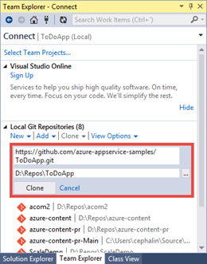
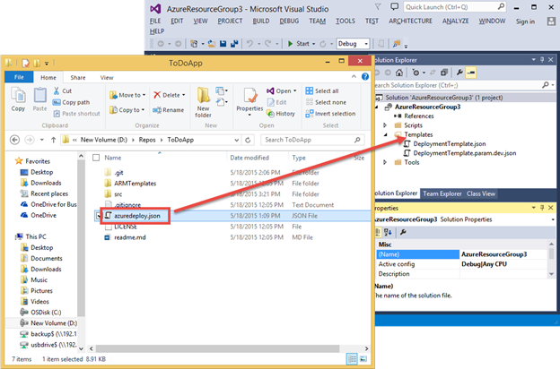
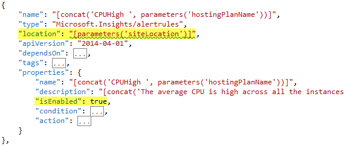

<properties
    pageTitle="Eseguire il provisioning e distribuire microservices prevedibili in Azure"
    description="Informazioni su come distribuire un'applicazione composta da microservices nel servizio di App Azure in un'unica e in modo prevedibile utilizzando JSON risorse gruppo modelli e gli script di PowerShell."
    services="app-service"
    documentationCenter=""
    authors="cephalin"
    manager="wpickett"
    editor="jimbe"/>

<tags
    ms.service="app-service"
    ms.workload="na"
    ms.tgt_pltfrm="na"
    ms.devlang="na"
    ms.topic="article"
    ms.date="01/06/2016"
    ms.author="cephalin"/>

# Eseguire il provisioning e distribuire microservices prevedibili in Azure #

In questa esercitazione viene illustrato come effettuare il provisioning e distribuire un'applicazione composta da [microservices](https://en.wikipedia.org/wiki/Microservices) nel [Servizio App Azure](/services/app-service/) in un'unica e in modo prevedibile utilizzando JSON risorse gruppo modelli e gli script di PowerShell. 

Quando il provisioning e distribuzione di applicazioni vasta scala che sono costituite da altamente disaccoppiato microservices, ripetibilità e prevedibilità è fondamentale, per il successo. [Servizio di App Azure](/services/app-service/) consente di creare microservices che includono web apps, App per dispositivi mobili, API App e App logica. [Gestione risorse di Azure](../azure-resource-manager/resource-group-overview.md) consente di gestire tutti i microservices come unità, nonché le dipendenze delle risorse, ad esempio database e delle impostazioni dei controlli di origine. È inoltre possibile distribuire a questo punto, ad esempio un'applicazione tramite JSON modelli e gli script di PowerShell semplice. 

[AZURE.INCLUDE [app-service-web-to-api-and-mobile](../../includes/app-service-web-to-api-and-mobile.md)] 

## Viene eseguita ##

Nell'esercitazione, distribuire un'applicazione che include:

-   Due web App (ad esempio, due microservices)
-   Un Database SQL di back-end
-   Le impostazioni dell'App, le stringhe di connessione e controllo del codice sorgente
-   Informazioni dettagliate sui applicazione, gli avvisi, impostazioni di adattamento automatico

## Strumenti da utilizzare ##

In questa esercitazione, utilizzare gli strumenti seguenti. Poiché non è esaustivo discussione su strumenti, imposto doppio lo scenario-to-end e solo offrono una breve introduzione a ogni, e nel punto in cui è possibile trovare ulteriori informazioni su di esso. 

### Modelli di gestione risorse Azure (JSON) ###
 
Ogni volta che si crea un'app web in Azure App servizio, ad esempio, Gestione risorse di Azure utilizza un modello JSON per creare l'intero gruppo di risorse con le risorse del componente. Un modello complesso di [Azure Marketplace](/marketplace) come app [WordPress Scalable](/marketplace/partners/wordpress/scalablewordpress/) possono includere il database MySQL, gli account di archiviazione, il piano di servizio di App, l'applicazione web, le regole di avviso, le impostazioni dell'app, autoscale impostazioni e informazioni e tutti questi modelli sono disponibili per l'utente tramite PowerShell. Per informazioni su come scaricare e usare questi modelli, vedere [Uso di PowerShell Azure Gestione risorse Azure](../powershell-azure-resource-manager.md).

Per ulteriori informazioni sui modelli di Manager delle risorse di Azure, vedere [Creazione di modelli di Manager delle risorse Azure](../resource-group-authoring-templates.md)

### Azure SDK 2.6 per Visual Studio ###

SDK più recente sono numerosi miglioramenti per il supporto del modello di gestione risorse nell'editor di JSON. È possibile consente di creare un modello di gruppo di risorse da zero o aprire un modello JSON esistente (ad esempio un modello di raccolta scaricato) per la modifica, inserire il file di parametri e anche distribuire il gruppo di risorse direttamente da una soluzione di gruppo di risorse Azure.

Per ulteriori informazioni, vedere [Azure SDK 2.6 per Visual Studio](/blog/2015/04/29/announcing-the-azure-sdk-2-6-for-net/).

### Azure PowerShell 0.8.0 o versioni successive ###

A partire dalla versione 0.8.0, l'installazione di Azure PowerShell include il modulo di gestione delle risorse Azure oltre il modulo di Azure. Il nuovo modulo consente di creare uno script di distribuzione dei gruppi di risorse.

Per ulteriori informazioni, vedere [Uso di PowerShell Azure Gestione risorse Azure](../powershell-azure-resource-manager.md)

### Esplora risorse Azure ###

Questo [strumento anteprima](https://resources.azure.com) consente di esplorare le definizioni di JSON di tutti i gruppi di risorse in abbonamento e le singole risorse. Nello strumento, è possibile modificare le definizioni di JSON di una risorsa, eliminare un'intera gerarchia delle risorse e creare nuove risorse.  Le informazioni disponibili in questo strumento sono molto utile per la creazione di modello perché Mostra le proprietà che è necessario impostare per un determinato tipo di risorsa, i valori corretti e così via. È anche possibile creare il gruppo di risorse nel [Portale di Azure](https://portal.azure.com/)e quindi controllare le relative definizioni JSON nello strumento di Esplora risorse che consentono di creare un gruppo di risorse template da.

### Distribuire al pulsante Azure ###

Se si utilizza GitHub per il codice sorgente, è possibile inserire un [Distribuisci al pulsante Azure](/blog/2014/11/13/deploy-to-azure-button-for-azure-websites-2/) nel file Leggimi. MD, che consente una distribuzione di chiavi in interfaccia utente per Azure. Mentre è possibile eseguire questa operazione per qualsiasi applicazione web semplice, è possibile estendere questa opzione per consentire la distribuzione di un intero gruppo di risorse inserendo un file azuredeploy.json nella radice archivio. In questo file JSON, che contiene il modello di gruppo di risorse, da utilizzare per la distribuzione di Azure pulsante per creare il gruppo di risorse. Ad esempio, vedere l'esempio [ToDoApp](https://github.com/azure-appservice-samples/ToDoApp) , che verrà utilizzato in questa esercitazione.

## Ottenere il modello di gruppo di risorse di esempio ##

Ora Iniziamo subito all'opera.

1.  Passare all'esempio servizio App [ToDoApp](https://github.com/azure-appservice-samples/ToDoApp) .

2.   In readme.md, fare clic su **Distribuisci in Azure**.
 
3.  Si è stati al sito di [distribuzione di azure](https://deploy.azure.com) e viene chiesto di distribuzione parametri di input. Si noti che la maggior parte dei campi sono popolata con il nome del repository e alcune stringhe casuali. È possibile modificare tutti i campi se si vuole, ma ciò che è necessario immettere sono l'accesso amministrativo a SQL Server e la password, quindi fare clic su **Avanti**.
 
    

4.  Fare clic su **Distribuisci** per avviare il processo di distribuzione. Dopo il processo viene eseguito fino al completamento, fare clic su http://todoapp*XXXX*. collegamento azurewebsites.net per esplorare l'applicazione distribuita. 

    

    L'interfaccia utente potrebbe essere leggermente più lente quando si naviga prima di tutto a tale perché sono appena avvio delle App, ma indurre se stessi che si tratti di un'applicazione di funzionalità complete.

5.  Tornare nella pagina Distribuisci fare clic sul collegamento **Gestisci** per visualizzare la nuova applicazione nel portale di Azure.

6.  Nell'elenco a discesa **Essentials** , fare clic sul collegamento di gruppo di risorse. Si noti che l'applicazione web è già connesso all'archivio GitHub in **Progetto esterno**. 

    
 
7.  In e il gruppo delle risorse tenere presente che esistono già due web apps e un Database di SQL in un gruppo di risorse.

    
 
Tutto ciò che si è appena visto in pochi minuti brevi è un'applicazione di microservice di due distribuito, con tutti i componenti, dipendenze, impostazioni, database e la pubblicazione continua, configurare da un'orchestrazione automatizzata in Gestione risorse di Azure. Tutto che ciò da due fattori:

-   Distribuisci al pulsante Azure
-   azuredeploy.JSON nella radice repo

È possibile distribuire questa stessa applicazione decine, centinaia o migliaia di volte e avere la stessa configurazione esatta ogni volta. La ripetibilità e prevedibilità di questo approccio consente di distribuire le applicazioni di vasta scala con facilità e confidenza.

## Esaminare o modificare AZUREDEPLOY. JSON ##

Ora esaminiamo come archivio GitHub è stata impostata. Sarà utilizzando l'editor JSON in .NET SDK Azure, se non è stato già installato [Azure .NET SDK 2.6](/downloads/), farlo adesso.

1.  Duplicare repository [ToDoApp](https://github.com/azure-appservice-samples/ToDoApp) utilizzando lo strumento fra preferito. Nella schermata, questa scelta in Esplora aree di Team in Visual Studio 2013.

    

2.  Dalla radice repository aprire azuredeploy.json in Visual Studio. Se il riquadro struttura JSON non è visibile, è necessario installare Azure .NET SDK.

    

Non verranno per descrivere tutti i dettagli del formato JSON, ma la sezione [Altre risorse](#resources) vengono forniti i collegamenti per l'apprendimento la lingua del modello gruppo risorse. In questo caso, solo userò per dimostrare di essere interessanti funzionalità che consentono di iniziare a prendere modello personalizzato per la distribuzione di app.

### Parametri ###

Esaminare la sezione parametri per verificare che la maggior parte dei parametri sono cosa pulsante **Distribuisci in Azure** viene richiesto di input. Il sito dietro al pulsante **Distribuisci in Azure** popola l'interfaccia utente utilizzando i parametri definiti in azuredeploy.json di input. Questi parametri vengono utilizzati le definizioni delle risorse, ad esempio i nomi delle risorse, valori di proprietà e così via.

### Risorse ###

Il nodo risorse, è possibile vedere che sono definite 4 risorse principale, inclusi un'istanza di SQL Server, un piano di servizio di App e due web app. 

#### Piano di servizio di App ####

Iniziamo con una risorsa a livello radice semplice nel JSON. Nella struttura JSON, fare clic sul piano di servizio App denominato **[hostingPlanName]** per evidenziare il codice JSON corrispondente. 

Si noti che la `type` elemento specifica la stringa per un piano di servizio App (effettuata una server farm volta lungo, long fa) e altri elementi e proprietà compilate utilizzando i parametri definiti nel file JSON e questa risorsa non dispone di tutte le risorse annidate.

>[AZURE.NOTE] Si noti inoltre che il valore di `apiVersion` indica Azure quale versione dell'API REST per usare la definizione di risorse JSON con e può influire sulla modalità di formattazione della risorsa all'interno di `{}`. 

#### SQL Server ####

Fare clic su risorsa di SQL Server denominata **SQL Server** in struttura JSON.

 
Tenere presente quanto segue il codice JSON evidenziato:

-   L'utilizzo di parametri garantisce che le risorse create sono denominate e configurate in modo da renderli coerenti tra loro.
-   La risorsa di SQL Server ha due risorse annidate, ogni ha un valore diverso per `type`.
-   Le risorse nidificate all'interno di `“resources”: […]`, in cui sono definite il database e le regole del firewall, hanno un `dependsOn` elemento che specifica l'ID risorsa della risorsa di SQL Server a livello radice. In questo modo Gestione risorse di Azure, "prima di creare la risorsa, altre risorse devono ancora esistenti. e se tale altra risorsa è stata definita nel modello, quindi si crea una prima di tutto".

    >[AZURE.NOTE] Per informazioni dettagliate su come utilizzare il `resourceId()` funzione, vedere [Funzioni di modello di Azure Manager delle risorse](../resource-group-template-functions.md).

-   L'effetto del `dependsOn` elemento è che Gestione risorse di Azure possibile sapere quali risorse possono essere create in parallelo e quali risorse devono essere create in sequenza. 

#### Web app ####

A questo punto, passiamo a effettivo web App, che risultano più complesse. Fare clic su app web [variables('apiSiteName')] nella struttura JSON per evidenziare il relativo codice JSON. Si noterà che aspetti vengono selezionate più interessante. A tale scopo, verrà discusso caratteristiche uno alla volta:

##### Risorsa principale #####

L'applicazione web dipende da due diverse risorse. Questo significa che Gestione risorse di Azure creerà l'applicazione web solo dopo aver creati il piano di servizio di App e istanza di SQL Server.

##### Impostazioni dell'App #####

Le impostazioni di app definite anche come risorsa annidata.

Nel `properties` elemento per `config/appsettings`, si dispongano di due le impostazioni dell'app nel formato `“<name>” : “<value>”`.

-   `PROJECT`è un' [impostazione di KUDU](https://github.com/projectkudu/kudu/wiki/Customizing-deployments) che indica la distribuzione di Azure il progetto da utilizzare in una soluzione di Visual Studio più progetti. Si vedrà in un secondo momento configurazione controllo del codice sorgente, ma poiché il codice ToDoApp si trova in una soluzione di Visual Studio più progetti, è necessario che questa impostazione.
-   `clientUrl`è utilizzato semplicemente un'app impostazione che il codice dell'applicazione.

##### Stringhe di connessione #####

Le stringhe di connessione definite anche come risorsa annidata.

Nel `properties` elemento per `config/connectionstrings`, ogni stringa di connessione è definita anche come una coppia di nome: valore, con il formato specifico della `“<name>” : {“value”: “…”, “type”: “…”}`. Per la `type` elemento, i valori possibili sono `MySql`, `SQLServer`, `SQLAzure`, e `Custom`.

>[AZURE.TIP] Per un elenco definitivo dei tipi di stringa di connessione, eseguire il seguente comando in Azure PowerShell: \[Enum]::GetNames("Microsoft.WindowsAzure.Commands.Utilities.Websites.Services.WebEntities.DatabaseType")
    
##### Controllo del codice sorgente #####

Le impostazioni di controllo origine definite anche come risorsa annidata. Gestione risorse di Azure utilizza questa risorsa per configurare la pubblicazione continua (vedere avvertenza in `IsManualIntegration` in un secondo momento) e anche per avviare la distribuzione di codice dell'applicazione automaticamente durante l'elaborazione di file JSON.

`RepoUrl`e `branch` deve essere abbastanza intuitivo e puntare a repository fra e il nome del ramo di pubblicare i dati. Nuovo, questi sono definiti dalle parametri di input. 

Nota nel `dependsOn` elemento che, oltre alla risorsa app web stessa, `sourcecontrols/web` dipende anche `config/appsettings` e `config/connectionstrings`. In questo modo una volta `sourcecontrols/web` è configurato, il processo di distribuzione Azure tenterà automaticamente distribuire, compilare e avviare il codice dell'applicazione. Di conseguenza, l'inserimento di questa dipendenza consente di verificare che l'applicazione abbia accesso alle impostazioni di app necessari e stringhe di connessione prima di eseguita il codice dell'applicazione. 

>[AZURE.NOTE] Si noti inoltre che `IsManualIntegration` è impostato su `true`. La proprietà è necessaria in questa esercitazione perché non è effettivamente proprietari repository GitHub e pertanto non è possibile effettivamente dell'autorizzazione di Azure per configurare la pubblicazione continua da [ToDoApp](https://github.com/azure-appservice-samples/ToDoApp) (ad esempio inviare aggiornamenti automatici archivio di Azure). È possibile usare il valore predefinito `false` per il repository specificato solo se sono state configurate le credenziali GitHub del proprietario nel [portale di Azure](https://portal.azure.com/) prima. In altre parole, se si imposta in precedenza il controllo del codice sorgente GitHub o BitBucket per qualsiasi app nel [Portale di Azure](https://portal.azure.com/) , usando le credenziali dell'utente, quindi Azure verrà memorizza le credenziali e utilizzarli ogni volta che si distribuisce qualsiasi app da GitHub o BitBucket in futuro. Tuttavia, se è ancora stata eseguita questa operazione, distribuzione del modello JSON avrà esito negativo durante il tentativo di configurare le impostazioni di codice sorgente dell'applicazione web perché che non è possibile accedere a GitHub o BitBucket con le credenziali del proprietario dell'archivio di gestione risorse di Azure.

## Confrontare il modello JSON con gruppo di risorse distribuito ##

In questo caso, è possibile accedere tramite pale tutti dell'applicazione web nel [Portale di Azure](https://portal.azure.com/), ma è disponibile un altro strumento che come utile, se non è più. Passare allo strumento anteprima [Esplora risorse Azure](https://resources.azure.com) , che offre una rappresentazione in formato JSON di tutti i gruppi di risorse le sottoscrizioni, in cui si trovano effettivamente in Azure back-end. È inoltre possibile visualizzare la gerarchia JSON del gruppo di risorse in Azure corrisponde con la gerarchia nel file del modello utilizzato per la creazione.

Ad esempio, quando si accedere allo strumento [Esplora risorse Azure](https://resources.azure.com) ed espandere i nodi in Esplora risorse, visualizzare il gruppo di risorse e le risorse di livello principale che sono stati raccolti nei tipi di risorse corrispondente.

Se drill-down a un'app web, sarà possibile visualizzare i dettagli di configurazione app web simili di sotto schermata:

Di nuovo le risorse annidate devono avere una gerarchia molto simile a quelle nel file di modello JSON e risulta le impostazioni di app, le stringhe di connessione, ecc., riportate correttamente nel riquadro JSON. Assenza di impostazioni descritte di seguito può indicare un problema con i file JSON e consentono di risolvere i problemi di un file di modello JSON.

## Distribuire il modello di gruppo di risorse se stessi ##

Pulsante **Distribuisci in Azure** è grande, ma è possibile distribuire il modello di gruppo di risorse in azuredeploy.json solo se si dispone già inserito azuredeploy.json a GitHub. Azure .NET SDK vengono forniti anche gli strumenti per la distribuzione di qualsiasi file di modello JSON direttamente dal computer locale. A tale scopo, eseguire la procedura seguente:

1.  In Visual Studio, fare clic su **File** > **Nuovo** > **progetto**.

2.  Fare clic su **Visual c#** > **Cloud** > **Gruppo di risorse di Azure**, quindi fare clic su **OK**.

    

3.  In **Seleziona modello di Azure**, selezionare **Modello vuoto** e fare clic su **OK**.

4.  Trascinare azuredeploy.json nella cartella **modelli** del nuovo progetto.

    

5.  In Esplora soluzioni aprire azuredeploy.json copiata.

6.  Ai fini di questa dimostrazione, aggiungere alcune risorse utili all'applicazione informazioni standard per il file JSON, facendo clic su **Aggiungi risorsa**. Se si è interessati solo nella distribuzione del file JSON, andare ai passaggi di distribuzione.

    

7.  Selezionare **Applicazione approfondimenti per le applicazioni Web**, quindi verificare che un servizio di App esistente pianificare e web app sia selezionata e quindi fare clic su **Aggiungi**.

    

    Sarà in grado di visualizzare diverse nuove risorse che, a seconda della risorsa e funzionalità, dipendenza il piano di servizio App o web app. Queste risorse non sono attivate per la definizione esistente e che si desidera modificare questa impostazione.

    
 
8.  Nella struttura JSON, fare clic su **appInsights AutoScale** per evidenziare il relativo codice JSON. Questa è l'impostazione di ridimensionamento per il piano di servizio di App.

9.  Nel codice JSON evidenziato, individuare il `location` e `enabled` proprietà e impostarli come illustrato di seguito.

    

10. Nella struttura JSON, fare clic su **CPUHigh appInsights** per evidenziare il relativo codice JSON. Si tratta di un avviso.

11. Individuare il `location` e `isEnabled` proprietà e impostarli come illustrato di seguito. Eseguire la stessa operazione per gli altri tre avvisi alla (elettriche viola).

    

12. A questo punto si è pronti distribuire. Fare clic sul progetto e selezionare **Distribuisci** > **Nuova distribuzione**.

    

13. Se non è già fatto, accedere all'account di Azure.

14. Selezionare un gruppo di risorse esistente nell'abbonamento o crearne uno nuovo, selezionare **azuredeploy.json**e quindi fare clic su **Modifica parametri**.

    

    A questo punto, sarà possibile modificare tutti i parametri definiti nel file di modello in una tabella pile. Parametri che definiscono le impostazioni predefinite già avrà valori predefiniti e i parametri che definiscono un elenco di valori consentiti verranno visualizzati come elenchi a discesa.

    

15. Compilare tutti i parametri vuoti e utilizzare l' [indirizzo repo GitHub ToDoApp](https://github.com/azure-appservice-samples/ToDoApp.git) in **repoUrl**. Scegliere **Salva**.
 
    

    >[AZURE.NOTE] Il ridimensionamento automatico è una funzionalità disponibile nel livello **Standard** o versioni successive e gli avvisi di livello di piano sono caratteristiche disponibili nel livello **base** o successiva, è necessario impostare il parametro **sku** **Standard** o **Premium** per vedere tutti i nuovi App approfondimenti accendere risorse.
    
16. Fare clic su **Distribuisci**. Se è selezionata l'opzione **Salva password**, la password verrà salvata nello parametro file **in formato testo normale**. In caso contrario, verrà chiesto di immettere la password del database durante il processo di distribuzione.

Questo è tutto! A questo punto è sufficiente passare al [Portale di Azure](https://portal.azure.com/) e lo strumento di [Azure Resource Explorer](https://resources.azure.com) per visualizzare i nuovi avvisi e impostazioni autoscale aggiunte al JSON distribuito applicazione.

La procedura descritta in questa sezione principalmente eseguita le operazioni seguenti:

1.  Preparare il file del modello
2.  Creare un file di parametri da allegare il file del modello
3.  Distribuire il file del modello con il file di parametro

L'ultimo passaggio scopo, un cmdlet di PowerShell. Per vedere quali Visual Studio situazioni quando distribuito l'applicazione, aprire Scripts\Deploy AzureResourceGroup.ps1. Esiste una grande quantità di codice sono, ma solo imposto evidenziare tutto il codice pertinente che necessarie per distribuire il file del modello del file di parametri.

Il cmdlet ultimo `New-AzureResourceGroup`, è quello che esegue l'azione. Tutto ciò deve dimostrare all'utente che, con l'aiuto di utensili, è semplice distribuire l'applicazione cloud prevedibili. Ogni volta che si esegue il cmdlet sullo stesso modello con lo stesso file di parametro, che si desidera ottenere lo stesso risultato.

## Riepilogo ##

In attrezzi, ripetibilità e prevedibilità sono chiavi per una corretta distribuzione di un'applicazione di vasta scala composta da microservices. In questa esercitazione sono state realizzate un'applicazione di due microservice in Azure come gruppo singola risorsa utilizzando il modello di gestione di risorse Azure. Ha concesso le informazioni che necessarie per avviare la conversione dell'applicazione in Azure in un modello e può effettuare il provisioning e distribuire prevedibili. 

## Passaggi successivi ##

Informazioni su come [applicare metodi agile e pubblicare l'applicazione microservices con facilità](app-service-agile-software-development.md) e distribuzione avanzate tecniche come [distribuzione flighting](app-service-web-test-in-production-controlled-test-flight.md) facilmente.

## Altre risorse ##

-   [Lingua del modello di Azure Manager delle risorse](../resource-group-authoring-templates.md)
-   [Creazione di modelli di gestione risorse di Azure](../resource-group-authoring-templates.md)
-   [Funzioni di modello Azure Manager delle risorse](../resource-group-template-functions.md)
-   [Distribuire un'applicazione con il modello di gestione risorse di Azure](../resource-group-template-deploy.md)
-   [Utilizzo di PowerShell Azure Azure Gestione risorse](../powershell-azure-resource-manager.md)
-   [Risoluzione dei problemi distribuzioni di gruppo di risorse in Azure](../resource-manager-troubleshoot-deployments-portal.md)

 
