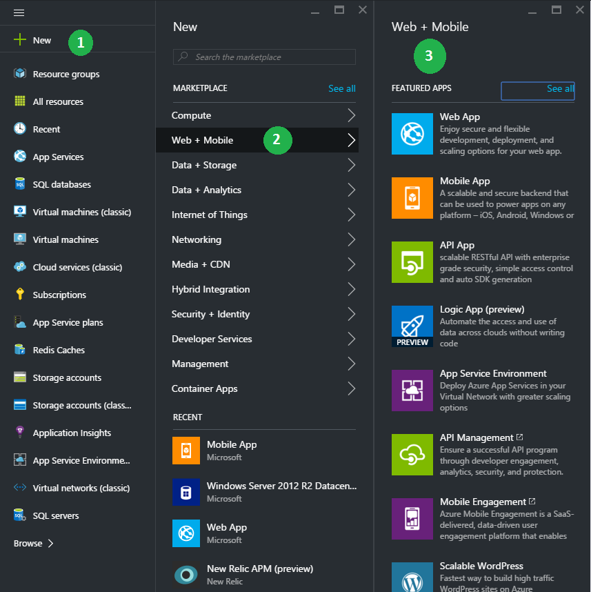

<properties
    pageTitle="Guida di riferimento per lo spostamento tra il portale di Azure"
    description="Scoprire le esperienze utente diverso per App servizio Web tra il portale di gestione e il portale di Azure"
    services="app-service"
    documentationCenter=""
    authors="jaime-espinosa"
    manager="wpickett"
    editor="jimbe"/>

<tags
    ms.service="app-service"
    ms.workload="na"
    ms.tgt_pltfrm="na"
    ms.devlang="na"
    ms.topic="article"
    ms.date="02/26/2016"
    ms.author="jaime-espinosa"/>

# Guida di riferimento per lo spostamento tra il portale di Azure

Siti Web Azure sono ora denominati [App servizio Web Apps](http://go.microsoft.com/fwlink/?LinkId=529714). Microsoft sta aggiornando tutta la documentazione per riflettere questa modifica del nome e per le istruzioni per il portale di Azure. Fino al completamento del processo, è possibile usare questo documento come una Guida per l'utilizzo con Web Apps nel portale di Azure.

[AZURE.INCLUDE [app-service-web-to-api-and-mobile](../../includes/app-service-web-to-api-and-mobile.md)] 
 
## Il futuro del portale classica di Azure

Mentre si noterà personalizzazione nel portale classica di Azure, il portale è in corso vengono sostituiti dal portale dei Azure. Come il portale classico è essere gradualmente, lo stato attivo per un nuovo sviluppo di preparare il portale di Azure. Tutte le nuove caratteristiche per le applicazioni Web vengono recapitata nel portale di Azure. Iniziare a usare il portale di Azure in modo da sfruttare la più recente e ottenere il massimo disporre di applicazioni Web per l'offerta.

## Differenze di layout tra il portale classica Azure e Azure portale

Nel portale classico, sul lato sinistro sono elencati tutti i servizi Azure. Spostamento nel portale di classica segue una struttura ad albero, in cui si inizia dal servizio e passare a ogni elemento. Questa struttura funziona anche quando la gestione dei componenti indipendenti. Tuttavia, applicazioni basate su Azure sono un insieme di servizi interconnessi e la struttura non è ideale per l'utilizzo di raccolte dei servizi. 

Portale di Azure è semplice creare applicazioni-to-end con i componenti da più servizi. Il portale è organizzato come *viaggi*. Un *viaggio* è una serie di *pale*, che sono contenitori per i diversi componenti. Ad esempio, la configurazione il ridimensionamento automatico per un'app web è un *viaggio* che consente di accedere pale diversi come illustrato nell'esempio seguente: e il **sito web** (che titolo blade non è ancora stato aggiornato per utilizzare la nuova terminologia), e **l'Impostazioni** ed e lo **scalabilità** . Nell'esempio, il ridimensionamento automatico viene impostato dipendono utilizzo della CPU, in modo che non vi è una **Percentuale di CPU** pala. I componenti di *pale* sono denominati *parti*, che aspetto riquadri. 

## Esempio di spostamento: creare un'app web

Creazione di nuove app web è ancora semplice come 1-2-3. L'immagine seguente illustra il portale classico e il portale side-by-side per dimostrare che non molto è stato modificato il numero dei passaggi necessari per ottenere un'app web e in esecuzione. 

Nel portale è possibile scegliere da tipi di web App, incluse le applicazioni di raccolta popolari come WordPress più comuni. Per un elenco completo delle applicazioni disponibili, visitare il sito [Azure Marketplace].

Quando si crea un'app web, specificare l'URL, piano di servizio di App e posizione nel portale nello stesso modo in cui eseguire nel portale di classica. 

Inoltre, il portale consente di definire le altre impostazioni comuni. Ad esempio, [gruppi di risorse](../azure-resource-manager/resource-group-overview.md) consentono di visualizzare e gestire le relative risorse Azure. 

## Esempio di spostamento: caratteristiche e impostazioni

Tutte le impostazioni e caratteristiche a questo punto sono raggruppate in modo logico in un singolo blade, da cui è possibile passare.

Ad esempio, è possibile creare domini personalizzati facendo clic su **domini personalizzati e SSL** in e **l'Impostazioni** .

Per impostare un avviso di monitoraggio, fare clic su **richieste ed errori** e quindi **Aggiungere avviso**.

Per abilitare la diagnostica, fare clic su **registri di diagnostica** in e **l'Impostazioni** .

 
Per configurare le impostazioni dell'applicazione, fare clic su **Impostazioni applicazione** in e **l'Impostazioni** . 

Diverso da quello marchio rinominati o raggruppate in modo diverso per rendere più semplice per trovarli più facilmente alcuni dettagli nel portale. Ad esempio, di seguito è una schermata della pagina corrispondente per app impostazioni (**Configura**) nel portale di classica.

## Altre risorse

[Azure Portal]: https://portal.azure.com
[Azure Marketplace]: /marketplace/

>[AZURE.NOTE] Se si desidera iniziare a utilizzare il servizio di App Azure prima di iscriversi a un account Azure, accedere al [Servizio App provare](http://go.microsoft.com/fwlink/?LinkId=523751), in cui è possibile creare immediatamente un'app web starter breve nel servizio di App. Nessun carte di credito obbligatorio; Nessun impegni.

## Novità
* Per una Guida per la modifica da siti Web al servizio App vedere: [servizio App Azure e il relativo impatto sulla esistente servizi di Windows Azure](http://go.microsoft.com/fwlink/?LinkId=529714)
 
