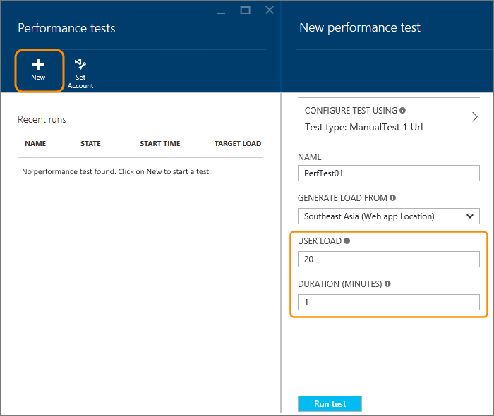

<properties
   pageTitle="Verificare le prestazioni dell'applicazione web Azure | Microsoft Azure"
   description="Eseguire test Azure web app per controllare la modalità di gestione di carico utente dell'applicazione. Misurare il tempo di risposta e trovare gli errori che possono indicare problemi."
   services="app-service\web"
   documentationCenter=""
   authors="ecfan"
   manager="douge"
   editor="jimbe"/>

<tags
   ms.service="app-service-web"
   ms.workload="web"
   ms.tgt_pltfrm="na"
   ms.devlang="na"
   ms.topic="article"
   ms.date="05/25/2016"
   ms.author="estfan; manasma; ahomer"/>

# <a name="performance-test-your-azure-web-app-under-load"></a>App web Azure in condizioni di carico test delle prestazioni

Verificare le prestazioni dell'applicazione web prima di avviarlo o distribuire gli aggiornamenti di produzione. In questo modo, è possibile valutare meglio se l'app è pronta per il rilascio. Aspetto più sicuro che l'app consente di gestire il traffico durante l'uso di punta o presso il successivo push di marketing.

Durante l'anteprima pubblica, è possibile test delle prestazioni con l'app gratuitamente nel portale di Azure.
Questi test simulano carico utente l'App in un periodo di tempo specifico e misurano risposta dell'applicazione. Ad esempio, i risultati del test mostrano come rapidamente l'app risponde a un determinato numero di utenti. Verranno visualizzati anche il numero di richieste non è riuscita, che possono indicare problemi con l'app.      


## <a name="before-you-start"></a>Prima di iniziare

* È necessario un [abbonamento Azure](https://account.windowsazure.com/subscriptions), se non è già disponibile. Informazioni su come è possibile [aprire un account Azure gratuitamente](https://azure.microsoft.com/pricing/free-trial/?WT.mc_id=A261C142F).

* È necessario un account di [Visual Studio Team Services](https://www.visualstudio.com/products/what-is-visual-studio-online-vs) per mantenere la cronologia di test delle prestazioni. Un account adatto viene creato automaticamente quando si configura il test. Oppure è possibile creare un nuovo account o utilizzare un account esistente se si è il proprietario dell'account. 

* Distribuire l'app per il testing in un ambiente di produzione. Impostare l'app di un piano di servizio App diversa da quella piano utilizzato nell'ambiente di produzione. In questo modo non influisce su tutti gli attuali clienti o rallentare l'app di produzione. 

## <a name="set-up-and-run-your-performance-test"></a>Impostare ed eseguire il test

0.  Accedere al [portale di Azure](https://portal.azure.com). Per usare un account di Visual Studio Team Services che si è proprietari, accedere con il proprietario dell'account.

0.  Passare all'app web.

    

0.  Passare a **Test**.

    
 
0. A questo punto collegare un account di [Visual Studio Team Services](https://www.visualstudio.com/products/what-is-visual-studio-online-vs) per mantenere la cronologia di test delle prestazioni.

    Se si dispone di un account di Team Services da utilizzare, selezionare tale account. In caso contrario, creare un nuovo account.

    

0.  Creare il test. Impostare i dettagli ed eseguire il test. 

È possibile controllare i risultati in tempo reale durante l'esecuzione di test.

Si supponga, ad esempio, che esiste un'app fornito fuori tagliandi alla vendita per le festività dell'anno. Questo evento la durata di 15 minuti con un carico massimo di 100 clienti contemporaneamente. È possibile raddoppiare il numero dei clienti anno corrente. È possibile migliorare la soddisfazione del cliente, riducendo i tempi di caricamento della pagina da 5 per 2 secondi. Pertanto, test verrà eseguito le prestazioni dell'applicazione aggiornati con 250 utenti per 15 minuti.

È necessario simulare carico il nostro App generando utenti virtuali (clienti) che visitano il sito web nello stesso momento. Verranno visualizzate Contattaci quante richieste non funziona o risponde lentamente.

  

   *  URL predefinito dell'applicazione web viene aggiunto automaticamente. 
   È possibile modificare l'URL per testare le altre pagine (solo in richieste di HTTP GET).

   *  Per simulare condizioni locali e ridurre la latenza, selezionare una posizione più vicina agli utenti per la generazione di caricamento.

  Ecco il test in corso. Durante il primo minuto page carica inferiori vogliamo.

  

  Al termine, il test è informazioni che il caricamento della pagina in modo più rapido dopo il primo minuto. Consente di identificare nel punto in cui potrebbe essere necessario avviare la risoluzione del problema.

  

## <a name="test-multiple-urls"></a>URL più del test

È anche possibile eseguire test che includa più URL che rappresentano uno scenario di utente-to-end per caricare un file di Visual Studio Web Test. Alcuni modi è possibile creare un Visual Studio Web Test file sono:

* [Acquisire il traffico utilizzando Fiddler ed esportare come file Visual Studio Web Test](http://docs.telerik.com/fiddler/Save-And-Load-Traffic/Tasks/VSWebTest)
* [Creare un file di test di carico in Visual Studio](https://www.visualstudio.com/docs/test/performance-testing/run-performance-tests-app-before-release)

Per caricare ed eseguire un file di Visual Studio Web Test:
 
0. Seguire i passaggi precedenti per aprire e il **test delle prestazioni di nuovo** .
   In questo blade scegliere l'opzione di TEST utilizza CONFIGFURE per aprire e il **test configura utilizzando** .  

    

0. Controllare che il tipo di TEST è impostato su **Visual Studio Web Test** e selezionare il file di archivio di HTTP.
    Usare l'icona "cartella" per aprire la finestra di dialogo Selettore file.

    

    Dopo il file è stato caricato, viene visualizzato l'elenco degli URL venga testata nella sezione URL DETAILS.
 
0. Specificare il carico di utenti e durata test, quindi scegliere **eseguire test**.

    

    Al termine dell'operazione di test visualizzare i risultati in due riquadri. Riquadro a sinistra mostra le informazioni di performnace come una serie di grafici.

    

    Riquadro a destra viene visualizzato un elenco delle richieste non riuscite, con il tipo di errore e il numero di volte in cui che si è verificato.

    

0. Eseguire di nuovo il test scegliendo l'icona **rieseguire** nella parte superiore del riquadro di destra.

    

##  <a name="q--a"></a>Domande e risposte

#### <a name="q-is-there-a-limit-on-how-long-i-can-run-a-test"></a>D: è presente un limite in quanto tempo è possibile eseguire un test? 

**A**: Sì, è possibile eseguire il test fino a un'ora nel portale di Azure.

#### <a name="q-how-much-time-do-i-get-to-run-performance-tests"></a>D: come quantità di tempo visualizzato per l'esecuzione di test? 

**A**: dopo l'anteprima pubblica, viene visualizzato 20.000 utente virtuale minuti (VUMs) gratuito ogni mese con l'account di Visual Studio Team Services. Un VUM è il numero di utenti virtuali moltiplicati per il numero di minuti del test. Se le proprie esigenze superano il limite gratuito, è possibile acquistare più tempo e pagare solo per i quali si utilizza.

#### <a name="q-where-can-i-check-how-many-vums-ive-used-so-far"></a>D: dove si può verificare quanti VUMs ho utilizzato finora?

**A**: È possibile controllare questo importo nel portale di Azure.


#### <a name="q-what-is-the-default-option-and-are-my-existing-tests-impacted"></a>D: qual è l'opzione predefinita e sono interessati i test esistenti?

**A**: l'opzione predefinita per i test di carico è un test manuale - lo stesso prima l'URL più test opzione è stata aggiunta al portale.
Il test esistenti continuare a usare l'URL configurato e funzionano come in precedenza.

#### <a name="q-what-features-not-supported-in-the-visual-studio-web-test-file"></a>D: quali caratteristiche non supportate nel file di Visual Studio Web Test?

**A**: attualmente questa caratteristica non supporta plug-in Test Web, origini dati e le regole di estrazione. È necessario modificare il file di Test Web per rimuoverli. Ci auguriamo che aggiungere il supporto per queste funzionalità futuri aggiornamenti.

#### <a name="q-does-it-support-any-other-web-test-file-formats"></a>D: supporta altri formati di file di Test Web?
  
**A**: in presenta solo Visual Studio Test Web sono supportati i file in formato.
Si è soddisfatti feedback degli utenti è se occorre assistenza per altri formati di file. Inviare tramite posta elettronica al [vsoloadtest@microsoft.com](mailto:vsoloadtest@microsoft.com).

#### <a name="q-what-else-can-i-do-with-a-visual-studio-team-services-account"></a>D: cos'altro è possibile eseguire con un account di Visual Studio Team Services

**A**: per trovare il nuovo account, andare a ```https://{accountname}.visualstudio.com```. Condividere il codice, creare, testare, tenere traccia di lavoro e software di spedizione – tutti nel cloud tramite lo strumento o lingua. Ulteriori informazioni sul modo servizi e le funzionalità di [Visual Studio Team Services](https://www.visualstudio.com/products/what-is-visual-studio-online-vs) in aiutare il team di collaborare più facilmente e distribuzione continue.

## <a name="see-also"></a>Vedere anche

* [Eseguire test cloud semplice](https://www.visualstudio.com/docs/test/performance-testing/getting-started/get-started-simple-cloud-load-test)
* [Eseguire test Apache Jmeter](https://www.visualstudio.com/docs/test/performance-testing/getting-started/get-started-jmeter-test)
* [Registrare e riprodurre i test di carico basato su cloud](https://www.visualstudio.com/docs/test/performance-testing/getting-started/record-and-replay-cloud-load-tests)
* [Prestazioni testare l'app nel cloud](https://www.visualstudio.com/docs/test/performance-testing/getting-started/getting-started-with-performance-testing)
