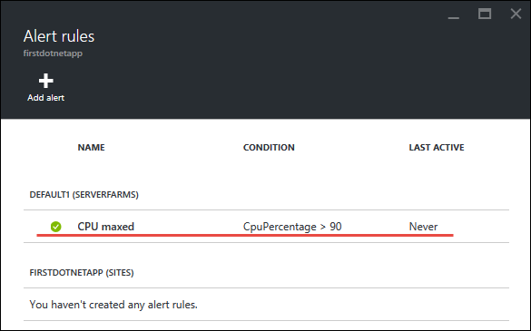

<properties
    pageTitle="Aggiungere funzionalità a un'applicazione web prima"
    description="Aggiungere caratteristiche avanzate per un'app web prima di qualche minuto."
    services="app-service\web"
    documentationCenter=""
    authors="cephalin"
    manager="wpickett"
    editor=""
/>

<tags
    ms.service="app-service-web"
    ms.workload="web"
    ms.tgt_pltfrm="na"
    ms.devlang="na"
    ms.topic="hero-article"
    ms.date="05/12/2016"
    ms.author="cephalin"
/>

# Aggiungere funzionalità a un'applicazione web prima

[Distribuire un'applicazione web prima di Azure cinque minuti](app-service-web-get-started.md), sono realizzate un'app web di esempio al [Servizio App Azure](../app-service/app-service-value-prop-what-is.md). In questo articolo si aggiungeranno rapidamente alcune funzionalità ideale per un'applicazione web distribuita. In pochi minuti, sarà necessario:

- applicare l'autenticazione per gli utenti
- ridimensionare automaticamente l'app
- ricevere avvisi sulle prestazioni dell'app

Indipendentemente da quale applicazione di esempio è stato distribuito nell'articolo precedente, è possibile eseguire nell'esercitazione.

Le tre attività in questa esercitazione sono solo alcuni esempi di numerose funzionalità che viene visualizzato quando si inserisce un'app web nel servizio di App. Molte delle caratteristiche sono disponibili nel livello **gratuito** , che corrisponde cosa della prima applicazione web è in esecuzione, ed è possibile usare il versione di valutazione crediti per provare la funzionalità che richiedono prezzi più livelli. Avere la certezza che l'app web rimane nel livello **gratuito** a meno che non in modo esplicito modifiche a un altro livello prezzo.

>[AZURE.NOTE] L'applicazione web creata con Azure CLI viene eseguito nel livello **gratuito** , che consente solo una sola istanza di macchine Virtuali condivisa con le quote di risorse. Per ulteriori informazioni su cosa viene visualizzato con livello **gratuito** , vedere [limiti del servizio di App](../azure-subscription-service-limits.md#app-service-limits).

## Eseguire l'autenticazione degli utenti

A questo punto, vediamo quanto sia semplice per aggiungere l'autenticazione all'app (ulteriori informazioni su [App servizio di autenticazione/autorizzazione](https://azure.microsoft.com/blog/announcing-app-service-authentication-authorization/)).

1. Nel portale blade per l'app, cui appena aperta fare clic su **Impostazioni** > **autenticazione / autorizzazione**.  
    

2. Fare clic **su** per attivare l'autenticazione.  

4. **Provider di autenticazione**, fare clic su **Azure Active Directory**.  
    

5. In e **l'Impostazioni di Azure Active Directory** , fare clic su **Express**, quindi fare clic su **OK**. Le impostazioni predefinite creare una nuova applicazione di Azure Active Directory nella directory predefinite.  
 

6. Fare clic su **Salva**.  
    

    Dopo aver completata la modifica, verrà visualizzato il segnale acustico notifica verde, insieme a un messaggio.

7. Indietro e il portale dell'app, selezionare il collegamento **URL** (o **esplorare** nella barra dei menu). Il collegamento è un indirizzo HTTP.  
      
    Una volta che viene aperta l'app in una nuova scheda, l'URL casella reindirizzamenti più volte di finisce l'App con un indirizzo HTTPS. Si tratta sia che sta già eseguito l'accesso all'abbonamento Azure e sta autenticati automaticamente nell'app.  
      
    In modo se è ora possibile aprire una sessione non autenticata in un browser diverso, si noterà una schermata di accesso quando si passa allo stesso URL.  
    <!--   -->
   Se si esegue questa operazione non è mai con Azure Active Directory, directory predefinita potrebbe non essere gli utenti di Azure Active Directory. In questo caso, probabilmente l'unico account in tale posizione è l'account Microsoft con l'abbonamento Azure. Questo è il motivo per cui sono state automaticamente eseguito l'accesso all'app nello stesso browser in precedenza.
   Eseguire l'accesso anche la pagina di accesso, è possibile utilizzare lo stesso account Microsoft.

Congratulazioni, per l'autenticazione di tutto il traffico all'app web.

Si può notare nel **autenticazione / autorizzazione** blade che è possibile eseguire molte altre informazioni, ad esempio:

- Consentire l'accesso di social networking
- Attivare più opzioni di accesso
- Modificare il comportamento predefinito quando persone prima passare all'app

Servizio App fornisce che una soluzione attiva chiave per alcuni di autenticazione comune deve in modo che non è necessario fornire la logica di autenticazione se stessi.
Per ulteriori informazioni, vedere [Applicazione servizio di autenticazione/autorizzazione](https://azure.microsoft.com/blog/announcing-app-service-authentication-authorization/).

## Ridimensionare l'app automaticamente in base alla domanda

Successivamente, si autoscale l'app in modo che regolata automaticamente è capacità a rispondere alle esigenze degli utenti (ulteriori informazioni su [scalabilità l'app in Azure](web-sites-scale.md) e [scalare conteggio delle istanze manualmente o automaticamente](../monitoring-and-diagnostics/insights-how-to-scale.md)).

In breve, ridimensionate un'app web in due modi:

- [Scalabilità](https://en.wikipedia.org/wiki/Scalability#Horizontal_and_vertical_scaling): ottenere ulteriori CPU, memoria, spazio su disco e funzionalità aggiuntive per avere dedicate macchine virtuali, domini personalizzati e certificati di gestione temporanea bande orarie, il ridimensionamento automatico e altro ancora. Le dimensioni modificando il livello dei prezzi del piano di servizio App che a cui appartiene l'app.
- [Scalabilità](https://en.wikipedia.org/wiki/Scalability#Horizontal_and_vertical_scaling): aumento del numero di macchine Virtuali istanze che eseguono l'app.
È possibile aggiungere fino a un massimo di 50 istanze, a seconda del livello prezzo.

Senza ulteriore ado, di seguito consente di impostare il ridimensionamento automatico.

1. Prima di tutto, si scalabilità per consentire il ridimensionamento automatico. In e il portale dell'app, fare clic su **Impostazioni** > **Scala i (App piano di servizio)**.  
    

2. Scorrere e selezionare il livello **S1 Standard** , il livello più basso che supporta il ridimensionamento automatico (cerchiato nella schermata), quindi fare clic su **Seleziona**.  
    

    Termine scalabilità.

    >[AZURE.IMPORTANT] Questo livello expends i crediti di valutazione gratuiti. Se si dispone di un account di pagamento per uso, comporta costi al proprio account.

3. Successivamente, si configura il ridimensionamento automatico. In e il portale dell'app, fare clic su **Impostazioni** > **Scale Out (piano di servizio App)**.  
    

4. Modificare **Ridimensiona in base** alla **Percentuale di CPU**. I dispositivi di scorrimento sotto l'elenco a discesa aggiornare di conseguenza. Definire un intervallo di **istanze** compreso tra **1** e **2** e un **intervallo di destinazione** tra **40** e **80**. Elaborazione digitando nelle caselle o spostando i dispositivi di scorrimento.  
 

    In base a questa configurazione, l'app viene ridimensionato automaticamente su quando è superiore all'80% della CPU e scale caso di utilizzo della CPU sotto 40%.

5. Fare clic su **Salva** nella barra dei menu.

Congratulazioni, l'app è il ridimensionamento automatico.

Si sarà notato in e il **Ridimensionamento impostazioni** che è possibile eseguire molte altre informazioni, ad esempio:

- Ridimensionare manualmente a un numero specifico di istanze
- Scalare di altre misure delle prestazioni, ad esempio coda percentuale o il disco di memoria
- Personalizzare il comportamento di ridimensionamento quando viene attivata una regola di prestazioni
- AutoScale alla programmazione di un
- Impostare il comportamento di adattamento automatico per un evento del futuro

Per ulteriori informazioni sulla scalabilità l'app, vedere [scalabilità l'app in Azure](../app-service-web/web-sites-scale.md). Per ulteriori informazioni sulla scalabilità, vedere [ridimensionare conteggio delle istanze manualmente o automaticamente](../monitoring-and-diagnostics/insights-how-to-scale.md).

## Ricevere avvisi per un'app

Ora che l'app è il ridimensionamento automatico, cosa accade quando si raggiunge il conteggio delle istanze massimo (2) e CPU è di sopra utilizzo desiderata (80%)?
Per fornire questa situazione in modo che è possibile adattare ulteriormente freccia su/esterna per l'applicazione, ad esempio, è possibile impostare un avviso (ulteriori informazioni su [ricevere notifiche di avviso](../monitoring-and-diagnostics/insights-receive-alert-notifications.md)). Di seguito rapidamente impostare un avviso per questo scenario.

1. In e il portale dell'app, fare clic su **Strumenti** > **gli avvisi**.  
    

2. Fare clic su **Aggiungi avviso**. Quindi, nella casella **delle risorse** , selezionare la risorsa che termina con **(serverfarms)**. Questo è il piano di servizio di App.  
    

3. Specificare **nome** come `CPU Maxed`, **unità di misura metriche** come **Percentuale di CPU**e **soglia** come `90`, quindi selezionare **lettori, parte di sostenitori e i proprietari di posta elettronica**e quindi fare clic su **OK**.   
 

    Al termine Azure la creazione dell'avviso, si verrà visualizzato in e **l'avvisi** .  
    

Congratulazioni, si ricevono ora gli avvisi.

Questa impostazione degli avvisi controlla l'utilizzo della CPU ogni cinque minuti. Se il numero supera 90%, verrà visualizzato un avviso di posta elettronica, insieme a chiunque sia autorizzato. Per visualizzare tutti gli utenti autorizzati a ricevere gli avvisi, tornare a e il portale dell'app e fare clic sul pulsante di **accesso** .  

Verrà visualizzato che **gli amministratori di sottoscrizione** sono già **proprietario** dell'app. In questo gruppo includerà se si è l'amministratore dell'account del proprio abbonamento Azure (ad esempio, l'abbonamento di valutazione). Per ulteriori informazioni sul controllo dell'accesso basato sui ruoli Azure, vedere [Il controllo dell'accesso Azure Role-Based](../active-directory/role-based-access-control-configure.md).

> [AZURE.NOTE] Regole di avviso è una caratteristica di Azure. Per ulteriori informazioni, vedere [ricevere notifiche di avviso](../monitoring-and-diagnostics/insights-receive-alert-notifications.md).

## Passaggi successivi

Lungo il tragitto per configurare l'avviso, si sarà notato una vasta gamma di strumenti disponibili in e lo **Strumenti** . In questo caso, è possibile risolvere i problemi, monitoraggio delle prestazioni, provare le vulnerabilità, gestire le risorse, interagire con la console macchina virtuale e aggiungere estensioni utili. Invita tutti è possibile fare clic su ognuno di questi strumenti per individuare gli strumenti di semplici ma funzionale nella portata di mano.

Informazioni su come eseguire operazioni più complesse con l'app distribuita. Di seguito è solo un elenco parziale:

- [Acquistare e configurare un nome di dominio personalizzato](custom-dns-web-site-buydomains-web-app.md) , acquistare un dominio accattivante per un'app web anziché il *. azurewebsites.net dominio. Utilizzare un dominio per cui si dispone già di.
- [Configurare gli ambienti di gestione temporanea](web-sites-staged-publishing.md) - distribuire l'app a un URL di gestione temporaneo prima di messa in produzione. Aggiornare un'app web live con fiducia. Configurare una soluzione attrezzi elaborata con più guide di distribuzione.
- [Configurare la distribuzione continua](app-service-continuous-deployment.md) - integrare il controllo del codice sorgente della distribuzione di applicazioni. Distribuire Azure con ogni commit.
- [Accesso locale risorse](web-sites-hybrid-connection-get-started.md) - accesso esistente locale del database o sistema CRM.
- [Eseguire il backup l'app](web-sites-backup.md) - configurare indietro di backup e ripristino per un'app web. Preparare l'ambiente per errori imprevisti e recuperare da essi.
- [Abilitare registri diagnostici](web-sites-enable-diagnostic-log.md) - leggere i registri di IIS da tracce Azure o dell'applicazione. Leggerle in un flusso, scaricarli o la porta in [Applicazione approfondimenti](../application-insights/app-insights-overview.md) per l'analisi di chiave attiva.
- [Esaminare le app per vulnerabilità](https://azure.microsoft.com/blog/web-vulnerability-scanning-for-azure-app-service-powered-by-tinfoil-security/) -
digitalizzare un'app web minacce moderna utilizzando i servizi forniti da [Stagnola](https://www.tinfoilsecurity.com/).
- [Esecuzione di processi in background](../azure-functions/functions-overview.md) - processi Esegui per l'elaborazione di dati, creazione di report e così via.
- [Informazioni su come funziona il servizio di App](../app-service/app-service-how-works-readme.md)
