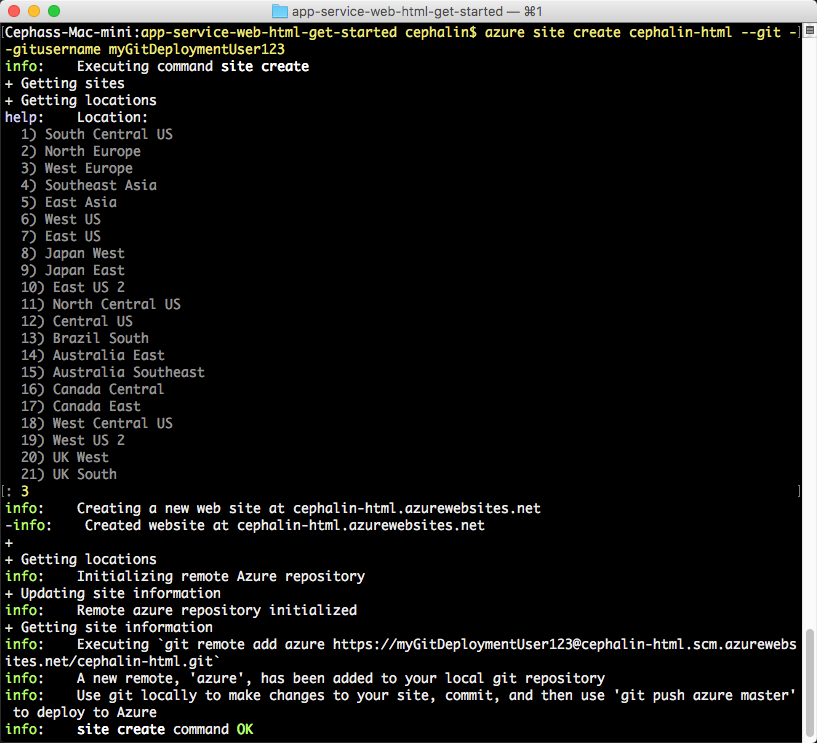
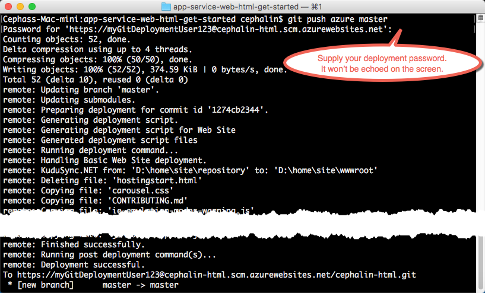

<properties 
    pageTitle="Distribuire un'app web prima di Azure cinque minuti | Microsoft Azure" 
    description="Informazioni su quanto sia semplice per eseguire le applicazioni web nel servizio App distribuendo un'applicazione di esempio. Iniziare rapidamente sviluppo vero e vedere immediatamente i risultati." 
    services="app-service\web"
    documentationCenter=""
    authors="cephalin"
    manager="wpickett"
    editor=""
/>

<tags
    ms.service="app-service-web"
    ms.workload="web"
    ms.tgt_pltfrm="na"
    ms.devlang="na"
    ms.topic="hero-article"
    ms.date="10/13/2016" 
    ms.author="cephalin"
/>
    
# Distribuire un'app web prima di Azure cinque minuti

In questa esercitazione consente di distribuire un'app web HTML + CSS semplice al [Servizio App Azure](../app-service/app-service-value-prop-what-is.md).
È possibile utilizzare il servizio di App per creare web apps, [app per dispositivi mobili indietro estremità](/documentation/learning-paths/appservice-mobileapps/)e [API App](../app-service-api/app-service-api-apps-why-best-platform.md).

Sarà necessario: 

- Creare un'app web nel servizio App Azure.
- Distribuire HTML e CSS ad esso.
- Vedere le pagine in esecuzione live nell'ambiente di produzione.
- Aggiornare il contenuto esattamente come si farebbe [push che fra esegue il commit](https://git-scm.com/docs/git-push).

## Prerequisiti

- [Operazioni](http://www.git-scm.com/downloads).
- [Azure CLI](../xplat-cli-install.md).
- Un account di Microsoft Azure. Se non si dispone di un account, è possibile [iscriversi per una versione di valutazione gratuita](/pricing/free-trial/?WT.mc_id=A261C142F) o [attivare i vantaggi della propria sottoscrizione Visual Studio](/pricing/member-offers/msdn-benefits-details/?WT.mc_id=A261C142F).

>[AZURE.NOTE] È possibile [Provare servizio App](http://go.microsoft.com/fwlink/?LinkId=523751) senza un account Azure. Creare un'app starter e riprodurre per fino a un'ora, ossia senza carta di credito obbligatorio, senza impegni.

## Distribuire un semplice sito HTML

1. Aprire un nuovo prompt dei comandi di Windows, finestra di PowerShell, shell Linux o terminal OS X. Eseguire `git --version` e `azure --version` per verificare che fra e Azure CLI siano installati nel computer in uso.

    

    Se non è stato installato gli strumenti, vedere [Prerequisiti](#Prerequisites) per i collegamenti di download.

3. Accedere a Azure alla seguente:

        azure login

    Seguire il messaggio della Guida per continuare la procedura di accesso.

    

4. Modificare Azure CLI in modalità di ASM, quindi impostare l'utente di distribuzione per il servizio di App. Distribuire codice utilizzando le credenziali in un secondo momento.

        azure config mode asm
        azure site deployment user set --username <username> --pass <password>

1. Modificare una cartella di lavoro (`CD`) e duplicare l'app di esempio seguente:

        git clone https://github.com/Azure-Samples/app-service-web-html-get-started.git

2. Modificare un archivio dell'applicazione di esempio. 

        cd app-service-web-html-get-started

4. Creare la risorsa app servizio App in Azure con un nome univoco app e l'utente di distribuzione configurato in precedenza. Quando viene richiesto, specificare il numero dell'area desiderata.

        azure site create <app_name> --git --gitusername <username>

    

    L'app viene creato in Azure ora. Inoltre, la directory corrente è inizializzato fra e collegati alla nuova applicazione di servizio App come un fra remoto.
    È possibile passare a URL app (http://&lt;nome_app >. azurewebsites.net) per visualizzare la pagina HTML predefinita grande, ma in realtà Iniziamo codice sono ora.

4. Distribuire il codice di esempio per l'app Azure come si preferisce push qualsiasi codice con fra. Quando richiesto, usare la password che è configurato in precedenza.

        git push azure master

    

    Se è stata utilizzata una delle strutture lingua, si noterà output diverso. In questo modo `git push` non solo codice viene inserito in Azure, ma anche Attiva attività di distribuzione del motore di distribuzione. Se si usa qualsiasi package.json (Node) o file requirements.txt (Python) nella radice del progetto (repository) o se si dispone di un file packages.config nel progetto ASP.NET, lo script di distribuzione Ripristina i pacchetti di richiesti dell'utente. È anche possibile [attivare l'estensione di composizione](web-sites-php-mysql-deploy-use-git.md#composer) per elabora automaticamente composer.json file nell'app PHP.

Congratulazioni, è stato distribuito l'applicazione di servizio App Azure.

## Vedere l'app in esecuzione live

Per visualizzare l'app in esecuzione live in Azure, eseguire questo comando da qualsiasi directory del repository:

    azure site browse

## Effettuare aggiornamenti applicazione in uso.

È ora possibile usare fra a push in qualsiasi momento il radice di progetto (repository) per eseguire un aggiornamento al sito attivo. Si farebbe nello stesso modo per la distribuzione di codice per la prima volta. Ad esempio, ogni volta che si desidera inserire una nuova modifica è stata verificata in locale, dalla radice del progetto (repository) eseguire solo i comandi seguenti:

    git add .
    git commit -m "<your_message>"
    git push azure master

## Passaggi successivi

Trovare la procedura di sviluppo e la distribuzione preferita per il framework lingua:

> [AZURE.SELECTOR]
- [.NET](web-sites-dotnet-get-started.md)
- [PHP](app-service-web-php-get-started.md)
- [Node](app-service-web-nodejs-get-started.md)
- [Python](web-sites-python-ptvs-django-mysql.md)
- [Java](web-sites-java-get-started.md)

In alternativa, eseguire operazioni più con l'app web di prima. Per esempio:

- Provare a usare [altri modi per distribuire il codice in Azure](../app-service-web/web-sites-deploy.md). Ad esempio, per distribuire da uno dei repository GitHub, è sufficiente selezionare **GitHub** anziché **Archivio locale fra** nelle **Opzioni di distribuzione**.
- Richiedere l'app Azure a livello avanzato. Eseguire l'autenticazione degli utenti. Scala basata su una domanda. Configurare alcuni avvisi di prestazioni. Con pochi clic. Vedere [aggiungere funzionalità per un'app web di prima](app-service-web-get-started-2.md).

