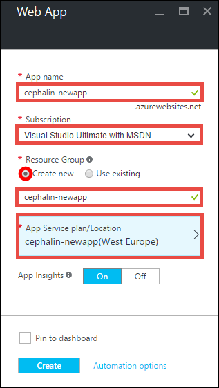
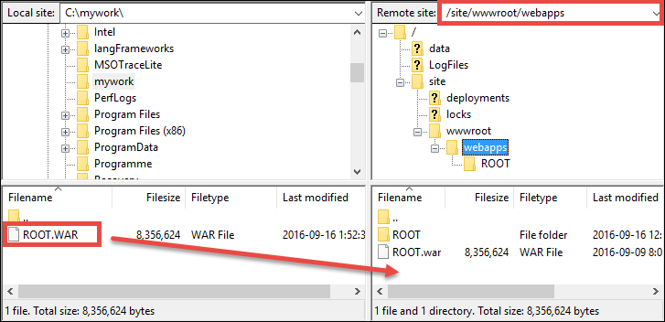

<properties 
    pageTitle="Distribuire un'app web prima di linguaggio Azure cinque minuti | Microsoft Azure" 
    description="Informazioni su quanto sia semplice per eseguire le applicazioni web nel servizio App distribuendo un'applicazione di esempio. Iniziare rapidamente sviluppo vero e vedere immediatamente i risultati." 
    services="app-service\web"
    documentationCenter=""
    authors="cephalin"
    manager="wpickett"
    editor=""
/>

<tags
    ms.service="app-service-web"
    ms.workload="web"
    ms.tgt_pltfrm="na"
    ms.devlang="na"
    ms.topic="hero-article"
    ms.date="10/13/2016" 
    ms.author="cephalin"
/>
    
# Distribuire un'app web prima di linguaggio Azure cinque minuti

In questa esercitazione consente di distribuire un'app web Java semplice al [Servizio App Azure](../app-service/app-service-value-prop-what-is.md).
È possibile utilizzare il servizio di App per creare web apps, [app per dispositivi mobili indietro estremità](/documentation/learning-paths/appservice-mobileapps/)e [API App](../app-service-api/app-service-api-apps-why-best-platform.md).

Sarà necessario: 

- Creare un'app web nel servizio App Azure.
- Distribuire un'app di linguaggio di esempio.
- Vedere il codice in esecuzione live nell'ambiente di produzione.

## Prerequisiti

- È possibile ottenere un client FTP/FTPS, ad esempio [FileZilla](https://filezilla-project.org/).
- È possibile ottenere un account di Microsoft Azure. Se non si dispone di un account, è possibile [iscriversi per una versione di valutazione gratuita](/pricing/free-trial/?WT.mc_id=A261C142F) o [attivare i vantaggi della propria sottoscrizione Visual Studio](/pricing/member-offers/msdn-benefits-details/?WT.mc_id=A261C142F).

>[AZURE.NOTE] È possibile [Provare servizio App](http://go.microsoft.com/fwlink/?LinkId=523751) senza un account Azure. Creare un'app starter e riprodurre per fino a un'ora, ossia senza carta di credito obbligatorio, senza impegni.

## Creare un'app web

1. Accedere al [portale di Azure](https://portal.azure.com) con il proprio account Azure.

2. Nel menu a sinistra, fare clic su **Nuovo** > **Web + Mobile** > **Web App**.

    

3. In e il creazione app, usare le seguenti impostazioni per la nuova app:

    - **Nome dell'App**: digitare un nome univoco.
    - **Gruppo risorse**: selezionare **Crea nuovo** e specificare un nome per il gruppo di risorse.
    - **Icona percorso del piano di servizio App**: fare clic su essa per configurare e quindi fare clic su **Crea nuovo** per impostare il nome, percorso e prezzo livello del piano di servizio di App. È possibile utilizzare **gratuito** prezzi livello.

    Al termine, il blade di creazione di app dovrebbe risultare analoga alla seguente:

    

3. Fare clic su **Crea** nella parte inferiore. È possibile fare clic sull'icona di **notifica** nella parte superiore per visualizzare lo stato di avanzamento.

    

4. Al termine dell'installazione, verrà visualizzato questo messaggio di notifica. Fare clic sul messaggio per aprire blade della distribuzione.

    

5. In e il **messaggio distribuzione completata** , fare clic sul collegamento **delle risorse** per aprire blade dell'applicazione web nuovo.

    

## Distribuire un'app di linguaggio all'app web

A questo punto, si distribuire un'app di linguaggio in Azure utilizzando FTPS.

5. In e il app web scorrere fino a **Impostazioni applicazione** o cercarlo e quindi fare clic su esso. 

    

6. Nella **versione Java**, selezionare **linguaggio 8** e fare clic su **Salva**.

    

    Quando si riceve la notifica **aggiornato le impostazioni dell'app web**, passare a http://*&lt;NomeApplicazione >*. azurewebsites.net per visualizzare il servlet JSP predefinita in azione.

7. Di nuovo in e il app web scorrere fino a **credenziali di distribuzione** o cercarlo e quindi fare clic su esso.

8. Impostare le credenziali di distribuzione e fare clic su **Salva**.

7. Di nuovo in e il app web, fare clic su **Panoramica**. Accanto al **nome utente/distribuzione FTP** e **FTPS hostname**, fare clic sul pulsante **Copia** per copiare questi valori.

    

    A questo punto si è pronti distribuire l'app Java con FTPS.

8. Nel client di FTP/FTPS, accedere al server FTP dell'applicazione web Azure utilizzando i valori copiati nell'ultimo passaggio. Usare la password di distribuzione creata in precedenza.

    La schermata seguente mostra l'accesso tramite FileZilla.

    

    Potrebbe essere visualizzato l'avviso di sicurezza per il certificato SSL non riconosciuto da Azure. Continuare.

9. Fare clic su [questo collegamento](https://github.com/Azure-Samples/app-service-web-java-get-started/raw/master/webapps/ROOT.war) per scaricare il file WAR nel computer locale.

9. Nel client di FTP/FTPS, passare a **/site/wwwroot/webapps** nel sito remoto e trascinare il file WAR scaricato sul computer locale nella directory remoto.

    

    Fare clic su **OK** per ignorare il file in Azure.

    >[AZURE.NOTE] Secondo il comportamento predefinito del Tomcat, filename **ROOT.war** in /site/wwwroot/webapps consente l'applicazione web principale (http://*&lt;NomeApplicazione >*. azurewebsites.net) e il nome ** * &lt;anyname >*.war** offre un'app web denominato (http://*&lt;NomeApplicazione >*.azurewebsites.net/*&lt;anyname >*).

Questo è tutto! L'app di linguaggio è in esecuzione live in Azure. Nel browser passare a http://*&lt;NomeApplicazione >*. azurewebsites.net per visualizzarlo in azione. 

## Effettuare aggiornamenti applicazione in uso.

Ogni volta che è necessario effettuare un aggiornamento, è sufficiente caricare il nuovo file WAR nella stessa directory remote con il client FTP/FTPS.

## Passaggi successivi

[Creare un'app web di linguaggio da un modello di Azure Marketplace](web-sites-java-get-started.md#marketplace). È possibile ottenere un contenitore di Tomcat completamente personalizzabile e ottenere la familiare UI Manager. 

Eseguire il debug l'app web Azure, direttamente in [IntelliJ](app-service-web-debug-java-web-app-in-intellij.md) o [Eclisse](app-service-web-debug-java-web-app-in-eclipse.md).

In alternativa, eseguire operazioni più con l'app web di prima. Per esempio:

- Provare a usare [altri modi per distribuire il codice in Azure](../app-service-web/web-sites-deploy.md). 
- Richiedere l'app Azure a livello avanzato. Eseguire l'autenticazione degli utenti. Scala basata su una domanda. Configurare alcuni avvisi di prestazioni. Con pochi clic. Vedere [aggiungere funzionalità per un'app web di prima](app-service-web-get-started-2.md).

