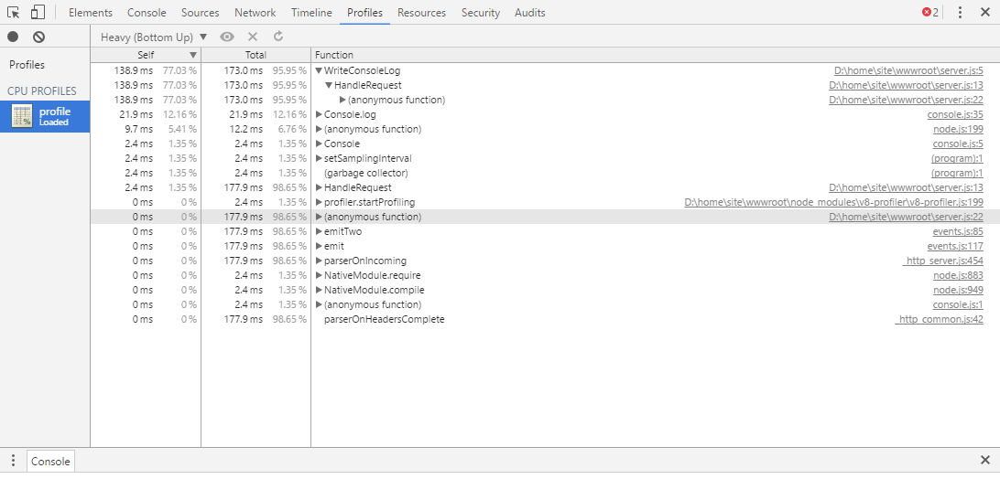

<properties
    pageTitle="Procedure consigliate e la Guida alla risoluzione dei problemi per le applicazioni di nodo su Azure Web Apps"
    description="Scoprire le procedure consigliate e procedure di risoluzione dei problemi per le applicazioni di nodo su Azure Web Apps."
    services="app-service\web"
    documentationCenter="nodejs"
    authors="ranjithr"
    manager="wadeh"
    editor=""/>

<tags
    ms.service="app-service-web"
    ms.workload="web"
    ms.tgt_pltfrm="na"
    ms.devlang="nodejs"
    ms.topic="article"
    ms.date="06/06/2016"
    ms.author="ranjithr;wadeh"/>
    
# <a name="best-practices-and-troubleshooting-guide-for-node-applications-on-azure-web-apps"></a>Procedure consigliate e la Guida alla risoluzione dei problemi per le applicazioni di nodo su Azure Web Apps

[AZURE.INCLUDE [tabs](../../includes/app-service-web-get-started-nav-tabs.md)]

In questo articolo verranno fornite le procedure consigliate e procedure di risoluzione dei problemi per [le applicazioni di nodo](app-service-web-nodejs-get-started.md) in esecuzione su Azure WebApp (con [iisnode](https://github.com/azure/iisnode)).

>[AZURE.WARNING] Attenendosi alla procedura di risoluzione dei problemi del sito di produzione con cautela. Suggerimento è per risolvere l'app in una configurazione non produzione, ad esempio l'intervallo di gestione temporanea aperto e quando il problema viene risolto, sostituire l'intervallo di gestione temporanea aperto con la produzione.

## <a name="iisnode-configuration"></a>Configurazione di IISNODE

Il [file di schema](https://github.com/Azure/iisnode/blob/master/src/config/iisnode_schema_x64.xml) Mostra tutte le impostazioni che possono essere configurate per iisnode. Sono riportate alcune delle impostazioni che possa essere utile per l'applicazione:

* nodeProcessCountPerApplication

    Questa impostazione controlla il numero di processi di nodo che vengono avviate per ogni applicazione di IIS. Valore predefinito è 1. È possibile avviare tanti node.exe come il numero di core macchine Virtuali mediante l'impostazione seguente su 0. Valore consigliato è uguale a 0 per la maggior parte delle applicazioni in modo che è possibile utilizzare tutti i core nel computer in uso. Node.exe è thread in modo che un node.exe utilizzerà un massimo di 1 core e per ottenere prestazioni ottimali dall'applicazione nodo che si desidera utilizzare tutti i core.

* nodeProcessCommandLine

    Questa impostazione controlla il percorso di node.exe. È possibile impostare questo valore in modo che puntino alla versione node.exe.

* maxConcurrentRequestsPerProcess

    Questa impostazione controlla il numero massimo di richieste simultanee inviato da iisnode per ogni node.exe. Azure WebApp, il valore predefinito è infinito. Non è necessario preoccuparsi di questa impostazione. All'esterno di azure WebApp, il valore predefinito è 1024. È possibile configurare questa a seconda di quante richieste che l'applicazione ottiene e la velocità dell'applicazione elabora ogni richiesta.

* maxNamedPipeConnectionRetry

    Questa impostazione controlla il numero massimo di volte in cui iisnode tenterà di connessione che sulla barra verticale denominato di inviare la convocazione a node.exe tramite. Questa impostazione in combinazione con namedPipeConnectionRetryDelay determina il timeout totale di ogni richiesta all'interno di iisnode. Valore predefinito è 200 sul WebApp Azure. Totale Timeout in secondi = (maxNamedPipeConnectionRetry \* namedPipeConnectionRetryDelay) / 1000

* namedPipeConnectionRetryDelay

    Questa impostazione controlla la quantità di tempo (in millisecondi) iisnode dovrà attendere tra ogni Riprova per inviare richiesta node.exe tramite la barra verticale denominato. Valore predefinito è 250ms.
    Totale Timeout in secondi = (maxNamedPipeConnectionRetry \* namedPipeConnectionRetryDelay) / 1000

    Per impostazione predefinita il timeout totale in iisnode su azure WebApp è 200 \* 250ms = 50 secondi.

* logDirectory

    Questa impostazione controlla la directory quale iisnode effettuano stdout/stderr. Valore predefinito è iisnode relativa alla directory script principale (directory in cui è presente server.js principale)

* debuggerExtensionDll

    Questa impostazione Controlla individuare quale versione di controllo nodo iisnode verrà utilizzato quando il debug dell'applicazione di nodo. Attualmente 0.7.3.dll di controllo iisnode e iisnode inspector.dll sono i valori validi 2 solo per questa impostazione. Valore predefinito è 0.7.3.dll di controllo iisnode. versione 0.7.3.dll di controllo iisnode utilizza 0.7.3 di controllo nodo e websockets, pertanto è necessario abilitare websockets sul azure Web App per utilizzare questa versione. Vedere <http://www.ranjithr.com/?p=98> per ulteriori informazioni su come configurare iisnode per utilizzare il controllo nodo nuovo.

* flushResponse

    Il comportamento predefinito di IIS è buffer di dati di risposta su a 4MB prima di scaricare o fino alla fine della risposta, subiranno. iisnode offre un'impostazione di configurazione per ignorare questo comportamento: per svuotare un frammento di testo della risposta entità appena iisnode riceve da node.exe, è necessario impostare il iisnode/@flushResponse attributo in config su "true":
    
    ```
    <configuration>    
        <system.webServer>    
            <!-- ... -->    
            <iisnode flushResponse="true" />    
        </system.webServer>    
    </configuration>
    ```

    Attivazione svuotamento di ogni frammento del corpo entità risposta aggiunge il sovraccarico di prestazioni che consente di ridurre la velocità del sistema di ~ 5% (dal v0.1.13), è consigliabile definire l'ambito di questa impostazione solo per gli endpoint che richiedono il flusso di risposta (ad esempio utilizzando il <location> elemento dello stesso file)

    Inoltre, per il flusso di applicazioni, sarà necessario anche impostare responseBufferLimit del gestore iisnode 0.
    
    ```
    <handlers>    
        <add name="iisnode" path="app.js" verb="\*" modules="iisnode" responseBufferLimit="0"/>    
    </handlers>
    ```

* watchedFiles

    Si tratta di un elenco di separati da punti e virgola di file che verranno controllate le modifiche. Una modifica in un file, l'applicazione al Cestino. Ogni voce è costituita da un nome di directory facoltativa e il nome di file richiesto che si riferiscono alla directory in cui si trova il punto di ingresso principale dell'applicazione. I caratteri jolly sono consentiti nelle solo la parte di nome file. Valore predefinito è "\*. js;web.config"

* recycleSignalEnabled

    Valore predefinito è false. Se abilitata, l'applicazione di nodo possibile connettersi a un denominato barra verticale (variabile di ambiente IISNODE\_controllo\_barra verticale) e inviare un messaggio "Cestino". In questo modo w3wp al Cestino normalmente.

* idlePageOutTimePeriod

    Valore predefinito è 0 indica che questa caratteristica è disattivata. Se impostato su un valore maggiore di 0, iisnode verrà pagina fuori tutti i relativi processi secondari ogni millisecondi 'idlePageOutTimePeriod'. Per informazioni sulle pagine con le medie, fare riferimento a questa [documentazione](https://msdn.microsoft.com/library/windows/desktop/ms682606.aspx). Questa impostazione sono utile per le applicazioni che utilizzano una grande quantità di memoria e si desidera che venga pageout memoria su disco per liberare alcune RAM.

>[AZURE.WARNING] Prestare attenzione quando si abilitano le seguenti impostazioni di configurazione in ambiente di produzione. Suggerimento è per non consentire loro in tempo reale ambiente di produzione.

* debugHeaderEnabled

    Il valore predefinito è FALSO. Se è impostato su true, iisnode verrà aggiunto un HTTP risposta intestazione iisnode debug a ogni risposta HTTP Invia che il valore di intestazione iisnode debug è un URL. Singoli elementi di informazioni diagnostiche possano ambiente esaminando il frammento di URL, ma si ottiene una quantità visualizzazione migliore aprendo l'URL nel browser.

* loggingEnabled

    Questa impostazione controlla la registrazione di stdout e stderr iisnode. Iisnode verrà acquisire stdout/stderr dai processi di nodo che viene avviato e scrittura alla directory specificata nelle impostazioni di 'logDirectory'. Una volta è attiva, l'applicazione verrà scritta registri nel file System e in base alla quantità di registrazione avviene nell'applicazione, è possibile che influisce sulle prestazioni.

* devErrorsEnabled

    Valore predefinito è false. Quando è impostato su true, iisnode verrà visualizzato il codice di errore Win32 e il codice di stato HTTP nel browser. Il codice di win32 possono risultare utile per il debug di determinati tipi di problemi.
    
* debuggingEnabled (non viene attivato nel sito di produzione)

    Questa impostazione Controlla funzionalità di debug. Iisnode è integrato con nodo controllo. Attivare questa impostazione, attivare il debug dell'applicazione nodo. Dopo l'abilitazione di questa impostazione, iisnode verrà layout i file di controllo di nodo necessarie nella directory 'debuggerVirtualDir' alla prima richiesta di debug all'applicazione nodo. È possibile caricare il nodo controllo per inviare una richiesta http://yoursite/server.js/debug. È possibile controllare il segmento URL debug con l'impostazione 'debuggerPathSegment'. Per impostazione predefinita debuggerPathSegment = 'debug'. È possibile impostare questo GUID ad esempio in modo che sia più difficile rilevati da altri utenti.

    Controllare questo [collegamento](https://tomasz.janczuk.org/2011/11/debug-nodejs-applications-on-windows.html) per informazioni dettagliate sul debug.

## <a name="scenarios-and-recommendationstroubleshooting"></a>Risoluzione dei problemi di consigli/e scenari

### <a name="my-node-application-is-making-too-many-outbound-calls"></a>Applicazione nodo esegue troppe chiamate in uscita.

Molte applicazioni necessario stabilire connessioni in uscita durante il normale funzionamento. Ad esempio, quando arriva una richiesta, l'app nodo necessario contattare un punto qualsiasi all'API REST e ottenere informazioni per elaborare la richiesta. Si desidera utilizzare un agente attivo Mantieni durante le chiamate http o https. Ad esempio, è possibile utilizzare il modulo agentkeepalive l'agente Mantieni attivo quando si eseguono le chiamate in uscita. In questo modo che i socket vengono riutilizzati nel Web App azure macchine Virtuali e ridurre il sovraccarico di creazione di nuovi socket per ogni richiesta in uscita. Inoltre, per garantire che si sta utilizzando minore numero di socket di eseguire più richieste in uscita e pertanto non superino maxSockets allocato per macchine Virtuali. Suggerimento in WebApp Azure, è possibile impostare il valore di maxSockets agentKeepAlive su un totale di 160 socket per macchine Virtuali. Di conseguenza, se si dispone di 4 node.exe in esecuzione su Virtual Machine, si desidera impostare maxSockets agentKeepAlive a 40 / node.exe ossia 160 totale per macchine Virtuali.

Esempio di configurazione agentKeepALive:

```
var keepaliveAgent = new Agent({    
    maxSockets: 40,    
    maxFreeSockets: 10,    
    timeout: 60000,    
    keepAliveTimeout: 300000    
});
```

In questo esempio presuppone che si abbia node.exe 4 eseguono la macchina virtuale. Se si dispone di un numero differente di node.exe in esecuzione su Virtual Machine, sarà necessario modificare maxSockets impostare di conseguenza.

### <a name="my-node-application-is-consuming-too-much-cpu"></a>Applicazione nodo utilizza troppe CPU.

Si otterrà probabilmente un suggerimento da Azure WebApp nel portale sull'utilizzo della CPU elevato. È inoltre possibile impostare Monitor per il controllo degli determinate [metriche](web-sites-monitor.md). Quando si controlla l'utilizzo della CPU nel [Dashboard portale Azure](../application-insights/app-insights-web-monitor-performance.md), verificare i valori MAX per CPU per non perdere i valori di punta.
Nei casi in cui si ritiene che l'applicazione è costituita troppo grandi quantità di CPU e non può spiegare il motivo, è necessario l'applicazione di nodo del profilo.

### 

#### <a name="profiling-your-node-application-on-azure-webapps-with-v8-profiler"></a>Analisi di un'applicazione di nodo su azure WebApp con V8 Profiler

Ad esempio, consente ad esempio di disporre di un'app world hello che desidera eseguire il profilo come indicato di seguito:

```
var http = require('http');    
function WriteConsoleLog() {    
    for(var i=0;i<99999;++i) {    
        console.log('hello world');    
    }    
}

function HandleRequest() {    
    WriteConsoleLog();    
}

http.createServer(function (req, res) {    
    res.writeHead(200, {'Content-Type': 'text/html'});    
    HandleRequest();    
    res.end('Hello world!');    
}).listen(process.env.PORT);
```

Passare a https://yoursite.scm.azurewebsites.net/DebugConsole il sito servizi

Verrà visualizzato un prompt dei comandi, come illustrato di seguito. Passare alla directory siti/wwwroot


Eseguire il comando "npm installare v8 profiler"

Si devono installare v8 profiler nodo\_moduli directory e tutte le relative dipendenze.
A questo punto, modificare il server.js per l'applicazione del profilo.

```
var http = require('http');    
var profiler = require('v8-profiler');    
var fs = require('fs');

function WriteConsoleLog() {    
    for(var i=0;i<99999;++i) {    
        console.log('hello world');    
    }    
}

function HandleRequest() {    
    profiler.startProfiling('HandleRequest');    
    WriteConsoleLog();    
    fs.writeFileSync('profile.cpuprofile', JSON.stringify(profiler.stopProfiling('HandleRequest')));    
}

http.createServer(function (req, res) {    
    res.writeHead(200, {'Content-Type': 'text/html'});    
    HandleRequest();    
    res.end('Hello world!');    
}).listen(process.env.PORT);
```

Le modifiche sopra verranno la funzione WriteConsoleLog del profilo e quindi scrivere l'output di profilo in file 'profile.cpuprofile' in wwwroot il sito. Inviare una richiesta all'applicazione. Verrà visualizzato un file di 'profile.cpuprofile' creato in wwwroot del sito.


Scaricare questo file e sarà necessario aprire il file con gli strumenti F12 Chrome. Premere F12 in chrome, quindi selezionare la scheda"profili". Fare clic sul pulsante "Carica". Selezionare il file profile.cpuprofile appena scaricato. Fare clic sul profilo che appena caricato.



Si noterà che è stato utilizzato 95% del tempo da WriteConsoleLog funzione come illustrato di seguito. Questo viene inoltre i numeri di riga esatta e il file di origine che causano il problema.

### <a name="my-node-application-is-consuming-too-much-memory"></a>Applicazione nodo viene utilizzato troppa memoria.

Si otterrà probabilmente un suggerimento da Azure WebApp nel portale sull'utilizzo di memoria alta. È inoltre possibile impostare Monitor per il controllo degli determinate [metriche](web-sites-monitor.md). Quando si controlla l'utilizzo della memoria nel [Dashboard portale Azure](../application-insights/app-insights-web-monitor-performance.md), verificare i valori MAX per la memoria per non perdere i valori di punta.

#### <a name="leak-detection-and-heap-diffing-for-nodejs"></a>Rilevamento di perdite e differenziazione Heap per Node 

È possibile utilizzare [nodo memwatch](https://github.com/lloyd/node-memwatch) per identificare più facilmente le perdite di memoria.
È possibile installare memwatch come v8 profiler e modificare il codice di acquisizione e diff heap per identificare la memoria perdite dell'applicazione.

### <a name="my-nodeexes-are-getting-killed-randomly"></a>I node.exe sono Guida eliminato in modo casuale 

Esistono diversi motivi perché questo la causa del problema:

1.  L'applicazione sta generando non rilevate eccezioni-d: controllo Please\\home\\file di registro\\applicazione\\file di registrazione-Errors. txt per i dettagli dell'eccezione generata. Questo file ha la traccia dello stack in modo da risolvere l'applicazione in base a questa.

2.  L'applicazione è utilizzato troppa memoria che interessa ad altri processi di introduzione. Se la memoria macchine Virtuali totale non è quasi al 100%, il node.exe Impossibile interrompere da Gestione processi per consentire agli altri processi provare a eseguire alcune operazioni. Per risolvere il problema, verificare che l'applicazione non dispone di memoria o se l'applicazione si deve usare una quantità elevata di memoria, scalare, per una maggiore macchina virtuale con molte più RAM.

### <a name="my-node-application-does-not-start"></a>Non è possibile avvia un'applicazione di nodo

Se l'applicazione restituisce 500 errori all'avvio, è possibile che alcuni motivi:

1.  Node.exe non è presente nella posizione corretta. Verificare l'impostazione nodeProcessCommandLine.

2.  File di script principale non è presente nella posizione corretta. Selezionare config e assicurarsi che il nome del file di script principale nella sezione gestori corrisponde al file di script principale.

3.  Configurazione config non è corretta, controllare i nomi/valori delle impostazioni.

4.  Inizio fredda – l'applicazione sta impiegando troppo tempo per l'avvio. Se l'applicazione richiede più tempo (maxNamedPipeConnectionRetry \* namedPipeConnectionRetryDelay) / 1000 secondi, iisnode restituirà 500 Errore. Aumentare i valori di queste impostazioni per la corrispondenza dell'ora di inizio dell'applicazione per evitare che iisnode di timeout e restituire l'errore 500.

### <a name="my-node-application-crashed"></a>Applicazione nodo un arresto anomalo

L'applicazione sta generando non rilevate eccezioni-d: controllo Please\\home\\file di registro\\applicazione\\file di registrazione-Errors. txt per i dettagli dell'eccezione generata. Questo file ha la traccia dello stack in modo da risolvere l'applicazione in base a questa.

### <a name="my-node-application-takes-too-much-time-to-startup-cold-start"></a>Applicazione nodo richiede troppo tempo per l'avvio (Start fredda)

Più comune motivo è che l'applicazione ha molti file nel nodo\_moduli e l'applicazione tenta di caricare più di questi file durante l'avvio. Per impostazione predefinita, in quanto i file si trovano sulla condivisione di rete in WebApp Azure, il caricamento di file così tanti può richiedere del tempo.
Alcune soluzioni per rendere più veloce sono:

1.  Accertarsi di avere una struttura semplice dipendenza e senza dipendenze duplicate utilizzando npm3 per installare i moduli.

2.  Provare a Prato caricare il nodo\_moduli e non caricare tutti i moduli all'avvio. Questo errore indica che la chiamata a require('module') deve essere eseguita quando si è davvero necessario all'interno della funzione che si tenta di utilizzare il modulo.

3.  WebApp Azure offre la funzione cache locale. Questa caratteristica consente di copiare il contenuto dalla condivisione di rete sul disco locale nella macchina virtuale. Poiché i file sono locali, i tempi di caricamento del nodo\_moduli è molto più veloce. -Questa [documentazione](../app-service/app-service-local-cache.md) viene illustrato come utilizzare Cache locale in modo più dettagliato.

## <a name="iisnode-http-status-and-substatus"></a>Stato secondario e stato http IISNODE

Il [file di origine](https://github.com/Azure/iisnode/blob/master/src/iisnode/cnodeconstants.h) sono elencati tutti i iisnode di combinazione di stato possibili dello stato secondario può restituire in caso di errore.

Abilitare FREB per l'applicazione visualizzare il codice di errore win32 (assicurarsi che si abilita FREB solo nei siti non di produzione per migliorare le prestazioni).

| Stato HTTP | Stato secondario http | Motivo possibile?                                                                                                                                                                                            
|-------------|----------------|--------------------------------------------------------------------------------------------------------------------------------------------------------------
| 500         | 1000           | Si è verificato un problema di inviare la richiesta per IISNODE: controllare se node.exe è stato avviato. Node.exe potrebbe avere un arresto anomalo all'avvio. Verificare la configurazione di config degli errori.                                                                                                                                                                                                                                                                                     |
| 500         | 1001           | -Win32Error 0x2 - App non risponde all'URL. Controllare le regole di riscrittura URL o se l'app express è corrette route definite. -Win32Error 0x6d – denominato barra verticale è occupato: Node.exe non accetta richieste perché non è disponibile la barra verticale. Controllare l'utilizzo della cpu elevato. -Altri errori: controllare se node.exe un arresto anomalo.
| 500         | 1002           | Arresto anomalo del Node.exe: controllare d:\\home\\file di registro\\registrazione-Errors. txt per traccia dello stack.                                                                                                                                                                                                                                                                                                                                                                                        |
| 500         | 1003           | Tubazioni configurazione problema: non dovrebbe mai visibile ma se si, la configurazione di denominato barra verticale è corretta.                                                                                                                                                                                                                                                                                                                                                          |
| 500         | 1004 1018      | Si è verificato un errore durante l'invio della richiesta o elaborazione della risposta dal piano node.exe. Controllare se node.exe un arresto anomalo. d: controllare\\home\\file di registro\\registrazione-Errors. txt per traccia dello stack.                                                                                                                                                                                                                                                                                    |
| 503         | 1000           | Memoria insufficiente per allocare più connessioni barra verticale denominate. Perché l'app di utilizzo di memoria molto il controllo. Controllare il valore di impostazione maxConcurrentRequestsPerProcess. Se non infinito ed è necessaria una quantità elevata di richieste, aumentare questo valore per evitare questo errore.                                                                                                                                                                                                                                                                                                                  |
| 503         | 1001           | Impossibile inviare richiesta node.exe perché Ricicla dell'applicazione. Dopo l'applicazione è stato riciclato, le richieste devono essere rappresentate normalmente.                                                                                                                                                                                                                                                                                                               |
| 503         | 1002           | Codice di errore di win32 di controllo per motivo effettivo-richiesta non è stato inviato a un node.exe.                                                                                                                                                                                                                                                                                                                                                                               |
| 503         | 1003           | Barra verticale denominato è occupato, controllare se nodo utilizza molte delle CPU                                                                                                                                                                                                                                                                                                                                                                                                        
                                                                                                                                                                                                                                                                                                            
                                                                                                                                                                                                                                                                                                                                                                                                                                                                                                         
C'è un'impostazione all'interno di NODE.exe denominato nodo\_in sospeso\_barra verticale\_istanze. Per impostazione predefinita all'esterno di azure WebApp questo valore è "4". Questo errore indica che node.exe può accettare solo 4 richieste alla volta nella barra verticale denominato. Nella WebApp Azure, è impostato su 5000 e questo valore deve essere adeguato per la maggior parte delle applicazioni di nodo in esecuzione su WebApp azure. È consigliabile non è presente 503.1003 WebApp azure poiché è un valore elevato per il nodo\_in sospeso\_barra verticale\_istanze.  |

## <a name="more-resources"></a>Altre risorse

Seguire questi collegamenti per ulteriori informazioni sulle applicazioni Node Azure App servizio.

* [Introduzione a node web apps nel servizio App Azure](app-service-web-nodejs-get-started.md)
* [Come eseguire il debug di un'app web Node nel servizio App Azure](web-sites-nodejs-debug.md)
* [Utilizzo di moduli Node con applicazioni Azure](../nodejs-use-node-modules-azure-apps.md)
* [Azure App servizio Web App: node](https://blogs.msdn.microsoft.com/silverlining/2012/06/14/windows-azure-websites-node-js/)
* [Centro per sviluppatori Node](../nodejs-use-node-modules-azure-apps.md)
* [Esplorazione Console di Debug Kudu Super segreta](https://azure.microsoft.com/documentation/videos/super-secret-kudu-debug-console-for-azure-web-sites/)