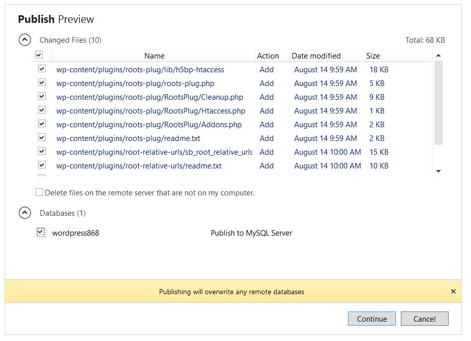
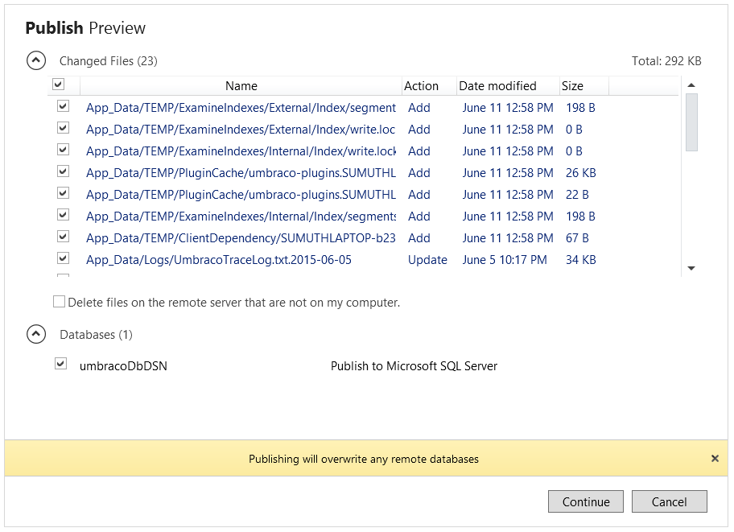
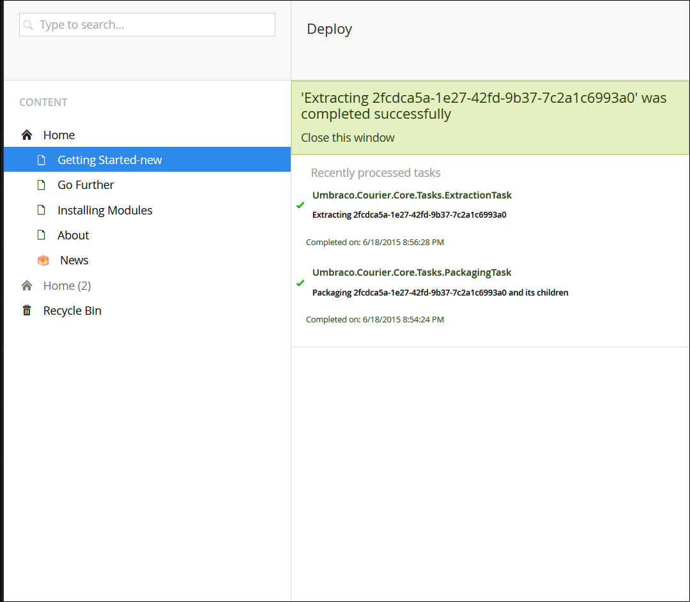

<properties
  pageTitle="Utilizzare gli ambienti attrezzi in modo efficace per un'app web"
  description="Informazioni su come usare bande orarie di distribuzione per configurare e gestire più ambienti di sviluppo dell'applicazione"
  services="app-service\web"
  documentationCenter=""
  authors="sunbuild"
  manager="yochayk"
  editor=""/>

<tags
  ms.service="app-service"
  ms.devlang="na"
  ms.topic="article"
  ms.tgt_pltfrm="na"
  ms.workload="web"
  ms.date="10/24/2016"
  ms.author="sumuth"/>

# <a name="use-devops-environments-effectively-for-your-web-apps"></a>Utilizzare gli ambienti attrezzi in modo efficace per le applicazioni web

In questo articolo mostra come configurare e gestire le distribuzioni di applicazioni web per più versioni di un'applicazione, ad esempio prova per lo sviluppo, domande e risposte e produzione. Ogni versione dell'applicazione può essere considerati ambiente di sviluppo per esigenze specifiche all'interno del processo di distribuzione. Ad esempio ambiente di domande e risposte può essere utilizzato dal team di sviluppatori per verificare la qualità dell'applicazione prima rendere disponibili le modifiche di produzione.
La configurazione di più ambienti di sviluppo può essere un compito impegnativo in base alle esigenze rilevare, gestire le risorse (elaborazione web app, database, cache e così via) e distribuire il codice in ambienti.

## <a name="setting-up-a-non-production-environment-stagedevqa"></a>Configurare un ambiente di produzione (fase, dev, domande e risposte)
Dopo avere inserito un'app web di produzione funzionanti, il passaggio successivo consiste nel creare un ambiente di produzione. Per utilizzare bande orarie distribuzione assicurarsi che è in esecuzione in modalità di piano **Standard** o **Premium** App servizio. Bande orarie di distribuzione sono effettivamente live web App con le proprie nome host. Elementi di contenuto e la configurazione dell'applicazione Web possono essere scambiati tra due bande orarie di distribuzione, tra cui l'intervallo di aperto di produzione. Distribuire l'applicazione in un intervallo di aperto di distribuzione sono i seguenti vantaggi:

1. È possibile convalidare modifiche di applicazione web in un'area di gestione temporanea distribuzione prima di scambio con la produzione.
2. Distribuire un'app web di spazio prima e la sostituzione nell'ambiente di produzione garantisce che tutte le istanze di che sono riscaldate prima che vengono scambiati nell'ambiente di produzione. Per evitare i tempi di inattività quando si distribuiscono applicazioni web. Nessuna richiesta vengono eliminata a causa di operazioni di scambio il reindirizzamento del traffico è continua. È possibile automatizzare questo flusso di lavoro intera mediante la configurazione [Automatica Scambia](web-sites-staged-publishing.md#configure-auto-swap-for-your-web-app) quando non è necessario pre-scambiare convalida.
3. Dopo una Scambia intervallo aperto con precedentemente a fasi web app è ora disponibile l'app web di produzione precedente. Se le modifiche invertite in alloggiamento produzione non corrisponda a quello desiderato, è possibile eseguire lo stesso scambio immediatamente per ottenere il "ultima noti buona web app" Indietro.

Per configurare la gestione temporanea spazio distribuzione, vedere [configurare ambienti per web apps in Azure App servizio di gestione temporanea](web-sites-staged-publishing.md). Tutti gli ambienti devono includere una serie di risorse, ad esempio se si web app un database di produzione e di gestione temporanea web app dovrebbe essere utilizzando database diversi. Aggiunta di gestione temporanea risorse di ambiente di sviluppo, ad esempio database, lo spazio di archiviazione o cache per impostare l'ambiente di sviluppo di gestione temporanea.

## <a name="examples-of-using-multiple-development-environments"></a>Esempi di utilizzo di più ambienti di sviluppo

Qualsiasi progetto deve seguire una gestione del codice sorgente con almeno due ambienti, un ambiente di sviluppo e di produzione ma quando tramite sistemi di gestione dei contenuti, Framework di applicazione e così via, si potrebbero verificarsi problemi nel punto in cui l'applicazione non supportano questo scenario all'esterno della casella. Questo è valido per alcune delle strutture comuni descritti di seguito. Molte domande vengono in mente quando si lavora con un CMS/Framework ad esempio

1. Come suddividere in uscita in ambienti diversi
2. Quali file si desidera modificare e riesco effetti in termini di aggiornamenti della versione framework
3. Come gestire la configurazione per ambiente
4. Come gestire aggiornamenti della versione moduli/plug-in, aggiornamenti della versione framework core

Esistono diversi modi per configurare un ambiente con più per il progetto e gli esempi riportati di seguito sono un solo uno di questi metodi le rispettive applicazioni.

### <a name="wordpress"></a>WordPress
In questa sezione verranno fornite come configurare un flusso di lavoro di distribuzione con bande orarie per WordPress. WordPress alla maggior parte delle soluzioni CMS non è supportato l'utilizzo con più ambienti di sviluppo all'esterno della casella. Servizio App Web App con alcune funzionalità che rendono più semplice archiviare le impostazioni di configurazione di fuori del codice.

Prima di creare spazio gestione temporanea, impostare il codice dell'applicazione per supportare più ambienti. Per supportare più ambienti in WordPress è necessario modificare `wp-config.php` in un'app web di sviluppo locale aggiungere il codice seguente all'inizio del file. Ciò consente di scegliere la corretta configurazione in base all'ambiente selezionato l'applicazione.

```
// Support multiple environments
// set the config file based on current environment
if (strpos($_SERVER['HTTP_HOST'],'localhost') !== false) {
// local development
 $config_file = 'config/wp-config.local.php';
}
elseif ((strpos(getenv('WP_ENV'),'stage') !== false) || (strpos(getenv('WP_ENV'),'prod' )!== false ))
//single file for all azure development environments
 $config_file = 'config/wp-config.azure.php';
}
$path = dirname(__FILE__). '/';
if (file_exists($path. $config_file)) {
// include the config file if it exists, otherwise WP is going to fail
require_once $path. $config_file;
```

Creare una cartella radice di app web chiamato `config` e aggiungere un file due file: `wp-config.azure.php` e `wp-config.local.php` che rappresenta l'ambiente locale e azure rispettivamente.

Copiare le operazioni seguenti in `wp-config.local.php` :

```
<?php
// MySQL settings
/** The name of the database for WordPress */

define('DB_NAME', 'yourdatabasename');

/** MySQL database username */
define('DB_USER', 'yourdbuser');

/** MySQL database password */
define('DB_PASSWORD', 'yourpassword');

/** MySQL hostname */
define('DB_HOST', 'localhost');
/**
 * For developers: WordPress debugging mode.
 * * Change this to true to enable the display of notices during development.
 * It is strongly recommended that plugin and theme developers use WP_DEBUG
 * in their development environments.
 */
define('WP_DEBUG', true);

//Security key settings
define('AUTH_KEY', 'put your unique phrase here');
define('SECURE_AUTH_KEY','put your unique phrase here');
define('LOGGED_IN_KEY','put your unique phrase here');
define('NONCE_KEY', 'put your unique phrase here');
define('AUTH_SALT', 'put your unique phrase here');
define('SECURE_AUTH_SALT', 'put your unique phrase here');
define('LOGGED_IN_SALT', 'put your unique phrase here');
define('NONCE_SALT', 'put your unique phrase here');

/**
 * WordPress Database Table prefix.
 *
 * You can have multiple installations in one database if you give each a unique
 * prefix. Only numbers, letters, and underscores please!
 */
$table_prefix = 'wp_';
```

Impostazione delle chiavi di sicurezza indicate possono aiutare impedisce che l'app web vengano attacco al, quindi usare valori univoci. Se è necessario generare la stringa di chiavi di protezione indicati in precedenza, è possibile accedere al generatore automatico per creare nuovi chiavi/valori utilizzando [link] (https://api.wordpress.org/secret-key/1.1/salt)

Copiare il codice seguente in `wp-config.azure.php`:


``` <?php
    // MySQL settings
    /** The name of the database for WordPress */
    
    define('DB_NAME', getenv('DB_NAME'));
    
    /** MySQL database username */
    define('DB_USER', getenv('DB_USER'));
    
    /** MySQL database password */
    define('DB_PASSWORD', getenv('DB_PASSWORD'));
    
    /** MySQL hostname */
    define('DB_HOST', getenv('DB_HOST'));
    
    /**
    * For developers: WordPress debugging mode.
    *
    * Change this to true to enable the display of notices during development.
    * It is strongly recommended that plugin and theme developers use WP_DEBUG
    * in their development environments.
    * Turn on debug logging to investigate issues without displaying to end user. For WP_DEBUG_LOG to
    * do anything, WP_DEBUG must be enabled (true). WP_DEBUG_DISPLAY should be used in conjunction
    * with WP_DEBUG_LOG so that errors are not displayed on the page */
    
    */
    define('WP_DEBUG', getenv('WP_DEBUG'));
    define('WP_DEBUG_LOG', getenv('TURN_ON_DEBUG_LOG'));
    define('WP_DEBUG_DISPLAY',false);
    
    //Security key settings
    /** If you need to generate the string for security keys mentioned above, you can go the automatic generator to create new keys/values: https://api.wordpress.org/secret-key/1.1/salt **/
    define('AUTH_KEY',getenv('DB_AUTH_KEY'));
    define('SECURE_AUTH_KEY', getenv('DB_SECURE_AUTH_KEY'));
    define('LOGGED_IN_KEY', getenv('DB_LOGGED_IN_KEY'));
    define('NONCE_KEY', getenv('DB_NONCE_KEY'));
    define('AUTH_SALT', getenv('DB_AUTH_SALT'));
    define('SECURE_AUTH_SALT', getenv('DB_SECURE_AUTH_SALT'));
    define('LOGGED_IN_SALT',  getenv('DB_LOGGED_IN_SALT'));
    define('NONCE_SALT',  getenv('DB_NONCE_SALT'));
    
    /**
    * WordPress Database Table prefix.
    *
    * You can have multiple installations in one database if you give each a unique
    * prefix. Only numbers, letters, and underscores please!
    */
    $table_prefix = getenv('DB_PREFIX');
```

#### <a name="use-relative-paths"></a>Usare percorsi relativi
Un'ultima cosa consiste nel configurare l'app WordPress per usare percorsi relativi. WordPress archivia le informazioni sull'URL del database. In questo modo lo spostamento di contenuto da un ambiente a altro più difficile che è necessario aggiornare il database ogni volta che si passa da locale a passaggio o fase agli ambienti di produzione. Per ridurre il rischio di problemi che possono essere causati con la distribuzione di un database ogni volta che si distribuisce da un ambiente a altro utilizzare il [plug-in radice relativo collegamenti](https://wordpress.org/plugins/root-relative-urls/) che possono essere installati utilizzando dashboard amministratore WordPress o il download manuale da [qui](https://downloads.wordpress.org/plugin/root-relative-urls.zip).


Aggiungere le seguenti voci per il `wp-config.php` file prima di `That's all, stop editing!` commento:

```

  define('WP_HOME', 'http://'. filter_input(INPUT_SERVER, 'HTTP_HOST', FILTER_SANITIZE_STRING));
    define('WP_SITEURL', 'http://'. filter_input(INPUT_SERVER, 'HTTP_HOST', FILTER_SANITIZE_STRING));
    define('WP_CONTENT_URL', '/wp-content');
    define('DOMAIN_CURRENT_SITE', filter_input(INPUT_SERVER, 'HTTP_HOST', FILTER_SANITIZE_STRING));
```

Attivare il plug-in tramite il `Plugins` menu nel dashboard WordPress amministratore. Salvare le impostazioni di collegamento permanente WordPress app.

#### <a name="the-final-wp-configphp-file"></a>Finale `wp-config.php` file
Non vengono influenzata dalle eventuali aggiornamenti WordPress Core il `wp-config.php`, `wp-config.azure.php` e `wp-config.local.php` file. Alla fine questo come `wp-config.php` file sarà simile al seguente

```
<?php
/**
 * The base configurations of the WordPress.
 *
 * This file has the following configurations: MySQL settings, Table Prefix,
 * Secret Keys, and ABSPATH. You can find more information by visiting
 *
 * Codex page. You can get the MySQL settings from your web host.
 *
 * This file is used by the wp-config.php creation script during the
 * installation. You don't have to use the web web app, you can just copy this file
 * to "wp-config.php" and fill in the values.
 *
 * @package WordPress
 */

// Support multiple environments
// set the config file based on current environment
if (strpos($_SERVER['HTTP_HOST'],'localhost') !== false) { // local development
  $config_file = 'config/wp-config.local.php';
}
elseif ((strpos(getenv('WP_ENV'),'stage') !== false) ||(strpos(getenv('WP_ENV'),'prod' )!== false )){
  $config_file = 'config/wp-config.azure.php';
}


$path = dirname(__FILE__). '/';
if (file_exists($path. $config_file)) {
  // include the config file if it exists, otherwise WP is going to fail
  require_once $path. $config_file;
}

/** Database Charset to use in creating database tables. */
define('DB_CHARSET', 'utf8');

/** The Database Collate type. Don't change this if in doubt. */
define('DB_COLLATE', '');


/* That's all, stop editing! Happy blogging. */

define('WP_HOME', 'http://'. $_SERVER['HTTP_HOST']);
define('WP_SITEURL', 'http://'. $_SERVER['HTTP_HOST']);
define('WP_CONTENT_URL', '/wp-content');
define('DOMAIN_CURRENT_SITE', $_SERVER['HTTP_HOST']);

/** Absolute path to the WordPress directory. */
if ( !defined('ABSPATH') )
    define('ABSPATH', dirname(__FILE__). '/');

/** Sets up WordPress vars and included files. */
require_once(ABSPATH. 'wp-settings.php');
```

#### <a name="set-up-a-staging-environment"></a>Configurare un ambiente di gestione temporanea
Presupponendo che si dispone già di un'app web WordPress in esecuzione in Azure Web, accedere al [portale di Azure gestione anteprima](http://portal.azure.com) e passare all'app web WordPress. App se non è possibile crearne uno da marketplace. Per ulteriori informazioni, [fare clic qui](web-sites-php-web-site-gallery.md).
Fare clic su Impostazioni -> distribuzione bande orarie -> Aggiungi per creare spazio distribuzione con la fase di nome. Spazio distribuzione è un'altra applicazione web condivisione le stesse risorse con l'app web principale creato in precedenza.


Aggiungere un altro database MySQL, ad esempio `wordpress-stage-db` al gruppo di risorse `wordpressapp-group`.

 

Aggiornare le stringhe di connessione per l'intervallo aperto distribuzione secondario in modo che puntino a database appena creato, `wordpress-stage-db`. Nota che la produzione web app, `wordpressprodapp` e gestione temporanea web app `wordpressprodapp-stage` deve puntare a database diversi.

#### <a name="configure-environment-specific-app-settings"></a>Configurare le impostazioni specifiche dell'ambiente app
Gli sviluppatori consentono di memorizzare coppie di parole chiave valore stringa in Azure come parte delle informazioni di configurazione associate a un'app web chiamata le impostazioni dell'App. In fase di esecuzione App servizio Web Apps automaticamente vengono recuperati i valori dell'utente e renderli disponibili nel codice eseguito nelle applicazioni web. Da un titolo prospettiva è un lato pile vantaggi offerti dall'informazioni riservate ad esempio stringhe di connessione di database con password mai visualizzati come testo non crittografato in un file come `wp-config.php`.

Questo processo definito di seguito è utile quando si esegue come include modifiche ai file e le modifiche al WordPress app database:
- Aggiornamento della versione WordPress
- Aggiungere, modificare o aggiornare plug-in
- Aggiungere, modificare o aggiornare i temi

Configurare le impostazioni dell'app per:

- informazioni sul database
- attivazione/disattivazione del WordPress registrazione
- Impostazioni di sicurezza WordPress


Assicurarsi di che avere aggiunto le seguenti impostazioni di app per l'intervallo di aperto di produzione web app e secondario. Si noti che la produzione web app e app web di gestione temporanea utilizzare database diversi.
Deselezionare la casella di controllo **Impostazione intervallo aperto** per tutti i parametri di impostazioni tranne WP_ENV. Questa operazione verrà scambio di configurazione per un'app web, oltre a rendere il contenuto del file e database. Se **Intervallo aperto impostazione** è **selezionata**, le impostazioni dell'app dell'applicazione web e configurazione della stringa di connessione non verranno spostati in ambienti quando si esegue un'operazione di scambio e pertanto se sono presente modifiche database questo non interromperà un'app web di produzione.

Distribuire l'applicazione web ambiente di sviluppo locale a fase web app e database utilizzando WebMatrix o strumenti a disposizione di propria scelta, ad esempio FTP, fra o PhpMyAdmin.



Individuare e testare l'app web di gestione temporanea. Considerando uno scenario in cui il tema di web app verrà aggiornato, ecco app web di gestione temporanea.


 Se tutti è soddisfacente, fare clic sul pulsante di **scambio di** gestione temporanea app web per spostare il contenuto all'ambiente di produzione. In questo caso è scambiare web app e il database in ambienti durante ogni operazione di **scambio** .


 > [AZURE.NOTE]
 >Se si dispone di uno scenario in cui è necessario solo i file di push (senza gli aggiornamenti del database), quindi **Selezionare** l' **Impostazione di intervallo aperto** per tutti i database correlati *app impostazioni* e le *impostazioni di stringhe di connessione* in blade di impostazione web app all'interno del portale di Azure anteprima prima di eseguire lo scambio. In questo caso DB_NAME, DB_HOST, DB_PASSWORD, DB_USER, impostazione stringa di connessione non visualizzati in anteprima modifiche quando si esegue un **Scambia**. In questo caso, quando si completa l'operazione di **scambio di** app web WordPress avrà gli aggiornamenti **solo**i file.

Prima di fare un SCAMBIARE, ecco le app web di produzione WordPress 

Dopo l'operazione di scambio, il tema è stato aggiornato in un'app web di produzione.


In situazioni quando si desidera **ripristinare**, è possibile passare a impostazioni produzione web app e fare clic sul pulsante **Scambia** sostituire i valori web app e database di produzione di gestione temporanea intervallo aperto. È importante ricordare è che se le modifiche del database sono incluse in un'operazione di **scambio** in qualsiasi momento, quindi la volta successiva che si distribuisce nuovamente l'app web di gestione temporanea che è necessario per distribuire il database viene modificato nel database corrente per un'app web di gestione temporanea che può essere il database di produzione precedente o il database secondario.

#### <a name="summary"></a>Riepilogo
Per generalizzare il processo di qualsiasi applicazione di un database

1. Installare l'applicazione nel proprio ambiente locale
2. Includere la configurazione specifica dell'ambiente (locali e Azure Web App)
3. Configurare gli ambienti nell'applicazione del servizio Web Apps: gestione temporanea, produzione
4. Se si dispone di un'applicazione di produzione già in esecuzione in Azure, sincronizzare il contenuto di produzione (file/codice + database) all'ambiente locale e di gestione temporanea.
5. Sviluppare l'applicazione nel proprio ambiente locale
6. Inserire contenuto da produzione agli ambienti di prova e dev un'app web di produzione in o modalità bloccata e della manutenzione del database di sincronizzazione
7. Distribuire all'ambiente di gestione temporanea e Test
8. Distribuire all'ambiente di produzione
9. Ripetere i passaggi da 4 a 6

### <a name="umbraco"></a>Umbraco
In questa sezione si apprenderà come CMS Umbraco utilizza un modulo personalizzato di distribuzione da più attrezzi ambiente. Nell'esempio viene fornita con un approccio diverso per la gestione di più ambienti di sviluppo.

[Umbraco CMS](http://umbraco.com/) è una delle popular.NET CMS soluzioni utilizzate da molti sviluppatori che fornisce [Courier2](http://umbraco.com/products/more-add-ons/courier-2) modulo per la distribuzione di sviluppo di gestione temporanea agli ambienti di produzione. È possibile creare facilmente un ambiente di sviluppo locale per un'app web Umbraco CMS utilizzando Visual Studio o WebMatrix.

1. Creare un'app web Umbraco con Visual Studio, [fare clic qui](https://our.umbraco.org/documentation/Installation/install-umbraco-with-nuget).
2. Per creare un'app web Umbraco con WebMatrix, [fare clic qui](http://umbraco.com/help-and-support/video-tutorials/getting-started/working-with-webmatrix).

Ricordarsi di rimuovere la `install` cartella in un'applicazione e mai caricarlo in fase o produzione App web. Per questa esercitazione inizierà a usare WebMatrix

#### <a name="set-up-a-staging-environment"></a>Configurare un ambiente di gestione temporanea
- Creare spazio distribuzione come descritto in precedenza per Umbraco CMS web app, presupponendo che si dispone già di un'app web Umbraco CMS e in esecuzione. Se non è possibile crearne uno da marketplace.

- Aggiornare la stringa di connessione per l'intervallo aperto distribuzione secondario in modo che puntino a database appena creato, **umbraco fase db**. L'app web di produzione (umbraositecms-1) e gestione temporanea web app (umbracositecms-1-fase) **deve** scegliere database diversi.


- Fare clic su **Impostazioni Guida pubblicazione** per distribuzione intervallo aperto **secondario**. Questo verrà scaricato un file di impostazioni di pubblicazione che memorizzano tutte le informazioni necessarie per Visual Studio o in una matrice Web per pubblicare l'applicazione da sviluppo locale web app in Azure web app.

 

- Aprire l'app web di sviluppo locale in **WebMatrix** o **Visual Studio**. In questa esercitazione si utilizza una matrice Web ed è prima necessario importare il file di impostazioni di pubblicazione per un'app web di gestione temporanea


- Rivedere le modifiche nella finestra di dialogo e distribuire un'app web locale per l'app web Azure, *umbracositecms 1 secondario*. Quando si distribuiscono file direttamente in un'app web di gestione temporanea omettere tutti i file di `~/app_data/TEMP/` cartella come sarà necessario rigenerare quando l'app web di condivisione della prima di iniziare. È opportuno omettere anche la `~/app_data/umbraco.config` verrà rigenerare anche un file come questa.



- Dopo la pubblicazione correttamente l'applicazione web locale Umbraco per app web di gestione temporanea, passare a un'app web di gestione temporanea ed eseguire alcuni test per escludere eventuali problemi.

#### <a name="set-up-courier2-deployment-module"></a>Impostare il modulo di distribuzione Courier2
Con [Courier2](http://umbraco.com/products/more-add-ons/courier-2) modulo è possibile distribuire contenuto, fogli di stile, i moduli di sviluppo e altro ancora con un semplice rapida da un'app web di gestione temporanea all'app web di produzione per una più distribuzioni gratuito di fatica e riduzione dei rischi della resistenza un'app web di produzione per la distribuzione di un aggiornamento.
Acquistare una licenza per Courier2 per il dominio `*.azurewebsites.net` e un dominio personalizzato (ad esempio http://abc.com) dopo aver acquistato la licenza, posizionare la licenza scaricata (. File GCI) nel `bin` cartella.


Download del pacchetto Courier2 da [qui](https://our.umbraco.org/projects/umbraco-pro/umbraco-courier-2/). Accedere all'app web di condivisione della, ad esempio http://umbracocms-site-stage.azurewebsites.net/umbraco e fare clic sul Menu **sviluppatore** e selezionare **pacchetti**. Fare clic su **Installa** pacchetto locale


Caricare il pacchetto di courier2 tramite il programma di installazione.


Per configurare è necessario aggiornare courier.config file nella cartella di **configurazione** dell'applicazione web.

```xml
<!-- Repository connection settings -->
 <!-- For each site, a custom repository must be configured, so Courier knows how to connect and authenticate-->
 <repositories>
    <!-- If a custom Umbraco Membership provider is used, specify login & password + set the passwordEncoding to clear: -->
    <repository name="production web app" alias="stage" type="CourierWebserviceRepositoryProvider" visible="true">
      <url>http://umbracositecms-1.azurewebsites.net</url>
      <user>0</user>
      <!--<login>user@email.com</login> -->
      <!-- <password>user_password</password>-->
      <!-- <passwordEncoding>Clear</passwordEncoding>-->
      </repository>
 </repositories>
 ```

In `<repositories>`, immettere le informazioni utente e l'URL del sito produzione. Se si utilizza il provider di appartenenza Umbraco predefinito, quindi aggiungere l'ID per l'utente di amministrazione in <user> sezione. Se si utilizza un provider di appartenenza Umbraco personalizzato, utilizzare `<login>`,`<password>` al modulo Courier2 disponibili informazioni su come connettersi al sito di produzione. Per ulteriori informazioni, consultare la [documentazione](http://umbraco.com/help-and-support/customer-area/courier-2-support-and-download/developer-documentation) del modulo Courier.

Allo stesso modo, installare Courier modulo del sito di produzione e configurarlo fase web app, scegliere nel relativo file rispettivi courier.config come illustrato di seguito

```xml
 <!-- Repository connection settings -->
 <!-- For each site, a custom repository must be configured, so Courier knows how to connect and authenticate-->
 <repositories>
    <!-- If a custom Umbraco Membership provider is used, specify login & password + set the passwordEncoding to clear: -->
    <repository name="Stage web app" alias="stage" type="CourierWebserviceRepositoryProvider" visible="true">
      <url>http://umbracositecms-1-stage.azurewebsites.net</url>
      <user>0</user>
      </repository>
 </repositories>
```

Fare clic sulla scheda Courier2 nel dashboard di Umbraco CMS web app e selezionare percorsi. Verrà visualizzato il nome del repository come indicato in `courier.config`. Ripetere l'operazione di produzione e App web di gestione temporanea.


A questo punto consente di distribuire la notifica il contenuto dal sito di gestione temporaneo al sito di produzione. Accedere a contenuti e selezionare una pagina esistente o creare una nuova pagina. Verrà selezionare una pagina esistente da app web in cui viene modificato il titolo della pagina alla **Guida introduttiva: nuovo** e fare clic su **Salva e pubblica**.


Selezionare la pagina modificata e *di scelta rapida* per visualizzare tutte le opzioni. Fare clic su **Courier** per la visualizzazione della finestra di distribuzione. Fare clic su **Distribuisci** per avviare la distribuzione


Esaminare le modifiche e fare clic su Continua.


Registro distribuzione indica se la distribuzione è stata completata.

 

Individuare l'app web di produzione per verificare se le modifiche vengono applicate.

 

Per ulteriori informazioni su come utilizzare Courier, consultare la documentazione.

#### <a name="how-to-upgrade-umbraco-cms-version"></a>Come eseguire l'aggiornamento di versione Umbraco CMS

Courier non sarà più semplice distribuire con l'aggiornamento da una versione di Umbraco CMS a un'altra. Quando si aggiornano versione Umbraco CMS, è necessario verificare incompatibilità con i moduli personalizzati o i moduli di terze parti e le librerie Umbraco Core. È buona norma

1. SEMPRE eseguire il backup web app e database prima di eseguire l'aggiornamento. App Web di Azure, è possibile impostare il backup automatico per i siti Web utilizzando il backup portare in primo piano e ripristinare il sito se necessario utilizzando ripristinare caratteristica. Per ulteriori informazioni, vedere [come eseguire il backup dell'applicazione web](web-sites-backup.md) e su [come ripristinare un'applicazione web](web-sites-restore.md).

2. Verificare se i pacchetti di terze parti in uso siano compatibili con la versione a che si esegue l'aggiornamento. Pagina di download del pacchetto, verificare la compatibilità di progetto con versione Umbraco CMS.

Per ulteriori informazioni su come aggiornare un'app web di in locale, seguire le istruzioni come indicato [di seguito](https://our.umbraco.org/documentation/getting-started/set up/upgrading/general).

Dopo aver aggiornato il sito di sviluppo locale, pubblicare le modifiche in app web di gestione temporanea. Testare l'applicazione e se tutti è soddisfacente, usare il pulsante **Scambia** per **sostituire** il sito di gestione temporanea app web di produzione. Quando si esegue l'operazione di **scambio** , è possibile visualizzare le modifiche verranno interessate nella configurazione dell'applicazione web. Con questa operazione **Scambia** è stiamo scambio di web App e database. Questo significa, dopo SCAMBIARE l'app web di produzione verrà ora scegliere umbraco fase db database e gestione temporanea app web risulterà db di produzione umbraco database.


Il vantaggio di scambio di web app sia il database:
1. Consente di ripristinare la versione precedente di un'applicazione web con un altro **scambio** se sono presenti problemi dell'applicazione.
2. Per un aggiornamento è necessario distribuire file e database dal web app di produzione web app e database di gestione temporanea. Esistono diverse cose che il problema durante la distribuzione di file e database. Tramite la funzionalità di **scambio** di bande orarie, è possibile ridurre i tempi di inattività durante l'aggiornamento e ridurre il rischio di errori che possono verificarsi durante la distribuzione di modifiche.
3. Offre la possibilità di eseguire **A / B test** funzionalità di [Testing nell'ambiente di produzione](https://azure.microsoft.com/documentation/videos/introduction-to-azure-websites-testing-in-production-with-galin-iliev/)

In questo esempio viene flessibilità della piattaforma che consente di creare moduli personalizzati simili al modulo Umbraco Courier per gestire la distribuzione in ambienti.

## <a name="references"></a>Riferimenti
[Sviluppo software Agile con il servizio di App Azure](app-service-agile-software-development.md)

[Configurare gli ambienti per web apps in Azure App servizio di gestione temporanea](web-sites-staged-publishing.md)

[Come impedire l'accesso a bande orarie non produzione distribuzione web](http://ruslany.net/2014/04/azure-web-sites-block-web-access-to-non-production-deployment-slots/)
