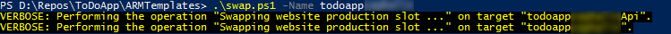

<properties
    pageTitle="Distribuzione flighting (test della versione beta) nel servizio App Azure"
    description="Informazioni su come flight nuove funzioni per l'app o beta test gli aggiornamenti in questa esercitazione-to-end. Questa soluzione riunisce le caratteristiche di App del quali pubblicazione continua bande orarie, routing del traffico e integrazione approfondimenti applicazione."
    services="app-service\web"
    documentationCenter=""
    authors="cephalin"
    manager="wpickett"
    editor=""/>

<tags
    ms.service="app-service-web"
    ms.workload="web"
    ms.tgt_pltfrm="na"
    ms.devlang="na"
    ms.topic="article"
    ms.date="02/02/2016"
    ms.author="cephalin"/>
# Distribuzione flighting (test della versione beta) nel servizio App Azure

In questa esercitazione viene illustrato come eseguire *distribuzioni flighting* tramite l'integrazione le varie funzionalità del [Servizio di App Azure](http://go.microsoft.com/fwlink/?LinkId=529714) e [Azure applicazione approfondimenti](/services/application-insights/). 

*Flighting* è un processo di distribuzione che convalida una nuova caratteristica o modifica di un numero limitato di clienti reali ed è un grande test in uno scenario di produzione. È simile alla versione beta test e in alcuni casi è noto come "test controllati volo". Molte grandi aziende con una presenza sul web usare questo approccio per ottenere gli aggiornamenti di app nella loro pratica di [sviluppo agile](https://en.wikipedia.org/wiki/Agile_software_development)convalida iniziale. Servizio App Azure consente l'integrazione di test di produzione con continuo pubblicazione e informazioni dettagliate sui applicazione per implementare lo stesso scenario attrezzi. Vantaggi di questo approccio:

- **Guadagno reale commenti e suggerimenti _prima di_ aggiornamenti di produzione** - l'unica migliore ottenere commenti e suggerimenti non appena si rilascia sta per essere commenti e suggerimenti prima di rilasciare. È possibile verificare aggiornamenti traffico utente reale e comportamenti non appena sono desiderato nel ciclo di vita del prodotto.
- **Per migliorare [sviluppo basato su test continuo (CTDD)](https://en.wikipedia.org/wiki/Continuous_test-driven_development) ** - mediante l'integrazione di test di produzione con integrazione continua e strumentazione con informazioni dettagliate sui applicazione, la convalida degli utenti accade in anticipo e automatico nel ciclo di vita del prodotto. Consente di ridurre gli investimenti di tempo in esecuzione di test manuale.
- **Ottimizza test del flusso di lavoro** - mediante l'automazione test di produzione con continua monitoraggio strumentazione, possono essere potenzialmente svolte gli obiettivi di vari tipi di test in un unico processo, ad esempio [l'integrazione](https://en.wikipedia.org/wiki/Integration_testing), [regressione](https://en.wikipedia.org/wiki/Regression_testing), [facilità di utilizzo](https://en.wikipedia.org/wiki/Usability_testing), accessibilità, localizzazione, [prestazioni](https://en.wikipedia.org/wiki/Software_performance_testing), [sicurezza](https://en.wikipedia.org/wiki/Security_testing)e [accettazione](https://en.wikipedia.org/wiki/Acceptance_testing).

Una distribuzione flighting praticamente non instrada il traffico live. In questo tipo di distribuzione che si desidera ottenere informazioni più presto se sia un errore imprevisto, riduzione delle prestazioni, problemi relativi all'esperienza utente. Tenere presente che si sta utilizzando clienti reali. Per eseguire questa operazione destra, è necessario dunque, verificare che la distribuzione flighting siano impostati per raccogliere tutti i dati che necessari per prendere una decisione informata per il passaggio successivo. In questa esercitazione viene illustrato come raccogliere dati con informazioni dettagliate sui applicazione, ma è possibile utilizzare Relic nuovo o altre tecnologie che si adatta al proprio scenario. 

## Viene eseguita

In questa esercitazione si imparerà visualizzare gli scenari seguenti per testare l'applicazione di servizio di App nell'ambiente di produzione:

- [Instradare il traffico di produzione](app-service-web-test-in-production-get-start.md) all'app beta
- [Strumento l'app](../application-insights/app-insights-web-track-usage.md) per ottenere le metriche utili
- Continuamente distribuire l'app beta e tenere traccia delle metriche app live
- Confronto tra metriche tra l'app di produzione e app beta per vedere come le modifiche al codice servizio di traduzione verso i risultati

## È necessario

-   Un account Azure
-   Un account [GitHub](https://github.com/)
- Visual Studio 2015 - è possibile scaricare [Community edition](https://www.visualstudio.com/en-us/products/visual-studio-express-vs.aspx).
-   Shell fra (installato con [GitHub per Windows](https://windows.github.com/)-) in questo modo è possibile eseguire operazioni sia PowerShell comandi nella stessa sessione
-   Bit più recente di [PowerShell di Azure](https://github.com/Azure/azure-powershell/releases/download/v0.9.8-September2015/azure-powershell.0.9.8.msi)
-   Base informazioni delle operazioni seguenti:
    -   La distribuzione dei modelli di [Gestione risorse di Azure](../azure-resource-manager/resource-group-overview.md) (vedere [distribuire un'applicazione complessa prevedibili in Azure](app-service-deploy-complex-application-predictably.md))
    -   [Operazioni](http://git-scm.com/documentation)
    -   [PowerShell](https://technet.microsoft.com/library/bb978526.aspx)

> [AZURE.NOTE] È necessario un account Azure per completare l'esercitazione:
> + È possibile [aprire un account Azure gratuitamente](/pricing/free-trial/) - viene visualizzato crediti è possibile utilizzare per provare a pagamento servizi Azure e anche dopo che è utilizzate è possibile mantenere l'account e usare gratuiti servizi Azure, ad esempio Web Apps.
> + È possibile [attivare vantaggi sottoscrittore Visual Studio](/pricing/member-offers/msdn-benefits-details/) - abbonamento Your Visual Studio offre crediti ogni mese che è possibile utilizzare per i servizi di Azure a pagamento.
>
> Se si desidera iniziare a utilizzare il servizio di App Azure prima di iscriversi a un account Azure, accedere al [Servizio App provare](http://go.microsoft.com/fwlink/?LinkId=523751), in cui è possibile creare immediatamente un'app web starter breve nel servizio di App. Nessun carte di credito obbligatorio; Nessun impegni.

## Configurare un'app web di produzione

>[AZURE.NOTE] Lo script utilizzato in questa esercitazione configura automaticamente continua pubblicazione dal repository GitHub. È necessario che le credenziali GitHub sono già archiviate nell'Azure, in caso contrario la distribuzione di script avrà esito negativo durante il tentativo di configurare le impostazioni di controllo di origine per le applicazioni web.
>
>Per archiviare le credenziali GitHub in Azure, creare un'app web nel [Portale di Azure](https://portal.azure.com/) e [configurare la distribuzione di GitHub](app-service-continuous-deployment.md#Step7). È sufficiente eseguire questa operazione una sola volta.

In uno scenario di attrezzi tipico, è installata un'applicazione che esegue live in Azure e si desidera apportare modifiche fino alla pubblicazione continua. In questo scenario, verrà distribuita nell'ambiente di produzione un modello che sono state sviluppate e testati.

1.  Creare il proprio divisione dell'archivio [ToDoApp](https://github.com/azure-appservice-samples/ToDoApp) . Per informazioni sulla creazione la divisione, vedere [divisione un Repo](https://help.github.com/articles/fork-a-repo/). Dopo aver creato la divisione, è possibile visualizzarlo nel browser.

    

2.  Aprire una sessione di Shell fra. Se ancora non si dispone fra Shell, installa [GitHub per Windows](https://windows.github.com/) .
3.  Creare un duplicato locale della divisione eseguendo il comando seguente:

        git clone https://github.com/<your_fork>/ToDoApp.git

4.  Dopo avere creato la copia locale, passare a * &lt;repository_root >*\ARMTemplates ed eseguire il deploy.ps1 script con un suffisso univoco, come illustrato di seguito:

        .\deploy.ps1 –RepoUrl https://github.com/<your_fork>/todoapp.git -ResourceGroupSuffix <your_suffix>

4.  Quando richiesto, digitare il nome utente desiderato e la password per l'accesso al database. Memorizza le credenziali di database perché è necessario specificarle nuovamente quando si aggiorna il gruppo di risorse.

    Verrà visualizzato lo stato di avanzamento provisioning delle varie risorse Azure. Al termine del processo di distribuzione, lo script di avvio dell'applicazione nel browser e assegnare un segnale acustico descrittivo.
    

6.  Tornare nella sessione Shell fra eseguire:

        .\swap –Name ToDoApp<your_suffix>

    

7.  Al termine dell'esecuzione dello script, tornare indietro per passare all'indirizzo del front-end (http://ToDoApp*&lt;your_suffix >*.azurewebsites.net/) per visualizzare l'applicazione in fase di produzione.
5.  Accedere al [Portale di Azure](https://portal.azure.com/) e dare un'occhiata qual è creato.

    Dovrebbe essere possibile vedere due web apps nello stesso gruppo di risorse, uno con la `Api` suffisso del nome. Se osserva la visualizzazione di gruppo di risorse, si vedranno anche il Database di SQL e server, il piano di servizio di App e le bande orarie di gestione temporanea per web apps. Sfogliare le risorse diversi e di confrontarle con * &lt;repository_root >*\ARMTemplates\ProdAndStage.json per vedere come vengono configurati nel modello.

    

Impostare l'app di produzione.  A questo punto, immaginiamo ricevere commenti e suggerimenti che facilità di utilizzo è insufficiente per l'app. In modo che si decide di provare a utilizzare. Si intende dotare l'app per inviare commenti e suggerimenti.

## Provare a utilizzare: Dotare l'applicazione client/metriche di monitoraggio

5. Apri * &lt;repository_root >*\src\MultiChannelToDo.sln in Visual Studio.
6. Ripristinare tutti i pacchetti Nuget facendo soluzione > **Gestisci pacchetti NuGet per soluzione** > **ripristinare**.
6. Rapida **MultiChannelToDo.Web** > **Aggiungere applicazione approfondimenti telemetria** > **Configura impostazioni** > Cambia gruppo risorsa a ToDoApp*&lt;your_suffix >* > **Aggiungere informazioni dettagliate sui applicazione al progetto**.
7. Nel portale di Azure, aprire e il per la risorsa di comprendere l'applicazione **MultiChannelToDo.Web** . Nella parte **dello stato applicazione** , fare clic su **informazioni su come raccogliere dati di caricamento della pagina del browser** > Copia codice.
7. Aggiungere il codice di strumentazione JS copiato al * &lt;repository_root >*\src\MultiChannelToDo.Web\app\Index.cshtml prima la parentesi di chiusura `<heading>` tag. Deve contenere il tasto strumentazione univoci della risorsa comprendere l'applicazione.

        

11. Inviare eventi personalizzati a informazioni dettagliate sui applicazione per mouse clic aggiungendo il codice seguente alla fine del corpo:

        

    Il frammento di codice JavaScript invia un evento personalizzato a informazioni dettagliate sui applicazione ogni volta che un utente fa clic in un punto qualsiasi in web app.

12. Nella Shell fra, eseguire il commit e push le modifiche desiderate per la divisione in GitHub. Attendere che ai client di aggiornare i browser.

        git add -A :/
        git commit -m "add AI configuration for client app"
        git push origin master

6.  Scambio di tutte le app distribuita nell'ambiente di produzione:

        .\swap –Name ToDoApp<your_suffix>

13. Individuare la risorsa applicazione approfondimenti configurato. Fare clic su eventi personalizzati.

    

    Se non è visibile metriche per gli eventi personalizzati, attendere qualche minuto e fare clic su **Aggiorna**.

Si supponga che viene visualizzato un grafico come sotto:

E la griglia evento sotto di essa:

In base al codice dell'applicazione ToDoApp evento **pulsante** corrisponde al pulsante Invia e l'evento **INPUT** corrisponde alla casella di testo. Finora, aspetti avere senso. Tuttavia, sembra che non esiste un importo efficace di clic e pochi clic su attività da svolgere (eventi **LI** ).

In base a questo modulo è l'ipotesi che alcuni utenti confuse quale parte dell'interfaccia utente sia selezionabile e perché il cursore è applicato lo stile per la selezione di testo quando viene posizionato nelle voci di elenco e relative icone.

Può trattarsi di un esempio forzato. Tuttavia, che si desidera effettuare un'analisi utilizzo software per l'app e quindi eseguire una distribuzione flighting per ricevere commenti e suggerimenti facilità di utilizzo dei clienti live.

### Dotare l'app server di monitoraggio/metriche
Si tratta di una tangente poiché lo scenario illustrato in questa esercitazione sono disponibili solo con l'applicazione client. Tuttavia, per completezza verranno impostati app sul lato server.

6. Rapida **MultiChannelToDo** > **Aggiungere applicazione approfondimenti telemetria** > **Configura impostazioni** > Cambia gruppo risorsa a ToDoApp*&lt;your_suffix >* > **Aggiungere informazioni dettagliate sui applicazione al progetto**.
12. Nella Shell fra, eseguire il commit e push le modifiche desiderate per la divisione in GitHub. Attendere che ai client di aggiornare i browser.

        git add -A :/
        git commit -m "add AI configuration for server app"
        git push origin master

6.  Scambio di tutte le app distribuita nell'ambiente di produzione:

        .\swap –Name ToDoApp<your_suffix>

Questo è tutto!

## Provare a utilizzare: Aggiungere tag specifici di intervallo aperto a metriche l'applicazione client

In questa sezione, configurare le bande distribuzione diversi per inviare la stessa risorsa applicazione approfondimenti telemetria specifici di intervallo aperto. In questo modo, è possibile confrontare i dati di telemetria tra il traffico da diverse bande orarie (ambienti di distribuzione) per vedere facilmente l'effetto delle modifiche app. Allo stesso tempo, è possibile separare il traffico di produzione rispetto al resto in modo che è possibile continuare a monitorare l'app di produzione in base alle esigenze.

Poiché si sta raccogliere dati sulle comportamento client, sarà necessario [aggiungere un inizializzatore di telemetria al codice JavaScript](../application-insights/app-insights-api-custom-events-metrics.md#js-initializer) in index.cshtml. Se si desidera verificare le prestazioni sul lato server, ad esempio, è possibile anche eseguire in modo analogo nel codice server (vedere [Applicazione approfondimenti API per metriche ed eventi personalizzati](../application-insights/app-insights-api-custom-events-metrics.md).

1. Prima di tutto, aggiungere il codice bewteen due `//` commenti sotto nel JavaScript bloccano cui si è aggiunto il `<heading>` tag in precedenza.

        window.appInsights = appInsights;

        // Begin new code
        appInsights.queue.push(function () {
            appInsights.context.addTelemetryInitializer(function (envelope) {
                var telemetryItem = envelope.data.baseData;
                telemetryItem.properties = telemetryItem.properties || {};
                telemetryItem.properties["Environment"] = "@System.Configuration.ConfigurationManager.AppSettings["environment"]";
            });
        });
        // End new code

        appInsights.trackPageView();

    Questo codice inizializzatore indica la `appInsights` oggetto per aggiungere l'una proprietà personalizzata denominata `Environment` a ogni parte di telemetria Invia.

2. Aggiungere questa proprietà personalizzata come [impostazione intervallo aperto](web-sites-staged-publishing.md#AboutConfiguration) per un'app web di Azure. A tale scopo, eseguire i comandi seguenti nella sessione fra Shell.

        $app = Get-AzureWebsite -Name todoapp<your_suffix> -Slot production
        $app.AppSettings.Add("environment", "Production")
        $app.SlotStickyAppSettingNames.Add("environment")
        $app | Set-AzureWebsite -Name todoapp<your_suffix> -Slot production

    Config nel progetto già definisce il `environment` impostazione app. Con questa impostazione, quando si verifica l'app in locale, le metriche verranno contrassegnate con `VS Debugger`. Tuttavia, quando si inserisce le modifiche in Azure, Azure verrà trovare e usare il `environment` impostazione nella configurazione dell'applicazione web app e le metriche verranno contrassegnate con `Production`.

3. Eseguire il commit e inserire le modifiche al codice per la divisione in GitHub e quindi attendere che gli utenti di utilizzare la nuova app (la necessità di aggiornare il browser). Bastano circa 15 minuti per la nuova proprietà visualizzare dati dell'applicazione `MultiChannelToDo.Web` risorse.

        git add -A :/
        git commit -m "add environment property to AI events for client app"
        git push origin master

4. A questo punto, passare di nuovo e il **eventi personalizzati** e filtrare le metriche `Environment=Production`. È ora possibile visualizzare tutti i nuovi eventi personalizzati nell'intervallo di aperto produzione con il filtro.

    

5. Fare clic sul pulsante **Preferiti** per salvare le impostazioni correnti metriche Explorer simile al **gli eventi personalizzati: produzione**. È semplice passare da questa visualizzazione e una distribuzione intervallo aperto in un secondo momento.

    > [AZURE.TIP] Per maggiore efficacia analitica, provare a [integrare la risorsa applicazione approfondimenti con Power BI](../application-insights/app-insights-export-power-bi.md).

### Aggiungere tag specifici di intervallo aperto a metriche di app del server
Di nuovo per completezza verranno impostati app sul lato server. Diversamente da quanto succede dell'app client strumentazione in JavaScript, tag specifici di intervallo aperto per l'app server strumentazione con codice .NET.

1. Apri * &lt;repository_root >*\src\MultiChannelToDo\Global.asax.cs. Aggiungere il blocco di codice seguente, prima la parentesi di chiusura graffa di apertura dello spazio dei nomi.

        namespace MultiChannelToDo
        {
                ...

                // Begin new code
            public class ConfigInitializer
            : ITelemetryInitializer
            {
                void ITelemetryInitializer.Initialize(ITelemetry telemetry)
                {
                    telemetry.Context.Properties["Environment"] = System.Configuration.ConfigurationManager.AppSettings["environment"];
                }
            }
                // End new code
        }

2. Correggere gli errori di risoluzione dei nomi mediante l'aggiunta di `using` istruzioni sotto all'inizio del file:

        using Microsoft.ApplicationInsights.Channel;
        using Microsoft.ApplicationInsights.Extensibility;

3. Aggiungere il codice seguente all'inizio di `Application_Start()` metodo:

        TelemetryConfiguration.Active.TelemetryInitializers.Add(new ConfigInitializer());

3. Eseguire il commit e inserire le modifiche al codice per la divisione in GitHub e quindi attendere che gli utenti di utilizzare la nuova app (la necessità di aggiornare il browser). Bastano circa 15 minuti per la nuova proprietà visualizzare dati dell'applicazione `MultiChannelToDo` risorse.

        git add -A :/
        git commit -m "add environment property to AI events for server app"
        git push origin master

## Aggiornamento: Configurare la diramazione beta

2. Apri * &lt;repository_root >*\ARMTemplates\ProdAndStagetest.json e individuare il `appsettings` risorse (cercare `"name": "appsettings"`). Sono disponibili 4 degli indicatori, uno per ogni intervallo aperto. 

2. Per ogni `appsettings` risorsa, aggiungere un `"environment": "[parameters('slotName')]"` impostazione app alla fine della `properties` in forma di matrice. Non dimenticare di terminare la riga precedente con un punto e virgola.

    
    
    Appena aggiunto il `environment` impostazione app per tutte le bande nel modello.
    
2. Nello stesso file, individuare il `slotconfignames` risorse (cercare `"name": "slotconfignames"`). Esistono 2 degli indicatori, uno per ogni app.

2. Per ogni `slotconfignames` risorsa, aggiungere `"environment"` alla fine della `appSettingNames` in forma di matrice. Non dimenticare di terminare la riga precedente con un punto e virgola.

    Sono state apportate il `environment` app impostazione stick per il relativo spazio distribuzione rispettivi per entrambe le applicazioni.  

3. Durante la sessione di Shell fra, eseguita i comandi seguenti con lo stesso suffisso gruppo risorse che è utilizzato in precedenza.

        git checkout -b beta
        git push origin beta
        .\deploy.ps1 -RepoUrl https://github.com/<your_fork>/ToDoApp.git -ResourceGroupSuffix <your_suffix> -SlotName beta -Branch beta

4. Quando richiesto, specificare le stesse credenziali di database SQL come prima. Quando viene chiesto di aggiornare il gruppo di risorse, digitare `Y`, quindi `ENTER`.

    Una volta lo script termina, tutte le risorse nel gruppo di risorse originale vengono mantenute, ma un nuovo denominare "beta" viene creata al suo interno con la stessa configurazione l'intervallo di aperto "Prova" è stato creato in inizio.

    >[AZURE.NOTE] Questo metodo di creazione di distribuzione diversi ambienti è diverso da quello in [fase di sviluppo software Agile con Azure App servizio](app-service-agile-software-development.md). In questo caso, è creare ambienti di distribuzione con guide di distribuzione, in cui quanti si creare ambienti di distribuzione con i gruppi di risorse. Gestire gli ambienti di distribuzione con i gruppi di risorse consente di mantenere l'ambiente di produzione intoccabili agli sviluppatori, ma non è facile eseguire test di produzione, è possibile eseguire facilmente con guide.

Se si desidera, è anche possibile creare un'app alfa eseguendo

    git checkout -b alpha
    git push origin alpha
    .\deploy.ps1 -RepoUrl https://github.com/<your_fork>/ToDoApp.git -ResourceGroupSuffix <your_suffix> -SlotName beta -Branch alpha

Per questa esercitazione, semplicemente mantenere utilizzando l'app beta.

## Aggiornamento: Push gli aggiornamenti all'app beta

Tornare all'app che si desidera migliorare.

1. Assicurarsi che a questo punto è il ramo beta

        git checkout beta

2. In * &lt;repository_root >*\src\MultiChannelToDo.Web\app\Index.cshtml, trovare il `<li>` tag e aggiungere la `style="cursor:pointer"` dell'attributo, come illustrato di seguito.

    

3. commit e push in Azure.

4. Verificare che le modifiche a questo punto si rifletteranno nell'intervallo di aperto beta posizionandosi http://todoapp*&lt;your_suffix >*-beta.azurewebsites.net/. Se ancora non è visibile la modifica, aggiornare il browser per ottenere il nuovo codice javascript.

    

Dopo aver creato la modifica in esecuzione nell'intervallo di aperto beta, si è pronti eseguire una distribuzione flighting.

## Convalida: Instradare il traffico di all'app beta

In questa sezione, si indirizza il traffico all'app beta. For sake of chiarezza di dimostrazione, verrà per instradare una parte significativa del traffico utente. In realtà, la quantità di traffico che si desidera distribuire dipenderà esigenze specifiche. Ad esempio, se il sito si trova la scala del microsoft.com, potrebbe essere necessario minore di 1% del traffico totale in modo da ottenere dati utili.

1. Durante la sessione di Shell fra, eseguire i comandi seguenti per instradare la metà del traffico produzione all'intervallo di aperto beta:

        $siteName = "ToDoApp<your suffix>"
        $rule = New-Object Microsoft.WindowsAzure.Commands.Utilities.Websites.Services.WebEntities.RampUpRule
        $rule.ActionHostName = "$siteName-beta.azurewebsites.net"
        $rule.ReroutePercentage = 50
        $rule.Name = "beta"
        Set-AzureWebsite $siteName -Slot Production -RoutingRules $rule

  Il `ReroutePercentage=50` proprietà specifica che instradati 50% il traffico di produzione all'URL dell'app beta (specificato per il `ActionHostName` proprietà).

2. A questo punto passare a http://ToDoApp*&lt;your_suffix >*. azurewebsites.net. a questo punto reindirizzati 50% del traffico per l'intervallo di aperto beta.

3. In risorsa approfondimenti applicazioni, filtrare le metriche dall'ambiente = "beta".

    > [AZURE.NOTE] Se si salva questa visualizzazione filtrata in un'altra preferito, è possibile utilizzarla facilmente i visualizzatori metriche tra le visualizzazioni beta e produzione.

Si supponga che in applicazione approfondimenti è visualizzata sarà simile al seguente:

Non solo è ciò che mostra che sono disponibili molte più clic sul `<li>` tag, ma sembra essere un aumento del mouse su `<li>` tag. È quindi possibile concludere che gli utenti sono individuati il nuovo `<li>` tag sono selezionabili e sono ora cancellare tutte le attività completate in precedenza nell'app.

In base ai dati della distribuzione flighting, si ritiene che la nuova interfaccia utente di produzione.

## Pubblicazione: spostare di nuovo codice nell'ambiente di produzione

A questo punto si è pronti spostare l'aggiornamento di produzione. Che cos'è ideale è che ora si sa che l'aggiornamento è già stato convalidato _prima_ viene inserito nell'ambiente di produzione. A questo punto possiamo è possibile distribuirlo. Poiché è stata un aggiornamento all'applicazione client AngularJS, si convalidati solo codice sul lato client. Se si volesse apportare modifiche all'app API Web back-end, è possibile convalidare le modifiche apportate allo stesso modo semplice e rapido.

1. Nella Shell fra, rimuovere la regola di routing il traffico eseguendo il comando seguente:

        Set-AzureWebsite $siteName -Slot Production -RoutingRules @()

2. Eseguire i comandi di operazioni:

        git checkout master
        git pull origin master
        git merge beta
        git push origin master

2. Attendere alcuni minuti per il nuovo codice per la distribuzione per l'intervallo di gestione temporanea aperto e quindi avviare http://ToDoApp*&lt;your_suffix >*-staging.azurewebsites.net per verificare che il nuovo aggiornamento è riscaldato l'intervallo di gestione temporanea aperto. Tenere presente che la diramazione master della divisione verrà collegata all'intervallo aperto gestione temporanea dell'app.

3. A questo punto, sostituire l'intervallo di gestione temporanea aperto nell'ambiente di produzione

        cd <ROOT>\ToDoApp\ARMTemplates
        .\swap.ps1 -Name todoapp<your_suffix>

## Riepilogo ##

Servizio App Azure semplifica l'individuazione di piccole e medie imprese testare le applicazioni per i clienti di produzione, destinati in genere eseguito in grandi aziende. Questa esercitazione ha concesso le informazioni necessarie per riunire App servizio e applicazione approfondimenti per effettuare chiamate distribuzione flighting e anche altri scenari di test di produzione, il mondo attrezzi. 

## Altre risorse ##

-   [Sviluppo software Agile con il servizio di App Azure](app-service-agile-software-development.md)
-   [Configurare gli ambienti per web apps in Azure App servizio di gestione temporanea](web-sites-staged-publishing.md)
-   [Distribuire un'applicazione complessa prevedibili in Azure](app-service-deploy-complex-application-predictably.md)
-   [Creazione di modelli di gestione risorse di Azure](../resource-group-authoring-templates.md)
-   [JSONLint - convalida JSON](http://jsonlint.com/)
-   [Diramazione fra-base diramazioni e unione](http://www.git-scm.com/book/en/v2/Git-Branching-Basic-Branching-and-Merging)
-   [PowerShell Azure](../powershell-install-configure.md)
-   [Progetto Kudu Wiki](https://github.com/projectkudu/kudu/wiki)
