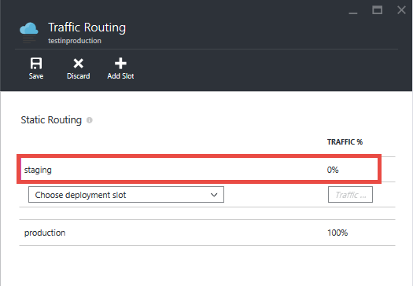

<properties
    pageTitle="Guida introduttiva a test di produzione per Web Apps"
    description="Informazioni sui Test nella funzionalità di produzione (suggerimento) in Azure App servizio Web Apps."
    services="app-service\web"
    documentationCenter=""
    authors="cephalin"
    manager="wpickett"
    editor=""/>

<tags
    ms.service="app-service-web"
    ms.workload="web"
    ms.tgt_pltfrm="na"
    ms.devlang="na"
    ms.topic="article"
    ms.date="01/13/2016"
    ms.author="cephalin"/>

# Guida introduttiva a test di produzione per Web Apps

Test di produzione o live-test di un'applicazione web usando il traffico live cliente, è una strategia di test che gli sviluppatori di app integrano sempre più loro metodologia di [sviluppo agile](https://en.wikipedia.org/wiki/Agile_software_development) . Consente di verificare la qualità delle applicazioni con il traffico di live utente nel proprio ambiente di produzione, anziché sintesi dati in un ambiente di testing. Tramite l'esposizione la nuova app per gli utenti reali, possono essere informati sui problemi reali che sorgere l'app distribuita. È possibile verificare la funzionalità, prestazioni e valore gli aggiornamenti di app contro volume, la velocità e diversi tipi di traffico di utenti reali, non è mai simile in un ambiente di testing.

## Traffico Routing nelle App servizio Web App

Con la funzionalità di Routing del traffico in [Azure App servizio](http://go.microsoft.com/fwlink/?LinkId=529714), è possibile indirizzare una parte del traffico utenti live a uno o più [bande orarie di distribuzione](web-sites-staged-publishing.md)e quindi analizzare l'app con [Informazioni dettagliate sui applicazione Azure](/services/application-insights/) o [Azure HDInsight](/services/hdinsight/)o uno strumento di terze parti come [Nuovo Relic](/marketplace/partners/newrelic/newrelic/) per convalidare la modifica. Ad esempio, è possibile implementare gli scenari seguenti con il servizio di App:

- Alla scoperta di bug funzionale o individuare problemi di prestazioni negli aggiornamenti prima della distribuzione a livello di sito
- Eseguire "test controllati voli" delle modifiche dalla misura metriche usibility App beta
- Rampa gradualmente fino a un nuovo aggiornamento e normalmente indietro verso il basso fino a quella corrente in caso di errore 
- Ottimizzare i risultati dell'app aziendali eseguendo [A / B testa](https://en.wikipedia.org/wiki/A/B_testing) o [test multivariate](https://en.wikipedia.org/wiki/Multivariate_testing_in_marketing) in più guide di distribuzione

### Requisiti per l'utilizzo di Routing del traffico in Web App

- App web è necessario eseguire al livello **Standard** o **Premium** , come richiesto per più guide di distribuzione.
- Per il corretto funzionamento, il traffico Routing richiede i cookie per essere abilitato in browser degli utenti. Il traffico Routing utilizza cookie consente di aggiungere un browser del client di spazio di distribuzione per la durata sessione del client.
- Il traffico Routing supporta gli scenari avanzati suggerimento tramite i cmdlet di PowerShell Azure.

## Segmento instradare il traffico spazio distribuzione

Livello di base in ogni scenario di suggerimento, viene instradata una percentuale predefinita di traffico live a spazio non produzione distribuzione. A tale scopo, eseguire la procedura seguente:

>[AZURE.NOTE] Questi passaggi si presuppone che si dispone già di un [intervallo aperto distribuzione non produzione](web-sites-staged-publishing.md) e che il contenuto di app web desiderato è già [distribuito](web-sites-deploy.md) in essa.

1. Accedere al [portale di Azure](https://portal.azure.com/).
2. In blade dell'applicazione web, fare clic su **Impostazioni** > **Routing del traffico**.
  
3. Selezionare l'intervallo di aperto che si desidera instradare il traffico e la percentuale del traffico totale desiderato, quindi fare clic su **Salva**.

    

4. Passare a blade dell'intervallo di aperto di distribuzione. Viene visualizzato il traffico live stato instradato a essa.

    

Dopo aver configurato il traffico Routing, la percentuale specificata dei client in modo casuale instradata per l'intervallo di produzione non aperto. Tuttavia, è importante tenere presente che una volta un client viene instradato automaticamente a un intervallo specifico aperto, verrà "bloccato" per tale intervallo aperto per la durata della sessione client. L'operazione viene eseguita mediante un cookie consente di aggiungere la sessione dell'utente. Se si controlla le richieste HTTP, sarà possibile trovare un `TipMix` cookie in ogni richiesta successiva.

## Forzare le richieste dei client a un intervallo specifico aperto

Oltre a routing automatico del traffico, App servizio è in grado di inoltrare richieste a un intervallo specifico aperto. Questo è utile quando si desidera che gli utenti potranno acconsentire in o al rifiuto esplicito dell'app beta. Per eseguire questa operazione, utilizzare la `x-ms-routing-name` parametro della query.

Per reindirizzare gli utenti a un intervallo specifico aperto utilizzando `x-ms-routing-name`, è necessario assicurarsi che che è già stato aggiunto all'elenco di Routing del traffico. Dal momento che si desidera inviare a un intervallo di aperto in modo esplicito, la percentuale di routing effettiva che è impostata non ha importanza. Se si desidera, è possibile creare "beta collegamento" che consente agli utenti di accedere all'app beta.

### Scegliere utenti dall'app beta

Per consentire agli utenti di rifiutare esplicitazione l'app beta, ad esempio, è possibile inserire il collegamento nella pagina web:

    <a href="<webappname>.azurewebsites.net/?x-ms-routing-name=self">Go back to production app</a>

La stringa `x-ms-routing-name=self` specifica l'intervallo di aperto di produzione. Una volta al browser accedere al collegamento, non solo viene reindirizzato per l'intervallo di aperto di produzione, ma ogni richiesta successiva conterrà la `x-ms-routing-name=self` cookie blocca la sessione per l'intervallo di aperto di produzione.

### Scegliere se consentire agli utenti di app beta

Per consentire agli utenti di acconsentire esplicitamente all'app beta, impostare lo stesso parametro di query il nome dell'intervallo aperto non produzione, ad esempio:

        <webappname>.azurewebsites.net/?x-ms-routing-name=staging

## Altre risorse ##

-   [Configurare gli ambienti per web apps in Azure App servizio di gestione temporanea](web-sites-staged-publishing.md)
-   [Distribuire un'applicazione complessa prevedibili in Azure](app-service-deploy-complex-application-predictably.md)
-   [Sviluppo software Agile con il servizio di App Azure](app-service-agile-software-development.md)
-   [Utilizzare gli ambienti attrezzi in modo efficace per le applicazioni web](app-service-web-staged-publishing-realworld-scenarios.md)