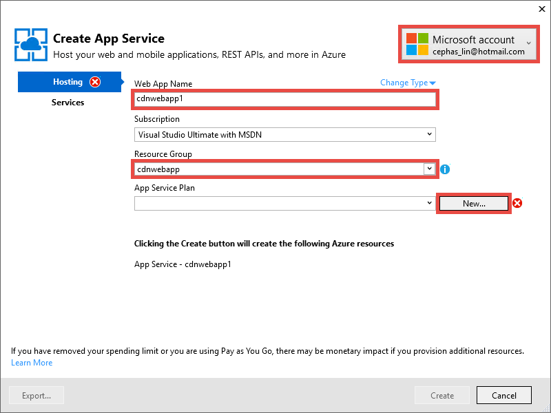
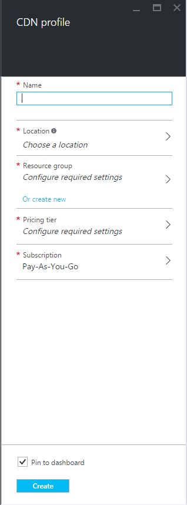
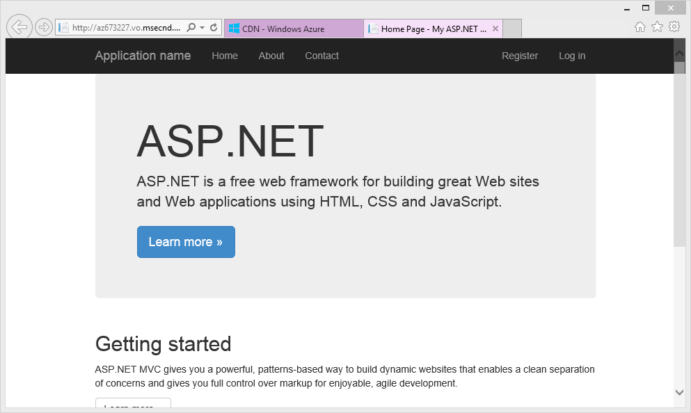
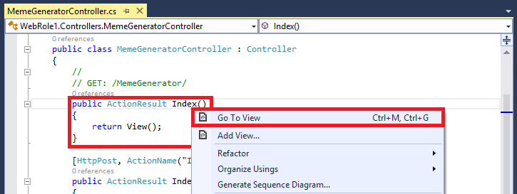
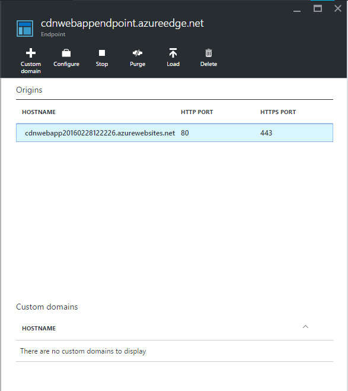

<properties 
    pageTitle="Utilizzare CDN Azure nel servizio App Azure" 
    description="Un'esercitazione che illustra come distribuire un'app web al servizio di App Azure che serve il contenuto di un estremo Azure CDN integrato" 
    services="app-service\web,cdn" 
    documentationCenter=".net" 
    authors="cephalin" 
    manager="wpickett" 
    editor="jimbe"/>

<tags 
    ms.service="app-service" 
    ms.workload="tbd" 
    ms.tgt_pltfrm="na" 
    ms.devlang="dotnet" 
    ms.topic="article" 
    ms.date="07/01/2016" 
    ms.author="cephalin"/>


# <a name="use-azure-cdn-in-azure-app-service"></a>Utilizzare CDN Azure nel servizio App Azure

[Servizio di App](http://go.microsoft.com/fwlink/?LinkId=529714) può essere integrato con [Azure CDN](/services/cdn/), aggiungere le funzionalità di ridimensionamento globale inerenti [App servizio Web Apps](http://go.microsoft.com/fwlink/?LinkId=529714) , è necessario gestire il contenuto di app web globalmente da nodi server accanto ai clienti (un elenco di tutti i percorsi di nodo corrente aggiornato disponibili [qui](http://msdn.microsoft.com/library/azure/gg680302.aspx)). Scenari come disporre di immagini statiche, questa integrazione notevolmente possibile migliorare le prestazioni delle applicazioni Azure App servizio Web e in modo significativo migliora l'esperienza utente dell'applicazione web in tutto il mondo. 

Integrazione di Web Apps con Azure CDN offre i seguenti vantaggi:

- Integrare distribuzione del contenuto (immagini, script e fogli di stile) come parte del processo di [distribuzione continua](app-service-continuous-deployment.md) dell'applicazione web
- Aggiornare facilmente i pacchetti NuGet in un'app web di Azure App servizio, ad esempio jQuery o versioni avvio 
- Gestire l'applicazione Web e al contenuto served CDN dalla stessa interfaccia di Visual Studio
- Integrare ASP.NET aggregazione e riduzione con Azure CDN

[AZURE.INCLUDE [app-service-web-to-api-and-mobile](../../includes/app-service-web-to-api-and-mobile.md)] 

## <a name="what-you-will-build"></a>Si creerà ##

Si distribuire un'app web al servizio di App Azure mediante l'impostazione predefinita modello MVC ASP.NET in Visual Studio, aggiungere il codice per la gestione di contenuto da un CDN Azure integrate, ad esempio un'immagine, risultati, controller di azione predefiniti JavaScript e file CSS e anche scrivere codice per configurare il meccanismo di fallback bundle servita nel caso in cui la rete CDN è offline.

## <a name="what-you-will-need"></a>È necessario ##

In questa esercitazione sono previsti i prerequisiti seguenti:

-   Un [account di Microsoft Azure](/account/) attivo
-   Visual 2015 Studio con [Azure SDK per .NET](http://go.microsoft.com/fwlink/p/?linkid=323510&clcid=0x409). Se si utilizza Visual Studio, la procedura può variare.

> [AZURE.NOTE] È necessario un account Azure per completare l'esercitazione:
> + È possibile [aprire un account Azure gratuitamente](/pricing/free-trial/) - viene visualizzato crediti è possibile utilizzare per provare a pagamento servizi Azure e anche dopo che è utilizzate è possibile mantenere l'account e usare gratuiti servizi Azure, ad esempio Web Apps.
> + È possibile [attivare vantaggi sottoscrittore Visual Studio](/pricing/member-offers/msdn-benefits-details/) - abbonamento Your Visual Studio offre crediti ogni mese che è possibile utilizzare per i servizi di Azure a pagamento.
>
> Se si desidera iniziare a utilizzare il servizio di App Azure prima di iscriversi a un account Azure, accedere al [Servizio App provare](http://go.microsoft.com/fwlink/?LinkId=523751), in cui è possibile creare immediatamente un'app web starter breve nel servizio di App. Nessun carte di credito obbligatorio; Nessun impegni.

## <a name="deploy-a-web-app-to-azure-with-an-integrated-cdn-endpoint"></a>Distribuire un'app web Azure con un endpoint CDN integrato ##

In questa sezione, si distribuisce il modello di applicazione MVC ASP.NET in Visual Studio 2015 predefinito al servizio di App e quindi essere integrato con un nuovo endpoint CDN. Seguire le istruzioni seguenti:

1. In Visual Studio 2015, creare una nuova applicazione web ASP.NET dalla barra dei menu facendo clic su **File > Nuovo > progetto > Web > applicazione Web ASP.NET**. Assegnare un nome e fare clic su **OK**.

    

3. Selezionare **MVC** e fare clic su **OK**.

    

4. Se è stato ancora eseguito l'accesso account Azure ancora, fare clic sull'icona account nell'angolo superiore destro e seguire la finestra di dialogo per accedere all'account di Azure. Al termine, configurare l'app, come illustrato di seguito, quindi fare clic su **Nuovo** per creare un nuovo piano di servizio di App per l'app.  

    

5. Configurare un nuovo piano di servizio di App nella finestra di dialogo, come illustrato di seguito e fare clic su **OK**. 

    

8. Fare clic su **Crea** per creare l'applicazione web.

    

9. Dopo aver creato l'applicazione ASP.NET, pubblicarlo in Azure nel riquadro attività di servizio di Azure App facendo clic su **Pubblica `<app name>` per questa App Web ora**. Fare clic su **pubblica** per completare il processo.

    

    Una volta completata la pubblicazione, verrà visualizzata l'app web pubblicato nel browser. 

1. Per creare un endpoint CDN, accedere al [portale di Azure](https://portal.azure.com). 
2. Fare clic su **+ nuova** > **Media + CDN** > **CDN**.

    

3. Specificare la **rete CDN**, **posizione**, **gruppo di risorse**, **prezzi livello**e quindi fare clic su **Crea**

       

4. Nel **Profilo CDN** blade fare clic sul pulsante **+ punto finale** . Assegnare un nome, selezionare **Web App** nell'elenco a discesa **Tipo di origine** e il web app nell'elenco a discesa **origine hostname** , quindi fare clic su **Aggiungi**.  

    


    > [AZURE.NOTE] Dopo aver creato l'endpoint CDN, e il **punto finale** illustra l'URL CDN e il dominio di origine che è integrato con. Tuttavia, potrebbe richiedere qualche minuto per la configurazione del nuovo endpoint CDN completamente essere propagati a tutti i percorsi CDN nodo. 

3. Di nuovo in e il **punto finale** , fare clic sul nome dell'endpoint CDN che appena creato.

    

3. Fare clic sul pulsante **Configura** . In e il **Configura** selezionare **memorizzare nella Cache ogni URL univoco** nell'elenco a discesa **stringa comportamento della cache di Query** , quindi fare clic sul pulsante **Salva** .


    

Se è stata attivata questa operazione, lo stesso collegamento accesso con stringhe di query diversi cache come voci distinte.

>[AZURE.NOTE] Mentre non è necessario per la sezione esercitazione per consentire la stringa di query, si desidera eseguire questa operazione durante la fase iniziale possibili per comodità poiché qualsiasi modifica apportata qui agirà da tempo propagazione delle modifiche apportate a tutti i nodi di rete CDN e non si vuole tutto il contenuto non query stringa-abilitati per a intasare la cache CDN (aggiornamento contenuto CDN verrà illustrato in un secondo momento).

2. A questo punto, passare all'indirizzo endpoint CDN. Se l'endpoint è pronta, è necessario verificare l'app web visualizzato. Se viene visualizzato un errore **404 HTTP** , l'endpoint CDN non è pronto. Potrebbe essere necessario attendere in un'ora per la configurazione di rete CDN propagate a tutti i nodi di bordo. 

    

1. Provare ad accedere al file **~/Content/bootstrap.css** nel progetto ASP.NET. Nella finestra del browser, passare a * *http://*&lt;cdnName >*.azureedge.net/Content/bootstrap.css**. Personale durante l'installazione, questo URL è:

        http://az673227.azureedge.net/Content/bootstrap.css

    Che corrisponde all'URL di origine seguenti endpoint CDN:

        http://cdnwebapp.azurewebsites.net/Content/bootstrap.css

    Quando si passa a * *http://*&lt;cdnName >*.azureedge.net/Content/bootstrap.css**, verrà richiesto di scaricare bootstrap.css proveniente da un'app web di Azure. 

    

È possibile accedere allo stesso modo qualsiasi URL accessibili in * *http://*&lt;nome >*.cloudapp.net/**, direttamente dall'endpoint CDN. Per esempio:

-   Un file con estensione js dal percorso /Script
-   Qualsiasi file di contenuto dal /Content percorso
-   Qualsiasi controller/azione 
-   Se la stringa di query è abilitata l'endpoint CDN, qualsiasi URL con stringhe di query
-   L'intera Azure web app se tutto il contenuto è pubblico

Si noti che potrebbe non essere sempre consigliabile (o in genere una buona idea) per servire un'app web di Azure intero tramite CDN Azure. Alcune delle avvertenze sono:

-   Questo approccio richiede l'intero sito come pubblico, perché CDN Azure non è possibile utilizzare qualsiasi contenuto riservato.
-   Se l'endpoint CDN in linea per qualsiasi motivo, se manutenzione pianificata o errori dell'utente, l'intero web app non è in linea a meno che i clienti possono essere reindirizzati all'URL di origine * *http://*&lt;nomesito >*.azurewebsites.net/**. 
-   Anche con le impostazioni di controllo della Cache personalizzate (vedere [configurare le opzioni per i file statici nelle applicazioni web Azure di cache](#configure-caching-options-for-static-files-in-your-azure-web-app)), un endpoint CDN non migliorare le prestazioni del contenuto altamente dinamiche. Se si è tentato di caricare la home page dall'endpoint CDN come mostrato in precedenza, si noti che ha richiesto almeno 5 secondi per caricare la home page predefinita la prima volta, è una pagina semplice. Si supponga che per l'esperienza client se questa pagina contiene contenuto dinamico che devono essere aggiornati ogni minuto. Utilizzo di contenuto dinamico da un endpoint CDN richiede scadenza della cache breve, che corrisponde a errori di cache frequenti all'endpoint CDN. Ciò influisce negativamente sulle prestazioni dell'applicazione web Azure e rendere inutile l'uso di una rete CDN.

In alternativa consiste nel determinare quali contenuti per servire da Azure CDN nel caso per caso nelle applicazioni web Azure. A tale scopo già stato come accedere a singoli file di contenuti da endpoint CDN. Illustra come utilizzare un'azione controller specifico attraverso l'endpoint CDN in [Distribuisci il contenuto da azioni del controller tramite CDN Azure](#serve-content-from-controller-actions-through-azure-cdn).

## <a name="configure-caching-options-for-static-files-in-your-azure-web-app"></a>Configurare le opzioni di memorizzazione nella cache per i file statici nelle applicazioni web Azure ##

Con l'integrazione di Azure CDN nelle applicazioni web Azure, è possibile specificare la modalità di memorizzazione nella cache nell'endpoint CDN in contenuto statico. A tale scopo, aprire *config* dal progetto ASP.NET (ad esempio **cdnwebapp**) e aggiungere un `<staticContent>` elemento da `<system.webServer>`. XML riportato di seguito consente di configurare la cache per scadere 3 giorni.  

    <system.webServer>
      <staticContent>
        <clientCache cacheControlMode="UseMaxAge" cacheControlMaxAge="3.00:00:00"/>
      </staticContent>
      ...
    </system.webServer>

Una volta eseguita questa operazione, tutti i file statici nelle applicazioni web Azure noterà la stessa regola nella cache CDN. Per un controllo più dettagliato delle impostazioni della cache, aggiungere un file *config* in una cartella e le impostazioni sono. Ad esempio, aggiungere un file *config* alla cartella *\Content* e sostituire il contenuto con il seguente codice XML:

    <?xml version="1.0"?>
    <configuration>
      <system.webServer>
        <staticContent>
          <clientCache cacheControlMode="UseMaxAge" cacheControlMaxAge="15.00:00:00"/>
        </staticContent>
      </system.webServer>
    </configuration>

Questa impostazione, tutti i file statici dalla cartella *\Content* da memorizzare nella cache per 15 giorni.

Per ulteriori informazioni su come configurare il `<clientCache>` elemento, vedere [Cache Client &lt;clientCache >](http://www.iis.net/configreference/system.webserver/staticcontent/clientcache).

Nella sezione successiva, inoltre illustra come è possibile configurare le impostazioni della cache per i risultati dell'azione controller nella cache CDN.

## <a name="serve-content-from-controller-actions-through-azure-cdn"></a>Visualizzare il contenuto da azioni del controller tramite CDN Azure ##

Quando si integra Web Apps con Azure CDN, è relativamente semplice per la gestione di contenuto da azioni del controller tramite la rete CDN di Azure. Anche se si decide di usare l'app web di Azure intero tramite la rete CDN, non è necessario farlo tutto poiché tutte le azioni controller raggiungibili tramite la rete CDN già. Tuttavia, per motivi di cui che ha già evidenziato nel [distribuire un'app web Azure con un endpoint CDN integrata](#deploy-a-web-app-to-azure-with-an-integrated-cdn-endpoint), è possibile decidere la e scegliere invece di selezionare l'azione controller che si desidera utilizzare da Azure CDN. [Maarten Balliauw](https://twitter.com/maartenballiauw) viene illustrato come eseguire con una divertente controller MemeGenerator latenza [decrescenti sul web con la rete CDN di Azure](http://channel9.msdn.com/events/TechDays/Techdays-2014-the-Netherlands/Reducing-latency-on-the-web-with-the-Windows-Azure-CDN). Verrà semplicemente riprodurre qui.

Si supponga che in un'applicazione web che si desidera generare memes in base a un'immagine di Chuck Norris giovane (foto dalla [Luce Ezio](http://www.flickr.com/photos/alan-light/218493788/)) come segue:


Si dispone di un semplice `Index` un'azione che consente di specificare i superlativi dell'immagine, quindi genera il meme dopo l'invio all'azione. Poiché si tratta Chuck Norris, che ci si aspetta questa pagina per imparare a livello globale notevolmente popolari. Si tratta di un buon esempio di utilizzo di contenuto dinamico semistrutturati con Azure CDN. 

Seguire i passaggi precedenti per questa azione di controller di configurazione:

1. Nella cartella *\Controllers* creare un nuovo file cs denominato *MemeGeneratorController.cs* e sostituire il contenuto con il codice seguente. Sostituire il percorso del file per `~/Content/chuck.bmp` e il nome di rete CDN per `yourCDNName`.


        using System;
        using System.Collections.Generic;
        using System.Diagnostics;
        using System.Drawing;
        using System.IO;
        using System.Net;
        using System.Web.Hosting;
        using System.Web.Mvc;
        using System.Web.UI;

        namespace cdnwebapp.Controllers
        {
          public class MemeGeneratorController : Controller
          {
            static readonly Dictionary<string, Tuple<string ,string>> Memes = new Dictionary<string, Tuple<string, string>>();

            public ActionResult Index()
            {
              return View();
            }

            [HttpPost, ActionName("Index")]
            public ActionResult Index_Post(string top, string bottom)
            {
              var identifier = Guid.NewGuid().ToString();
              if (!Memes.ContainsKey(identifier))
              {
                Memes.Add(identifier, new Tuple<string, string>(top, bottom));
              }

              return Content("<a href=\"" + Url.Action("Show", new {id = identifier}) + "\">here's your meme</a>");
            }

            [OutputCache(VaryByParam = "*", Duration = 1, Location = OutputCacheLocation.Downstream)]
            public ActionResult Show(string id)
            {
              Tuple<string, string> data = null;
              if (!Memes.TryGetValue(id, out data))
              {
                return new HttpStatusCodeResult(HttpStatusCode.NotFound);
              }

              if (Debugger.IsAttached) // Preserve the debug experience
              {
                return Redirect(string.Format("/MemeGenerator/Generate?top={0}&bottom={1}", data.Item1, data.Item2));
              }
              else // Get content from Azure CDN
              {
                return Redirect(string.Format("http://<yourCDNName>.azureedge.net/MemeGenerator/Generate?top={0}&bottom={1}", data.Item1, data.Item2));
              }
            }

            [OutputCache(VaryByParam = "*", Duration = 3600, Location = OutputCacheLocation.Downstream)]
            public ActionResult Generate(string top, string bottom)
            {
              string imageFilePath = HostingEnvironment.MapPath("~/Content/chuck.bmp");
              Bitmap bitmap = (Bitmap)Image.FromFile(imageFilePath);

              using (Graphics graphics = Graphics.FromImage(bitmap))
              {
                SizeF size = new SizeF();
                using (Font arialFont = FindBestFitFont(bitmap, graphics, top.ToUpperInvariant(), new Font("Arial Narrow", 100), out size))
                {
                    graphics.DrawString(top.ToUpperInvariant(), arialFont, Brushes.White, new PointF(((bitmap.Width - size.Width) / 2), 10f));
                }
                using (Font arialFont = FindBestFitFont(bitmap, graphics, bottom.ToUpperInvariant(), new Font("Arial Narrow", 100), out size))
                {
                    graphics.DrawString(bottom.ToUpperInvariant(), arialFont, Brushes.White, new PointF(((bitmap.Width - size.Width) / 2), bitmap.Height - 10f - arialFont.Height));
                }
              }
              MemoryStream ms = new MemoryStream();
              bitmap.Save(ms, System.Drawing.Imaging.ImageFormat.Png);
              return File(ms.ToArray(), "image/png");
            }

            private Font FindBestFitFont(Image i, Graphics g, String text, Font font, out SizeF size)
            {
              // Compute actual size, shrink if needed
              while (true)
              {
                size = g.MeasureString(text, font);

                // It fits, back out
                if (size.Height < i.Height &&
                     size.Width < i.Width) { return font; }

                // Try a smaller font (90% of old size)
                Font oldFont = font;
                font = new Font(font.Name, (float)(font.Size * .9), font.Style);
                oldFont.Dispose();
              }
            }
          }
        }

2. Pulsante destro del mouse in predefinito `Index()` azione e selezionare **Aggiungi visualizzazione**.

    

3.  Accettare le impostazioni seguenti e fare clic su **Aggiungi**.

    

4. Aprire una nuova *Views\MemeGenerator\Index.cshtml* e sostituire il contenuto con il seguente codice HTML semplice per l'invio di superlativi:

        <h2>Meme Generator</h2>
        
        <form action="" method="post">
            <input type="text" name="top" placeholder="Enter top text here" />
            <br />
            <input type="text" name="bottom" placeholder="Enter bottom text here" />
            <br />
            <input class="btn" type="submit" value="Generate meme" />
        </form>

5. Pubblicare di nuovo l'app web Azure e passare a * *http://*&lt;nome >*.cloudapp.net/MemeGenerator/Index** nel browser. 

Quando si invia i valori del modulo a `/MemeGenerator/Index`, il `Index_Post` metodo di azione restituisce un collegamento alla `Show` metodo di azione con i rispettivo identificatore di input. Quando si fa clic sul collegamento, raggiungere il codice seguente:  

    [OutputCache(VaryByParam = "*", Duration = 1, Location = OutputCacheLocation.Downstream)]
    public ActionResult Show(string id)
    {
      Tuple<string, string> data = null;
      if (!Memes.TryGetValue(id, out data))
      {
        return new HttpStatusCodeResult(HttpStatusCode.NotFound);
      }

      if (Debugger.IsAttached) // Preserve the debug experience
      {
        return Redirect(string.Format("/MemeGenerator/Generate?top={0}&bottom={1}", data.Item1, data.Item2));
      }
      else // Get content from Azure CDN
      {
        return Redirect(string.Format("http://<yourCDNName>.azureedge.net/MemeGenerator/Generate?top={0}&bottom={1}", data.Item1, data.Item2));
      }
    }

Se il locale del debugger, verrà visualizzato l'esperienza di debug normale con un reindirizzamento locale. Se è in esecuzione in Azure web app, verrà reindirizzati alla:

    http://<yourCDNName>.azureedge.net/MemeGenerator/Generate?top=<formInput>&bottom=<formInput>

Che corrisponde all'URL di origine seguenti per l'endpoint CDN:

    http://<yourSiteName>.azurewebsites.net/cdn/MemeGenerator/Generate?top=<formInput>&bottom=<formInput>

Dopo l'URL di riscrittura regola applicata in precedenza, il file effettivo Ottiene cache per l'endpoint CDN è:

    http://<yourSiteName>.azurewebsites.net/MemeGenerator/Generate?top=<formInput>&bottom=<formInput>

È quindi possibile utilizzare il `OutputCacheAttribute` attributo la `Generate` per specificare come risultato dell'azione deve essere memorizzata nella cache, che rispetta CDN Azure. Il codice riportato di seguito specificare una scadenza della cache di 1 ora (3.600 secondi).

    [OutputCache(VaryByParam = "*", Duration = 3600, Location = OutputCacheLocation.Downstream)]

Analogamente, può essere utilizzato il contenuto da qualsiasi azione controller nelle applicazioni web Azure tramite la rete CDN Azure, con l'opzione di memorizzazione nella cache desiderata.

Nella sezione successiva verrà illustrato servire aggregati e minimizzato script e CSS tramite CDN Azure. 

## <a name="integrate-aspnet-bundling-and-minification-with-azure-cdn"></a>Integrare ASP.NET aggregazione e riduzione con Azure CDN ##

Fogli di stile CSS e script soggette e sono candidati ideali per la cache di Azure CDN. Utilizzo dell'app intero web tramite la rete CDN Azure è il modo più semplice per l'integrazione di aggregazione e riduzione con Azure CDN. Tuttavia, come può scegliere rispetto a questo approccio per i motivi descritti in [integrazione un endpoint CDN Azure con il web Azure app e serve in contenuto statico nelle pagine Web da Azure CDN](#deploy-a-web-app-to-azure-with-an-integrated-cdn-endpoint), illustra come eseguire mantenendo l'esperienza desiderata per sviluppatori di aggregazione di ASP.NET e riduzione, ad esempio:

-   Esperienza di debug ottimo modalità
-   Distribuzione semplificata
-   Immediata degli aggiornamenti ai client di aggiornamenti della versione di script/CSS
-   Meccanismo di fallback quando l'endpoint CDN non riesce
-   Ridurre a icona di modifica del codice

Nel progetto ASP.NET che è stato creato in [un endpoint CDN Azure con il web Azure app e serve in contenuto statico nelle pagine Web da Azure CDN integrazione](#deploy-a-web-app-to-azure-with-an-integrated-cdn-endpoint), aprire *App_Start\BundleConfig.cs* e dare un'occhiata il `bundles.Add()` chiamate.

    public static void RegisterBundles(BundleCollection bundles)
    {
        bundles.Add(new ScriptBundle("~/bundles/jquery").Include(
                    "~/Scripts/jquery-{version}.js"));
        ...
    }

La prima `bundles.Add()` istruzione aggiunge un raggruppamento di script alla directory virtuale `~/bundles/jquery`. Aprire quindi *Views\Shared\_Layout.cshtml* per visualizzare la modalità di rendering di tag di raggruppamento script. Dovrebbe essere possibile trovare la riga di codice Razor seguente:

    @Scripts.Render("~/bundles/jquery")

Quando viene eseguito questo codice Razor nell'app web Azure, esegue il rendering di una `<script>` tag per il raggruppamento di script simile al seguente: 

    <script src="/bundles/jquery?v=FVs3ACwOLIVInrAl5sdzR2jrCDmVOWFbZMY6g6Q0ulE1"></script>

Tuttavia, quando viene eseguito in Visual Studio digitando `F5`, esegue il rendering di ogni file di script nell'aggregazione singolarmente (nel caso, file di sola script è nel bundle):

    <script src="/Scripts/jquery-1.10.2.js"></script>

In questo modo di eseguire il debug di codice JavaScript nel proprio ambiente di sviluppo durante la riduzione connessioni client simultanee (aggregazione) e riduzione dei file delle prestazioni di scaricamento (riduzione) nell'ambiente di produzione. È un'ottima funzionalità per mantenere con l'integrazione di Azure CDN. Inoltre, poiché il rendering bundle contiene già una stringa di versione generato automaticamente, si desidera replicare tale funzionalità in modo che ogni volta che si aggiorna la versione jQuery tramite NuGet, può essere aggiornato ogni sul lato client più presto possibile.

Seguire le istruzioni seguenti per l'integrazione ASP.NET aggregazione e riduzione con l'endpoint CDN.

1. Di nuovo in *App_Start\BundleConfig.cs*, modificare il `bundles.Add()` metodi per utilizzare un altro [costruttore Bundle](http://msdn.microsoft.com/library/jj646464.aspx), uno che specifica un indirizzo CDN. A tale scopo, sostituire il `RegisterBundles` definizione del metodo con il codice seguente:  
    
        public static void RegisterBundles(BundleCollection bundles)
        {
          bundles.UseCdn = true;
          var version = System.Reflection.Assembly.GetAssembly(typeof(Controllers.HomeController))
            .GetName().Version.ToString();
          var cdnUrl = "http://<yourCDNName>.azureedge.net/{0}?" + version;

          bundles.Add(new ScriptBundle("~/bundles/jquery", string.Format(cdnUrl, "bundles/jquery")).Include(
                "~/Scripts/jquery-{version}.js"));

          bundles.Add(new ScriptBundle("~/bundles/jqueryval", string.Format(cdnUrl, "bundles/jqueryval")).Include(
                "~/Scripts/jquery.validate*"));

          // Use the development version of Modernizr to develop with and learn from. Then, when you're
          // ready for production, use the build tool at http://modernizr.com to pick only the tests you need.
          bundles.Add(new ScriptBundle("~/bundles/modernizr", string.Format(cdnUrl, "bundles/modernizr")).Include(
                "~/Scripts/modernizr-*"));

          bundles.Add(new ScriptBundle("~/bundles/bootstrap", string.Format(cdnUrl, "bundles/bootstrap")).Include(
                "~/Scripts/bootstrap.js",
                "~/Scripts/respond.js"));

          bundles.Add(new StyleBundle("~/Content/css", string.Format(cdnUrl, "Content/css")).Include(
                "~/Content/bootstrap.css",
                "~/Content/site.css"));
        }


    Assicurarsi di sostituire `<yourCDNName>` con il nome della rete CDN Azure.

    Parole semplici, si sta impostando `bundles.UseCdn = true` e aggiunta di un URL CDN ben articolata in ogni raggruppamento. Ad esempio, il primo costruttore nel codice:

        new ScriptBundle("~/bundles/jquery", string.Format(cdnUrl, "bundles/jquery"))

    è diverso da quello di: 

        new ScriptBundle("~/bundles/jquery", string.Format(cdnUrl, "http://<yourCDNName>.azureedge.net/bundles/jquery?<W.X.Y.Z>"))

    Questo costruttore indica ASP.NET aggregazione e la riduzione per il rendering di singoli file di script quando il debug in locale, ma non usare l'indirizzo di rete CDN specificato per accedere a script in questione. Si noti tuttavia due caratteristiche importanti con questo URL CDN ben articolata:
    
    - L'origine per questo URL CDN `http://<yourSiteName>.azurewebsites.net/bundles/jquery?<W.X.Y.Z>`, che è effettivamente la directory virtuale del raggruppamento di script nell'applicazione Web.
    - Poiché si utilizza costruttore CDN, il tag di script CDN per il raggruppamento non contiene più la stringa della versione generato automaticamente nell'URL rendering. È necessario generare manualmente una stringa di versione univoco ogni volta che viene modificato il raggruppamento di script per forzare l'accesso alla cache nel CDN Azure. Nello stesso momento questa stringa versione univoco deve rimanere costante tramite la durata della distribuzione per ottimizzare accessi al CDN Azure dopo il raggruppamento di distribuzione.

3. Stringa di query `<W.X.Y.Z>` recupera dal *Properties \ AssemblyInfo.cs* progetto ASP.NET. È possibile impostare un flusso di lavoro di distribuzione che include incrementare la versione ogni volta che si pubblica in Azure. O, è possibile modificare solo *Properties \ AssemblyInfo.cs* del progetto per incrementare automaticamente la stringa di versione ogni volta che si creano, utilizzando il carattere jolly "*". Ad esempio modificare `AssemblyVersion` come illustrato di seguito:
    
        [assembly: AssemblyVersion("1.0.0.*")]
    
    Tutte le altre strategie per semplificare la generazione di una stringa univoca per la durata di una distribuzione funzionerà qui.

3. Pubblicare di nuovo l'applicazione ASP.NET e accedere alla home page.
 
4. Visualizza il codice HTML per la pagina. Dovrebbe essere possibile visualizzare l'URL CDN rendering, con una stringa di versione univoco ogni volta che si ripubblicare le modifiche apportate all'app web Azure. Per esempio:  
    
        ...
        <link href="http://az673227.azureedge.net/Content/css?1.0.0.25449" rel="stylesheet"/>
        <script src="http://az673227.azureedge.net/bundles/modernizer?1.0.0.25449"></script>
        ...
        <script src="http://az673227.azureedge.net/bundles/jquery?1.0.0.25449"></script>
        <script src="http://az673227.azureedge.net/bundles/bootstrap?1.0.0.25449"></script>
        ...

5. In Visual Studio, eseguire il debug applicazione ASP.NET in Visual Studio digitando `F5`., 

6. Visualizza il codice HTML per la pagina. Verrà visualizzata ogni file di script singolarmente il rendering in modo che è possibile creare un debug coerente esperienza in Visual Studio.  
    
        ...
        <link href="/Content/bootstrap.css" rel="stylesheet"/>
        <link href="/Content/site.css" rel="stylesheet"/>
        <script src="/Scripts/modernizr-2.6.2.js"></script>
        ...
        <script src="/Scripts/jquery-1.10.2.js"></script>
        <script src="/Scripts/bootstrap.js"></script>
        <script src="/Scripts/respond.js"></script>
        ...    

## <a name="fallback-mechanism-for-cdn-urls"></a>Meccanismo di fallback per gli URL CDN ##

Quando l'endpoint di rete CDN di Azure viene interrotta per qualsiasi motivo, da pagina Web in modo intelligente di accedere al server Web di origine come opzione di fallback per il caricamento di JavaScript o avvio. È in grado di perdere immagini in un'applicazione web a causa di indisponibilità CDN, ma molto più gravi modificano funzionalità pagina fondamentale, fornite dagli script e i fogli di stile.

La classe [Bundle](http://msdn.microsoft.com/library/system.web.optimization.bundle.aspx) contiene una proprietà denominata [CdnFallbackExpression](http://msdn.microsoft.com/library/system.web.optimization.bundle.cdnfallbackexpression.aspx) che consente di configurare il meccanismo di fallback per errore CDN. Per utilizzare questa proprietà, seguire la procedura seguente:

1. Nel progetto ASP.NET aprire *App_Start\BundleConfig.cs*, in cui è stato aggiunto un URL CDN in ogni [costruttore globale](http://msdn.microsoft.com/library/jj646464.aspx)e aggiungere `CdnFallbackExpression` codice in quattro cifre, come illustrato per aggiungere un meccanismo di fallback per le aggregazioni predefinite.  
    
        public static void RegisterBundles(BundleCollection bundles)
        {
          var version = System.Reflection.Assembly.GetAssembly(typeof(BundleConfig))
            .GetName().Version.ToString();
          var cdnUrl = "http://cdnurl.azureedge.net/.../{0}?" + version;
          bundles.UseCdn = true;

          bundles.Add(new ScriptBundle("~/bundles/jquery", string.Format(cdnUrl, "bundles/jquery")) 
                { CdnFallbackExpression = "window.jquery" }
                .Include("~/Scripts/jquery-{version}.js"));

          bundles.Add(new ScriptBundle("~/bundles/jqueryval", string.Format(cdnUrl, "bundles/jqueryval")) 
                { CdnFallbackExpression = "$.validator" }
                .Include("~/Scripts/jquery.validate*"));

          // Use the development version of Modernizr to develop with and learn from. Then, when you're
          // ready for production, use the build tool at http://modernizr.com to pick only the tests you need.
          bundles.Add(new ScriptBundle("~/bundles/modernizr", string.Format(cdnUrl, "bundles/modernizer")) 
                { CdnFallbackExpression = "window.Modernizr" }
                .Include("~/Scripts/modernizr-*"));

          bundles.Add(new ScriptBundle("~/bundles/bootstrap", string.Format(cdnUrl, "bundles/bootstrap"))     
                { CdnFallbackExpression = "$.fn.modal" }
                .Include(
                        "~/Scripts/bootstrap.js",
                        "~/Scripts/respond.js"));

          bundles.Add(new StyleBundle("~/Content/css", string.Format(cdnUrl, "Content/css")).Include(
                "~/Content/bootstrap.css",
                "~/Content/site.css"));
        }

    Quando `CdnFallbackExpression` è non null, script viene inserito in formato HTML per verificare se il raggruppamento è stato caricato correttamente e, in caso contrario, il raggruppamento di accedere direttamente dal server Web di origine. Questa proprietà deve essere impostata su un'espressione JavaScript che verifica se il raggruppamento CDN rispettivo è stato caricato correttamente. L'espressione necessaria per testare ogni bundle varia in base al contenuto. Per le aggregazioni predefinite precedente:
    
    - `window.jquery`viene definita jquery-{versione} js
    - `$.validator`viene definita in jquery.validate.js
    - `window.Modernizr`viene definita modernizer-{versione} js
    - `$.fn.modal`viene definita in bootstrap.js
    
    Si sarà notato che non ha impostato CdnFallbackExpression per il `~/Cointent/css` globale. In questo modo attualmente c'è un [errore in System.Web.Optimization](https://aspnetoptimization.codeplex.com/workitem/104) inserisce un `<script>` tag dei file CSS fallback anziché previsto `<link>` tag.
    
    È tuttavia un buon [Stile raggruppamento Fallback](https://github.com/EmberConsultingGroup/StyleBundleFallback) offerti dai [Ember Consulting Group](https://github.com/EmberConsultingGroup). 

2. Per usare la soluzione alternativa per CSS, creare un nuovo file cs nella cartella *App_Start* del progetto ASP.NET denominata *StyleBundleExtensions.cs*e sostituire il relativo contenuto con il [codice da GitHub](https://github.com/EmberConsultingGroup/StyleBundleFallback/blob/master/Website/App_Start/StyleBundleExtensions.cs). 

4. In *App_Start\StyleFundleExtensions.cs*, rinominare lo spazio dei nomi allo spazio dei nomi dell'applicazione ASP.NET (ad esempio **cdnwebapp**). 

3. Tornare alla `App_Start\BundleConfig.cs` e sostituire l'ultima `bundles.Add` istruzione con il codice seguente:  

        bundles.Add(new StyleBundle("~/Content/css", string.Format(cdnUrl, "Content/css"))
          .IncludeFallback("~/Content/css", "sr-only", "width", "1px")
          .Include(
            "~/Content/bootstrap.css",
            "~/Content/site.css"));

    Il nuovo metodo di estensione Usa lo stesso concetto per inserire script in formato HTML per controllare il DOM per l'un nome della classe corrispondente, un nome regola e un valore di regola definiti in bundle CSS e fallback al server Web di origine se non è possibile trovare la corrispondenza.

4. Pubblicare di nuovo l'app web Azure e accedere alla home page. 
5. Visualizza il codice HTML per la pagina. Script inserito dovrebbe essere simile al seguente:    
    
    ```
    ...
    <link href="http://az673227.azureedge.net/Content/css?1.0.0.25474" rel="stylesheet"/>
<script>(function() {
                var loadFallback,
                    len = document.styleSheets.length;
                for (var i = 0; i < len; i++) {
                    var sheet = document.styleSheets[i];
                    if (sheet.href.indexOf('http://az673227.azureedge.net/Content/css?1.0.0.25474') !== -1) {
                        var meta = document.createElement('meta');
                        meta.className = 'sr-only';
                        document.head.appendChild(meta);
                        var value = window.getComputedStyle(meta).getPropertyValue('width');
                        document.head.removeChild(meta);
                        if (value !== '1px') {
                            document.write('<link href="/Content/css" rel="stylesheet" type="text/css" />');
                        }
                    }
                }
                return true;
            }())||document.write('<script src="/Content/css"><\/script>');</script>

    <script src="http://az673227.azureedge.net/bundles/modernizer?1.0.0.25474"></script>
    <script>(window.Modernizr)||document.write('<script src="/bundles/modernizr"><\/script>');</script>
    ... 
    <script src="http://az673227.azureedge.net/bundles/jquery?1.0.0.25474"></script>
    <script>(window.jquery)||document.write('<script src="/bundles/jquery"><\/script>');</script>

    <script src="http://az673227.azureedge.net/bundles/bootstrap?1.0.0.25474"></script>
    <script>($.fn.modal)||document.write('<script src="/bundles/bootstrap"><\/script>');</script>
    ...
    ```

    Si noti che uno script per il raggruppamento CSS contiene ancora residuo derivanti dalla `CdnFallbackExpression` proprietà nella riga:

        }())||document.write('<script src="/Content/css"><\/script>');</script>

    Ma dopo la prima parte di | | espressione restituirà sempre true (nella riga sopra cui), la funzione Document non eseguirà mai.

6. Per verificare se lo script fallback funzioni, tornare nei blade dell'endpoint CDN e fare clic su **Interrompi**.

    

7. Aggiornare la finestra del browser per l'applicazione web Azure. Verrà visualizzata la tutti gli script e fogli di stile vengono caricati correttamente.

## <a name="more-information"></a>Ulteriori informazioni 
- [Panoramica della rete Azure contenuti (CDN)](../cdn/cdn-overview.md)
- [Uso CDN Azure](../cdn/cdn-create-new-endpoint.md)
- [Integrare un servizio cloud con Azure CDN](../cdn/cdn-cloud-service-with-cdn.md)
- [Aggiunta di ASP.NET e riduzione](http://www.asp.net/mvc/tutorials/mvc-4/bundling-and-minification)

