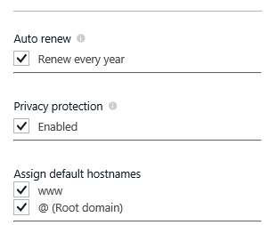
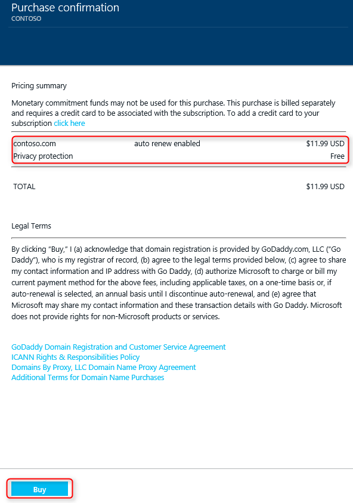

<properties
    pageTitle="Come acquistare un nome di dominio personalizzato in Azure App servizio Web Apps"
    description="Informazioni su come acquistare un nome di dominio personalizzato con un'app web nel servizio App Azure."
    services="app-service\web"
    documentationCenter=""
    authors="rmcmurray"
    manager="wpickett"
    editor=""/>

<tags
    ms.service="app-service-web"
    ms.workload="web"
    ms.tgt_pltfrm="na"
    ms.devlang="na"
    ms.topic="article"
    ms.date="08/11/2016"
    ms.author="robmcm"/>

# Acquistare e configurare un nome di dominio personalizzato in servizio App Azure

[AZURE.INCLUDE [web-selector](../../includes/websites-custom-domain-selector.md)]

Quando si crea un'app web, Azure viene assegnato un sottodominio di azurewebsites.net. Ad esempio, se l'applicazione web è denominata **contoso**, l'URL è **contoso.azurewebsites.net**. Azure assegna anche un indirizzo IP virtuale.

Per un'app web di produzione, è agli utenti di visualizzare un nome di dominio personalizzato. In questo articolo viene spiegato come acquistare e configurare un dominio personalizzato con [App servizio Web Apps](http://go.microsoft.com/fwlink/?LinkId=529714). 

[AZURE.INCLUDE [introfooter](../../includes/custom-dns-web-site-intro-notes.md)]

## Panoramica

Se non si dispone di un nome di dominio per un'app web, è possibile acquistare facilmente uno nel [Portale di Azure](https://portal.azure.com/). Durante il processo di acquisto è possibile scegliere di eseguire il mapping a un'applicazione web automaticamente record DNS del dominio radice e WWW. È anche possibile gestire il dominio direttamente all'interno di Azure Portal.

Utilizzare la procedura seguente per acquistare i nomi di dominio e assegnare all'app web.

1. Nel browser, aprire il [Portale di Azure](https://portal.azure.com/).

2. Nella scheda **Web Apps** , fare clic sul nome dell'applicazione web, selezionare **Impostazioni**e quindi selezionare **domini personalizzati**

    

3. In e il **dominio personalizzato** , fare clic su **Acquista domini**.

    

4. In e **l'Acquistare domini** , utilizzare la casella di testo per digitare il nome di dominio che si desidera acquistare e premere INVIO. I domini disponibili suggeriti verranno visualizzati sotto la casella di testo. Selezionare il dominio che si desidera acquistare. È possibile scegliere di acquistare più domini contemporaneamente. 

  

5. Fare clic su **Informazioni di contatto** e compilare il modulo di informazioni di contatto del dominio.

  

    > [AZURE.NOTE] È molto importante compilare tutti i campi obbligatori con la massima correttezza possibile, in particolare, l'indirizzo di posta elettronica. In caso di acquisto il dominio senza "Protezione della Privacy", potrebbe essere necessario verificare la posta elettronica prima che il dominio sia attivo. In alcuni casi, dati non corretti per informazioni sui contatti verranno generato un errore da cui acquistare domini. 

6. A questo punto è possibile scegliere di,

    ) "rinnovo automatico" dominio ogni anno
    
    b) acconsentire aggiuntivo "tutela della Privacy" incluso il prezzo di acquisto gratuitamente (ad eccezione di TLD chi Registro di sistema non supportano l'informativa sulla Privacy. Ad esempio:. co.in,. co.uk ecc.)  
    
    c) "assegna nomi host predefinito" per WWW e dominio per l'applicazione Web corrente principale. 

  
  
    > [AZURE.NOTE] Opzione C Configura associazioni di DNS e associazioni Hostname automaticamente per l'utente.  In questo modo, un'applicazione Web accessibile con dominio personalizzato, come l'acquisto è stata completata (baring ritardi DNS in alcuni casi). Nel caso, un'applicazione Web dietro al gestore del traffico Azure, non è presente un'opzione per assegnare dominio radice, ovvero, come un record non funzionano con il traffico Manager. È possibile assegnare sempre i domini/sub-domains acquistati tramite un Web App in un'altra Web App e viceversa. Vedere il passaggio 8 per altri dettagli. 
    
7. Fare clic su **Selezionare** su blade **Domini acquistare** , quindi si vedrà le informazioni di acquisto in blade **conferma di acquisto** . Se si accettano le condizioni legali e fare clic su **Acquista**, è possibile monitorare il processo di acquisto nella **notifica**verrà inviato l'ordine. Acquisto di dominio può richiedere alcuni minuti. 

  

  

8. Se si è ordinata correttamente un dominio, è possibile gestire il dominio e assegnare all'app web. Fare clic sul **"…"** sul lato destro del dominio. È possibile **annullare l'acquisto** o **Gestione dominio**. Fare clic su **Gestisci dominio**, quindi è possibile associare **sottodominio** applicazione web nel **dominio di gestione** blade. Se si vuole associare un **sottodominio** a un'App Web diversi quindi eseguire questo passaggio all'interno del contesto di rispettive Web App. Qui è selezionare per assegnare il dominio all'endpoint manager il traffico (se Web App è dietro TM) gestore del traffico semplicemente selezionando nome dal menu a discesa. In questo modo dominio/sottodominio verrà assegnato automaticamente a tutte le applicazioni Web dietro l'endpoint di gestore del traffico. 

    

    > [AZURE.NOTE] È possibile "annullare acquisto" all'interno di 5 giorni per rimborso completo. Dopo 5 giorni che sarà necessario non sarà possibile "Annulla acquisto", ma si vedrà un'opzione per il dominio "eliminazione". Eliminazione del dominio verrà generato il rilascio dall'abbonamento senza restituzione e non sarà più dominio disponibili. 

Al termine di configurazione, il nome di dominio personalizzato verrà elencato nella sezione **Hostname associazioni** dell'applicazione web.

A questo punto dovrebbe essere possibile immettere il nome di dominio personalizzato nel browser e vedere che correttamente consente di accedere all'app web.
 
## Che cosa succede ai dominio personalizzato che è stato acquistato

Il dominio personalizzato che è stato acquistato nei e **dominio personalizzato e SSL** è associato all'abbonamento Azure. Come risorsa Azure, questo dominio personalizzato è separate e indipendenti dall'app App servizio che si è acquistato prima di tutto il dominio. Questo significa che:

- All'interno del portale di Azure, è possibile usare il dominio personalizzato che è stato acquistato con le ciliegie più di un servizio di App e non solo per l'app che si è acquistato prima di tutto il dominio personalizzato per. 
- È possibile gestire tutti i domini personalizzati che è stato acquistato nella sottoscrizione Azure facendo clic su e il **dominio personalizzato e SSL** di *qualsiasi* applicazione di servizio App in tale sottoscrizione.
- È possibile assegnare qualsiasi applicazione di servizio di App dallo stesso abbonamento Azure a un sottodominio all'interno del dominio personalizzato.
- Se si decide di eliminare un'applicazione di servizio di App, è possibile scegliere di non eliminare il dominio personalizzato che è associato a se si desidera continuare a utilizzarlo per le altre applicazioni.

## Se non viene visualizzato il dominio personalizzato è stato acquistato

Se hai acquistato il dominio personalizzato dall'interno e il **dominio personalizzato e SSL** , ma non è possibile vedere il dominio personalizzato in **domini gestiti**, verificare quanto segue:

- Potrebbe non aver completato la creazione di dominio personalizzato. Controllare il carico di notifica nella parte superiore del portale di Azure per lo stato di avanzamento.
- La creazione di dominio personalizzato potrebbe esito negativo per qualche motivo. Controllare il carico di notifica nella parte superiore del portale di Azure per lo stato di avanzamento.
- Il dominio personalizzato hanno avuto esito positivo, ma e il non può essere ancora aggiornato. Provare ad aprire nuovamente e il **dominio personalizzato e SSL** .
- Il dominio personalizzato a un certo punto si potrebbe essere eliminato. Controllare i registri di controllo facendo clic su **Impostazioni** > **Log di controllo** da blade principale dell'applicazione. 
- E il **dominio personalizzato e SSL** che si sta cercando nella può appartenere a un'app creata in una sottoscrizione di Azure diversa. Passare a un'altra app in una sottoscrizione diversa e selezionare il relativo blade **domini personalizzati e SSL** .  
  All'interno del portale, non sarà possibile visualizzare o gestire domini personalizzati creati in una sottoscrizione di Azure diversa rispetto l'app. Tuttavia, se si fa clic su **Gestione avanzata** in blade **dominio di gestione** del dominio, si verrà reindirizzati al sito Web del provider del dominio, in cui sarà possibile configurare   [manualmente un dominio personalizzato come qualsiasi dominio personalizzato esterno](web-sites-custom-domain-name.md)  
   per le app create in una sottoscrizione di Azure diversa. 

