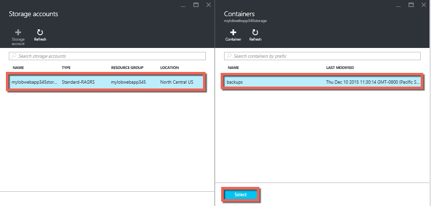

<properties 
    pageTitle="Eseguire il backup l'app di Azure" 
    description="Informazioni su come creare backup delle applicazioni di servizio App Azure." 
    services="app-service" 
    documentationCenter="" 
    authors="cephalin" 
    manager="wpickett" 
    editor="jimbe"/>

<tags 
    ms.service="app-service" 
    ms.workload="na" 
    ms.tgt_pltfrm="na" 
    ms.devlang="na" 
    ms.topic="article" 
    ms.date="07/06/2016" 
    ms.author="cephalin"/>

# Eseguire il backup l'app di Azure

La caratteristica di Backup e ripristino di [Servizio App Azure](../app-service/app-service-value-prop-what-is.md) consente di creare facilmente app backup manualmente o automaticamente. È possibile ripristinare l'app in uno stato precedente o creare una nuova app basata su uno dei backup dell'applicazione originale. 

Per informazioni su come ripristinare un'app da un backup, vedere [ripristinare un'app di Azure](web-sites-restore.md).

## Cosa viene eseguito il backup 
Servizio di App è possibile eseguire il backup le informazioni seguenti:

* Configurazione di App
* Contenuto del file
* Qualsiasi database SQL Azure o un database MySQL Azure (ClearDB) connessi all'app (è possibile scegliere quelli da includere nel backup)

Queste informazioni viene eseguito il backup per l'account di archiviazione Azure e contenitore specificato. 

> [AZURE.NOTE] Ogni backup è una copia fuori rete completa dell'app, non un aggiornamento incrementale.

## Requisiti e limitazioni

* La caratteristica di Backup e ripristino richiede il piano di servizio App sia nel livello **Standard** o versione successiva. Per ulteriori informazioni sul ridimensionamento il piano di servizio di App per utilizzare un livello superiore, vedere [scalare un'app di Azure](web-sites-scale.md). Si noti che livello **Premium** consente un numero di backup giornalieri superiore a livello **Standard** .
* È necessario un account di archiviazione Azure e contenitore nello stesso abbonamento app che si desidera eseguire il backup. Per ulteriori informazioni sull'account di archiviazione Azure, vedere i [collegamenti](#moreaboutstorage) alla fine di questo articolo.
* Backup possono essere fino a 10GB del app e database del contenuto. Se le dimensioni del backup superano questo limite, si verificherà un errore. 

## Creare un backup manuale

2. Nel [Portale di Azure](https://portal.azure.com), passare a blade dell'app, selezionare **Impostazioni**, quindi **backup**. Verrà visualizzato e il **backup** .
    
    ![Pagina di backup][ChooseBackupsPage]

    >[AZURE.NOTE]Se viene visualizzato il messaggio seguente, fare clic su esso per aggiornare il piano di servizio App prima di procedere con l'esecuzione di backup.
Per ulteriori informazioni, vedere [scalare un'app di Azure](web-sites-scale.md) .  
    >

3. In e il **backup** , fare clic su **lo spazio di archiviazione: non è configurato** per configurare un account di archiviazione.

    ![Scegliere account di archiviazione][ChooseStorageAccount]
    
4. Scegliere la destinazione di backup selezionando un **Account di archiviazione** e di un **contenitore**. Account di archiviazione deve appartenere alla stessa sottoscrizione con l'app che si desidera eseguire il backup. Se si desidera, è possibile creare un nuovo account di archiviazione o un nuovo contenitore nelle rispettive pale. Al termine, fare clic su **Seleziona**.
    
    
    
5. In e il **Configura impostazioni di Backup** ancora viene lasciato aperto, fare clic su **Impostazioni di Database**, quindi selezionare i database che si desidera includere nel backup (database SQL o MySQL), quindi fare clic su **OK**.  

    

    > [AZURE.NOTE]  Per un database da visualizzare nell'elenco, la stringa di connessione deve essere presente nella sezione **stringhe di connessione** della stessa e **le impostazioni dell'applicazione** per l'app.

6. In e il **Configura impostazioni di Backup** , fare clic su **Salva**.  

7. Nella barra dei comandi della stessa e **backup** , fare clic su **Esegui Backup**.
    
    ![Pulsante BackUpNow][BackUpNow]
    
    Si verrà visualizzato un messaggio di stato di avanzamento durante il processo di backup.

Dopo aver configurato un account di archiviazione e di un contenitore per i backup, non sarà possibile modificare manualmente backup in qualsiasi momento.  

## Configurare backup automatici

1. In e il **backup** , fare clic su **programmazione: non è configurato**. 

    
    
1. Nella e **Backup delle impostazioni di pianificazione** , impostare **Backup pianificati** su **su**, quindi configurare la pianificazione di backup in base alle esigenze e fare clic su **OK**.
    
    ![Attivare backup automatici][SetAutomatedBackupOn]
    
4. In e il **Configura impostazioni di Backup** ancora viene lasciato aperto, fare clic su **Impostazioni di archiviazione**, quindi scegliere la destinazione di backup selezionando un **Account di archiviazione** e di un **contenitore**. Account di archiviazione deve appartenere alla stessa sottoscrizione con l'app che si desidera eseguire il backup. Se si desidera, è possibile creare un nuovo account di archiviazione o un nuovo contenitore nelle rispettive pale. Al termine, fare clic su **Seleziona**.
    
    
    
5. In e il **Configura impostazioni di Backup** , fare clic su **Impostazioni di Database**, quindi selezionare i database che si desidera includere nel backup (database SQL o MySQL), quindi fare clic su **OK**.  

    

    > [AZURE.NOTE]  Per un database da visualizzare nell'elenco, la stringa di connessione deve essere presente nella sezione **stringhe di connessione** della stessa e **le impostazioni dell'applicazione** per l'app.

6. In e il **Configura impostazioni di Backup** , fare clic su **Salva**.  

## Backup solo una parte dell'app

A volte non si desidera eseguire il backup di tutti gli elementi nell'app. Di seguito sono riportati alcuni esempi:

-   Si [Configura un backup settimanali](web-sites-backup.md#configure-automated-backups) dell'app che contiene contenuto statico che non cambia mai, ad esempio precedente post di blog o immagini.
-   L'app dispone di più di 10GB del contenuto (ad esempio la quantità max che è possibile eseguire il backup alla volta).
-   Non si desidera eseguire il backup i file di log.

Backup parziale sarà possibile scegliere esattamente i file che si desidera eseguire il backup.

### Escludere i file di backup

Per escludere file e cartelle di backup, creare un `_backup.filter` file nella cartella D:\home\site\wwwroot dell'app e specificare l'elenco dei file e cartelle da escludere in tale posizione. Un modo semplice per accedere a questa è tramite la [Console di Kudu](https://github.com/projectkudu/kudu/wiki/Kudu-console). 

Si supponga di che disporre un'app contenente i file di log e le immagini statiche da ultimi anni che non sia più modificare. Si dispone già di un backup completo dell'app che include le immagini precedenti. Si vuole eseguire il backup di ogni giorno l'app, ma non si vuole pagare per l'archiviazione dei file di log o i file di immagine statica che non modificare mai.

![Cartella dei registri][LogsFolder]
![immagini cartella][ImagesFolder]
    
La seguente procedura mostra come da escludere questi file dal backup.

1. Passare a `http://{yourapp}.scm.azurewebsites.net/DebugConsole` e identificare le cartelle che si desidera escludere dal backup. In questo esempio si desidera escludere i file e cartelle visualizzate in tale interfaccia utente seguenti:

        D:\home\site\wwwroot\Logs
        D:\home\LogFiles
        D:\home\site\wwwroot\Images\2013
        D:\home\site\wwwroot\Images\2014
        D:\home\site\wwwroot\Images\brand.png

    [AZURE.NOTE] L'ultima riga indica che è possibile escludere i file di singoli utenti, nonché le cartelle.

2. Creare un file denominato `_backup.filter` e inserire l'elenco sopra nel file, ma rimuovere `D:\home`. Elenco di una directory o file per riga. In modo che il contenuto del file deve essere:

    \site\wwwroot\Logs \LogFiles \site\wwwroot\Images\2013 \site\wwwroot\Images\2014 \site\wwwroot\Images\brand.PNG

3. Caricare il file per il `D:\home\site\wwwroot\` directory del sito tramite [ftp](web-sites-deploy.md#ftp) o qualsiasi altro metodo. Se si desidera, è possibile creare il file direttamente in `http://{yourapp}.scm.azurewebsites.net/DebugConsole` e inserire il contenuto non esiste.

4. Eseguire il backup esattamente come si farebbe normalmente, [manualmente](#create-a-manual-backup) o [automaticamente](#configure-automated-backups).

Adesso, tutti i file e cartelle che vengono specificate in `_backup.filter` verranno esclusi dalla copia di backup. In questo esempio, i file di log e i file di immagine 2013 e 2014 non saranno non è più sottoposti a backup, oltre al tipo brand.png.

>[AZURE.NOTE] Ripristinare i backup parziali del sito allo stesso modo [ripristinare una copia di backup regolare](web-sites-restore.md). Il processo di ripristino produrrà giusto.
>
>Quando viene ripristinato un backup completo, tutto il contenuto del sito viene sostituito con qualsiasi elemento presente nel backup. Se un file nel sito ma non nel backup verrà eliminato. Ma quando viene ripristinato un backup parziale, tutto il contenuto che si trova in una delle directory disattivata o qualsiasi file disattivata, a sinistra di come.

## Come vengono archiviati i backup

Dopo avere apportato uno o più backup per l'app, i backup sarà visibili a e il **contenitori** di account di archiviazione, come l'app. In account di archiviazione, ogni backup è costituito da un file ZIP che contiene i dati di backup e un file XML che contiene un manifesto del contenuto del file con estensione zip. È possibile decomprimere e selezionare questi file se si desidera accedere backup senza effettivamente eseguire un ripristino di app.

Il backup del database per l'app è archiviato nella radice del file con estensione zip. Per un database SQL seguente è un file BACPAC (senza estensione) e può essere importato. Per creare un nuovo database SQL in base all'esportazione BACPAC, vedere [importare un File di BACPAC per creare un nuovo Database utente](http://technet.microsoft.com/library/hh710052.aspx).

> [AZURE.WARNING] Modifica dei file nel contenitore di **websitebackups** può causare il backup diventi non validi e pertanto non ripristinabile.

## Passaggi successivi
Per informazioni su come ripristinare un'app da un backup, vedere [ripristinare un'app di Azure](web-sites-restore.md). È anche possibile eseguire il backup e ripristinare le applicazioni di servizio App utilizzando API REST (vedere [Usare resto eseguire il backup e ripristinare le applicazioni di servizio App](websites-csm-backup.md)).

>[AZURE.NOTE] Se si desidera iniziare a utilizzare il servizio di App Azure prima di iscriversi a un account Azure, accedere al [Servizio App provare](http://go.microsoft.com/fwlink/?LinkId=523751), in cui è possibile creare immediatamente un'app web starter breve nel servizio di App. Nessun carte di credito obbligatorio; Nessun impegni.

<!-- IMAGES -->
[ChooseBackupsPage]: ./media/web-sites-backup/01ChooseBackupsPage.png
[ChooseStorageAccount]: ./media/web-sites-backup/02ChooseStorageAccount.png
[IncludedDatabases]: ./media/web-sites-backup/03IncludedDatabases.png
[BackUpNow]: ./media/web-sites-backup/04BackUpNow.png
[BackupProgress]: ./media/web-sites-backup/05BackupProgress.png
[SetAutomatedBackupOn]: ./media/web-sites-backup/06SetAutomatedBackupOn.png
[Frequency]: ./media/web-sites-backup/07Frequency.png
[StartDate]: ./media/web-sites-backup/08StartDate.png
[StartTime]: ./media/web-sites-backup/09StartTime.png
[SaveIcon]: ./media/web-sites-backup/10SaveIcon.png
[ImagesFolder]: ./media/web-sites-backup/11Images.png
[LogsFolder]: ./media/web-sites-backup/12Logs.png
[GhostUpgradeWarning]: ./media/web-sites-backup/13GhostUpgradeWarning.png
 
