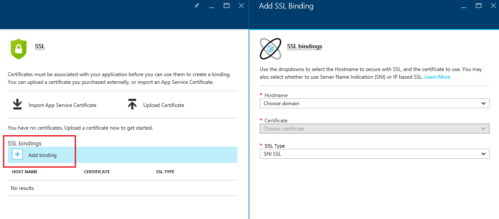

<properties
    pageTitle="Proteggere dominio personalizzato dell'applicazione con HTTPS | Microsoft Azure"
    description="Informazioni su come sicura il nome di dominio personalizzato per l'app in Azure App servizio configurando un'associazione di certificato SSL. Verrà anche informazioni su come ottenere un certificato SSL da più strumenti."
    services="app-service"
    documentationCenter=".net"
    authors="cephalin"
    manager="wpickett"
    editor="jimbe"
    tags="top-support-issue"/>

<tags
    ms.service="app-service"
    ms.workload="na"
    ms.tgt_pltfrm="na"
    ms.devlang="na"
    ms.topic="article"
    ms.date="08/08/2016"
    ms.author="cephalin"/>

# Proteggere dominio personalizzato dell'applicazione con HTTPS

> [AZURE.SELECTOR]
- [Acquistare certificato SSL in Azure](web-sites-purchase-ssl-web-site.md)
- [Utilizzare certificato SSL da un' posizione](web-sites-configure-ssl-certificate.md)

In questo articolo viene illustrato come abilitare HTTPS per un'app web, un back-end app per dispositivi mobili o un'app API in [Azure App servizio](../app-service/app-service-value-prop-what-is.md) che utilizza un nome di dominio personalizzato. Coprire l'autenticazione solo server. Se è necessaria l'autenticazione reciproca (inclusi autenticazione del client), vedere [How To Configure TLS reciproca Authentication servizio di App](app-service-web-configure-tls-mutual-auth.md).

Per proteggere con HTTPS un'app con un nome di dominio personalizzato, aggiungere un certificato per tale nome di dominio. Per impostazione predefinita, Azure protegge la ** \*. azurewebsites.net** dominio jolly con un unico certificato SSL, in modo che i clienti possono accedere già l'app in * *https://*&lt;NomeApplicazione >*. azurewebsites.net**. Ma se si vuole usare un dominio personalizzato, ad esempio **www.contoso.com contoso.com**, ****, e ** \*. contoso.com**, non è possibile proteggere il certificato predefinito che. Inoltre, ad esempio tutti [certificati con caratteri jolly](https://casecurity.org/2014/02/26/pros-and-cons-of-single-domain-multi-domain-and-wildcard-certificates/), il certificato predefinito non è protetto con un dominio personalizzato e un certificato per il dominio personalizzato.   

>[AZURE.NOTE] È possibile ottenere assistenza da esperti di Azure in qualsiasi momento nei [forum di Azure](https://azure.microsoft.com/support/forums/). Per il supporto più personalizzato, fare clic **Ottenere supporto**per il [Supporto di Azure](https://azure.microsoft.com/support/options/) .

## È necessario
Per proteggere il nome di dominio personalizzato con HTTPS, per associare un certificato SSL personalizzato a tale dominio personalizzato in Azure. Prima di associare un certificato personalizzato, è necessario eseguire le operazioni seguenti:

- **Configurare il dominio personalizzato** - servizio App solo consente di aggiungere un certificato per un nome di dominio è già configurato nell'app. Per ulteriori informazioni, vedere [eseguire il mapping di un nome di dominio personalizzato a un'applicazione Azure](web-sites-custom-domain-name.md). 
- **Scalabilità a livello di base o versione successiva** Piani di servizio App in livelli prezzi inferiori non sono supportate certificati SSL personalizzati. Per ulteriori informazioni, vedere [scalare un'app di Azure](web-sites-scale.md). 
- **Ottenere un certificato SSL** - se non è già presente, è necessario ottenerne uno da un' [autorità di certificazione](http://en.wikipedia.org/wiki/Certificate_authority) (CA) attendibile. Il certificato deve soddisfare tutti i requisiti seguenti:

    - È firmato da un'autorità di certificazione attendibile (Nessun server CA privato).
    - La presentazione contiene una chiave privata.
    - Viene creata per lo scambio ed esportato in un. File PFX.
    - Viene utilizzato un minimo di crittografia a 2048 bit.
    - Il nome del soggetto corrisponde al dominio personalizzato che è necessario proteggere. Per proteggere più domini con un certificato, è necessario utilizzare un nome carattere jolly (ad esempio ** \*. contoso.com**) o specificare i valori subjectAltName.
    - Vengono unito con tutti **[i certificati intermedi](http://en.wikipedia.org/wiki/Intermediate_certificate_authorities)** utilizzati dalla CA. In caso contrario, che potrebbero verificarsi problemi di interoperabilità irreproducible in alcuni client.

        >[AZURE.NOTE] Il modo più semplice per ottenere un certificato SSL che soddisfi i requisiti è acquistarne         [uno nel portale di Azure direttamente](web-sites-purchase-ssl-web-site.md). In questo articolo viene illustrato come eseguire manualmente e quindi associarlo a un dominio personalizzato nel servizio di App.
        >   
        > **I certificati di crittografia curva algoritmo (ECC)** è possibile lavorare con il servizio di App, ma all'esterno dell'ambito di questo articolo. Usare la procedura esatta per creare i certificati ECC con la CA.

## Passaggio 1. Ottenere un certificato SSL

Poiché CA fornisce i vari tipi di certificato SSL al prezzo diversa, è consigliabile iniziare dalla decidere quale tipo di certificato SSL da acquistare. Per proteggere un nome di dominio singolo (**www.contoso.com**), è necessario un certificato di base. Per proteggere più nomi di dominio (**contoso.com** *e* **www.contoso.com** 
*e* **mail.contoso.com**), è necessario un [certificato con caratteri jolly](http://en.wikipedia.org/wiki/Wildcard_certificate) o un certificato con [Un nome alternativo oggetto](http://en.wikipedia.org/wiki/SubjectAltName) (`subjectAltName`).

Quando si conosce il certificato SSL da acquistare, si invia un certificato di firma richiedere (CSR) a un'autorità di certificazione. Quando si riceve il certificato richiesto dall'autorità di certificazione, quindi generare un file. pfx del certificato. È possibile eseguire questa procedura tramite lo strumento di propria scelta. Ecco le istruzioni per gli strumenti comuni:

- [Procedura Certreq.exe](#bkmk_certreq) - l'utilità di Windows per la creazione di richieste di certificati. È stato parte di Windows in Windows XP e Windows Server 2000.
- [I passaggi da Gestione IIS](#bkmk_iismgr) - lo strumento ideale se si ha già familiarità con il del.
- [Passaggi OpenSSL](#bkmk_openssl) - uno [strumento multipiattaforma Apri origine](https://www.openssl.org). Usarlo per ottenere un certificato SSL da qualsiasi piattaforma.
- [passaggi subjectAltName utilizzando OpenSSL](#bkmk_subjectaltname) - passaggi da eseguire per ottenere `subjectAltName` certificati.

Se si desidera verificare la configurazione del servizio di App prima di acquistare un certificato, è possibile generare un [certificato autofirmato](https://en.wikipedia.org/wiki/Self-signed_certificate). In questa esercitazione vengono illustrati due modi per generare:

- [Un certificato autofirmato, Certreq.exe passaggi](#bkmk_sscertreq)
- [Un certificato autofirmato, OpenSSL passaggi](#bkmk_ssopenssl)

### Ottenere un certificato utilizzando Certreq.exe

1. Creare un file (ad esempio **myrequest.txt**) e copiare il testo seguente e salvarlo in una cartella di lavoro. Sostituire il `<your-domain>` segnaposto con il nome di dominio personalizzato dell'app.

        [NewRequest]
        Subject = "CN=<your-domain>"  ; E.g. "CN=www.contoso.com", or "CN=*.contoso.com" for a wildcard certificate
        Exportable = TRUE
        KeyLength = 2048              ; Required minimum is 2048
        KeySpec = 1
        KeyUsage = 0xA0
        MachineKeySet = True
        ProviderName = "Microsoft RSA SChannel Cryptographic Provider"
        ProviderType = 12
        HashAlgorithm = SHA256

        [EnhancedKeyUsageExtension]
        OID=1.3.6.1.5.5.7.3.1         ; Server Authentication

    Per ulteriori informazioni sulle opzioni nel CSR e altre opzioni disponibili, vedere la [documentazione di riferimento Certreq](https://technet.microsoft.com/library/dn296456.aspx).

4. Prompt dei comandi, `CD` in una cartella di lavoro ed eseguire il comando seguente per creare il rappresentante del servizio:

        certreq -new myrequest.txt myrequest.csr

    **myRequest.CSR** a questo punto viene creato nella directory di lavoro corrente.

5. Inviare **myrequest.csr** a un'autorità di certificazione per ottenere un certificato SSL. Caricare il file o copiare il contenuto da un editor di testo in un modulo web.

    Per un elenco di certificazione attendibile da Microsoft, vedere [programma Microsoft Trusted Root Certificate: i partecipanti][cas].

6. Una volta autorità di certificazione ha risposto all'utente con un certificato (. File CER), salvarlo nella directory di lavoro. Eseguire il seguente comando per completare il rappresentante del servizio in sospeso.

        certreq -accept -user <certificate-name>.cer

    Questo comando Archivia il termine certificato nell'archivio certificati di Windows.

6. Se l'autorità di certificazione utilizza certificati intermedi, installarli prima di procedere. Seguono in genere come download separato dalla CA e in diversi formati per i tipi di server web diverso. Selezionare la versione di Microsoft IIS.

    Dopo avere scaricato i certificati, rapida ciascuno di essi in Esplora risorse e scegliere  **Installa certificato**. Usare i valori predefiniti dell' **Importazione guidata certificati**e continuare a selezionare **Avanti** fino al completamento dell'importazione.

7. Per esportare il certificato SSL dall'archivio certificati, premere `Win` + `R` ed eseguire **certmgr** per avviare Gestione certificati. Selezionare **personale** > **certificati**. Nella colonna **Rilasciato a** verrà visualizzata una voce con il nome di dominio personalizzato e l'autorità di certificazione usata per generare il certificato nella colonna **Emesso da** .

    ![inserire l'immagine del gestore certificati qui][certmgr]

9. Pulsante destro del mouse sul certificato e selezionare **Tutte le attività** > **esportare**. **Esportazione guidata certificati**, fare clic su **Avanti**, quindi selezionare **Sì, Esporta la chiave privata**e quindi scegliere **Avanti** .

    ![Esportare la chiave privata][certwiz1]

10. Selezionare **Scambio di informazioni personali - PKCS #12**, **includere tutti i certificati nel percorso di certificazione se possibile**ed **esportazione di tutte le proprietà estese**. Scegliere **Avanti**.

    ![includere tutti i certificati e le proprietà "Extended"][certwiz2]

11. Selezionare **la Password**, quindi immettere e confermare la password. Fare clic su **Avanti**.

    ![specificare una password][certwiz3]

12. Specificare un percorso e il nome per il file esportato, con estensione **pfx**. Fare clic su **Avanti** per completare.

    ![specificare un percorso di file][certwiz4]

A questo punto si è pronti caricare il file PFX esportato al servizio di App. Vedere [passaggio 2. Caricare e associare il certificato SSL personalizzato](#bkmk_configuressl).

### Ottenere un certificato tramite Gestione IIS

1. Generare un CSR con Gestione IIS per inviare a autorità di certificazione. Per ulteriori informazioni sulla generazione di un rappresentante del servizio, vedere [richiedere un certificato Server Internet (IIS 7)][iiscsr].

3. Inviare il CSR a un'autorità di certificazione per ottenere un certificato SSL. Per un elenco di certificazione attendibile da Microsoft, vedere [programma Microsoft Trusted Root Certificate: i partecipanti][cas].

3. Completare CSR con il certificato autorità di certificazione invia al mittente. Per ulteriori informazioni sul completamento rappresentante del servizio, vedere [installare un certificato Server Internet (IIS 7)][installcertiis].

4. Se l'autorità di certificazione utilizza certificati intermedi, installarli prima di procedere. Seguono in genere come download separato dalla CA e in diversi formati per i tipi di server web diverso. Selezionare la versione di Microsoft IIS.

    Dopo avere scaricato i certificati, rapida ciascuno di essi in Esplora risorse e scegliere **Installa certificato**. 
    Usare i valori predefiniti dell' **Importazione guidata certificati**e continuare a selezionare **Avanti** fino al completamento dell'importazione.

4. Esportare il certificato SSL da Gestione IIS. Per ulteriori informazioni sull'esportazione del certificato, vedere [esportare un certificato Server (IIS 7)][exportcertiis]. 

    >[AZURE.IMPORTANT] **Esportazione guidata certificati**, assicurarsi di selezionare **Sì, esportare la chiave privata**  
    >
    >![Esportare la chiave privata][certwiz1]  
    >
    > selezionare anche **Scambio di informazioni personali - PKCS #12**, **includere tutti i certificati nel percorso di certificazione se possibile**ed     **esportazione di tutte le proprietà estese**.
    >
    >![includere tutti i certificati e le proprietà "Extended"][certwiz2]

A questo punto si è pronti caricare il file PFX esportato al servizio di App. Vedere [passaggio 2. Caricare e associare il certificato SSL personalizzato](#bkmk_configuressl).

### Ottenere un certificato utilizzando OpenSSL

1. In terminale della riga di comando, `CD` in una cartella di lavoro generare una chiave privata e CSR eseguendo il comando seguente:

        openssl req -sha256 -new -nodes -keyout myserver.key -out server.csr -newkey rsa:2048

2. Quando richiesto, immettere le informazioni appropriate. Per esempio:

        Country Name (2 letter code)
        State or Province Name (full name) []: Washington
        Locality Name (eg, city) []: Redmond
        Organization Name (eg, company) []: Microsoft
        Organizational Unit Name (eg, section) []: Azure
        Common Name (eg, YOUR name) []: www.microsoft.com
        Email Address []:

        Please enter the following 'extra' attributes to be sent with your certificate request

        A challenge password []:

    Al termine, avere due file nella directory di lavoro: **myserver.key** e **server.csr**. 
    **Server.csr** contiene il rappresentante del servizio è necessario **myserver.key** in un secondo momento.

3. Inviare il CSR a un'autorità di certificazione per ottenere un certificato SSL. Per un elenco di certificazione attendibile da Microsoft, vedere [programma Microsoft Trusted Root Certificate: i partecipanti][cas].

4. Una volta autorità di certificazione invia il certificato richiesto, salvarlo in un file denominato **myserver.crt** nella directory di lavoro. Se l'autorità di certificazione fornisce in formato testo, è sufficiente copiare il contenuto in **myserver.crt** in un editor di testo e salvarlo. Il file avrà un aspetto simile al seguente:

        -----BEGIN CERTIFICATE-----
        MIIDJDCCAgwCCQCpCY4o1LBQuzANBgkqhkiG9w0BAQUFADBUMQswCQYDVQQGEwJV
        UzELMAkGA1UECBMCV0ExEDAOBgNVBAcTB1JlZG1vbmQxEDAOBgNVBAsTB0NvbnRv
        c28xFDASBgNVBAMTC2NvbnRvc28uY29tMB4XDTE0MDExNjE1MzIyM1oXDTE1MDEx
        NjE1MzIyM1owVDELMAkGA1UEBhMCVVMxCzAJBgNVBAgTAldBMRAwDgYDVQQHEwdS
        ZWRtb25kMRAwDgYDVQQLEwdDb250b3NvMRQwEgYDVQQDEwtjb250b3NvLmNvbTCC
        ASIwDQYJKoZIhvcNAQEBBQADggEPADCCAQoCggEBAN96hBX5EDgULtWkCRK7DMM3
        enae1LT9fXqGlbA7ScFvFivGvOLEqEPD//eLGsf15OYHFOQHK1hwgyfXa9sEDPMT
        3AsF3iWyF7FiEoR/qV6LdKjeQicJ2cXjGwf3G5vPoIaYifI5r0lhgOUqBxzaBDZ4
        xMgCh2yv7NavI17BHlWyQo90gS2X5glYGRhzY/fGp10BeUEgIs3Se0kQfBQOFUYb
        ktA6802lod5K0OxlQy4Oc8kfxTDf8AF2SPQ6BL7xxWrNl/Q2DuEEemjuMnLNxmeA
        Ik2+6Z6+WdvJoRxqHhleoL8ftOpWR20ToiZXCPo+fcmLod4ejsG5qjBlztVY4qsC
        AwEAATANBgkqhkiG9w0BAQUFAAOCAQEAVcM9AeeNFv2li69qBZLGDuK0NDHD3zhK
        Y0nDkqucgjE2QKUuvVSPodz8qwHnKoPwnSrTn8CRjW1gFq5qWEO50dGWgyLR8Wy1
        F69DYsEzodG+shv/G+vHJZg9QzutsJTB/Q8OoUCSnQS1PSPZP7RbvDV9b7Gx+gtg
        7kQ55j3A5vOrpI8N9CwdPuimtu6X8Ylw9ejWZsnyy0FMeOPpK3WTkDMxwwGxkU3Y
        lCRTzkv6vnHrlYQxyBLOSafCB1RWinN/slcWSLHADB6R+HeMiVKkFpooT+ghtii1
        A9PdUQIhK9bdaFicXPBYZ6AgNVuGtfwyuS5V6ucm7RE6+qf+QjXNFg==
        -----END CERTIFICATE-----

5. In terminale della riga di comando, eseguire il seguente comando per esportare **myserver.pfx** da **myserver.key** e **myserver.crt**:

        openssl pkcs12 -export -out myserver.pfx -inkey myserver.key -in myserver.crt

    Quando richiesto, definire una password per proteggere il file. pfx.

    > [AZURE.NOTE] Se l'autorità di certificazione utilizza certificati intermedi, è necessario includere con il `-certfile` parametro. Seguono in genere come download separato dalla CA e in diversi formati per i tipi di server web diverso. Selezionare la versione con la `.pem` estensione.
    >
    > Il `openssl -export` comando avrà un aspetto simile al seguente, che consente di creare un file. pfx che include i certificati intermedi dal file **cets.pem intermedia** :
    >  
    > `openssl pkcs12 -chain -export -out myserver.pfx -inkey myserver.key -in myserver.crt -certfile intermediate-cets.pem`

A questo punto si è pronti caricare il file PFX esportato al servizio di App. Vedere [passaggio 2. Caricare e associare il certificato SSL personalizzato](#bkmk_configuressl).

### Ottenere un certificato SubjectAltName utilizzando OpenSSL

1. Creare un file denominato **sancert.cnf**, copiare il testo seguente e salvarlo in una cartella di lavoro:

        # -------------- BEGIN custom sancert.cnf -----
        HOME = .
        oid_section = new_oids
        [ new_oids ]
        [ req ]
        default_days = 730
        distinguished_name = req_distinguished_name
        encrypt_key = no
        string_mask = nombstr
        req_extensions = v3_req # Extensions to add to certificate request
        [ req_distinguished_name ]
        countryName = Country Name (2 letter code)
        countryName_default =
        stateOrProvinceName = State or Province Name (full name)
        stateOrProvinceName_default =
        localityName = Locality Name (eg, city)
        localityName_default =
        organizationalUnitName  = Organizational Unit Name (eg, section)
        organizationalUnitName_default  =
        commonName              = Your common name (eg, domain name)
        commonName_default      = www.mydomain.com
        commonName_max = 64
        [ v3_req ]
        subjectAltName=DNS:ftp.mydomain.com,DNS:blog.mydomain.com,DNS:*.mydomain.com
        # -------------- END custom sancert.cnf -----

    Nella riga che inizia con `subjectAltName`, sostituire il valore con tutti i nomi di dominio che si desidera proteggere (oltre a  `commonName`). Per esempio:

        subjectAltName=DNS:sales.contoso.com,DNS:support.contoso.com,DNS:fabrikam.com

    Non è necessario modificare qualsiasi campo, inclusi `commonName`. Verrà richiesto di specificarle nella passaggi successivi.

1. In terminale della riga di comando, `CD` in una cartella di lavoro ed eseguire il comando seguente:

        openssl req -sha256 -new -nodes -keyout myserver.key -out server.csr -newkey rsa:2048 -config sancert.cnf

2. Quando richiesto, immettere le informazioni appropriate. Per esempio:

        Country Name (2 letter code) []: US
        State or Province Name (full name) []: Washington
        Locality Name (eg, city) []: Redmond
        Organizational Unit Name (eg, section) []: Azure
        Your common name (eg, domain name) []: www.microsoft.com

    Al termine, è necessario avere due file nella directory di lavoro: **myserver.key** e **server.csr**. 
    **Server.csr** contiene il rappresentante del servizio è necessario **myserver.key** in un secondo momento.

3. Inviare il CSR a un'autorità di certificazione per ottenere un certificato SSL. Per un elenco di certificazione attendibile da Microsoft, vedere [programma Microsoft Trusted Root Certificate: i partecipanti][cas].

4. Una volta autorità di certificazione invia il certificato richiesto, salvarlo in un file denominato **myserver.crt**. Se l'autorità di certificazione fornisce in formato testo, è sufficiente copiare il contenuto in **myserver.crt** in un editor di testo e salvarlo. Il file avrà un aspetto simile al seguente:

        -----BEGIN CERTIFICATE-----
        MIIDJDCCAgwCCQCpCY4o1LBQuzANBgkqhkiG9w0BAQUFADBUMQswCQYDVQQGEwJV
        UzELMAkGA1UECBMCV0ExEDAOBgNVBAcTB1JlZG1vbmQxEDAOBgNVBAsTB0NvbnRv
        c28xFDASBgNVBAMTC2NvbnRvc28uY29tMB4XDTE0MDExNjE1MzIyM1oXDTE1MDEx
        NjE1MzIyM1owVDELMAkGA1UEBhMCVVMxCzAJBgNVBAgTAldBMRAwDgYDVQQHEwdS
        ZWRtb25kMRAwDgYDVQQLEwdDb250b3NvMRQwEgYDVQQDEwtjb250b3NvLmNvbTCC
        ASIwDQYJKoZIhvcNAQEBBQADggEPADCCAQoCggEBAN96hBX5EDgULtWkCRK7DMM3
        enae1LT9fXqGlbA7ScFvFivGvOLEqEPD//eLGsf15OYHFOQHK1hwgyfXa9sEDPMT
        3AsF3iWyF7FiEoR/qV6LdKjeQicJ2cXjGwf3G5vPoIaYifI5r0lhgOUqBxzaBDZ4
        xMgCh2yv7NavI17BHlWyQo90gS2X5glYGRhzY/fGp10BeUEgIs3Se0kQfBQOFUYb
        ktA6802lod5K0OxlQy4Oc8kfxTDf8AF2SPQ6BL7xxWrNl/Q2DuEEemjuMnLNxmeA
        Ik2+6Z6+WdvJoRxqHhleoL8ftOpWR20ToiZXCPo+fcmLod4ejsG5qjBlztVY4qsC
        AwEAATANBgkqhkiG9w0BAQUFAAOCAQEAVcM9AeeNFv2li69qBZLGDuK0NDHD3zhK
        Y0nDkqucgjE2QKUuvVSPodz8qwHnKoPwnSrTn8CRjW1gFq5qWEO50dGWgyLR8Wy1
        F69DYsEzodG+shv/G+vHJZg9QzutsJTB/Q8OoUCSnQS1PSPZP7RbvDV9b7Gx+gtg
        7kQ55j3A5vOrpI8N9CwdPuimtu6X8Ylw9ejWZsnyy0FMeOPpK3WTkDMxwwGxkU3Y
        lCRTzkv6vnHrlYQxyBLOSafCB1RWinN/slcWSLHADB6R+HeMiVKkFpooT+ghtii1
        A9PdUQIhK9bdaFicXPBYZ6AgNVuGtfwyuS5V6ucm7RE6+qf+QjXNFg==
        -----END CERTIFICATE-----

5. In terminale della riga di comando, eseguire il seguente comando per esportare **myserver.pfx** da **myserver.key** e **myserver.crt**:

        openssl pkcs12 -export -out myserver.pfx -inkey myserver.key -in myserver.crt

    Quando richiesto, definire una password per proteggere il file. pfx.

    > [AZURE.NOTE] Se l'autorità di certificazione utilizza certificati intermedi, è necessario includere con il `-certfile` parametro. Seguono in genere come download separato dalla CA e in diversi formati per i tipi di server web diverso. Selezionare la versione con la `.pem` estensione).
    >
    > Il `openssl -export` comando avrà un aspetto simile al seguente, che consente di creare un file. pfx che include i certificati intermedi dal file **cets.pem intermedia** :
    >  
    > `openssl pkcs12 -chain -export -out myserver.pfx -inkey myserver.key -in myserver.crt -certfile intermediate-cets.pem`

A questo punto si è pronti caricare il file PFX esportato al servizio di App. Vedere [passaggio 2. Caricare e associare il certificato SSL personalizzato](#bkmk_configuressl).

### Generare un certificato autofirmato utilizzando Certreq.exe ###

>[AZURE.IMPORTANT] Certificati sono solo a scopo di test. La maggior parte dei browser restituire errori quando si visita un sito Web protetto da un certificato autofirmato. Alcuni browser possono anche rifiutare passare al sito. 

1. Creare un file di testo (ad esempio **mycert.txt**), copiare il testo seguente e salvare il file in una cartella di lavoro. Sostituire il `<your-domain>` segnaposto con il nome di dominio personalizzato dell'app.

        [NewRequest]
        Subject = "CN=<your-domain>"  ; E.g. "CN=www.contoso.com", or "CN=*.contoso.com" for a wildcard certificate
        Exportable = TRUE
        KeyLength = 2048              ; KeyLength can be 2048, 4096, 8192, or 16384 (required minimum is 2048)
        KeySpec = 1
        KeyUsage = 0xA0
        MachineKeySet = True
        ProviderName = "Microsoft RSA SChannel Cryptographic Provider"
        ProviderType = 12
        HashAlgorithm = SHA256
        RequestType = Cert            ; Self-signed certificate
        ValidityPeriod = Years
        ValidityPeriodUnits = 1

        [EnhancedKeyUsageExtension]
        OID=1.3.6.1.5.5.7.3.1         ; Server Authentication

    Il parametro importante è `RequestType = Cert`, che specifica un certificato autofirmato. 
    Per ulteriori informazioni sulle opzioni nel CSR e altre opzioni disponibili, vedere la [documentazione di riferimento Certreq](https://technet.microsoft.com/library/dn296456.aspx).

4. Al prompt dei comandi, `CD` per la cartella di lavoro ed eseguire il comando seguente:

        certreq -new mycert.txt mycert.crt
    
    Il nuovo certificato autofirmato è ora installato nell'archivio certificati.

7. Per esportare il certificato dall'archivio certificati, premere `Win` + `R` ed eseguire **certmgr** per avviare Gestione certificati. Selezionare **personale** > **certificati**. Nella colonna **Rilasciato a** verrà visualizzata una voce con il nome di dominio personalizzato e l'autorità di certificazione usata per generare il certificato nella colonna **Emesso da** .

    ![inserire l'immagine del gestore certificati qui][certmgr]

9. Pulsante destro del mouse sul certificato e selezionare **Tutte le attività** > **esportare**. **Esportazione guidata certificati**, fare clic su **Avanti**, quindi selezionare **Sì, Esporta la chiave privata**e quindi scegliere **Avanti** .

    ![Esportare la chiave privata][certwiz1]

10. Selezionare **Scambio di informazioni personali - PKCS #12**, **includere tutti i certificati nel percorso di certificazione se possibile**ed **esportazione di tutte le proprietà estese**. Scegliere **Avanti**.

    ![includere tutti i certificati e le proprietà "Extended"][certwiz2]

11. Selezionare **la Password**, quindi immettere e confermare la password. Fare clic su **Avanti**.

    ![specificare una password][certwiz3]

12. Specificare un percorso e il nome per il file esportato, con estensione **pfx**. Fare clic su **Avanti** per completare.

    ![specificare un percorso di file][certwiz4]

A questo punto si è pronti caricare il file PFX esportato al servizio di App. Vedere [passaggio 2. Caricare e associare il certificato SSL personalizzato](#bkmk_configuressl).

###Generare un certificato autofirmato utilizzando OpenSSL ###

>[AZURE.IMPORTANT] Certificati sono solo a scopo di test. La maggior parte dei browser restituire errori quando si visita un sito Web protetto da un certificato autofirmato. Alcuni browser possono anche rifiutare passare al sito. 

1. Creare un file di testo denominato **serverauth.cnf**, quindi copiare il contenuto seguente e quindi salvarla in una cartella di lavoro:

        [ req ]
        default_bits           = 2048
        default_keyfile        = privkey.pem
        distinguished_name     = req_distinguished_name
        attributes             = req_attributes
        x509_extensions        = v3_ca

        [ req_distinguished_name ]
        countryName         = Country Name (2 letter code)
        countryName_min         = 2
        countryName_max         = 2
        stateOrProvinceName     = State or Province Name (full name)
        localityName            = Locality Name (eg, city)
        0.organizationName      = Organization Name (eg, company)
        organizationalUnitName      = Organizational Unit Name (eg, section)
        commonName          = Common Name (eg, your app's domain name)
        commonName_max          = 64
        emailAddress            = Email Address
        emailAddress_max        = 40

        [ req_attributes ]
        challengePassword       = A challenge password
        challengePassword_min       = 4
        challengePassword_max       = 20

        [ v3_ca ]
         subjectKeyIdentifier=hash
         authorityKeyIdentifier=keyid:always,issuer:always
         basicConstraints = CA:false
         keyUsage=nonRepudiation, digitalSignature, keyEncipherment
         extendedKeyUsage = serverAuth

2. In terminale della riga di comando, `CD` in una cartella di lavoro ed eseguire il comando seguente:

        openssl req -sha256 -x509 -nodes -days 365 -newkey rsa:2048 -keyout myserver.key -out myserver.crt -config serverauth.cnf

    Questo comando consente di creare due file: **myserver.crt** (il certificato autofirmato) e **myserver.key** (chiave privata), in base alle impostazioni del **serverauth.cnf**.

3. Esportare il certificato in un file. pfx eseguendo il comando seguente:

        openssl pkcs12 -export -out myserver.pfx -inkey myserver.key -in myserver.crt

    Quando richiesto, definire una password per proteggere il file. pfx.

A questo punto si è pronti caricare il file PFX esportato al servizio di App. Vedere [passaggio 2. Caricare e associare il certificato SSL personalizzato](#bkmk_configuressl).

## Passaggio 2. Caricare e associare il certificato SSL personalizzato

Prima di spostarlo, esaminare la sezione [le informazioni necessarie](#bkmk_domainname) e verificare che:

- si dispone di un dominio personalizzato associato all'app Azure,
- l'applicazione è in esecuzione in **base** livello o versione successiva e
- si dispone di un certificato SSL per il dominio personalizzato da un'autorità di certificazione.

1. Nel browser, aprire la ** [Azure Portal.](https://portal.azure.com/)**
2.  Fare clic sull'opzione di **Servizio App** sul lato sinistro della pagina.
3.  Fare clic sul nome dell'app a cui si desidera assegnare il certificato. 
4.  In **Impostazioni**fare clic su **certificati SSL**
5.  Fare clic su **Carica certificato**
6.  Selezionare il file. PFX esportato nel [passaggio 1](#bkmk_getcert) e specificare la password creati prima. Scegliere **Carica** per caricare il certificato. Viene visualizzato il certificato caricato in e il **certificato SSL** .
7. In **binding ssl** sezione fare clic su **aggiungere associazioni**
8. In e **l'Aggiungere SSL associazione** per elenchi a discesa selezionare il nome di dominio per la protezione con SSL e il certificato da utilizzare. È inoltre possibile selezionare se si desidera utilizzare **[l'Indicazione di nome Server (SNI)](http://en.wikipedia.org/wiki/Server_Name_Indication)** o indirizzi IP in base a SSL.

    

       •    IP based SSL associates a certificate with a domain name by mapping the dedicated public IP address of the server to the domain name. This requires each domain name (contoso.com, fabricam.com, etc.) associated with your service to have a dedicated IP address. This is the traditional          method of associating SSL certificates with a web server.
       •    SNI based SSL is an extension to SSL and **[Transport Layer Security](http://en.wikipedia.org/wiki/Transport_Layer_Security)** (TLS) that allows multiple domains to share the same IP address, with separate security certificates for each domain. Most modern browsers (including Internet Explorer, Chrome, Firefox and Opera) support SNI, however older browsers may not support SNI. For more information on SNI, see the **[Server Name Indication](http://en.wikipedia.org/wiki/Server_Name_Indication)** article on Wikipedia.
     
9. Fare clic su **Aggiungi associazione** per salvare le modifiche e attivare SSL.

## Passaggio 3. Modificare i mapping di nomi di dominio (IP in base SSL solo)

Se si utilizzano solo le associazioni **SNI SSL** , ignorare questa sezione. Più associazioni **SNI SSL** possono lavorare insieme per l'indirizzo IP condiviso esistente assegnata all'applicazione in uso. Tuttavia, se si crea un'associazione **basata su IP SSL** , App servizio crea un indirizzo IP dedicato per l'associazione perché **IP in base a SSL** richiede uno. Solo uno dedicato IP indirizzo può essere creata, pertanto è possibile aggiungere solo un'associazione **basata su IP SSL** .

A causa di questo indirizzo IP dedicato, sarà necessario configurare ulteriormente l'app se:

- È stato [usato un record a per eseguire il mapping di un dominio personalizzato](web-sites-custom-domain-name.md#a) per l'app Azure e si è appena aggiunto un'associazione **basata su IP SSL** . In questo scenario, è necessario modificare il mapping dei record in modo che puntino all'indirizzo IP dedicato attenendosi alla procedura seguente esistente:

    1. Dopo aver configurato un indirizzo IP in base a binding SSL, viene assegnato un indirizzo IP dedicato all'app. È possibile trovare l'indirizzo IP nella pagina relativa al **dominio personalizzato** in impostazioni dell'app, immediatamente di sopra della sezione **nome host** . Tale sconto sarà elencato come **Indirizzo IP esterno**
    
        

    2. [Modifica il record a per il nome di dominio personalizzato per il nuovo indirizzo IP](web-sites-custom-domain-name.md#a).

- Si dispongono già di una o più associazioni **SNI SSL** nell'app e appena aggiunto un'associazione **basata su IP SSL** . Una volta completato, l'associazione il * &lt;NomeApplicazione >*. azurewebsites.net i punti di nome di dominio per il nuovo indirizzo IP. Di conseguenza, qualsiasi esistente [mapping CNAME del dominio personalizzato](web-sites-custom-domain-name.md#cname) per * &lt;NomeApplicazione >*. azurewebsites.net, inclusi quelli **SNI SSL** sicura, riceve anche il traffico nel nuovo indirizzo, viene creato per l' **IP in base a SSL** solo. In questo scenario, è necessario inviare il traffico **SSL SNI** all'indirizzo IP condiviso originale eseguendo la procedura seguente:

    1. Identificare tutti [i mapping CNAME dei domini personalizzati](web-sites-custom-domain-name.md#cname) con l'app con un'associazione **SNI SSL** .

    2. Modificare il mapping di ogni record CNAME **sni.** &lt;NomeApplicazione >. azurewebsites.net anziché &lt;NomeApplicazione >. azurewebsites.net.

## Passaggio 4. Test HTTPS per il dominio personalizzato

Tutti gli elementi ancora da svolgere è ora per assicurarsi che HTTPS funzioni per il dominio personalizzato. In diversi browser, passare alla `https://<your.custom.domain>` per verificare che serve l'app.

- Se l'app fornisce è certificato errori di convalida, probabilmente si usa un certificato autofirmato.

- Se non è che le maiuscole/minuscole, potrebbe hai i certificati intermedi quando si esporta il certificato PFX. Tornare a [cosa è necessario](#bkmk_domainname) verificare che il CSR soddisfi i requisiti dal servizio di App.

## Applicare HTTPS l'App

Se si desidera comunque consentire l'accesso HTTP all'app, ignorare questo passaggio. Servizio App non *non* applicare HTTPS, in modo che i visitatori ancora possono accedere l'app tramite HTTP. Se si desidera applicare HTTPS per l'app, è possibile definire una regola di riscrittura il `web.config` file per l'app. Tutte le applicazioni di servizio App ha questo file, indipendentemente dal framework lingua dell'app.

> [AZURE.NOTE] Non c'è il reindirizzamento specifiche della lingua di richieste di tipo. MVC ASP.NET può usare il filtro [RequireHttps](http://msdn.microsoft.com/library/system.web.mvc.requirehttpsattribute.aspx) anziché la regola di riscrittura in `web.config` (vedere [distribuire un'app di ASP.NET MVC 5 sicura per un'app web](web-sites-dotnet-deploy-aspnet-mvc-app-membership-oauth-sql-database.md)).

Procedere come segue:

1. Passare alla console di debug Kudu per l'app. È il proprio indirizzo `https://<appname>.scm.azurewebsites.net/DebugConsole`.

2. Nella console di debug, CD per `D:\home\site\wwwroot`.

3. Apri `web.config` facendo clic sul pulsante Matita.

    

    Se si distribuisce l'app con Visual Studio o fra, servizio App genera automaticamente i `web.config` per l'app .NET, PHP, Node o Python nella radice dell'applicazione. 
    Se `web.config` non esiste, eseguire `touch web.config` nel prompt dei comandi basato sul web per la creazione. In alternativa, è possibile creare nel progetto locale e ridistribuire il codice.

4. Se è necessario creare un `web.config`, copiare il codice seguente e salvarlo. Se è aperto un config esistente, quindi è sufficiente copiare l'intero `<rule>` tag nel `web.config`del `configuration/system.webServer/rewrite/rules` elemento.

        <?xml version="1.0" encoding="UTF-8"?>
        <configuration>
          <system.webServer>
            <rewrite>
              <rules>
                <!-- BEGIN rule TAG FOR HTTPS REDIRECT -->
                <rule name="Force HTTPS" enabled="true">
                  <match url="(.*)" ignoreCase="false" />
                  <conditions>
                    <add input="{HTTPS}" pattern="off" />
                  </conditions>
                  <action type="Redirect" url="https://{HTTP_HOST}/{R:1}" appendQueryString="true" redirectType="Permanent" />
                </rule>
                <!-- END rule TAG FOR HTTPS REDIRECT -->
              </rules>
            </rewrite>
          </system.webServer>
        </configuration>

    Questa regola HTTP 301 (reindirizzamento permanente) viene restituito il protocollo HTTPS ogni volta che l'utente richiede una pagina tramite HTTP. Reindirizza da http://contoso.com https://contoso.com.

    >[AZURE.IMPORTANT] Se non esistono già altri `<rule>` tag nel `web.config`, quindi posizionare il copiata `<rule>` tag prima di altra `<rule>` tag.

4. Salvare il file nella console di debug Kudu. Dovrà essere applicata immediatamente reindirizzare tutte le richieste a HTTPS.

Per ulteriori informazioni sul modulo riscrittura URL IIS, vedere la documentazione [Di riscrittura URL](http://www.iis.net/downloads/microsoft/url-rewrite) .

## Altre risorse ##
- [Centro protezione di Microsoft Azure](/support/trust-center/security/)
- [Opzioni di configurazione sbloccate in siti Web di Azure](/blog/2014/01/28/more-to-explore-configuration-options-unlocked-in-windows-azure-web-sites/)
- [Attivare la registrazione diagnostica](web-sites-enable-diagnostic-log.md)
- [Configurare le applicazioni web nel servizio di App Azure](web-sites-configure.md)
- [Portale di gestione di Azure](https://manage.windowsazure.com)

>[AZURE.NOTE] Se si desidera iniziare a utilizzare il servizio di App Azure prima di iscriversi a un account Azure, accedere al [Servizio App provare](http://go.microsoft.com/fwlink/?LinkId=523751), in cui è possibile creare immediatamente un'app starter breve nel servizio di App. Nessun carte di credito obbligatorio; Nessun impegni.

[customdomain]: web-sites-custom-domain-name.md
[iiscsr]: http://technet.microsoft.com/library/cc732906(WS.10).aspx
[cas]: http://social.technet.microsoft.com/wiki/contents/articles/31634.microsoft-trusted-root-certificate-program-participants-v-2016-april.aspx
[installcertiis]: http://technet.microsoft.com/library/cc771816(WS.10).aspx
[exportcertiis]: http://technet.microsoft.com/library/cc731386(WS.10).aspx
[openssl]: http://www.openssl.org/
[portal]: https://manage.windowsazure.com/
[tls]: http://en.wikipedia.org/wiki/Transport_Layer_Security
[staticip]: ./media/web-sites-configure-ssl-certificate/staticip.png
[website]: ./media/web-sites-configure-ssl-certificate/sslwebsite.png
[scale]: ./media/web-sites-configure-ssl-certificate/sslscale.png
[standard]: ./media/web-sites-configure-ssl-certificate/sslreserved.png
[pricing]: /pricing/details/
[configure]: ./media/web-sites-configure-ssl-certificate/sslconfig.png
[uploadcert]: ./media/web-sites-configure-ssl-certificate/ssluploadcert.png
[uploadcertdlg]: ./media/web-sites-configure-ssl-certificate/ssluploaddlg.png
[sslbindings]: ./media/web-sites-configure-ssl-certificate/sslbindings.png
[sni]: http://en.wikipedia.org/wiki/Server_Name_Indication
[certmgr]: ./media/web-sites-configure-ssl-certificate/waws-certmgr.png
[certwiz1]: ./media/web-sites-configure-ssl-certificate/waws-certwiz1.png
[certwiz2]: ./media/web-sites-configure-ssl-certificate/waws-certwiz2.png
[certwiz3]: ./media/web-sites-configure-ssl-certificate/waws-certwiz3.png
[certwiz4]: ./media/web-sites-configure-ssl-certificate/waws-certwiz4.png

