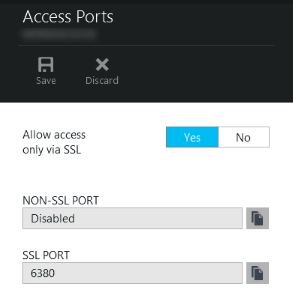

<properties
    pageTitle="Connettere un'app web nel servizio App Azure Redis Cache mediante il protocollo Memcache | Microsoft Azure"
    description="Connettere un'app web nel servizio di Azure App cache Redis utilizzando il protocollo Memcache"
    services="app-service\web"
    documentationCenter="php"
    authors="SyntaxC4"
    manager="wpickett"
    editor="riande"/>

<tags
    ms.service="app-service-web"
    ms.devlang="php"
    ms.topic="get-started-article"
    ms.tgt_pltfrm="windows"
    ms.workload="na"
    ms.date="02/29/2016"
    ms.author="cfowler"/>

# <a name="connect-a-web-app-in-azure-app-service-to-redis-cache-via-the-memcache-protocol"></a>Connettere un'app web nel servizio App Azure Redis Cache mediante il protocollo Memcache

In questo articolo verrà imparerà a connettersi un'app web WordPress nel [Servizio App Azure](http://go.microsoft.com/fwlink/?LinkId=529714) [Azure Redis Cache] [ 12] utilizzando [Memcache] [ 13] protocollo. Se si dispone di un'app web esistente che utilizza un server Memcached per la memorizzazione nella cache in memoria, è possibile eseguire la migrazione al servizio App Azure e usare la soluzione di memorizzazione nella cache prima parte in Microsoft Azure con poche modifiche o nessuna modifica al codice dell'applicazione. Inoltre, è possibile utilizzare il Memcache esistente competenze necessarie per creare elevata scalabilità distribuito app nel servizio di App Azure con Azure Redis Cache per memorizzare nella cache in memoria, durante l'uso di Framework di applicazione comuni, ad esempio .NET, PHP, Node, Java e Python.  

Servizio di App Web App consente questo scenario di applicazione con shim Web App Memcache, ossia un server Memcached locale che funge da proxy Memcache per la memorizzazione nella cache le chiamate alla Cache Redis Azure. In questo modo qualsiasi app che comunica tramite il protocollo Memcache per memorizzare i dati con Redis Cache. Questa correzione rapida Memcache funziona a livello di protocollo, in modo che può essere utilizzato da qualsiasi applicazione o framework applicazione come comunica mediante il protocollo Memcache.

[AZURE.INCLUDE [app-service-web-to-api-and-mobile](../../includes/app-service-web-to-api-and-mobile.md)] 

## <a name="prerequisites"></a>Prerequisiti

È possibile utilizzare shim Web App Memcache con qualsiasi applicazione purché comunica mediante il protocollo Memcache. In questo esempio specifico, l'applicazione di riferimento è un sito WordPress Scalable che viene completato il provisioning di Azure Marketplace.

Seguire i passaggi descritti in questi articoli:

* [Effettuare il provisioning di un'istanza del servizio Cache Redis Azure][0]
* [Distribuire un sito WordPress Scalable in Azure][1]

Dopo avere inserito il sito WordPress Scalable distribuito e un'istanza di Redis della Cache viene completato il provisioning sarà pronti per procedere con l'attivazione shim Memcache in Azure App servizio Web Apps.

## <a name="enable-the-web-apps-memcache-shim"></a>Abilitare shim Memcache App Web

Per configurare Memcache shim, è necessario creare tre le impostazioni dell'app. Questa operazione può essere eseguita con una vasta gamma di metodi tra i quali il [Portale di Azure](http://go.microsoft.com/fwlink/?LinkId=529715), il [portale classica][3], i [Cmdlet di PowerShell Azure] [ 5] o l' [interfaccia di riga di comando Azure][5]. Per quanto riguarda il post, userò a utilizzare il [Portale di Azure] [ 4] per configurare le impostazioni di app. Le seguenti possono essere recuperati da blade **Impostazioni** dell'istanza Redis Cache.


### <a name="add-redishost-app-setting"></a>Aggiungere REDIS_HOST app impostazione

Impostazione della app prima è necessario creare la **REDIS\_HOST** impostazione app. Questa impostazione consente di destinazione a cui lo shim inoltra le informazioni della cache. Il valore richiesto per l'impostazione di app REDIS_HOST possibile recuperato e il **proprietà** dell'istanza Redis Cache.


Impostare la chiave dell'impostazione di app da **REDIS\_HOST** e il valore dell'impostazione di app per **nome host** dell'istanza Redis Cache.


### <a name="add-rediskey-app-setting"></a>Aggiungere REDIS_KEY app impostazione

Impostazione della seconda app è necessario creare la **REDIS\_chiave** impostazione app. Questa impostazione viene fornito che il token di autenticazione necessari per l'accesso sicuro l'istanza della Cache Redis. È possibile recuperare il valore richiesto per l'impostazione di app REDIS_KEY e il **i tasti di scelta** dell'istanza Redis Cache.


Impostare la chiave dell'impostazione di app da **REDIS\_chiave** e il valore dell'impostazione di app per la **Chiave primaria** dell'istanza Redis Cache.


### <a name="add-memcacheshimredisenable-app-setting"></a>Aggiungere MEMCACHESHIM_REDIS_ENABLE app impostazione

L'ultima impostazione app viene utilizzato per attivare Memcache Shim nelle applicazioni Web, che utilizza la REDIS_HOST e REDIS_KEY per connettersi alla Cache Redis Azure e inoltrare la cache di chiamate. Impostare la chiave dell'impostazione di app da **MEMCACHESHIM\_REDIS\_abilitare** e il valore **vero**.


Dopo aver aggiungendo le impostazioni di tre (3) app, fare clic su **Salva**.

## <a name="enable-memcache-extension-for-php"></a>Attivare l'estensione Memcache per PHP

Affinché l'applicazione parlare il protocollo Memcache, è necessario installare l'estensione Memcache a PHP, ossia il framework di lingua per il sito WordPress.

### <a name="download-the-phpmemcache-extension"></a>Scaricare php_memcache estensione

Passare alla [PECL][6]. Nella categoria Strumenti di memorizzazione nella cache, fare clic su [memcache][7]. Nella colonna download fare clic sul collegamento DLL.


Scaricare il collegamento Thread Non sicuro (punta) x86 per la versione di PHP abilitato nelle applicazioni Web. (Impostazione predefinita è 5.4 PHP)


### <a name="enable-the-phpmemcache-extension"></a>Attivare l'estensione php_memcache

Dopo avere scaricato il file, decomprimere e caricare il **php\_memcache.dll** nel **d:\\home\\sito\\wwwroot\\collocazione\\est\\ ** directory. Dopo la php_memcache.dll viene caricato in web app, è necessario attivare l'estensione del runtime PHP. Per abilitare l'estensione Memcache nel portale di Azure, aprire e **l'Impostazioni applicazione** per l'applicazione web e quindi aggiungere una nuova impostazione di app con la chiave del **PHP\_estensioni** e il valore **collocazione\\est\\php_memcache.dll**.


> [AZURE.NOTE] Se l'applicazione web necessario caricare più estensioni PHP, il valore di PHP_EXTENSIONS deve essere un elenco di percorsi relativi ai file DLL delimitato.


Al termine, fare clic su **Salva**.

## <a name="install-memcache-wordpress-plugin"></a>Installare Memcache WordPress plug-in

> [AZURE.NOTE] È inoltre possibile scaricare il [Plug-in Cache oggetto Memcached](https://wordpress.org/plugins/memcached/) da WordPress.org.

Nella pagina WordPress plug-in, fare clic su **Aggiungi nuovo**.


Nella casella Cerca digitare **memcached** e premere **INVIO**.


Trovare **La cache degli oggetti Memcached** nell'elenco, quindi fare clic su **Installa**.


### <a name="enable-the-memcache-wordpress-plugin"></a>Attivare il plug-in Memcache WordPress

>[AZURE.NOTE] Seguire le istruzioni fornite in questo blog su [come abilitare un'estensione di siti Web Apps] [ 8] per installare Visual Studio Team Services.

Nel `wp-config.php` file, aggiungere il codice seguente sopra Interrompi Modifica commento verso la fine del file.

```php
$memcached_servers = array(
    'default' => array('localhost:' . getenv("MEMCACHESHIM_PORT"))
);
```

Dopo aver incollato il codice, monaco salverà automaticamente il documento.

Il passaggio successivo consiste nel consentire il plug-in cache degli oggetti. Questa operazione viene eseguita mediante trascinamento della selezione di **oggetti cache.php** dalla cartella **wp-contenuto/plug-in/memcached** nella cartella **contenuto wp** per abilitare la funzionalità di cache degli oggetti Memcache.


Ora che il file **oggetto cache.php** si trova nella cartella **contenuto wp** , la cache degli oggetti Memcached è abilitato.


## <a name="verify-the-memcache-object-cache-plugin-is-functioning"></a>Verificare il che funzionamento di plug-in cache degli oggetti Memcache

Tutti i passaggi per abilitare shim Web App Memcache sono ora completati. Non resta consiste nel verificare che i dati la compilazione dell'istanza di Redis Cache.

### <a name="enable-the-non-ssl-port-support-in-azure-redis-cache"></a>Attivare il supporto di porta non SSL nella Cache Redis Azure

>[AZURE.NOTE] Al momento della scrittura di questo articolo CLI Redis non supporta la connettività SSL, pertanto i passaggi seguenti sono necessari.

Nel portale di Azure, passare all'istanza della Cache Redis creato per questa applicazione web. Dopo avere aperto blade della cache, fare clic sull'icona **Impostazioni** .


Selezionare **Accesso a porte** dall'elenco.


Fare clic su **No** per **Consenti accesso solo tramite SSL**.



Verrà visualizzata la porta SSL NON viene ora impostata. Fare clic su **Salva**.


### <a name="connect-to-azure-redis-cache-from-redis-cli"></a>Connettersi a Azure Redis Cache da redis cli

>[AZURE.NOTE] Questo passaggio presuppone che redis è installato in locale nel computer di sviluppo. [Installare Redis localmente utilizzando queste istruzioni][9].

Aprire la console di scelta della riga di comando e digitare il comando seguente:

```shell
redis-cli –h <hostname-for-redis-cache> –a <primary-key-for-redis-cache> –p 6379
```

Sostituire il ** &lt;hostname per redis cache&gt; ** con il nome host xxxxx.redis.cache.windows.net effettivo e il ** &lt;principale chiave per redis cache&gt; ** con il tasto di scelta per la cache, quindi premere **INVIO**. Una volta CLI sono connessi all'istanza della Cache Redis, comando qualsiasi redis. Nella schermata seguente ho scelto visualizzare un elenco di tasti.


La chiamata a elencare le chiavi deve restituire un valore. Se non, provare a esplorare il web app e riprovare.

## <a name="conclusion"></a>Conclusioni

Congratulazioni! L'app WordPress è ora disponibile una cache in memoria centralizzata per facilitare l'aumento. Tenere presente che lo Memcache Shim di applicazioni Web può essere utilizzato con qualsiasi client Memcache indipendentemente dal linguaggio di programmazione o framework applicazione. Per fornire commenti e suggerimenti o per porre domande su shim Web App Memcache post nei forum [MSDN] [ 10] o [Stackoverflow][11].

>[AZURE.NOTE] Se si desidera iniziare a utilizzare il servizio di App Azure prima di iscriversi a un account Azure, accedere al [Servizio App provare](http://go.microsoft.com/fwlink/?LinkId=523751), in cui è possibile creare immediatamente un'app web starter breve nel servizio di App. Nessun carte di credito obbligatorio; Nessun impegni.

## <a name="whats-changed"></a>Novità
* Per una Guida per la modifica da siti Web al servizio App vedere: [servizio App Azure e l'impatto sulla esistente servizi di Windows Azure](http://go.microsoft.com/fwlink/?LinkId=529714)


[0]: ../redis-cache/cache-dotnet-how-to-use-azure-redis-cache.md#create-a-cache
[1]: http://bit.ly/1t0KxBQ
[2]: http://manage.windowsazure.com
[3]: http://portal.azure.com
[4]: ../powershell-install-configure.md
[5]: /downloads
[6]: http://pecl.php.net
[7]: http://pecl.php.net/package/memcache
[8]: http://blog.syntaxc4.net/post/2015/02/05/how-to-enable-a-site-extension-in-azure-websites.aspx
[9]: http://redis.io/download#installation
[10]: https://social.msdn.microsoft.com/Forums/home?forum=windowsazurewebsitespreview
[11]: http://stackoverflow.com/questions/tagged/azure-web-sites
[12]: /services/cache/
[13]: http://memcached.org
