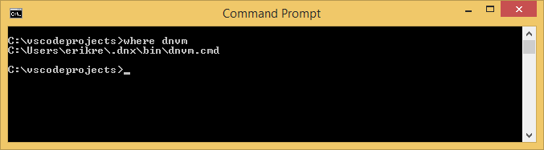
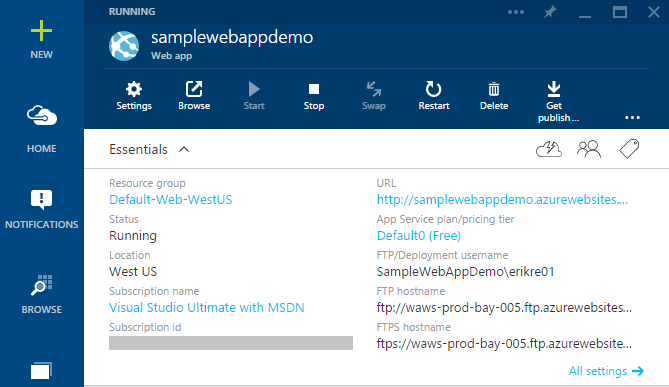
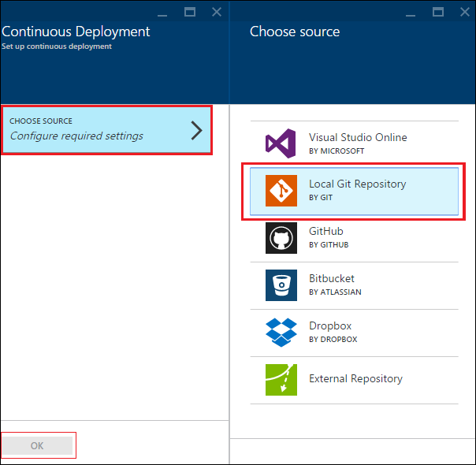
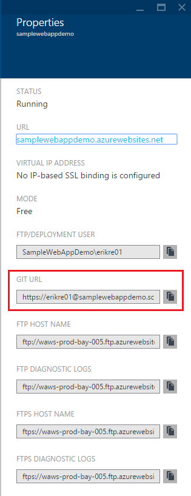
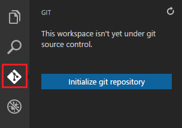

<properties
   pageTitle="Creare un'applicazione web ASP.NET 5 in codice Visual Studio"
   description="In questa esercitazione viene illustrato come creare un'app web ASP.NET 5 usando il codice Visual Studio."
   services="app-service\web"
   documentationCenter=".net"
   authors="erikre"
   manager="wpickett"
   editor="jimbe"/>

<tags
    ms.service="app-service-web" 
    ms.workload="web" 
    ms.tgt_pltfrm="dotnet" 
    ms.devlang="na" 
    ms.topic="article" 
    ms.date="02/26/2016" 
    ms.author="cephalin"/>

# Creare un'applicazione web ASP.NET 5 in codice Visual Studio

## Panoramica

In questa esercitazione viene illustrato come creare un'app web ASP.NET 5 utilizzando [Visual Studio (codice VS)](http://code.visualstudio.com//Docs/whyvscode) e distribuire al [Servizio App Azure](../app-service/app-service-value-prop-what-is.md). 

> [AZURE.NOTE] Anche se in questo articolo si riferisce alle applicazioni web, vengono applicati anche a API App e App per dispositivi mobili. 

ASP.NET 5 è un notevole ristrutturazione di ASP.NET. ASP.NET 5 è un nuovo framework Apri origine e multipiattaforma per la creazione di applicazioni web basate su cloud moderno utilizzando .NET. Per ulteriori informazioni, vedere [Introduzione a ASP.NET 5](http://docs.asp.net/en/latest/conceptual-overview/aspnet.html). Per informazioni su Azure App servizio web apps, vedere [Panoramica di applicazioni Web](app-service-web-overview.md).

[AZURE.INCLUDE [app-service-web-try-app-service.md](../../includes/app-service-web-try-app-service.md)]

## Prerequisiti  

* Installare [codice VS](http://code.visualstudio.com/Docs/setup).
* Installa [Node](http://nodejs.org) - Node è una piattaforma per la creazione di applicazioni server veloce e scalabilità utilizzando JavaScript. Nodo è il runtime (nodo) e [npm](http://www.npmjs.com/) è il responsabile del pacchetto di moduli di nodo. Scaffold un'app web ASP.NET 5 in questa esercitazione si utilizzerà npm.
* Installare fra - è possibile installarlo da uno di questi percorsi: [Chocolatey](https://chocolatey.org/packages/git) o [scm.com fra](http://git-scm.com/downloads). Se ha familiarità con fra, scegliere [fra scm.com](http://git-scm.com/downloads) e selezionare l'opzione per **Usare fra dal prompt dei comandi di Windows**. Dopo avere installato fra, è anche necessario impostare il nome utente fra e posta elettronica come richiesto in un secondo momento nell'esercitazione (quando si esegue un'operazione di commit dal codice di Visual Studio).  

## Installare ASP.NET 5 e DNX
ASP.NET 5/DNX (l'ambiente di esecuzione .NET) è una pila .NET snella per la creazione di una versione recente cloud e web apps in esecuzione in OS X, Linux e Windows. Si è stato creato da zero per fornire una struttura di sviluppo ottimizzato per App che vengono distribuite nel cloud o eseguire locale. È costituita componenti modulari con sovraccarico minimo, in modo che è mantenere flessibilità durante la creazione di soluzioni.

In questa esercitazione è progettata per iniziare la creazione di applicazioni con le versioni più recenti di sviluppo di ASP.NET 5 e DNX. Le istruzioni seguenti sono specifiche di Windows. Per ulteriori istruzioni di installazione per OS X, Linux e Windows, vedere [installazione ASP.NET 5 e DNX](https://code.visualstudio.com/Docs/ASPnet5#_installing-aspnet-5-and-dnx). 

1. Per installare .NET versione Manager (DNVM) in Windows, aprire un prompt dei comandi ed eseguire il comando seguente.

        @powershell -NoProfile -ExecutionPolicy unrestricted -Command "&{$Branch='dev';iex ((new-object net.webclient).DownloadString('https://raw.githubusercontent.com/aspnet/Home/dev/dnvminstall.ps1'))}"

    Verrà scaricare lo script DNVM e inserirlo nella directory di profilo utente. 

2. **Riavviare Windows** per completare l'installazione di DNVM. 

    Dopo il riavvio di Windows, è possibile aprire il prompt dei comandi per verificare la posizione della DNVM immettendo le operazioni seguenti:

        where dnvm

    Il prompt dei comandi verrà visualizzato un percorso simile al seguente.

    

3. Dopo aver creato DNVM, è necessario utilizzare per il download DNX per l'esecuzione delle applicazioni. Al prompt dei comandi, eseguire le operazioni seguenti:

        dnvm upgrade

    Verificare il DNVM e visualizzare runtime attivo immettendo quanto segue al prompt dei comandi:

        dnvm list

    Il prompt dei comandi per visualizzare i dettagli del runtime attivo.

    

    Se più runtime DNX è elencato, è possibile scegliere di immettere le informazioni seguenti (o una versione più recente) al prompt dei comandi per impostare il runtime DNX attivo. Impostare sulla stessa versione che viene utilizzata il generatore di 5 ASP.NET quando si crea un'app web più avanti in questa esercitazione. *Non occorre modificare runtime attivo se è impostato per l'ultima data disponibilità.*

        dnvm use 1.0.0-update1 –p

> [AZURE.NOTE] Per ulteriori istruzioni di installazione per OS X, Linux e Windows, vedere [installazione ASP.NET 5 e DNX](https://code.visualstudio.com/Docs/ASPnet5#_installing-aspnet-5-and-dnx). 

## Creare l'applicazione web 

In questa sezione viene illustrato come scaffold nuova app ASP.NET web app. Utilizzare la gestione di pacchetti di nodo (npm) per installare [Yeoman](http://yeoman.io/) (strumento di supporto temporaneo applicazione - equivalente VS codice di Visual Studio **File > Nuovo progetto** operazione), [noioso](http://gruntjs.com/) (canale attività JavaScript) e [Bower](http://bower.io/) (gestione di pacchetti sul lato client). 

1. Aprire un prompt dei comandi con diritti di amministratore e passare al percorso in cui si desidera creare il progetto ASP.NET. Ad esempio, creare una directory *vscodeprojects* nella radice del c:\.

2. Immettere quanto segue al prompt dei comandi per installare Yeoman e gli strumenti di supporto.

        npm install -g yo grunt-cli generator-aspnet bower

    > [AZURE.NOTE] Potrebbe essere visualizzato un avviso che suggerisce che la versione npm non è aggiornata. Questo avviso non influiscono in questa esercitazione.

3. Immettere quanto segue al prompt dei comandi per creare la cartella del progetto e scaffold l'app.

        yo aspnet

4. Utilizzare i tasti di direzione per selezionare il tipo di **Base di applicazione Web** dal menu di generatore ASP.NET 5, quindi premere ** &lt;Invio >**.

    

5. Impostare il nome della nuova app web ASP.NET **SampleWebApp**. Come viene utilizzato nel corso dell'esercitazione, se si seleziona un nome diverso, è necessario sostituire a ogni occorrenza della **SampleWebApp**. Quando si preme ** &lt;Invio >**, Yeoman verrà creata una nuova cartella denominata **SampleWebApp** e i file necessari per la nuova app.

6. Al prompt dei comandi, passare alla cartella del nuovo progetto:

        cd SampleWebApp

7. Anche al prompt dei comandi per installare i pacchetti NuGet necessari per eseguire l'applicazione, immettere il comando seguente:

        dnu restore

8. Aprire Visual Studio codice immettendo quanto segue al prompt dei comandi:

        code .

## Eseguire l'applicazione web localmente

Dopo aver creato il web app e recuperati tutti i pacchetti NuGet per l'app, è possibile eseguire le app web in locale.

1. **Comando tavolozza** nel codice Visual Studio, immettere le operazioni seguenti per visualizzare le opzioni del comando Esegui disponibili:

        dnx: Run Command

    > [AZURE.NOTE] Se il server Omnisharp non è in esecuzione, verrà avviata. Immettere nuovamente il comando riportato sopra.

    Selezionare quindi il seguente comando per eseguire un'applicazione web:
        
        dnx web - (SampleWebApp)

    Verrà visualizzata la finestra di comando che si è iniziata l'applicazione. Se la finestra di comando non viene visualizzato questo messaggio, selezionare l'inferiore sinistro corning di codice Visual Studio per gli errori nel progetto.
    
    > [AZURE.NOTE]Eseguire un comando nella **Tavolozza comando** richiede un **>** carattere all'inizio della riga di comando. È possibile visualizzare i dettagli relativi al comando **web** nel file *project.json* .   
    > Se il comando non viene visualizzato o non è disponibile, potrebbe essere necessario installare l'estensione c#. Eseguire `>Extensions: Install Extension` e `ext install c#` per installare le estensioni c#.

2. Aprire un browser e passare all'URL seguente.

    **http://localhost:5000**

    Come indicato di seguito viene visualizzata la pagina predefinita dell'applicazione web.

    

3. Chiudere il browser. Nella **Finestra di comando**, premere **Ctrl + C** per chiudere l'applicazione e chiudere la **Finestra di comando**. 

## Creare un'app web nel portale di Azure

La procedura seguente le fasi di creazione di un'app web nel portale di Azure.

1. Accedere al [portale di Azure](https://portal.azure.com).

2. Fare clic su **Nuovo** nella parte superiore sinistra del portale.

3. Fare clic su **Web App > Web App**.

    

4. Immettere un valore per **nome**, ad esempio **SampleWebAppDemo**. Si noti che questo nome deve essere univoco e il portale applicherà che quando si tenta di immettere il nome. Se si seleziona un immettere un valore diverso, sarà necessario sostituire il valore per ogni occorrenza di **SampleWebAppDemo** che viene visualizzato in questa esercitazione. 

5. Selezionare **App servizio pianificare** un esistente o crearne uno nuovo. Se si crea un nuovo piano, selezionare il livello dei prezzi, posizione e altre opzioni. Per ulteriori informazioni sui piani di servizio di App, vedere l'articolo [panoramica approfondita piani servizio App Azure](../app-service/azure-web-sites-web-hosting-plans-in-depth-overview.md).

    

6. Fare clic su **Crea**.

    

## Attivare la pubblicazione di operazioni per la nuova app web

Fra è un sistema di controllo delle versioni distribuito che è possibile utilizzare per distribuire un'app web di Azure App servizio. Archiviare il codice che scritto per un'app web in un repository fra locale e si verrà distribuire il codice in Azure premendo a un repository remoto.   

1. Accedere al [portale di Azure](https://portal.azure.com).

2. Fare clic su **Sfoglia**.

3. Fare clic su **Web Apps** per visualizzare un elenco di applicazioni web associato all'abbonamento Azure.

4. Selezionare l'app web creata in questa esercitazione.

5. Selezionare **Impostazioni**e il app web > **distribuzione continua**. 

    

6. Fare clic su **scegliere origine > archivio locale fra**.

7. Fare clic su **OK**.

    

8. Se non è già configurato le credenziali di distribuzione per la pubblicazione di un'app web o altre app di servizio di App, impostarli ora:

    * Fare clic su **Impostazioni** > **le credenziali di distribuzione**. Verrà visualizzato e **l'impostare le credenziali di distribuzione** .

    * Creare un nome utente e password.  È necessario la password in un secondo momento durante l'impostazione fra.

    * Fare clic su **Salva**.

9. In blade dell'applicazione web, fare clic su **Impostazioni > proprietà**. L'URL dell'archivio fra remoto che è possibile distribuire in visualizzata nella casella **URL fra**.

10. Copiare il valore di **URL fra** per successivi utilizzi nell'esercitazione.

    

## Pubblicare un'applicazione web al servizio App Azure

In questa sezione, è necessario creare un archivio locale fra e push da tale archivio in Azure per distribuire un'app web di Azure.

1. Nel codice Visual Studio, selezionare l'opzione **fra** nella barra di spostamento sinistro.

    

2. Selezionare **inizializzare fra archivio** per assicurarsi che l'area di lavoro si trova sotto controllo del codice sorgente fra. 

    

3. Aprire la finestra di comando e passare alla directory dell'applicazione web. Immettere il comando seguente:

        git config core.autocrlf false

    Questo comando impedisce a un problema informazioni sul testo in cui sono coinvolti terminazioni CRLF e le terminazioni di nuova riga.

4. Nel codice Visual Studio, aggiungere un messaggio di conferma e fare clic sull'icona di controllo **Commit tutti** .

    

5. Al termine dell'elaborazione fra, si noterà che non sono presenti file elencati nella finestra fra in **modifiche**. 

    

6. Ripristinare la finestra di comando in cui il prompt dei comandi punta alla directory app web in cui si trova.

7. Creare un riferimento remoto per l'inserimento degli aggiornamenti a un'applicazione web tramite l'URL di fra (che terminano in ".git") che sono stati copiati in precedenza.

        git remote add azure [URL for remote repository]

8. Configurare fra per salvare le credenziali locale in modo che verrà aggiunto automaticamente ai comandi push generati dal codice VS.

        git config credential.helper store

9. Inviare le modifiche apportate ai Azure immettendo il comando seguente. Dopo questa push iniziale in Azure, sarà possibile eseguire tutti i comandi di push dal codice VS. 

        git push -u azure master

    Viene chiesto di immettere la password creata precedentemente in Azure. **Nota: La password non sarà visibile.**

    L'output del comando precedente termina con un messaggio che distribuzione ha esito positivo.

        remote: Deployment successful.
        To https://user@testsite.scm.azurewebsites.net/testsite.git
        [new branch]      master -> master

> [AZURE.NOTE] Se si apportano modifiche all'applicazione in uso, è possibile pubblicare di nuovo direttamente nel codice Visual Studio utilizzando la funzionalità incorporata fra selezionando l'opzione **Eseguire il Commit tutti** seguito dall'opzione **Push** . Si possono trovare l'opzione **Push** disponibile nel menu a discesa accanto al pulsante **Eseguire il Commit tutti** e **aggiornare** .

Se è necessario per la collaborazione su un progetto, è necessario prendere in considerazione inserendo a GitHub tra inserendo in Azure.

## Eseguire l'app in Azure
Ora che è stata distribuita un'applicazione web, eseguiamo app mentre ospitato in Azure. 

Questa operazione può essere eseguita in due modi:

* Aprire un browser e immettere il nome dell'applicazione web come indicato di seguito.   

        http://SampleWebAppDemo.azurewebsites.net
 
* Nel portale di Azure, individuare e il app web per un'app web e fare clic su **Sfoglia** per visualizzare l'app 
* nel browser predefinito.

## Riepilogo
In questa esercitazione, è stato illustrato come creare un'app web nel codice Visual Studio e distribuirlo in Azure. Per ulteriori informazioni sul codice di Visual Studio, vedere l'articolo [perché Visual Studio codice?](https://code.visualstudio.com/Docs/) Per informazioni sulle App servizio web App, vedere [Panoramica di applicazioni Web](app-service-web-overview.md). 
