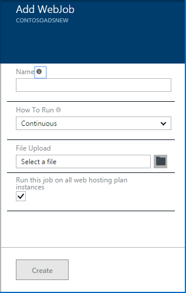

<properties 
    pageTitle="Eseguire le attività in Background con WebJobs" 
    description="Informazioni su come eseguire attività in background di Azure web apps." 
    services="app-service" 
    documentationCenter="" 
    authors="tdykstra" 
    manager="wpickett" 
    editor="jimbe"/>

<tags 
    ms.service="app-service" 
    ms.workload="na" 
    ms.tgt_pltfrm="na" 
    ms.devlang="na" 
    ms.topic="article" 
    ms.date="04/27/2016" 
    ms.author="tdykstra"/>

# <a name="run-background-tasks-with-webjobs"></a>Eseguire le attività in Background con WebJobs

## <a name="overview"></a>Panoramica

È possibile eseguire programmi o script in WebJobs [nell'App servizio](http://go.microsoft.com/fwlink/?LinkId=529714) web app in tre modi: su richiesta, continuamente o in una pianificazione. Non esiste costi aggiuntivi da utilizzare WebJobs.

In questo articolo viene illustrato come distribuire WebJobs tramite il [Portale di Azure](https://portal.azure.com). Per informazioni su come distribuire utilizzando Visual Studio o un processo continuo recapito, vedere [come distribuire Azure WebJobs alle Web App](websites-dotnet-deploy-webjobs.md).

Azure WebJobs SDK semplifica WebJobs molte attività di programmazione. Per ulteriori informazioni, vedere [Novità SDK WebJobs](websites-dotnet-webjobs-sdk.md).

 Funzioni di Azure (attualmente in versione di anteprima) è un altro modo per eseguire script e programmi in Azure App servizio. Per ulteriori informazioni, vedere [Panoramica di funzioni di Azure](../azure-functions/functions-overview.md).

[AZURE.INCLUDE [app-service-web-to-api-and-mobile](../../includes/app-service-web-to-api-and-mobile.md)] 

## <a name="acceptablefiles"></a>Tipi di file validi per gli script o programmi

Vengono accettati i tipi di file seguenti:

* cmd, bat, .exe (con cmd di windows)
* ps1 (con powershell)
* .sh (con bash)
* PHP (con php)
* .py (con python)
* js (con nodo)
* JAR (con java)

## <a name="CreateOnDemand"></a>Creare una richiesta via WebJob nel portale

1. In e il **Web App** del [Portale di Azure](https://portal.azure.com), fare clic su **tutte le impostazioni > WebJobs** per visualizzare e il **WebJobs** .
    
    
    
5. Fare clic su **Aggiungi**. Verrà visualizzata la finestra di dialogo **Aggiungi WebJob** .
    
    
    
2. Nella casella **nome**specificare un nome per il WebJob. Il nome deve iniziare con una lettera o un numero e non possono contenere caratteri speciali diverso da "-" e "_".
    
4. Nella casella **come a portata di clic** , scegliere **Esegui su richiesta**.
    
3. Nella finestra di **Caricamento File** , fare clic sull'icona di cartella e individuare il file zip contenente uno script. Il file zip deve contenere il file eseguibile (.exe cmd bat .sh PHP .py js) e i file di supporto necessari per eseguire il programma o script.
    
5. Selezionare **Crea** per caricare lo script in un'applicazione web. 
    
    Il nome specificato per il WebJob viene visualizzato nell'elenco e il **WebJobs** .
    
6. Per eseguire il WebJob, mouse sul nome nell'elenco e fare clic su **Esegui**.
    
    
    
## <a name="CreateContinuous"></a>Creare un WebJob continuo

1. Per creare un WebJob continuamente in esecuzione, seguire la stessa procedura per la creazione di un WebJob che viene eseguito una sola volta, ma nella casella **come a portata di clic** , scelga **Continua**.

2. Per avviare o interrompere un WebJob continuo, il pulsante destro WebJob nell'elenco e fare clic su **avviare** o **arrestare**.
    
> [AZURE.NOTE] Se l'applicazione web viene eseguito su più istanze, un WebJob continuo verrà eseguito su tutte le istanze. Su richiesta e pianificate WebJobs eseguito su una singola istanza selezionata l'opzione per il bilanciamento del carico da Microsoft Azure.
    
> Per WebJobs continua per l'esecuzione in modo affidabile e su tutte le istanze, attivare il sempre * impostazione di configurazione per il web app in caso contrario è possibile interrompere l'esecuzione quando il sito host servizi è rimasto inattivo troppo a lungo.

## <a name="CreateScheduledCRON"></a>Creare un WebJob pianificata utilizzando un'espressione CRON

Questa tecnica è disponibile per le applicazioni Web in esecuzione in modalità di base, Standard o Premium e richiede l'impostazione **Sempre attiva** attivare l'app.

Per trasformare un WebJob su richiesta in una WebJob programmata, è sufficiente includere un `settings.job` file nella radice del file zip WebJob. Questo file JSON deve includere una `schedule` proprietà con un' [espressione CRON](https://en.wikipedia.org/wiki/Cron), per esempio riportato di seguito.

L'espressione CRON è composto da 6 campi: `{second} {minute} {hour} {day} {month} {day of the week}`.

Per attivare il WebJob ogni 15 minuti, ad esempio, il `settings.job` avrebbe:

```json
{
    "schedule": "0 */15 * * * *"
}
``` 

Altri esempi di programmazione CRON:

- Ogni ora (ad esempio, ogni volta che il numero di minuti è uguale a 0):`0 0 * * * *` 
- Ogni ora da 9: 00 PM 5:`0 0 9-17 * * *` 
- Ore 9:30 ogni giorno:`0 30 9 * * *`
- Ore 9:30 ogni giorno della settimana:`0 30 9 * * 1-5`

**Nota**: quando si distribuisce una WebJob da Visual Studio, assicurarsi che contrassegnare il `settings.job` proprietà del file come 'Copia se più recente'.


## <a name="CreateScheduled"></a>Creare un WebJob pianificata utilizzando l'utilità di Azure

La seguente tecnica alternativa viene utilizzato l'utilità di pianificazione di Azure. In questo caso, il WebJob non dispone di alcuna informazione diretto della pianificazione. Se, tuttavia, l'utilità di pianificazione di Azure viene configurato per attivare il WebJob alla programmazione di un. 

Il portale di Azure non è ancora disponibile la possibilità di creare un WebJob pianificata, ma fino a che viene aggiunto funzionalità che è possibile eseguire tramite il [portale classica](http://manage.windowsazure.com).

1. Nel [portale classica](http://manage.windowsazure.com) passare alla pagina WebJob e fare clic su **Aggiungi**.

1. Nella casella **come a portata di clic** , scegliere **Esegui in base alla pianificazione**.
    
    ![Nuovo processo pianificato][NewScheduledJob]
    
2. Scegliere l' **Area geografica utilità di pianificazione** per il lavoro e quindi fare clic sulla freccia in basso a destra della finestra di dialogo per passare alla schermata successiva.

3. Nella finestra di dialogo **Crea processo** , scegliere il tipo di **ricorrenza** desiderata: **processo singola** o **periodica**.
    
    ![Ricorrenza pianificazione][SchdRecurrence]
    
4. Inoltre scegliere un'ora di **inizio** : **subito** o **in un momento specifico**.
    
    ![Ora di inizio pianificazione][SchdStart]
    
5. Se si vuole avviare in un momento specifico, scegliere i valori di ora iniziali in **Base a partire**.
    
    ![Programmazione comincia da un'ora specifica][SchdStartOn]
    
6. Se si sceglie un processo ricorrente, si dispone di **ricorre ogni** opzione per specificare la frequenza di occorrenza e l'opzione **Che terminano in** per specificare un'ora di fine.
    
    ![Ricorrenza pianificazione][SchdRecurEvery]
    
7. Se si sceglie **settimane**, è possibile selezionare la casella di **Un particolare puntuale** e specificare i giorni della settimana che si desidera eseguire il processo.
    
    ![Pianificazione giorni della settimana][SchdWeeksOnParticular]
    
8. Se si sceglie **mesi** e selezionare la casella di **Un particolare puntuale** , è possibile impostare il processo per l'esecuzione in particolare numerato **giorni** del mese. 
    
    ![Pianificazione determinate date del mese][SchdMonthsOnPartDays]
    
9. Se si sceglie di **Giorni**, è possibile selezionare il giorno o i giorni della settimana del mese desiderata per eseguire nel processo.
    
    ![Pianificare i giorni particolare settimana in un mese][SchdMonthsOnPartWeekDays]
    
10. Infine, è possibile utilizzare l'opzione **occorrenze** per scegliere la settimana del mese (primo, secondo, terzo e così via) desiderato il processo da eseguire per il giorno della settimana specificato.
    
    ![Pianificare i giorni settimana particolare settimane specifico in un mese][SchdMonthsOnPartWeekDaysOccurences]
    
11. Dopo aver creato uno o più processi, i nomi verranno visualizzati nella scheda WebJobs con il relativo stato, il tipo di pianificazione e altre informazioni. Informazioni cronologiche per WebJobs ultime 30 viene mantenute.
    
    ![Elenco dei processi][WebJobsListWithSeveralJobs]
    
### <a name="Scheduler"></a>Programmate e utilità di pianificazione di Azure

Programmate possono essere ulteriormente configurati nelle pagine di Azure utilità di pianificazione del [portale classica](http://manage.windowsazure.com).

1.  Nella pagina WebJobs fare clic su collegamento di **pianificazione** del processo per passare alla pagina del portale di Azure utilità di pianificazione. 
    
    ![Collegamento a Scheduler Azure][LinkToScheduler]
    
2. Nella pagina Utilità di pianificazione, fare clic sul processo.
    
    ![Processo nella pagina del portale utilità di pianificazione][SchedulerPortal]
    
3. Verrà visualizzata la pagina di **azione del processo** , in cui è possibile configurare ulteriormente il processo. 
    
    ![Azione del processo PageInScheduler][JobActionPageInScheduler]
    
## <a name="ViewJobHistory"></a>Visualizzare la cronologia

1. Per visualizzare la cronologia di esecuzione di un processo, inclusi i processi creati con SDK WebJobs, fare clic sul collegamento corrispondente nella colonna **registri** della stessa e WebJobs. (È possibile utilizzare l'icona Appunti per copiare l'URL della pagina di file di log negli Appunti se lo si desidera).
    
    
        
2. Facendo clic sul collegamento, verrà visualizzata la pagina dei dettagli per il WebJob. Questa pagina vengono visualizzati il nome del comando Esegui, l'ora dell'ultimo che veniva, e il relativo esito positivo o negativo. In **esecuzione del processo di recente**, fare clic una volta per vedere ulteriori dettagli.
    
    ![WebJobDetails][WebJobDetails]
    
3. Verrà visualizzata la pagina **Dettagli esecuzione WebJob** . Fare clic su **Mostra/Nascondi Output** per visualizzare il testo dei contenuti del registro. Il Registro di output è in formato testo. 
    
    ![Processo Web dettagli eseguito][WebJobRunDetails]
    
4. Per visualizzare il testo di output in una finestra separata del browser, fare clic sul collegamento **download** . Per scaricare il testo, pulsante destro del mouse sul collegamento e utilizzare le opzioni del browser per salvare il contenuto del file.
    
    ![Scaricare l'output dei registri][DownloadLogOutput]
    
5. Il collegamento **WebJobs** nella parte superiore della pagina consente di ottenere un elenco di WebJobs nel dashboard di cronologia.
    
    ![Creare un collegamento all'elenco WebJobs][WebJobsLinkToDashboardList]
    
    ![Elenco di WebJobs nel dashboard di cronologia][WebJobsListInJobsDashboard]
    
    Fare clic su uno di questi collegamenti verrà visualizzata la pagina dei dettagli WebJob per il processo che è stato selezionato.


## <a name="WHPNotes"></a>Note
    
- App Web in modalità gratuita può causare il timeout dopo 20 minuti se sono presenti alcuna richiesta al sito di servizi (distribuzione) e portale dell'applicazione web non essere possibile aprire in Azure. Richieste al sito effettivo non vengono reimpostate seguente.
- Codice per un processo continuo deve essere scritte in un ciclo infinito.
- Processi continui eseguono continuamente solo quando il web app è attiva.
- Base e offerta modalità Standard di sempre nella funzionalità che, quando abilitate, viene impedito applicazioni web che diventa inattivo.
- È solo possibile eseguire il debug continuamente in esecuzione WebJobs. Il debug WebJobs programmata o su richiesta non è supportato.

## <a name="NextSteps"></a>Passaggi successivi
 
Per ulteriori informazioni, vedere [Azure WebJobs consigliati risorse][WebJobsRecommendedResources].

[PSonWebJobs]:http://blogs.msdn.com/b/nicktrog/archive/2014/01/22/running-powershell-web-jobs-on-azure-websites.aspx
[WebJobsRecommendedResources]:http://go.microsoft.com/fwlink/?LinkId=390226

[OnDemandWebJob]: ./media/web-sites-create-web-jobs/01aOnDemandWebJob.png
[WebJobsList]: ./media/web-sites-create-web-jobs/02aWebJobsList.png
[NewContinuousJob]: ./media/web-sites-create-web-jobs/03aNewContinuousJob.png
[NewScheduledJob]: ./media/web-sites-create-web-jobs/04aNewScheduledJob.png
[SchdRecurrence]: ./media/web-sites-create-web-jobs/05SchdRecurrence.png
[SchdStart]: ./media/web-sites-create-web-jobs/06SchdStart.png
[SchdStartOn]: ./media/web-sites-create-web-jobs/07SchdStartOn.png
[SchdRecurEvery]: ./media/web-sites-create-web-jobs/08SchdRecurEvery.png
[SchdWeeksOnParticular]: ./media/web-sites-create-web-jobs/09SchdWeeksOnParticular.png
[SchdMonthsOnPartDays]: ./media/web-sites-create-web-jobs/10SchdMonthsOnPartDays.png
[SchdMonthsOnPartWeekDays]: ./media/web-sites-create-web-jobs/11SchdMonthsOnPartWeekDays.png
[SchdMonthsOnPartWeekDaysOccurences]: ./media/web-sites-create-web-jobs/12SchdMonthsOnPartWeekDaysOccurences.png
[RunOnce]: ./media/web-sites-create-web-jobs/13RunOnce.png
[WebJobsListWithSeveralJobs]: ./media/web-sites-create-web-jobs/13WebJobsListWithSeveralJobs.png
[WebJobLogs]: ./media/web-sites-create-web-jobs/14WebJobLogs.png
[WebJobDetails]: ./media/web-sites-create-web-jobs/15WebJobDetails.png
[WebJobRunDetails]: ./media/web-sites-create-web-jobs/16WebJobRunDetails.png
[DownloadLogOutput]: ./media/web-sites-create-web-jobs/17DownloadLogOutput.png
[WebJobsLinkToDashboardList]: ./media/web-sites-create-web-jobs/18WebJobsLinkToDashboardList.png
[WebJobsListInJobsDashboard]: ./media/web-sites-create-web-jobs/19WebJobsListInJobsDashboard.png
[LinkToScheduler]: ./media/web-sites-create-web-jobs/31LinkToScheduler.png
[SchedulerPortal]: ./media/web-sites-create-web-jobs/32SchedulerPortal.png
[JobActionPageInScheduler]: ./media/web-sites-create-web-jobs/33JobActionPageInScheduler.png
 
