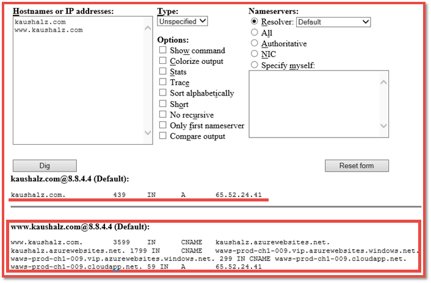

<properties
    pageTitle="Eseguire il mapping di un nome di dominio personalizzato a un'applicazione Azure"
    description="Informazioni su come eseguire il mapping di un nome di dominio personalizzato (per l'orgoglio dominio) per l'applicazione di servizio App Azure."
    services="app-service"
    documentationCenter=""
    authors="cephalin"
    manager="wpickett"
    editor="jimbe"
    tags="top-support-issue"/>

<tags
    ms.service="app-service"
    ms.workload="na"
    ms.tgt_pltfrm="na"
    ms.devlang="na"
    ms.topic="article"
    ms.date="07/27/2016"
    ms.author="cephalin"/>

# Eseguire il mapping di un nome di dominio personalizzato a un'applicazione Azure

[AZURE.INCLUDE [web-selector](../../includes/websites-custom-domain-selector.md)]

In questo articolo viene illustrato come mappare manualmente un nome di dominio personalizzato per il web app, back-end app per dispositivi mobili o app API in [Azure App servizio](../app-service/app-service-value-prop-what-is.md). 

L'app include già un sottodominio univoco del azurewebsites.net. Ad esempio, se il nome dell'app è **contoso**, il nome di dominio è **contoso.azurewebsites.net**. Tuttavia, è possibile associare un dominio personalizzato nome all'app in modo che il relativo URL, ad esempio `www.contoso.com`, riflette il marchio.

>[AZURE.NOTE] È possibile ottenere assistenza da esperti di Azure nei [forum di Azure](https://azure.microsoft.com/support/forums/). Per maggiore livello di supporto, visitare il [sito del supporto di Azure](https://azure.microsoft.com/support/options/) e fare clic su **Ottenere supporto**.

[AZURE.INCLUDE [introfooter](../../includes/custom-dns-web-site-intro-notes.md)]

## Acquisto di un dominio personalizzato nel portale di Azure

Se non è già stato acquistato un nome di dominio personalizzato, è possibile acquistarne uno e gestire direttamente nelle impostazioni dell'applicazione nel [portale di Azure](https://portal.azure.com). Questa opzione semplifica eseguire il mapping di un dominio personalizzato per l'app, se l'app Usa [Gestore del traffico Azure](web-sites-traffic-manager-custom-domain-name.md) o meno. 

Per ulteriori informazioni, vedere [acquistare un nome di dominio personalizzato per il servizio di App](custom-dns-web-site-buydomains-web-app.md).

## Eseguire il mapping di un dominio personalizzato che è stato acquistato esternamente

Se è già stato acquistato un dominio personalizzato da [Azure DNS](https://azure.microsoft.com/services/dns/) o da un provider di terze parti, sono disponibili tre passaggi principali per eseguire il mapping di dominio personalizzato per l'app:

1. [Indirizzo IP *(record a solo)* Get dell'applicazione](#vip).
2. [Creare record DNS di cui eseguire il mapping del dominio per l'app](#createdns). 
    - **Dove**: lo strumento di gestione del registrar di dominio (ad esempio DNS Azure, GoDaddy e così via).
    - **Perché**: in modo che il registrar è in grado di risolvere il dominio personalizzato desiderato per l'applicazione Azure.
1. [Attivare il nome di dominio personalizzato per l'app Azure](#enable).
    - **Dove**: [portale Azure](https://portal.azure.com).
    - **Perché**: in modo che l'applicazione è in grado di rispondere a richieste per il nome di dominio personalizzato.
3. [La propagazione di verifica DNS](#verify).

### Tipi di domini che è possibile eseguire il mapping

Il servizio App Azure consente di mappare le categorie seguenti dei domini personalizzati per l'app.

- **Dominio principale** - il nome di dominio riservato nel Registrar (rappresentato dal `@` ospitare i record, in genere). Ad esempio, **contoso.com**.
- **Sottodominio** - qualsiasi dominio che si trova sotto il dominio radice. Ad esempio, **www.contoso.com** (rappresentato dal `www` record host).  È possibile eseguire il mapping di diversi sottodomini dello stesso dominio radice a varie app di Azure.
- **Dominio carattere jolly** - [qualsiasi sottodominio è il cui etichetta DNS all'estrema sinistra `*` ](https://en.wikipedia.org/wiki/Wildcard_DNS_record) (ad esempio ospitano record `*` e `*.blogs`). Ad esempio ** \*. contoso.com**.

### Tipi di record DNS che è possibile usare

A seconda delle esigenze, è possibile utilizzare due tipi di record DNS standard per eseguire il mapping di un dominio personalizzato: 

- [Risposte](https://en.wikipedia.org/wiki/List_of_DNS_record_types#A) - mappe il nome di dominio personalizzato per indirizzo IP virtuale dell'app Azure indirizzo direttamente. 
- [CNAME](https://en.wikipedia.org/wiki/CNAME_record) - associa il nome di dominio personalizzato al nome di dominio Azure dell'app, * *&lt;*NomeApplicazione*>. azurewebsites.net**. 

Il vantaggio di CNAME è essere mantenuto in modifiche all'indirizzo IP. Se si elimina e ricreare l'app o ripristinare il livello **condiviso** da un livello superiore prezzo, potrebbe cambiare indirizzo IP virtuale dell'applicazione. Tramite una modifica, un record CNAME è ancora valido, mentre un record richiede un aggiornamento. 

L'esercitazione illustra i passaggi per l'uso di un record e anche per l'uso del record CNAME.

>[AZURE.IMPORTANT] Non creare un record CNAME per il dominio radice (ad esempio il "record principale"). Per ulteriori informazioni, consultare [il motivo per cui non è un record CNAME presso il dominio radice](http://serverfault.com/questions/613829/why-cant-a-cname-record-be-used-at-the-apex-aka-root-of-a-domain).
Per eseguire il mapping di un dominio radice Azure all'applicazione in uso, utilizzare un record.

## Passaggio 1. *(Solo un record)* Ottenere l'indirizzo IP dell'app
Per eseguire il mapping di un nome di dominio personalizzato con un record, è necessario indirizzo IP dell'applicazione Azure. Se si eseguirà il mapping con un record CNAME alternativa, ignorare questo passaggio e passare alla sezione successiva.

1.  Accedere al [portale di Azure](https://portal.azure.com).

2.  Fare clic su **App servizi** nel menu a sinistra.

4.  Scegliere l'app, quindi fare clic su **domini personalizzati**.

6.  Prendere nota dell'indirizzo IP sopra la sezione nome host.

    

7.  Tenere aperta la blade portale. Tornerà a esso dopo aver creato i record DNS.

## Passaggio 2. Creare i record DNS

Accedere al proprio registrar e utilizzare lo strumento per aggiungere un record a o CNAME. Interfaccia utente di ogni registrar è leggermente diverso, pertanto è consigliabile consultare la documentazione del provider. Tuttavia, ecco alcune linee guida generali.

1.  Individuare la pagina per la gestione dei record DNS. Cercare i collegamenti o aree del sito etichettata **Nome di dominio**, **DNS**o **Gestione di nome Server**. Spesso, è possibile trovare il collegamento per visualizzare le informazioni dell'account e quindi cercare un collegamento, ad esempio **My domains**.
2.  Cercare un collegamento che consente di aggiungere o modificare i record DNS. Può trattarsi di un **file di zona** o **I record DNS** collegamento o un collegamento di configurazione **Avanzate** .
3.  Creare il record e salvare le modifiche.
    - [Le istruzioni per un record sono qui](#a).
    - [Le istruzioni per un record CNAME sono qui](#cname).

### Creare un record

Per utilizzare un record per eseguire il mapping all'indirizzo IP dell'applicazione Azure, è davvero necessario creare un record e un record TXT. Il record è per la risoluzione DNS stesso, e il record TXT per Azure per verificare che si possiede il nome di dominio personalizzato. 

Configurare il record A come indicato di seguito (@ in genere rappresenta il dominio radice):
 
<table cellspacing="0" border="1">
  <tr>
    <th>Esempio di nome di dominio completo</th>
    <th>Un Host</th>
    <th>Un valore</th>
  </tr>
  <tr>
    <td>Contoso.com (radice)</td>
    <td>@</td>
    <td>Indirizzo IP da <a href="#vip">passaggio 1</a></td>
  </tr>
  <tr>
    <td>www.contoso.com (sotto)</td>
    <td>www</td>
    <td>Indirizzo IP da <a href="#vip">passaggio 1</a></td>
  </tr>
  <tr>
    <td>*. contoso.com (jolly)</td>
    <td>*</td>
    <td>Indirizzo IP da <a href="#vip">passaggio 1</a></td>
  </tr>
</table>

Il record TXT aggiuntivo assume la convenzione di mappe da &lt; *sottodominio*>. &lt; *rootdomain*> a &lt; *NomeApplicazione*>. azurewebsites.net. Configurare il record TXT nel modo seguente:

<table cellspacing="0" border="1">
  <tr>
    <th>Esempio di nome di dominio completo</th>
    <th>TXT Host</th>
    <th>Valore TXT</th>
  </tr>
  <tr>
    <td>Contoso.com (radice)</td>
    <td>@</td>
    <td>&lt;<i>NomeApplicazione</i>>. azurewebsites.net</td>
  </tr>
  <tr>
    <td>www.contoso.com (sotto)</td>
    <td>www</td>
    <td>&lt;<i>NomeApplicazione</i>>. azurewebsites.net</td>
  </tr>
  <tr>
    <td>*. contoso.com (jolly)</td>
    <td>*</td>
    <td>&lt;<i>NomeApplicazione</i>>. azurewebsites.net</td>
  </tr>
</table>

###Creare un record CNAME

Se si utilizza un record CNAME per eseguire il mapping a nome di dominio predefinito dell'applicazione Azure, non è necessario un ulteriore record TXT come con un record. 

>[AZURE.IMPORTANT] Non creare un record CNAME per il dominio radice (ad esempio il "record principale"). Per ulteriori informazioni, consultare [il motivo per cui non è un record CNAME presso il dominio radice](http://serverfault.com/questions/613829/why-cant-a-cname-record-be-used-at-the-apex-aka-root-of-a-domain).
Per eseguire il mapping di un dominio radice Azure all'applicazione in uso, utilizzare un [record a](#a) .

Configurare il record CNAME come indicato di seguito (@ in genere rappresenta il dominio radice):

<table cellspacing="0" border="1">
  <tr>
    <th>Esempio di nome di dominio completo</th>
    <th>Host CNAME</th>
    <th>Valore CNAME</th>
  </tr>
  <tr>
    <td>www.contoso.com (sotto)</td>
    <td>www</td>
    <td>&lt;<i>NomeApplicazione</i>>. azurewebsites.net</td>
  </tr>
  <tr>
    <td>*. contoso.com (jolly)</td>
    <td>*</td>
    <td>&lt;<i>NomeApplicazione</i>>. azurewebsites.net</td>
  </tr>
</table>

##Passaggio 3. Attivare il nome di dominio personalizzato per l'app

Di nuovo in e il **Domini personalizzati** nel portale di Azure (vedere [passaggio 1](#vip)), è necessario aggiungere il nome di dominio completo (FQDN) del dominio personalizzato per l'elenco.

1.  Se non è fatto, accesso al [portale di Azure](https://portal.azure.com).

2.  Nel portale di Azure, fare clic su **App servizi** nel menu a sinistra.

3.  Fare clic sull'app e quindi fare clic su **domini personalizzati** > **hostname Aggiungi**.

4.  Aggiungere il nome di dominio completo del dominio personalizzato nell'elenco (ad esempio **www.contoso.com**).

    

    >[AZURE.NOTE] Azure tenterà di verificare il nome di dominio che utilizzano qui. Assicurarsi che è lo stesso nome di dominio per cui è stato creato un record DNS nel [passaggio 2](#createdns). 

5.  Fare clic su **convalida**.

6.  Facendo clic su **convalida** Azure consente di avviare del flusso di lavoro di verifica del dominio. Verifica per la proprietà del dominio, nonché Hostname disponibilità e rapporto di successo o errore dettagliato con protegere istruzioni su come correggere l'errore.    

7.  Al termine della convalida **hostname Aggiungi** pulsante diventa attivo e sarà possibile hostname assegnazione. 

8.  Al termine della Azure configurare il nuovo nome di dominio personalizzato, passare al proprio nome di dominio personalizzato in un browser. Il browser deve aprire l'app di Azure, il che significa che il nome di dominio personalizzato sia configurato correttamente.

> [AZURE.NOTE] Se i record DNS è già uso (scenario il traffico di dominio active server) ed è necessario in modo preemptive associarvi un'app web di verifica del dominio, è sufficiente creare un record TXT a titolo esemplificativo illustrato nella tabella seguente. Il record TXT aggiuntivo assume la convenzione di mappe da &lt; *sottodominio*>. &lt; *rootdomain*> a &lt; *NomeApplicazione*>. azurewebsites.net. 
> <table cellspacing="0" border="1">
  <tr>
    <th>Esempio di nome di dominio completo</th>
    <th>TXT Host</th>
    <th>Valore TXT</th>
  </tr>
  <tr>
    <td>Contoso.com (radice)</td>
    <td>awverify.contoso.com</td>
    <td>&lt;<i>NomeApplicazione</i>>. azurewebsites.net</td>
  </tr>
  <tr>
    <td>www.contoso.com (sotto)</td>
    <td>awverify.www.contoso.com</td>
    <td>&lt;<i>NomeApplicazione</i>>. azurewebsites.net</td>
  </tr>
    <tr>
    <td>*. contoso.com (sotto)</td>
    <td>awverify.*.contoso.com</td>
    <td>&lt;<i>NomeApplicazione</i>>. azurewebsites.net</td>
  </tr>
</table>
Dopo aver creato il record DNS, tornare al portale Azure e aggiungere il nome di dominio personalizzato a un'applicazione web.
 

##Verificare la propagazione DNS

Dopo aver completato la procedura di configurazione, è possibile richiedere del tempo per le modifiche apportate a propagare, in base al provider DNS. È possibile verificare che la propagazione DNS funziona come previsto utilizzando [http://digwebinterface.com/](http://digwebinterface.com/). Quando si Sfoglia al sito, specificare il nome host nella casella di testo e fare clic su **attività Scavare**. Verificare che i risultati per verificare se le modifiche recenti sono stati applicati.  

> [AZURE.NOTE] La propagazione delle voci DNS può richiedere fino a 48 ore (a volte più). Se è stata configurata correttamente tutto, è necessario attendere che la propagazione venga eseguita correttamente.

## Passaggi successivi
Informazioni su come proteggere il nome di dominio personalizzato con HTTPS [l'acquisto di un certificato SSL in Azure](web-sites-purchase-ssl-web-site.md) o [utilizzando un certificato SSL da un' posizione](web-sites-configure-ssl-certificate.md).

>[AZURE.NOTE] Se si desidera iniziare a utilizzare il servizio di App Azure prima di iscriversi a un account Azure, accedere al [Servizio App provare](http://go.microsoft.com/fwlink/?LinkId=523751), in cui è possibile creare immediatamente un'app web starter breve nel servizio di App. Nessun carte di credito obbligatorio; Nessun impegni.

[Guida introduttiva a DNS Azure](../dns/dns-getstarted-create-dnszone.md)  
[Creare record DNS per un'app web in un dominio personalizzato](../dns/dns-web-sites-custom-domain.md)  
[Dominio delegato a DNS Azure](../dns/dns-domain-delegation.md)

<!-- Images -->
[subdomain]: media/web-sites-custom-domain-name/azurewebsites-subdomain.png
