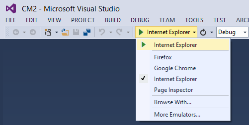
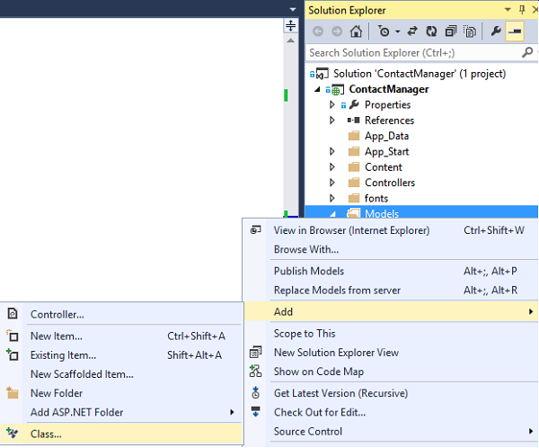
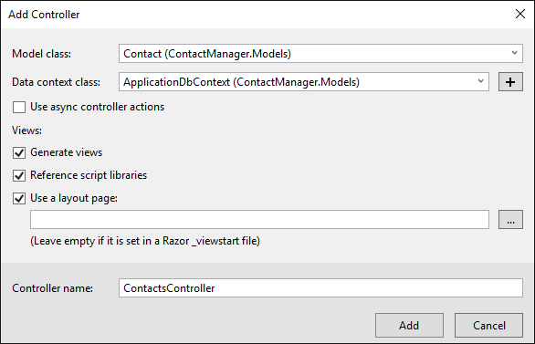
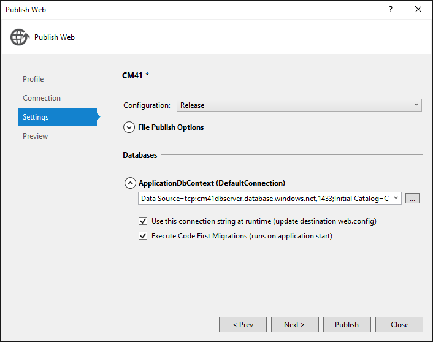
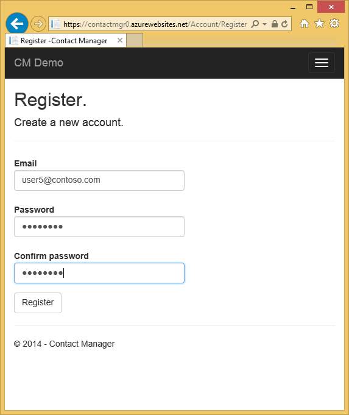
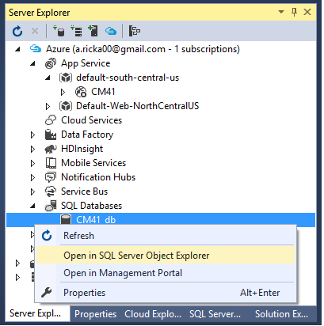

<properties 
    pageTitle="Creare un'applicazione MVC ASP.NET con auth e DB SQL e distribuire al servizio App Azure" 
    description="Informazioni su come sviluppare un'app di ASP.NET MVC 5 con un Database SQL back-end, aggiungere l'autenticazione e l'autorizzazione e distribuirlo in Azure." 
    services="app-service\web" 
    documentationCenter=".net" 
    authors="Rick-Anderson" 
    writer="Rick-Anderson" 
    manager="wpickett" 
    editor=""/>

<tags 
    ms.service="app-service-web" 
    ms.workload="web" 
    ms.tgt_pltfrm="na" 
    ms.devlang="dotnet" 
    ms.topic="article" 
    ms.date="03/21/2016" 
    ms.author="riande"/> 

# Creare un'applicazione MVC ASP.NET con auth e DB SQL e distribuire al servizio App Azure

In questa esercitazione viene illustrato come creare un'app web ASP.NET MVC 5 protetta che consente agli utenti di accedere usando le credenziali di Facebook o Google. L'app è un semplice elenco di contatti che utilizza ADO.NET entità Framework per l'accesso al database. Distribuire l'app al [Servizio App Azure](http://go.microsoft.com/fwlink/?LinkId=529714). 

All'esercitazione, è necessario un'applicazione web protetta basati sui dati alto e in esecuzione nel cloud e usare un database cloud. L'illustrazione seguente mostra la pagina di accesso per l'applicazione completata.

![pagina di accesso][rxb]

Si apprenderanno:

* Informazioni su come creare un progetto web ASP.NET MVC 5 sicuro in Visual Studio.
* Come eseguire l'autenticazione e autorizzazione degli utenti che effettueranno l'accesso con le credenziali di account Google o Facebook (social autenticazione basata su provider utilizzando [OAuth 2.0](http://oauth.net/2 "http://oauth.net/2")).
* Come eseguire l'autenticazione e autorizzazione degli utenti che hanno la registrazione in un database gestito dall'applicazione (autenticazione locale utilizzando [l'Identità di ASP.NET](http://asp.net/identity/)).
* Come utilizzare ADO.NET entità Framework 6 codice prima di leggere e scrivere dati in un database SQL.
* Come utilizzare le migrazioni prima di entità Framework codice per distribuire un database.
* Come archiviare dati relazionali nel cloud tramite il Database di SQL Azure.
* Come distribuire un progetto web che utilizza un database per un' [app web](http://go.microsoft.com/fwlink/?LinkId=529714) nel servizio App Azure.

>[AZURE.NOTE] Verrà visualizzata un'esercitazione lunga. Se si desidera una breve introduzione a progetti web servizio App Azure e Visual Studio, vedere [creare un'applicazione web ASP.NET in Azure App servizio](web-sites-dotnet-get-started.md). Per informazioni, vedere la sezione [risoluzione dei problemi](#troubleshooting) .
>
>O se si desidera iniziare a utilizzare il servizio di App Azure prima di iscriversi a un account Azure, accedere al [Servizio App provare](http://go.microsoft.com/fwlink/?LinkId=523751), in cui è possibile creare immediatamente un'app web starter breve nel servizio di App. Nessun carte di credito obbligatorio; Nessun impegni.

## Prerequisiti

Per completare questa esercitazione, è necessario un account di Microsoft Azure. Se non si dispone di un account, è possibile [attivare i vantaggi della propria sottoscrizione Visual Studio](/pricing/member-offers/msdn-benefits-details/?WT.mc_id=A261C142F) o [iscriversi per una versione di valutazione gratuita](/pricing/free-trial/?WT.mc_id=A261C142F).

Per configurare l'ambiente di sviluppo, è necessario installare [Visual Studio 2013 aggiornamento 5](http://go.microsoft.com/fwlink/?LinkId=390521) o versioni successive e la versione più recente di [Azure SDK per .NET](http://go.microsoft.com/fwlink/?linkid=324322&clcid=0x409). In questo articolo è rivolto a 4 di aggiornamento di Visual Studio e SDK 2.8.1. Usare le stesse istruzioni per Visual Studio 2015 con più recente di [Azure SDK per .NET](http://go.microsoft.com/fwlink/?linkid=518003&clcid=0x409) installato, ma alcune schermate avrà un aspetto diversi da quelli illustrati.

## Creare un'applicazione ASP.NET MVC 5

### Creare il progetto

1. Dal menu **File** fare clic su **Nuovo progetto**.

    

1. Nella finestra di dialogo **Nuovo progetto** espandere **c#** scegliere **Web** in **Modelli installati**e quindi selezionare **Applicazione Web ASP.NET**. Assegnare un nome applicazione **ContactManager**e quindi fare clic su **OK**.

    
 
    **Nota:** Assicurarsi di inserire "ContactManager". Blocchi di codice che è necessario copiare in un secondo momento si presuppongono che il nome del progetto ContactManager. 

1. Nella finestra di dialogo **Nuovo progetto ASP.NET** selezionare il modello **MVC** . Verificare **l'autenticazione** è impostata su **Account utente**, **Host nel cloud** sia selezionata e **Servizio App** sia selezionata.

    

1. Fare clic su **OK**.

1. Verrà visualizzata la finestra di dialogo **Configura impostazioni di Microsoft Azure Web App** . Potrebbe essere necessario accedere se non si è già stato fatto o digitare nuovamente le credenziali se l'accesso è scaduto.

1. Facoltativo - modificare il valore del **nome dell'App Web** casella (vedere l'immagine riportata di seguito).

    L'URL dell'applicazione web sarà {nome} .azurewebsites .net, in modo che il nome deve essere univoco nel dominio di azurewebsites.net. La configurazione guidata suggerisce un nome univoco aggiungendo un numero per il nome del progetto "ContactManager", ovvero fitta per questa esercitazione.

5. Nel **gruppo di risorse** elenco a discesa selezionare un gruppo esistente o **Crea nuovo gruppo di risorse**(vedere l'immagine riportata di seguito). 

    Se si preferisce, è possibile selezionare un gruppo di risorse che si dispone già di. Ma se si crea un nuovo gruppo di risorse e utilizzare solo per questa esercitazione, sarà facile eliminare tutte le risorse Azure creato per l'esercitazione al termine con loro. Per informazioni sui gruppi di risorse, vedere [Panoramica di gestione di risorse Azure](../azure-resource-manager/resource-group-overview.md). 

5. Nel **piano di servizio App** elenco a discesa selezionare un piano esistente o **creare nuove App servizio piano**(vedere l'immagine riportata di seguito).

    Se si preferisce, è possibile selezionare un piano di servizio App che si dispone già di. Per informazioni sui piani di servizio di App, vedere [panoramica approfondita piani servizio App Azure](../app-service/azure-web-sites-web-hosting-plans-in-depth-overview.md). 

1. Toccare **Esplora altri servizi di Azure** per aggiungere un database SQL.

    

1. Toccare il **+** icona per aggiungere un database SQL.

    

1. Toccare **Nuovo** nella finestra di dialogo **Database SQL di configurare** :

    

1. Immettere un nome per l'amministratore e una password complessa.

    

    Il nome del server deve essere univoco. Può contenere lettere minuscole, valori numerici e trattini. Non può contenere un trattino finale. Il nome utente e password sono nuove credenziali che si sta creando per il nuovo server. 

    Se si dispone già di un server di database, è possibile selezionare che invece di creare uno. Server di database sono risorse importanti e in genere si desidera creare più database nello stesso server per il test e sviluppo anziché creare un server di database per ogni database. Tuttavia, per questa esercitazione è necessario solo il server temporaneamente e creando server nello stesso gruppo di risorse del sito web si rendono più facile eliminare entrambe le risorse web app e database eliminando il gruppo di risorse al termine dell'esercitazione. 

    Se si seleziona un server database esistente, assicurarsi che il web app e database siano presenti nell'area stessa.

    

4. Toccare **Crea**.

    Verrà creato il progetto web ContactManager, il gruppo di risorse e piano di servizio App che è stato specificato, e crea un'app web nel servizio App Azure con il nome specificato.

### Impostare l'intestazione e piè di pagina

1. In **Esplora soluzioni** aprire il file *Layout.cshtml* nella cartella *Views\Shared* .

    ![Cshtml in Esplora soluzioni][newapp004]

1. Sostituire ActionLink nel file *Layout.cshtml* con il codice riportato di seguito.

    @Html.ActionLink("CMDemo","Indice","Contatti", nuovo {area =" "}, i nuovi { @class ="marchio barra di spostamento"})
                   

    Assicurarsi di modificare il terzo parametro da "Casa" a "Contatti". Il markup indicato creerà un collegamento "Contatti" in ogni pagina per il metodo di indice del controller di contatti. Modificare il nome dell'applicazione nell'intestazione e piè di pagina da "Applicazione ASP.NET personale" e "Nome dell'applicazione" a "Contact Manager" e "CM Demo". 
 
### Eseguire l'applicazione localmente

1. Premere CTRL + F5 per eseguire l'app.

    Home page del viene visualizzata nel browser predefinito.

    

Si tratta è sufficiente per ora creare l'applicazione che è possibile distribuire in Azure. 

## Distribuire un'applicazione di Azure

1. In Visual Studio, fare clic sul progetto in **Esplora soluzioni** e selezionare **pubblica** dal menu di scelta rapida.

    
    
    Verrà visualizzata la creazione guidata **Pubblicazione Web** .

1. Nella finestra di dialogo **Pubblica sito Web** fare clic su **pubblica**.

    

    L'applicazione creata è in esecuzione nel cloud. La volta successiva che si distribuisce l'applicazione verranno distribuiti solo i file modificati (o nuovi).

    

## Attivare SSL per il progetto ##

1. In **Esplora soluzioni**fare clic sul progetto **ContactManager** , quindi premere F4 per aprire la finestra **proprietà** .

3. Modificare **SSL abilitato** su **True**. 

4. Copiare l' **URL di SSL**.

    L'URL SSL sarà https://localhost:44300 / a meno che non è già stato creato SSL web app.

    ![attivare SSL][rxSSL]
 
1. In **Esplora soluzioni**fare clic con il pulsante destro del progetto **Contact Manager** e scegliere **proprietà**.

1. Fare clic sulla scheda **Web** .

1. Modificare l' **Url di Project** per utilizzare l' **URL SSL** e salvare la pagina (controllo S).

    
 
1. Verificare che Internet Explorer sia il browser che consente di avviare Visual Studio, come illustrato nell'immagine riportata di seguito:

    

    Selettore di browser consente di specificare il browser che viene avviato Visual Studio. È possibile selezionare più browser e Visual Studio Aggiorna ogni browser quando si apportano modifiche. Per ulteriori informazioni, vedere [Uso di collegamento Browser in Visual Studio 2013](http://www.asp.net/visual-studio/overview/2013/using-browser-link).

    

1. Premere CTRL + F5 per eseguire l'applicazione. Fare clic su **Sì** per avviare il processo di considerare attendibile il certificato autofirmato IIS Express ha generato.

     

1. Leggere la finestra di dialogo **Avviso di sicurezza** e quindi fare clic su **Sì** se si desidera installare il certificato che rappresenta **host locale**.

    

1. Internet Explorer viene mostrata la pagina *Home* e nessun avviso SSL.

     

     Internet Explorer è un'ottima scelta quando si usa SSL perché il certificato è accettato e Mostra contenuto HTTPS senza un avviso. Microsoft Edge e Google Chrome anche accettare il certificato. Firefox Usa archivio certificati in modo da visualizzare un messaggio di avviso.

     

## Aggiungere un database dell'applicazione

Sarà necessario aggiornare l'app per aggiungere la possibilità di visualizzare e aggiornare i contatti e archiviare i dati in un database. L'app utilizzerà il Framework entità (EF) per creare il database e per leggere e aggiornare i dati.

### Aggiungere le classi modello di dati per i contatti

È necessario creare innanzitutto un semplice modello di dati nel codice.

1. In **Esplora soluzioni**fare clic sulla cartella Modelli fare clic su **Aggiungi**, quindi **classe**.

    

2. Nella finestra di dialogo **Aggiungi nuovo elemento** , assegnare un nome nuovo file di classe *Contact.cs*e quindi fare clic su **Aggiungi**.

    ![Aggiungere la finestra di dialogo Nuovo elemento][adddb002]

3. Sostituire il contenuto del file Contact.cs con il codice seguente.

        using System.ComponentModel.DataAnnotations;
        using System.Globalization;
        namespace ContactManager.Models
        {
            public class Contact
            {
                public int ContactId { get; set; }
                public string Name { get; set; }
                public string Address { get; set; }
                public string City { get; set; }
                public string State { get; set; }
                public string Zip { get; set; }
                [DataType(DataType.EmailAddress)]
                public string Email { get; set; }
            }
        }
La classe **contattare** definisce i dati che verrà archiviata per ogni contatto, più una chiave primaria, *contatto*, che è necessario per il database.

### Creare pagine web che consentono agli utenti di app per l'uso con i contatti

La funzionalità di supporto temporaneo MVC ASP.NET può generare automaticamente codice che esegue creare, leggere, aggiornare ed eliminare le azioni (CRUD). 

1. Compilare il progetto **(Ctrl + MAIUSC + B)**. (È necessario compilare il progetto prima di utilizzare il meccanismo di supporto temporaneo).
 
1. In **Esplora soluzioni**fare clic sulla cartella controller e fare clic su **Aggiungi**e quindi fare clic su **Controller**.

    ![Aggiungere Controller nel menu di scelta rapida cartella controller][addcode001]

5. Nella finestra di dialogo **Aggiungi Scaffold** selezionare **Controller di 5 MVC con visualizzazioni, tramite EF** e quindi fare clic su **Aggiungi**.
    
    

1. Nella finestra di **classe di modello di** elenco a discesa selezionare **contatto (ContactManager.Models)**. (Vedere l'immagine riportata di seguito).

1. In **classe contesto dati**, selezionare **ApplicationDbContext (ContactManager.Models)**. **ApplicationDbContext** verrà utilizzato per l'appartenenza DB e i dati relativi ai contatti.

    

1. Fare clic su **Aggiungi**.

   Visual Studio crea un controller con metodi e nelle visualizzazioni per CRUD del database per gli oggetti di **contatto** .

## Attivare le migrazioni, creare il database, aggiungere dati di esempio e un inizializzatore di dati ##

È necessario attivare la funzionalità di [Migrazioni prima di codice](http://msdn.microsoft.com/library/hh770484.aspx) per la creazione di tabelle di database in base al modello di dati creato.

1. Nel menu **Strumenti** selezionare **NuGet Package Manager** e quindi **Console di gestione pacchetti**.

    

2. Nella finestra della **Console di gestione pacchetti** , immettere il comando seguente:

        enable-migrations

    Il comando **Abilita migrazioni** crea una cartella di *migrazioni* e inserisce in tale cartella un file di *Configuration.cs* che è possibile modificare per inizializzare il database e configurare le migrazioni. 

2. Nella finestra della **Console di gestione pacchetti** , immettere il comando seguente:

        add-migration Initial

    Il comando di **migrazione aggiungere iniziale** genera un file denominato ** &lt;date_stamp&gt;iniziale** nella cartella *migrazioni* . Il codice nel file crea le tabelle di database. Il primo parametro ( **iniziale** ) viene utilizzato per creare il nome del file. È possibile visualizzare i nuovi file di classe in **Esplora soluzioni**.

    In classe **iniziale** , il metodo **la** Crea tabella Contacts e la rilasci il metodo **verso il basso** (utilizzato quando si desidera tornare allo stato precedente).

3. Aprire il file *Migrations\Configuration.cs* . 

4. Aggiungere quanto segue `using` istruzione. 

         using ContactManager.Models;

5. Sostituire il metodo di *inizializzazione* con il codice seguente:

        protected override void Seed(ContactManager.Models.ApplicationDbContext context)
        {
            context.Contacts.AddOrUpdate(p => p.Name,
               new Contact
               {
                   Name = "Debra Garcia",
                   Address = "1234 Main St",
                   City = "Redmond",
                   State = "WA",
                   Zip = "10999",
                   Email = "debra@example.com",
               },
                new Contact
                {
                    Name = "Thorsten Weinrich",
                    Address = "5678 1st Ave W",
                    City = "Redmond",
                    State = "WA",
                    Zip = "10999",
                    Email = "thorsten@example.com",
                },
                new Contact
                {
                    Name = "Yuhong Li",
                    Address = "9012 State st",
                    City = "Redmond",
                    State = "WA",
                    Zip = "10999",
                    Email = "yuhong@example.com",
                },
                new Contact
                {
                    Name = "Jon Orton",
                    Address = "3456 Maple St",
                    City = "Redmond",
                    State = "WA",
                    Zip = "10999",
                    Email = "jon@example.com",
                },
                new Contact
                {
                    Name = "Diliana Alexieva-Bosseva",
                    Address = "7890 2nd Ave E",
                    City = "Redmond",
                    State = "WA",
                    Zip = "10999",
                    Email = "diliana@example.com",
                }
                );
        }

    Questo codice consente di inizializzare (semi) il database con informazioni di contatto. Per ulteriori informazioni sul seeding del database, vedere [Seeding e DBs debug entità Framework (EF)](http://blogs.msdn.com/b/rickandy/archive/2013/02/12/seeding-and-debugging-entity-framework-ef-dbs.aspx). Compilare il progetto per la verifica che non siano presenti errori di compilazione.

6. Nella **Console di gestione pacchetti** immettere il comando:

        update-database

    ![Comandi della Console di gestione pacchetti][addcode009]

    **Aggiornamento database** viene eseguita la migrazione prima che consente di creare il database. Per impostazione predefinita, verrà creato il database come un database di SQL Server Express LocalDB. 

7. Premere CTRL + F5 per eseguire l'applicazione e quindi fare clic sul collegamento **Demo CM** ; o passare a https://localhost:(port#)/Cm. 

    L'applicazione mostra i dati di valore iniziale e vengono forniti collegamenti che modifica, dettagli e l'eliminazione. È possibile creare, modificare, eliminare e visualizzare i dati.

    ![Visualizzazione MVC dei dati][rx2]

## Aggiungere un Provider di servizi OAuth2

>[AZURE.NOTE] Per informazioni dettagliate su come utilizzare i Google e Facebook sviluppo siti portale, in questa esercitazione il collegamento alle esercitazioni nel sito ASP.NET. Tuttavia, Google e Facebook modifiche più frequenti rispetto a queste esercitazioni vengono aggiornate e ora sono aggiornati i siti. Se si riscontrano seguendo le istruzioni, vedere il commento Disqus in primo piano alla fine dell'esercitazione per un elenco di cosa è cambiato. 

[OAuth] (http://oauth.net/ "http://OAuth.NET/") è un protocollo aperto che consente l'autenticazione sicura in un metodo semplice e standard dalle applicazioni desktop e portatili web. Il modello MVC ASP.NET internet utilizza OAuth per esporre Facebook, Twitter, Google e Microsoft come provider di autenticazione. Anche se in questa esercitazione viene utilizzato solo Google come provider di autenticazione, è possibile modificare facilmente il codice per usare uno dei provider elencati. La procedura per implementare altri provider è molto simile alla procedura che viene visualizzato in questa esercitazione. Per utilizzare un provider di autenticazione Facebook, vedere [App 5 MVC con Facebook, Twitter, LinkedIn e Google OAuth2 Sign-on ](http://www.asp.net/mvc/tutorials/mvc-5/create-an-aspnet-mvc-5-app-with-facebook-and-google-oauth2-and-openid-sign-on).

Oltre l'autenticazione, in questa esercitazione vengono utilizzati i ruoli per implementare l'autorizzazione. Solo gli utenti che si aggiunge a ruolo *canEdit* sono in grado di modificare i dati (ovvero, creare, modificare o eliminare contatti).

1. Seguire le istruzioni in [MVC 5 App con Facebook, Twitter, LinkedIn e Google OAuth2 Sign-on](http://www.asp.net/mvc/tutorials/mvc-5/create-an-aspnet-mvc-5-app-with-facebook-and-google-oauth2-and-openid-sign-on#goog) in **creazione di un'app Google per OAuth 2 impostare un'app Google per OAuth2**.

3. Eseguire e testare l'app per verificare che è possibile accedere mediante l'autenticazione di Google.

2. Se si desidera creare pulsanti di social networking accesso con le icone specifiche del provider, vedere [pulsanti di accesso abbastanza social networking per ASP.NET MVC 5](http://www.jerriepelser.com/blog/pretty-social-login-buttons-for-asp-net-mvc-5)

## Uso di API di appartenenza

In questa sezione verranno aggiunti un utente locale e il ruolo *canEdit* al database di appartenenza. Solo gli utenti del ruolo *canEdit* sarà possibile modificare i dati. Procedura consigliata è ai ruoli nome mediante le azioni che possono essere eseguite, pertanto *canEdit* è preferibile rispetto a un ruolo di *amministratore*. Quando si sviluppa l'applicazione, è possibile aggiungere nuovi ruoli, ad esempio *canDeleteMembers* anziché meno descrittivo *superAdmin*.

1. Aprire il file *migrations\configuration.cs* e aggiungere quanto segue `using` istruzioni:

        using Microsoft.AspNet.Identity;
        using Microsoft.AspNet.Identity.EntityFramework;

1. Aggiungere il metodo **AddUserAndRole** seguente alla classe:

        bool AddUserAndRole(ContactManager.Models.ApplicationDbContext context)
        {
            IdentityResult ir;
            var rm = new RoleManager<IdentityRole>
                (new RoleStore<IdentityRole>(context));
            ir = rm.Create(new IdentityRole("canEdit"));
            var um = new UserManager<ApplicationUser>(
                new UserStore<ApplicationUser>(context));
            var user = new ApplicationUser()
            {
                UserName = "user1@contoso.com",
            };
            ir = um.Create(user, "P_assw0rd1");
            if (ir.Succeeded == false)
                return ir.Succeeded;
            ir = um.AddToRole(user.Id, "canEdit");
            return ir.Succeeded;
        }

1. Chiamare il nuovo metodo dal metodo **valore iniziale** :

        protected override void Seed(ContactManager.Models.ApplicationDbContext context)
        {
            AddUserAndRole(context);
            context.Contacts.AddOrUpdate(p => p.Name,
                // Code removed for brevity
        }

    Nelle immagini seguenti sono visualizzate le modifiche al *valore iniziale* metodo:

    

    Il codice viene creato un nuovo ruolo denominato *canEdit*, crea un nuovo utente locale *user1@contoso.com*e aggiunge *user1@contoso.com* al ruolo *canEdit* . Per ulteriori informazioni, vedere le [esercitazioni identità ASP.NET](http://www.asp.net/identity/overview/features-api) nel sito ASP.NET.

## Consente di codice temporaneo per l'aggiunta di nuovi utenti di accesso Social canEdit ruolo  ##

In questa sezione verrà modificato temporaneamente il metodo **ExternalLoginConfirmation** nel controller di Account per aggiungere nuovi utenti la registrazione con un provider di servizi OAuth al ruolo *canEdit* . Ci auguriamo che fornire uno strumento simile a [WSAT](http://msdn.microsoft.com/library/ms228053.aspx) in futuro sarà possibile creare e modificare i ruoli e gli account utente. Nel frattempo, è possibile eseguire la stessa funzione tramite il codice temporaneo.

1. Aprire il file **Controllers\AccountController.cs** e passare al metodo **ExternalLoginConfirmation** .

1. Aggiungere la seguente chiamata a **AddToRoleAsync** appena prima della chiamata **SignInAsync** .

        await UserManager.AddToRoleAsync(user.Id, "canEdit");

   Il codice riportato sopra aggiunge l'utente appena registrata al ruolo "canEdit", che concede l'accesso a metodi di azione le modifiche dei dati (modifica). Il frammento di codice seguente mostra la nuova riga di codice nel contesto.

          // POST: /Account/ExternalLoginConfirmation
          [HttpPost]
          [AllowAnonymous]
          [ValidateAntiForgeryToken]
          public async Task ExternalLoginConfirmation(ExternalLoginConfirmationViewModel model, string returnUrl)
          {
             if (User.Identity.IsAuthenticated)
             {
                return RedirectToAction("Index", "Manage");
             }
             if (ModelState.IsValid)
             {
                // Get the information about the user from the external login provider
                var info = await AuthenticationManager.GetExternalLoginInfoAsync();
                if (info == null)
                {
                   return View("ExternalLoginFailure");
                }
                var user = new ApplicationUser { UserName = model.Email, Email = model.Email };
                var result = await UserManager.CreateAsync(user);
                if (result.Succeeded)
                {
                   result = await UserManager.AddLoginAsync(user.Id, info.Login);
                   if (result.Succeeded)
                   {
                      await UserManager.AddToRoleAsync(user.Id, "canEdit");
                      await SignInManager.SignInAsync(user, isPersistent: false, rememberBrowser: false);
                      return RedirectToLocal(returnUrl);
                   }
                }
                AddErrors(result);
             }
             ViewBag.ReturnUrl = returnUrl;
             return View(model);
          }

In un secondo momento nell'esercitazione distribuire un'applicazione di Azure, in cui sarà accesso con Google o un altro provider di autenticazione di terze parti. L'account appena registrata verrà aggiunto al ruolo *canEdit* . Chiunque rilevato URL dell'applicazione web e dispone di un ID Google quindi registrare e aggiornare il database. Per evitare che altri utenti eseguita questa operazione, è possibile interrompere il sito. Sarà possibile verificare chi è il ruolo *canEdit* esaminando il database.

Nella **Console di gestione pacchetti** premere il tasto freccia su per visualizzare il comando seguente:

        Update-Database

Il comando **Aggiorna Database** viene eseguito il metodo di **valore iniziale** e che viene eseguito il metodo **AddUserAndRole** che aggiunto in precedenza. Il metodo **AddUserAndRole** Crea utente *user1@contoso.com* e viene aggiunto al ruolo *canEdit* .

## Proteggere l'applicazione con SSL e l'attributo di autorizzazione ##

In questa sezione si applica l'attributo di [autorizzazione](http://msdn.microsoft.com/library/system.web.mvc.authorizeattribute.aspx) per limitare l'accesso per i metodi di azione. Gli utenti anonimi saranno possibile visualizzare solo il metodo di azione **indice** del controller di casa. Gli utenti registrati saranno possibile visualizzare i dati dei contatti (le pagine **indice** e i **Dettagli** del controller di Cm), la pagina dettagli e la pagina di contatto. Solo gli utenti del ruolo *canEdit* sarà l'accesso ai azione metodi che modificano i dati.

1. Aprire il file *App_Start\FilterConfig.cs* e sostituire il metodo *RegisterGlobalFilters* con il seguente (che consente di aggiungere i due filtri):

        public static void RegisterGlobalFilters(GlobalFilterCollection filters)
        {
            filters.Add(new HandleErrorAttribute());
            filters.Add(new System.Web.Mvc.AuthorizeAttribute());
            filters.Add(new RequireHttpsAttribute());
        }
        
    Questo codice aggiunge il filtro di [autorizzazione](http://msdn.microsoft.com/library/system.web.mvc.authorizeattribute.aspx) e il filtro [RequireHttps](http://msdn.microsoft.com/library/system.web.mvc.requirehttpsattribute.aspx) all'applicazione. Il filtro di [autorizzazione](http://msdn.microsoft.com/library/system.web.mvc.authorizeattribute.aspx) impedisce a utenti anonimi di accedere a qualsiasi metodo nell'applicazione. Utilizzare l'attributo [AllowAnonymous](http://blogs.msdn.com/b/rickandy/archive/2012/03/23/securing-your-asp-net-mvc-4-app-and-the-new-allowanonymous-attribute.aspx) per rifiutare esplicitazione il requisito di autorizzazione in due metodi, in modo che gli utenti anonimi possono accedere e visualizzare la home page. [RequireHttps](http://msdn.microsoft.com/library/system.web.mvc.requirehttpsattribute.aspx) richiede che tutti gli accessi all'applicazione web tramite HTTPS.

    Un'alternativa consiste nell'aggiungere gli attributi di [autorizzazione](http://msdn.microsoft.com/library/system.web.mvc.authorizeattribute.aspx) e la [RequireHttps](http://msdn.microsoft.com/library/system.web.mvc.requirehttpsattribute.aspx) a ogni controller, ma è considerato una procedura consigliata per applicarle all'intera applicazione. Vengono aggiunte a livello globale, ogni nuovo metodo controller e azione che si aggiunge automaticamente è protetta: non è necessario ricordare di applicarle. Per ulteriori informazioni, vedere [proteggere l'App di MVC ASP.NET e il nuovo attributo AllowAnonymous](http://blogs.msdn.com/b/rickandy/archive/2012/03/23/securing-your-asp-net-mvc-4-app-and-the-new-allowanonymous-attribute.aspx). 

1. Aggiungere l'attributo [AllowAnonymous](http://blogs.msdn.com/b/rickandy/archive/2012/03/23/securing-your-asp-net-mvc-4-app-and-the-new-allowanonymous-attribute.aspx) il metodo di **indice** del controller Home. L'attributo [AllowAnonymous](http://blogs.msdn.com/b/rickandy/archive/2012/03/23/securing-your-asp-net-mvc-4-app-and-the-new-allowanonymous-attribute.aspx) consente all'elenco bianco metodi che si desidera rifiutare esplicitazione autorizzazione. 

        public class HomeController : Controller
        {
          [AllowAnonymous]
          public ActionResult Index()
          {
             return View();
          }

    Se si esegue una ricerca globale per *AllowAnonymous*, si noterà che viene usato nei metodi di accesso e la registrazione del controller di Account.

1. Nella finestra *CmController.cs*, aggiungere `[Authorize(Roles = "canEdit")]` ai metodi HttpGet e HttpPost le modifiche dei dati (creazione, modifica, eliminazione e ogni metodo di azione ad eccezione di indice e dettagli) in controller *Cm* . Di seguito è riportata una porzione del codice completato: 

        // GET: Cm/Create
        [Authorize(Roles = "canEdit")]
        public ActionResult Create()
        {
           return View(new Contact { Address = "123 N 456 W",
            City="Great Falls", Email = "ab@cd.com", Name="Joe Smith", State="MT",
           Zip = "59405"});
        }
        // POST: Cm/Create
        // To protect from overposting attacks, please enable the specific properties you want to bind to, for 
        // more details see http://go.microsoft.com/fwlink/?LinkId=317598.
        [HttpPost]
        [ValidateAntiForgeryToken]
         [Authorize(Roles = "canEdit")]
        public ActionResult Create([Bind(Include = "ContactId,Name,Address,City,State,Zip,Email")] Contact contact)
        {
            if (ModelState.IsValid)
            {
                db.Contacts.Add(contact);
                db.SaveChanges();
                return RedirectToAction("Index");
            }
            return View(contact);
        }
        // GET: Cm/Edit/5
        [Authorize(Roles = "canEdit")]
        public ActionResult Edit(int? id)
        {
            if (id == null)
            {
                return new HttpStatusCodeResult(HttpStatusCode.BadRequest);
            }
            Contact contact = db.Contacts.Find(id);
            if (contact == null)
            {
                return HttpNotFound();
            }
            return View(contact);
        }
        
1. Premere CTRL + F5 per eseguire l'applicazione.

1. Se si è ancora connessi da una sessione precedente, raggiunto il collegamento **disconnettersi** .

1. Fare clic **su** o **contatto** collegamenti. Perché non è possono visualizzare gli utenti anonimi le pagine, si verrà reindirizzati alla pagina di accesso.

1. Fare clic sul collegamento **registrare come un nuovo utente** e aggiungere un utente locale mediante posta elettronica *joe@contoso.com*. Verificare *Fausto* possono visualizzare informazioni, vedere la Home e contattare pagine. 

    

1. Fare clic sul collegamento *Demo CM* e verificare che la visualizzazione dei dati.

1. Fare clic su un collegamento Modifica nella pagina, si verrà reindirizzati alla pagina di accesso (perché un nuovo utente locale non è stato aggiunto al ruolo *canEdit* ).

1. Eseguire l'accesso come *user1@contoso.com* con la password di "P_assw0rd1" (la "0" in "word" è uno zero). Si verrà reindirizzati alla pagina modifica selezionata in precedenza. 
2. 

    Se non è possibile accedere con tale account e la password, provare a copiare la password dal codice sorgente e incollandolo. Se ancora non è possibile accedere, verificare il **nome utente** nella colonna della tabella **AspNetUsers** per verificare *user1@contoso.com* è stato aggiunto. 

1. Verificare che è possibile apportare modifiche ai dati.

## Distribuire l'app in Azure

1. In Visual Studio, fare clic sul progetto in **Esplora soluzioni** e selezionare **pubblica** dal menu di scelta rapida.

    ![Pubblicare nel menu di scelta rapida progetto][firsdeploy003]

    Verrà visualizzata la creazione guidata **Pubblicazione Web** .

1. Fare clic sulla scheda **Impostazioni** sul lato sinistro della finestra di dialogo **Pubblica sito Web** . 

2. Selezionare il database creato al momento della creazione del progetto **ApplicationDbContext** .
   

1. In **ContactManagerContext**, selezionare **Esegui migrazioni prima di codice**.

    

1. Fare clic su **pubblica**.

1. Eseguire l'accesso come *user1@contoso.com* (con la password di "P_assw0rd1") e verificare che è possibile modificare i dati.

1. Disconnettersi.

1. Passare alla [Console di sviluppatori di Google](https://console.developers.google.com/) e quindi l'aggiornamento di scheda **credenziali** reindirizza URI e JavaScript Orgins da utilizzare l'URL di Azure.

1. Accedere usando Google o Facebook. L'account Google o Facebook che verrà aggiunto al ruolo **canEdit** . Se viene visualizzato un errore HTTP 400 con il messaggio *URI di reindirizzamento nella richiesta: https://contactmanager {personale version}.azurewebsites.net/signin-google non corrisponde a un reindirizzamento registrato URI.*, sarà necessario attendere fino a quando non vengono distribuite le modifiche apportate. Se viene visualizzato questo messaggio di errore dopo più di cinque minuti, verificare gli URI siano corrette.

### Interrompere il web app per impedire agli altri utenti di registrazione  

1. In **Esplora Server**, passare a **Azure > App servizio > {il gruppo di risorse} > {un'app web}**.

4. Mouse web app e scegliere **Interrompi**. 

    In alternativa, dal [Portale di Azure](https://portal.azure.com/), è possibile passare a blade dell'applicazione web, quindi fare clic sull'icona **Interrompi** nella parte superiore e il.

    

### Rimuovere AddToRoleAsync, pubblicare e provare

1. Commento o rimuovere il codice riportato di seguito dal metodo **ExternalLoginConfirmation** nel controller di Account:

        await UserManager.AddToRoleAsync(user.Id, "canEdit");

1. Compilare il progetto (che consente di salvare il file viene modificato e verifica che non si dispone di eventuali errori di compilazione).

5. Fare clic sul progetto in **Esplora soluzioni** e selezionare **pubblica**.

       
    
4. Fare clic sul pulsante **Start anteprima** . Vengono distribuiti solo i file che devono essere aggiornati.

5. Avviare l'applicazione web da Visual Studio o dal portale. **Non sarà possibile pubblicare mentre è interrotto il web app**.

    

5. Tornare a Visual Studio e fare clic su **pubblica**.

3. L'App di Azure aperta nel browser predefinito. Se si è connessi, disconnettersi in modo da visualizzare la home page come utente anonimo.  

4. Fare clic sul collegamento **informazioni su** . Verrà reindirizzati alla Log nella pagina.

5. Fare clic sul collegamento **registrare** il Log nella pagina e creare account locale. Verrà usata l'account locale per verificare se è possibile accedere alle pagine sola lette ma non è possibile accedere a pagine in cui modificano i dati (che sono protetti dal ruolo *canEdit* ). In un secondo momento nell'esercitazione si comporta la rimozione l'accesso all'account locale. 

    

1. Verificare che è possibile passare alle pagine *sulla* e *contatto* .

    

1. Fare clic sul collegamento di **CM Demo** per passare a controller **Cm** . In alternativa, è possibile aggiungere *Cm* all'URL. 

    
 
1. Fare clic su un collegamento di modifica. 

    Si verrà reindirizzati alla pagina di accesso. 

2. **Usare un altro servizio agli utenti di accedere**, fare clic su Google o Facebook e log con l'account registrata in precedenza. (Se si sta lavorando rapidamente e i cookie sessione non è scaduto, verrà automaticamente eseguito con l'account Google o Facebook in precedenza utilizzato.)

2. Verificare che è possibile modificare i dati durante l'accesso in quell'account.

    **Nota:** È possibile accedere da Google da questa app e accedere a un account di google diverse con lo stesso browser. Se si utilizza un browser, è necessario passare a Google e la disconnessione. È possibile accedere con un altro account dalla stessa autenticatore di terze parti (ad esempio Google) usando un browser diverso.

    Se non è stato compilato il nome e cognome delle informazioni sull'account di Google, si verificherà una NullReferenceException.

## Esaminare il codice SQL Azure DB ##

1. In **Esplora Server**, passare a **Azure > database SQL > {database}**

2. Fare clic con il pulsante destro del database e quindi selezionare **Apri in Esplora oggetti di SQL Server**.
 
    
 
3. Se si non sono connessi al database in precedenza, potrebbe essere richiesto per aggiungere una regola del firewall per consentire l'accesso per l'indirizzo IP corrente. L'indirizzo IP sarà precompilata. È sufficiente fare clic su **Aggiungi regola Firewall** per abilitare l'accesso.

    

3. Accedere al database con il nome utente e la password specificata al momento della creazione del server di database. 
 
1. Fare clic con il pulsante destro nella tabella **AspNetUsers** e selezionare **Visualizzazione dati**.

    
 
1. Nota l'Id dell'account di Google registrato con sia il ruolo **canEdit** e l'Id del *user1@contoso.com*. Deve trattarsi solo agli utenti il ruolo **canEdit** . (È necessario verificare che nel passaggio successivo.)

    
 
2. In **Esplora oggetti di SQL Server**, fare clic con il pulsante destro sul **AspNetUserRoles** e selezionare **Visualizzazione dati**.

    
 
3. Verificare che l' **ID utente** da *user1@contoso.com* mentre l'account Google è registrato. 

## Risoluzione dei problemi

Se si verificano problemi, ecco alcuni suggerimenti sulle operazioni da provare.

* Gli errori di provisioning SQL Database - accertarsi di avere installato il SDK corrente. Versioni antecedenti 2.8.1 dispongono di un bug che in alcuni scenari causa errori durante il tentativo di creare il server di database o il database di VS.
* Messaggio di errore "operazione non è supportata per il tipo di offerta di abbonamento" durante la creazione di Azure risorse - come sopra.
* Errori durante la distribuzione, in modo che l'articolo [distribuzione ASP.NET base](web-sites-dotnet-get-started.md) . Che uno scenario di distribuzione è più semplice e avere lo stesso problema sono può essere più semplice isolare. Ad esempio, in alcune aziende un firewall aziendale potrebbe impedire la corretta distribuzione Web da rendere i tipi di connessioni per Azure che richiede l'esecuzione.
* Senza la possibilità di selezionare stringa di connessione nella creazione guidata pubblicazione Web quando si distribuisce - se si utilizza un altro metodo per creare le risorse Azure (ad esempio, si sta tentando di distribuire un'app web e creato nel portale di un database SQL), il database SQL potrebbe non essere associato con web app. La soluzione più semplice consiste nel creare una nuova web app e database utilizzando Visual Studio, come illustrato nell'esercitazione. Non è necessario iniziare l'esercitazione su - nella creazione guidata pubblicazione Web è possibile scegliere di creare una nuova app web e si riceve la stessa risorsa Azure Creazione finestra di dialogo che viene visualizzato quando si crea il progetto.
* Istruzioni per Google o Facebook del portale per sviluppatori sono più valide, vedere il commento Disqus in primo piano alla fine dell'esercitazione.

## Passaggi successivi

È stata creata un'applicazione web ASP.NET MVC che autentica gli utenti. Per ulteriori informazioni sulle attività comuni di autenticazione e su come proteggere i dati riservati, vedere le seguenti esercitazioni.

- [Creare un'app web ASP.NET MVC 5 protetta con registro nel messaggio di posta elettronica conferma e reimpostazione della password](http://www.asp.net/mvc/overview/getting-started/create-an-aspnet-mvc-5-web-app-with-email-confirmation-and-password-reset)
- [App MVC ASP.NET 5 con SMS e la posta elettronica autenticazione a due fattori](http://www.asp.net/mvc/overview/getting-started/aspnet-mvc-5-app-with-sms-and-email-two-factor-authentication)
- [Procedure consigliate per la distribuzione di password e altri dati riservati in ASP.NET e Azure](http://www.asp.net/identity/overview/features-api/best-practices-for-deploying-passwords-and-other-sensitive-data-to-aspnet-and-azure) 
- [Creare un'App di MVC ASP.NET 5 con Facebook e OAuth2 di Google](http://www.asp.net/mvc/tutorials/mvc-5/create-an-aspnet-mvc-5-app-with-facebook-and-google-oauth2-and-openid-sign-on ) Include istruzioni su come aggiungere i dati del profilo per la registrazione dell'utente DB e per istruzioni dettagliate sull'uso di Facebook come provider di autenticazione.
- [Introduzione a ASP.NET MVC 5](http://www.asp.net/mvc/tutorials/mvc-5/introduction/getting-started)

Per un'esercitazione più avanzata su come utilizzare il Framework entità, vedere [Introduzione a EF e MVC](http://www.asp.net/mvc/tutorials/getting-started-with-ef-using-mvc/creating-an-entity-framework-data-model-for-an-asp-net-mvc-application).

In questa esercitazione è stato scritto da [Zaffaroni Rick](http://blogs.msdn.com/b/rickandy/) (Twitter [@RickAndMSFT](https://twitter.com/RickAndMSFT)) con l'assistenza da Tom Dykstra e Barry Dorrans (Twitter [@blowdart](https://twitter.com/blowdart)). 

***Effettuare lasciare il feedback*** espresso apprezzamento o si desidera visualizzare stato migliorato, informazioni sull'esercitazione sullo stesso ma anche sui prodotti che viene illustrato come. I commenti aiuteranno di definizione delle priorità miglioramenti. È anche possibile richiedere e votare nuovi argomenti [Mostra Me come con](http://aspnet.uservoice.com/forums/228522-show-me-how-with-code)codice.

## Novità

* Per una Guida per la modifica da siti Web al servizio App vedere: [servizio App Azure e il relativo impatto sulla esistente servizi di Windows Azure](http://go.microsoft.com/fwlink/?LinkId=529714)

<!-- bookmarks -->
[Add an OAuth Provider]: #addOauth
[Using the Membership API]:#mbrDB
[Create a Data Deployment Script]:#ppd
[Update the Membership Database]:#ppd2

[setupwindowsazureenv]: #bkmk_setupwindowsazure
[createapplication]: #bkmk_createmvc4app
[deployapp1]: #bkmk_deploytowindowsazure1
[deployapp11]: #bkmk_deploytowindowsazure11
[adddb]: #bkmk_addadatabase

<!-- images-->
[rx2]: ./media/web-sites-dotnet-deploy-aspnet-mvc-app-membership-oauth-sql-database/rx2.png

[rx5]: ./media/web-sites-dotnet-deploy-aspnet-mvc-app-membership-oauth-sql-database-vs2013/rx5.png
[rx6]: ./media/web-sites-dotnet-deploy-aspnet-mvc-app-membership-oauth-sql-database-vs2013/rx6.png
[rx7]: ./media/web-sites-dotnet-deploy-aspnet-mvc-app-membership-oauth-sql-database-vs2013/rx7.png
[rx8]: ./media/web-sites-dotnet-deploy-aspnet-mvc-app-membership-oauth-sql-database-vs2013/rx8.png
[rx9]: ./media/web-sites-dotnet-deploy-aspnet-mvc-app-membership-oauth-sql-database-vs2013/rx9.png

[rxb]: ./media/web-sites-dotnet-deploy-aspnet-mvc-app-membership-oauth-sql-database/rxb.png

[rxSSL]: ./media/web-sites-dotnet-deploy-aspnet-mvc-app-membership-oauth-sql-database/rxSSL.png

[rxNOT]: ./media/web-sites-dotnet-deploy-aspnet-mvc-app-membership-oauth-sql-database-vs2013/rxNOT.png
[rxNOT2]: ./media/web-sites-dotnet-deploy-aspnet-mvc-app-membership-oauth-sql-database-vs2013/rxNOT2.png

[rxNOT]: ./media/web-sites-dotnet-deploy-aspnet-mvc-app-membership-oauth-sql-database-vs2013/rxNOT.png
[rxNOT]: ./media/web-sites-dotnet-deploy-aspnet-mvc-app-membership-oauth-sql-database-vs2013/rxNOT.png
[rxNOT]: ./media/web-sites-dotnet-deploy-aspnet-mvc-app-membership-oauth-sql-database-vs2013/rxNOT.png
[rr1]: ./media/web-sites-dotnet-deploy-aspnet-mvc-app-membership-oauth-sql-database-vs2013/rr1.png

[rxPrevDB]: ./media/web-sites-dotnet-deploy-aspnet-mvc-app-membership-oauth-sql-database-vs2013/rxPrevDB.png

[rxWSnew]: ./media/web-sites-dotnet-deploy-aspnet-mvc-app-membership-oauth-sql-database-vs2013/rxWSnew2.png
[rxCreateWSwithDB]: ./media/web-sites-dotnet-deploy-aspnet-mvc-app-membership-oauth-sql-database-vs2013/rxCreateWSwithDB.png

[setup007]: ./media/web-sites-dotnet-deploy-aspnet-mvc-app-membership-oauth-sql-database-vs2013/dntutmobile-setup-azure-site-004.png

[newapp004]: ./media/web-sites-dotnet-deploy-aspnet-mvc-app-membership-oauth-sql-database/dntutmobile-createapp-004.png

[firsdeploy003]: ./media/web-sites-dotnet-deploy-aspnet-mvc-app-membership-oauth-sql-database/dntutmobile-deploy1-publish-001.png

[adddb002]: ./media/web-sites-dotnet-deploy-aspnet-mvc-app-membership-oauth-sql-database/dntutmobile-adddatabase-002.png
[addcode001]: ./media/web-sites-dotnet-deploy-aspnet-mvc-app-membership-oauth-sql-database/dntutmobile-controller-add-context-menu.png

[addcode008]: ./media/web-sites-dotnet-deploy-aspnet-mvc-app-membership-oauth-sql-database-vs2013/dntutmobile-migrations-package-manager-menu.png
[addcode009]: ./media/web-sites-dotnet-deploy-aspnet-mvc-app-membership-oauth-sql-database/dntutmobile-migrations-package-manager-console.png

[Important information about ASP.NET in Azure web apps]: #aspnetwindowsazureinfo
[Next steps]: #nextsteps

[ImportPublishSettings]: ./media/web-sites-dotnet-deploy-aspnet-mvc-app-membership-oauth-sql-database-vs2013/ImportPublishSettings.png
 
