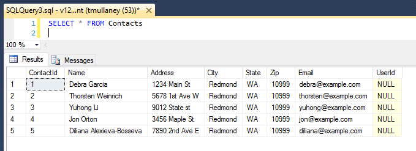

<properties
    pageTitle="Esercitazione: Web app con un database di multi-tenant utilizzando il Framework entità e protezione a livello di riga"
    description="Informazioni su come sviluppare un'app web ASP.NET MVC 5 con un tenant più Database di SQL backent, utilizzando il Framework entità e protezione a livello di riga."
  metaKeywords="azure asp.net mvc entity framework multi tenant row level security rls sql database"
    services="app-service\web"
    documentationCenter=".net"
    manager="jeffreyg"
  authors="tmullaney"/>

<tags
    ms.service="app-service-web"
    ms.workload="web"
    ms.tgt_pltfrm="na"
    ms.devlang="dotnet"
    ms.topic="article"
    ms.date="04/25/2016"
    ms.author="thmullan"/>

# <a name="tutorial-web-app-with-a-multi-tenant-database-using-entity-framework-and-row-level-security"></a>Esercitazione: Web app con un database di multi-tenant utilizzando il Framework entità e protezione a livello di riga

In questa esercitazione viene illustrato come creare un'app web multi-tenant con un modello di affitto "[database condiviso, schema condiviso](https://msdn.microsoft.com/library/aa479086.aspx)", utilizzando il Framework entità e [Protezione a livello di riga](https://msdn.microsoft.com/library/dn765131.aspx). In questo modello, un solo database contiene dati per molte tenant e ogni riga di ogni tabella è associato un "Tenant ID." Sicurezza a livello di riga (RLS), una nuova caratteristica per i Database di SQL Azure, viene utilizzata per impedire l'accesso ai dati di altro tenant. È necessario solo una singola, piccola modifica all'applicazione. Centralizzando la logica di accesso tenant interno del database, RLS semplifica il codice dell'applicazione e ridurre il rischio di perdita di dati accidentali tra tenant.

Iniziamo con l'applicazione Contact Manager semplici da [creare un'app MVP di ASP.NET con auth e DB SQL e distribuire al servizio App Azure](web-sites-dotnet-deploy-aspnet-mvc-app-membership-oauth-sql-database.md). Diritto a questo punto, l'applicazione consente tutti gli utenti (tenant) per visualizzare tutti i contatti:


Con pochi piccole modifiche, verrà aggiunto il supporto per più affitto, in modo che gli utenti possono vedere solo i contatti che appartengono a tali.

## <a name="step-1-add-an-interceptor-class-in-the-application-to-set-the-sessioncontext"></a>Passaggio 1: Aggiungere una classe intercettore nell'applicazione per impostare il SESSION_CONTEXT

Esiste una modifica dell'applicazione che è necessario apportare. Tutti gli utenti dell'applicazione di stabilire la connessione al database utilizzando la stessa stringa di connessione (ad esempio accesso SQL stessa), non è attualmente per un criterio di RLS utili cui deve filtrata per l'utente. Questo approccio è molto comune nelle applicazioni web perché consente efficiente pool di connessioni, ma significa che è necessario un altro modo per identificare l'utente dell'applicazione corrente all'interno del database. La soluzione consiste nel dispone dell'applicazione di impostare una coppia di chiave valore per l'ID utente corrente in [SESSION_CONTEXT](https://msdn.microsoft.com/library/mt590806) subito dopo l'apertura di una connessione prima dell'esecuzione delle query. SESSION_CONTEXT è un archivio di valore di chiave nell'ambito della sessione e l'informativa RLS utilizzerà l'ID utente in essa contenuto per identificare l'utente corrente.

Verrà aggiunto un [intercettore](https://msdn.microsoft.com/data/dn469464.aspx) (in particolare, un [DbConnectionInterceptor](https://msdn.microsoft.com/library/system.data.entity.infrastructure.interception.idbconnectioninterceptor)), una nuova caratteristica entità Framework (EF) 6, per impostare automaticamente l'ID utente corrente di SESSION_CONTEXT eseguendo un'istruzione SQL T ogni volta che EF apre una connessione.

1.  Aprire il progetto ContactManager in Visual Studio.
2.  Pulsante destro del mouse sulla cartella dei modelli in Esplora soluzioni e scegliere Aggiungi > classe.
3.  Denominare la nuova classe "SessionContextInterceptor.cs" e fare clic su Aggiungi.
4.  Sostituire il contenuto di SessionContextInterceptor.cs con il codice riportato di seguito.

```
using System;
using System.Collections.Generic;
using System.Linq;
using System.Web;
using System.Data.Common;
using System.Data.Entity;
using System.Data.Entity.Infrastructure.Interception;
using Microsoft.AspNet.Identity;

namespace ContactManager.Models
{
    public class SessionContextInterceptor : IDbConnectionInterceptor
    {
        public void Opened(DbConnection connection, DbConnectionInterceptionContext interceptionContext)
        {
            // Set SESSION_CONTEXT to current UserId whenever EF opens a connection
            try
            {
                var userId = System.Web.HttpContext.Current.User.Identity.GetUserId();
                if (userId != null)
                {
                    DbCommand cmd = connection.CreateCommand();
                    cmd.CommandText = "EXEC sp_set_session_context @key=N'UserId', @value=@UserId";
                    DbParameter param = cmd.CreateParameter();
                    param.ParameterName = "@UserId";
                    param.Value = userId;
                    cmd.Parameters.Add(param);
                    cmd.ExecuteNonQuery();
                }
            }
            catch (System.NullReferenceException)
            {
                // If no user is logged in, leave SESSION_CONTEXT null (all rows will be filtered)
            }
        }
        
        public void Opening(DbConnection connection, DbConnectionInterceptionContext interceptionContext)
        {
        }

        public void BeganTransaction(DbConnection connection, BeginTransactionInterceptionContext interceptionContext)
        {
        }

        public void BeginningTransaction(DbConnection connection, BeginTransactionInterceptionContext interceptionContext)
        {
        }

        public void Closed(DbConnection connection, DbConnectionInterceptionContext interceptionContext)
        {
        }

        public void Closing(DbConnection connection, DbConnectionInterceptionContext interceptionContext)
        {
        }

        public void ConnectionStringGetting(DbConnection connection, DbConnectionInterceptionContext<string> interceptionContext)
        {
        }

        public void ConnectionStringGot(DbConnection connection, DbConnectionInterceptionContext<string> interceptionContext)
        {
        }

        public void ConnectionStringSet(DbConnection connection, DbConnectionPropertyInterceptionContext<string> interceptionContext)
        {
        }

        public void ConnectionStringSetting(DbConnection connection, DbConnectionPropertyInterceptionContext<string> interceptionContext)
        {
        }

        public void ConnectionTimeoutGetting(DbConnection connection, DbConnectionInterceptionContext<int> interceptionContext)
        {
        }

        public void ConnectionTimeoutGot(DbConnection connection, DbConnectionInterceptionContext<int> interceptionContext)
        {
        }

        public void DataSourceGetting(DbConnection connection, DbConnectionInterceptionContext<string> interceptionContext)
        {
        }

        public void DataSourceGot(DbConnection connection, DbConnectionInterceptionContext<string> interceptionContext)
        {
        }

        public void DatabaseGetting(DbConnection connection, DbConnectionInterceptionContext<string> interceptionContext)
        {
        }

        public void DatabaseGot(DbConnection connection, DbConnectionInterceptionContext<string> interceptionContext)
        {
        }

        public void Disposed(DbConnection connection, DbConnectionInterceptionContext interceptionContext)
        {
        }

        public void Disposing(DbConnection connection, DbConnectionInterceptionContext interceptionContext)
        {
        }

        public void EnlistedTransaction(DbConnection connection, EnlistTransactionInterceptionContext interceptionContext)
        {
        }

        public void EnlistingTransaction(DbConnection connection, EnlistTransactionInterceptionContext interceptionContext)
        {
        }

        public void ServerVersionGetting(DbConnection connection, DbConnectionInterceptionContext<string> interceptionContext)
        {
        }

        public void ServerVersionGot(DbConnection connection, DbConnectionInterceptionContext<string> interceptionContext)
        {
        }

        public void StateGetting(DbConnection connection, DbConnectionInterceptionContext<System.Data.ConnectionState> interceptionContext)
        {
        }

        public void StateGot(DbConnection connection, DbConnectionInterceptionContext<System.Data.ConnectionState> interceptionContext)
        {
        }
    }

    public class SessionContextConfiguration : DbConfiguration
    {
        public SessionContextConfiguration()
        {
            AddInterceptor(new SessionContextInterceptor());
        }
    }
}
```

Che rappresenta la modifica di applicazione solo obbligatoria. Procedere e creare e pubblicare l'applicazione.

## <a name="step-2-add-a-userid-column-to-the-database-schema"></a>Passaggio 2: Aggiungere una colonna ID utente allo schema del database

È necessario aggiungere una colonna ID utente alla tabella Contacts da associare ogni riga di un utente (tenant). Si comporta la modifica dello schema direttamente nel database, in modo che non è necessario includere questo campo nel nostro modello di dati EF.

Connettersi al database direttamente con SQL Server Management Studio o Visual Studio e quindi eseguire T-SQL seguente:

```
ALTER TABLE Contacts ADD UserId nvarchar(128)
    DEFAULT CAST(SESSION_CONTEXT(N'UserId') AS nvarchar(128))
```

Una colonna ID utente verrà aggiunto alla tabella Contacts. Si usa il tipo di dati nvarchar (128) in modo che corrispondano ID utente archiviato nella tabella AspNetUsers e creazione di un vincolo predefinito che viene impostata automaticamente l'ID utente per le righe appena inserite sia l'ID utente memorizzata nel SESSION_CONTEXT.

A questo punto la tabella è simile alla seguente:



Quando vengono creati nuovi contatti, si verrà assegnati automaticamente l'ID utente corretto. Ai fini della demo, tuttavia, si assegnare alcuni di questi contatti esistenti a un utente esistente.

Se è stata creata alcuni utenti già dell'applicazione (ad esempio, usando locale, Google o Facebook account), sarà possibile visualizzarle nella tabella AspNetUsers. Nella figura seguente è un solo utente finora.


Copiare l'Id per user1@contoso.com, e incollarlo nell'istruzione Transact-SQL. Eseguire l'istruzione per associare tre dei contatti con l'ID utente.

```
UPDATE Contacts SET UserId = '19bc9b0d-28dd-4510-bd5e-d6b6d445f511'
WHERE ContactId IN (1, 2, 5)
```

## <a name="step-3-create-a-row-level-security-policy-in-the-database"></a>Passaggio 3: Creare criteri di sicurezza a livello di riga nel database

L'ultimo passaggio consiste nel creare criteri di sicurezza che utilizza l'ID utente SESSION_CONTEXT di filtrare automaticamente i risultati restituiti dalla query.

Mentre si è ancora connessi al database, eseguire il seguente T-SQL seguente:

```
CREATE SCHEMA Security
go

CREATE FUNCTION Security.userAccessPredicate(@UserId nvarchar(128))
    RETURNS TABLE
    WITH SCHEMABINDING
AS
    RETURN SELECT 1 AS accessResult
    WHERE @UserId = CAST(SESSION_CONTEXT(N'UserId') AS nvarchar(128))
go

CREATE SECURITY POLICY Security.userSecurityPolicy
    ADD FILTER PREDICATE Security.userAccessPredicate(UserId) ON dbo.Contacts,
    ADD BLOCK PREDICATE Security.userAccessPredicate(UserId) ON dbo.Contacts
go

```

Il codice consente di tre elementi. Innanzitutto, viene creato un nuovo schema come procedura consigliata per centralizzare e limitare l'accesso agli oggetti RLS. Successivamente, viene creata una funzione predicativa che restituirà "1" quando l'ID utente di una riga corrisponde all'ID utente in SESSION_CONTEXT. Infine, viene creato un criterio di sicurezza per aggiungere questa funzione come predicato un filtro e di blocco della tabella di contatti. Il predicato del filtro determina le query restituire solo le righe che appartengono all'utente corrente predicato blocco rappresenta una misura per impedire che l'applicazione mai accidentalmente l'inserimento di una riga per l'utente non corretto.

Eseguire l'applicazione e accedere come user1@contoso.com. Questo utente viene visualizzata solo i contatti sono assegnati in precedenza per l'ID utente:


Per convalidare questa ulteriormente, eseguire la registrazione di un nuovo utente. Perché non sono stati assegnati a tali non vedranno alcun contatto. Se si crea un nuovo contatto, verranno assegnata a tali e solo sarà in grado di visualizzarlo.

## <a name="next-steps"></a>Passaggi successivi

Questo è tutto! Il semplice Contact Manager web app è stato convertito in un tenant più uno in ogni utente è il proprio elenco contatti. Utilizzando la protezione a livello di riga, sono state evitare la complessità della imposte logica di accesso ai tenant nel codice dell'applicazione. Questa trasparenza consente all'applicazione di focalizzare l'attenzione sul problema aziendale reale portata di mano ed e ridurre i rischi di passi accidentalmente i dati come l'applicazione di base di codici del cresce.

In questa esercitazione è solo le caratteristiche principali di ciò che è possibile con RLS. Ad esempio, è possibile avere più sofisticate o logica di accesso granulare e i dati del possibile memorizzare oltre l'ID utente corrente nel SESSION_CONTEXT. È anche possibile integrare [RLS alle librerie di database flessibile strumenti client](../sql-database/sql-database-elastic-tools-multi-tenant-row-level-security.md) per supportare shards multi-tenant in un livello di dati di scalabilità.

Oltre a tali possibilità, ci stiamo impegnando anche per rendere RLS ancora meglio. Se hai domande, idee o elementi che si desidera visualizzare, indicare nei commenti. Grazie per il feedback!
