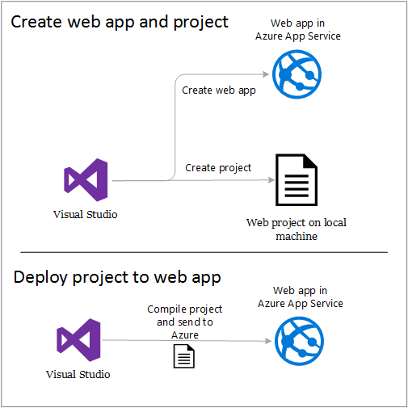
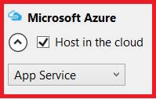
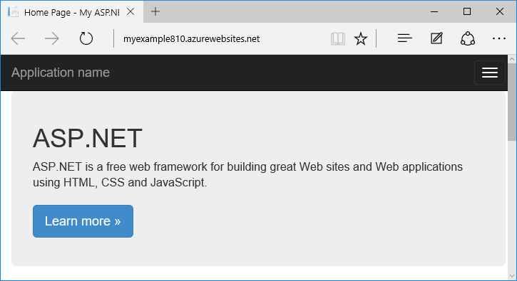

<properties
    pageTitle="Distribuire un'app ASP.NET al servizio di App Azure utilizzando Visual Studio | Microsoft Azure"
    description="Informazioni su come distribuire un progetto web ASP.NET in una nuova app web nel servizio App Azure utilizzando Visual Studio."
    services="app-service\web"
    documentationCenter=".net"
    authors="tdykstra"
    manager="wpickett"
    editor=""/>

<tags
    ms.service="app-service-web"
    ms.workload="web"
    ms.tgt_pltfrm="na"
    ms.devlang="dotnet"
    ms.topic="get-started-article"
    ms.date="07/22/2016"
    ms.author="rachelap"/>

# Distribuire un'app web ASP.NET al servizio App Azure tramite Visual Studio

[AZURE.INCLUDE [tabs](../../includes/app-service-web-get-started-nav-tabs.md)]

## Panoramica

In questa esercitazione viene illustrato come distribuire un'applicazione web ASP.NET per un' [app web nel servizio App Azure](app-service-web-overview.md) utilizzando Visual Studio 2015.

L'esercitazione presuppone che uno sviluppatore ASP.NET chi non ha alcuna esperienza con l'uso di Azure. Al termine, sarà necessario un'applicazione web semplice alto e in esecuzione nel cloud.

Si apprenderanno:

* Come creare una nuova app web App servizio durante la creazione di un nuovo progetto web in Visual Studio.
* Come distribuire un progetto web a un'applicazione servizio web app tramite Visual Studio.

Nel diagramma viene illustrato cosa nell'esercitazione.

Al termine dell'esercitazione, una sezione di [risoluzione dei problemi](#troubleshooting) offre idee su cosa fare se qualcosa non funziona e una sezione [passaggi successivi](#next-steps) vengono forniti collegamenti ad altre esercitazioni che illustrano in modo più approfondito sull'utilizzo del servizio di Azure App.

Poiché si tratta di un'esercitazione Introduzione a project web che viene illustrato come distribuire è semplice che non viene utilizzato un database e non eseguire l'autenticazione o un'autorizzazione. Per i collegamenti ad argomenti di distribuzione più avanzati, vedere [come distribuire un'app web Azure](web-sites-deploy.md).

Oltre il tempo necessario per installare Azure SDK per .NET, questa esercitazione richiederà circa 10-15 minuti per completare.

## Prerequisiti di

* L'esercitazione si presuppone che si è lavorato con MVC ASP.NET e Visual Studio. Se è necessaria un'introduzione, vedere [Introduzione a ASP.NET MVC 5](http://www.asp.net/mvc/overview/getting-started/introduction/getting-started).

* È necessario un account Azure. È possibile [aprire un account Azure gratuito](/pricing/free-trial/?WT.mc_id=A261C142F) o [vantaggi sottoscrittore attivare Visual Studio](/pricing/member-offers/msdn-benefits-details/?WT.mc_id=A261C142F). 

    Se si desidera iniziare a usare il servizio di App Azure prima che si effettua l'iscrizione per un account Azure, accedere al [Servizio di App provare](http://go.microsoft.com/fwlink/?LinkId=523751). Vi è possibile creare un'app starter breve nel servizio di App, ovvero non carta di credito necessari e non impegni.

## Configurare l'ambiente di sviluppo

L'esercitazione è stato scritto per Visual Studio 2015 con [Azure SDK per .NET](../dotnet-sdk.md) 2,9 o versione successiva. 

* [Scaricare la versione più recente di Azure SDK Visual Studio 2015](http://go.microsoft.com/fwlink/?linkid=518003). Se non si dispone già, SDK viene installato Visual Studio 2015.

    >[AZURE.NOTE] A seconda di quante delle dipendenze SDK già presenti nel computer in uso, installare il SDK potrebbe richiedere molto tempo, da alcuni minuti a mezz'ora o più.

Se si preferisce utilizzare che installato Visual Studio 2013, è possibile [scaricare il più recente di Azure SDK Visual Studio 2013](http://go.microsoft.com/fwlink/?LinkID=324322). Alcune schermate potrebbero apparire diversi da quelli illustrati.

## Configurare un nuovo progetto web

Il passaggio successivo consiste nel creare un progetto web in Visual Studio e un'app web nel servizio App Azure. In questa sezione dell'esercitazione configurare il nuovo progetto web. 

1. Aprire Visual Studio 2015.

2. Fare clic su **File > Nuovo > progetto**.

3. Nella finestra di dialogo **Nuovo progetto** , fare clic su **c# > Web > applicazione Web ASP.NET**.

3. Assicurarsi che sia selezionato **.NET Framework 4.5.2** come il framework di destinazione.

4.  [Informazioni dettagliate sui applicazione Azure](../application-insights/app-insights-overview.md) esegue il monitoraggio dell'app web per la disponibilità, prestazioni e l'uso. Da ora predefinita la prima che si crea un progetto web dopo l'installazione di Visual Studio sia selezionata la casella di controllo **Aggiungi approfondimenti applicazione al progetto** . Deselezionare la casella di controllo se è selezionata, ma non si vuole provare approfondimenti applicazione.

4. Assegnare un nome applicazione **MyExample**e quindi fare clic su **OK**.

    

5. Nella finestra di dialogo **Nuovo progetto ASP.NET** selezionare il modello **MVC** e quindi fare clic su **Modifica autenticazione**.

    Per questa esercitazione si distribuisce un progetto web MVC ASP.NET. Se si vuole informazioni su come distribuire un progetto API Web ASP.NET, vedere la sezione [passaggi successivi](#next-steps) . 

    

6. Nella finestra di dialogo **Modifica autenticazione** , fare clic su **Nessuna autenticazione**e quindi fare clic su **OK**.

    

    Per questa esercitazione Guida introduttiva si distribuisce una semplice applicazione che non si log aggiuntivo utente.

5. Nella sezione **Microsoft Azure** della finestra di dialogo **Nuovo progetto ASP.NET** , assicurarsi che sia selezionata **ospitato nel cloud** e che **Il servizio di App** sia selezionata nell'elenco a discesa.

    

    Queste impostazioni dirette Visual Studio per creare un'app web Azure per il progetto web.

6. Fare clic su **OK**

## Configurare le risorse Azure per una nuova app web

Ora informare Visual Studio sulle risorse Azure che si desidera creare.

5. Nella finestra di dialogo **Crea App servizio** , fare clic su **Aggiungi un account**ed effettuare l'accesso a Azure con l'ID e la password dell'account che consente di gestire l'abbonamento Azure.

    

    Se già stato effettuato l'accesso in precedenza nello stesso computer, pulsante **Aggiungi un account** potrebbe non essere visibile. In questo caso, è possibile ignorare questo passaggio o potrebbe essere necessario reimmettere le credenziali.
 
3. Immettere un **Nome di applicazione Web** che sia univoco nel dominio di *azurewebsites.net* . Ad esempio, è possibile denominarlo MyExample con numeri a destra per renderlo univoco, ad esempio MyExample810. Se viene creato un nome web predefinito, è possibile usare sia univoco.

    Se qualcuno abbia già usato il nome immesso, viene visualizzato un punto esclamativo rosso a destra anziché un segno di spunta verde ed è necessario immettere un nome diverso.

    L'URL per l'applicazione è il nome e *. azurewebsites.net*. Se, ad esempio, il nome è `MyExample810`, l'URL è `myexample810.azurewebsites.net`.

    È anche possibile usare un dominio personalizzato con un'app web Azure. Per ulteriori informazioni, vedere [configurare un nome di dominio personalizzato in Azure App servizio](web-sites-custom-domain-name.md).

6. Fare clic sul pulsante **Nuovo** accanto alla casella di **Gruppo di risorse** e quindi immettere "MyExample" o un altro nome se si preferisce. 

    

    Un gruppo di risorse è una raccolta di risorse Azure, ad esempio web apps, database e macchine virtuali. Per un'esercitazione, è preferibile in genere creare un nuovo gruppo di risorse perché che consente di eliminare in un unico passaggio tutte le risorse Azure creati per l'esercitazione facilmente. Per ulteriori informazioni, vedere [Panoramica di gestione di risorse Azure](../azure-resource-manager/resource-group-overview.md).

4. Fare clic sul pulsante **Nuovo** accanto al **Piano di servizio App** elenco a discesa.

    

    Verrà visualizzata la finestra di dialogo **Configura piano di servizio App** .

    

    Nei passaggi seguenti, è possibile configurare un piano di servizio di App per il nuovo gruppo di risorse. Un piano di servizio App specifica le risorse di elaborazione utilizzabile con l'app web. Ad esempio, se si sceglie il livello gratuito, l'app API viene eseguito in macchine virtuali condivise, mentre per alcuni livelli pagati viene eseguito in macchine virtuali dedicate. Per ulteriori informazioni, vedere [Panoramica sul piano servizio App](../app-service/azure-web-sites-web-hosting-plans-in-depth-overview.md).

5. Nella finestra di dialogo **Configura piano di servizio App** immettere "MyExamplePlan" o un altro nome se si preferisce.

5. Nella casella **percorso** scegliere la posizione più vicina all'utente.

    Questa impostazione specifica quali Azure Data Center l'app viene eseguito in. Per questa esercitazione, è possibile selezionare le opzioni internazionali e non è possibile fare la differenza più evidente. Ma per un'app di produzione, il server sia il più vicino possibile ai client che esegue l'accesso, per limitare la [latenza](http://www.bing.com/search?q=web%20latency%20introduction&qs=n&form=QBRE&pq=web%20latency%20introduction&sc=1-24&sp=-1&sk=&cvid=eefff99dfc864d25a75a83740f1e0090).

5. Nell'elenco a discesa **dimensione** fare clic su **gratuito**.

    Per questa esercitazione, il livello di prezzo gratuito fornirà buona sufficiente.

6. Nella finestra di dialogo **Configura piano di servizio App** , fare clic su **OK**.

7. Nella finestra di dialogo **Crea App servizio** fare clic su **Crea**.

## Visual Studio crea il progetto e web app

In breve, in genere inferiore a un minuto, verrà creato il progetto web e web app.  

La finestra **Esplora** Mostra file e cartelle nel nuovo progetto.

La finestra di **Azure App servizio attività** mostra che il web app è stato creato.

Finestra di **Esplora risorse Cloud** consente di visualizzare e gestire le risorse Azure, tra cui la nuova app web appena creata.

    
## Distribuire il progetto web per l'applicazione web Azure

In questa sezione, si distribuisce il progetto web in web app.

1. In **Esplora soluzioni**fare clic sul progetto e scegliere **pubblica**.

    

    In pochi secondi, verrà visualizzata la creazione guidata **Pubblicazione Web** . Verrà visualizzata la procedura guidata per un *profilo di pubblicazione* con le impostazioni per la distribuzione del progetto web per la nuova app web.

    Il profilo di pubblicazione include un nome utente e password per la distribuzione.  Le credenziali sono state generate automaticamente e non è necessario immetterli. La password crittografata in un file specifici dell'utente nascosto nel `Properties\PublishProfiles` cartella.
 
8. Nella scheda **connessione** della creazione guidata **Pubblicazione Web** , fare clic su **Avanti**.

    

    È quindi sulla scheda **Impostazioni** . Qui è possibile modificare la configurazione di compilazione per distribuire una build di debug per [il debug remoto](../app-service-web/web-sites-dotnet-troubleshoot-visual-studio.md#remotedebug). La scheda offre diverse [Opzioni di pubblicazione di File](https://msdn.microsoft.com/library/dd465337.aspx#Anchor_2).

10. Nella scheda **Impostazioni** fare clic su **Avanti**.

    

    La scheda **Preview** è successiva. Di seguito è la possibilità di vedere ai file che si desidera venga copiato dal progetto app API. Quando si distribuisce un progetto a un'app di API che già distribuito in precedenza, vengono copiati solo i file modificati. Se si vuole visualizzare un elenco di informazioni verranno copiate, è possibile fare clic sul pulsante **Start anteprima** .

11. Nella scheda **Anteprima** , fare clic su **pubblica**.

    

    Quando si fa clic su **pubblica**, Visual Studio avvia il processo di copia dei file nel server Azure. L'operazione potrebbe richiedere un o due minuti.

    Windows **Azure App servizio attività** e di **Output** Mostra le azioni di distribuzione eseguite e inviare una segnalazione completamento della distribuzione.

    

    Durante la distribuzione ha esito positivo, il browser predefinito viene aperto automaticamente all'URL dell'applicazione web distribuita e l'applicazione creata è in esecuzione nel cloud. L'URL nella barra degli indirizzi del browser Mostra l'applicazione web viene caricato da Internet.

    

    > [AZURE.TIP]È possibile abilitare la barra degli strumenti **Web-pubblicazione con un clic** per la distribuzione rapida. Fare clic su **Visualizza > barre degli strumenti**e quindi selezionare **Web-pubblicazione con un clic**. È possibile utilizzare la barra degli strumenti per selezionare un profilo, fare clic su un pulsante per la pubblicazione o fare clic su un pulsante per aprire la creazione guidata **Pubblicazione Web** .
    > 

## Risoluzione dei problemi

Se si verificano problemi durante l'analisi in questa esercitazione, assicurarsi che si sta usando la versione più recente di Azure SDK per .NET. Il modo più semplice consiste nel [scaricare Azure SDK per Visual Studio 2015](http://go.microsoft.com/fwlink/?linkid=518003). Se si dispone della versione corrente installata, il programma di installazione di piattaforma Web segnala che non è necessaria.

Se si usa una rete aziendale e sta tentando di distribuzione al servizio App Azure attraverso un firewall, verificare che le porte 443 e 8172 sono aperte per la distribuzione Web. Se non è possibile aprire le porte, vedere la sezione procedura successiva seguenti per altre opzioni di distribuzione.

Dopo avere un'applicazione web ASP.NET in esecuzione in Azure App servizio, è consigliabile per altre informazioni sulle caratteristiche di Visual Studio che semplificano la risoluzione dei problemi. Per informazioni sulla registrazione, il debug remoto e altre informazioni, vedere [risoluzione dei problemi di Azure web App in Visual Studio](web-sites-dotnet-troubleshoot-visual-studio.md).

## Passaggi successivi

In questa esercitazione, è stato illustrato come creare un'applicazione web semplice e distribuire un'app web Azure. Ecco alcuni argomenti correlati e risorse utili per ottenere ulteriori informazioni sul servizio App Azure:

* Monitorare e gestire applicazioni web nel [portale di Azure](https://portal.azure.com/). 

    Per ulteriori informazioni, vedere [Panoramica del portale di Azure](/services/management-portal/) e [Configura web apps in Azure App servizio](web-sites-configure.md).

* Distribuire un progetto web esistente in una nuova app web utilizzando Visual Studio

    Fare clic sul progetto in **Esplora soluzioni**e quindi fare clic su **pubblica**. Scegliere il **Servizio di Microsoft Azure App** come destinazione pubblica e quindi fare clic su **Nuovo**. Le finestre di dialogo corrispondono quindi ai quali è stato illustrato in questa esercitazione.

* Distribuire un progetto web dal controllo origine

    Per informazioni sulla [distribuzione di automazione](http://www.asp.net/aspnet/overview/developing-apps-with-windows-azure/building-real-world-cloud-apps-with-windows-azure/continuous-integration-and-continuous-delivery) da un [controllo del codice sorgente](http://www.asp.net/aspnet/overview/developing-apps-with-windows-azure/building-real-world-cloud-apps-with-windows-azure/source-control), vedere [Guida introduttiva a App web di servizio App Azure](app-service-web-get-started.md) e su [come distribuire un'app web Azure](web-sites-deploy.md).

* Distribuire un'app API nel servizio App Azure dell'API Web ASP.NET

    È stato illustrato come creare un'istanza del servizio di App Azure destinati principalmente per ospitare un sito Web. Servizio di App offre funzionalità per l'hosting API Web, come il supporto CORS e il supporto di metadati API per la generazione del codice client. È possibile usare le funzionalità delle API in un'app web, ma se si desidera principalmente ospitare una API in un'istanza del servizio di App, un' **app API** sarebbe la scelta migliore. Per ulteriori informazioni, vedere [Introduzione all'API App e ASP.NET in Azure App servizio](../app-service-api/app-service-api-dotnet-get-started.md). 

* Aggiungere un nome di dominio personalizzato e SSL

    Per informazioni sull'utilizzo di SSL e il proprio dominio (ad esempio, www.contoso.com anziché contoso.azurewebsites.net), vedere le risorse seguenti:

    * [Configurare un nome di dominio personalizzato nel servizio di App Azure](web-sites-custom-domain-name.md)
    * [Abilitare HTTPS per un sito Web di Azure](web-sites-configure-ssl-certificate.md)

* Eliminare il gruppo di risorse che contiene un'app web e tutte le risorse di Azure correlate al termine con loro.

    Per informazioni sull'uso dei gruppi di risorse nel portale di Azure, vedere [risorse di distribuzione con Azure portale e modelli di Manager delle risorse](../resource-group-template-deploy-portal.md).   

*   Per altri esempi di creazione di un'applicazione Web ASP.NET nel servizio di App, vedere [creare e distribuire un'app web ASP.NET nel servizio App Azure](https://github.com/Microsoft/HealthClinic.biz/wiki/Create-and-deploy-an-ASP.NET-web-app-in-Azure-App-Service) e [creare e distribuire un'app per dispositivi mobili in Azure App servizio](https://github.com/Microsoft/HealthClinic.biz/wiki/Create-and-deploy-a-mobile-app-in-Azure-App-Service) da [HealthClinic.biz](https://github.com/Microsoft/HealthClinic.biz) 2015 Connetti [demo](https://blogs.msdn.microsoft.com/visualstudio/2015/12/08/connectdemos-2015-healthclinic-biz/). Per altre guide rapide dal demo HealthClinic.biz, vedere [Guide rapide strumenti di sviluppo di Azure](https://github.com/Microsoft/HealthClinic.biz/wiki/Azure-Developer-Tools-Quickstarts).
