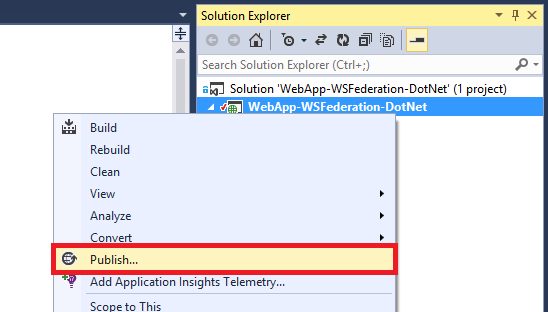
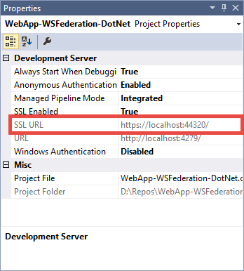
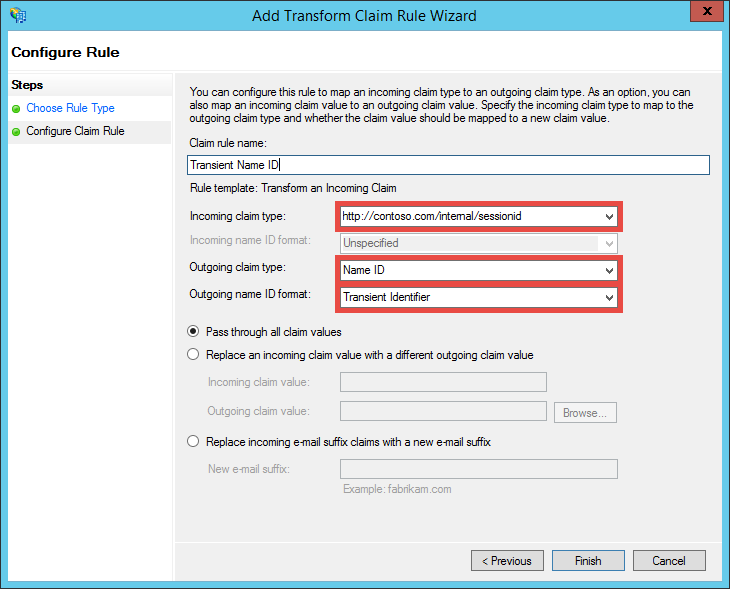
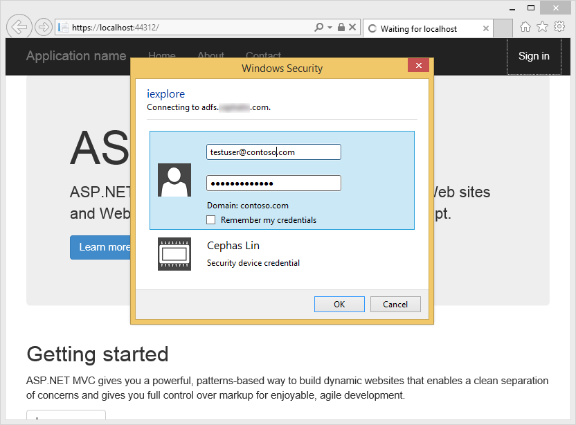
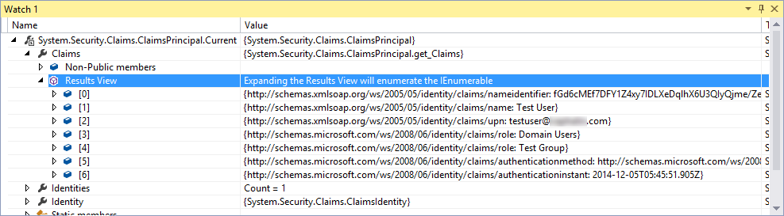
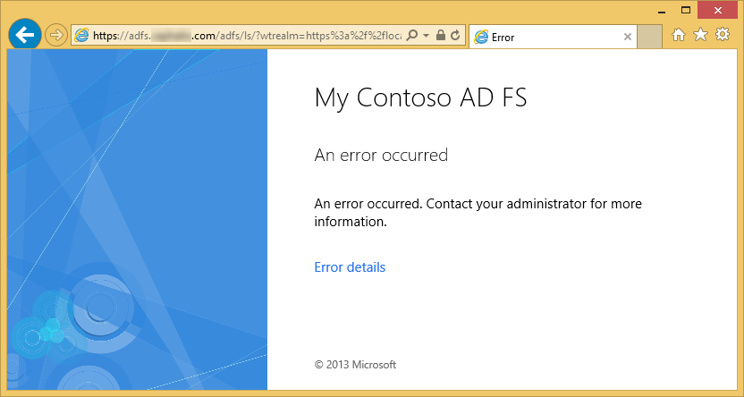

<properties 
    pageTitle="Creare un'app di Azure line-of-business con l'autenticazione di ADFS | Microsoft Azure" 
    description="Informazioni su come creare un'applicazione line-of-business in Azure App servizio per l'autenticazione con servizio token di sicurezza locale. In questa esercitazione è destinato a ADFS come servizio token di sicurezza locale." 
    services="app-service\web" 
    documentationCenter=".net" 
    authors="cephalin" 
    manager="wpickett" 
    editor=""/>

<tags 
    ms.service="app-service-web" 
    ms.devlang="dotnet" 
    ms.topic="article" 
    ms.tgt_pltfrm="na" 
    ms.workload="web" 
    ms.date="08/31/2016" 
    ms.author="cephalin"/>

# Creare un'app di Azure line-of-business con l'autenticazione di ADFS

In questo articolo viene illustrato come creare un'applicazione line-of-business Asp.net nel [Servizio di App Azure](../app-service/app-service-value-prop-what-is.md) utilizzano un locale [Active Directory Federation Services](http://technet.microsoft.com/library/hh831502.aspx) come provider di identità. Questo scenario è possibile utilizzare quando si desidera creare applicazioni line-of-business in Azure App servizio ma l'organizzazione richiede dati di directory da archiviare sul posto.

>[AZURE.NOTE] Per una panoramica delle opzioni dell'organizzazione diverso autenticazione e l'autorizzazione per il servizio App Azure, vedere [autentica con Active Directory locale nell'app Azure](web-sites-authentication-authorization.md).

## Si creerà ##

Si creerà un'applicazione di ASP.NET base di Azure App servizio Web Apps con le caratteristiche seguenti:

- Autentica gli utenti in ADFS
- Usa `[Authorize]` per autorizzare gli utenti per diverse azioni
- Configurazione statica per il debug in Visual Studio e pubblicare App servizio Web Apps (configurare una sola volta, eseguire il debug e pubblicare in qualsiasi momento)  

## È necessario ##

[AZURE.INCLUDE [free-trial-note](../../includes/free-trial-note.md)]

È necessario per completare l'esercitazione:

- Un locale distribuzione ADFS (per una procedura dettagliata-to-end del laboratorio di prova utilizzato in questa esercitazione, vedere [laboratorio di verifica: servizio token di sicurezza autonoma con ADFS in macchine Virtuali di Azure (solo per test)](https://blogs.msdn.microsoft.com/cephalin/2014/12/21/test-lab-standalone-sts-with-ad-fs-in-azure-vm-for-test-only/))
- Autorizzazioni per creare basarsi di terze parti trust di Active Directory ADFS Management
- Aggiornamento di Visual Studio 2013 4 o versione successiva
- [Azure SDK 2.8.1](http://go.microsoft.com/fwlink/p/?linkid=323510&clcid=0x409) o versioni successive

## Usare l'applicazione di esempio per modello line-of-business ##

Applicazione di esempio in questa esercitazione [DotNet di WSFederation Web App)](https://github.com/AzureADSamples/WebApp-WSFederation-DotNet), viene creato dal team di Azure Active Directory. Poiché ADFS supporta la federazione WS, è possibile utilizzare come modello per creare applicazioni line-of-business con facilità. Presenta le caratteristiche seguenti:

- Utilizza [La federazione WS](http://msdn.microsoft.com/library/bb498017.aspx) per eseguire l'autenticazione con un locale la distribuzione di ADFS
- Funzionalità di accesso e disconnessione
- Utilizza [Microsoft.Owin](http://www.asp.net/aspnet/overview/owin-and-katana/an-overview-of-project-katana) (anziché Windows Identity Foundation), ovvero future di ASP.NET e molto più semplice da configurare per l'autenticazione e l'autorizzazione di WIF

## Configurare l'applicazione di esempio ##

2.  Duplicare o scaricare la soluzione di esempio in [Web App-WSFederation-DotNet](https://github.com/AzureADSamples/WebApp-WSFederation-DotNet) alla directory locale.

    > [AZURE.NOTE] Le istruzioni disponibili in [README.md](https://github.com/AzureADSamples/WebApp-WSFederation-DotNet/blob/master/README.md) viene illustrato come configurare l'applicazione con Azure Active Directory. Ma in questa esercitazione, è stata configurata con ADFS, pertanto seguire invece la procedura di seguito.

3.  Aprire la soluzione e quindi aprire Controllers\AccountController.cs in **Esplora soluzioni**.

    Si noterà che il codice problemi semplicemente una richiesta di autenticazione per eseguire l'autenticazione dell'utente utilizzando WS-Federation. Autenticazione tutti è configurata in App_Start\Startup.Auth.cs.

4.  Aprire App_Start\Startup.Auth.cs. Nel `ConfigureAuth` metodo, prendere nota della riga:

        app.UseWsFederationAuthentication(
            new WsFederationAuthenticationOptions
            {
                Wtrealm = realm,
                MetadataAddress = metadata                                      
            });

    Nel mondo OWIN questo frammento di codice è la procedura minima che è necessario configurare l'autenticazione WS-Federation. È molto più semplice ed elegante rispetto WIF, in cui config viene inserito con XML in tutto il luogo. Solo le informazioni necessarie sono il componente di applicazione (RP) identificatore e l'URL del file di metadati del servizio ADFS. Ecco un esempio:

    -   Identificatore RP:`https://contoso.com/MyLOBApp`
    -   Indirizzo dei metadati:`http://adfs.contoso.com/FederationMetadata/2007-06/FederationMetadata.xml`

5.  In App_Start\Startup.Auth.cs, modificare le definizioni di stringa statica seguenti:  
    <pre class="prettyprint">
    area di autenticazione privato stringa statica = ConfigurationManager.AppSettings["ida:<mark>RPIdentifier</mark>"]; <mark><del>stringa statica privata aadInstance = ConfigurationManager.AppSettings["ida:AADInstance"];</del></mark> 
     <mark><del>tenant privato stringa statica = ConfigurationManager.AppSettings["ida:Tenant"];</del></mark> 
     <mark><del>stringa statica privata metadati = stringa. Formato ("{0} / {1 \ /federationmetadata/2007-06/federationmetadata.xml", aadInstance, tenant);</del></mark> 
     <mark>stringa statica privata metadati = stringa. Formato ("https:// {0} /federationmetadata/2007-06/federationmetadata.xml", ConfigurationManager.AppSettings["ida:ADFS"]);</mark>

    <mark><del>stringa autorità = Format (InvariantCulture, aadInstance, tenant);</del></mark>
    </pre>

6.  A questo punto, apportare le modifiche corrispondenti in config. Aprire il Web. config e modificare le impostazioni di app seguenti:  
    <pre class="prettyprint">
    &lt;appSettings&gt;
    &lt;add key="webpages:Version" value="3.0.0.0" /&gt;
    &lt;add key="webpages:Enabled" value="false" /&gt;
    &lt;add key="ClientValidationEnabled" value="true" /&gt;
    &lt;add key="UnobtrusiveJavaScriptEnabled" value="true" /&gt;
      <mark><del>&lt;add key="ida:Wtrealm" value="[Enter the App ID URI of WebApp-WSFederation-DotNet https://contoso.onmicrosoft.com/WebApp-WSFederation-DotNet]" /&gt;</del></mark>
      <mark><del>&lt;add key="ida:AADInstance" value="https://login.windows.net" /&gt;</del></mark>
      <mark><del>&lt;add key="ida:Tenant" value="[Enter tenant name, e.g. contoso.onmicrosoft.com]" /&gt;</del></mark>
      <mark>&lt;add key="ida:RPIdentifier" value="[Enter the relying party identifier in base alla configurazione di ADFS, ad esempio https://localhost:44320 /] "/&gt;</mark>
      <mark>&lt;aggiungere chiave = valore"ida: ADFS"="[Immettere il nome di dominio completo del servizio di ADFS, ad esempio adfs.contoso.com]"/&gt; </mark>        

    &lt;/appSettings&gt;
    </pre>

    Immettere i valori di chiave nel proprio ambiente rispettivo.

7.  Creare l'applicazione per assicurarsi che non siano presenti errori.

Questo è tutto. A questo punto l'applicazione di esempio è pronto per l'uso con ADFS. È comunque necessario configurare un trust RP con questa applicazione in ADFS in un secondo momento.

## Distribuire l'applicazione di esempio per Azure App servizio Web Apps

In questo caso, pubblicare un'applicazione di un'app web nell'applicazione del servizio Web Apps mantenendo l'ambiente di debug. Si noti che si intende pubblicare l'applicazione prima di disporre di un trust RP con ADFS, per consentire l'autenticazione non funziona ancora. Tuttavia, se si a questo punto si può avere l'URL web app che è possibile utilizzare per configurare la protezione RP in un secondo momento.

1. Il pulsante destro del progetto e selezionare **pubblica**.

    

2. Selezionare **Microsoft Azure App servizio**.
3. Se è stato ancora effettuato l'accesso a Azure, fare clic su **Accedi** e usare l'account Microsoft per l'abbonamento Azure ad per accedere.
4. Dopo aver effettuato l'accesso, fare clic su **Nuovo** per creare un'app web.
5. Compilare tutti i campi obbligatori. Si sta per connettersi a un'istanza locale dati in un secondo momento, in modo che non lo si crea un database per questa applicazione web.

    

6. Fare clic su **Crea**. Dopo aver creato il web app, viene aperta la finestra di dialogo Pubblica sito Web.
7. **URL di destinazione**, modificare **http** a **https**. Copiare l'intero URL in un editor di testo per successivi utilizzi. Quindi fare clic su **pubblica**.

    

11. In Visual Studio, aprire **Web.Release.config** nel progetto. Inserire il seguente codice XML nel `<configuration>` tag e sostituire il valore di chiave con l'URL dell'applicazione web pubblica.  
    <pre class="prettyprint">
&lt;appSettings&gt;
   &lt;aggiungere chiave = valore "ida: RPIdentifier" = "<mark>[ad esempio https://mylobapp.azurewebsites.net/]</mark>" xdt: Transform = "SetAttributes" xdt:Locator="Match(key)" /&gt;
&lt;/appSettings&gt;</pre>

Al termine, è necessario due identificatori RP configurati nel progetto, uno per l'ambiente di debug in Visual Studio e uno per l'app web pubblicato in Azure. Configurerà un trust RP per ognuna delle due ambienti ADFS. Durante il debug, le impostazioni di app config vengono utilizzate per definire una configurazione **Debug** lavorare con ADFS. Quando la pubblicazione (per impostazione predefinita, la configurazione di **rilascio** è pubblicata), viene caricato un config trasformato che include l'impostazione cambia app Web.Release.config.

Se si desidera allegare l'app web pubblicato in Azure per verrà (ad esempio, è necessario caricare simboli di debug del codice nell'app web pubblicato), è possibile creare un duplicato della configurazione di Debug per il debug di Azure, ma con il proprio trasformazione config personalizzata (ad esempio Web.AzureDebug.config) che utilizza le impostazioni di app da Web.Release.config. In questo modo è possibile mantenere una configurazione statica in ambienti diversi.

## Configurare l'attendibilità di terze parti componente AD FS gestione ##

A questo punto è necessario configurare un trust RP AD FS gestione prima di poter usare l'applicazione di esempio ed effettivamente eseguire l'autenticazione di ADFS. È necessario configurare due trust RP separato, uno per l'ambiente di debug e uno per un'app web pubblicato.

> [AZURE.NOTE] Assicurarsi che ripetere la procedura seguente per entrambi gli ambienti.

4.  Nel server ADFS, accedere con le credenziali di gestione di diritti di ADFS.
5.  Aprire Gestione ADFS Active Directory. Pulsante destro del mouse **e trust di Active Directory FS\Trusted Relationships\Relying festa** e selezionare **Aggiungi attendibile di terze parti che si basa**.

    

5.  Nella pagina **Seleziona origine dati** selezionare **immettere manualmente i dati relativi componente**. 

    

6.  Nella pagina **Specifica nome visualizzato** digitare un nome per l'applicazione e fare clic su **Avanti**.
7.  Nella pagina **Scegliere protocollo** , fare clic su **Avanti**.
8.  Nella pagina **Configura certificato** , fare clic su **Avanti**.

    > [AZURE.NOTE] Poiché si deve utilizzando HTTPS già, i token crittografati sono facoltativi. Se si desidera crittografare i token da ADFS in questa pagina, è necessario aggiungere anche decrittografia token logica nel codice. Per ulteriori informazioni, vedere [configurazione manuale OWIN WS-Federation middleware e accettare i token crittografati](http://chris.59north.com/post/2014/08/21/Manually-configuring-OWIN-WS-Federation-middleware-and-accepting-encrypted-tokens.aspx).
  
5.  Prima di spostare il passaggio successivo, è necessario un'informazione dal progetto di Visual Studio. Nelle proprietà del progetto, prendere nota dell' **URL SSL** dell'applicazione. 

    

6.  In Gestione di ADFS Active Directory, nella pagina **Configura URL** di **Aggiungere basarsi guidata attendibilità**selezionare **attivare il supporto per il protocollo WS-Federation passivo** e digitare l'URL SSL del progetto di Visual Studio annotato al passaggio precedente. Scegliere **Avanti**.

    

    > [AZURE.NOTE] URL specifica la posizione in cui inviare il client dopo avere stabilito l'autenticazione. Per l'ambiente di debug, deve essere <code>https://localhost:&lt;port&gt;/</code>. Per l'app web pubblicato dovrebbe essere URL web app.

7.  Nella pagina **Configura identificatori** , verificare che il progetto SSL URL è già presente e fare clic su **Avanti**. Fare clic su **Avanti** fino alla fine della procedura guidata con le selezioni predefinite.

    > [AZURE.NOTE] Nella App_Start\Startup.Auth.cs del progetto di Visual Studio, questo identificatore corrisponde rispetto al valore di <code>WsFederationAuthenticationOptions.Wtrealm</code> durante l'autenticazione federati. Per impostazione predefinita, l'URL dell'applicazione del passaggio precedente viene aggiunto come un identificatore RP.

8.  È stata completata la configurazione dell'applicazione RP per il progetto in ADFS. Configurare quindi questa applicazione per l'invio delle attestazioni necessari per l'applicazione. Finestra di dialogo **Modifica regole attestazione** verrà aperto per impostazione predefinita per alla fine della procedura guidata in modo che è possibile iniziare immediatamente. Di seguito configurare almeno sulle attestazioni seguenti (con schemi tra parentesi):

    -   Nome (http://schemas.xmlsoap.org/ws/2005/05/identity/claims/name) - utilizzato da ASP.NET per idrato `User.Identity.Name`.
    -   Nome dell'entità utente (http://schemas.xmlsoap.org/ws/2005/05/identity/claims/upn) - utilizzato per identificare gli utenti dell'organizzazione.
    -   Appartenenze ai ruoli (http://schemas.microsoft.com/ws/2008/06/identity/claims/role) - può essere utilizzata con `[Authorize(Roles="role1, role2,...")]` decorazione per autorizzare controller/azioni. In realtà, questo approccio potrebbe non essere efficienti la maggior parte delle autorizzazioni dei ruoli. Se gli utenti di Active Directory appartengono a centinaia di gruppi di sicurezza, diventano centinaia di richieste di ruolo nel token SAML. In alternativa consiste nell'inviare una richiesta di singolo ruolo in modo condizionale a seconda di appartenenza dell'utente in un determinato gruppo. Tuttavia, è necessario lasciarla invariata per semplice per questa esercitazione.
    -   Nome ID (http://schemas.xmlsoap.org/ws/2005/05/identity/claims/nameidentifier) - può essere usata per la convalida anti FALSO. Per ulteriori informazioni su come utilizzarlo con contro FALSO convalida, vedere la sezione **Aggiungi del settore funzionalità** di [creare un di settore Azure app con l'autenticazione di Azure Active Directory](web-sites-dotnet-lob-application-azure-ad.md#bkmk_crud).

    > [AZURE.NOTE] I tipi di attestazione è necessario configurare per l'applicazione dipende dalle esigenze dell'applicazione. Per l'elenco delle attestazioni supportati dalle applicazioni di Azure Active Directory (ad esempio RP trust), ad esempio, vedere [supportati Token e tipi di attestazione](http://msdn.microsoft.com/library/azure/dn195587.aspx).

8.  Nella finestra di dialogo Modifica domanda regole, fare clic su **Aggiungi regola**.
9.  Configurare le attestazioni nome UPN e ruolo come illustrato nella schermata e fare clic su **Fine**.

    

    Successivamente, è possibile creare un nome temporaneo ID richiedere mediante la procedura illustrata con [Gli identificatori di nome in asserzioni SAML](http://blogs.msdn.com/b/card/archive/2010/02/17/name-identifiers-in-saml-assertions.aspx).

9.  Fare di nuovo clic su **Aggiungi regola** .
10. Selezionare **Invia tramite una regola personalizzata reclami** e fare clic su **Avanti**.
11. Incollare il linguaggio di regola seguente nella casella **regole personalizzate** , assegnare un nome alla regola **Per identificatore di sessione** e fare clic su **Fine**.  
    <pre class="prettyprint">
    C1: [tipo = = "http://schemas.microsoft.com/ws/2008/06/identity/claims/windowsaccountname"] &amp; &amp; 
    c2: [tipo = = "http://schemas.microsoft.com/ws/2008/06/identity/claims/authenticationinstant"] = > Aggiungi (archiviare = "_OpaqueIdStore", i tipi di = ("<mark>http://contoso.com/internal/sessionid</mark>"), query = "{0} { 1}; {2}; {3 \}; {4 \ ", parametri ="useEntropy", parametri = c1. Valore, parametri = c1. OriginalIssuer, parametri = "", parametri = c2. Valore);
    </pre>

    La regola personalizzata dovrebbe essere simile a questa schermata:

    

9.  Fare di nuovo clic su **Aggiungi regola** .
10. Selezionare **trasformare un'attestazione in ingresso** e fare clic su **Avanti**.
11. Configurare la regola, come illustrato nella schermata (utilizzando il tipo di richiesta di rimborso che è stato creato in una regola personalizzata) e fare clic su **Fine**.

    

    Per informazioni dettagliate sulle procedure per la richiesta di nome ID temporanea, vedere [Gli identificatori di nome in asserzioni SAML](http://blogs.msdn.com/b/card/archive/2010/02/17/name-identifiers-in-saml-assertions.aspx).

12. Nella finestra di dialogo **Modifica domanda regole** , fare clic su **Applica** . Dovrebbe essere simile a questo punto la schermata seguente:

    

    > [AZURE.NOTE] Verificare nuovamente, ripetere questi passaggi per l'ambiente di debug e l'app web pubblicato.

## Verificare l'autenticazione federato per un'applicazione

Si è pronti testare la logica di autenticazione dell'applicazione con ADFS. Nell'ambiente di laboratorio ADFS, si dispone di un utente di prova che appartiene a un gruppo di test in Active Directory (AD).

Per verificare l'autenticazione in verrà, è sufficiente a questo punto è di tipo `F5`. Se si desidera verificare l'autenticazione nell'app web pubblicato, passare all'URL.

Dopo l'applicazione web carica, fare clic su **Accedi**. Verrà visualizzata una finestra di dialogo di accesso o la pagina di accesso rappresentate in ADFS, a seconda del metodo di autenticazione scelto da ADFS. Ecco cosa viene visualizzato in Internet Explorer 11.

Dopo l'accesso con un utente nel dominio di Active Directory della distribuzione di ADFS, verrà visualizzata la home page di nuovo con **Hello, <User Name>!** Nell'angolo. Ecco cosa viene visualizzato.

Finora, una volta completata nei modi seguenti:

- L'applicazione ha raggiunto ADFS e un identificatore RP corrispondente è presente nel database di ADFS
- ADFS ha autenticato un utente di Active Directory e reindirizza alla home page dell'applicazione
- ADFS come inviato la richiesta di nome (http://schemas.xmlsoap.org/ws/2005/05/identity/claims/name) per l'applicazione, come indicato dal fatto che il nome utente è visualizzato nell'angolo. 

Se manca la richiesta di nome, si sarebbe verificato **Hello,!**. Se si osserva Views\Shared\_LoginPartial.cshtml, trovare che utilizza `User.Identity.Name` per visualizzare il nome utente. Come detto in precedenza, se è disponibile in token SAML Richiedi il nome dell'utente autenticato, ASP.NET hydrates questa proprietà è. Per visualizzare tutte le attestazioni inviati da ADFS, inserire un punto di interruzione in Controllers \ HomeController.cs, il metodo di azione indice. Dopo l'utente autenticato, esaminare il `System.Security.Claims.Current.Claims` insieme.

 

## Autorizzare gli utenti per controller specifico o azioni

Dal momento che sono stati inclusi appartenenze ai gruppi come attestazioni ruolo ricoperto dai partecipanti nella configurazione della protezione RP, sarà possibile utilizzarli direttamente nel `[Authorize(Roles="...")]` decorazione per controller e azioni. In un'applicazione line-of-business con il criterio crea lettura, aggiornamento eliminazione (CRUD), è possibile autorizzare ruoli specifici per accedere a ogni azione. Per il momento è sufficiente verrà provare questa caratteristica sul controller Home esistente.

1. Aprire Controllers \ HomeController.cs.
2. Decorare il `About` e `Contact` metodi di azione simili al seguente, utilizzando la protezione appartenenza dell'utente autenticato.  
    <pre class="prettyprint">
    <mark>[Autorizzare (ruoli = "Gruppo di Test")]</mark> 
    pubblico ActionResult About() {ViewBag.Message = "Applicazione descrizione pagina.";

        return View();
    }

    <mark>[Autorizzare (ruoli = "Domain Admins")]</mark> 
    pubblico ActionResult Contact() {ViewBag.Message = "Contatto pagina.";

        return View();
    }  </pre>

    Perché dopo aver aggiunto **Test utente** **Gruppo di Test** nell'ambiente di laboratorio ADFS, lo userò gruppo di Test per testare l'autorizzazione in `About`. Per `Contact`, verificherà maiuscole/minuscole negativa **Domain Admins**, a cui non appartiene **Testare utente** .

3. Digitare inizialmente verrà `F5` e accedere, quindi fare clic **su**. Dovrebbe ora essere visualizzato il `~/About/Index` pagina correttamente, se l'utente autenticato sia autorizzato per l'azione.
4. Fare clic su **contatto**, che in questo caso non autorizzare **l'Utente Test** per l'azione. Tuttavia, il browser viene reindirizzato al ADFS, che non hanno un limite viene visualizzato un messaggio:

    

    Se si studia questo errore nel Visualizzatore eventi nel server ADFS, viene visualizzato questo messaggio eccezione:  
    <pre class="prettyprint">
   Microsoft.IdentityServer.Web.InvalidRequestException: MSIS7042: <mark>sessione del browser client stesso ha reso richieste '6' negli ultimi 11 secondi.</mark> Per informazioni dettagliate, contattare l'amministratore.
   in Microsoft.IdentityServer.Web.Protocols.PassiveProtocolHandler.UpdateLoopDetectionCookie (WrappedHttpListenerContext contesto) in Microsoft.IdentityServer.Web.Protocols.WSFederation.WSFederationProtocolHandler.SendSignInResponse (WSFederationContext contesto, risposta MSISSignInResponse) in Microsoft.IdentityServer.Web.PassiveProtocolListener.ProcessProtocolRequest (ProtocolContext protocolContext, PassiveProtocolHandler protocolHandler) in Microsoft.IdentityServer.Web.PassiveProtocolListener.OnGetContext (WrappedHttpListenerContext contesto) </pre>

    Il motivo per questo errore è che per impostazione predefinita, MVC restituisce un 401 non autorizzato quando ruoli di un utente non autorizzati. In questo modo viene attivata una richiesta di nuova autenticazione per il provider di identità (ADFS). Dal momento che l'utente è già autenticato, ADFS restituisce alla stessa pagina, che emette 401 un'altra, la creazione di un ciclo di reindirizzamento. Si eseguirà l'override di AuthorizeAttribute `HandleUnauthorizedRequest` metodo con una logica semplice per visualizzare un elemento significativo anziché continuare il ciclo di reindirizzamento.

5. Creare un file di progetto denominato AuthorizeAttribute.cs e incollare il codice riportato di seguito.

        using System;
        using System.Web.Mvc;
        using System.Web.Routing;
        
        namespace WebApp_WSFederation_DotNet
        {
            [AttributeUsage(AttributeTargets.Class | AttributeTargets.Method, Inherited = true, AllowMultiple = true)]
            public class AuthorizeAttribute : System.Web.Mvc.AuthorizeAttribute
            {
                protected override void HandleUnauthorizedRequest(AuthorizationContext filterContext)
                {
                    if (filterContext.HttpContext.Request.IsAuthenticated)
                    {
                        filterContext.Result = new System.Web.Mvc.HttpStatusCodeResult((int)System.Net.HttpStatusCode.Forbidden);
                    }
                    else
                    {
                        base.HandleUnauthorizedRequest(filterContext);
                    }
                }
            }
        }

    Il codice override invia un HTTP 403 (accesso negato) anziché HTTP 401 (non autorizzato) in casi autenticati ma non autorizzati.

6. Eseguire il debug con `F5`. Fare clic su **contatto** adesso, viene visualizzato un messaggio di errore maggiori (nonostante renderne):

    

7. Pubblicare nuovamente l'applicazione in Azure App servizio Web App e testare il comportamento dell'applicazione attiva.

## Connettersi a dati locali

Problemi di compatibilità con mantenere dati organizzazione disattivare locale è un motivo che si desidera implementare l'applicazione line-of-business con ADFS invece di Azure Active Directory. Ciò significa anche che l'app web di Azure deve database di access in locale, poiché non è consentito utilizzare [Database SQL](/services/sql-database/) come livello di dati per le applicazioni web.

Azure App servizio Web App supporta l'accesso a database locale con due approcci: [Ibrido connessioni](../biztalk-services/integration-hybrid-connection-overview.md) e [Le reti virtuali](web-sites-integrate-with-vnet.md). Per ulteriori informazioni, vedere [l'integrazione con VNET e connessioni ibrido con Azure App servizio Web Apps](https://azure.microsoft.com/blog/2014/10/30/using-vnet-or-hybrid-conn-with-websites/).

## Ulteriori risorse

- [Proteggere l'applicazione con SSL e l'attributo di autorizzazione](web-sites-dotnet-deploy-aspnet-mvc-app-membership-oauth-sql-database.md#protect-the-application-with-ssl-and-the-authorize-attribute)
- [Eseguire l'autenticazione con Active Directory locale nell'app Azure](web-sites-authentication-authorization.md)
- [Creare un'app di Azure line-of-business con l'autenticazione di Azure Active Directory](web-sites-dotnet-lob-application-azure-ad.md)
- [Utilizzare l'opzione di autenticazione dell'organizzazione locale (ADFS) con ASP.NET in Visual Studio 2013](http://www.cloudidentity.com/blog/2014/02/12/use-the-on-premises-organizational-authentication-option-adfs-with-asp-net-in-visual-studio-2013/)
- [Eseguire la migrazione di un progetto Web VS2013 da WIF a Katana](http://www.cloudidentity.com/blog/2014/09/15/MIGRATE-A-VS2013-WEB-PROJECT-FROM-WIF-TO-KATANA/)
- [Panoramica di Active Directory Federation Services](http://technet.microsoft.com/library/hh831502.aspx)
- [Specifica WS-Federation 1.1](http://download.boulder.ibm.com/ibmdl/pub/software/dw/specs/ws-fed/WS-Federation-V1-1B.pdf?S_TACT=105AGX04&S_CMP=LP)

