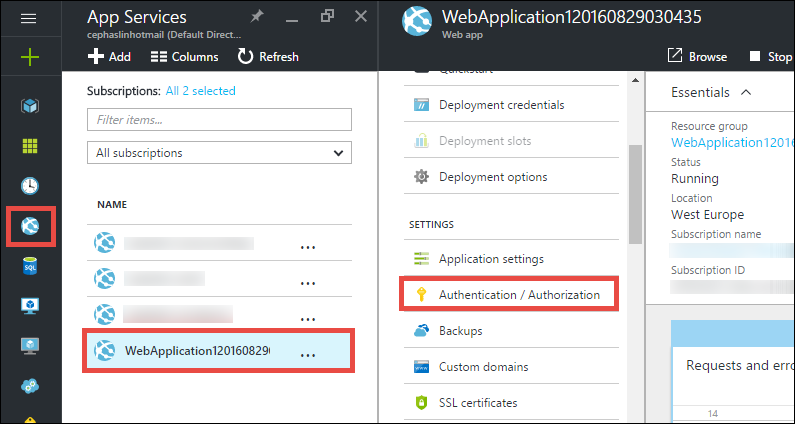

<properties 
    pageTitle="Creare un'app di Azure line-of-business con l'autenticazione di Azure Active Directory | Microsoft Azure" 
    description="Informazioni su come creare un'applicazione line-of-business MVC ASP.NET in Azure App servizio per l'autenticazione con Azure Active Directory" 
    services="app-service\web, active-directory" 
    documentationCenter=".net" 
    authors="cephalin" 
    manager="wpickett" 
    editor=""/>

<tags 
    ms.service="app-service-web" 
    ms.devlang="dotnet" 
    ms.topic="article" 
    ms.tgt_pltfrm="na" 
    ms.workload="web" 
    ms.date="09/01/2016" 
    ms.author="cephalin"/>

# Creare un'app di Azure line-of-business con l'autenticazione di Azure Active Directory #

In questo articolo viene illustrato come creare un'applicazione line-of-business .NET [Azure App servizio Web App](http://go.microsoft.com/fwlink/?LinkId=529714) usando la [autenticazione / autorizzazione](../app-service/app-service-authentication-overview.md) caratteristica. Viene inoltre illustrato come utilizzare l' [API di Azure Active Directory grafico](https://msdn.microsoft.com/Library/Azure/Ad/Graph/api/api-catalog) eseguire query sui dati directory dell'applicazione.

Il tenant di Azure Active Directory che usa può essere una directory solo Azure. In alternativa, può essere [sincronizzata con Active Directory locale](../active-directory/active-directory-aadconnect.md) per creare un'esperienza single sign-on per worker che sono in locale e in remoto. In questo articolo viene utilizzata la directory predefinita per il proprio account Azure.

## Si creerà ##

Si creerà una semplice applicazione crea lettura, aggiornamento eliminazione (CRUD) line-of-business nell'applicazione del servizio Web Apps che tiene traccia lavorare gli elementi con le caratteristiche seguenti:

- Autentica gli utenti in Azure Active Directory
- Utenti e gruppi con [Azure Active Directory grafico API](http://msdn.microsoft.com/library/azure/hh974476.aspx) directory una query
- Utilizzare il modello MVC ASP.NET *Nessuna autenticazione*

Se è necessario controllo dell'accesso basato sui ruoli (RBAC) per l'applicazione line-of-business in Azure, vedere il [Passaggio successivo](#next).

## È necessario ##

[AZURE.INCLUDE [free-trial-note](../../includes/free-trial-note.md)]

È necessario per completare l'esercitazione:

- Un tenant di Azure Active Directory con gli utenti in vari gruppi
- Autorizzazioni per la creazione di applicazioni nel tenant di Azure Active Directory
- Aggiornamento di Visual Studio 2013 4 o versione successiva
- [Azure SDK 2.8.1 o versioni successive](https://azure.microsoft.com/downloads/)

## Creare e distribuire un'app web di Azure ##

1. In Visual Studio, fare clic su **File** > **Nuovo** > **progetto**.

2. Selezionare **Applicazione Web ASP.NET**, assegnare un nome del progetto e fare clic su **OK**.

3. Selezionare il modello **MVC** , quindi modificare l'autenticazione in **Nessuna autenticazione**. Verificare che sia selezionata **Host nel Cloud** e fare clic su **OK**.

    

4. Nella finestra di dialogo **Crea App servizio** , fare clic su **Aggiungi un account** (e quindi **aggiungere un account** nella casella di riepilogo) agli utenti di accedere al proprio account Azure.

5. Una volta eseguito l'accesso configurare un'applicazione web. Creare un gruppo di risorse e un nuovo piano di servizio App facendo clic sul pulsante **Nuovo** corrispondente. Fare clic su **Esplora altri servizi di Azure** per continuare.

    

6. Nella scheda **servizi** fare clic su **+** per aggiungere un Database di SQL per l'app. 

    

7. **Database SQL di configurare**, fare clic su **Nuovo** per creare un'istanza di SQL Server.

8. **Configurare SQL Server**, configurare l'istanza di SQL Server. Quindi, fare clic su **OK**, **OK**e **Crea** per avviare la creazione di app in Azure.

9. **Attività di servizio App Azure**, è possibile visualizzare in cui viene completata la creazione di app. Fare clic su * *Pubblica &lt; *NomeApplicazione*> per questa App Web ora**quindi fare clic su **pubblica * *. 

    Al termine della Visual Studio, viene aperta l'app pubblica nel browser. 

    

## Configurare l'accesso di autenticazione e directory

1. Accedere al [portale di Azure](https://portal.azure.com).

2. Nel menu a sinistra, fare clic su **App servizi** > **&lt;*NomeApplicazione*>** > **autenticazione / autorizzazione * *.

    

3. Attivare l'autenticazione di Azure Active Directory facendo clic **su** > **Azure Active Directory** > **Express** > **OK**.

    

4. Fare clic su **Salva** nella barra dei comandi.

    

    Una volta le impostazioni di autenticazione vengono salvate correttamente, provare a spostarsi all'app nuovamente nel browser. Le impostazioni predefinite applicano l'autenticazione App intera. Se non è già stato effettuato l'accesso, si viene reindirizzati a una schermata di accesso. Dopo aver effettuato l'accesso, l'app protetto da HTTPS è visualizzata. È necessario abilitare l'accesso ai dati di directory. 

5. Passare al [portale classica](https://manage.windowsazure.com).

6. Nel menu a sinistra, fare clic su **Active Directory** > **Directory predefinita** > **applicazioni** > **&lt;*NomeApplicazione*> * *.

    

    Si tratta dell'applicazione di Azure Active Directory creato App servizio per abilitare l'autorizzazione / funzionalità di autenticazione.

7. Fare clic su **utenti** e **gruppi** per assicurarsi di avere alcuni utenti e gruppi nella directory. In caso contrario, creare alcuni utenti di prova e gruppi.

    

7. Fare clic su **Configura** per configurare l'applicazione.

8. Scorrere fino alla sezione **chiavi** e aggiungere una chiave selezionando una durata. Fare clic su **Autorizzazioni delegato** , quindi selezionare i **dati di directory di lettura**. Fare clic su **Salva**.

    

8. Una volta vengono salvate le impostazioni, scorrere indietro fino alla sezione **tasti** e fare clic sul pulsante **Copia** per copiare la chiave del client. 

    

    >[AZURE.IMPORTANT] Se si esce ora questa pagina, non sarà possibile accedere mai nuovamente questo tasto client.

9. È necessario configurare un'applicazione web con questo tasto. Accedere a [Esplora risorse Azure](https://resources.azure.com) con il proprio account Azure.

10. Nella parte superiore della pagina, fare clic su **Lettura/scrittura** per apportare modifiche in Esplora risorse Azure.

    

11. Trovare le impostazioni di autenticazione per l'app, che si trova in abbonamenti > * *&lt;*subscriptionname*>** > **resourceGroups** > **&lt;*resourcegroupname*>** > **provider** > **Microsoft.Web** > **siti** > **&lt;*NomeApplicazione*>** > **config** > **authsettings * *.

12. Fare clic su **Modifica**.

    

13. Nel riquadro di modifica, impostare il `clientSecret` e `additionalLoginParams` proprietà come descritto di seguito.

        ...
        "clientSecret": "<client key from the Azure Active Directory application>",
        ...
        "additionalLoginParams": ["response_type=code id_token", "resource=https://graph.windows.net"],
        ...

14. Fare clic su **inserire** nella parte superiore per inviare le modifiche.

    

14. Per verificare se si dispone il token di autorizzazione per accedere all'API di grafico Azure Active Directory, basta passare al * *https://&lt;*NomeApplicazione*>.azurewebsites.net/.auth/me** nel browser. Se è stato configurato tutto correttamente, è necessario verificare il `access_token` proprietà nella risposta JSON.

    Il `~/.auth/me` percorso URL è gestito da App dei servizi di autenticazione / autorizzazione di notificare tutte le informazioni relative alla sessione autenticata. Per ulteriori informazioni, vedere [l'autenticazione e l'autorizzazione in Azure App servizio](../app-service/app-service-authentication-overview.md).

    >[AZURE.NOTE] Il `access_token` ha un periodo di scadenza. Tuttavia, l'autenticazione del servizio App / autorizzazione offre funzionalità di aggiornamento dei token con `~/.auth/refresh`. Per ulteriori informazioni su come utilizzarla, vedere     [App servizio Token di Store](https://cgillum.tech/2016/03/07/app-service-token-store/).

Successivamente, viene eseguita un'operazione utile ai dati della directory.

## Aggiungere funzionalità line-of-business all'app

A questo punto, creare una semplice individuazione di elementi di lavoro CRUD.  

5.  Nella cartella ~\Models creare un file di classe denominato WorkItem.cs e sostituire `public class WorkItem {...}` con il codice seguente:

        using System.ComponentModel.DataAnnotations;

        public class WorkItem
        {
            [Key]
            public int ItemID { get; set; }
            public string AssignedToID { get; set; }
            public string AssignedToName { get; set; }
            public string Description { get; set; }
            public WorkItemStatus Status { get; set; }
        }

        public enum WorkItemStatus
        {
            Open,
            Investigating,
            Resolved,
            Closed
        }

7.  Compilare il progetto per rendere accessibile la logica di supporto temporaneo il nuovo modello in Visual Studio.

8.  Aggiungere un nuovo elemento di supporto temporaneo `WorkItemsController` nella cartella ~\Controllers (rapida **controller**, scegliere **Aggiungi**e selezionare **nuova voce supporto temporaneo**). 

9.  Selezionare **Controller di 5 MVC con visualizzazioni, utilizzando il Framework entità** e fare clic su **Aggiungi**.

10. Selezionare il modello che si creato, quindi fare clic su **+** e quindi **Aggiungi** per aggiungere un contesto dati e quindi fare clic su **Aggiungi**.

    

14. ~\Views\WorkItems\Create.cshtml (un articolo automaticamente supporto temporaneo), individuare il `Html.BeginForm` metodo di supporto e apportare le modifiche evidenziate seguenti:  
<pre class="prettyprint">
    @modelWebApplication1.Models.WorkItem

    @{ViewBag = &quot;creare&quot;; }

    &lt;h2&gt;creare&lt;/h2&gt;

    @using(Html.BeginForm (<mark>&quot;crea&quot;, &quot;gli elementi di lavoro&quot;, FormMethod.Post, nuovo {id = &quot;maschera principale&quot; }</mark>)) {@Html.AntiForgeryToken()

        &lt;div class=&quot;form-horizontal&quot;&gt;
            &lt;h4&gt;WorkItem&lt;/h4&gt;
            &lt;hr /&gt;
            @Html.ValidationSummary(true, &quot;&quot;, new { @class = &quot;text-danger&quot; })
            &lt;div class=&quot;form-group&quot;&gt;
                @Html.LabelFor(model =&gt; model.AssignedToID, htmlAttributes: new { @class = &quot;control-label col-md-2&quot; })
                &lt;div class=&quot;col-md-10&quot;&gt;
                    @Html.EditorFor(model =&gt; model.AssignedToID, new { htmlAttributes = new { @class = &quot;form-control&quot;<mark>, @type = &quot;hidden&quot;</mark> } })
                    @Html.ValidationMessageFor(model =&gt; model.AssignedToID, &quot;&quot;, new { @class = &quot;text-danger&quot; })
                &lt;/div&gt;
            &lt;/div&gt;

            &lt;div class=&quot;form-group&quot;&gt;
                @Html.LabelFor(model =&gt; model.AssignedToName, htmlAttributes: new { @class = &quot;control-label col-md-2&quot; })
                &lt;div class=&quot;col-md-10&quot;&gt;
                    @Html.EditorFor(model =&gt; model.AssignedToName, new { htmlAttributes = new { @class = &quot;form-control&quot; } })
                    @Html.ValidationMessageFor(model =&gt; model.AssignedToName, &quot;&quot;, new { @class = &quot;text-danger&quot; })
                &lt;/div&gt;
            &lt;/div&gt;

            &lt;div class=&quot;form-group&quot;&gt;
                @Html.LabelFor(model =&gt; model.Description, htmlAttributes: new { @class = &quot;control-label col-md-2&quot; })
                &lt;div class=&quot;col-md-10&quot;&gt;
                    @Html.EditorFor(model =&gt; model.Description, new { htmlAttributes = new { @class = &quot;form-control&quot; } })
                    @Html.ValidationMessageFor(model =&gt; model.Description, &quot;&quot;, new { @class = &quot;text-danger&quot; })
                &lt;/div&gt;
            &lt;/div&gt;

            &lt;div class=&quot;form-group&quot;&gt;
                @Html.LabelFor(model =&gt; model.Status, htmlAttributes: new { @class = &quot;control-label col-md-2&quot; })
                &lt;div class=&quot;col-md-10&quot;&gt;
                    @Html.EnumDropDownListFor(model =&gt; model.Status, htmlAttributes: new { @class = &quot;form-control&quot; })
                    @Html.ValidationMessageFor(model =&gt; model.Status, &quot;&quot;, new { @class = &quot;text-danger&quot; })
                &lt;/div&gt;
            &lt;/div&gt;

            &lt;div class=&quot;form-group&quot;&gt;
                &lt;div class=&quot;col-md-offset-2 col-md-10&quot;&gt;
                    &lt;input type=&quot;submit&quot; value=&quot;Create&quot; class=&quot;btn btn-default&quot;<mark> id=&quot;submit-button&quot;</mark> /&gt;
                &lt;/div&gt;
            &lt;/div&gt;
        &lt;/div&gt;
    }

    &lt;div&gt;
    @Html.ActionLink(&quot;all'elenco&quot;, &quot;indice&quot;) &lt;/div    &gt;

    @sectionScript { @Scripts.Render( &quot;~/bundles/jqueryval&quot;)     <mark> &lt;script&gt; 
     / / a utenti e gruppi selezione codice var maxResultsPerPage = 14.         var input = getElementById (&quot;AssignedToName&quot;);

            // Access token from request header, and tenantID from claims identity
            var token = &quot;@Request.Headers[&quot;X-MS-TOKEN-AAD-ACCESS-TOKEN&quot;]&quot;;
            var tenant =&quot;@(System.Security.Claims.ClaimsPrincipal.Current.Claims
                            .Where(c => c.Type == &quot;http://schemas.microsoft.com/identity/claims/tenantid&quot;)
                            .Select(c => c.Value).SingleOrDefault())&quot;;

            var picker = new AadPicker(maxResultsPerPage, input, token, tenant);

            // Submit the selected user/group to be asssigned.
            $(&quot;#submit-button&quot;).click({ picker: picker }, function () {
                if (!picker.Selected())
                    return;
                $(&quot;#main-form&quot;).get()[0].elements[&quot;AssignedToID&quot;].value = picker.Selected().objectId;
            });
        &lt;/script&gt;</mark>
    }
    </pre>
    
    Si noti che `token` e `tenant` vengono utilizzati per la `AadPicker` oggetto per effettuare chiamate API di Azure Active Directory grafico. Si aggiungeranno `AadPicker` in un secondo momento.   
    
    >[AZURE.NOTE] È anche possibile ottenere `token` e `tenant` dal lato client con `~/.auth/me`, ma che potrebbe essere una chiamata di server aggiuntivi. Per esempio:
    >  
    >     $.ajax({
    >         dataType: "json",
    >         url: "/.auth/me",
    >         success: function (data) {
    >             var token = data[0].access_token;
    >             var tenant = data[0].user_claims
    >                             .find(c => c.typ === 'http://schemas.microsoft.com/identity/claims/tenantid')
    >                             .val;
    >         }
    >     });
    
15. Apportare le modifiche stesso con ~ \Views\WorkItems\Edit.cshtml.

15. Il `AadPicker` oggetto viene definito in uno script che è necessario aggiungere al progetto. Pulsante destro del mouse sulla cartella ~\Scripts, scegliere **Aggiungi**e fare clic su **file JavaScript**. Tipo di `AadPickerLibrary` per il nome file e fare clic su **OK**.

16. Copiare il contenuto da [qui](https://raw.githubusercontent.com/cephalin/active-directory-dotnet-webapp-roleclaims/master/WebApp-RoleClaims-DotNet/Scripts/AadPickerLibrary.js) in ~ \Scripts\AadPickerLibrary.js.

    In script, il `AadPicker` oggetto chiama [Azure Active Directory grafico API](https://msdn.microsoft.com/Library/Azure/Ad/Graph/api/api-catalog) per cercare gli utenti e gruppi che corrispondono l'input.  

17. ~\Scripts\AadPickerLibrary.js Usa anche [widget di completamento automatico dell'interfaccia utente jQuery](https://jqueryui.com/autocomplete/). Pertanto è necessario aggiungere jQuery dell'interfaccia utente per il progetto. Pulsante destro del mouse sul progetto in e fare clic su **Gestisci pacchetti NuGet**.

18. In Gestione pacchetto NuGet, fare clic su Sfoglia, digitare **dell'interfaccia utente jquery** nella barra di ricerca e fare clic su **jQuery.UI.Combined**.

    

19. Nel riquadro destro fare clic su **Installa**, quindi fare clic su **OK** per continuare.

19. Aprire ~\App_Start\BundleConfig.cs e apportare le modifiche evidenziate seguenti:  
    <pre class="prettyprint">
    RegisterBundles(BundleCollection bundles) void statico pubblico {pacchetti. Aggiungere (nuova ScriptBundle (&quot;~/bundles/jquery&quot;). Includere ( &quot;~/Scripts/jquery-{version}.js&quot;<mark>, &quot;~/Scripts/jquery-ui-{version}.js&quot;, &quot;~/Scripts/AadPickerLibrary.js&quot;</mark>));

        bundles.Add(new ScriptBundle(&quot;~/bundles/jqueryval&quot;).Include(
                    &quot;~/Scripts/jquery.validate*&quot;));

        // Use the development version of Modernizr to develop with and learn from. Then, when you&#39;re
        // ready for production, use the build tool at http://modernizr.com to pick only the tests you need.
        bundles.Add(new ScriptBundle(&quot;~/bundles/modernizr&quot;).Include(
                    &quot;~/Scripts/modernizr-*&quot;));

        bundles.Add(new ScriptBundle(&quot;~/bundles/bootstrap&quot;).Include(
                    &quot;~/Scripts/bootstrap.js&quot;,
                    &quot;~/Scripts/respond.js&quot;));

        bundles.Add(new StyleBundle(&quot;~/Content/css&quot;).Include(
                    &quot;~/Content/bootstrap.css&quot;,
                    &quot;~/Content/site.css&quot;<mark>,
                    &quot;~/Content/themes/base/jquery-ui.css&quot;</mark>));
    }
    </pre>

    Sono disponibili altri modi di efficienti per la gestione dei file CSS e JavaScript nell'app. Tuttavia, per semplicità si deve di affidare in bundle caricati con tutte le visualizzazioni.

12. Infine, in ~ \Global.asax, aggiungere la riga di codice seguente la `Application_Start()` metodo. `Ctrl`+`.`ogni errore di risoluzione dei nomi per risolvere il problema.

        AntiForgeryConfig.UniqueClaimTypeIdentifier = ClaimTypes.NameIdentifier;
    
    > [AZURE.NOTE] È necessario questa riga di codice, poiché viene utilizzato il modello MVC predefinito <code>[ValidateAntiForgeryToken]</code> effetto su alcune delle azioni. A causa il comportamento descritto dalla [Brock Allen](https://twitter.com/BrockLAllen)     [MVC 4, AntiForgeryToken](http://brockallen.com/2012/07/08/mvc-4-antiforgerytoken-and-claims/) e sulle attestazioni POST HTTP potrebbe non riuscire convalida token anti-FALSO perché:

    > - Azure Active Directory non inviare http://schemas.microsoft.com/accesscontrolservice/2010/07/claims/identityprovider, che richieste per impostazione predefinita, il token anti-FALSO.
    > - Se si Azure Active Directory directory sincronizzate con ADFS, protezione ADFS per impostazione predefinita non inviare la richiesta di http://schemas.microsoft.com/accesscontrolservice/2010/07/claims/identityprovider, anche se è possibile configurare manualmente ADFS per inviare la richiesta.

    > `ClaimTypes.NameIdentifies`Specifica la richiesta `http://schemas.xmlsoap.org/ws/2005/05/identity/claims/nameidentifier`, che forniscono Azure Active Directory.  

20. A questo punto, pubblicare le modifiche. Il pulsante destro del progetto e fare clic su **pubblica**.

21. Fare clic su **Impostazioni**, verificare che sia presente una stringa di connessione al Database SQL, selezionare **Il Database di aggiornamento** per apportare modifiche allo schema per il modello e fare clic su **pubblica**.

    

22. Nel browser passare a https://&lt;*NomeApplicazione*>.azurewebsites.net/workitems e fare clic su **Crea nuovo**.

23. Fare clic sulla casella **AssignedToName** . Viene visualizzato agli utenti e gruppi dal tenant di Azure Active Directory in un elenco a discesa. È possibile digitare per filtrare o utilizzare la `Up` o `Down` tasto oppure fare clic su per selezionare l'utente o gruppo. 

    

24. Fare clic su **Crea** per salvare le modifiche. Nell'elemento di lavoro creata da osservare lo stesso comportamento, quindi fare clic su **Modifica** .

Complimenti, è in esecuzione un'applicazione line-of-business in Azure con accesso alla directory! Non c'è molto più che è possibile eseguire con l'API di grafico. Vedere [informazioni di riferimento API di Azure Active Directory grafico](https://msdn.microsoft.com/library/azure/ad/graph/api/api-catalog).

## Passaggio successivo

Se è necessario controllo dell'accesso basato sui ruoli (RBAC) per l'applicazione line-of-business in azure, vedere [DotNet di RoleClaims Web App](https://github.com/Azure-Samples/active-directory-dotnet-webapp-roleclaims) per un campione dal team di Azure Active Directory. Viene illustrato come attivare i ruoli per l'applicazione di Azure Active Directory e quindi sull'autorizzazione degli utenti con le `[Authorize]` decorazione.

Se l'applicazione line-of-business richiede l'accesso ai dati in locale, vedere [accesso locale risorse con le connessioni ibrido in Azure App servizio](web-sites-hybrid-connection-get-started.md).

## Ulteriori risorse

- [Autenticazione e autorizzazione in servizio App Azure](../app-service/app-service-authentication-overview.md)
- [Eseguire l'autenticazione con Active Directory locale nell'app Azure](web-sites-authentication-authorization.md)
- [Creare un'applicazione line-of-business in Azure con l'autenticazione di ADFS](web-sites-dotnet-lob-application-adfs.md)
- [Servizio di App Auth e Azure Active Directory grafico API](https://cgillum.tech/2016/03/25/app-service-auth-aad-graph-api/)
- [Esempi di Microsoft Azure Active Directory e alla documentazione](https://github.com/AzureADSamples)
- [Token e tipi di attestazione di Azure Active Directory supportati](http://msdn.microsoft.com/library/azure/dn195587.aspx)

[Protect the Application with SSL and the Authorize Attribute]: web-sites-dotnet-deploy-aspnet-mvc-app-membership-oauth-sql-database.md#protect-the-application-with-ssl-and-the-authorize-attribute
