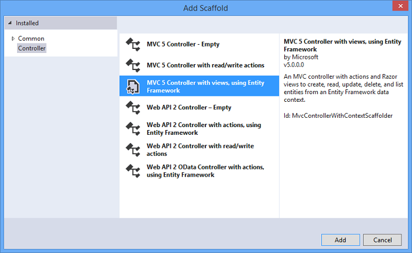

<properties 
    pageTitle="Creare un servizio resto mediante API Web ASP.NET e Database SQL Azure App servizio" 
    description="Esercitazione che illustra come distribuire un'app che utilizza l'API Web ASP.NET per un'app web Azure mediante Visual Studio." 
    services="app-service\web" 
    documentationCenter=".net" 
    authors="Rick-Anderson" 
    writer="Rick-Anderson" 
    manager="wpickett" 
    editor=""/>

<tags 
    ms.service="app-service-web" 
    ms.workload="web" 
    ms.tgt_pltfrm="na" 
    ms.devlang="dotnet" 
    ms.topic="article" 
    ms.date="02/29/2016" 
    ms.author="riande"/>

# Creare un servizio resto mediante API Web ASP.NET e Database SQL Azure App servizio

In questa esercitazione viene illustrato come distribuire un'app web ASP.NET a un [Servizio di Azure App](http://go.microsoft.com/fwlink/?LinkId=529714) utilizzando la creazione guidata pubblicazione Web in Visual Studio 2013 o Visual Studio 2013 Community Edition. 

È possibile aprire un account Azure gratuitamente e se non si dispone di Visual Studio 2013, SDK installa automaticamente Visual Studio 2013 per Web Express. Così è possibile avviare lo sviluppo, gratuitamente per Azure interamente per.

In questa esercitazione non si presuppone alcuna già esperienza nell'uso di Azure. L'esercitazione, è necessario un'app web semplice alto e in esecuzione nel cloud.
 
Si apprenderanno:

* Come attivare il computer per lo sviluppo di Azure installando Azure SDK.
* Come creare un progetto di Visual Studio ASP.NET MVC 5 e pubblicarla in un'applicazione Azure.
* Come utilizzare l'API Web ASP.NET per attivare le chiamate API REST.
* Informazioni su come usare un database SQL per archiviare i dati in Azure.
* Come pubblicare gli aggiornamenti in Azure.

È necessario creare un'applicazione web semplice elenco di contatti che si basa su ASP.NET MVC 5 e utilizza ADO.NET entità Framework per l'accesso al database. L'illustrazione seguente mostra l'applicazione completata:

![schermata del sito web][intro001]

<!-- the next line produces the "Set up the development environment" section as see at http://azure.microsoft.com/documentation/articles/web-sites-dotnet-get-started/ -->
[AZURE.INCLUDE [create-account-and-websites-note](../../includes/create-account-and-websites-note.md)]

### Creare il progetto

1. Avviare Visual Studio 2013.
1. Dal menu **File** fare clic su **Nuovo progetto**.
3. Nella finestra di dialogo **Nuovo progetto** espandere **Visual c#** e selezionare **Web** e quindi selezionare **Applicazione Web ASP.NET**. Assegnare un nome applicazione **ContactManager** e fare clic su **OK**.

    

1. Nella finestra di dialogo **Nuovo progetto ASP.NET** selezionare il modello **MVC** , controllare **API Web** e quindi fare clic su **Modifica autenticazione**.

1. Nella finestra di dialogo **Modifica autenticazione** fare clic su **Nessuna autenticazione**e quindi fare clic su **OK**.

    

    L'applicazione di esempio che si sta creando non disporrà funzionalità che richiedono l'accesso agli utenti. Per informazioni su come implementare funzionalità di autenticazione e l'autorizzazione, vedere la sezione [Passaggi successivi](#nextsteps) alla fine dell'esercitazione. 

1. Nella finestra di dialogo **Nuovo progetto ASP.NET** verificare che sia selezionata l' **Host nel Cloud** e fare clic su **OK**.

Se dispone non precedentemente connesso al Azure, verrà richiesto di accedere.

1. La configurazione guidata suggerisce un nome univoco in base a *ContactManager* (vedere l'immagine riportata di seguito). Selezionare un'area più vicino. È possibile utilizzare [azurespeed.com](http://www.azurespeed.com/ "AzureSpeed.com") per trovare l'interfaccia di dati latenza più basso. 
2. Se è stato creato un server di database prima di, selezionare **Crea nuovo server**, immettere un nome utente del database e la password.

    

Se si dispone di un server di database, da utilizzare per creare un nuovo database. Server di database sono risorse importanti e in genere si desidera creare più database nello stesso server per il test e sviluppo anziché creare un server di database per ogni database. Verificare che il sito web e database siano presenti nell'area stessa.

### Impostare l'intestazione e piè di pagina

1. In **Esplora soluzioni**, espandere la cartella *Views\Shared* e aprire il file *cshtml* .

    ![Cshtml in Esplora soluzioni][newapp004]

1. Sostituire il contenuto del file *Views\Shared_Layout.cshtml* con il codice seguente:

        <!DOCTYPE html>
        <html lang="en">
        <head>
            <meta charset="utf-8" />
            <title>@ViewBag.Title - Contact Manager</title>
            <link href="~/favicon.ico" rel="shortcut icon" type="image/x-icon" />
            <meta name="viewport" content="width=device-width" />
            @Styles.Render("~/Content/css")
            @Scripts.Render("~/bundles/modernizr")
        </head>
        <body>
            <header>
                

                    

                        
@Html.ActionLink("Contact Manager", "Index", "Home")

                    

                

            </header>
            

                @RenderSection("featured", required: false)
                <section class="content-wrapper main-content clear-fix">
                    @RenderBody()
                </section>
            

            <footer>
                

                    

                        
&copy; @DateTime.Now.Year - Contact Manager

                    

                

            </footer>
            @Scripts.Render("~/bundles/jquery")
            @RenderSection("scripts", required: false)
        </body>
        </html>
            
Il markup in precedenza impostato il nome dell'app da "Personale ASP.NET App" a "Contact Manager" e vengono rimossi i collegamenti a **casa**, **sulle** e **contatto**.

### Eseguire l'applicazione localmente

1. Premere CTRL + F5 per eseguire l'applicazione.
Home page del viene visualizzata nel browser predefinito.
    

Si tratta è sufficiente per ora creare l'applicazione che è possibile distribuire in Azure. In un secondo momento si aggiungeranno funzionalità di database.

## Distribuire un'applicazione di Azure

1. In Visual Studio, fare clic sul progetto in **Esplora soluzioni** e selezionare **pubblica** dal menu di scelta rapida.

    ![Pubblicare nel menu di scelta rapida progetto][PublishVSSolution]

    Verrà visualizzata la creazione guidata **Pubblicazione Web** .

12. Fare clic su **pubblica**.

Visual Studio avvia il processo di copia dei file nel server Azure. Nella finestra di **Output** quali operazioni di distribuzione sono state eseguite e dei report completamento della distribuzione.

14. Il browser predefinito viene aperta automaticamente all'URL del sito distribuito.

    L'applicazione creata è in esecuzione nel cloud.
    
    ![Elenco attività home page in esecuzione in Azure][rxz2]

## Aggiungere un database dell'applicazione

Successivamente, aggiornare l'applicazione MVC per aggiungere la possibilità di visualizzare e aggiornare i contatti e archiviare i dati in un database. L'applicazione utilizzerà il Framework entità per creare il database e per leggere e aggiornare i dati nel database.

### Aggiungere le classi modello di dati per i contatti

È necessario creare innanzitutto un semplice modello di dati nel codice.

1. In **Esplora soluzioni**fare clic sulla cartella Modelli fare clic su **Aggiungi**, quindi **classe**.

    ![Aggiungere classe nel menu di scelta rapida cartella modelli][adddb001]

2. Nella finestra di dialogo **Aggiungi nuovo elemento** , assegnare un nome nuovo file di classe *Contact.cs*e quindi fare clic su **Aggiungi**.

    ![Aggiungere la finestra di dialogo Nuovo elemento][adddb002]

3. Sostituire il contenuto del file Contacts.cs con il codice seguente.

        using System.Globalization;
        namespace ContactManager.Models
        {
            public class Contact
            {
                public int ContactId { get; set; }
                public string Name { get; set; }
                public string Address { get; set; }
                public string City { get; set; }
                public string State { get; set; }
                public string Zip { get; set; }
                public string Email { get; set; }
                public string Twitter { get; set; }
                public string Self
                {
                    get { return string.Format(CultureInfo.CurrentCulture,
                         "api/contacts/{0}", this.ContactId); }
                    set { }
                }
            }
        }

La classe **contattare** definisce i dati che verrà archiviata per ogni contatto, più una chiave primaria, contatto, che è necessario per il database. È possibile ottenere ulteriori informazioni sui modelli di dati nella sezione [Passaggi successivi](#nextsteps) alla fine dell'esercitazione.

### Creare pagine web che consentono agli utenti di app per l'uso con i contatti

MVC ASP.NET la funzionalità di supporto temporaneo può generare automaticamente codice che esegue creare, leggere, aggiornare ed eliminare le azioni (CRUD).

## Aggiungere un Controller e una visualizzazione per i dati

1. In **Esplora soluzioni**, espandere la cartella controller.

3. Compilare il progetto **(Ctrl + MAIUSC + B)**. (È necessario compilare il progetto prima di utilizzare meccanismo di supporto temporaneo). 

4. Pulsante destro del mouse sulla cartella controller e fare clic su **Aggiungi**e quindi fare clic su **Controller**.

    ![Aggiungere Controller nel menu di scelta rapida cartella controller][addcode001]

1. Nella finestra di dialogo **Aggiungi Scaffold** selezionare **Controller MVC con visualizzazioni, utilizzando il Framework entità** e fare clic su **Aggiungi**.

 

6. Impostare il nome del controller **HomeController**. Selezionare **contatto** come la classe di modello. Fare clic sul pulsante **nuovo contesto dati** e accettare i valori predefiniti "ContactManager.Models.ContactManagerContext" per il **nuovo tipo di contesto di dati**. Fare clic su **Aggiungi**.

    Una finestra di dialogo verrà chiesto: "un file con il nome HomeController esiste già. Si desidera sostituirlo? ". Fare clic su **Sì**. Si sta sovrascrivendo Controller Home è stato creato con il nuovo progetto. Il nuovo Controller Home verrà utilizzato per il nostro elenco di contatti.

    Visual Studio crea metodi controller e visualizzazioni per CRUD del database per gli oggetti di **contatto** .

## Attivare le migrazioni, creare il database, aggiungere dati di esempio e un inizializzatore di dati ##

È necessario attivare la funzionalità di [Migrazioni prima di codice](http://curah.microsoft.com/55220) per creare il database in base al modello di dati che è stato creato.

1. Nel menu **Strumenti** , selezionare **Gestione pacchetti libreria** e quindi **Console di gestione pacchetti**.

    ![Console di gestione pacchetti nel menu Strumenti][addcode008]

2. Nella finestra della **Console di gestione pacchetti** , immettere il comando seguente:

        enable-migrations 
  
    Il comando **Abilita migrazioni** crea una cartella di *migrazioni* e inserisce in tale cartella un file di *Configuration.cs* che è possibile modificare per configurare le migrazioni. 

2. Nella finestra della **Console di gestione pacchetti** , immettere il comando seguente:

        add-migration Initial

    Il comando di **migrazione aggiungere iniziale** genera una classe denominata ** &lt;date_stamp&gt;iniziale** che consente di creare il database. Il primo parametro ( *iniziale* ) è utilizzata per creare il nome del file e non autorizzato. È possibile visualizzare i nuovi file di classe in **Esplora soluzioni**.

    In classe **iniziale** , il metodo **la** Crea tabella Contacts e la rilasci il metodo **verso il basso** (utilizzato quando si desidera tornare allo stato precedente).

3. Aprire il file *Migrations\Configuration.cs* . 

4. Aggiungere gli spazi dei nomi seguenti. 

         using ContactManager.Models;

5. Sostituire il metodo di *inizializzazione* con il codice seguente:
        
        protected override void Seed(ContactManager.Models.ContactManagerContext context)
        {
            context.Contacts.AddOrUpdate(p => p.Name,
               new Contact
               {
                   Name = "Debra Garcia",
                   Address = "1234 Main St",
                   City = "Redmond",
                   State = "WA",
                   Zip = "10999",
                   Email = "debra@example.com",
                   Twitter = "debra_example"
               },
                new Contact
                {
                    Name = "Thorsten Weinrich",
                    Address = "5678 1st Ave W",
                    City = "Redmond",
                    State = "WA",
                    Zip = "10999",
                    Email = "thorsten@example.com",
                    Twitter = "thorsten_example"
                },
                new Contact
                {
                    Name = "Yuhong Li",
                    Address = "9012 State st",
                    City = "Redmond",
                    State = "WA",
                    Zip = "10999",
                    Email = "yuhong@example.com",
                    Twitter = "yuhong_example"
                },
                new Contact
                {
                    Name = "Jon Orton",
                    Address = "3456 Maple St",
                    City = "Redmond",
                    State = "WA",
                    Zip = "10999",
                    Email = "jon@example.com",
                    Twitter = "jon_example"
                },
                new Contact
                {
                    Name = "Diliana Alexieva-Bosseva",
                    Address = "7890 2nd Ave E",
                    City = "Redmond",
                    State = "WA",
                    Zip = "10999",
                    Email = "diliana@example.com",
                    Twitter = "diliana_example"
                }
                );
        }

    Questo codice precedente verrà inizializzato il database con le informazioni di contatto. Per ulteriori informazioni sul seeding del database, vedere [DBs debug entità Framework (EF)](http://blogs.msdn.com/b/rickandy/archive/2013/02/12/seeding-and-debugging-entity-framework-ef-dbs.aspx).

1. Nella **Console di gestione pacchetti** immettere il comando:

        update-database

    ![Comandi della Console di gestione pacchetti][addcode009]

    **Aggiornamento database** viene eseguita la migrazione prima che consente di creare il database. Per impostazione predefinita, verrà creato il database come un database di SQL Server Express LocalDB.

1. Premere CTRL + F5 per eseguire l'applicazione. 

L'applicazione mostra i dati di valore iniziale e vengono forniti collegamenti che modifica, dettagli e l'eliminazione.

![Visualizzazione MVC dei dati][rxz3]

## Modificare la visualizzazione

1. Aprire il file *Views\Home\Index.cshtml* . Nel passaggio successivo, si sostituirà il markup generato con codice che utilizza [jQuery](http://jquery.com/) e [Knockout.js](http://knockoutjs.com/). Il nuovo codice recupera l'elenco dei contatti da tramite l'API web e JSON e associa quindi i dati dei contatti per l'interfaccia utente utilizzando knockout.js. Per ulteriori informazioni, vedere la sezione [Passaggi successivi](#nextsteps) alla fine dell'esercitazione. 

2. Sostituire il contenuto del file con il codice seguente.

        @model IEnumerable<ContactManager.Models.Contact>
        @{
            ViewBag.Title = "Home";
        }
        @section Scripts {
            @Scripts.Render("~/bundles/knockout")
            
        }
        <ul id="contacts" data-bind="foreach: contacts">
            <li class="ui-widget-content ui-corner-all">
                <h1 data-bind="text: Name" class="ui-widget-header"></h1>
                

                

                    ,
                    
                    
                

                

                
Email?

                

                
Twitter?

                
<a data-bind="attr: { href: Self }, click: $root.removeContact" class="removeContact ui-state-default ui-corner-all">Remove</a>

            </li>
        </ul>
        <form id="addContact" data-bind="submit: addContact">
            <fieldset>
                <legend>Add New Contact</legend>
                <ol>
                    <li>
                        <label for="Name">Name</label>
                        <input type="text" name="Name" />
                    </li>
                    <li>
                        <label for="Address">Address</label>
                        <input type="text" name="Address" >
                    </li>
                    <li>
                        <label for="City">City</label>
                        <input type="text" name="City" />
                    </li>
                    <li>
                        <label for="State">State</label>
                        <input type="text" name="State" />
                    </li>
                    <li>
                        <label for="Zip">Zip</label>
                        <input type="text" name="Zip" />
                    </li>
                    <li>
                        <label for="Email">E-mail</label>
                        <input type="text" name="Email" />
                    </li>
                    <li>
                        <label for="Twitter">Twitter</label>
                        <input type="text" name="Twitter" />
                    </li>
                </ol>
                <input type="submit" value="Add" />
            </fieldset>
        </form>

3. Pulsante destro del mouse sulla cartella del contenuto e fare clic su **Aggiungi**e quindi fare clic su **Nuovo elemento...**.

    ![Aggiungere il foglio di stile nel menu di scelta rapida cartella del contenuto][addcode005]

4. Nella finestra di dialogo **Aggiungi nuovo elemento** immettere **stile** nella casella di ricerca destra superiore e quindi selezionare **Il foglio di stile**.
    ![Aggiungere la finestra di dialogo Nuovo elemento][rxStyle]

5. Assegnare un nome file *Contacts.css* e fare clic su **Aggiungi**. Sostituire il contenuto del file con il codice seguente.
    
        .column {
            float: left;
            width: 50%;
            padding: 0;
            margin: 5px 0;
        }
        form ol {
            list-style-type: none;
            padding: 0;
            margin: 0;
        }
        form li {
            padding: 1px;
            margin: 3px;
        }
        form input[type="text"] {
            width: 100%;
        }
        #addContact {
            width: 300px;
            float: left;
            width:30%;
        }
        #contacts {
            list-style-type: none;
            margin: 0;
            padding: 0;
            float:left;
            width: 70%;
        }
        #contacts li {
            margin: 3px 3px 3px 0;
            padding: 1px;
            float: left;
            width: 300px;
            text-align: center;
            background-image: none;
            background-color: #F5F5F5;
        }
        #contacts li h1
        {
            padding: 0;
            margin: 0;
            background-image: none;
            background-color: Orange;
            color: White;
            font-family: Trebuchet MS, Tahoma, Verdana, Arial, sans-serif;
        }
        .removeContact, .viewImage
        {
            padding: 3px;
            text-decoration: none;
        }

    In questo foglio di stile verrà utilizzato per il layout, colori e gli stili utilizzati nell'applicazione di gestione contatti.

6. Aprire il file *App_Start\BundleConfig.cs* .

7. Aggiungere il codice riportato di seguito per registrare il plug-in(http://knockoutjs.com/index.html "KO") di [ritaglio].

        bundles.Add(new ScriptBundle("~/bundles/knockout").Include(
                    "~/Scripts/knockout-{version}.js"));
    In questo esempio l'utilizzo di ritaglio per semplificare dinamico codice JavaScript che gestisce i modelli di schermata.

8. Modificare la voce di sommario/css per registrare il foglio di stile *contacts.css* . Modificare la riga seguente:

                 bundles.Add(new StyleBundle("~/Content/css").Include(
                   "~/Content/bootstrap.css",
                   "~/Content/site.css"));
A:

        bundles.Add(new StyleBundle("~/Content/css").Include(
                   "~/Content/bootstrap.css",
                   "~/Content/contacts.css",
                   "~/Content/site.css"));

1. Nella Console di gestione pacchetti, eseguire il comando seguente per installare ritaglio.

        Install-Package knockoutjs

## Aggiungere un controller per l'interfaccia Web API REST

1. In **Esplora soluzioni**destro del mouse sul controller e fare clic su **Aggiungi** e quindi su **Controller...** 

1. Nella finestra di dialogo **Aggiungi Scaffold** immettere **Web API 2 Controller con azioni, utilizzando il Framework entità** e quindi fare clic su **Aggiungi**.

    

4. Nella finestra di dialogo **Aggiungi Controller** immettere "ContactsController" come nome del controller. Selezionare "Contatto (ContactManager.Models)" per la **classe modello**.  Mantenere il valore predefinito per la **classe contesto dati**. 

6. Fare clic su **Aggiungi**.

### Eseguire l'applicazione localmente

1. Premere CTRL + F5 per eseguire l'applicazione.

    ![Pagina di indice][intro001]

2. Immettere un contatto e fare clic su **Aggiungi**. L'app restituisce alla home page e visualizza il contatto che è stato immesso.

    ![Pagina di indice di voci di elenco di cose da fare][addwebapi004]

3. Nel browser, aggiungere **/api/contacts** all'URL.

    L'URL risultante sarà simile all'api/http://localhost:1234/contatti. Web REST API che è stato aggiunto restituisce i contatti archiviati. Firefox e Chrome verranno visualizzati i dati in formato XML.

    ![Pagina di indice di voci di elenco di cose da fare][rxFFchrome]
    

    Internet Explorer viene richiesto di aprire o salvare i contatti.

    ![Finestra di dialogo Salva dell'API Web][addwebapi006]
    
    
    È possibile aprire i contatti restituiti nel blocco note o in un browser.
    
    L'output può essere utilizzato da un'altra applicazione, ad esempio pagina web per dispositivi mobili o dell'applicazione.

    ![Finestra di dialogo Salva dell'API Web][addwebapi007]

    **Avviso di sicurezza**: A questo punto, l'applicazione è protetta ed esposto a attacco CSRF. In un secondo momento nell'esercitazione si comporta la rimozione questa vulnerabilità. Per ulteriori informazioni, vedere [attacchi impedendo intersito richiedere FALSO (CSRF)][prevent-csrf-attacks].
## Aggiungere la protezione XSRF

FALSO intersito richiesta (noto anche come XSRF o CSRF) è un attacco applicazioni web ospitato in base al quale un sito Web dannoso possono influenzare l'interazione tra un browser client e un sito Web considerato attendibile dai tale browser. Questi attacchi sono possibili perché browser invierà token di autenticazione automaticamente con ogni richiesta di un sito Web. L'esempio canonico è un cookie di autenticazione, ad esempio ASP. Ticket di autenticazione basata su moduli della rete. Tuttavia, siti Web che utilizzano qualsiasi meccanismo di autenticazione persistente (ad esempio l'autenticazione di Windows, Basic e così via) può essere assegnato da questi attacchi.

Attacco XSRF è diverso da un attacco di phishing. Attacchi di phishing richiedono un'interazione dalla vittima. In un attacco di phishing, un sito Web dannoso verrà simulare il sito Web di destinazione e la vittima è significativo a fornire informazioni riservate per il pirata informatico. In un attacco XSRF, non è spesso alcuna interazione necessarie dalla vittima. Invece il pirata informatico si basa sul browser inviare automaticamente tutti i cookie pertinenti al sito Web di destinazione.

Per ulteriori informazioni, vedere il [Progetto di sicurezza dell'applicazione Web aperto](https://www.owasp.org/index.php/Main_Page) (OWASP) [XSRF](https://www.owasp.org/index.php/Cross-Site_Request_Forgery_(CSRF)).

1. In **Esplora soluzioni**destra **ContactManager** progetto e fare clic su **Aggiungi** e quindi fare clic su **classe**.

2. Assegnare un nome file *ValidateHttpAntiForgeryTokenAttribute.cs* e aggiungere il codice seguente:

        using System;
        using System.Collections.Generic;
        using System.Linq;
        using System.Net;
        using System.Net.Http;
        using System.Web.Helpers;
        using System.Web.Http.Controllers;
        using System.Web.Http.Filters;
        using System.Web.Mvc;
        namespace ContactManager.Filters
        {
            public class ValidateHttpAntiForgeryTokenAttribute : AuthorizationFilterAttribute
            {
                public override void OnAuthorization(HttpActionContext actionContext)
                {
                    HttpRequestMessage request = actionContext.ControllerContext.Request;
                    try
                    {
                        if (IsAjaxRequest(request))
                        {
                            ValidateRequestHeader(request);
                        }
                        else
                        {
                            AntiForgery.Validate();
                        }
                    }
                    catch (HttpAntiForgeryException e)
                    {
                        actionContext.Response = request.CreateErrorResponse(HttpStatusCode.Forbidden, e);
                    }
                }
                private bool IsAjaxRequest(HttpRequestMessage request)
                {
                    IEnumerable<string> xRequestedWithHeaders;
                    if (request.Headers.TryGetValues("X-Requested-With", out xRequestedWithHeaders))
                    {
                        string headerValue = xRequestedWithHeaders.FirstOrDefault();
                        if (!String.IsNullOrEmpty(headerValue))
                        {
                            return String.Equals(headerValue, "XMLHttpRequest", StringComparison.OrdinalIgnoreCase);
                        }
                    }
                    return false;
                }
                private void ValidateRequestHeader(HttpRequestMessage request)
                {
                    string cookieToken = String.Empty;
                    string formToken = String.Empty;
                    IEnumerable<string> tokenHeaders;
                    if (request.Headers.TryGetValues("RequestVerificationToken", out tokenHeaders))
                    {
                        string tokenValue = tokenHeaders.FirstOrDefault();
                        if (!String.IsNullOrEmpty(tokenValue))
                        {
                            string[] tokens = tokenValue.Split(':');
                            if (tokens.Length == 2)
                            {
                                cookieToken = tokens[0].Trim();
                                formToken = tokens[1].Trim();
                            }
                        }
                    }
                    AntiForgery.Validate(cookieToken, formToken);
                }
            }
        }

1. Aggiungere la seguente istruzione *using* al controller di contratti in modo da avere accesso per l'attributo **[ValidateHttpAntiForgeryToken]** .

        using ContactManager.Filters;

1. Aggiungere i metodi di Post di **ContactsController** per la protezione dai rischi XSRF l'attributo **[ValidateHttpAntiForgeryToken]** . La aggiungerà per i metodi di azione "PutContact", "PostContact" e **DeleteContact** .

        [ValidateHttpAntiForgeryToken]
            public IHttpActionResult PutContact(int id, Contact contact)
            {

1. Aggiornare la sezione *script* del file *Views\Home\Index.cshtml* per includere il codice per ottenere i token XSRF.

         @section Scripts {
            @Scripts.Render("~/bundles/knockout")
            
         }

## Pubblicare l'aggiornamento dell'applicazione in Azure e Database SQL

Per pubblicare l'applicazione, ripetere la procedura che è stata eseguita in precedenza.

1. In **Esplora soluzioni**fare clic con il pulsante destro del progetto e selezionare **pubblica**.

    ![Pubblicare][rxP]

5. Fare clic sulla scheda **Impostazioni** .
    

1. In **ContactsManagerContext(ContactsManagerContext)**, fare clic sull'icona **v** per modificare *la stringa di connessione* per la stringa di connessione per il database contatto. Fare clic su **ContactDB**.

    

7. Selezionare la casella per **Eseguire codice prima le migrazioni (viene eseguita all'avvio dell'applicazione)**.

1. Fare clic su **Avanti** e quindi fare clic su **Anteprima**. Visual Studio visualizza un elenco di file che verrà aggiunto o aggiornato.

8. Fare clic su **pubblica**.
Al termine del processo di distribuzione, verrà visualizzata nel browser alla home page dell'applicazione.

    ![Pagina di indice con i contatti non][intro001]

    Processo di pubblicazione di Visual Studio automaticamente configurato la stringa di connessione nel file *config* distribuito in modo che punti al database SQL. Inoltre, configurare le migrazioni prima di codice per aggiornare automaticamente il database per la versione più recente al primo accesso dell'applicazione del database dopo la distribuzione.

    In seguito a questa configurazione, Code First creato il database eseguendo il codice nella classe **iniziale** creato in precedenza. Eseguita questa operazione la prima volta che l'applicazione ha tentato di accedere al database dopo la distribuzione.

9. Immettere un contatto come quando si è eseguito l'app in locale, per assicurarsi che la distribuzione del database correttamente.

Quando viene visualizzato che l'elemento che è immettere viene salvato e viene visualizzato nella pagina Gestione contatti, è possibile sapere che è stato archiviato nel database.

![Pagina di indice con i contatti][addwebapi004]

L'applicazione è in esecuzione nel cloud, usare il Database di SQL per archiviare i dati. Dopo aver completato il test dell'applicazione in Azure, eliminarlo. L'applicazione è pubblico e non è disponibile un meccanismo per limitare l'accesso.

>[AZURE.NOTE] Se si desidera iniziare a utilizzare il servizio di App Azure prima di iscriversi a un account Azure, accedere al [Servizio App provare](http://go.microsoft.com/fwlink/?LinkId=523751), in cui è possibile creare immediatamente un'app web starter breve nel servizio di App. Nessun carte di credito obbligatorio; Nessun impegni.

## Passaggi successivi

Un'applicazione reale richiedono l'autenticazione e l'autorizzazione e utilizzare il database di appartenenza a tale scopo. Esercitazione [distribuire un'applicazione di sicura Asp.net con OAuth, l'appartenenza e Database SQL](web-sites-dotnet-deploy-aspnet-mvc-app-membership-oauth-sql-database.md) è in base a questa esercitazione e viene illustrato come distribuire un'applicazione web con il database di appartenenza.

Un altro modo per archiviare i dati in un'applicazione di Azure consiste nell'utilizzare lo spazio di archiviazione Azure, che forniscono dello spazio di archiviazione di dati non relazionali sotto forma di BLOB e tabelle. I collegamenti seguenti offrono ulteriori informazioni su API Web, ASP.NET MVC e finestra Azure.
 

* [Guida introduttiva a Framework entità utilizzando MVC][EFCodeFirstMVCTutorial]
* [Introduzione a ASP.NET MVC 5](http://www.asp.net/mvc/tutorials/mvc-5/introduction/getting-started)
* [Prima dell'API Web ASP.NET](http://www.asp.net/web-api/overview/getting-started-with-aspnet-web-api/tutorial-your-first-web-api)
* [Il debug WAWS](web-sites-dotnet-troubleshoot-visual-studio.md)

In questa esercitazione e l'applicazione di esempio è stato scritto da [Zaffaroni Rick](http://blogs.msdn.com/b/rickandy/) (Twitter [@RickAndMSFT](https://twitter.com/RickAndMSFT)) con l'assistenza da Tom Dykstra e Barry Dorrans (Twitter [@blowdart](https://twitter.com/blowdart)). 

Inviare commenti e suggerimenti lasciare espresso apprezzamento o si desidera visualizzare migliorata sui esercitazione stesso ma anche sui prodotti che viene illustrato come. I commenti aiuteranno di definizione delle priorità miglioramenti. Siamo particolarmente utile identificare gli quantità interesse è maggiore di automazione per il processo di configurazione e distribuzione del database di appartenenza. 

## Novità
* Per una Guida per la modifica da siti Web al servizio App vedere: [servizio App Azure e il relativo impatto sulla esistente servizi di Windows Azure](http://go.microsoft.com/fwlink/?LinkId=529714)

<!-- bookmarks -->
[Add an OAuth Provider]: #addOauth
[Add Roles to the Membership Database]:#mbrDB
[Create a Data Deployment Script]:#ppd
[Update the Membership Database]:#ppd2
[setupdbenv]: #bkmk_setupdevenv
[setupwindowsazureenv]: #bkmk_setupwindowsazure
[createapplication]: #bkmk_createmvc4app
[deployapp1]: #bkmk_deploytowindowsazure1
[adddb]: #bkmk_addadatabase
[addcontroller]: #bkmk_addcontroller
[addwebapi]: #bkmk_addwebapi
[deploy2]: #bkmk_deploydatabaseupdate

<!-- links -->
[EFCodeFirstMVCTutorial]: http://www.asp.net/mvc/tutorials/getting-started-with-ef-using-mvc/creating-an-entity-framework-data-model-for-an-asp-net-mvc-application
[dbcontext-link]: http://msdn.microsoft.com/library/system.data.entity.dbcontext(v=VS.103).aspx

<!-- images-->
[rxE]: ./media/web-sites-dotnet-rest-service-aspnet-api-sql-database/rxE.png
[rxP]: ./media/web-sites-dotnet-rest-service-aspnet-api-sql-database/rxP.png
[rx22]: ./media/web-sites-dotnet-rest-service-aspnet-api-sql-database/
[rxb2]: ./media/web-sites-dotnet-rest-service-aspnet-api-sql-database/rxb2.png
[rxz]: ./media/web-sites-dotnet-rest-service-aspnet-api-sql-database/rxz.png
[rxzz]: ./media/web-sites-dotnet-rest-service-aspnet-api-sql-database/rxzz.png
[rxz2]: ./media/web-sites-dotnet-rest-service-aspnet-api-sql-database/rxz2.png
[rxz3]: ./media/web-sites-dotnet-rest-service-aspnet-api-sql-database/rxz3.png
[rxStyle]: ./media/web-sites-dotnet-rest-service-aspnet-api-sql-database/rxStyle.png
[rxz4]: ./media/web-sites-dotnet-rest-service-aspnet-api-sql-database/rxz4.png
[rxz44]: ./media/web-sites-dotnet-rest-service-aspnet-api-sql-database/rxz44.png
[rxNewCtx]: ./media/web-sites-dotnet-rest-service-aspnet-api-sql-database/rxNewCtx.png
[rxPrevDB]: ./media/web-sites-dotnet-rest-service-aspnet-api-sql-database/rxPrevDB.png
[rxOverwrite]: ./media/web-sites-dotnet-rest-service-aspnet-api-sql-database/rxOverwrite.png
[rxPWS]: ./media/web-sites-dotnet-rest-service-aspnet-api-sql-database/rxPWS.png
[rxNewCtx]: ./media/web-sites-dotnet-rest-service-aspnet-api-sql-database/rxNewCtx.png
[rxAddApiController]: ./media/web-sites-dotnet-rest-service-aspnet-api-sql-database/rxAddApiController.png
[rxFFchrome]: ./media/web-sites-dotnet-rest-service-aspnet-api-sql-database/rxFFchrome.png
[intro001]: ./media/web-sites-dotnet-rest-service-aspnet-api-sql-database/dntutmobil-intro-finished-web-app.png
[rxCreateWSwithDB]: ./media/web-sites-dotnet-rest-service-aspnet-api-sql-database/rxCreateWSwithDB.png
[setup007]: ./media/web-sites-dotnet-rest-service-aspnet-api-sql-database/dntutmobile-setup-azure-site-004.png
[setup009]: ../Media/dntutmobile-setup-azure-site-006.png
[newapp002]: ./media/web-sites-dotnet-rest-service-aspnet-api-sql-database/dntutmobile-createapp-002.png
[newapp004]: ./media/web-sites-dotnet-rest-service-aspnet-api-sql-database/dntutmobile-createapp-004.png
[firsdeploy007]: ./media/web-sites-dotnet-rest-service-aspnet-api-sql-database/dntutmobile-deploy1-publish-005.png
[firsdeploy009]: ./media/web-sites-dotnet-rest-service-aspnet-api-sql-database/dntutmobile-deploy1-publish-007.png
[adddb001]: ./media/web-sites-dotnet-rest-service-aspnet-api-sql-database/dntutmobile-adddatabase-001.png
[adddb002]: ./media/web-sites-dotnet-rest-service-aspnet-api-sql-database/dntutmobile-adddatabase-002.png
[addcode001]: ./media/web-sites-dotnet-rest-service-aspnet-api-sql-database/dntutmobile-controller-add-context-menu.png
[addcode002]: ./media/web-sites-dotnet-rest-service-aspnet-api-sql-database/dntutmobile-controller-add-controller-dialog.png
[addcode004]: ./media/web-sites-dotnet-rest-service-aspnet-api-sql-database/dntutmobile-controller-modify-index-context.png
[addcode005]: ./media/web-sites-dotnet-rest-service-aspnet-api-sql-database/dntutmobile-controller-add-contents-context-menu.png
[addcode007]: ./media/web-sites-dotnet-rest-service-aspnet-api-sql-database/dntutmobile-controller-modify-bundleconfig-context.png
[addcode008]: ./media/web-sites-dotnet-rest-service-aspnet-api-sql-database/dntutmobile-migrations-package-manager-menu.png
[addcode009]: ./media/web-sites-dotnet-rest-service-aspnet-api-sql-database/dntutmobile-migrations-package-manager-console.png
[addwebapi004]: ./media/web-sites-dotnet-rest-service-aspnet-api-sql-database/dntutmobile-webapi-added-contact.png
[addwebapi006]: ./media/web-sites-dotnet-rest-service-aspnet-api-sql-database/dntutmobile-webapi-save-returned-contacts.png
[addwebapi007]: ./media/web-sites-dotnet-rest-service-aspnet-api-sql-database/dntutmobile-webapi-contacts-in-notepad.png
[Add XSRF Protection]: #xsrf
[WebPIAzureSdk20NetVS12]: ./media/web-sites-dotnet-rest-service-aspnet-api-sql-database/WebPIAzureSdk20NetVS12.png
[Add XSRF Protection]: #xsrf
[ImportPublishSettings]: ./media/web-sites-dotnet-rest-service-aspnet-api-sql-database/ImportPublishSettings.png
[ImportPublishProfile]: ./media/web-sites-dotnet-rest-service-aspnet-api-sql-database/ImportPublishProfile.png
[PublishVSSolution]: ./media/web-sites-dotnet-rest-service-aspnet-api-sql-database/PublishVSSolution.png
[ValidateConnection]: ./media/web-sites-dotnet-rest-service-aspnet-api-sql-database/ValidateConnection.png
[WebPIAzureSdk20NetVS12]: ./media/web-sites-dotnet-rest-service-aspnet-api-sql-database/WebPIAzureSdk20NetVS12.png
[prevent-csrf-attacks]: http://www.asp.net/web-api/overview/security/preventing-cross-site-request-forgery-(csrf)-attacks
 
