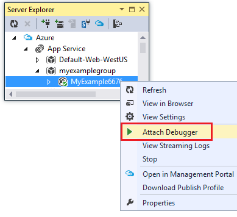
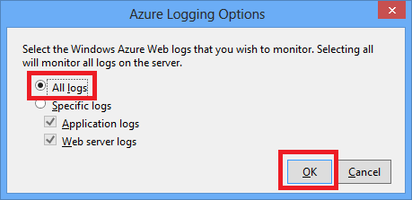
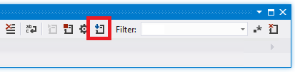
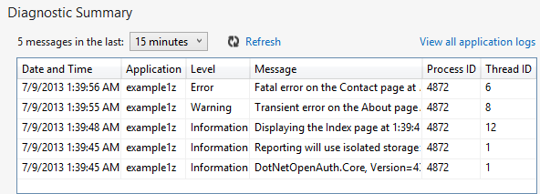

<properties 
    pageTitle="Risolvere i problemi di un'app web nel servizio di App Azure utilizzando Visual Studio" 
    description="Informazioni su come risolvere i problemi di un'app web Azure utilizzando il debug remoto, eseguire le tracce e strumenti di registrazione integrati in Visual Studio 2013." 
    services="app-service" 
    documentationCenter=".net" 
    authors="tdykstra" 
    manager="wpickett" 
    editor=""/>

<tags 
    ms.service="app-service" 
    ms.workload="na" 
    ms.tgt_pltfrm="na" 
    ms.devlang="dotnet" 
    ms.topic="article" 
    ms.date="08/29/2016" 
    ms.author="rachelap"/>

# Risolvere i problemi di un'app web nel servizio di App Azure utilizzando Visual Studio

## Panoramica

In questa esercitazione viene illustrato come utilizzare strumenti di Visual Studio che consentono di eseguire il debug di un'app web nel [Servizio App](http://go.microsoft.com/fwlink/?LinkId=529714)in esecuzione in [modalità di debug](http://www.visualstudio.com/get-started/debug-your-app-vs.aspx) in modalità remota e la visualizzazione dei registri applicazioni e log server web.

[AZURE.INCLUDE [app-service-web-to-api-and-mobile](../../includes/app-service-web-to-api-and-mobile.md)]

Si apprenderanno:

* Le funzioni di gestione di Azure web app sono disponibili in Visual Studio.
* Informazioni su come utilizzare la visualizzazione remoto Visual Studio per apportare modifiche rapidamente in un'app web remoto.
* Come eseguire la modalità di debug in modalità remota durante un progetto è in esecuzione in Azure, per un'app web e per un WebJob.
* Come creare registri traccia delle applicazioni e quindi visualizzarli durante l'applicazione sia crearli.
* Come visualizzare i log server web, ad esempio messaggi di errore dettagliati e non è possibile eseguire le tracce richiesta.
* Come inviare i registri diagnostici a un'archiviazione Azure account e quindi visualizzarli non esiste.

Se si dispone di Visual Studio Ultimate, è anche possibile utilizzare [IntelliTrace](http://msdn.microsoft.com/library/vstudio/dd264915.aspx) per il debug. IntelliTrace non viene illustrata in questa esercitazione.

## Prerequisiti

In questa esercitazione funziona con l'ambiente di sviluppo, progetto web e app web Azure che ha configurato in [Guida introduttiva a Azure e ASP.NET][GetStarted]. Per le sezioni WebJobs, è necessario dell'applicazione in cui si crea in [Guida introduttiva di Azure WebJobs SDK][GetStartedWJ].

Gli esempi di codice visualizzati in questa esercitazione sono per un'applicazione web c# MVC, ma le procedure di risoluzione dei problemi sono identici per le applicazioni di Visual Basic e moduli per Web.

L'esercitazione si presuppone che si sta utilizzando Visual Studio 2015 o 2013. Se si sta utilizzando Visual Studio 2013, le caratteristiche di WebJobs richiedono [l'aggiornamento 4](http://go.microsoft.com/fwlink/?LinkID=510314) o versione successiva. 

I registri di trasmissione caratteristica funziona solo per le applicazioni che utilizzano .NET Framework 4 o versione successiva.

## Gestione e la configurazione dell'applicazione web

Visual Studio consente di accedere a un sottoinsieme di funzioni di gestione di web app e le impostazioni di configurazione disponibili nel [Portale di Azure](http://go.microsoft.com/fwlink/?LinkId=529715). In questa sezione si noterà che cos'è disponibile tramite **Esplora Server**. Per visualizzare le caratteristiche di integrazione Azure più recenti, provare a usare **Cloud Explorer** anche. È possibile aprire entrambe le finestre dal menu **Visualizza** . 

1. Se non è già stato effettuato l'accesso a Azure in Visual Studio, fare clic sul pulsante **Connetti a Azure** in **Esplora Server**.

    In alternativa è possibile installare un certificato di gestione che consente l'accesso al proprio account. Se si sceglie di installare un certificato, rapida nodo **Azure** in **Esplora Server**e quindi fare clic su **Gestisci e le sottoscrizioni di filtro** nel menu di scelta rapida. Nella finestra di dialogo **Gestione delle sottoscrizioni di Azure** , fare clic sulla scheda **certificati** e quindi fare clic su **Importa**. Seguire le istruzioni per scaricare e quindi come importare un file di sottoscrizione (denominato anche un file. *publishsettings* ) per il proprio account Azure.

    > [AZURE.NOTE]
    > Se si scarica un file di sottoscrizione, salvarla in una cartella all'esterno di directory di codice sorgente (ad esempio, nella cartella download) e quindi eliminarla una volta completata l'importazione. Un utente non autorizzato chi può accedere ai file di sottoscrizione può modificare, creare ed eliminare il provider di servizi Azure.

    Per ulteriori informazioni sulla connessione alle risorse Azure da Visual Studio, vedere [gestire abbonamenti dei ruoli amministrativi](http://go.microsoft.com/fwlink/?LinkId=324796#BKMK_AccountVCert).

2. In **Esplora Server**espandere **Azure** e **Servizio di App**.

3. Espandere il gruppo di risorse che include l'applicazione web creata in [Guida introduttiva di Azure e ASP.NET][GetStarted], rapida nodo web app e fare clic su **Impostazioni visualizzazione**.

    

    Viene visualizzata la scheda **Azure Web App** ed è possibile visualizzare sono web app attività di gestione e configurazione che sono disponibili in Visual Studio.

    

    In questa esercitazione si inizierà a usare la registrazione e analisi elenchi a discesa. Verranno utilizzati anche il debug remoto, ma si userà un altro metodo per attivarlo.
   
    Per informazioni sulle caselle le impostazioni dell'App e stringhe di connessione in questa finestra, vedere [Azure Web Apps: come le stringhe dell'applicazione e connessione stringhe lavoro](http://blogs.msdn.com/b/windowsazure/archive/2013/07/17/windows-azure-web-sites-how-application-strings-and-connection-strings-work.aspx).

    Se si desidera eseguire un'attività di gestione app web che non può essere eseguita in questa finestra, fare clic su **aprire nel portale di gestione** per aprire una finestra del browser al portale di Azure.

## File di Access web app in Esplora Server

È in genere distribuire un progetto web con il `customErrors` contrassegno in config impostato su `On` o `RemoteOnly`, vale a dire si non riceve un messaggio di errore utili quando non funziona. Per molti errori viene visualizzato è una pagina simile a quello di quelli seguenti.

**Errore del server nell'applicazione '/':**

**Si è verificato un errore:**

**Il sito Web non è possibile visualizzare la pagina**

Il modo più semplice per individuare la causa dell'errore è spesso per attivare i messaggi di errore dettagliati, la prima le schermate precedente illustra come eseguire. Che richiede una modifica nel file config distribuito. È possibile modificare il file *config* del progetto e ridistribuire il progetto o creare un [config trasformare](http://www.asp.net/mvc/tutorials/deployment/visual-studio-web-deployment/web-config-transformations) e distribuire una build di debug ma esiste un modo più rapido: in **Esplora soluzioni** è direttamente possono visualizzare e modificare file nell'app web remoto utilizzando la funzionalità di *visualizzazione remoto* .

1. In **Esplora Server**espandere **Azure**, **Servizio di App**, il gruppo di risorse da un'applicazione web si trova in e quindi espandere il nodo per un'app web.

    Vengono mostrati i nodi che consentono di accedere ai file di dati e file di log dell'applicazione web.

2. Espandere il nodo **file** e fare doppio clic su *config* .

    

    Visual Studio apre il file config dall'app web remoto e viene visualizzato [remota] accanto al nome di file nella barra del titolo.

3. Aggiungere la riga seguente per il `system.web` elemento:

    `<customErrors mode="Off"></customErrors>`

    

4. Aggiornare il browser che viene visualizzato il messaggio di errore inutile e ora si riceve un messaggio di errore dettagliati, come nell'esempio seguente:

    

    (Errore illustrato creato aggiungendo la riga visualizzata in rosso a *Views\Home\Index.cshtml*).

Modifica del file config è solo un esempio di scenari in cui la possibilità di leggere e modificare i file in un'app web Azure rendere più semplice con la risoluzione dei problemi.

## Applicazioni web debug remote

Se il messaggio di errore dettagliato non fornisce le informazioni necessarie e non è possibile creare nuovamente l'errore in locale, un altro modo per risolvere i problemi consiste nell'eseguire in modalità di debug in modalità remota. È possibile impostare punti di interruzione, modificare memoria direttamente, scorrere codice e persino modificarne il percorso del codice. 

Il debug remoto non funziona nelle edizioni Express di Visual Studio.

In questa sezione illustra come eseguire il debug in remoto utilizzando il progetto si crea in [Guida introduttiva di Azure e ASP.NET][GetStarted].

1. Aprire il progetto web creata in [Guida introduttiva di Azure e ASP.NET][GetStarted].

1. Aprire *Controllers \ HomeController.cs*.

2. Eliminare la `About()` metodo e inserire il codice seguente nella relativa posizione.

        public ActionResult About()
        {
            string currentTime = DateTime.Now.ToLongTimeString();
            ViewBag.Message = "The current time is " + currentTime;
            return View();
        }

2. [Impostare un punto di interruzione](http://www.visualstudio.com/get-started/debug-your-app-vs.aspx) di `ViewBag.Message` riga.

1. In **Esplora soluzioni**fare clic sul progetto e fare clic su **pubblica**.

2. Nell'elenco a discesa **profilo** selezionare lo stesso profilo utilizzato in [Guida introduttiva di Azure e ASP.NET][GetStarted].

3. Fare clic sulla scheda **Impostazioni** e modificare **configurazione** per **eseguire il Debug**e quindi fare clic su **pubblica**.

    

4. Dopo la distribuzione finiture e browser si apre l'URL di Azure dell'applicazione web, chiudere il browser.

5. In **Esplora Server**destro un'app web e quindi fare clic su **Allega Debugger**. 

    

    Il browser apre automaticamente alla home page in esecuzione in Azure. Potrebbe essere necessario attendere 20 secondi o meno Azure configura automaticamente il server per il debug. Il ritardo si verifica solo la prima volta che l'esecuzione in modalità di debug in un'app web. Tutte le volte successive entro successive 48 ore quando si avvia nuovamente il debug sono sarà un ritardo.

    **Nota:** Se si dispone di eventuali problemi di avvio verrà, provare a eseguire utilizzando **Cloud Explorer** anziché **Esplora Server**.

6. Fare clic **su** nel menu.

    Visual Studio si arresta sul punto di interruzione e il codice è in esecuzione in Azure, non sul computer locale.

7. Posizionare il puntatore di `currentTime` variabile per visualizzare il valore di ora.

    

    Il tempo che viene visualizzato è l'ora del server Azure, che può essere un fuso orario diversa da quella del computer locale.

8. Immettere un nuovo valore per il `currentTime` variabili, ad esempio "In esecuzione in Azure".

5. Premere F5 per continuare a funzionare.

    La pagina dettagli in esecuzione in Azure consente di visualizzare il nuovo valore immesso nella variabile currentTime.

    

## WebJobs debug remoto

In questa sezione illustra come eseguire il debug in remoto utilizzando l'app web e project che si crea in [Guida introduttiva di Azure WebJobs SDK](websites-dotnet-webjobs-sdk.md). 

Le funzionalità illustrate in questa sezione sono disponibili solo in Visual Studio 2013 con aggiornamento 4 o versione successiva. 

Il debug remoto funziona solo con WebJobs continua. WebJobs pianificata e su richiesta non supporta il debug.

1. Aprire il progetto web creata in [Guida introduttiva di Azure WebJobs SDK][GetStartedWJ].

1. Nel progetto ContosoAdsWebJob aprire *Functions.cs*.

2. [Impostare un punto di interruzione](http://www.visualstudio.com/get-started/debug-your-app-vs.aspx) per la prima istruzione la `GnerateThumbnail` metodo.

    

1. In **Esplora soluzioni**fare clic sul progetto web (non il progetto WebJob) e fare clic su **pubblica**.

2. Nell'elenco a discesa **profilo** selezionare lo stesso profilo utilizzato in [Guida introduttiva di Azure WebJobs SDK](websites-dotnet-webjobs-sdk.md).

3. Fare clic sulla scheda **Impostazioni** e modificare **configurazione** per **eseguire il Debug**e quindi fare clic su **pubblica**.

    Visual Studio distribuisce il web e progetti WebJob e viene visualizzato il browser all'URL Azure dell'app web.

5. In **Esplora Server** espandere **Azure > App servizio > gruppo di risorse > app web > WebJobs > continua**e quindi rapida **ContosoAdsWebJob**.

7. Fare clic su **Allega Debugger**. 

    

    Il browser apre automaticamente alla home page in esecuzione in Azure. Potrebbe essere necessario attendere 20 secondi o meno Azure configura automaticamente il server per il debug. Il ritardo si verifica solo la prima volta che l'esecuzione in modalità di debug in un'app web. La volta successiva che si il debug ci sarà un ritardo, se si entro 48 ore.

6. Nel web browser che viene aperta alla home page di Contoso annunci, creare un annuncio di nuovo. 

    Creazione di un annuncio, un messaggio di coda di creato, che verrà rilevato dalla WebJob e di elaborazione. Quando SDK WebJobs chiama la funzione per elaborare il messaggio di coda, il codice raggiunto il punto di interruzione.

7. Quando verrà interrotto il punto di interruzione, è possibile esaminare e modificare i valori delle variabili mentre il programma è in esecuzione nel cloud. Nella figura seguente verrà illustrato il contenuto dell'oggetto blobInfo passato al metodo GenerateThumbnail.

    
 
5. Premere F5 per continuare a funzionare.

    Il metodo GenerateThumbnail completa creazione l'anteprima.

6. Nel browser, aggiornare la pagina di indice e viene visualizzato l'anteprima.

6. In Visual Studio, premere MAIUSC + F5 per interrompere il debug.

7. In **Esplora Server**, fare clic su **Visualizzazione Dashboard**rapida nodo ContosoAdsWebJob.

8. Accedere con le credenziali di Azure e quindi fare clic sul nome di WebJob per passare alla pagina per il WebJob. 

    

    Il Dashboard che mostra la funzione GenerateThumbnail eseguito di recente.

    (La volta successiva che si fa clic su **Visualizzazione Dashboard**, non è necessario accedere e il browser passa direttamente alla pagina per il WebJob)

9. Fare clic sul nome di funzione per visualizzare i dettagli dell'esecuzione della funzione.

    

Se la funzione [scritto registri](websites-dotnet-webjobs-sdk-storage-queues-how-to.md#logs), è possibile fare clic su **ToggleOutput** per una visione.

## Note sul debug remoto

* Non è consigliabile eseguire in modalità di debug di produzione. Se un'app web di produzione non è scalabilità a più istanze di server, il debug impedirà il server web rispondere ad altre richieste. Se si dispone di più istanze di server web, quando si allega per il debug si riceverà un'istanza casuale e non si dispone di alcun modo per garantire che le richieste di browser successivi verranno inoltrate a quell ' istanza. Inoltre, in genere non distribuire una build di debug di produzione e le ottimizzazioni del compilatore build di rilascio possono essere impossibile mostra cosa succede riga per riga nel codice sorgente. Per la risoluzione dei problemi di produzione, la risorsa migliore è applicazione web e analisi dei registri server.

* Evitare interruzioni lunghi interruzione quando remote debug. Azure considera un processo che è in sospeso per più di pochi minuti come un processo non risponde e viene chiuso.

* Mentre si esegue il debug, il server invia dati a Visual Studio, che potrebbe influire su in base alle tariffe della larghezza di banda. Per informazioni sulle tariffe della larghezza di banda, vedere [Azure prezzi](/pricing/calculator/).

* Assicurarsi che la `debug` attributo del `compilation` elemento nel file *config* è impostato su true. È impostato su true per impostazione predefinita quando si pubblica una configurazione di compilazione di debug.

        <system.web>
          <compilation debug="true" targetFramework="4.5" />
          <httpRuntime targetFramework="4.5" />
        </system.web>

* Se si trovano che verrà non è possibile eseguire codice che si desidera eseguire il debug, potrebbe essere necessario modificare l'impostazione Just My Code.  Per ulteriori informazioni, vedere [Limita allontanando Just My Code](http://msdn.microsoft.com/library/vstudio/y740d9d3.aspx#BKMK_Restrict_stepping_to_Just_My_Code).

* Quando si abilita la caratteristica di debug remota e dopo 48 ore viene automaticamente disattivata la caratteristica, viene avviato un timer nel server. Questo limite 48 ore viene eseguito per motivi di sicurezza e le prestazioni. È possibile facilmente attivare la caratteristica di nuovo le volte che si è soddisfatti. È consigliabile lasciarla disabilitato quando non esegue attivamente il debug.

* È possibile allegare manualmente verrà a qualsiasi processo, non solo processo del web app (w3wp.exe). Per ulteriori informazioni su come utilizzare la modalità di debug in Visual Studio, vedere [debug in Visual Studio](http://msdn.microsoft.com/library/vstudio/sc65sadd.aspx).

## Panoramica dei registri diagnostici

Un'applicazione ASP.NET eseguita in un'app web Azure è possibile creare i tipi di registri seguenti:

* **Registri di analisi dell'applicazione** 
  L'applicazione crea questi registri chiamando metodi della classe [System.Diagnostics.Trace](http://msdn.microsoft.com/library/system.diagnostics.trace.aspx) .
* **Log server Web** 
  Il server web crea una voce del log per ogni richiesta HTTP all'app web.
* **Messaggio di registrazione dettagliata** 
  Il server web crea una pagina HTML con informazioni aggiuntive per le richieste HTTP non riuscite (quelli che il codice di stato 400 o versione successiva). 
* **Non è riuscita registri di analisi richiesta** 
  Il server web crea un file XML con informazioni dettagliate sull'analisi per le richieste HTTP non riuscite. Il server web vengono forniti anche un file XSL per formattare il codice XML in un browser.
  
Registrazione prestazioni web app, in modo Azure offre la possibilità di abilitare o disabilitare ogni tipo di log in base alle esigenze. Per i registri di applicazione, è possibile specificare che devono essere scritte solo i registri un determinato livello di gravità. Quando si crea una nuova app web, per impostazione predefinita tutti registrazione viene disabilitato.

I registri vengono salvati i file in una cartella di *file di registro* nel file system di un'applicazione web e sono accessibili tramite FTP. Registri delle applicazioni e registri di server Web è possono anche scrivere un account di archiviazione Azure. È possibile mantenere una quantità maggiore di log in un account di archiviazione che è possibile nel file system. Si è limitato a un massimo di 100 MB di log quando si utilizza il file system. (Registri eventi di sistema di file disponibili solo per i criteri di conservazione a breve termine. Azure Elimina vecchi file di log per creare spazio per nuovi raggiunto il limite.)  

## Creare e visualizzare registri traccia delle applicazioni

In questa sezione è necessario eseguire le operazioni seguenti:

* Aggiungere le istruzioni di analisi per il progetto web creata in [Guida introduttiva a Azure e ASP.NET][GetStarted].
* Visualizzare i registri quando si esegue il progetto in locale.
* Visualizzare i registri di generazione dall'applicazione in esecuzione in Azure. 

Per informazioni su come creare applicazione si connette WebJobs, vedere [come lavorare con lo spazio di archiviazione di Azure coda usa SDK WebJobs - come scrivere i registri](websites-dotnet-webjobs-sdk-storage-queues-how-to.md#logs). Le istruzioni seguenti per la visualizzazione dei registri e controllare la modalità sono archiviati in Azure applicano anche ai registri di applicazione creati da WebJobs. 

### Aggiungere le istruzioni di analisi all'applicazione

1. Aprire *Controllers \ HomeController.cs*e sostituire il `Index`, `About`, e `Contact` metodi con il codice seguente per aggiungere `Trace` istruzioni e un `using` istruzione per `System.Diagnostics`:

        public ActionResult Index()
        {
            Trace.WriteLine("Entering Index method");
            ViewBag.Message = "Modify this template to jump-start your ASP.NET MVC application.";
            Trace.TraceInformation("Displaying the Index page at " + DateTime.Now.ToLongTimeString());
            Trace.WriteLine("Leaving Index method");
            return View();
        }
        
        public ActionResult About()
        {
            Trace.WriteLine("Entering About method");
            ViewBag.Message = "Your app description page.";
            Trace.TraceWarning("Transient error on the About page at " + DateTime.Now.ToShortTimeString());
            Trace.WriteLine("Leaving About method");
            return View();
        }
        
        public ActionResult Contact()
        {
            Trace.WriteLine("Entering Contact method");
            ViewBag.Message = "Your contact page.";
            Trace.TraceError("Fatal error on the Contact page at " + DateTime.Now.ToLongTimeString());
            Trace.WriteLine("Leaving Contact method");
            return View();
        }       

2. Aggiungere un `using System.Diagnostics;` istruzione nella parte superiore del file.
                
### Visualizzare l'output di analisi in locale

3. Premere F5 per eseguire l'applicazione in modalità di debug.

    Comunicare ascoltatore traccia predefinito scrive tutto l'output traccia nella finestra di **Output, insieme altri output di Debug** . La figura seguente viene illustrato l'output le istruzioni di analisi che sono stati aggiunti al `Index` metodo.

    

    La procedura seguente viene illustrato come visualizzare output di analisi in una pagina web, senza la compilazione in modalità di debug.

2. Aprire il file config dell'applicazione (quella si trova nella cartella del progetto) e aggiungere un `<system.diagnostics>` elemento alla fine del file prima la parentesi di chiusura `</configuration>` elemento:

        <system.diagnostics>
            <trace>
              <listeners>
                <add name="WebPageTraceListener"
                    type="System.Web.WebPageTraceListener, 
                    System.Web, 
                    Version=4.0.0.0, 
                    Culture=neutral,
                    PublicKeyToken=b03f5f7f11d50a3a" />
              </listeners>
            </trace>
          </system.diagnostics>

    Il `WebPageTraceListener` consente di visualizzare output di traccia al `/trace.axd`.

3. Aggiungere un <a href="http://msdn.microsoft.com/library/vstudio/6915t83k(v=vs.100).aspx">elemento</a> in `<system.web>` in config, come nell'esempio seguente:

        <trace enabled="true" writeToDiagnosticsTrace="true" mostRecent="true" pageOutput="false" />

3. Premere CTRL + F5 per eseguire l'applicazione.

4. Nella barra degli indirizzi della finestra del browser, aggiungere *Axd* all'URL e quindi premere INVIO (l'URL sarà simile a http://localhost:53370/trace.axd).

5. Nella pagina **Analisi applicazione** fare clic su **Visualizza dettagli** sulla prima riga (non il linea BrowserLink).

    

    Verrà visualizzata la pagina **Dettagli richiesta** e nella sezione **Informazioni di traccia** viene visualizzato l'output di istruzioni di analisi che sono stati aggiunti al `Index` metodo.

    

    Per impostazione predefinita, `trace.axd` è disponibile solo in locale. Se si desidera rendere disponibile da un'app web remoto, è possibile aggiungere `localOnly="false"` per il `trace` elemento *config, come illustrato nell'esempio seguente* :

        <trace enabled="true" writeToDiagnosticsTrace="true" localOnly="false" mostRecent="true" pageOutput="false" />

    Tuttavia, l'attivazione `trace.axd` in una produzione web app in genere non è consigliabile per motivi di sicurezza e nelle sezioni seguenti verrà visualizzato un modo più semplice per leggere i log di analisi in un'app web Azure.

### Visualizzare l'output di analisi in Azure

1. In **Esplora soluzioni**fare clic sul progetto web e fare clic su **pubblica**.

2. Nella finestra di dialogo **Pubblica sito Web** fare clic su **pubblica**.

    Dopo Visual Studio pubblica l'aggiornamento, viene aperta una finestra del browser alla home page (presupponendo che non è riuscita deselezionare **URL di destinazione** nella scheda **connessione** ).

3. In **Esplora Server**, selezionare **Visualizza i registri di flusso**rapida un'app web. 

    

    Nella finestra di **Output** viene connesso al servizio di trasmissione log e aggiunge una riga di notifica ogni minuto scontato un file di log da visualizzare.

    

4. Nella finestra del browser che mostra la home page dell'applicazione, fare clic su **contatto**.

    All'interno di alcuni secondi l'output del livello di errore individua è aggiunto il `Contact` metodo verrà visualizzato nella finestra di **Output** .

    

    Visual Studio viene visualizzato solo le tracce di livello di errore perché è l'impostazione predefinita, quando si abilita il log di controllo del servizio. Quando si crea una nuova app web Azure, la registrazione tutti è disattivata per impostazione predefinita, come illustrato quando è stata aperta la pagina impostazioni in precedenza:

    

    Tuttavia, quando è stato selezionato **Visualizza i registri di flusso**, Visual Studio modificati automaticamente **Applicazione Logging(File System)** per **errore**, ovvero i registri di livello di errore vengono segnalati. Per visualizzare tutti i registri di analisi, è possibile modificare questa impostazione per **dettagliato**. Quando si seleziona un livello di gravità inferiore di errore, vengono segnalati anche tutti i registri per gravità superiore. Pertanto quando si seleziona dettagliato, vengono visualizzate informazioni, avviso e i log degli errori.  

4. In **Esplora Server**destro web app e quindi fare clic su **Impostazioni visualizzazione** , come visto in precedenza.

5. Modificare **L'applicazione registra (File System)** in **dettaglio**e quindi fare clic su **Salva**.
 
    

6. Nella finestra del browser da cui viene ora visualizzata la pagina di **contatto** , fare clic su **Home**, quindi fare clic **su**e quindi fare clic su **contatto**.

    All'interno di alcuni secondi, nella finestra di **Output** Mostra tutti gli output di analisi.

    

    In questa sezione abilitata e disabilitata registrazione utilizzando le impostazioni dell'app web Azure. È anche possibile attivare e disattivare listener modificando config. Tuttavia, la modifica config causa il dominio app al Cestino, durante l'attivazione della registrazione tramite la configurazione di app web non farlo. Se il problema richiede molto tempo per riprodurre, o non è intermittente, riciclaggio dominio app potrebbe "correzione" e forzare è necessario attendere che si verifichi nuovamente. Attivazione della diagnostica in Azure non ripetere l'operazione, in modo che è possibile iniziare l'acquisizione di informazioni sugli errori immediatamente.

### Caratteristiche della finestra di output

Nella scheda **Log Azure** della finestra di **Output** sono diversi pulsanti e una casella di testo:

Questi eseguire le funzioni seguenti:

* Deselezionare la finestra di **Output** .
* Abilitare o disabilitare ritorno a capo automatico.
* Avviare o interrompere il monitoraggio dei log.
* Specificare dei log da controllare.
* Scaricare i registri.
* Filtrare in base a una stringa di ricerca o un'espressione regolare registri.
* Chiudere la finestra di **Output** .

Se si immette una stringa di ricerca o espressioni regolari, Visual Studio Filtra le informazioni di registrazione del client. Questo significa che è possibile immettere i criteri dopo i registri vengono visualizzati nella finestra di **Output** ed è possibile modificare i criteri di filtro senza dover rigenerare i log.

## Visualizzazione dei registri server web

Log server Web registrare tutte le attività HTTP per l'applicazione web. Per visualizzarle nella finestra di **Output** è necessario abilitarle per l'applicazione web e identificare Visual Studio che si desidera eseguire il monitoraggio delle loro. 

1. Nella scheda della **Configurazione di Azure Web App** è stato aperto da **Esplora Server**, impostare registrazione Server Web **in**e quindi fare clic su **Salva**.

    

2. Nella finestra di **Output** , fare clic sul pulsante di **specificare che Azure Registra per monitorare** .
    
    

3. Nella finestra di dialogo **Opzioni di registrazione di Azure** selezionare **log server Web**e quindi fare clic su **OK**.

    

4. Nella finestra del browser che mostra l'applicazione web, fare clic su **Home**, quindi fare clic **su**e quindi fare clic su **contatto**.

    Registri delle applicazioni in genere visualizzato primo, seguito dai registri del server web. Potrebbe essere necessario attendere un po' di tempo per visualizzare i registri. 

    

Per impostazione predefinita, quando si abilita prima log server web utilizzando Visual Studio, Azure scrive i log nel file System. In alternativa, è possibile utilizzare il portale di Azure per specificare che il server web registri devono essere scritta in un contenitore di blob in un account di archiviazione.

Se si utilizza il portale per attivare la registrazione a un account di archiviazione Azure server web e quindi disattivare la registrazione in Visual Studio, quando si attiva la registrazione in Visual Studio vengono ripristinati le impostazioni dell'account di archiviazione. 

## Visualizzare i registri di messaggio di errore dettagliato

I registri di errori dettagliate forniscono ulteriori informazioni sulle richieste HTTP che restituiscono i codici di risposta di errore (400 o versione successiva). Per visualizzarle nella finestra di **Output** , è necessario abilitarle per l'applicazione web e identificare Visual Studio che si desidera eseguire il monitoraggio delle loro.

1. Nella scheda della **Configurazione di Azure Web App** è stato aperto da **Esplora Server**, modificare **Messaggi di errore dettagliati** in **su**e quindi fare clic su **Salva**.

    

2. Nella finestra di **Output** , fare clic sul pulsante di **specificare che Azure Registra per monitorare** .

3. Nella finestra di dialogo **Opzioni di registrazione di Azure** , fare clic su **tutti i log**e quindi fare clic su **OK**.

    

4. Nella barra degli indirizzi della finestra del browser, aggiungere un carattere aggiuntivo all'URL per causare un errore 404 (ad esempio `http://localhost:53370/Home/Contactx`), quindi premere INVIO.

    Dopo alcuni secondi il log degli errori dettagliate viene visualizzato nella finestra di **Output** di Visual Studio.

    

    CTRL + clic sul collegamento per visualizzare l'output del log formattato in un browser:

    

## Scaricare i registri di sistema di file

Tutti i registri che è possibile monitorare nella finestra di **Output** possono essere inoltre scaricati come file *zip* . 

1. Nella finestra di **Output** , fare clic su **Scarica registri Streaming**.

    

    Esplora file verrà visualizzata nella cartella *download* dopo aver selezionato il file scaricato.

    

2. Estrarre il file con *estensione zip* e viene visualizzato la struttura delle cartelle seguenti:

    

    * Registri di analisi dell'applicazione *txt* nei file sono presenti nella cartella *LogFiles\Application* .
    * Log server Web *log* nei file sono presenti nella cartella *LogFiles\http\RawLogs* . È possibile usare uno strumento, ad esempio [Log Parser](http://www.microsoft.com/download/details.aspx?displaylang=en&id=24659) per visualizzare e modificare questi file.
    * Messaggio di registrazione dettagliata *HTML* nei file sono presenti nella cartella *LogFiles\DetailedErrors* .

    (La cartella *distribuzioni* sia per i file creati dal controllo origine pubblicazione; non dispone di elementi correlati alla pubblicazione di Visual Studio. La cartella *fra* è per le tracce relative al controllo origine pubblicazione e il log di servizio di trasmissione dei file.)  

## Visualizza i registri di spazio di archiviazione

Registri di analisi dell'applicazione possono essere inviati a un account di archiviazione Azure e poterli visualizzare in Visual Studio. Per eseguire operazioni che si creerà un account di archiviazione, attivare i registri di spazio di archiviazione nel portale di classica e visualizzarli nella scheda **log** della finestra di **Azure Web App** .

È possibile inviare i registri a una o tutte le tre destinazioni:

* Il file system.
* Tabelle di account di archiviazione.
* BLOB di account di archiviazione.

È possibile specificare un livello di gravità diverso per ogni destinazione. 

Tabelle semplificano la visualizzazione dei dettagli dei registri online e supportano flusso; è possibile richiedere registri nelle tabelle e vedere i registri di nuovi durante la creazione. BLOB rendono più facile per il download dei log nei file e analizzarli mediante HDInsight, poiché HDInsight sa come lavorare con archiviazione blob. Per ulteriori informazioni, vedere **Hadoop e MapReduce** in [Opzioni di archiviazione dei dati (creazione reali Cloud di applicazioni con Azure)](http://www.asp.net/aspnet/overview/developing-apps-with-windows-azure/building-real-world-cloud-apps-with-windows-azure/data-storage-options).

Sono presenti nei registri di sistema del file impostati a livello di dettaglio; la procedura seguente consentono la configurazione dei registri a livello di informazioni per passare alle tabelle di account di archiviazione. Livello di informazioni indica che tutti i log creati chiamando `Trace.TraceInformation`, `Trace.TraceWarning`, e `Trace.TraceError` verrà visualizzato, ma non i log creati chiamando `Trace.WriteLine`.

Gli account di archiviazione in più spazio di archiviazione e conservazione più a lungo per i registri rispetto al file system. Un altro vantaggio di inviare i registri di analisi dell'applicazione allo spazio di archiviazione è ottenere informazioni aggiuntive con ogni log non viene ricevuta dal file system log.

5. Destro **dello spazio di archiviazione** del nodo Azure e quindi fare clic su **Crea Account lo spazio di archiviazione**.

3. Nella finestra di dialogo **Crea Account lo spazio di archiviazione** , immettere un nome per l'account di archiviazione. 

    Il nome deve essere deve essere univoco (nessun altro account di archiviazione Azure può avere lo stesso nome). Se il nome che immesso è già in uso, si riceverà la possibilità di modificarlo.

    L'URL per accedere all'account di archiviazione sarà *{nome}*. core.windows.net. 

5. Impostare l'elenco a discesa **area o un gruppo di affinità** all'area più vicina.

    Questa impostazione specifica quale Data Center Azure conterrà l'account di archiviazione. Per questa esercitazione desiderato non è possibile fare la differenza più evidente, ma per un'app web di produzione si desidera che il server web e l'account di archiviazione da risultare nell'area stessa per ridurre a icona in base alle tariffe uscita latenza e dati. L'applicazione web (che sarà necessario creare in un secondo momento) deve essere eseguita in un'area più vicino possibile al browser accesso a un'applicazione web per ridurre al minimo la latenza.

6. Impostare l'elenco a discesa **replica** **ridondanti in locale**. 

    Quando la replica geografico è abilitata per un account di archiviazione, il contenuto archiviato è replicato in un Data Center secondario per abilitare il controllo a tale posizione in caso di problemi principali nella finestra principale di posizione. La replica geografico può comportare costi aggiuntivi. Per gli account di prova e lo sviluppo, in genere non si vuole pagare replica geografico. Per ulteriori informazioni, vedere [creare, gestire, o eliminare un account di archiviazione](../storage-create-storage-account/#replication-options).

5. Fare clic su **Crea**. 

      

1. Nella finestra di Visual Studio **Azure Web App** , fare clic sulla scheda **log** e quindi fare clic su **Configurare la registrazione nel portale di gestione**.

    <!-- todo:screenshot of new portal if the VS page link goes to new portal -->
    

    Verrà aperta la scheda **Configura** nel portale di classico per un'app web.

2. Nella scheda **Configura** del portale classica, scorrere fino alla sezione diagnostica applicazione e quindi modificare **Applicazione registrazione (tabella archiviazione)** su **On**.

3. Modificare il **livello di registrazione** alle **informazioni**.

4. Fare clic su **Gestisci servizio di archiviazione tabelle**.

    

    Nella finestra di **gestione di archiviazione per la diagnostica delle applicazioni** , è possibile scegliere l'account di archiviazione se si usano più monitor. Creare una nuova tabella o utilizzarne uno esistente.

    

6. Nella finestra di **gestione di archiviazione per la diagnostica delle applicazioni** fare clic sul segno di spunta per chiudere la finestra di dialogo.

6. Nella scheda **Configura** del portale classica, fare clic su **Salva**.

7. Nella finestra del browser che consente di visualizzare l'applicazione web app, fare clic su **Home**, quindi fare clic **su**e quindi fare clic su **contatto**.

    Le informazioni di registrazione prodotte sfogliando le pagine web verranno scritti account di archiviazione.

8. Nella scheda **log** della finestra di **Azure Web App** in Visual Studio, fare clic su **Aggiorna** in **Riepilogo diagnostica**.

    

    La sezione di **Riepilogo diagnostica** Mostra registri per ultimi 15 minuti per impostazione predefinita. È possibile modificare il periodo per visualizzare ulteriori registri. 

    (Se viene visualizzato un errore di "tabella non trovata", verificare esplorato le pagine in cui eseguire la traccia dopo l'abilitazione **Dell'applicazione registrazione (archiviazione)** e dopo avere fatto clic **salvare**.)

    

    Si noti che in questa visualizzazione **ID processo** e **Thread ID** per ogni registro non viene ricevuta nei registri di sistema di file. È possibile visualizzare i campi aggiuntivi visualizzando direttamente nella tabella di archiviazione Azure.

8. Fare clic su **Visualizza tutti i registri di applicazione**.

    La tabella di log di analisi viene visualizzata nel Visualizzatore della tabella di archiviazione Azure.
   
    (Se viene visualizzato un errore di "sequenza non contiene elementi", aprire **Esplora Server**, espandere il nodo per l'account di archiviazione nodo **Azure** rapida **tabelle** e fare clic su **Aggiorna**.)

    

    Questa visualizzazione Mostra campi aggiuntivi che non è presente in altre visualizzazioni. Questa visualizzazione consente di filtrare registri tramite l'interfaccia utente di generatore di Query speciale per la creazione di una query. Per ulteriori informazioni, vedere Utilizzo delle risorse tabella - filtro entità [Esplorazione dello spazio di archiviazione risorse con Esplora Server](http://msdn.microsoft.com/library/ff683677.aspx).

7. Per esaminare i dettagli di una sola riga, fare doppio clic su una delle righe.

    

## Visualizzare i log di analisi richiesta non riuscita

Registri di analisi richiesta non riuscita sono utili quando è necessario conoscere i dettagli di come IIS gestisce una richiesta HTTP, in scenari, ad esempio problemi di autenticazione o riscrittura URL. 

App web Azure utilizzare la stessa funzionalità di analisi richiesta non riuscita che è stato disponibile con IIS 7.0 e versioni successive. Accesso alle impostazioni di IIS che consentono di configurare gli errori di ottenere collegati, tuttavia non si dispone. Quando si attiva l'analisi richiesta non riuscita, vengono acquisiti tutti gli errori. 

È possibile abilitare questa funzionalità, utilizzando Visual Studio, ma non possono essere visualizzati in Visual Studio. Questi file di log sono file XML. Il servizio di log flusso controlla solo i file che sono considerati leggibili in modalità testo normale: file *con estensione txt*, *HTML*e *. log* .

È possibile visualizzare i registri di analisi richiesta non riuscita in un browser direttamente tramite FTP o in locale dopo l'utilizzo di uno strumento FTP scaricarli nel computer locale. In questa sezione è possibile visualizzarli in un browser direttamente.

1. Nella scheda **configurazione** della finestra di **Azure Web App** che è stato aperto da **Esplora Server**, modificare **Failed Request Tracing** in **su**e quindi fare clic su **Salva**.

    

4. Nella barra degli indirizzi della finestra del browser che mostra l'applicazione web, aggiungere un carattere aggiuntivo all'URL e premere INVIO per causare un errore 404.

    In questo modo un log di analisi richiesta non riuscita la creazione e la procedura seguente viene illustrato come visualizzare o scaricare il log.

2. In Visual Studio, nella scheda **configurazione** della finestra di **Azure Web App** , fare clic su **Apri nel portale di gestione**.

3. Nel [Portale di Azure](https://portal.azure.com) **Impostazioni** pala per un'app web, fare clic su **credenziali di distribuzione**e quindi immettere un nuovo nome utente e la password.

    

    * * Quando si accede, è necessario utilizzare il nome utente completa con il nome dell'app web è. Ad esempio, se si immette "MioID" come nome utente e il sito è "myexample", l'accesso come "myexample\myid".

5. In una nuova finestra del browser, passare all'URL visualizzato sotto **hostname FTP** o **FTPS hostname** nella e **Web App** per un'app web. 

6. Accedere usando le credenziali FTP creato in precedenza (incluso il prefisso del nome web app per il nome utente).

    Il browser visualizza la cartella principale dell'applicazione web.

6. Aprire la cartella di *file di registro* .

    

7. Aprire la cartella in cui viene assegnata un valore numerico più W3SVC.

    

    La cartella contiene i file XML per eventuali errori che sono stati eseguiti dopo che è attivata l'analisi richiesta non riuscita e un file XSL da un browser è possibile utilizzare per formattare i dati XML.

    

8. Fare clic su file XML per la richiesta non riuscita che si desidera visualizzare informazioni di analisi per.

    L'illustrazione seguente mostra parte delle informazioni di analisi per un errore di esempio.

    

## Passaggi successivi

È stato illustrato come Visual Studio facilmente visualizzare i log creati da un'app web Azure. Nelle sezioni seguenti sono disponibili collegamenti a ulteriori risorse su argomenti correlati:

* Risoluzione dei problemi di Azure web app
* Debug in Visual Studio 
* Debug in Azure remoto
* Individua nelle applicazioni ASP.NET
* Analisi dei registri del server web
* Analisi dei registri di analisi richiesta non riuscita
* Il debug di servizi Cloud

### Risoluzione dei problemi di Azure web app

Per ulteriori informazioni sulla risoluzione dei problemi di App web di Azure App servizio, vedere le risorse seguenti:

* [Come eseguire il monitoraggio delle applicazioni web](/manage/services/web-sites/how-to-monitor-websites/)
* [In analisi memoria in applicazioni Web Azure con Visual Studio 2013](http://blogs.msdn.com/b/visualstudioalm/archive/2013/12/20/investigating-memory-leaks-in-azure-web-sites-with-visual-studio-2013.aspx). Post di blog di Microsoft ALM sulle caratteristiche di Visual Studio per l'analisi dei problemi relativi alla memoria gestita.
* [Strumenti online App web azure che è necessario conoscere](/blog/2014/03/28/windows-azure-websites-online-tools-you-should-know-about-2/). Post di blog Amit Apple.

Per assistenza con una domanda di risoluzione dei problemi specifica, avviare un thread in uno dei forum elencati di seguito:

* [Forum di Azure nel sito ASP.NET](http://forums.asp.net/1247.aspx/1?Azure+and+ASP+NET).
* [Azure nel forum su MSDN](http://social.msdn.microsoft.com/Forums/windowsazure/).
* [StackOverflow.com](http://www.stackoverflow.com).

### Debug in Visual Studio 

Per ulteriori informazioni su come utilizzare la modalità di debug in Visual Studio, vedere MSDN il [debug in Visual Studio](http://msdn.microsoft.com/library/vstudio/sc65sadd.aspx) e [Suggerimenti per il debug con Visual Studio 2010](http://weblogs.asp.net/scottgu/archive/2010/08/18/debugging-tips-with-visual-studio-2010.aspx).

### Debug in Azure remoto

Per ulteriori informazioni sul debug remoto per Azure web apps e WebJobs, vedere le risorse seguenti:

* [Introduzione a Remote Debug Azure App servizio Web Apps](/blog/2014/05/06/introduction-to-remote-debugging-on-azure-web-sites/).
* [Introduzione alla Remote Debug Azure App servizio Web App part 2 - all'interno il debug remoto](/blog/2014/05/07/introduction-to-remote-debugging-azure-web-sites-part-2-inside-remote-debugging/)
* [Introduzione al debug remoto sulla parte Azure App servizio Web Apps 3 - ambiente di più istanze e fra](/blog/2014/05/08/introduction-to-remote-debugging-on-azure-web-sites-part-3-multi-instance-environment-and-git/)
* [WebJobs debug (video)](https://www.youtube.com/watch?v=ncQm9q5ZFZs&list=UU_SjTh-ZltPmTYzAybypB-g&index=1)

Se è necessario eseguire il debug che un'applicazione web utilizza un back-end API Web Azure o servizi mobili, vedere [Debug back-end .NET in Visual Studio](http://blogs.msdn.com/b/azuremobile/archive/2014/03/14/debugging-net-backend-in-visual-studio.aspx).

### Individua nelle applicazioni ASP.NET

Sono non disponibili introduzioni completa e aggiornate per l'analisi di ASP.NET su Internet. I migliori è possibile eseguire è Guida introduttiva a materiali introduttivi vecchi scritti per moduli per Web perché MVC non esiste ancora e che completano con blog più recente post incentrate su problemi specifici. Buone dove iniziare sono le risorse seguenti:

* [Monitoraggio e telemetria (creazione di applicazioni reali Cloud con Azure)](http://www.asp.net/aspnet/overview/developing-apps-with-windows-azure/building-real-world-cloud-apps-with-windows-azure/monitoring-and-telemetry).  Capitolo E libro con suggerimenti per l'analisi in applicazioni cloud Azure.
* [Analisi ASP.NET](http://msdn.microsoft.com/library/ms972204.aspx) 
  Vecchio ma comunque un'ottima risorsa per un'introduzione all'oggetto.
* [Listener](http://msdn.microsoft.com/library/4y5y10s7.aspx) 
  Informazioni sui listener ma non menzionare [WebPageTraceListener](http://msdn.microsoft.com/library/system.web.webpagetracelistener.aspx).
* [Procedura dettagliata: Integrazione analisi ASP.NET all'analisi Diagnostics](http://msdn.microsoft.com/library/b0ectfxd.aspx) 
  Questo troppo vecchio, ma include alcune informazioni aggiuntive non copre l'articolo introduttivo.
* [Individua nelle visualizzazioni Razor ASP.NET MVC](http://blogs.msdn.com/b/webdev/archive/2013/07/16/tracing-in-asp-net-mvc-razor-views.aspx) 
  Oltre a eseguire le tracce nelle visualizzazioni Razor, il post anche spiegato come creare un filtro di errore per registrare tutte le eccezioni non gestite in un'applicazione MVC. Per informazioni su come registrare tutte le eccezioni non gestite in un'applicazione Web Form, vedere l'esempio asax di [Esempio completo per gestori di errori](http://msdn.microsoft.com/library/bb397417.aspx) su MSDN. In MVC o moduli per Web, se si desidera registrare alcune eccezioni ma lascia il framework predefinito gestisce abbia effetto, è possibile intercettare e rigenerare come illustrato nell'esempio seguente:

        try
        {
           // Your code that might cause an exception to be thrown.
        }
        catch (Exception ex)
        {
            Trace.TraceError("Exception: " + ex.ToString());
            throw;
        } 

* [Trasmissione la traccia di diagnostica registrazione dalla riga di comando Azure (più panoramica!)](http://www.hanselman.com/blog/StreamingDiagnosticsTraceLoggingFromTheAzureCommandLinePlusGlimpse.aspx) 
  Come utilizzare la riga di comando per eseguire quali questa esercitazione viene illustrato come eseguire in Visual Studio. [Panoramica](http://www.hanselman.com/blog/IfYoureNotUsingGlimpseWithASPNETForDebuggingAndProfilingYoureMissingOut.aspx) è uno strumento per il debug di applicazioni ASP.NET. 
* [Uso di App Web registrazione e diagnostica - con David Ebbo](/documentation/videos/azure-web-site-logging-and-diagnostics/) e [registri delle flussi da Web Apps - con David Ebbo](/documentation/videos/log-streaming-with-azure-web-sites/) 
  Video Scott Hanselman e David Ebbo.

Per la registrazione degli errori, un'alternativa alla scrittura di codice di analisi consiste nell'usare una struttura di registrazione Apri origine, ad esempio [ELMAH](http://nuget.org/packages/elmah/). Per ulteriori informazioni, vedere [di Scott Hanselman post di blog su ELMAH](http://www.hanselman.com/blog/NuGetPackageOfTheWeek7ELMAHErrorLoggingModulesAndHandlersWithSQLServerCompact.aspx).

Si noti inoltre che non è necessario utilizzare ASP.NET o Diagnostics individua se si desidera ottenere streaming registri comuni. Flusso di qualsiasi file *con estensione txt*, *HTML*o *log* che si trova nella cartella di *file di registro* verrà eseguito il servizio di registro flusso Azure web app. Di conseguenza, è possibile creare il proprio sistema di registrazione che scrive nel file System di web app e i file verrà automaticamente in streaming e scaricato. È necessario effettuare è scrivere il codice di applicazione che consente di creare file nella cartella *d:\home\logfiles* . 

### Analisi dei registri del server web

Per ulteriori informazioni sull'analisi dei registri del server web, vedere le risorse seguenti:

* [LogParser](http://www.microsoft.com/download/details.aspx?id=24659) 
  Strumento per la visualizzazione di dati nei log server web (file di*log* ).
* [Risoluzione dei problemi di prestazioni di IIS o gli errori dell'applicazione tramite LogParser](http://www.iis.net/learn/troubleshoot/performance-issues/troubleshooting-iis-performance-issues-or-application-errors-using-logparser) 
  Introduzione allo strumento Log Parser che è possibile utilizzare per l'analisi dei registri del server web.
* [Post di blog da Robert McMurray tramite LogParser](http://blogs.msdn.com/b/robert_mcmurray/archive/tags/logparser/) 
* [Il codice di stato HTTP in IIS 7.0, IIS 7.5 e IIS 8.0](http://support.microsoft.com/kb/943891)

### Analisi dei registri di analisi richiesta non riuscita

Nel sito Web Microsoft TechNet include una sezione [Using Failed Request Tracing](http://www.iis.net/learn/troubleshoot/using-failed-request-tracing) che può essere utile per comprendere come utilizzare questi file di log. Tuttavia, l'attenzione principalmente sulla configurazione dell'analisi richiesta non riuscita in IIS, non è possibile eseguire in Azure Web Apps.

[GetStarted]: web-sites-dotnet-get-started.md
[GetStartedWJ]: websites-dotnet-webjobs-sdk.md
 
