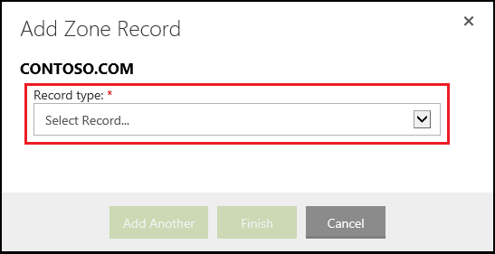

<properties
    pageTitle="Configurare un nome di dominio personalizzato nel servizio di App Azure (GoDaddy)"
    description="Informazioni su come usare un nome di dominio da go Daddy con Azure Web Apps"
    services="app-service"
    documentationCenter=""
    authors="erikre"
    manager="wpickett"
    editor="jimbe"/>

<tags
    ms.service="app-service"
    ms.workload="na"
    ms.tgt_pltfrm="na"
    ms.devlang="na"
    ms.topic="article"
    ms.date="01/12/2016"
    ms.author="cephalin"/>

# Configurare un nome di dominio personalizzato nel servizio di App Azure (acquistato direttamente da GoDaddy)

[AZURE.INCLUDE [web-selector](../../includes/websites-custom-domain-selector.md)]

[AZURE.INCLUDE [intro](../../includes/custom-dns-web-site-intro.md)]

Se è stato acquistato dominio tramite Azure App servizio Web Apps fare riferimento al passaggio finale [dell'Acquisto di dominio per le applicazioni Web](custom-dns-web-site-buydomains-web-app.md).

In questo articolo vengono fornite istruzioni sull'uso di un nome di dominio personalizzato che è stato acquistato direttamente da [GoDaddy](https://godaddy.com) a [App servizio Web Apps](http://go.microsoft.com/fwlink/?LinkId=529714).

[AZURE.INCLUDE [introfooter](../../includes/custom-dns-web-site-intro-notes.md)]

##Informazioni sui record DNS

[AZURE.INCLUDE [understandingdns](../../includes/custom-dns-web-site-understanding-dns-raw.md)]

## Aggiungere un record DNS per il dominio personalizzato

Per associare il dominio personalizzato a un'app web nel servizio di App, è necessario aggiungere una nuova voce nella tabella DNS per il dominio personalizzato con gli strumenti disponibili in configurazione di GoDaddy. Utilizzare la procedura seguente per individuare gli strumenti DNS per GoDaddy.com

1. Accedere al proprio account con GoDaddy.com e selezionare **Account personale** e **gestire i domini**. Infine, selezionare il menu a discesa per il nome di dominio che si desidera utilizzare con l'app web Azure e selezionare **Gestione DNS**.

    

2. Nella pagina **Dettagli dominio** , scorrere fino alla scheda **File di zona DNS** . Verrà visualizzata la sezione utilizzata per aggiungere e modificare i record DNS per il nome di dominio.

    

    Selezionare **Aggiungi Record** per aggiungere un record esistente.

    Per **modificare** un record esistente, selezionare l'icona penna e carta accanto al record.

    > [AZURE.NOTE] Prima di aggiungere nuovi record, tenere presente che GoDaddy è già creato i record DNS per popolari sottodomini (denominati **Host** nell'editor), ad esempio **posta elettronica**, **i file**, **posta elettronica**e altri utenti. Se il nome che si desidera utilizzare è già presente, modificare il record esistente anziché crearne uno nuovo.

4. Quando si aggiunge un record, è innanzitutto necessario selezionare il tipo di record.

    

    Successivamente, è necessario specificare l' **Host** (il dominio personalizzato o un sottodominio) e quello a cui **punta a**.

    

    * Quando si aggiunge un **record (host)** - è necessario impostare il campo **Host** su, **@** (rappresenta nome di dominio radice, ad esempio **contoso.com**) *(un carattere jolly per la corrispondenza di più sottodomini,) o il sottodominio che si desidera utilizzare (ad esempio * *www**.) È necessario impostare il * *puntamento** campo all'indirizzo IP di un'applicazione web Azure.

    * Quando si aggiunge un **record CNAME (alias)** - è necessario impostare il campo **Host** per il sottodominio che si desidera utilizzare. Ad esempio **www**. È necessario impostare il campo **punta a** il **. azurewebsites.net** nome di dominio dell'applicazione web Azure. Ad esempio **contoso.azurewebsites.net**.

5. Fare clic su **Aggiungi un altro**.
6. Selezionare **TXT** come tipo di record, quindi specificare il valore **Host** **@** e il valore **Points to** ** &lt;yourwebappname&gt;. azurewebsites.net**.

    > [AZURE.NOTE] Questo record TXT è utilizzato da Azure per convalidare cui si è proprietari del dominio descritto per il record a o il primo record TXT. Dopo il dominio è stato mappato all'app web nel portale di Azure, è possibile rimuovere questa voce di record TXT.

5. Quando sono state aggiunte o la modifica di record, fare clic su **Fine** per salvare le modifiche.

## Abilitare il nome di dominio in un'applicazione web

[AZURE.INCLUDE [modes](../../includes/custom-dns-web-site-enable-on-web-site.md)]

>[AZURE.NOTE] Se si desidera iniziare a utilizzare il servizio di App Azure prima di iscriversi a un account Azure, accedere al [Servizio App provare](http://go.microsoft.com/fwlink/?LinkId=523751), in cui è possibile creare immediatamente un'app web starter breve nel servizio di App. Nessun carte di credito obbligatorio; Nessun impegni.

## Novità
* Per una Guida per la modifica da siti Web al servizio App vedere: [servizio App Azure e il relativo impatto sulla esistente servizi di Windows Azure](http://go.microsoft.com/fwlink/?LinkId=529714)
