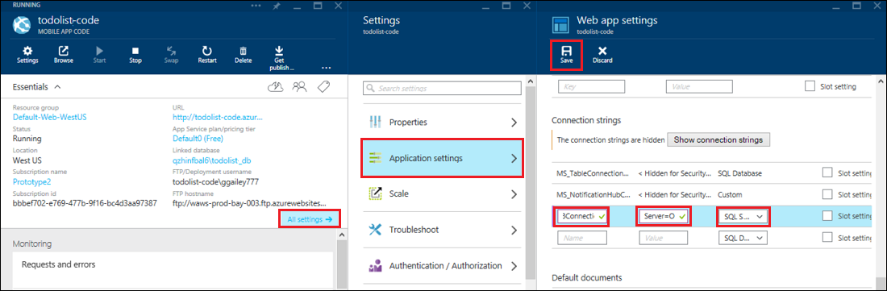

<properties 
    pageTitle="Accedere alle risorse locali con le connessioni ibrido nel servizio App Azure" 
    description="Creare una connessione tra un'app web nel servizio App Azure e una risorsa locale che utilizza una porta TCP statica" 
    services="app-service" 
    documentationCenter="" 
    authors="cephalin" 
    manager="wpickett" 
    editor="mollybos"/>

<tags 
    ms.service="app-service" 
    ms.workload="na" 
    ms.tgt_pltfrm="na" 
    ms.devlang="na" 
    ms.topic="article" 
    ms.date="02/03/2016" 
    ms.author="cephalin"/>

#Accedere alle risorse locali con le connessioni ibrido nel servizio App Azure

È possibile connettersi a un'applicazione di servizio App Azure a qualsiasi risorsa locale che utilizza una porta TCP statica, ad esempio SQL Server, MySQL, API Web HTTP e la maggior parte dei servizi Web personalizzati. In questo articolo viene illustrato come creare una connessione ibrido tra App servizio e un database di SQL Server locale.

> [AZURE.NOTE] La parte Web Apps della caratteristica connessioni ibrida è disponibile solo nel [Portale di Azure](https://portal.azure.com). Per creare una connessione in BizTalk Services, vedere [Distribuzione ibrida connessioni](http://go.microsoft.com/fwlink/p/?LinkID=397274). 
> 
> App Mobile in Azure App servizio riguarda anche il contenuto. 

## Prerequisiti
- Un abbonamento Azure. Per una sottoscrizione gratuita, vedere [Versione di valutazione gratuita di Azure](https://azure.microsoft.com/pricing/free-trial/). 
 
    Se si desidera iniziare a utilizzare il servizio di App Azure prima di iscriversi a un account Azure, accedere al [Servizio App provare](http://go.microsoft.com/fwlink/?LinkId=523751), in cui è possibile creare immediatamente un'app web starter breve nel servizio di App. Nessun carte di credito obbligatorio; Nessun impegni.

- Per utilizzare un database di SQL Server o SQL Server Express locale con una connessione ibrida, è necessario attivare una porta statica TCP/IP. Perché utilizza porta statica 1433, è consigliabile utilizzare un'istanza predefinita in SQL Server. Per informazioni sull'installazione e configurazione di SQL Server Express per l'utilizzo con le connessioni ibride, vedere [connessione a un Server SQL locale da un sito web Azure tramite connessioni ibrida](http://go.microsoft.com/fwlink/?LinkID=397979).

- Il computer in cui si installa l'agente di gestione connessione ibrido locale descritto più avanti in questo articolo:

    - Deve essere in grado di connettersi a Azure su porta 5671
    - Deve essere in grado di raggiungere *hostname*:*numero porta* della risorsa locale. 

> [AZURE.NOTE] La procedura descritta in questo articolo presuppone che si sta utilizzando il browser dal computer in cui verrà installato l'agente di connessione ibrido locale.

## Creare un'app web nel portale di Azure ##

> [AZURE.NOTE] Se è già stato creato un web app o back-end App Mobile nel portale di Azure che si desidera utilizzare per questa esercitazione, è possibile passare a [creare una connessione ibrida e un servizio BizTalk](#CreateHC) e iniziare da.

1. Nell'angolo superiore sinistro del [Portale di Azure](https://portal.azure.com), fare clic su **Nuovo** > **Web + Mobile** > **Web App**.
    
    ![Nuova web app][NewWebsite]
    
2. Nella e **Web app** , specificare un URL e fare clic su **Crea**. 
    
    ![Nome del sito Web][WebsiteCreationBlade]
    
3. Dopo alcuni secondi, viene creato il web app e viene visualizzato il relativo blade app web. E il è un dashboard in senso verticale scorrevole che consente di gestire il sito.
    
    ![Sito Web in esecuzione][WebSiteRunningBlade]
    
4. Per verificare che il sito è attivo, è possibile fare clic sull'icona **Sfoglia** per visualizzare la pagina predefinita.
    
    ![Fare clic su Sfoglia per visualizzare un'applicazione web][Browse]
    
    ![Pagina di app web predefinita][DefaultWebSitePage]
    
Successivamente, è necessario creare una connessione ibrida e un servizio BizTalk per l'applicazione web.

## Creare una connessione ibrida e un servizio BizTalk ##

1. In blade l'app web fare clic su **tutte le impostazioni** > **rete** > **configurare l'endpoint di connessione ibrida**.
    
    ![Connessioni ibrido][CreateHCHCIcon]
    
2. Scegliere **Aggiungi**e il connessioni ibrida.
    
    <!-- ![Add a hybrid connnection][CreateHCAddHC]
-->
    
3. Verrà visualizzata e **l'aggiungere una connessione ibrida** .  Poiché si tratta la connessione ibrido prima, contenuta viene selezionata l'opzione **nuova connessione ibrida** ed e il **connessione ibrido crea** verrà visualizzata.
    
    ![Creare una connessione ibrido][TwinCreateHCBlades]
    
    In **blade di creare ibrido connessione**:
    - Per **nome**specificare un nome per la connessione.
    - Per **nome host**, immettere il nome del computer locale che ospita la risorsa.
    - Per **porta**, immettere il numero di porta che la risorsa locale utilizza (1433 per un'istanza predefinita di SQL Server).
    - Fare clic su **servizio parlare con le aziende**

4. Verrà visualizzata e il **Servizio BizTalk creare** . Immettere un nome per il servizio BizTalk e quindi fare clic su **OK**.
    
    ![Creare servizio BizTalk][CreateHCCreateBTS]
    
    Viene chiusa e il **Servizio BizTalk creare** e vengono restituiti a e il **connessione ibrido crea** .
    
5. In e il connessione ibrido crea, fare clic su **OK**. 
    
    ![Fare clic su OK][CreateBTScomplete]
    
6. Al termine del processo, area di notifica nel portale informa che la connessione è stata creata.
    <!---TODO

    Tutti gli elementi non riesce in questo passaggio. Non è possibile creare un servizio BizTalk nel portale di dogfood. Dopo passare al portale di classico (completo portale) creato il servizio BizTalk ma non funziona per consentire la connessione, dopo aver il passaggio di conn ibrido crea, viene visualizzato il seguente errore Impossibile creare connessione ibrido RelecIoudHC. Impossibile trovare il tipo di risorsa 'Microsoft.BizTaIkServices per api versione 2014-06-01' dello spazio dei nomi.
    
    L'errore indica che non è stato individuazione del tipo di non all'istanza.
    ![Notifica di completamento][CreateHCSuccessNotification]
    -->
7. In blade dell'applicazione web, l'icona di **connessioni ibrido** verrà visualizzato che 1 ibrido connessione è stata creata.
    
    ![Connessione di una distribuzione ibrida creata][CreateHCOneConnectionCreated]
    
A questo punto è stata completata una parte importante dell'infrastruttura cloud ibrida connessione. Creare quindi una parte locale corrispondente.

## Installare la gestione di connessione ibrido locale per completare la connessione ##

1. In blade dell'applicazione web, fare clic su **tutte le impostazioni** > **rete** > **configurare l'endpoint di connessione ibrida**. 
    
    ![Icona connessioni ibrido][HCIcon]
    
2. In e il **connessioni ibrido** nella colonna **stato** per l'endpoint aggiunto Mostra **non è connesso**. Fare clic sulla connessione per configurarlo.
    
    ![Non è connesso][NotConnected]
    
    Verrà visualizzata e il connessione ibrida.
    
    ![NotConnectedBlade][NotConnectedBlade]
    
3. Scegliere **Il programma di installazione di comunicare ascoltatore**e il.
    
    ![Fare clic su Imposta comunicare ascoltatore][ClickListenerSetup]
    
4. Verrà visualizzata e il **Proprietà connessione ibrida** . In **Gestione connessione ibrido locale**, scegliere **fare clic qui per installare**.
    
    ![Fare clic qui per installare][ClickToInstallHCM]
    
5. Nella finestra di avviso per la sicurezza eseguire l'applicazione scegliere **Esegui** per continuare.
    
    ![Scegliere Esegui per continuare][ApplicationRunWarning]
    
6.  Nella finestra di dialogo **Controllo dell'Account utente** , scegliere **Sì**.
    
    ![Scegliere Sì][UAC]
    
7. La gestione di connessione ibrido viene scaricata e installata automaticamente. 
    
    ![L'installazione][HCMInstalling]
    
8. Dopo avere completato l'installazione, fare clic su **Chiudi**.
    
    ![Fare clic su Chiudi][HCMInstallComplete]
    
    In e il **connessioni ibrido** nella colonna **stato** verrà visualizzato **connesso**. 
    
    ![Allo stato di connessione][HCStatusConnected]

Ora che l'infrastruttura di connessione ibrida è stata completata, è possibile creare un'applicazione ibrida che lo utilizza. 

>[AZURE.NOTE]Nelle sezioni seguenti viene illustrato come utilizzare una connessione ibrido con un progetto di back-end .NET App Mobile.

## Configurare il progetto di back-end .NET App Mobile per connettersi al database SQL Server

Nel servizio App un progetto di back-end .NET App Mobile è sufficiente un'app web ASP.NET con un'app di Mobile aggiuntive SDK installato e inizializzato. Per utilizzare un'applicazione web come un back-end App Mobile, è necessario [scaricare e inizializzare back-end Mobile app .NET SDK](../app-service-mobile/app-service-mobile-dotnet-backend-how-to-use-server-sdk.md#install-sdk).  

Per le App per dispositivi mobili, è necessario definire una stringa di connessione per il database locale e modificare back-end per utilizzare questa connessione. 

1. In Esplora soluzioni in Visual Studio, aprire il file config per il back-end Mobile App .NET, individuare la sezione **connectionStrings** , aggiungere una nuova voce SqlClient simile alla seguente, che punta al database di SQL Server locale:

        <add name="OnPremisesDBConnection"
         connectionString="Data Source=OnPremisesServer,1433;
         Initial Catalog=OnPremisesDB;
         User ID=HybridConnectionLogin;
         Password=<**secure_password**>;
         MultipleActiveResultSets=True"
         providerName="System.Data.SqlClient" />

    Ricordarsi di sostituire `<**secure_password**>` in questa stringa con la password creata per *HybridConnectionLogin*.

3. Fare clic su **Salva** in Visual Studio per salvare il file config.

    > [AZURE.NOTE]Questa impostazione della connessione viene utilizzato durante l'esecuzione del computer locale. Durante l'esecuzione in Azure, questa impostazione è esegue l'override l'impostazione di connessione definita nel portale.

4. Espandere la cartella **modelli** e aprire il file di modello di dati, che termina con *Context.cs*.

6. Modificare il costruttore istanza **DbContext** per passare il valore `OnPremisesDBConnection` al costruttore **DbContext** base, come il frammento di codice seguente:

        public class hybridService1Context : DbContext
        {
            public hybridService1Context()
                : base("OnPremisesDBConnection")
            {
            }
        }

    Il servizio verrà utilizzata la nuova connessione al database di SQL Server.

## Aggiornare il back-end App Mobile per utilizzare la stringa di connessione locale

È necessario aggiungere un'impostazione di app per la nuova stringa di connessione in modo che può essere utilizzato da Azure.  

1. Nel [portale di Azure](https://portal.azure.com) nel codice di back-end web app per l'App Mobile, fare clic su **tutte le impostazioni**e quindi **Impostazioni applicazione**.

3. In e **l'impostazioni Web app** , scorrere fino a **stringhe di connessione** e aggiungere una nuova stringa di connessione di **SQL Server** denominata `OnPremisesDBConnection` con un valore come `Server=OnPremisesServer,1433;Database=OnPremisesDB;User ID=HybridConnectionsLogin;Password=<**secure_password**>`.

    Sostituire `<**secure_password**>` con la password di protezione per il database locale.

    

2. Premere **Salva** per salvare la connessione ibrida e una stringa di connessione che appena creata.

A questo punto è possibile pubblicare di nuovo il progetto server e provare la nuova connessione con i clienti di App Mobile esistenti. Dati verranno leggere e scritti il database locale usando la connessione ibrido.

## Passaggi successivi ##

- Per informazioni sulla creazione di un'applicazione web ASP.NET che utilizza una connessione ibride, vedere [connessione a un Server SQL locale da un sito web Azure tramite connessioni ibrida](http://go.microsoft.com/fwlink/?LinkID=397979). 

### Risorse aggiuntive

[Cenni preliminari sulle connessioni ibrido](http://go.microsoft.com/fwlink/p/?LinkID=397274)

[Josh Twist introduce connessioni ibrido (video Channel 9)](http://channel9.msdn.com/Shows/Azure-Friday/Josh-Twist-introduces-hybrid-connections)

[Sito web di connessioni ibrido](https://azure.microsoft.com/services/biztalk-services/)

[BizTalk Services: Schede di Dashboard, Monitor, scala, configurare e connessione ibrido](../biztalk-services/biztalk-dashboard-monitor-scale-tabs.md)

[Creazione di un Cloud ibrida reali con perfetta applicazione portabilità (9 canale video)](http://channel9.msdn.com/events/TechEd/NorthAmerica/2014/DCIM-B323#fbid=)

[Connettersi a un Server SQL locale da servizi di dispositivi mobili Windows Azure con le connessioni ibrido (video Channel 9)](http://channel9.msdn.com/Series/Windows-Azure-Mobile-Services/Connect-to-an-on-premises-SQL-Server-from-Azure-Mobile-Services-using-Hybrid-Connections)

## Novità
* Per una Guida per la modifica da siti Web al servizio App vedere: [servizio App Azure e il relativo impatto sulla esistente servizi di Windows Azure](http://go.microsoft.com/fwlink/?LinkId=529714)

<!-- IMAGES -->
[New]:./media/web-sites-hybrid-connection-get-started/B01New.png
[NewWebsite]:./media/web-sites-hybrid-connection-get-started/B02NewWebsite.png
[WebsiteCreationBlade]:./media/web-sites-hybrid-connection-get-started/B03WebsiteCreationBlade.png
[WebSiteRunningBlade]:./media/web-sites-hybrid-connection-get-started/B04WebSiteRunningBlade.png
[Browse]:./media/web-sites-hybrid-connection-get-started/B05Browse.png
[DefaultWebSitePage]:./media/web-sites-hybrid-connection-get-started/B06DefaultWebSitePage.png
[CreateHCHCIcon]:./media/web-sites-hybrid-connection-get-started/C01CreateHCHCIcon.png
[CreateHCAddHC]:./media/web-sites-hybrid-connection-get-started/C02CreateHCAddHC.png
[TwinCreateHCBlades]:./media/web-sites-hybrid-connection-get-started/C03TwinCreateHCBlades.png
[CreateHCCreateBTS]:./media/web-sites-hybrid-connection-get-started/C04CreateHCCreateBTS.png
[CreateBTScomplete]:./media/web-sites-hybrid-connection-get-started/C05CreateBTScomplete.png
[CreateHCSuccessNotification]:./media/web-sites-hybrid-connection-get-started/C06CreateHCSuccessNotification.png
[CreateHCOneConnectionCreated]:./media/web-sites-hybrid-connection-get-started/C07CreateHCOneConnectionCreated.png
[HCIcon]:./media/web-sites-hybrid-connection-get-started/D01HCIcon.png
[NotConnected]:./media/web-sites-hybrid-connection-get-started/D02NotConnected.png
[NotConnectedBlade]:./media/web-sites-hybrid-connection-get-started/D03NotConnectedBlade.png
[ClickListenerSetup]:./media/web-sites-hybrid-connection-get-started/D04ClickListenerSetup.png
[ClickToInstallHCM]:./media/web-sites-hybrid-connection-get-started/D05ClickToInstallHCM.png
[ApplicationRunWarning]:./media/web-sites-hybrid-connection-get-started/D06ApplicationRunWarning.png
[UAC]:./media/web-sites-hybrid-connection-get-started/D07UAC.png
[HCMInstalling]:./media/web-sites-hybrid-connection-get-started/D08HCMInstalling.png
[HCMInstallComplete]:./media/web-sites-hybrid-connection-get-started/D09HCMInstallComplete.png
[HCStatusConnected]:./media/web-sites-hybrid-connection-get-started/D10HCStatusConnected.png
 