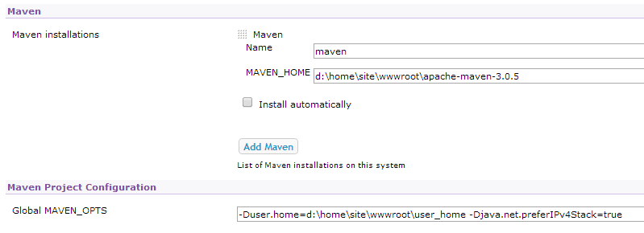

<properties 
    pageTitle="Caricare un'app web Java personalizzata in Azure" 
    description="In questa esercitazione viene illustrato come caricare un'app web Java personalizzata in Azure App servizio Web Apps." 
    services="app-service\web" 
    documentationCenter="java" 
    authors="rmcmurray" 
    manager="wpickett" 
    editor=""/>

<tags 
    ms.service="app-service-web" 
    ms.workload="web" 
    ms.tgt_pltfrm="na" 
    ms.devlang="Java" 
    ms.topic="article" 
    ms.date="08/11/2016" 
    ms.author="robmcm"/>

# Caricare un'app web Java personalizzata in Azure

In questo argomento viene illustrato come caricare un'app web Java personalizzata in [Azure App servizio] Web Apps. Sono disponibili informazioni che si applica a qualsiasi app web o sito Web di linguaggio e anche alcuni esempi per applicazioni specifiche.

Si noti che Azure consente per la creazione di applicazioni web Java utilizzando l'interfaccia utente di configurazione del portale Azure e Azure Marketplace, come [creare un'app web di linguaggio in Azure App servizio](web-sites-java-get-started.md). In questa esercitazione è per gli scenari in cui si desidera usare il portale di Azure la configurazione dell'interfaccia utente o Azure Marketplace.  

## Linee guida di configurazione

Di seguito vengono descritte le impostazioni previste per le applicazioni web Java personalizzate in Azure.

- La porta HTTP utilizzata dal processo di linguaggio in modo dinamico è assegnata.  Il processo è necessario utilizzare la porta dalla variabile di ambiente `HTTP_PLATFORM_PORT`.
- Tutte le porte ascolto diverso da comunicare ascoltatore HTTP singola devono essere disabilitate.  In Tomcat, che include l'arresto, HTTPS e AJP porte.
- Il contenitore deve essere configurato per il traffico IPv4.
- Il comando di **avvio** per l'applicazione deve essere impostata nella configurazione.
- Le applicazioni che richiedono directory con scrivono autorizzazione necessario trovarsi nella directory dell'applicazione web Azure contenuto, è **D:\home**.  La variabile di ambiente `HOME` fa riferimento a D:\home.  

È possibile impostare le variabili di ambiente necessarie in config.

## configurazione di httpPlatform config

Di seguito viene descritto il formato **httpPlatform** config.
                                 
**argomenti** (Predefinito = ""). Argomenti per il file eseguibile o lo script specificato nelle impostazioni di **processPath** .

Esempi (mostrati con **processPath** incluso):

    processPath="%HOME%\site\wwwroot\bin\tomcat\bin\catalina.bat"
    arguments="start"
    
    processPath="%JAVA_HOME\bin\java.exe"
    arguments="-Djava.net.preferIPv4Stack=true -Djetty.port=%HTTP\_PLATFORM\_PORT% -Djetty.base=&quot;%HOME%\site\wwwroot\bin\jetty-distribution-9.1.0.v20131115&quot; -jar &quot;%HOME%\site\wwwroot\bin\jetty-distribution-9.1.0.v20131115\start.jar&quot;"

**processPath** - percorso del file eseguibile o script che verrà avviato un processo in attesa di richieste HTTP.

Esempi:

    processPath="%JAVA_HOME%\bin\java.exe"

    processPath="%HOME%\site\wwwroot\bin\tomcat\bin\startup.bat"

    processPath="%HOME%\site\wwwroot\bin\tomcat\bin\catalina.bat"
                                                                                       
**rapidFailsPerMinute** (Impostazione predefinita = 10.) Numero di volte consentito processo specificati in **processPath** subisce un arresto anomalo al minuto. Se si supera questo limite, verrà interrotto **HttpPlatformHandler** avvio del processo per il resto del minuto.
                                    
**requestTimeout** (Predefinito = "00: 02:00".) Durata per cui **HttpPlatformHandler** di attesa di una risposta dal processo in ascolto `%HTTP_PLATFORM_PORT%`.

**startupRetryCount** (Impostazione predefinita = 10.) Numero di volte **che httpplatformhandler** tenterà di avviare il processo specificato in **processPath**. Vedere **startupTimeLimit** per altri dettagli.

**startupTimeLimit** (Impostazione predefinita = 10 secondi.) Durata per cui **HttpPlatformHandler** di attesa per lo script o un file eseguibile avviare un processo in ascolto sulla porta.  Se si supera questo limite di tempo, **HttpPlatformHandler** verrà interrompere il processo e provare ad avviare nuovamente **startupRetryCount** volte.
                                                                                      
**stdoutLogEnabled** (Predefinito = "true".) Se true, **stdout** e **stderr** per il processo specificato nelle impostazioni di **processPath** verrà reindirizzati al file specificato in **stdoutLogFile** (vedere la sezione **stdoutLogFile** ).
                                    
**stdoutLogFile** (Default="d:\home\LogFiles\httpPlatformStdout.log".) Percorso file assoluto per il quale verrà registrati **stdout** e **stderr** dal processo specificati in **processPath** .
                                    
> [AZURE.NOTE] `%HTTP_PLATFORM_PORT%`è un segnaposto speciale che deve essere specificato come parte di **argomenti** o come parte dell'elenco **environmentVariables** **httpPlatform** . Verranno sostituita da una porta generata internamente da **HttpPlatformHandler** in modo che il processo specificato da **processPath** può ascoltare su questa porta.

## Distribuzione

Alle applicazioni web basate linguaggio applicazioni web basate su possono essere distribuite facilmente la maggior parte dello stesso mezzo utilizzato con Internet Information Services (IIS).  FTP, fra e Kudu sono supportati come meccanismi di distribuzione, come la funzionalità di servizi integrata per le applicazioni web. Works WebDeploy come protocollo, tuttavia, come linguaggio non sviluppato in Visual Studio WebDeploy non corrisponde a casi di utilizzo di distribuzione di linguaggio web app.

## Esempi di configurazione dell'applicazione

Per le applicazioni seguenti, config e l'applicazione di configurazione viene fornita come esempi in cui viene illustrato come attivare l'applicazione di linguaggio nella App servizio Web App.

### Tomcat
Nonostante siano disponibili due variazioni Tomcat forniti con App servizio Web Apps, è comunque è possibile caricare istanze specifiche dei clienti. Di seguito è illustrato un esempio di un'installazione di Tomcat con una diversa JVM Java Virtual Machine ().

    <?xml version="1.0" encoding="UTF-8"?>
    <configuration>
      <system.webServer>
        <handlers>
          <add name="httpPlatformHandler" path="*" verb="*" modules="httpPlatformHandler" resourceType="Unspecified" />
        </handlers>
        <httpPlatform processPath="%HOME%\site\wwwroot\bin\tomcat\bin\startup.bat" 
            arguments="">
          <environmentVariables>
            <environmentVariable name="CATALINA_OPTS" value="-Dport.http=%HTTP_PLATFORM_PORT%" />
            <environmentVariable name="CATALINA_HOME" value="%HOME%\site\wwwroot\bin\tomcat" />
            <environmentVariable name="JRE_HOME" value="%HOME%\site\wwwroot\bin\java" /> <!-- optional, if not specified, this will default to %programfiles%\Java -->
            <environmentVariable name="JAVA_OPTS" value="-Djava.net.preferIPv4Stack=true" />
          </environmentVariables>
        </httpPlatform>
      </system.webServer>
    </configuration>

Sul lato Tomcat esistono è necessario apportare alcune modifiche di configurazione. Il server.xml deve essere modificati per impostare le seguenti:

-   Porta di arresto = -1
-   Porta di connettore HTTP = ${port.http}
-   Indirizzo del connettore HTTP = "127.0.0.1"
-   Commento connettori HTTPS e AJP
-   L'impostazione IPv4 possa anche essere impostata nel file catalina.properties nel punto in cui è possibile aggiungere`java.net.preferIPv4Stack=true`
    
Chiamate Direct3d non sono supportate in App servizio Web Apps. Per disattivare quelli, aggiungere l'opzione linguaggio seguente deve eseguire l'applicazione di tali chiamate:`-Dsun.java2d.d3d=false`

### Alla banchina

Come nel caso per Tomcat, i clienti possono caricare le proprie istanze alla banchina. In caso di eseguire l'installazione completa di alla banchina, la configurazione sarà simile alla seguente:

    <?xml version="1.0" encoding="UTF-8"?>
    <configuration>
      <system.webServer>
        <handlers>
          <add name="httppPlatformHandler" path="*" verb="*" modules="httpPlatformHandler" resourceType="Unspecified" />
        </handlers>
        <httpPlatform processPath="%JAVA_HOME%\bin\java.exe" 
             arguments="-Djava.net.preferIPv4Stack=true -Djetty.port=%HTTP_PLATFORM_PORT% -Djetty.base=&quot;%HOME%\site\wwwroot\bin\jetty-distribution-9.1.0.v20131115&quot; -jar &quot;%HOME%\site\wwwroot\bin\jetty-distribution-9.1.0.v20131115\start.jar&quot;"
            startupTimeLimit="20"
          startupRetryCount="10"
          stdoutLogEnabled="true">
        </httpPlatform>
      </system.webServer>
    </configuration>

La configurazione alla banchina deve essere modificato in start.ini per impostare `java.net.preferIPv4Stack=true`.

### Springboot
Per ottenere un Springboot applicazione in esecuzione è necessario caricare un file VASO o WAR e aggiungere il file config seguenti. Config passa alla cartella wwwroot. Modificare gli argomenti in modo che punti al file VASO, nell'esempio seguente che il file VASO si trova nella cartella wwwroot anche dello stesso file.  

    <?xml version="1.0" encoding="UTF-8"?>
    <configuration>
      <system.webServer>
        <handlers>
          <add name="httpPlatformHandler" path="*" verb="*" modules="httpPlatformHandler" resourceType="Unspecified" />
        </handlers>
        <httpPlatform processPath="%JAVA_HOME%\bin\java.exe"
            arguments="-Djava.net.preferIPv4Stack=true -Dserver.port=%HTTP_PLATFORM_PORT% -jar &quot;%HOME%\site\wwwroot\my-web-project.jar&quot;">
        </httpPlatform>
      </system.webServer>
    </configuration>

### Hudson

Il test utilizzato war Hudson 3.1.2 e l'istanza di Tomcat 7.0.50 predefinita, ma senza utilizzare l'interfaccia utente per configurare l'ambiente.  Poiché Hudson è un software di compilare strumento, è consigliabile installare in dedicato istanze in cui è possibile impostare il contrassegno **AlwaysOn** in web app.

1. Nella directory radice dell'applicazione web, ad esempio, **d:\home\site\wwwroot**, creare una directory **WebApp** (se non è già presente) e posizionare Hudson.war in **d:\home\site\wwwroot\webapps**.
2. Scaricare maven apache 3.0.5 (compatibile con Hudson) e inserirla in **d:\home\site\wwwroot**.
3. Creare config in **d:\home\site\wwwroot** e incollare il contenuto seguente:
    
        <?xml version="1.0" encoding="UTF-8"?>
        <configuration>
          <system.webServer>
            <handlers>
              <add name="httppPlatformHandler" path="*" verb="*" 
        modules="httpPlatformHandler" resourceType="Unspecified" />
            </handlers>
            <httpPlatform processPath="%AZURE_TOMCAT7_HOME%\bin\startup.bat"
        startupTimeLimit="20"
        startupRetryCount="10">
        <environmentVariables>
          <environmentVariable name="HUDSON_HOME" 
        value="%HOME%\site\wwwroot\hudson_home" />
          <environmentVariable name="JAVA_OPTS" 
        value="-Djava.net.preferIPv4Stack=true -Duser.home=%HOME%/site/wwwroot/user_home -Dhudson.DNSMultiCast.disabled=true" />
        </environmentVariables>            
            </httpPlatform>
          </system.webServer>
        </configuration>

    A questo punto è possibile riavviare l'applicazione web per rendere le modifiche.  Connettersi a http://yourwebapp/hudson per avviare Hudson.

4. Dopo aver Hudson configura automaticamente, verrà visualizzata la schermata seguente:

    
    
5. Accedere alla pagina di configurazione Hudson: fare clic su **Gestisci Hudson**e quindi fare clic su **Configurazione sistema**.
6. Configurare JDK come illustrato di seguito:

    

7. Configurare Maven come illustrato di seguito:

    

8. Salvare le impostazioni. Hudson dovrebbe ora essere configurato per l'uso.

Per ulteriori informazioni su Hudson, vedere [http://hudson-ci.org](http://hudson-ci.org).

### Liferay

Liferay è supportato in App servizio Web Apps. Poiché Liferay può richiedere notevole di memoria, l'applicazione web deve essere eseguito in un lavoro dedicato medio-grande, che possono fornire memoria insufficiente. Liferay richiede anche alcuni minuti per l'avvio. Per questo motivo, è consigliabile impostare l'applicazione web a **Sempre attiva**.  

Usa Liferay 6.1.2 che Community Edition GA3 in dotazione con Tomcat, i file seguenti sono stati modificati dopo il download Liferay:

**Server.Xml**

- Modificare la porta di arresto in -1.
- Connettore cambia HTTP      `<Connector port="${port.http}" protocol="HTTP/1.1" connectionTimeout="600000" address="127.0.0.1" URIEncoding="UTF-8" />`
- Il connettore AJP come commento.

Nella cartella **liferay\tomcat-7.0.40\webapps\ROOT\WEB-INF\classes** creare un file denominato **ext.properties portal**. Il file deve contenere una sola riga, come illustrato di seguito:

    liferay.home=%HOME%/site/wwwroot/liferay

Allo stesso livello directory cartella tomcat 7.0.40, creare un file denominato **config** con il contenuto seguente:

    <?xml version="1.0" encoding="UTF-8"?>
    <configuration>
      <system.webServer>
        <handlers>
    <add name="httpPlatformHandler" path="*" verb="*"
         modules="httpPlatformHandler" resourceType="Unspecified" />
        </handlers>
        <httpPlatform processPath="%HOME%\site\wwwroot\tomcat-7.0.40\bin\catalina.bat" 
                      arguments="run" 
                      startupTimeLimit="10" 
                      requestTimeout="00:10:00" 
                      stdoutLogEnabled="true">
          <environmentVariables>
      <environmentVariable name="CATALINA_OPTS" value="-Dport.http=%HTTP_PLATFORM_PORT%" />
      <environmentVariable name="CATALINA_HOME" value="%HOME%\site\wwwroot\tomcat-7.0.40" />
            <environmentVariable name="JRE_HOME" value="D:\Program Files\Java\jdk1.7.0_51" /> 
            <environmentVariable name="JAVA_OPTS" value="-Djava.net.preferIPv4Stack=true" />
          </environmentVariables>
        </httpPlatform>
      </system.webServer>
    </configuration>

In blocco **httpPlatform** **requestTimeout** è impostata su "00: 10:00".  Può essere ridotta ma non è probabile che vengano visualizzati alcuni errori di timeout durante l'avvio di Liferay.  Se questo valore viene modificato, quindi **connectionTimeout** in server.xml tomcat dovrebbe essere modificato.  

È importante notare che il varariable dell'ambiente JRE_HOME sia specificato dello stesso file indicati in modo che puntino a JDK 64 bit. Il valore predefinito è 32 bit, ma poiché Liferay può richiedere livelli elevati di memoria, è consigliabile usare JDK 64 bit.

Una volta apportate queste modifiche, riavviare l'applicazione web che esegue Liferay, quindi aprire http://yourwebapp. Il portale di Liferay è disponibile dalla radice web app. 

## Passaggi successivi

Per ulteriori informazioni su Liferay, vedere [http://www.liferay.com](http://www.liferay.com).

Per ulteriori informazioni su Java, vedere il [Centro per sviluppatori di linguaggio](/develop/java/).

[AZURE.INCLUDE [app-service-web-whats-changed](../../includes/app-service-web-whats-changed.md)]

[AZURE.INCLUDE [app-service-web-try-app-service](../../includes/app-service-web-try-app-service.md)]
 
 
<!-- External Links -->
[Servizio App Azure]: http://go.microsoft.com/fwlink/?LinkId=529714
