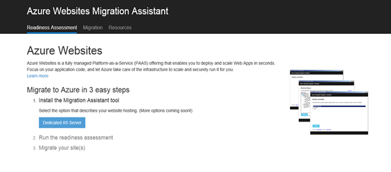

<properties 
    pageTitle="Eseguire la migrazione di un'app web di enterprise al servizio App Azure" 
    description="Viene illustrato come utilizzare la migrazione guidata Web App per eseguire rapidamente la migrazione di siti Web IIS esistenti Azure App servizio Web Apps" 
    services="app-service" 
    documentationCenter="" 
    authors="cephalin" 
    writer="cephalin" 
    manager="wpickett" 
    editor=""/>

<tags 
    ms.service="app-service" 
    ms.workload="na" 
    ms.tgt_pltfrm="na" 
    ms.devlang="na" 
    ms.topic="article" 
    ms.date="07/01/2016" 
    ms.author="cephalin"/>

# Eseguire la migrazione di un'app web di enterprise al servizio App Azure

È possibile trasferire facilmente i siti Web esistente che eseguono su Internet Information Service (IIS) 6 o versioni successive per [App servizio Web Apps](http://go.microsoft.com/fwlink/?LinkId=529714). 

>[AZURE.IMPORTANT] Windows Server 2003 è terminato di supporto in luglio 2015 14. Se al momento si ospitano i siti Web in un server IIS non Windows Server 2003, Web App è un rischio basso, a costi e modo semplice per impedire che i siti Web online e Web App di migrazione guidata consente di automatizzare il processo di migrazione di. 

[Web App di migrazione guidata](https://www.movemetothecloud.net/) possibile analizzare l'installazione di server IIS, identificare quali siti viene eseguita la migrazione al servizio di App, evidenziare tutti gli elementi che non possono essere migrati o non sono supportati sulla piattaforma e quindi eseguire la migrazione dei siti Web e dei database associati a Azure.

[AZURE.INCLUDE [app-service-web-to-api-and-mobile](../../includes/app-service-web-to-api-and-mobile.md)]

## Elementi verificati durante l'analisi di compatibilità ##
Migrazione guidata crea un rapporto di preparazione per identificare le possibili cause per problema o blocchi problemi che potrebbero impedire la corretta una migrazione completa da IIS locale a Azure App servizio Web Apps. Alcuni elementi chiave da tenere in considerazione sono:

-   Le associazioni delle porte-Web App supporta solo la porta 80 per HTTP e 443 per il traffico HTTPS. Configurazione di porta diverso verrà ignorata e il traffico instradato all'80 o 443. 
-   Autenticazione – Web App supporta l'autenticazione anonima per impostazione predefinita e l'autenticazione basata su dove specificato da un'applicazione. L'integrazione con Azure Active Directory e ADFS solo, è possibile utilizzare l'autenticazione di Windows. Tutti gli altri moduli di autenticazione, ad esempio l'autenticazione di base - non sono attualmente supportati. 
-   Cache Assembly globale (cache globale) – cache globale non è supportata nelle App Web. Se l'applicazione fa riferimento a assembly che si distribuisce in genere alla cache globale, sarà necessario distribuire nella cartella bin dell'applicazione Web Apps. 
-   IIS 5 Modalità di compatibilità-non è supportata nelle App Web. 
-   Pool di applicazioni-Web Apps, ogni sito e le applicazioni figlio eseguire nel pool di applicazioni stesso. Se il sito include più applicazioni figlio che utilizzano più pool di applicazioni, consolidarle a un singolo pool con le stesse impostazioni o eseguire la migrazione di ogni applicazione di un'app web separato.
-   Componenti COM – Web App non consente la registrazione dei componenti della piattaforma. Se le applicazioni o siti Web prevedono l'utilizzo di tutti i componenti COM, è necessario loro di riscrittura nel codice gestito e distribuirle con il sito Web o dell'applicazione.
-   Filtri-Web App supporta l'utilizzo di filtri. È necessario eseguire le operazioni seguenti:
    -   distribuire le DLL con l'app web 
    -   registrare la DLL utilizzando [config](http://www.iis.net/configreference/system.webserver/isapifilters)
    -   Inserire un file applicationHost.xdt nella radice del sito con il contenuto riportata di seguito:

            <?xml version="1.0"?>
            <configuration xmlns:xdt="http://schemas.microsoft.com/XML-Document-Transform">
            <configSections>
                <sectionGroup name="system.webServer">
                  <section name="isapiFilters" xdt:Transform="SetAttributes(overrideModeDefault)" overrideModeDefault="Allow" />
                </sectionGroup>
              </configSections>
            </configuration>

        Per altri esempi su come utilizzare le trasformazioni di documento XML con il sito Web, vedere [trasformare il sito Web di Microsoft Azure](http://blogs.msdn.com/b/waws/archive/2014/06/17/transform-your-microsoft-azure-web-site.aspx).

-   Altri componenti come SharePoint, anteriore estensioni del server (FPSE), FTP, i certificati SSL non vengono migrati.

## Come usare l'Assistente di migrazione di Web App ##
In questo sezione esaminato un esempio su per eseguire la migrazione di alcuni siti Web che utilizzano un database SQL Server e l'esecuzione in un computer Windows Server 2003 R2 (IIS 6.0) in locale:

1.  Nel computer client o il server IIS passare alla [https://www.movemetothecloud.net/](https://www.movemetothecloud.net/) 

    

2.  Installare app di migrazione pubblicazione guidata sul Web facendo clic sul pulsante **Dedicato Server IIS** . Altre opzioni saranno opzioni nel prossimo futuro. 
4.  Fare clic sul pulsante **Dello strumento installa** per installare app di migrazione pubblicazione guidata sul Web nel computer in uso.

    

    >[AZURE.NOTE] È anche possibile fare clic su **Download per l'installazione non in linea** per scaricare un file ZIP per l'installazione su server non è connesso a internet. In alternativa, è possibile fare clic su **Carica un report per la preparazione per la migrazione esistente**, che è un'opzione avanzata per l'uso con un esistente per la preparazione per report di migrazione generato in precedenza (descritto più avanti).

5.  Nella schermata **Installazione applicazioni** fare clic su **Installa** per installare nel computer in uso. Verrà inoltre installato dipendenze corrispondente alla distribuzione Web, DacFX e IIS, se necessario. 

    

    Dopo aver installato, Web App di migrazione guidata viene avviata automaticamente.
  
6.  Scegliere **Esegui migrazione siti e database da un server remoto in Azure**. Immettere le credenziali amministrative per il server remoto e fare clic su **Continua**. 

    

    Naturalmente, è possibile scegliere di eseguire la migrazione dal server locale. L'opzione remoto è utile quando si desidera eseguire la migrazione di siti Web da un server IIS di produzione.
 
    A questo punto verrà esaminare lo strumento di migrazione la configurazione del server IIS, ad esempio siti, applicazioni, pool di applicazioni e le dipendenze per identificare i siti Web candidati per la migrazione. 

8.  Nella schermata seguente mostra tre siti Web- **sito Web predefinito**, **TimeTracker**e **CommerceNet4**. Tutti dispongono di un database associato che si desidera eseguire la migrazione. Selezionare tutti i siti a cui che si vuole valutare e quindi fare clic su **Avanti**.

    
 
9.  Fare clic su **Carica** per caricare il rapporto conformità. Se si sceglie di **salvare file in locale**, è possibile eseguire lo strumento di migrazione in un secondo momento e caricare il rapporto conformità salvata come indicato in precedenza.

    
 
    Dopo aver caricato il rapporto conformità, Azure esegue l'analisi di preparazione e visualizza i risultati. Leggere i dettagli di valutazione per ogni sito Web e verificare che si ha familiarità o sono risolti tutti i problemi prima di procedere. 
 
    

12. Fare clic su **Migrazione iniziare** per avviare la migrazione. Verrà reindirizzato alla Azure agli utenti di accedere all'account. È importante che l'accesso con un account dotato di un abbonamento attivo a Azure. Se non si dispone di un account Azure quindi è possibile iscriversi a un gratuito valutazione [qui](https://azure.microsoft.com/pricing/free-trial/?WT.srch=1&WT.mc_ID=SEM_). 

13. Selezionare l'account del tenant, abbonamento Azure e opzioni internazionali da utilizzare per le app web di Azure migrati e i database e quindi fare clic su **Avvia migrazione**. È possibile selezionare i siti Web per eseguire la migrazione in un secondo momento.

    

14. Nella schermata successiva è possibile apportare modifiche alle impostazioni di migrazione predefinito, ad esempio:

    - usare un Database di SQL Azure esistente o creare un nuovo Database SQL Azure e configurare le credenziali
    - Selezionare i siti Web per eseguire la migrazione
    - definire nomi per le applicazioni web Azure e i database SQL collegati
    - personalizzare le impostazioni globali e impostazioni a livello di sito

    Nella schermata seguente mostra tutti i siti Web selezionato per la migrazione con le impostazioni predefinite.

    

    >[AZURE.NOTE] la casella di controllo **Abilita Azure Active Directory** in impostazioni personalizzate si integra app web Azure con [Azure Active Directory](active-directory-whatis.md) ( **Directory predefinita**). Per ulteriori informazioni sulla sincronizzazione di Azure Active Directory con Active Directory locale, vedere [integrazione della Directory](http://msdn.microsoft.com/library/jj573653).

16.  Una volta apportate tutte le modifiche desiderate, fare clic su **Crea** per iniziare il processo di migrazione. Lo strumento di migrazione verrà creare il Database di SQL Azure e Azure web app e quindi pubblicare il contenuto del sito Web e i database. L'avanzamento della migrazione ben visibili nello strumento di migrazione e si vedrà una schermata di riepilogo al termine, i dettagli dei siti viene eseguita la migrazione, se ha avuto esito positivo, collegamenti alle applicazioni web Azure appena creato. 

    In caso di errore durante la migrazione, lo strumento di migrazione chiaramente indica l'errore e ripristino delle modifiche. Sarà inoltre possibile inviare la segnalazione direttamente al team di progettazione fare clic sul pulsante **Invia segnalazione errori** , con stack errore acquisito e generare il corpo del messaggio. 

    

    Se la migrazione ha avuto esito positivo senza errori, è possibile anche fare clic sul pulsante di **Fornire commenti e suggerimenti** per inviare eventuali commenti e suggerimenti direttamente. 
 
20. Fare clic sui collegamenti alle applicazioni web Azure e verificare che la migrazione ha avuto esito positivo.

21. A questo punto è possibile gestire le app web migrati nel servizio App Azure. A tale scopo, accedere al [Portale di Azure](https://portal.azure.com).

22. Nel portale di Azure, aprire e il Web Apps per visualizzare i siti Web migrati (come illustrato come web apps), quindi fare clic su uno di essi per iniziare a gestire l'applicazione web, ad esempio la configurazione di pubblicazione continua, la creazione di backup, il ridimensionamento automatico e monitoraggio o uso delle prestazioni.

    

>[AZURE.NOTE] Se si desidera iniziare a utilizzare il servizio di App Azure prima di iscriversi a un account Azure, accedere al [Servizio App provare](http://go.microsoft.com/fwlink/?LinkId=523751), in cui è possibile creare immediatamente un'app web starter breve nel servizio di App. Nessun carte di credito obbligatorio; Nessun impegni.

## Novità
* Per una Guida per la modifica da siti Web al servizio App vedere: [servizio App Azure e il relativo impatto sulla esistente servizi di Windows Azure](http://go.microsoft.com/fwlink/?LinkId=529714)
 
