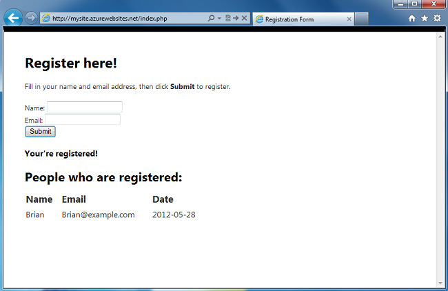
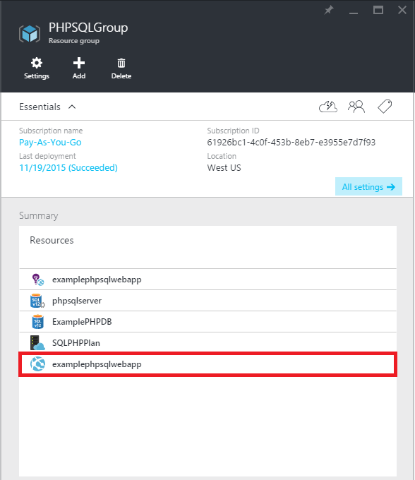
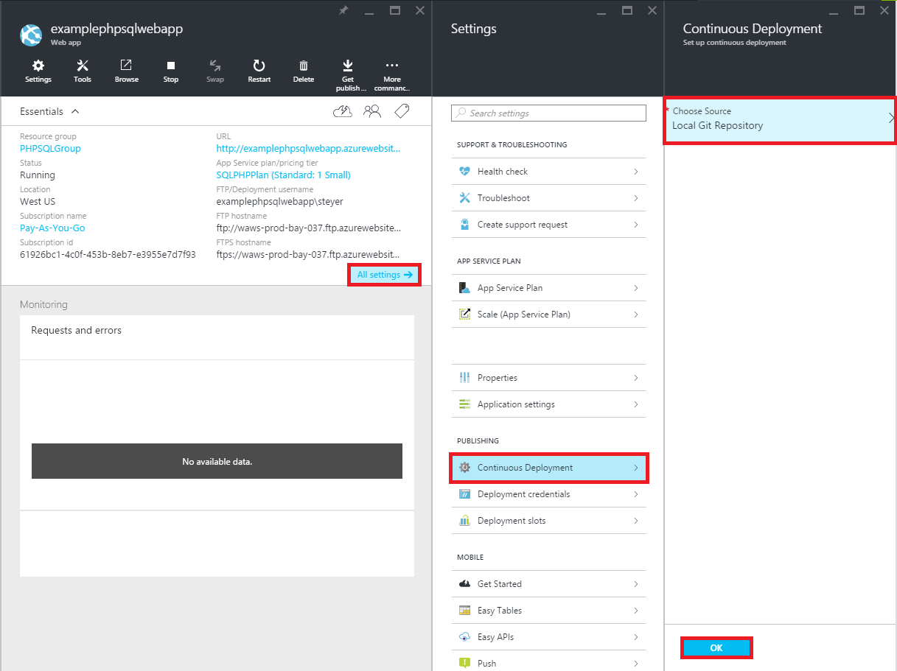
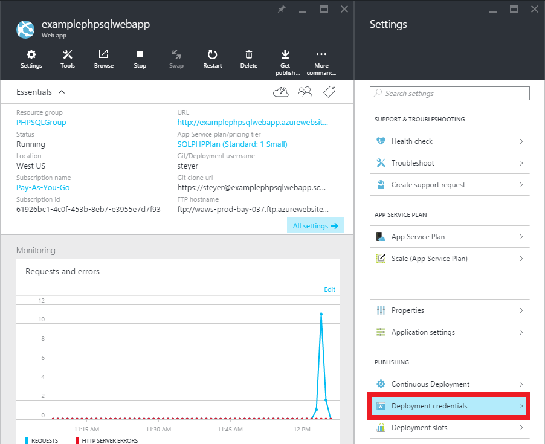

<properties 
    pageTitle="Creare un'app web PHP SQL e distribuire al servizio di App Azure utilizzando fra" 
    description="Esercitazione in cui viene illustrato come creare un'app web PHP che archivia dati nel Database di SQL Azure e utilizzare la distribuzione fra al servizio App Azure." 
    services="app-service\web, sql-database" 
    documentationCenter="php" 
    authors="rmcmurray" 
    manager="wpickett" 
    editor=""/>

<tags 
    ms.service="app-service-web" 
    ms.workload="web" 
    ms.tgt_pltfrm="na" 
    ms.devlang="PHP" 
    ms.topic="article" 
    ms.date="08/11/2016" 
    ms.author="robmcm"/>

# Creare un'app web PHP SQL e distribuire al servizio di App Azure utilizzando fra

In questa esercitazione viene illustrato come creare un'app web PHP in [Azure App servizio](http://go.microsoft.com/fwlink/?LinkId=529714) che si connette al Database SQL Azure e su come distribuirlo fra. In questa esercitazione si suppone che [PHP][install-php], [SQL Server Express][install-SQLExpress], il [Driver di Microsoft SQL Server per PHP](http://www.microsoft.com/download/en/details.aspx?id=20098)e [fra] [ install-git] installato nel computer. Al termine dell'esecuzione di questa Guida, si avrà un'app web PHP SQL in esecuzione in Azure.

> [AZURE.NOTE]
> È possibile installare e configurare PHP, SQL Server Express e Drivers Microsoft per SQL Server per PHP tramite [Installazione guidata piattaforma Web Microsoft](http://www.microsoft.com/web/downloads/platform.aspx).

Si apprenderà:

* Come creare un'app web Azure e un Database SQL tramite il [Portale di Azure](http://go.microsoft.com/fwlink/?LinkId=529715). Poiché PHP è abilitata nell'applicazione del servizio Web Apps per impostazione predefinita, particolari è necessario eseguire il codice PHP.
* Informazioni su come pubblicare e pubblicare di nuovo all'applicazione di Azure utilizzando fra.
 
Seguendo questa esercitazione si creerà un'applicazione web di registrazione in PHP. L'applicazione è ospitata in un sito Web di Azure. Schermata dell'applicazione completata è inferiore a:

[AZURE.INCLUDE [create-account-and-websites-note](../../includes/create-account-and-websites-note.md)]

>[AZURE.NOTE] Se si desidera iniziare a utilizzare il servizio di App Azure prima di iscriversi a un account Azure, accedere al [Servizio App provare](http://go.microsoft.com/fwlink/?LinkId=523751), in cui è possibile creare immediatamente un'app web starter breve nel servizio di App. Nessun carte di credito obbligatorio; Nessun impegni.

##Creare un'app web Azure e configurare la pubblicazione fra

Seguire questa procedura per creare un'app web Azure e un Database SQL:

1. Accedere al [portale di Azure](https://portal.azure.com/).

2. Apri Azure Marketplace facendo clic sull'icona **Nuovo** nell'angolo superiore sinistro del dashboard, fare clic su **Seleziona tutto** accanto a Marketplace e selezionando **Web + Mobile**.
    
3. In Marketplace, selezionare **Web + Mobile**.

4. Fare clic sull'icona **Web app + SQL** .

5. Dopo aver letto la descrizione dell'app Web + SQL app, selezionare **Crea**.

6. Fare clic su ogni parte (**Gruppo di risorse**, **Web App**, **Database**e **abbonamento**) e immettere o selezionare i valori per i campi obbligatori:
    
    - Immettere un nome URL preferito   
    - Configurare le credenziali server di database
    - Selezionare l'area più vicina

    

7. Dopo aver completato la definizione dell'applicazione web, fare clic su **Crea**.

    Quando il web app è stato creato, il pulsante **notifiche** verrà flash verde **successo** ed e il gruppo risorse aperto per visualizzare il web app e database SQL di gruppo.

4. Fare clic sull'icona dell'applicazione web in e il gruppo delle risorse per aprire blade dell'applicazione web.

    

5. In **Impostazioni** fare clic su **Continua distribuzione** > **Configura obbligatori impostazioni**. Selezionare **Archivio fra locale** e fare clic su **OK**.

    

    Se non è stata configurata un repository fra prima, è necessario specificare un nome utente e password. A tale scopo, fare clic su **Impostazioni** > **le credenziali di distribuzione** in blade dell'applicazione web.

    

6. In **Impostazioni** fare clic su **proprietà** per visualizzare l'URL remoto fra è necessario utilizzare per distribuire l'app PHP in un secondo momento.

##Ottenere informazioni sulla connessione di Database SQL

Per connettersi all'istanza di Database SQL che è collegato a un'applicazione web, sarà necessario le informazioni di connessione, specificato al momento della creazione del database. Per ottenere le informazioni sulla connessione di Database SQL, procedere come segue:

1. Di nuovo in blade del gruppo di risorse, fare clic sull'icona del database SQL.

2. In blade del database SQL, fare clic su **Impostazioni** > **proprietà**, quindi fare clic su **Mostra le stringhe di connessione di database**. 

    
    
3. Dalla sezione **PHP** della finestra di dialogo risultante, prendere nota dei valori per `Server`, `SQL Database`, e `User Name`. Utilizzare questi valori in un secondo momento durante la pubblicazione di un'app web di PHP al servizio App Azure.

##Creare e testare l'applicazione localmente

L'applicazione di registrazione è un'applicazione PHP semplice che consente di eseguire la registrazione per un evento mediante l'indirizzo di posta elettronica e nome. Informazioni sui partecipanti precedenti vengono visualizzate in una tabella. Informazioni di registrazione vengono archiviate in un'istanza di Database SQL. L'applicazione è costituito da due file (copiare e incollare codice riportato di seguito):

* **index. PHP**: consente di visualizzare un modulo per la registrazione e una tabella contenente le informazioni di persona.
* **CreateTable.PHP**: crea la tabella di Database SQL per l'applicazione. Questo file sarà possibile utilizzare una sola volta.

Per eseguire l'applicazione in locale, seguire la procedura seguente. Si noti che questa procedura si presuppone avere PHP e SQL Server Express configurare sul computer locale e che è stata attivata l' [estensione PDO per SQL Server][pdo-sqlsrv].

1. Creare un database di SQL Server denominato `registration`. È possibile farlo dalla `sqlcmd` prompt dei comandi con questi comandi:

        >sqlcmd -S localhost\sqlexpress -U <local user name> -P <local password>
        1> create database registration
        2> GO   

2. Nella directory radice dell'applicazione, creare due file al suo interno - un'altra chiamata `createtable.php` e un'altra chiamata `index.php`.

3. Aprire la `createtable.php` dei file in un editor di testo o IDE e aggiungere il codice riportato di seguito. Questo codice verrà utilizzato per creare il `registration_tbl` tabella il `registration` database.

        <?php
        // DB connection info
        $host = "localhost\sqlexpress";
        $user = "user name";
        $pwd = "password";
        $db = "registration";
        try{
            $conn = new PDO( "sqlsrv:Server= $host ; Database = $db ", $user, $pwd);
            $conn->setAttribute( PDO::ATTR_ERRMODE, PDO::ERRMODE_EXCEPTION );
            $sql = "CREATE TABLE registration_tbl(
            id INT NOT NULL IDENTITY(1,1) 
            PRIMARY KEY(id),
            name VARCHAR(30),
            email VARCHAR(30),
            date DATE)";
            $conn->query($sql);
        }
        catch(Exception $e){
            die(print_r($e));
        }
        echo "<h3>Table created.</h3>";
        ?>

    Si noti che è necessario aggiornare i valori per <code>$user</code> e <code>$pwd</code> con il nome utente di SQL Server locale e la password.

4. In terminale nella directory principale dell'applicazione digitare il comando seguente:

        php -S localhost:8000

4. Aprire un web browser e passare alla **http://localhost:8000/createtable.php**. Verrà creato il `registration_tbl` tabella nel database.

5. Aprire il file **index. PHP** in un editor di testo o IDE e aggiungere il codice HTML e CSS base per la pagina (codice PHP aggiunto nei passaggi successivi).

        <html>
        <head>
        <Title>Registration Form</Title>
        
        </head>
        <body>
        <h1>Register here!</h1>
        
Fill in your name and email address, then click <strong>Submit</strong> to register.

        <form method="post" action="index.php" enctype="multipart/form-data" >
              Name  <input type="text" name="name" id="name"/> 
              Email <input type="text" name="email" id="email"/> 
              <input type="submit" name="submit" value="Submit" />
        </form>
        <?php

        ?>
        </body>
        </html>

6. All'interno dei tag PHP, aggiungere codice PHP per la connessione al database.

        // DB connection info
        $host = "localhost\sqlexpress";
        $user = "user name";
        $pwd = "password";
        $db = "registration";
        // Connect to database.
        try {
            $conn = new PDO( "sqlsrv:Server= $host ; Database = $db ", $user, $pwd);
            $conn->setAttribute( PDO::ATTR_ERRMODE, PDO::ERRMODE_EXCEPTION );
        }
        catch(Exception $e){
            die(var_dump($e));
        }

    Nuovo, sarà necessario aggiornare i valori per <code>$user</code> e <code>$pwd</code> con il nome utente MySQL locale e la password.

7. Il codice di connessione di database, aggiungere codice per l'inserimento di informazioni di registrazione nel database.

        if(!empty($_POST)) {
        try {
            $name = $_POST['name'];
            $email = $_POST['email'];
            $date = date("Y-m-d");
            // Insert data
            $sql_insert = "INSERT INTO registration_tbl (name, email, date) 
                           VALUES (?,?,?)";
            $stmt = $conn->prepare($sql_insert);
            $stmt->bindValue(1, $name);
            $stmt->bindValue(2, $email);
            $stmt->bindValue(3, $date);
            $stmt->execute();
        }
        catch(Exception $e) {
            die(var_dump($e));
        }
        echo "<h3>Your're registered!</h3>";
        }

8. Infine, subito dopo il codice precedente, aggiungere il codice per recuperare dati dal database.

        $sql_select = "SELECT * FROM registration_tbl";
        $stmt = $conn->query($sql_select);
        $registrants = $stmt->fetchAll(); 
        if(count($registrants) > 0) {
            echo "<h2>People who are registered:</h2>";
            echo "<table>";
            echo "<tr><th>Name</th>";
            echo "<th>Email</th>";
            echo "<th>Date</th></tr>";
            foreach($registrants as $registrant) {
                echo "<tr><td>".$registrant['name']."</td>";
                echo "<td>".$registrant['email']."</td>";
                echo "<td>".$registrant['date']."</td></tr>";
            }
            echo "</table>";
        } else {
            echo "<h3>No one is currently registered.</h3>";
        }

È ora possibile passare a **http://localhost:8000/index.php** per testare l'applicazione.

##Pubblicare l'applicazione

Dopo aver verificato l'applicazione in locale, è possibile pubblicarlo per App servizio Web App tramite operazioni. Tuttavia, è innanzitutto necessario aggiornare le informazioni sulla connessione di database dell'applicazione. Usando le informazioni sulla connessione di database è stato acquistato in precedenza (nella sezione **informazioni di connessione di Database SQL di ottenere** ), aggiornare le informazioni seguenti in **entrambi** i `createdatabase.php` e `index.php` file con i valori appropriati:

    // DB connection info
    $host = "tcp:<value of Server>";
    $user = "<value of User Name>";
    $pwd = "<your password>";
    $db = "<value of SQL Database>";

> [AZURE.NOTE]
> Nel <code>$host</code>, il valore del Server deve essere preceduto da <code>tcp:</code>.

A questo punto, si è pronti configurare la pubblicazione fra e pubblicare l'applicazione.

> [AZURE.NOTE]
> Questi sono gli stessi passaggi descritto al termine della sezione **creare un'app web Azure e configurare la pubblicazione fra** sopra.

1. Aprire GitBash (o un terminale se fra i `PATH`), passare alla directory radice dell'applicazione (directory **registrazione** ) ed eseguire i comandi seguenti:

        git init
        git add .
        git commit -m "initial commit"
        git remote add azure [URL for remote repository]
        git push azure master

    Verrà richiesto per la password creata in precedenza.

2. Passare alla **http://[web app name].azurewebsites.net/createtable.php** per creare la tabella di database SQL per l'applicazione.
3. Passare alla **http://[web app name].azurewebsites.net/index.php** per iniziare a utilizzare l'applicazione.

Dopo aver pubblicato l'applicazione, è possibile iniziare ad apportare modifiche a tale e utilizzare operazioni per la pubblicazione. 

##Pubblicare le modifiche apportate all'applicazione

Per pubblicare le modifiche apportate all'applicazione, procedere come segue:

1. Apportare le modifiche apportate all'applicazione in locale.
2. Aprire GitBash (o un terminale it è fra i `PATH`), passare alla directory radice dell'applicazione ed eseguire i comandi seguenti:

        git add .
        git commit -m "comment describing changes"
        git push azure master

    Verrà richiesto per la password creata in precedenza.

3. Passare alla **http://[web app name].azurewebsites.net/index.php** per visualizzare le modifiche.

## Novità
* Per una Guida per la modifica da siti Web al servizio App vedere: [servizio App Azure e il relativo impatto sulla esistente servizi di Windows Azure](http://go.microsoft.com/fwlink/?LinkId=529714)

[install-php]: http://www.php.net/manual/en/install.php
[install-SQLExpress]: http://www.microsoft.com/download/details.aspx?id=29062
[install-Drivers]: http://www.microsoft.com/download/details.aspx?id=20098
[install-git]: http://git-scm.com/
[pdo-sqlsrv]: http://php.net/pdo_sqlsrv
 
