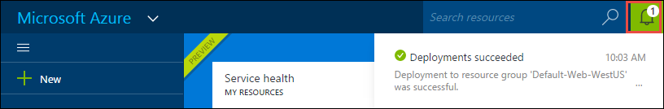

<properties
    pageTitle="Creare un'app web WordPress nel servizio di App Azure | Microsoft Azure"
    description="Informazioni su come creare una nuova app web Azure per un blog WordPress tramite il portale di Azure."
    services="app-service\web"
    documentationCenter="php"
    authors="rmcmurray"
    manager="wpickett"
    editor=""/>

<tags
    ms.service="app-service-web"
    ms.workload="na"
    ms.tgt_pltfrm="na"
    ms.devlang="PHP"
    ms.topic="hero-article"
    ms.date="08/11/2016"
    ms.author="robmcm"/>

# Creare un'app web WordPress nel servizio di App Azure

[AZURE.INCLUDE [tabs](../../includes/app-service-web-get-started-nav-tabs.md)]

In questa esercitazione viene illustrato come distribuire un sito blog WordPress da Azure Marketplace.

Al termine dell'esercitazione sarà necessario il proprio sito Web blog WordPress alto e in esecuzione nel cloud.

Si apprenderanno:

* Come trovare un modello di applicazione in Azure Marketplace.
* Come creare un'app web nel servizio di App Azure basato sul modello.
* Come configurare le impostazioni di Azure App servizio per la nuova web app e database.

Azure Marketplace rende disponibile un'ampia gamma di applicazioni web popolari sviluppata da Microsoft, società di terze parti e iniziative software Apri origine. App web si basano su una vasta gamma di Framework comuni, ad esempio [PHP](/develop/nodejs/) in questo esempio, [.NET](/develop/net/), [Node](/develop/nodejs/), [Java](/develop/java/)e [Python](/develop/python/), per citarne di WordPress. Per creare un'app web di Azure Marketplace l'unico software che è necessario sia il browser da utilizzare per il [Portale di Azure](https://portal.azure.com/). 

Il sito WordPress distribuiti in questa esercitazione utilizza MySQL per il database. Se si desidera utilizzare il Database di SQL per il database, vedere [Nami di progetto](http://projectnami.org/). È anche disponibile tramite il Marketplace **Nami progetto** .

> [AZURE.NOTE]
> Per completare questa esercitazione, è necessario un account di Microsoft Azure. Se non si dispone di un account, è possibile [attivare i vantaggi della propria sottoscrizione Visual Studio](/pricing/member-offers/msdn-benefits-details/?WT.mc_id=A261C142F) o [iscriversi per una versione di valutazione gratuita](/en-us/pricing/free-trial/?WT.mc_id=A261C142F).
>
> Se si desidera iniziare a usare il servizio di App Azure prima che si effettua l'iscrizione per un account Azure, accedere al [Servizio di App provare](http://go.microsoft.com/fwlink/?LinkId=523751). Non esiste, è possibile creare immediatamente un'app web starter breve nel servizio di App, ovvero non carta di credito necessari e non impegni.

## Selezionare WordPress e configurare il servizio di App Azure

1. Accedere al [portale di Azure](https://portal.azure.com/).

2. Fare clic su **Nuovo**.
    
    ![Crea nuova][5]
    
3. Cercare **WordPress**e quindi fare clic su **WordPress**. Se si desidera utilizzare Database SQL anziché MySQL, cercare **Nami di progetto**.

    ![WordPress dall'elenco][7]
    
5. Dopo aver letto la descrizione dell'app WordPress, fare clic su **Crea**.

    

4. Immettere un nome per l'applicazione web nella finestra di **Web app** .

    Questo nome deve essere univoco nel dominio di azurewebsites.net perché l'URL dell'applicazione web sarà {nome}. azurewebsites.net. Se il nome che immesso non è univoco, un punto esclamativo rosso visualizzato nella casella di testo.

8. Se si dispone di più di una sottoscrizione, scegliere quello che si desidera utilizzare. 

5. Selezionare un **Gruppo di risorse** o crearne uno nuovo.

    Per ulteriori informazioni sui gruppi di risorse, vedere [Panoramica di gestione di risorse Azure](../azure-resource-manager/resource-group-overview.md).

5. Selezionare un **Percorso/del piano di servizio App** o crearne uno nuovo.

    Per ulteriori informazioni sui piani di servizio di App, vedere [Panoramica di piani di servizio App Azure](../azure-web-sites-web-hosting-plans-in-depth-overview.md) 

7. Fare clic su **Database**e quindi fornire i valori necessari per la configurazione del database MySQL in e il **Nuovo MySQL Database** .

    un. Immettere un nuovo nome oppure lasciare il nome predefinito.

    b. Lasciare il **Tipo di Database** impostato su **condiviso**.

    c. Scegliere la posizione stessa quello che scelto per l'applicazione web.

    d. Scegliere un livello prezzo. Mercurio (gratuito con spazio su disco e minime consentite connessioni) è fitta per questa esercitazione.

8. In e il **Nuovo MySQL Database** , fare clic su **OK**. 

8. In e il **WordPress** accettare le condizioni legali e quindi fare clic su **Crea**. 

    

    Servizio App Azure crea app web in genere in meno di un minuto. È possibile controllare lo stato di avanzamento, fare clic su icona della campana nella parte superiore della pagina del portale.

    

## Avviare e gestire applicazioni web WordPress
    
7. Al termine, la creazione di applicazioni web passare nel portale di Azure al gruppo di risorse in cui è stata creata l'applicazione e si può vedere web app e il database.

    Risorse aggiuntive con l'icona lampadina sono [Applicazione approfondimenti](/services/application-insights/), che offre servizi di monitoraggio per un'app web.

1. In e il **gruppo di risorse** , fare clic sulla linea di app web.

    

2. In e il app Web, fare clic su **Sfoglia**.

    ![URL del sito][browse]

3. Nella pagina WordPress **benvenuto** , immettere le informazioni di configurazione necessari affinché WordPress e quindi fare clic su **Installa WordPress**.

    

4. Accedere usando le credenziali creato nella pagina di **benvenuto** .  

5. Verrà visualizzata la pagina Dashboard del sito.    

    

## Passaggi successivi

È stato illustrato come creare e distribuire un'app web PHP dalla raccolta. Per ulteriori informazioni sull'uso di PHP in Azure, vedere il [Centro per sviluppatori PHP](/develop/php/).

Per ulteriori informazioni su come usare le App servizio Web App, vedere i collegamenti sul lato sinistro della pagina (per le finestre del browser larghezza) o nella parte superiore della pagina (per le finestre del browser strette). 

## Novità
* Per una Guida per la modifica da siti Web al servizio di App, vedere [servizio App Azure e l'impatto sulla servizi Azure esistenti](http://go.microsoft.com/fwlink/?LinkId=529714).

[5]: ./media/web-sites-php-web-site-gallery/startmarketplace.png
[7]: ./media/web-sites-php-web-site-gallery/search-web-app.png
[browse]: ./media/web-sites-php-web-site-gallery/browse-web.png
