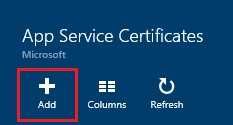
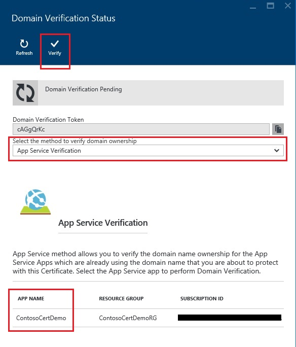

<properties
    pageTitle="Acquistare e configurare un certificato SSL per il servizio di App Azure"
    description="Informazioni su come acquistare e configurare un certificato SSL per il servizio di App Azure."
    services="app-service"
    documentationCenter=".net"
    authors="apurvajo"
    manager="stefsch"
    editor="cephalin"
    tags="buy-ssl-certificates"/>

<tags
    ms.service="app-service"
    ms.workload="na"
    ms.tgt_pltfrm="na"
    ms.devlang="na"
    ms.topic="article"
    ms.date="09/19/2016"
    ms.author="apurvajo"/>

#Acquistare e configurare un certificato SSL per il servizio di App Azure

> [AZURE.SELECTOR]
- [Acquistare certificato SSL in Azure](web-sites-purchase-ssl-web-site.md)
- [Utilizzare certificato SSL da un' posizione](web-sites-configure-ssl-certificate.md)

Per impostazione predefinita, **[Servizio App Azure](http://go.microsoft.com/fwlink/?LinkId=529714)** consente già HTTPS per un'app web con un certificato con caratteri jolly per la *. azurewebsites.net dominio. Se non si intende configurare un dominio personalizzato, è possibile trarre vantaggio dal certificato HTTPS predefinito. Tuttavia, come tutti * [jolly domini](https://casecurity.org/2014/02/26/pros-and-cons-of-single-domain-multi-domain-and-wildcard-certificates), non è protetto con un dominio personalizzato con il proprio certificato. Servizio App Azure ora consente è davvero semplificata di acquistare e gestire un certificato SSL direttamente dal portale di Azure senza lasciare il portale.  
In questo articolo viene spiegato come acquistare e configurare un certificato SSL per il **[Servizio di App Azure](http://go.microsoft.com/fwlink/?LinkId=529714)** in 3 semplici passaggi. 

> [AZURE.NOTE]
> I certificati SSL per i nomi di dominio personalizzato non è possibile usare con gratuito e Shared web app. È necessario configurare un'applicazione web per la modalità di base, Standard o Premium, che può cambiare quantità vengono addebitate per l'abbonamento. Per ulteriori informazioni, vedere **[Web App prezzi dettagli](https://azure.microsoft.com/pricing/details/web-sites/)** .

##Panoramica
> [AZURE.NOTE]
> Non tentare di acquisto di un certificato SSL utilizzando una sottoscrizione che non dispone di una carta di credito attivo è associato. Questo potrebbe causare l'abbonamento viene disabilitato. 

##<a>Acquistare, archiviare e assegnare un certificato SSL per il dominio personalizzato</a>
Per abilitare HTTPS per un dominio personalizzato, ad esempio contoso.com, è necessario innanzitutto ** [configurare un nome di dominio personalizzato nel servizio di App Azure.](web-sites-custom-domain-name.md)**

Prima di richiedere un certificato SSL, è necessario determinare quali nomi di dominio verranno protette tramite il certificato. Questo consente di verificare il tipo di certificato è necessario ottenere. Se è necessario proteggere un nome di dominio singolo, ad esempio contoso.com o www.contoso.com Standard (base) è sufficiente certificato. Se è necessario proteggere più nomi di dominio, ad esempio contoso.com, www.contoso.com e mail.contoso.com, è possibile ottenere un ** [certificato con caratteri jolly](http://en.wikipedia.org/wiki/Wildcard_certificate)**

##Passaggio 0: Inserire un ordine di certificato SSL

In questo passaggio si imparerà a effettuare un ordine di un certificato SSL di propria scelta.

1.  Nel **[Portale di Azure](https://portal.azure.com/)**, fare clic su Sfoglia e digitare "Certificati di servizio App" nella barra di ricerca e selezionare "Certificati di servizio App" dal risultato e fare clic su Aggiungi. 

    

    

2.  Immettere **nome descrittivo** per il certificato SSL.

3.  Immettere **nome Host**
> [AZURE.NOTE]
    Questa è una delle parti più importanti del processo di acquisto. Assicurarsi di immettere il nome di host corretto (dominio personalizzato) che si desidera proteggere con questo certificato. **Non** aggiungere il nome Host con WWW. Ad esempio, se il nome di dominio personalizzato è www.contoso.com, immettere contoso.com nella casella Nome Host, il certificato in questione protegge domini www e radice. 
    
4.  Selezionare l' **abbonamento**. 

    Se si hanno più abbonamenti, assicurarsi che creare un certificato SSL nello stesso abbonamento utilizzata per il dominio personalizzato o Web App in questione.
       
5.  Selezionare o creare un **gruppo di risorse**.

    Gruppi di risorse consentono di gestire le relative risorse Azure come unità e sono utili quando si stabilisce basato sui ruoli (RBAC) regole di controllo delle applicazioni. Per ulteriori informazioni, vedere gestire le risorse Azure.
     
6.  Selezionare il **certificato SKU** 

    Infine, selezionare il certificato SKU adatto alle proprie esigenze e fare clic su Crea. Oggi, servizio App Azure consente di acquistare due diversi SKU • S1-certificato Standard con validità 1 anno e il rinnovo automatico  
           • W1-certificato di caratteri jolly con il rinnovo automatico e la validità dell'anno 1      
    Per ulteriori informazioni, vedere **[Web App prezzi dettagli](https://azure.microsoft.com/pricing/details/web-sites/)** .

> [AZURE.NOTE]
> Creazione di certificato SSL può richiedere da 1 a 10 minuti. Questa procedura consente di eseguire più passaggi sfondo in caso contrario sono molto difficili da eseguire manualmente.  

##Passaggio 1: Archiviare il certificato nell'archivio di chiave Azure

In questo passaggio si imparerà a inserire un archivio di un certificato SSL è stato acquistato in Azure chiave archivio di propria scelta.

1.  Una volta completata l'acquisto di certificato SSL è necessario aprire manualmente blade risorsa **App servizio certificati** selezionando nuovamente (vedere il passaggio 1)   

    

    Si noterà che lo stato del certificato **"in attesa del rilascio"** vi sono alcune operazioni aggiuntive che è necessario completare prima che è possibile iniziare a usare questo certificato.
 
2. Fare clic su **"Configurazione dei certificati"** all'interno di blade di proprietà del certificato e fare clic su **"passaggio 1: archiviare"** per archiviare il certificato nell'archivio di chiave Azure.

3.  Da fare clic su Blade **"chiave archivio stato"** in **"chiave archivio Repository"** per scegliere un archivio di chiave esistente per archiviare il certificato **o "creare di nuovo archivio di chiave"** per creare un nuovo archivio di chiave all'interno di gruppo stesso abbonamento e delle risorse.
 
    
 
    > [AZURE.NOTE]
    Azure archivio chiave ha minimi in base alle tariffe per l'archiviazione di questo certificato. Per ulteriori informazioni, vedere **[I dettagli di prezzi di Azure chiave archivio](https://azure.microsoft.com/pricing/details/key-vault/)** .

4. Dopo aver selezionato l'archivio di archivio chiave per archiviare il certificato in, procedere e archiviarlo facendo clic sul pulsante **"Archiviare"** nella parte superiore della stessa e **"chiave archivio stato"** .  

    Questa operazione deve completare il passaggio all'archiviazione il certificato è stato acquistato con Azure chiave archivio di propria scelta. Dopo l'aggiornamento e il, verrà visualizzata selezionare verde contrassegnare contro anche in questo passaggio.
    
##Passaggio 2: Verificare la proprietà del dominio

In questo passaggio si imparerà eseguire verifica la proprietà del dominio per un certificato SSL che si è semplicemente posizionato un ordine per. 

1.  Fare clic su **"passaggio 2: verificare"** passaggio da e il **"Configurazione dei certificati"** . Sono disponibili 4 tipi di dominio verifica supportata da App servizio certificati.

    * **Verifica del servizio di App** 
    
        * Si tratta del processo più semplice se si dispone già di **un dominio personalizzato assegnato alle applicazioni di servizio App.** Questo metodo verrà elencati su tutte le applicazioni di servizio App che soddisfano i criteri specificati. 
           Ad esempio, in questo caso, **contosocertdemo.com** è un dominio personalizzato assegnato all'applicazione di servizio App denominata **"ContosoCertDemo"** e pertanto è l'applicazione di servizio App solo elencati qui. Se si sono verificati distribuzione più aree, da elencarle tutto le aree geografiche.
        
           Il metodo di verifica è disponibile per gli acquisti certificato (base) Standard. Per i certificati di caratteri jolly, ignorare e passare all'opzione B, C e D riportata di seguito.
        * Fare clic sul pulsante **"Verifica"** per completare questo passaggio.
        * Fare clic su **"Aggiorna"** per aggiornare lo stato del certificato termine della verifica. Può richiedere alcuni minuti per la verifica completare.
        
             

    * **Verifica del dominio** 

        * Si tratta del processo più comodo **solo se** si dispone di **[acquistato un dominio personalizzato da Azure App servizio.](custom-dns-web-site-buydomains-web-app.md)**
        
        * Fare clic sul pulsante **"Verifica"** per completare questo passaggio.
        
        * Fare clic su **"Aggiorna"** per aggiornare lo stato del certificato termine della verifica. Può richiedere alcuni minuti per la verifica completare.

    * **Verifica messaggi**
        
        * Messaggio di verifica è già stato inviato per gli indirizzi di posta elettronica associato a questo dominio personalizzato.
         
        * Aprire il messaggio di posta elettronica e fare clic sul collegamento per la verifica per completare il passaggio di verifica della posta elettronica. 
        
        * Se è necessario inviarla di nuovo il messaggio di verifica, fare clic sul pulsante **"Rinvia messaggio di posta elettronica"** .
         
    * **Verifica manuale**    
                 
        1. **Verifica della pagina Web HTML**
        
            * Creare un file HTML denominato HTML **{Dominio verifica Token}**(è possibile copiare il token da ha dominio verifica stato Blade)
            
            * Il contenuto del file deve essere lo stesso nome di **Dominio verifica Token**.
            
            * Caricare il file nella radice del server web che ospita il dominio.
            
            * Fare clic su **"Aggiorna"** per aggiornare lo stato del certificato termine della verifica. Può richiedere alcuni minuti per la verifica completare.
            
            Ad esempio, se si sta acquistando un certificato standard per contosocertdemo.com con dominio verifica Token **'cAGgQrKc'** quindi una richiesta web apportata a **'http://contosocertdemo.com/cAGgQrKc.html'** deve restituire **cAGgQrKc.**
        2. **Verifica dei Record TXT DNS**

            * Utilizzando il gestore DNS creare un record TXT su sottodominio **'DZC'** con valore uguale alla **dominio verifica Token.**
            
            * Fare clic su **"Aggiorna"** per aggiornare lo stato del certificato termine della verifica. Può richiedere alcuni minuti per la verifica completare.
                              
            Ad esempio, per eseguire la convalida per un certificato con caratteri jolly con hostname ** \*. contosocertdemo.com** o ** \*. subdomain.contosocertdemo.com** e dominio verifica Token **cAGgQrKc**, è necessario creare un record TXT su dzc.contosocertdemo.com con valore **cAGgQrKc.**     

##Passaggio 3: Assegnare certificato all'applicazione di servizio di App

In questo passaggio si imparerà cui assegnare la appena acquistato certificato per le applicazioni di servizio App. 

> [AZURE.NOTE]
> Prima di eseguire la procedura descritta in questa sezione, è necessario associato un nome di dominio personalizzato con l'app. Per ulteriori informazioni, vedere [configurazione di un nome di dominio personalizzato per un'App web](web-sites-custom-domain-name.md) ****

1.  Nel browser, aprire la ** [Azure Portal.](https://portal.azure.com/)**
2.  Fare clic sull'opzione di **Servizio App** sul lato sinistro della pagina.
3.  Fare clic sul nome dell'app a cui si desidera assegnare il certificato. 
4.  In **Impostazioni**fare clic su **certificati SSL**
5.  Fare clic su **Importa App servizio certificato** e selezionare il certificato appena acquistato

    

6. In **binding ssl** sezione fare clic su **aggiungere associazioni**
7. In e **l'Aggiungere SSL associazione** per elenchi a discesa selezionare il nome di dominio per la protezione con SSL e il certificato da utilizzare. È inoltre possibile selezionare se si desidera utilizzare **[l'Indicazione di nome Server (SNI)](http://en.wikipedia.org/wiki/Server_Name_Indication)** o indirizzi IP in base a SSL.

    

       •    IP based SSL associates a certificate with a domain name by mapping the dedicated public IP address of the server to the domain name. This requires each domain name (contoso.com, fabricam.com, etc.) associated with your service to have a dedicated IP address. This is the traditional          method of associating SSL certificates with a web server.
       •    SNI based SSL is an extension to SSL and **[Transport Layer Security](http://en.wikipedia.org/wiki/Transport_Layer_Security)** (TLS) that allows multiple domains to share the same IP address, with separate security certificates for each domain. Most modern browsers (including Internet Explorer, Chrome, Firefox and Opera) support SNI, however older browsers may not support SNI. For more information on SNI, see the **[Server Name Indication](http://en.wikipedia.org/wiki/Server_Name_Indication)** article on Wikipedia.
       
7. Fare clic su **Aggiungi associazione** per salvare le modifiche e attivare SSL.

Se si seleziona **SSL basate su IP** e un dominio personalizzato è configurato con un record, è necessario eseguire i passaggi aggiuntivi seguenti:

* Dopo aver configurato un indirizzo IP in base a binding SSL, viene assegnato un indirizzo IP dedicato all'app. È possibile trovare l'indirizzo IP nella pagina relativa al **dominio personalizzato** in impostazioni dell'app, immediatamente di sopra della sezione **nome host** . Tale sconto sarà elencato come **Indirizzo IP esterno**
    
    

    Si noti che l'indirizzo IP è diverso da quello all'indirizzo IP precedentemente utilizzato per configurare il record per il dominio. Se è configurato per l'utilizzo SNI in base a SSL o non sono configurati per l'utilizzo di SSL, non sarà elencato alcun indirizzo per la voce.
    
2. Gli strumenti disponibili per il proprio registrar, modificare il record a per il nome di dominio personalizzato in modo che puntino all'indirizzo IP ottenuto nel passaggio precedente.
A questo punto dovrebbe essere possibile visitare le app con HTTPS:// invece di HTTP:// per verificare che il certificato è stato configurato correttamente.

##Reimpostazione e sincronizzare il certificato

1. Per motivi di sicurezza, se è necessario reimpostazione certificato quindi è sufficiente selezionare opzione **"reimpostazione e Sincronizza"** da **"proprietà certificato"** Blade. 

2. Fare clic sul pulsante **"Reimpostazione"** per avviare il processo. Questo processo può richiedere 1-10 minuti. 

    

3. Reimpostazione del certificato verrà rullo certificato con un nuovo certificato emesso da autorità di certificazione.
4. Non essere addebita per la reimpostazione delle chiavi per la durata del certificato. 
5. Reimpostazione del certificato andrà tramite lo stato del rilascio in sospeso. 
6. Quando il certificato è pronto assicurarsi che vengono sincronizzate le risorse utilizzando questo certificato per evitare disservizi per il servizio.
7. Opzione Sincronizza non è disponibile per i certificati che non ancora assegnati all'App Web. 

## Altre risorse ##
- [Abilita HTTPS per un'app nel servizio App Azure](web-sites-configure-ssl-certificate.md)
- [Acquistare e configurare un nome di dominio personalizzato in servizio App Azure](custom-dns-web-site-buydomains-web-app.md)
- [Centro protezione di Microsoft Azure](/support/trust-center/security/)
- [Opzioni di configurazione sbloccate in siti Web di Azure](http://azure.microsoft.com/blog/2014/01/28/more-to-explore-configuration-options-unlocked-in-windows-azure-web-sites/)
- [Portale di gestione di Azure](https://manage.windowsazure.com)

>[AZURE.NOTE] Se si desidera iniziare a utilizzare il servizio di App Azure prima di iscriversi a un account Azure, accedere al [Servizio App provare](http://go.microsoft.com/fwlink/?LinkId=523751), in cui è possibile creare immediatamente un'app web starter breve nel servizio di App. Nessun carte di credito obbligatorio; Nessun impegni.

