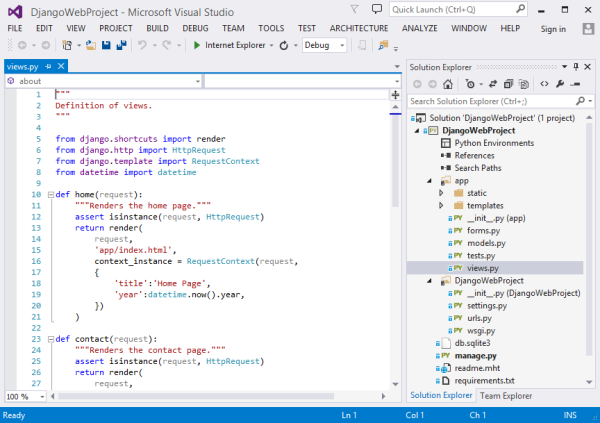
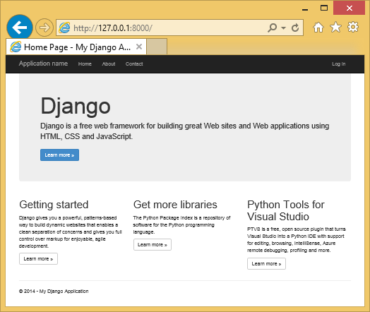
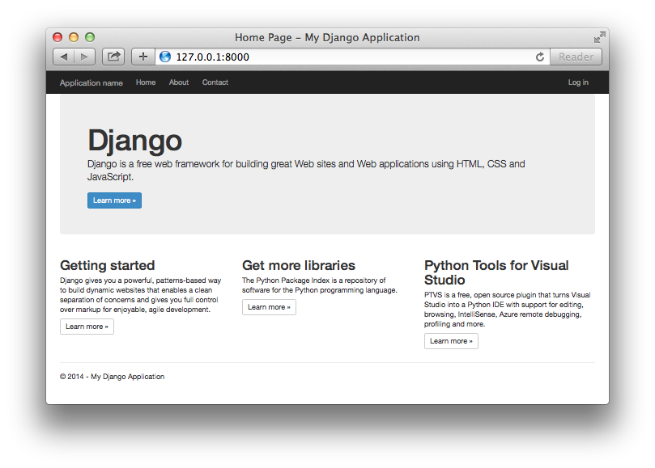

<properties
    pageTitle="Creazione di applicazioni web con Django in Azure"
    description="Esercitazione in cui viene presentato l'esecuzione di un'app web Python in Azure App servizio Web Apps."
    services="app-service\web"
    documentationCenter="python"
    tags="python"
    authors="huguesv" 
    manager="wpickett" 
    editor=""/>

<tags
    ms.service="app-service-web"
    ms.workload="web"
    ms.tgt_pltfrm="na"
    ms.devlang="python"
    ms.topic="hero-article" 
    ms.date="02/19/2016"
    ms.author="huvalo"/>

# Creazione di applicazioni web con Django in Azure

In questa esercitazione viene descritto come iniziare a esecuzione Python in [Azure App servizio Web Apps](http://go.microsoft.com/fwlink/?LinkId=529714). Web App fornisce limitato gratuita di hosting e distribuzione rapida ed è possibile utilizzare Python! Man mano che cresce l'app, è possibile passare a pagamento hosting e può inoltre essere integrato con tutti gli altri servizi Azure.

È necessario creare un'applicazione utilizzando il framework web Django (vedere versioni alternative di questa esercitazione per [pallone](web-sites-python-create-deploy-flask-app.md) e [bottiglia](web-sites-python-create-deploy-bottle-app.md)). Si verrà creare l'applicazione web da Azure Marketplace, configurare la distribuzione fra e duplicare l'archivio locale. Quindi si verrà eseguito l'applicazione in locale, apportare le modifiche, eseguire il commit e inviarli a Azure. L'esercitazione viene illustrato come eseguire questa operazione da Windows o Mac o Linux.

[AZURE.INCLUDE [create-account-and-websites-note](../../includes/create-account-and-websites-note.md)]

>[AZURE.NOTE] Se si desidera iniziare a utilizzare il servizio di App Azure prima di iscriversi a un account Azure, accedere al [Servizio App provare](http://go.microsoft.com/fwlink/?LinkId=523751), in cui è possibile creare immediatamente un'app web starter breve nel servizio di App. Nessun carte di credito obbligatorio; Nessun impegni.

## Prerequisiti

- Windows, Mac o Linux
- 2.7 Python o 3.4
- setuptools, pip, virtualenv (solo 2.7 Python)
- Operazioni
- [Python Tools per Visual Studio][] Si noti (PTVS) -: facoltativo

**Nota**: la pubblicazione TFS non è attualmente supportata per i progetti Python.

### Windows

Se non si dispone già 2.7 Python o 3,4 installati (32 bit), è consigliabile installare [Azure SDK per Python 2.7] o [Azure SDK per Python 3.4] mediante Installazione guidata piattaforma Web. Consente di installare la versione a 32 bit di Python, setuptools, pip, virtualenv e così via (32 bit Python è ciò che è installato nel computer host Azure). In alternativa, è possibile ottenere Python da [python.org].

Per operazioni, è consigliabile [Fra per Windows] o [GitHub per Windows]. Se si utilizza Visual Studio, è possibile utilizzare il supporto fra integrato.

È anche consigliabile installare [Python 2.2 Tools per Visual Studio]. Facoltativo, ma se si dispone di [Visual Studio], inclusa la gratuito 2013 di Visual Studio della Community o Visual Studio Express 2013 per Web, quindi verrà visualizzato un ottimo IDE Python.

### Mac o Linux

È necessario disporre di Python e fra già installato, ma accertarsi di avere 2.7 Python o 3.4.

## Creazione di App Web nel portale

Il primo passaggio per la creazione dell'applicazione consiste nel creare l'applicazione web tramite il [Portale di Azure](https://portal.azure.com).

1. Accedere al portale di Azure e fare clic sul pulsante **Nuovo** nell'angolo inferiore sinistro.
3. Nella casella di ricerca, digitare "python".
4. Nei risultati della ricerca, selezionare **Django** (pubblicata PTVS), quindi fare clic su **Crea**.
5. Configurare la nuova app Django, ad esempio la creazione di un nuovo piano di servizio di App e un nuovo gruppo di risorse per renderla. Quindi fare clic su **Crea**.
6. Configurare la pubblicazione dei fra per un'app web appena creato seguendo le istruzioni disponibili in fase di [Distribuzione locale di fra al servizio App Azure](app-service-deploy-local-git.md).

## Panoramica dell'applicazione

### Contenuto dell'archivio fra

Ecco una panoramica dei file che sono disponibili nell'archivio di fra iniziale, è necessario duplicare nella sezione successiva.

    \app\__init__.py
    \app\forms.py
    \app\models.py
    \app\tests.py
    \app\views.py
    \app\static\content\
    \app\static\fonts\
    \app\static\scripts\
    \app\templates\about.html
    \app\templates\contact.html
    \app\templates\index.html
    \app\templates\layout.html
    \app\templates\login.html
    \app\templates\loginpartial.html
    \DjangoWebProject\__init__.py
    \DjangoWebProject\settings.py
    \DjangoWebProject\urls.py
    \DjangoWebProject\wsgi.py

Origini principali per l'applicazione. È costituito da 3 pagine (indice, sul contatto) con un layout master. Script e in contenuto statico includono avvio, jquery, modernizr e rispondere.

    \manage.py

Gestione locale e il supporto del server di sviluppo. Consente di eseguire l'applicazione in locale, sincronizzare il database e così via.

    \db.sqlite3

Database predefinito. Include le tabelle necessarie per l'applicazione da eseguire, ma non contiene tutti gli utenti (sincronizzare il database per creare un utente).

    \DjangoWebProject.pyproj
    \DjangoWebProject.sln

File di progetto per l'utilizzo con [Python Tools per Visual Studio].

    \ptvs_virtualenv_proxy.py

Proxy IIS per gli ambienti virtuali e PTVS debug supporto remoto.

    \requirements.txt

Pacchetti esterni necessari per l'applicazione. Script di distribuzione verrà pip installare i pacchetti elencati in questo file.

    \web.2.7.config
    \web.3.4.config

File di configurazione IIS. Script di distribuzione verrà utilizzate web.x.y.config appropriato e copiare come config.

### File facoltativi - distribuzione personalizzazione

[AZURE.INCLUDE [web-sites-python-django-customizing-deployment](../../includes/web-sites-python-django-customizing-deployment.md)]

### File facoltativi - Python runtime

[AZURE.INCLUDE [web-sites-python-customizing-runtime](../../includes/web-sites-python-customizing-runtime.md)]

### File aggiuntivi sul server

Alcuni file esistono nel server ma non vengono aggiunti all'archivio fra. Vengono creati tramite lo script di distribuzione.

    \web.config

File di configurazione IIS. Creato da web.x.y.config in ogni distribuzione.

    \env\

Ambiente virtuale Python. Se un ambiente virtuale compatibile non esiste già in web app, creato durante la distribuzione. Pacchetti elencati in requirements.txt sono pip installate, ma pip verranno ignorate installazione se i pacchetti sono già installati.

Le 3 successivo sezioni viene descritto come procedere con lo sviluppo di app web in ambienti diversi 3:

- Windows con gli strumenti di Python per Visual Studio
- Windows con riga di comando
- Mac o Linux con riga di comando

## Sviluppo di app Web - Windows - Python Tools per Visual Studio

### Duplicare l'archivio

Prima di tutto duplicare archivio mediante l'URL specificato nel portale di Azure. Per ulteriori informazioni, vedere [Distribuzione fra locale al servizio App Azure](app-service-deploy-local-git.md).

Aprire il file di soluzione (sln) che è incluso nella radice del repository.

### Creare un ambiente virtuale

A questo punto è necessario creare un ambiente virtuale per lo sviluppo locale. Fare clic su Seleziona **Python ambienti** **Aggiungere ambiente virtuale**.

- Verificare che sia il nome dell'ambiente `env`.

- Selezionare l'interprete di base. Assicurarsi di usare la stessa versione di Python che sia selezionata per un'app web (in runtime.txt o e **l'Impostazioni applicazione** di un'app web nel portale di Azure).

- Verificare che sia selezionata l'opzione per scaricare e installare pacchetti.

Fare clic su **Crea**. Verrà creare l'ambiente virtuale e installato dipendenze elencate in requirements.txt.

### Creare un utente avanzato

Il database incluso con l'applicazione non dispone di qualsiasi utente avanzato definito. Per utilizzare la funzionalità di accesso nell'applicazione o l'interfaccia di amministrazione di Django (se si decide di abilitarla), è necessario creare un utente avanzato.

Eseguire questo strumento dalla riga di comando dalla cartella del progetto:

    env\scripts\python manage.py createsuperuser

Seguire le istruzioni visualizzate per configurare il nome utente, password e così via.

### Eseguire tramite il server di sviluppo

Premere F5 per avviare il debug e il web browser verrà aperta automaticamente alla pagina in esecuzione in locale.

È possibile impostare i punti di interruzione di origini, utilizzare le finestre Espressioni di controllo e così via. Vedere gli [Strumenti di Python per la documentazione di Visual Studio] per ulteriori informazioni su varie caratteristiche.

### Apportare modifiche

A questo punto è possibile provare ad apportare modifiche a origini dell'applicazione e/o modelli.

Dopo avere verificato le modifiche, eseguire il commit repository fra:

### Installare più pacchetti

L'applicazione potrebbe avere dipendenze oltre Python e Django.

È possibile installare pacchetti aggiuntivi utilizzando pip. Per installare un pacchetto, il pulsante destro sull'ambiente virtuale e selezionare **Installa pacchetto Python**.

Ad esempio, per installare Azure SDK per Python, che consente di accedere per lo spazio di archiviazione Azure, bus di servizio e altri servizi di Azure, immettere `azure`:

Pulsante destro del mouse sull'ambiente virtuale e selezionare **Genera requirements.txt** aggiornare requirements.txt.

Quindi, eseguire il commit delle modifiche requirements.txt all'archivio fra.

### Distribuire Azure

Per avviare una distribuzione, fare clic su **Sincronizza** o **Push**. Sincronizzazione indica un push e un pull.

La distribuzione prima richiederà molto tempo, come verrà creato un ambiente virtuale, pacchetti di installazione e così via.

Non è visualizzato l'avanzamento della distribuzione in Visual Studio. Se si desidera esaminare l'output, vedere la sezione sulla [risoluzione dei problemi - distribuzione](#troubleshooting-deployment).

Passare all'URL di Azure per visualizzare le modifiche.

## Riga di comando sviluppo - Windows - Web app

### Duplicare l'archivio

Prima di tutto duplicare archivio mediante l'URL specificato nel portale di Azure e aggiungere repository Azure come un remoto. Per ulteriori informazioni, vedere [Distribuzione fra locale al servizio App Azure](app-service-deploy-local-git.md).

    git clone <repo-url>
    cd <repo-folder>
    git remote add azure <repo-url>

### Creare un ambiente virtuale

È necessario creare un nuovo ambiente virtuale in fase di sviluppo (non aggiungerlo al repository). Gli ambienti virtuali in Python non sono rilocabile, in modo che ogni sviluppatore lavorando l'applicazione creerà le proprie in locale.

Assicurarsi di usare la stessa versione di Python che sia selezionata per un'app web (in runtime.txt o e l'impostazioni applicazione di un'app web nel portale di Azure).

Per Python 2.7:

    c:\python27\python.exe -m virtualenv env

Per Python 3.4:

    c:\python34\python.exe -m venv env

Installare eventuali pacchetti esterni necessari per l'applicazione. È possibile utilizzare il file requirements.txt nella radice del repository per installare i pacchetti nell'ambiente virtuale:

    env\scripts\pip install -r requirements.txt

### Creare un utente avanzato

Il database incluso con l'applicazione non dispone di qualsiasi utente avanzato definito. Per utilizzare la funzionalità di accesso nell'applicazione o l'interfaccia di amministrazione di Django (se si decide di abilitarla), è necessario creare un utente avanzato.

Eseguire questo strumento dalla riga di comando dalla cartella del progetto:

    env\scripts\python manage.py createsuperuser

Seguire le istruzioni visualizzate per configurare il nome utente, password e così via.

### Eseguire tramite il server di sviluppo

È possibile avviare l'applicazione in un server di sviluppo con il comando seguente:

    env\scripts\python manage.py runserver

Console di visualizzerà l'URL e ascolta porta server:

Aprire il web browser dell'URL.

### Apportare modifiche

A questo punto è possibile provare ad apportare modifiche a origini dell'applicazione e/o modelli.

Dopo avere verificato le modifiche, eseguire il commit repository fra:

    git add <modified-file>
    git commit -m "<commit-comment>"

### Installare più pacchetti

L'applicazione potrebbe avere dipendenze oltre Python e Django.

È possibile installare pacchetti aggiuntivi utilizzando pip. Ad esempio, per installare Azure SDK per Python, che consente di accedere per lo spazio di archiviazione Azure, bus di servizio e altri servizi di Azure, digitare:

    env\scripts\pip install azure

Assicurarsi di aggiornare requirements.txt:

    env\scripts\pip freeze > requirements.txt

Eseguire il commit delle modifiche:

    git add requirements.txt
    git commit -m "Added azure package"

### Distribuire Azure

Per avviare una distribuzione, rendere disponibili le modifiche in Azure:

    git push azure master

Verrà visualizzata l'output dello script di distribuzione, tra cui la creazione dell'ambiente virtuale, installazione del pacchetto, la creazione di config.

Passare all'URL di Azure per visualizzare le modifiche.

## Riga di comando sviluppo - Mac o Linux - Web app

### Duplicare l'archivio

Prima di tutto duplicare archivio mediante l'URL specificato nel portale di Azure e aggiungere repository Azure come un remoto. Per ulteriori informazioni, vedere [Distribuzione fra locale al servizio App Azure](app-service-deploy-local-git.md).

    git clone <repo-url>
    cd <repo-folder>
    git remote add azure <repo-url>

### Creare un ambiente virtuale

È necessario creare un nuovo ambiente virtuale in fase di sviluppo (non aggiungerlo al repository). Gli ambienti virtuali in Python non sono rilocabile, in modo che ogni sviluppatore lavorando l'applicazione creerà le proprie in locale.

Assicurarsi di usare la stessa versione di Python che sia selezionata per un'app web (in runtime.txt o e l'impostazioni applicazione di un'app web nel portale di Azure).

Per Python 2.7:

    python -m virtualenv env

Per Python 3.4:

    python -m venv env

o

    pyvenv env

Installare eventuali pacchetti esterni necessari per l'applicazione. È possibile utilizzare il file requirements.txt nella radice del repository per installare i pacchetti nell'ambiente virtuale:

    env/bin/pip install -r requirements.txt

### Creare un utente avanzato

Il database incluso con l'applicazione non dispone di qualsiasi utente avanzato definito. Per utilizzare la funzionalità di accesso nell'applicazione o l'interfaccia di amministrazione di Django (se si decide di abilitarla), è necessario creare un utente avanzato.

Eseguire questo strumento dalla riga di comando dalla cartella del progetto:

    env/bin/python manage.py createsuperuser

Seguire le istruzioni visualizzate per configurare il nome utente, password e così via.

### Eseguire tramite il server di sviluppo

È possibile avviare l'applicazione in un server di sviluppo con il comando seguente:

    env/bin/python manage.py runserver

Console di visualizzerà l'URL e ascolta porta server:

Aprire il web browser dell'URL.

### Apportare modifiche

A questo punto è possibile provare ad apportare modifiche a origini dell'applicazione e/o modelli.

Dopo avere verificato le modifiche, eseguire il commit repository fra:

    git add <modified-file>
    git commit -m "<commit-comment>"

### Installare più pacchetti

L'applicazione potrebbe avere dipendenze oltre Python e Django.

È possibile installare pacchetti aggiuntivi utilizzando pip. Ad esempio, per installare Azure SDK per Python, che consente di accedere per lo spazio di archiviazione Azure, bus di servizio e altri servizi di Azure, digitare:

    env/bin/pip install azure

Assicurarsi di aggiornare requirements.txt:

    env/bin/pip freeze > requirements.txt

Eseguire il commit delle modifiche:

    git add requirements.txt
    git commit -m "Added azure package"

### Distribuire Azure

Per avviare una distribuzione, rendere disponibili le modifiche in Azure:

    git push azure master

Verrà visualizzata l'output dello script di distribuzione, tra cui la creazione dell'ambiente virtuale, installazione del pacchetto, la creazione di config.

Passare all'URL di Azure per visualizzare le modifiche.

## Risoluzione dei problemi - installazione del pacchetto

[AZURE.INCLUDE [web-sites-python-troubleshooting-package-installation](../../includes/web-sites-python-troubleshooting-package-installation.md)]

## Risoluzione dei problemi - ambiente virtuale

[AZURE.INCLUDE [web-sites-python-troubleshooting-virtual-environment](../../includes/web-sites-python-troubleshooting-virtual-environment.md)]

## Risoluzione dei problemi - file statici

Django include il concetto di raccolta dei file statici. In questo modo tutti statica file dalla posizione originale e copiati in una singola cartella. Per questa applicazione, vengono copiati `/static`.

Ciò avviene perché i file statici possono provenire da diversa Django 'App'. Ad esempio, i file statici tramite l'interfaccia di amministrazione di Django si trovano in una sottocartella di una raccolta Django nell'ambiente virtuale. Statica definito dall'applicazione si trovano `/app/static`. Quando si usa più Django 'App', sarà necessario statici file presenti in più posizioni.

Durante l'esecuzione dell'applicazione in modalità di debug, l'applicazione serve file statici dalla posizione originale.

Durante l'esecuzione dell'applicazione in modalità di rilascio, l'applicazione esegue **non** utilizzati file statici. È responsabilità del server web per i file. Per questa applicazione IIS serve file statici da `/static`.

La raccolta di file statici viene eseguita automaticamente come parte dello script di distribuzione, deselezionando precedentemente raccolte file. Questo errore indica la raccolta viene eseguita in ogni distribuzione rallentare un po' distribuzione ma garantisce che i file obsolete non saranno disponibili, come evitare problemi di protezione.

Se si vuole ignorare la raccolta di file statici per l'applicazione Django:

    \.skipDjango

Quindi è necessario eseguire la raccolta manualmente sul computer locale:

    env\scripts\python manage.py collectstatic

Rimuovere il `\static` cartella da `.gitignore` e aggiungerlo all'archivio fra.

## Risoluzione dei problemi - impostazioni

Varie impostazioni per l'applicazione possono essere modificate `DjangoWebProject/settings.py`.

Per maggiore comodità sviluppo, è attivata la modalità di debug. Un effetto di lato pile di cui è che sarà possibile visualizzare le immagini e altro contenuto statico durante l'esecuzione in locale, senza dover raccogliere file statici.

Per disattivare la modalità di debug:

    DEBUG = False

Quando è disabilitato debug, il valore di `ALLOWED_HOSTS` deve essere aggiornata per includere il nome host Azure. Per esempio:

    ALLOWED_HOSTS = (
        'pythonapp.azurewebsites.net',
    )

o per attivare qualsiasi:

    ALLOWED_HOSTS = (
        '*',
    )

In pratica, è consigliabile eseguire operazioni più complesse per gestire il passaggio tra debug e rilasciare la modalità e visualizzato il nome host.

È possibile impostare le variabili di ambiente tramite il portale di Azure pagina **Configura** , nella sezione **Impostazioni applicazione** .  Può essere utile per impostare i valori che è consigliabile non visualizzare nelle origini (stringhe di connessione, password, e così via) o che si desidera impostare in modo diverso tra Azure e computer locale. In `settings.py`, è possibile eseguire una query le variabili di ambiente utilizzando `os.getenv`.

## Utilizzo di un Database

Il database è incluso con l'applicazione è un database sqlite. Si tratta di un database predefinito più utili e frequenti comodo da utilizzare per lo sviluppo, come richiede l'esecuzione di quasi alcuna imposta. Il database è archiviato nel file db.sqlite3 nella cartella del progetto.

Azure offre servizi di database sono facili da utilizzare da un'applicazione Django. Esercitazioni per l'uso di [Database SQL] e [MySQL] da un'applicazione di Django mostrano i passaggi necessari per creare il servizio di database, modificare le impostazioni di database in `DjangoWebProject/settings.py`e le librerie necessarie per l'installazione.

Naturalmente, se si preferisce per gestire il proprio server di database, è possibile eseguire in modo utilizzando Windows o Linux macchine virtuali in esecuzione in Azure.

## Interfaccia di amministrazione Django

Dopo avere iniziato la creazione di modelli, è consigliabile popolare il database con alcuni dati. Un modo semplice per aggiungere e modificare il contenuto in modo interattivo consiste nell'utilizzare l'interfaccia di amministrazione di Django.

Il codice per l'interfaccia di amministrazione commento nell'origine dell'applicazione, ma sia chiaramente contrassegnata in modo che è possibile facilmente attivarlo (Cerca 'admin').

Dopo l'attivazione, sincronizzare il database, eseguire l'applicazione e passare a `/admin`.

## Passaggi successivi

Seguire questi collegamenti per altre informazioni sugli strumenti Python e Django per Visual Studio:

- [Documentazione Django]
- [Strumenti di Python per la documentazione di Visual Studio]

Per informazioni sull'utilizzo di Database SQL e MySQL:

- [Django e MySQL in Azure con Python Tools per Visual Studio]
- [Django e Database SQL di Azure con Python Tools per Visual Studio]

Per ulteriori informazioni, vedere il [Centro per sviluppatori di Python](/develop/python/).

## Novità
* Per una Guida per la modifica da siti Web al servizio App vedere: [servizio App Azure e il relativo impatto sulla esistente servizi di Windows Azure](http://go.microsoft.com/fwlink/?LinkId=529714)

<!--Link references-->
[Django e MySQL in Azure con Python Tools per Visual Studio]: web-sites-python-ptvs-django-mysql.md
[Django e Database SQL di Azure con Python Tools per Visual Studio]: web-sites-python-ptvs-django-sql.md
[Database SQL]: web-sites-python-ptvs-django-sql.md
[MySQL]: web-sites-python-ptvs-django-mysql.md

<!--External Link references-->
[Azure SDK per Python 2.7]: http://go.microsoft.com/fwlink/?linkid=254281
[Azure SDK per Python 3.4]: http://go.microsoft.com/fwlink/?linkid=516990
[Python.org]: http://www.python.org/
[Operazioni per Windows]: http://msysgit.github.io/
[GitHub per Windows]: https://windows.github.com/
[Python Tools per Visual Studio]: http://aka.ms/ptvs
[Python 2.2 degli strumenti per Visual Studio]: http://go.microsoft.com/fwlink/?LinkID=624025
[Visual Studio]: http://www.visualstudio.com/
[Strumenti di Python per la documentazione di Visual Studio]: http://aka.ms/ptvsdocs
[Documentazione Django]: https://www.djangoproject.com/
