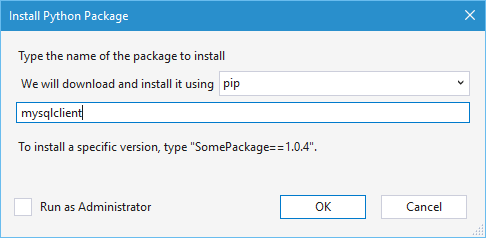

<properties 
    pageTitle="Django e MySQL in Azure con gli strumenti Python 2.2 per Visual Studio" 
    description="Informazioni su come usare gli strumenti di Python per Visual Studio per creare un'app web Django contenente dati in un'istanza di database MySQL e distribuire in Azure App servizio Web Apps." 
    services="app-service\web" 
    documentationCenter="python" 
    authors="huguesv" 
    manager="wpickett" 
    editor=""/>

<tags 
    ms.service="app-service-web" 
    ms.workload="web" 
    ms.tgt_pltfrm="na" 
    ms.devlang="python"
    ms.topic="get-started-article" 
    ms.date="07/07/2016"
    ms.author="huvalo"/>

# Django e MySQL in Azure con gli strumenti Python 2.2 per Visual Studio 

[AZURE.INCLUDE [tabs](../../includes/app-service-web-get-started-nav-tabs.md)]

In questa esercitazione si userà [Python Tools per Visual Studio] (PTVS) per creare un'app web di sondaggi semplice utilizzando uno dei modelli di esempio PTVS. Si apprenderà come utilizzare un servizio MySQL ospitato su Azure, come configurare l'applicazione web per l'utilizzo di MySQL e come pubblicare app web di [Azure App servizio Web Apps](http://go.microsoft.com/fwlink/?LinkId=529714).

> [AZURE.NOTE] Le informazioni contenute in questa esercitazione sono anche disponibile il video seguente:
> 
> [PTVS 2.1: App Django con MySQL][video]

Visitare il [Centro per sviluppatori di Python] per trovare altri articoli che illustrate sviluppo di Azure App servizio Web Apps con PTVS utilizza bottiglia, pallone e Django Framework web, con i servizi archivio tabelle Azure, MySQL e Database SQL. Mentre in questo articolo è incentrata su servizio di App, i passaggi sono simili durante lo sviluppo di [Servizi Cloud Windows Azure].

## Prerequisiti

 - Visual Studio 2015
 - [Python 2.7 versione a 32 bit] o [Python 3.4 versione a 32 bit]
 - [Python 2.2 degli strumenti per Visual Studio]
 - [Python 2.2 degli strumenti per esempi di Visual Studio VSIX]
 - [Azure SDK Tools per Visual Studio 2015]
 - Django 1,9 o versioni successiva

[AZURE.INCLUDE [create-account-and-websites-note](../../includes/create-account-and-websites-note.md)]

<!-- This note should not render as part of the the previous include. -->

> [AZURE.NOTE] Se si desidera iniziare a utilizzare il servizio di App Azure prima di iscriversi a un account Azure, accedere al [Servizio App provare](http://go.microsoft.com/fwlink/?LinkId=523751), in cui è possibile creare immediatamente un'app web starter breve nel servizio di App. Non è richiesta alcuna carta di credito e non impegni sono necessari.

## Creare il progetto

In questa sezione, sarà necessario creare un progetto di Visual Studio utilizzando un modello di esempio. È necessario creare un ambiente virtuale e installare pacchetti necessari. Sarà necessario creare un database locale utilizzando sqlite. È necessario eseguire l'applicazione in locale.

1. In Visual Studio, selezionare **File**, **Nuovo progetto**.

1. I modelli di progetto da [Python 2.2 Tools per Visual Studio esempi VSIX] sono disponibili in **Python**, **esempi**. Selezionare **Progetto Web Django sondaggi** e fare clic su OK per creare il progetto.

    

1. Verrà richiesto di installare pacchetti esterni. Selezionare **Installa in un ambiente virtuale**.

    

1. Selezionare **2.7 Python** o **Python 3.4** come interprete base.

    

1. In **Esplora soluzioni**, pulsante destro del mouse sul nodo del progetto e scegliere **Python**, quindi **Eseguire la migrazione di Django**.  Selezionare **L'utente di creare avanzato Django**.

1. Questo verrà aprire una Console di gestione Django e creare un database sqlite nella cartella del progetto. Seguire le istruzioni per creare un utente.

1. Verificare che l'applicazione funzioni premendo `F5`.

1. Fare clic su **accedere** dalla barra di spostamento nella parte superiore.

    

1. Immettere le credenziali per l'utente che è stato creato quando è possibile sincronizzare il database.

    

1. Fare clic su **creazione di sondaggi di esempio**.

    

1. Fare clic su un sondaggio e votare.

    

## Creare un Database MySQL

Per il database, sarà necessario creare un database ClearDB MySQL ospitato su Azure.

In alternativa, è possibile creare macchina virtuale in esecuzione in Azure, quindi installare e amministrare MySQL se stessi.

È possibile creare un database con un piano libero eseguendo la procedura seguente.

1. Accedere al [portale di Azure].

1. Nella parte superiore del riquadro di spostamento, fare clic su **Nuovo**, quindi fare clic su **dati + spazio di archiviazione**e quindi fare clic su **MySQL Database**. 

1. Configurare il nuovo database MySQL mediante la creazione di un nuovo gruppo di risorse e selezionare la posizione appropriata.

1. Dopo aver creato il database MySQL, fare clic su **proprietà** e il database.

1. Utilizzare il pulsante Copia per inserire il valore di **Stringa di connessione** negli Appunti.

## Configurare il progetto

In questa sezione, si verrà configurare il nostro web app per usare il database MySQL che appena creato. È inoltre necessario installare pacchetti Python aggiuntivi necessari per l'uso di database MySQL con Django. Quindi si eseguirà il web app in locale.

1. In Visual Studio, aprire **settings.py**dalla cartella *NomeProgetto* . Nell'editor temporaneamente incollare la stringa di connessione. La stringa di connessione viene visualizzato in questo formato:

        Database=<NAME>;Data Source=<HOST>;User Id=<USER>;Password=<PASSWORD>

    Modificare il database predefinito **motore** utilizzi MySQL e impostare i valori per **nome** **utente**, **PASSWORD** e **HOST** da **CONNECTIONSTRING**.

        DATABASES = {
            'default': {
                'ENGINE': 'django.db.backends.mysql',
                'NAME': '<Database>',
                'USER': '<User Id>',
                'PASSWORD': '<Password>',
                'HOST': '<Data Source>',
                'PORT': '',
            }
        }

1. In Esplora soluzioni in **Ambienti Python**, pulsante destro del mouse sull'ambiente virtuale e selezionare **Installa pacchetto Python**.

1. Installare il pacchetto `mysqlclient` utilizzando **pip**.

    

1. In **Esplora soluzioni**, pulsante destro del mouse sul nodo del progetto e scegliere **Python**, quindi **Eseguire la migrazione di Django**.  Selezionare **L'utente di creare avanzato Django**.

    Per creare tabelle per database MySQL creata nella sezione precedente. Seguire le istruzioni per creare un utente, che non debba corrispondere l'utente del database sqlite creata nella sezione prima di questo articolo.

1. Eseguire l'applicazione con `F5`. Sondaggi creati con i dati inviati da voto e **Creazione di sondaggi di esempio** verranno serializzati nel database MySQL.

## Pubblicare app web al servizio App Azure

Azure .NET SDK offre un modo semplice per distribuire un'app web al servizio App Azure.

1. In **Esplora soluzioni**fare clic su nodo del progetto e selezionare **pubblica**.

    

1. Fare clic su **Servizio di Microsoft Azure App**.

1. Fare clic su **Nuovo** per creare una nuova app web.

1. Compilare i campi seguenti e fare clic su **Crea**:
    - **Nome applicazione Web**
    - **Piano di servizio di App**
    - **Gruppo di risorse**
    - **Area geografica**
    - Lasciare impostato su **Nessun database** **del server di Database**

1. Accettare tutte le altre impostazioni predefinite e fare clic su **pubblica**.

1. Web browser verrà aperta automaticamente all'app web pubblicato. Verrà visualizzato il web app funzionano come previsto, utilizzare il database **MySQL** ospitato in Azure.

    

    Congratulazioni! Pubblicazione completata l'applicazione web basata su MySQL in Azure.

## Passaggi successivi

Seguire questi collegamenti per altre informazioni sugli strumenti Python per Visual Studio, Django e MySQL.

- [Strumenti di Python per la documentazione di Visual Studio]
  - [Progetti Web]
  - [Progetti di servizi cloud]
  - [Il debug remoto in Microsoft Azure]
- [Documentazione Django]
- [MySQL]

Per ulteriori informazioni, vedere il [Centro per sviluppatori di Python](/develop/python/).

<!--Link references-->

[Centro per sviluppatori Python]: /develop/python/
[Servizi Cloud Azure]: ../cloud-services-python-ptvs.md

<!--External Link references-->

[Portale di Azure]: https://portal.azure.com
[Python Tools per Visual Studio]: http://aka.ms/ptvs
[Python 2.2 degli strumenti per Visual Studio]: http://go.microsoft.com/fwlink/?LinkID=624025
[Python 2.2 degli strumenti per esempi di Visual Studio VSIX]: http://go.microsoft.com/fwlink/?LinkID=624025
[Azure SDK Tools per Visual Studio 2015]: http://go.microsoft.com/fwlink/?LinkId=518003
[Python 2.7 versione a 32 bit]: http://go.microsoft.com/fwlink/?LinkId=517190 
[Python 3.4 versione a 32 bit]: http://go.microsoft.com/fwlink/?LinkId=517191
[Strumenti di Python per la documentazione di Visual Studio]: http://aka.ms/ptvsdocs
[Il debug remoto in Microsoft Azure]: http://go.microsoft.com/fwlink/?LinkId=624026
[Progetti Web]: http://go.microsoft.com/fwlink/?LinkId=624027
[Progetti di servizi cloud]: http://go.microsoft.com/fwlink/?LinkId=624028
[Documentazione Django]: https://www.djangoproject.com/
[MySQL]: http://www.mysql.com/
[video]: http://youtu.be/oKCApIrS0Lo
