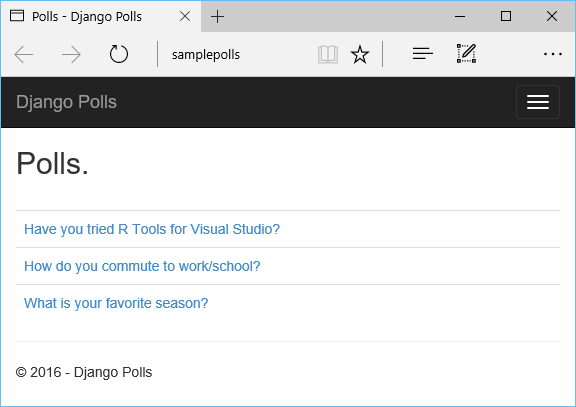

<properties 
    pageTitle="Django e Database SQL di Azure con gli strumenti Python 2.2 per Visual Studio" 
    description="Informazioni su come usare gli strumenti di Python per Visual Studio per creare un'app web Django contenente dati in un'istanza di database SQL e distribuire in Azure App servizio Web Apps." 
    services="app-service\web" 
    tags="python"
    documentationCenter="python" 
    authors="huguesv" 
    manager="wpickett" 
    editor=""/>

<tags 
    ms.service="app-service-web" 
    ms.workload="web" 
    ms.tgt_pltfrm="na" 
    ms.devlang="python" 
    ms.topic="article" 
    ms.date="07/07/2016"
    ms.author="huguesv"/>

# Django e Database SQL di Azure con gli strumenti Python 2.2 per Visual Studio 

In questa esercitazione si userà [Python Tools per Visual Studio] per creare un'app web di sondaggi semplice utilizzando uno dei modelli di esempio PTVS. In questa esercitazione è disponibile anche come un [video](https://www.youtube.com/watch?v=ZwcoGcIeHF4).

Si apprenderà come usare un database SQL in Azure, come configurare l'applicazione web per l'utilizzo di un database SQL e come pubblicare app web di [Azure App servizio Web Apps](http://go.microsoft.com/fwlink/?LinkId=529714).

Visitare il [Centro per sviluppatori di Python] per trovare altri articoli che illustrate sviluppo di Azure App servizio Web Apps con PTVS utilizza bottiglia, pallone e Django Framework web, con i servizi archivio tabelle Azure, MySQL e Database SQL. Mentre in questo articolo è incentrata su servizio di App, i passaggi sono simili durante lo sviluppo di [Servizi Cloud Windows Azure].

## Prerequisiti

 - Visual Studio 2015
 - [Python 2.7 versione a 32 bit]
 - [Python 2.2 degli strumenti per Visual Studio]
 - [Python 2.2 degli strumenti per esempi di Visual Studio VSIX]
 - [Azure SDK Tools per Visual Studio 2015]
 - Django 1,9 o versioni successiva

[AZURE.INCLUDE [create-account-and-websites-note](../../includes/create-account-and-websites-note.md)]

>[AZURE.NOTE] Se si desidera iniziare a utilizzare il servizio di App Azure prima di iscriversi a un account Azure, accedere al [Servizio App provare](http://go.microsoft.com/fwlink/?LinkId=523751), in cui è possibile creare immediatamente un'app web starter breve nel servizio di App. Nessun carte di credito obbligatorio; Nessun impegni.

## Creare il progetto

In questa sezione, è necessario creare un progetto di Visual Studio utilizzando un modello di esempio. È necessario creare un ambiente virtuale e installare pacchetti necessari. È necessario creare un database locale utilizzando sqlite. Quindi si eseguirà il web app in locale.

1.  In Visual Studio, selezionare **File**, **Nuovo progetto**.

1.  I modelli di progetto da [Python 2.2 Tools per Visual Studio esempi VSIX] sono disponibili in **Python**, **esempi**. Selezionare **Progetto Web Django sondaggi** e fare clic su OK per creare il progetto.

    

1.  Verrà richiesto di installare pacchetti esterni. Selezionare **Installa in un ambiente virtuale**.

    

1.  Selezionare **Python 2.7** come interprete base.

    

1.  In **Esplora soluzioni**, pulsante destro del mouse sul nodo del progetto e scegliere **Python**, quindi **Eseguire la migrazione di Django**.  Selezionare **L'utente di creare avanzato Django**.

1.  Questo verrà aprire una Console di gestione Django e creare un database sqlite nella cartella del progetto. Seguire le istruzioni per creare un utente.

1.  Verificare che il funzionamento dell'applicazione premendo <kbd>F5</kbd>.

1.  Fare clic su **accedere** dalla barra di spostamento nella parte superiore.

    

1.  Immettere le credenziali per l'utente che è stato creato quando è possibile sincronizzare il database.

    

1.  Fare clic su **creazione di sondaggi di esempio**.

    

1.  Fare clic su un sondaggio e votare.

    

## Creare un Database SQL

Per il database, è necessario creare un database SQL Azure.

È possibile creare un database tramite i passaggi seguenti.

1.  Accedere al [portale di Azure].

1.  Nella parte inferiore del riquadro di spostamento, fare clic su **Nuovo**. , fare clic su **dati + spazio di archiviazione** > **Database SQL**.

1.  Configurare il nuovo Database SQL mediante la creazione di un nuovo gruppo di risorse e selezionare la posizione appropriata.

1.  Dopo aver creato il Database di SQL, fare clic su **Apri in Visual Studio** in e il database.
2.  Fare clic su **Configura del firewall**.
3.  Aggiungere che un firewall con **IP iniziale** e **IP finale** set di regole per l'indirizzo IP pubblico del computer di sviluppo e il **Firewall impostazioni** . Fare clic su **Salva**.

    In questo modo le connessioni al server di database dal computer di sviluppo.

4.  Di nuovo in e il database, fare clic su **proprietà**e quindi fare clic su **Mostra le stringhe di connessione di database**. 

2.  Utilizzare il pulsante Copia per inserire il valore di **ADO.NET** negli Appunti.

## Configurare il progetto

In questa sezione verranno configurare il nostro web app per usare il database SQL che appena creato. È anche necessario installare pacchetti Python aggiuntivi necessari per l'uso di database SQL con Django. Quindi si eseguirà il web app in locale.

1.  In Visual Studio, aprire **settings.py**dalla cartella *NomeProgetto* . Nell'editor temporaneamente incollare la stringa di connessione. La stringa di connessione viene visualizzato in questo formato:

        Server=<ServerName>,<ServerPort>;Database=<DatabaseName>;User ID=<UserName>;Password={your_password_here};Encrypt=True;TrustServerCertificate=False;Connection Timeout=30;

Modificare la definizione di `DATABASES` per usare i valori indicati.

        DATABASES = {
            'default': {
                'ENGINE': 'sql_server.pyodbc',
                'NAME': '<DatabaseName>',
                'USER': '<UserName>',
                'PASSWORD': '{your_password_here}',
                'HOST': '<ServerName>',
                'PORT': '<ServerPort>',
                'OPTIONS': {
                    'driver': 'SQL Server Native Client 11.0',
                    'MARS_Connection': 'True',
                }
            }
        }

1.  In Esplora soluzioni in **Ambienti Python**, pulsante destro del mouse sull'ambiente virtuale e selezionare **Installa pacchetto Python**.

1.  Installare il pacchetto `pyodbc` utilizzando **pip**.

    

1.  Installare il pacchetto `django-pyodbc-azure` utilizzando **pip**.

    

1.  In **Esplora soluzioni**, pulsante destro del mouse sul nodo del progetto e scegliere **Python**, quindi **Eseguire la migrazione di Django**.  Selezionare **L'utente di creare avanzato Django**.

    Per creare tabelle per il database SQL creata nella sezione precedente. Seguire le istruzioni per creare un utente, che non debba corrispondere l'utente nel database sqlite creato nella prima sezione.

1.  Eseguire l'applicazione con `F5`. Sondaggi creati con i dati inviati da voto e **Creazione di sondaggi di esempio** verranno serializzati nel database di SQL.

## Pubblicare app web al servizio App Azure

Azure .NET SDK offre un modo semplice per distribuire un'applicazione web web Azure App servizio Web Apps.

1.  In **Esplora soluzioni**fare clic su nodo del progetto e selezionare **pubblica**.

    

1.  Fare clic su **App Web di Microsoft Azure**.

1.  Fare clic su **Nuovo** per creare una nuova app web.

1.  Compilare i campi seguenti e fare clic su **Crea**.
    -   **Nome applicazione Web**
    -   **Piano di servizio di App**
    -   **Gruppo di risorse**
    -   **Area geografica**
    -   Lasciare impostato su **Nessun database** **del server di Database**

1.  Accettare tutte le altre impostazioni predefinite e fare clic su **pubblica**.

1.  Web browser verrà aperta automaticamente all'app web pubblicato. Verrà visualizzata l'app web funziona come previsto, utilizzare il database **SQL** ospitato in Azure.

    Congratulazioni!

    

## Passaggi successivi

Seguire questi collegamenti per altre informazioni sugli strumenti Python per Visual Studio, Django e Database SQL.

- [Strumenti di Python per la documentazione di Visual Studio]
  - [Progetti Web]
  - [Progetti di servizi cloud]
  - [Il debug remoto in Microsoft Azure]
- [Documentazione Django]
- [Database SQL]

## Novità
* Per una Guida per la modifica da siti Web al servizio App vedere: [servizio App Azure e il relativo impatto sulla esistente servizi di Windows Azure](http://go.microsoft.com/fwlink/?LinkId=529714)

<!--Link references-->
[Centro per sviluppatori Python]: /develop/python/
[Servizi Cloud Azure]: ../cloud-services-python-ptvs.md

<!--External Link references-->
[Portale di Azure]: https://portal.azure.com
[Python Tools per Visual Studio]: http://aka.ms/ptvs
[Python 2.2 degli strumenti per Visual Studio]: http://go.microsoft.com/fwlink/?LinkID=624025
[Python 2.2 degli strumenti per esempi di Visual Studio VSIX]: http://go.microsoft.com/fwlink/?LinkID=624025
[Azure SDK Tools per Visual Studio 2015]: http://go.microsoft.com/fwlink/?LinkId=518003
[Python 2.7 versione a 32 bit]: http://go.microsoft.com/fwlink/?LinkId=517190 
[Strumenti di Python per la documentazione di Visual Studio]: http://aka.ms/ptvsdocs
[Il debug remoto in Microsoft Azure]: http://go.microsoft.com/fwlink/?LinkId=624026
[Progetti Web]: http://go.microsoft.com/fwlink/?LinkId=624027
[Progetti di servizi cloud]: http://go.microsoft.com/fwlink/?LinkId=624028
[Documentazione Django]: https://www.djangoproject.com/
[Database SQL]: /documentation/services/sql-database/
