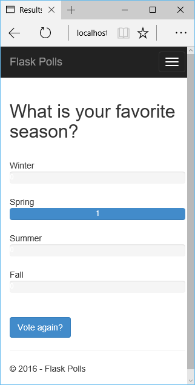

<properties 
    pageTitle="Pallone e archiviazione tabelle Azure in Azure con gli strumenti Python 2.2 per Visual Studio" 
    description="Informazioni su come usare gli strumenti di Python per Visual Studio per creare un'app web pallone contenente dati in archivio tabelle Azure e distribuire in Azure App servizio Web Apps." 
    services="app-service\web"
    tags="python"
    documentationCenter="python" 
    authors="huguesv" 
    manager="wpickett" 
    editor=""/>

<tags 
    ms.service="app-service-web" 
    ms.workload="web" 
    ms.tgt_pltfrm="na" 
    ms.devlang="python" 
    ms.topic="article" 
    ms.date="07/07/2016"
    ms.author="huvalo"/>

# Pallone e archiviazione tabelle Azure in Azure con gli strumenti Python 2.2 per Visual Studio 

In questa esercitazione si userà [Python Tools per Visual Studio] per creare un'app web di sondaggi semplice utilizzando uno dei modelli di esempio PTVS. In questa esercitazione è disponibile anche come un [video](https://www.youtube.com/watch?v=qUtZWtPwbTk).

L'app web di sondaggi definisce un'astrazione per l'archivio, in modo che sia possibile passare facilmente tra i diversi tipi di archivi (In memoria archivio tabelle Azure, MongoDB).

Vengono fornite informazioni sulla creazione di un account di archiviazione Azure, come configurare l'applicazione web per l'utilizzo di archivio tabelle Azure e come pubblicare app web di [Azure App servizio Web Apps](http://go.microsoft.com/fwlink/?LinkId=529714).

Visitare il [Centro per sviluppatori di Python] per trovare altri articoli che illustrate sviluppo di Azure App servizio Web Apps con PTVS utilizza bottiglia, pallone e Django Framework web, con i servizi MongoDB, archivio tabelle Azure, MySQL e Database SQL. Mentre in questo articolo è incentrata su servizio di App, i passaggi sono simili durante lo sviluppo di [Servizi Cloud Windows Azure].

## Prerequisiti

 - Visual Studio 2015
 - [Python 2.2 degli strumenti per Visual Studio]
 - [Python 2.2 degli strumenti per esempi di Visual Studio VSIX]
 - [Azure SDK Tools per Visual Studio 2015]
 - [Python 2.7 versione a 32 bit] o [Python 3.4 versione a 32 bit]

[AZURE.INCLUDE [create-account-and-websites-note](../../includes/create-account-and-websites-note.md)]

>[AZURE.NOTE] Se si desidera iniziare a utilizzare il servizio di App Azure prima di iscriversi a un account Azure, accedere al [Servizio App provare](http://go.microsoft.com/fwlink/?LinkId=523751), in cui è possibile creare immediatamente un'app web starter breve nel servizio di App. Nessun carte di credito obbligatorio; Nessun impegni.

## Creare il progetto

In questa sezione, è necessario creare un progetto di Visual Studio utilizzando un modello di esempio. È necessario creare un ambiente virtuale e installare pacchetti necessari. Quindi si eseguirà l'applicazione localmente utilizzando l'archivio in memoria predefinita.

1.  In Visual Studio, selezionare **File**, **Nuovo progetto**.

1.  I modelli di progetto da [Python 2.2 Tools per Visual Studio esempi VSIX] sono disponibili in **Python**, **esempi**. Selezionare **Progetto Web da sondaggi** e fare clic su OK per creare il progetto.

    

1.  Verrà richiesto di installare pacchetti esterni. Selezionare **Installa in un ambiente virtuale**.

    

1.  Selezionare **2.7 Python** o **Python 3.4** come interprete base.

    

1.  Verificare che l'applicazione funzioni premendo `F5`. Per impostazione predefinita, l'applicazione utilizza un repository in memoria che non richiede alcuna configurazione. Tutti i dati vengono perse quando il server web viene interrotto.

1.  Fare clic su **Creazione di sondaggi di esempio**, quindi fare clic su un sondaggio e voto.

    

## Creare un Account di archiviazione Azure

Per utilizzare le operazioni di archiviazione, è necessario un account di archiviazione Azure. È possibile creare un account di archiviazione eseguendo la procedura seguente.

1.  Accedere al [portale di Azure](https://portal.azure.com/).

2. Fare clic sull'icona di **Nuovo** nella parte superiore sinistra del portale, quindi fare clic su **dati + spazio di archiviazione** > **Account di archiviazione**. Fare clic su **Crea**, quindi specificare un nome univoco per l'account di archiviazione e creare un nuovo [gruppo di risorse](../azure-resource-manager/resource-group-overview.md) per renderla.

    

    Quando l'account di archiviazione è stato creato, il pulsante **notifiche** verrà flash verde **successo** e blade dell'account di archiviazione è aperto per mostrare appartiene il nuovo gruppo di risorse che è stato creato.

5. Fare clic sulla parte di **Tasti di scelta** in blade dell'account di archiviazione. Prendere nota del nome dell'account e il chiave1.

    

    Occorre queste informazioni per configurare il progetto nella sezione successiva.

## Configurare il progetto

In questa sezione, è necessario configurare l'applicazione di utilizzare l'account di archiviazione che appena creato. Vedremo come ottenere le impostazioni di connessione dal portale di Azure. Quindi si eseguirà l'applicazione in locale.

1.  In Visual Studio, fare clic sul nodo del progetto in Esplora soluzioni e scegliere **proprietà**. Fare clic sulla scheda **Debug** .

    

1.  Impostare i valori delle variabili di ambiente necessarie all'applicazione nel **Comando Server Debug** **ambiente**.

        REPOSITORY_NAME=azuretablestorage
        STORAGE_NAME=<storage account name>
        STORAGE_KEY=<primary access key>

    Questa opzione consente di impostare le variabili di ambiente quando si **Avvia debug**. Se si desidera che le variabili da impostare quando si **Avvia senza eseguire debug**, impostare gli stessi valori in **Esecuzione comando Server** anche.

    In alternativa, è possibile definire le variabili di ambiente mediante il pannello di controllo di Windows. Si tratta di un'opzione migliore se si desidera evitare la memorizzazione delle credenziali nel codice sorgente / file di progetto. Si noti che sarà necessario riavviare Visual Studio per i nuovi valori di ambiente per essere disponibili per l'applicazione.

1.  Il codice di implementazione Azure tabella archivio è in **models/azuretablestorage.py**. Vedere la [documentazione] per ulteriori informazioni sull'utilizzo del servizio di tabelle da Python.

1.  Eseguire l'applicazione con `F5`. Verranno serializzati sondaggi creati con i dati inviati da voto e **Creazione di sondaggi di esempio** in archivio tabelle Azure.

    > [AZURE.NOTE] L'ambiente virtuale 2.7 Python può causare un'interruzione di eccezione in Visual Studio.  Premere `F5` per continuare il caricamento del progetto web.

1.  Passare alla pagina **informazioni su** per verificare che l'applicazione sta utilizzando l'archivio **Archivio tabelle Azure** .

    

## Esplorare l'archiviazione tabelle Azure

È facile visualizzare e modificare lo spazio di archiviazione tabelle usando Esplora Cloud in Visual Studio. In questa sezione si userà Esplora Server per visualizzare il contenuto delle tabelle di applicazione sondaggi.

> [AZURE.NOTE] È necessario Microsoft Azure Tools sia installato, che sono disponibili come parte di [Azure SDK per .NET].

1.  Aprire **Esplora Cloud**. Espandere **Gli account di archiviazione**, l'account di archiviazione, quindi **le tabelle**.

    

1.  Fare doppio clic sulla tabella **sondaggi** o **scelte** per visualizzare il contenuto della tabella in una finestra del documento, come entità Aggiungi/Rimuovi/modifica.

    

## Pubblicare app web al servizio App Azure

Azure .NET SDK offre un modo semplice per distribuire un'app web al servizio App Azure.

1.  In **Esplora soluzioni**fare clic su nodo del progetto e selezionare **pubblica**.

    

1.  Fare clic su **App Web di Microsoft Azure**.

1.  Fare clic su **Nuovo** per creare una nuova app web.

1.  Compilare i campi seguenti e fare clic su **Crea**.
    -   **Nome applicazione Web**
    -   **Piano di servizio di App**
    -   **Gruppo di risorse**
    -   **Area geografica**
    -   Lasciare impostato su **Nessun database** **del server di Database**

1.  Accettare tutte le altre impostazioni predefinite e fare clic su **pubblica**.

1.  Web browser verrà aperta automaticamente all'app web pubblicato. Se si passa sulla pagina, verrà visualizzato viene utilizzata l'archivio **In memoria** , non repository **Archivio tabelle Azure** .

    Ciò avviene perché le variabili di ambiente non sono impostate per l'istanza di Web Apps nel servizio di App Azure, e pertanto utilizza i valori predefiniti specificati in **settings.py**.

## Configurare l'istanza di Web Apps

In questa sezione verranno configurare variabili per l'istanza di Web Apps.

1.  Nel [Portale di Azure](https://portal.azure.com), aprire blade dell'applicazione web facendo clic su **Sfoglia** > **Servizi App** > il nome dell'app web.

1.  In blade dell'applicazione web, fare clic su **Tutte le impostazioni**, quindi fare clic su **Impostazioni applicazione**.

1.  Scorrere fino alla sezione **Impostazioni applicazione** e impostare i valori per **archivio\_nome**, **lo spazio di archiviazione\_nome** e **lo spazio di archiviazione\_chiave** come descritto nella sezione **Configura il progetto** .

    

1.  Fare clic su **Salva**. Dopo aver ricevuto le notifiche che sono state applicate le modifiche, fare clic su **Sfoglia** da e principale il app Web.

1.  Verrà visualizzato il web app funzionano come previsto, utilizzo archivio **Archivio tabelle Azure** .

    Congratulazioni!

    

## Passaggi successivi

Seguire questi collegamenti per altre informazioni sugli strumenti Python per Visual Studio, pallone e archivio tabelle Azure.

- [Strumenti di Python per la documentazione di Visual Studio]
  - [Progetti Web]
  - [Progetti di servizi cloud]
  - [Il debug remoto in Microsoft Azure]
- [Documentazione pallone]
- [Spazio di archiviazione Azure]
- [Azure SDK per Python]
- [Come utilizzare il servizio di archiviazione tabella da Python]

## Novità
* Per una Guida per la modifica da siti Web al servizio App vedere: [servizio App Azure e il relativo impatto sulla esistente servizi di Windows Azure](http://go.microsoft.com/fwlink/?LinkId=529714)

<!--Link references-->
[Centro per sviluppatori Python]: /develop/python/
[Servizi Cloud Azure]: ../cloud-services-python-ptvs.md
[documentazione]: ../storage-python-how-to-use-table-storage.md
[Come utilizzare il servizio di archiviazione tabella da Python]: ../storage-python-how-to-use-table-storage.md

<!--External Link references-->
[Azure Portal]: https://portal.azure.com
[Azure SDK per .NET]: http://azure.microsoft.com/downloads/
[Python Tools per Visual Studio]: http://aka.ms/ptvs
[Python 2.2 degli strumenti per Visual Studio]: http://go.microsoft.com/fwlink/?LinkID=624025
[Python 2.2 degli strumenti per esempi di Visual Studio VSIX]: http://go.microsoft.com/fwlink/?LinkID=624025
[Azure SDK Tools per Visual Studio 2015]: http://go.microsoft.com/fwlink/?linkid=518003
[Python 2.7 versione a 32 bit]: http://go.microsoft.com/fwlink/?LinkId=517190 
[Python 3.4 versione a 32 bit]: http://go.microsoft.com/fwlink/?LinkId=517191
[Strumenti di Python per la documentazione di Visual Studio]: http://aka.ms/ptvsdocs
[Documentazione pallone]: http://flask.pocoo.org/
[Il debug remoto in Microsoft Azure]: http://go.microsoft.com/fwlink/?LinkId=624026
[Progetti Web]: http://go.microsoft.com/fwlink/?LinkId=624027
[Progetti di servizi cloud]: http://go.microsoft.com/fwlink/?LinkId=624028
[Spazio di archiviazione Azure]: http://azure.microsoft.com/documentation/services/storage/
[Azure SDK per Python]: https://github.com/Azure/azure-sdk-for-python
 
