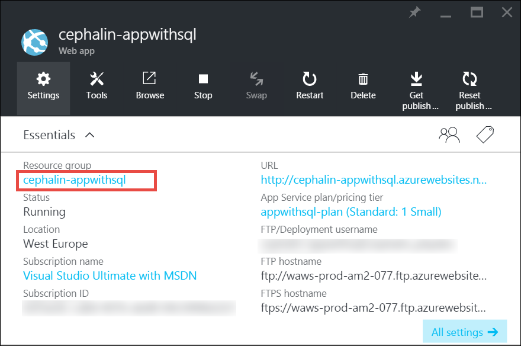

<properties
    pageTitle="Scalare un'app di Azure | Microsoft Azure"
    description="Informazioni su come scalare un'app di Azure App servizio da aggiungere capacità e funzionalità."
    services="app-service"
    documentationCenter=""
    authors="cephalin"
    manager="wpickett"
    editor="mollybos"/>

<tags
    ms.service="app-service"
    ms.workload="na"
    ms.tgt_pltfrm="na"
    ms.devlang="na"
    ms.topic="article"
    ms.date="07/05/2016"
    ms.author="cephalin"/>

# Scalare un'app di Azure #

In questo articolo viene illustrato come ridurre l'app in servizio App Azure. Esistono due flussi di lavoro per scala ridimensionamento, configurazione e scalabilità e in questo articolo illustra la scala il flusso di lavoro.

- [Scalabilità](https://en.wikipedia.org/wiki/Scalability#Horizontal_and_vertical_scaling): ottenere ulteriori CPU, memoria, spazio su disco e funzionalità aggiuntive per avere dedicate macchine (), domini personalizzati e certificati di gestione temporanea bande orarie, il ridimensionamento automatico e altro ancora. Le dimensioni modificando il livello prezzo del piano di servizio App l'app a cui appartiene.
- [Scalabilità](https://en.wikipedia.org/wiki/Scalability#Horizontal_and_vertical_scaling): aumentare il numero di istanze di macchine Virtuali che eseguono l'app.
È possibile aggiungere fino a un massimo di 20 istanze, a seconda del livello prezzo. [App servizio ambienti](../app-service/app-service-app-service-environments-readme.md) nel livello **Premium** aumenterà ulteriormente il conteggio di scalabilità per 50 istanze. Per ulteriori informazioni sul ridimensionamento indietro, vedere [ridimensionare conteggio delle istanze manualmente o automaticamente](../monitoring-and-diagnostics/insights-how-to-scale.md). Ci sono disponibili informazioni su come utilizzare il ridimensionamento automatico per ridimensionare automaticamente in base alle regole predefinite e le pianificazioni conteggio delle istanze.

Le impostazioni della scala richiedono pochi secondi per applicare e influisce su tutte le app nel [piano di servizio di App](../app-service/azure-web-sites-web-hosting-plans-in-depth-overview.md).
È possibile modificare il codice o ridistribuire l'applicazione non richiedono.

Per informazioni sulle funzionalità dei singoli servizio App piani e prezzi, vedere [App servizio prezzi dettagli](/pricing/details/web-sites/).  

> [AZURE.NOTE] Prima di trasferire un piano di servizio App dal livello **gratuito** , è necessario innanzitutto rimuovere [spesa limiti](/pricing/spending-limits/) in posizione per l'abbonamento Azure. Per visualizzare o modificare le opzioni per l'abbonamento a Microsoft Azure App servizio, vedere [Microsoft Azure abbonamenti][azuresubscriptions].

## Aumentare il livello di prezzi

1. Nel browser, aprire il [portale di Azure][portal].

2. In blade dell'app, fare clic su **tutte le impostazioni**e quindi fare clic su **Scala**.

    ![Passare per ridimensionare l'App Azure.][ChooseWHP]

4. Scegliere il livello e quindi fare clic su **Seleziona**.

    La scheda **notifiche** lampeggiare verde **successo** al termine dell'operazione.

## Ridimensionare le relative risorse
Se l'app dipende da altri servizi, ad esempio Database SQL Azure o lo spazio di archiviazione di Azure, è possibile ridimensionare anche le risorse in base alle proprie esigenze. Queste risorse non vengono ridimensionate con il piano di servizio di App e devono essere ridimensionate separatamente.

1. In **Nozioni di base**, fare clic sul collegamento di **gruppo di risorse** .

    

2. Nella parte di **Riepilogo** della stessa e **gruppo di risorse** , fare clic su una risorsa che si desidera ridimensionare. La figura seguente viene illustrata una risorsa di Database SQL e una risorsa di archiviazione Azure.

    

3. Per una risorsa di Database SQL, fare clic su **Impostazioni** > **livello prezzi** per ridimensionare il prezzo a più livelli.

    

    È anche possibile attivare [replica geografico](../sql-database/sql-database-geo-replication-overview.md) per l'istanza di Database SQL.

    Per una risorsa di archiviazione Azure, fare clic su **Impostazioni** > **configurazione** di scalare le opzioni relative all'archiviazione.

    

## Informazioni sulle caratteristiche di sviluppo
A seconda del livello prezzo sono disponibili le caratteristiche di sviluppo orientata seguenti:

### Numero di bit ###

- I livelli di **base**, **Standard**e **Premium** supportano le applicazioni di versione a 32 bit e 64 bit.
- Il livello di piano di **Shared** e **Free** supporta solo applicazioni a 32 bit.

### Supporto del debugger ###

- Supporto del debugger è disponibile per le modalità **gratuito**, **Shared**e **base** in una connessione per piano di servizio di App.
- Supporto del debugger è disponibile per le modalità **Standard** e **Premium** su cinque connessioni simultanee per piano di servizio di App.

## Informazioni sulle altre caratteristiche

- Per informazioni dettagliate su tutte le caratteristiche nei piani di servizio di App, inclusi i prezzi e le caratteristiche di interesse per tutti gli utenti (inclusi gli sviluppatori) rimanente, vedere [App servizio prezzi dettagli](/pricing/details/web-sites/).

>[AZURE.NOTE] Se si desidera iniziare a usare il servizio di App Azure prima che si effettua l'iscrizione per un account Azure, accedere al [Servizio App provare](http://go.microsoft.com/fwlink/?LinkId=523751) nel punto in cui è possibile creare immediatamente un'app web starter breve nel servizio di App. Nessun carte di credito sono necessari e non esistono senza impegni.

## Passaggi successivi

- Per iniziare con Azure, vedere [Versione di valutazione gratuita di Microsoft Azure](/pricing/free-trial/).
- Per informazioni sui prezzi, supporto e contratto di servizio, visitare i collegamenti seguenti.

    [Informazioni sui prezzi trasferimenti di dati](/pricing/details/data-transfers/)

    [Piani di Azure supporto Microsoft](/support/plans/)

    [Contratti di servizio](/support/legal/sla/)

    [Dettagli prezzi Database SQL](/pricing/details/sql-database/)

    [Macchina virtuale e le dimensioni di servizio Cloud di Microsoft Azure][vmsizes]

    [Servizio di App prezzi dettagli](/pricing/details/app-service/)

    [Servizio di App prezzi dettagli - connessioni SSL](/pricing/details/web-sites/#ssl-connections)

- Per informazioni sul servizio App Azure Vedere procedure consigliate, tra cui la creazione di un'architettura scalable e flessibile [procedure consigliate: Azure App servizio Web Apps](http://blogs.msdn.com/b/windowsazure/archive/2014/02/10/best-practices-windows-azure-websites-waws.aspx).

- Per i video sul ridimensionamento le applicazioni di servizio App, vedere le risorse seguenti:

    - [Quando i siti Web Azure - con Stefan Schackow le dimensioni](/documentation/videos/azure-web-sites-free-vs-standard-scaling/)
    - [Scala Azure siti Web, CPU automatica o programmata - con Stefan Schackow](/documentation/videos/auto-scaling-azure-web-sites/)
    - [Come Azure Scale di siti Web - con Stefan Schackow](/documentation/videos/how-azure-web-sites-scale/)

<!-- LINKS -->
[vmsizes]:/pricing/details/app-service/
[SQLaccountsbilling]:http://go.microsoft.com/fwlink/?LinkId=234930
[azuresubscriptions]:http://go.microsoft.com/fwlink/?LinkID=235288
[portal]: https://portal.azure.com/

<!-- IMAGES -->
[ChooseWHP]: ./media/web-sites-scale/scale1ChooseWHP.png
[ChooseBasicInstances]: ./media/web-sites-scale/scale2InstancesBasic.png
[SaveButton]: ./media/web-sites-scale/05SaveButton.png
[BasicComplete]: ./media/web-sites-scale/06BasicComplete.png
[ScaleStandard]: ./media/web-sites-scale/scale3InstancesStandard.png
[Autoscale]: ./media/web-sites-scale/scale4AutoScale.png
[SetTargetMetrics]: ./media/web-sites-scale/scale5AutoScaleTargetMetrics.png
[SetFirstRule]: ./media/web-sites-scale/scale6AutoScaleFirstRule.png
[SetSecondRule]: ./media/web-sites-scale/scale7AutoScaleSecondRule.png
[SetThirdRule]: ./media/web-sites-scale/scale8AutoScaleThirdRule.png
[SetRulesFinal]: ./media/web-sites-scale/scale9AutoScaleFinal.png
[ResourceGroup]: ./media/web-sites-scale/scale10ResourceGroup.png
[ScaleDatabase]: ./media/web-sites-scale/scale11SQLScale.png
[GeoReplication]: ./media/web-sites-scale/scale12SQLGeoReplication.png
