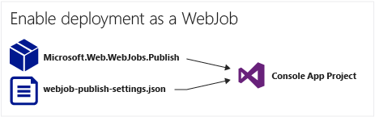
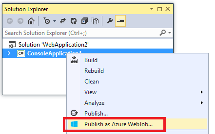
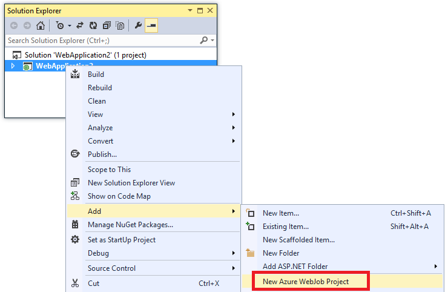

<properties 
    pageTitle="Distribuire WebJobs utilizzando Visual Studio" 
    description="Informazioni su come distribuire Azure WebJobs utilizzando Visual Studio Azure App servizio Web Apps." 
    services="app-service" 
    documentationCenter="" 
    authors="tdykstra" 
    manager="wpickett" 
    editor="jimbe"/>

<tags 
    ms.service="app-service" 
    ms.devlang="dotnet" 
    ms.topic="article" 
    ms.tgt_pltfrm="na" 
    ms.workload="na" 
    ms.date="04/27/2016" 
    ms.author="tdykstra"/>

# Distribuire WebJobs utilizzando Visual Studio

## Panoramica

In questo argomento viene illustrato come utilizzare Visual Studio per distribuire un progetto applicazione Console in un'app web nel [Servizio App](http://go.microsoft.com/fwlink/?LinkId=529714) come un [WebJob Azure](http://go.microsoft.com/fwlink/?LinkId=390226). Per informazioni su come distribuire WebJobs tramite il [Portale di Azure](https://portal.azure.com), vedere [attività di esecuzione in Background con WebJobs](web-sites-create-web-jobs.md).

Quando Visual Studio distribuisce un progetto applicazione Console abilitato WebJobs, esegue due attività:

* Copia i file di runtime nella cartella appropriata in web app (*App_Data/processi/continua* per WebJobs continua, *App_Data, processi/attivate* per WebJobs pianificata e su richiesta).
* Configura automaticamente [i processi di pianificazione Azure](#scheduler) WebJobs pianificate per l'esecuzione in determinati momenti. (Questa operazione non è necessario per WebJobs continuo.)

Un progetto abilitato WebJobs è i seguenti elementi aggiunti:

* Il pacchetto NuGet [Microsoft.Web.WebJobs.Publish](http://www.nuget.org/packages/Microsoft.Web.WebJobs.Publish/) .
* File [settings.json pubblicare webjob](#publishsettings) che contiene le impostazioni di distribuzione e utilità di pianificazione. 

È possibile aggiungere questi elementi a un progetto di applicazione Console esistente o utilizzare un modello per creare un nuovo progetto applicazione Console WebJobs abilitato. 

È possibile distribuire un progetto come un WebJob da solo o collegarla a un progetto web in modo che venga distribuito automaticamente ogni volta che si distribuisce il progetto web. Per collegare progetti, Visual Studio include il nome del progetto abilitato WebJobs in un file di [webjobs list.json](#webjobslist) nel progetto web.

## Prerequisiti

Funzionalità di distribuzione WebJobs sono disponibili in Visual Studio 2015 durante l'installazione di Azure SDK per .NET:

* [Azure SDK per .NET (Visual Studio 2015)](http://go.microsoft.com/fwlink/?linkid=518003).

## Attivare la distribuzione di WebJobs per un progetto di applicazione Console esistente

Sono disponibili due opzioni:

* [Abilitare la distribuzione automatica con un progetto web](#convertlink).

    Configurare un progetto applicazione Console in modo che distribuisce come un WebJob automaticamente quando si distribuisce un progetto web. Usare questa opzione quando si desidera eseguire il WebJob in stesso web app in cui si esegue l'applicazione web correlati.

* [Attivare la distribuzione senza un progetto web](#convertnolink).

    Configurare un progetto di applicazione Console esistente per distribuire come un WebJob da sola, con non un collegamento a un progetto web. Usare questa opzione se si desidera eseguire una WebJob in un'app web da sola, con nessuna applicazione web in esecuzione in web app. È consigliabile procedere come segue per poter ridimensionare le risorse sono WebJob indipendente risorse dell'applicazione web.

### Attivare la distribuzione automatica WebJobs con un progetto web
  
1. Fare clic sul progetto web in **Esplora soluzioni**e quindi fare clic su **Aggiungi** > **Progetto esistente come WebJob Azure**.

    
    
    Viene visualizzata la finestra di dialogo [Aggiungi WebJob Azure](#configure) .

1. Nella casella **nome progetto** selezionare il progetto di applicazione Console da aggiungere come un WebJob.

    

2. Completare la finestra di dialogo [Aggiungi WebJob Azure](#configure) e quindi fare clic su **OK**. 

### Attivare la distribuzione di WebJobs senza un progetto web
  
1. Fare clic sul progetto applicazione Console in **Esplora soluzioni**e quindi fare clic su **Pubblica come WebJob Azure**. 

    
    
    Viene visualizzata la finestra di dialogo [Aggiungi WebJob Azure](#configure) con il progetto selezionato nella casella **nome del progetto** .

2.  Completare la finestra di dialogo [Aggiungi WebJob Azure](#configure) e quindi fare clic su **OK**.

    Verrà visualizzata la creazione guidata **Pubblicazione Web** .  Se non si desidera pubblicare immediatamente, chiudere la procedura guidata. Le impostazioni che è stata immessa vengono salvate nei quando si desidera [distribuire il progetto](#deploy).

## Creare un nuovo progetto abilitato WebJobs

Per creare un nuovo progetto WebJobs attivata, è possibile utilizzare il modello di progetto applicazione Console e consentire la distribuzione di WebJobs come illustrato nella [sezione precedente](#convert). In alternativa, è possibile utilizzare il modello di nuovo progetto WebJobs:

* [Utilizzare il modello di nuovo progetto WebJobs per un WebJob indipendenti](#createnolink)

    Creare un progetto e configurarlo per distribuire autonomamente come un WebJob con non un collegamento a un progetto web. Usare questa opzione se si desidera eseguire una WebJob in un'app web da sola, con nessuna applicazione web in esecuzione in web app. È consigliabile procedere come segue per poter ridimensionare le risorse sono WebJob indipendente risorse dell'applicazione web.

* [Utilizzare il modello di nuovo progetto WebJobs per un WebJob collegato a un progetto web](#createlink)

    Creare un progetto che è configurato per distribuire automaticamente come un WebJob quando viene distribuito un progetto web nella stessa soluzione. Usare questa opzione quando si desidera eseguire il WebJob in stesso web app in cui si esegue l'applicazione web correlati.

> [AZURE.NOTE] Il modello di nuovo progetto WebJobs automaticamente installa pacchetti NuGet e include codice in *Program.cs* per [SDK WebJobs](http://www.asp.net/aspnet/overview/developing-apps-with-windows-azure/getting-started-with-windows-azure-webjobs). Se si non vuole utilizzare SDK WebJobs o da usare un WebJob programmata anziché continua, rimuovere o modificare il `host.RunAndBlock` istruzione in *Program.cs*.

### Utilizzare il modello di nuovo progetto WebJobs per un WebJob indipendenti
  
1. Fare clic su **File** > **Nuovo progetto**e quindi nella finestra di dialogo **Nuovo progetto** fare clic su **Cloud** > **Microsoft Azure WebJob**.

    
    
2. Seguire le istruzioni illustrate in precedenza per [rendere l'applicazione Console di un progetto di WebJobs indipendente](#convertnolink).

### Utilizzare il modello di nuovo progetto WebJobs per un WebJob collegato a un progetto web

1. Fare clic sul progetto web in **Esplora soluzioni**e quindi fare clic su **Aggiungi** > **Nuovo progetto WebJob Azure**.

    

    Viene visualizzata la finestra di dialogo [Aggiungi WebJob Azure](#configure) .

2. Completare la finestra di dialogo [Aggiungi WebJob Azure](#configure) e quindi fare clic su **OK**.

## Finestra di dialogo Aggiungi WebJob Azure

Finestra di dialogo **Aggiungi WebJob Azure** consente di immettere il nome di WebJob e pianificare le impostazioni per il WebJob. 

I campi in questa finestra di dialogo corrispondono ai campi nella finestra di dialogo **Nuovo processo** del portale di Azure. Per ulteriori informazioni, vedere [attività di esecuzione in Background con WebJobs](web-sites-create-web-jobs.md).

Per WebJob programmata (non per continuo WebJobs), Visual Studio crea un insieme di processo [Di pianificazione Azure](/services/scheduler/) se non esiste ancora e viene creato un processo nella raccolta:

* L'insieme di processo di pianificazione è denominato *WebJobs-{regionname}* in *{regionname}* si intende l'area web app è ospitata. Ad esempio: WebJobs WestUS.
* Il processo di pianificazione è denominato *{webappname}-{webjobname}*. Ad esempio: MyWebJob MyWebApp. 
 
>[AZURE.NOTE]
> 
>* Per informazioni sulla distribuzione della riga di comando, vedere [attivazione della riga di comando o recapito continuo di Azure WebJobs](/blog/2014/08/18/enabling-command-line-or-continuous-delivery-of-azure-webjobs/).
>* Se si configura un **Processo ricorrente** e imposta la frequenza di ricorrenza a un numero di minuti, il servizio di pianificazione Azure non è disponibile. Le altre (ore, giorni e così via) sono gratuite.
>* Se si distribuisce una WebJob e quindi si desidera modificare il tipo di WebJob e Ridistribuisci, è necessario eliminare il file settings.json pubblicare webjobs. In questo modo sarà Visual Studio mostrare le opzioni di pubblicazione, in modo che è possibile modificare il tipo di WebJob.
>* Se si distribuisce una WebJob e successivamente modifica la modalità di esecuzione da continua a non continuo o viceversa, Visual Studio viene creato un nuovo WebJob in Azure quando ridistribuire. Se è modificare altre impostazioni di pianificazione, ma lascia modalità di esecuzione la stessa o di cambio pianificato e su richiesta, Visual Studio aggiorna il processo esistente anziché crearne uno nuovo.

## settings.json pubblica webjob

Quando si configura un'applicazione Console per la distribuzione di WebJobs, Visual Studio viene installato il pacchetto NuGet [Microsoft.Web.WebJobs.Publish](http://www.nuget.org/packages/Microsoft.Web.WebJobs.Publish/) e archivia le informazioni di programmazione in un file *settings.json pubblicare webjob* nella cartella di *proprietà* del progetto del progetto WebJobs. Ecco un esempio di tale file:

        {
          "$schema": "http://schemastore.org/schemas/json/webjob-publish-settings.json",
          "webJobName": "WebJob1",
          "startTime": "2014-06-23T00:00:00-08:00",
          "endTime": "2014-06-27T00:00:00-08:00",
          "jobRecurrenceFrequency": "Minute",
          "interval": 5,
          "runMode": "Scheduled"
        }

È possibile modificare il file direttamente e Visual Studio fornisce IntelliSense. Lo schema di file è archiviato in [http://schemastore.org](http://schemastore.org/schemas/json/webjob-publish-settings.json) e può essere visualizzato.  

>[AZURE.NOTE]
>
>* Se si configura un **Processo ricorrente** e imposta la frequenza di ricorrenza a un numero di minuti, il servizio di pianificazione Azure non è disponibile. Le altre (ore, giorni e così via) sono gratuite.

## webjobs list.json

Quando si collega un progetto abilitato WebJobs a un progetto web, Visual Studio memorizza il nome del progetto WebJobs in un file di *webjobs list.json* nella cartella di *proprietà* del progetto web. L'elenco può contenere più progetti WebJobs, come illustrato nell'esempio seguente:

        {
          "$schema": "http://schemastore.org/schemas/json/webjobs-list.json",
          "WebJobs": [
            {
              "filePath": "../ConsoleApplication1/ConsoleApplication1.csproj"
            },
            {
              "filePath": "../WebJob1/WebJob1.csproj"
            }
          ]
        }

È possibile modificare il file direttamente e Visual Studio fornisce IntelliSense. Lo schema di file è archiviato in [http://schemastore.org](http://schemastore.org/schemas/json/webjobs-list.json) e può essere visualizzato.
  
## Distribuire un progetto WebJobs

Un progetto WebJobs collegato a un progetto web viene distribuito automaticamente con il progetto web. Per informazioni sulla distribuzione di project web, vedere [come distribuire le applicazioni Web](web-sites-deploy.md).

Distribuire un progetto WebJobs autonomamente, fare clic sul progetto in **Esplora soluzioni**e fare clic su **Pubblica come WebJob Azure**. 

    
Per un WebJob indipendente dell'impostazione guidata **Pubblicazione Web** stessa che viene utilizzata per i progetti web viene visualizzata, ma con meno impostazioni disponibili per modificare.

## Passaggi successivi

In questo articolo è spiegato come distribuire WebJobs utilizzando Visual Studio. Per ulteriori informazioni su come distribuire WebJobs Azure, vedere [distribuzione di Azure WebJobs - consigliati risorse](http://www.asp.net/aspnet/overview/developing-apps-with-windows-azure/azure-webjobs-recommended-resources#deploying).
