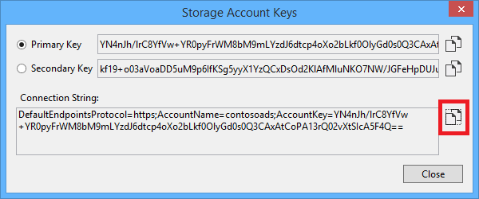
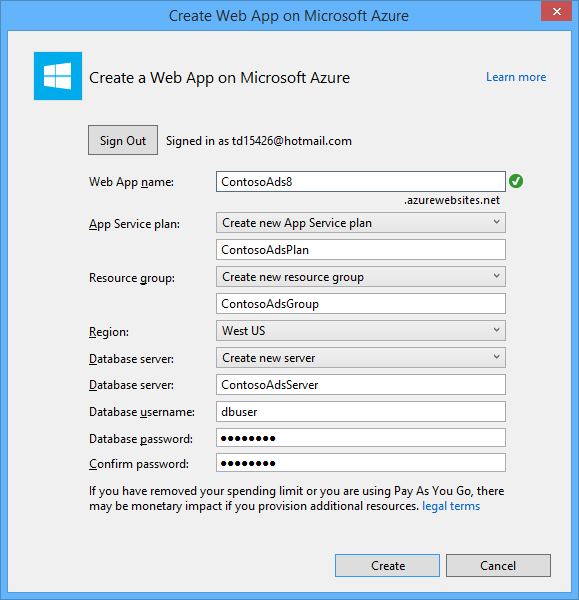
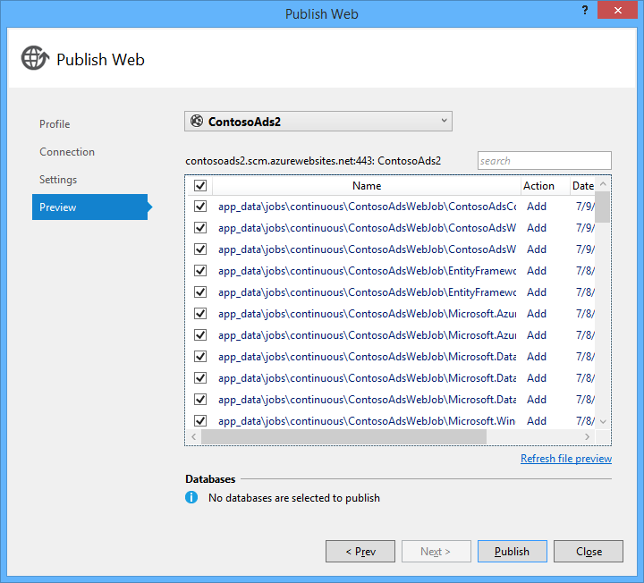

<properties
    pageTitle="Creare un WebJob .NET nel servizio di App Azure | Microsoft Azure"
    description="Creare un'app multilivello utilizzando ASP.NET MVC e Azure. Le esecuzioni front-end in un'app web nel servizio App Azure e back-end viene eseguito come un WebJob. L'app Usa entità Framework, Database SQL e lo spazio di archiviazione Azure code e BLOB."
    services="app-service"
    documentationCenter=".net"
    authors="tdykstra"
    manager="wpickett"
    editor="mollybos"/>

<tags
    ms.service="app-service"
    ms.workload="na"
    ms.tgt_pltfrm="na"
    ms.devlang="na"
    ms.topic="article"
    ms.date="10/28/2016"
    ms.author="tdykstra"/>

# Creare un WebJob .NET nel servizio di App Azure

In questa esercitazione viene illustrato come scrivere codice per un'applicazione di ASP.NET MVC 5 multilivello semplice che utilizza [SDK WebJobs](websites-dotnet-webjobs-sdk.md).

Lo scopo di [SDK WebJobs](websites-webjobs-resources.md) è per semplificare il codice che scritto per le attività comuni che un WebJob possono eseguire, ad esempio l'elaborazione di immagini, coda di elaborazione, RSS aggregazione, manutenzione del file e invio di messaggi di posta elettronica. SDK WebJobs sono caratteristiche incorporate per l'utilizzo di archiviazione di Azure e Bus di servizio per la pianificazione delle attività e la gestione degli errori e per molti altri scenari comuni. Inoltre, sono progettate per essere extensible ed esiste un [aprire repository di origine per le estensioni](https://github.com/Azure/azure-webjobs-sdk-extensions/wiki/Binding-Extensions-Overview).

Applicazione di esempio è un BBS relative alla pubblicità. Gli utenti possono caricare le immagini per gli annunci e un processo back-end converte le immagini in anteprima. Pagina di elenco annuncio Mostra le miniature e la pagina dei dettagli Active Directory viene visualizzata l'immagine di dimensioni originali. Di seguito è riportata una schermata:

Questa applicazione di esempio funziona con [code Azure](http://www.asp.net/aspnet/overview/developing-apps-with-windows-azure/building-real-world-cloud-apps-with-windows-azure/queue-centric-work-pattern) e [BLOB Azure](http://www.asp.net/aspnet/overview/developing-apps-with-windows-azure/building-real-world-cloud-apps-with-windows-azure/unstructured-blob-storage). L'esercitazione viene illustrato come distribuire un'applicazione di [Servizio di Azure App](http://go.microsoft.com/fwlink/?LinkId=529714) e [Database di SQL Azure](http://msdn.microsoft.com/library/azure/ee336279).

## Prerequisiti

L'esercitazione presuppone sa come gestire i progetti [ASP.NET MVC 5](http://www.asp.net/mvc/tutorials/mvc-5/introduction/getting-started) in Visual Studio.

L'esercitazione è stato scritto per Visual Studio 2013. Se non si dispone già Visual Studio, esso verrà installato automaticamente automaticamente durante l'installazione di Azure SDK per .NET.

L'esercitazione può essere utilizzata con Visual Studio 2015, ma prima di eseguire l'applicazione in locale che si desidera modificare il `Data Source` a una parte della stringa di connessione di SQL Server LocalDB nei file config e App da `Data Source=(localdb)\v11.0` a `Data Source=(LocalDb)\MSSQLLocalDB`. 

> [AZURE.NOTE] È necessario un account Azure per completare l'esercitazione:
  >
  > + È possibile [aprire un account Azure gratuitamente](https://azure.microsoft.com/pricing/free-trial/?WT.mc_id=A261C142F): viene visualizzato crediti è possibile utilizzare per provare a pagamento servizi Azure e anche se vengono utilizzati massimo è possibile mantenere l'account e usare gratuiti servizi Azure, ad esempio siti Web. Carta di credito non verranno mai addebitata, a meno che non in modo esplicito modificare le impostazioni e chiedere di essere addebitati.
  >
  > + È possibile [attivare vantaggi sottoscrittori MSDN](https://azure.microsoft.com/pricing/member-offers/msdn-benefits-details/?WT.mc_id=A261C142F): abbonamento MSDN Your offre crediti ogni mese che è possibile utilizzare per i servizi di Azure a pagamento.
  >
  >Se si desidera iniziare a utilizzare il servizio di App Azure prima di iscriversi a un account Azure, accedere al [Servizio App provare](http://go.microsoft.com/fwlink/?LinkId=523751), in cui è possibile creare immediatamente un'app web starter breve nel servizio di App. Nessun carte di credito obbligatorio; Nessun impegni.

## Si apprenderanno

L'esercitazione viene illustrato come eseguire le operazioni seguenti:

* Attivare il computer per lo sviluppo di Azure installando Azure SDK.
* Creare un progetto di applicazione Console che distribuisce come un WebJob Azure automaticamente quando si distribuisce il progetto web associato.
* Verificare un back-end WebJobs SDK in locale nel computer di sviluppo.
* Pubblicare un'applicazione con un back-end WebJobs in un'app web nel servizio di App.
* Caricare file e archiviarli nel servizio Blob Azure.
* Usare Azure WebJobs SDK con BLOB e coda di archiviazione Azure.

## Architettura delle applicazioni

L'applicazione di esempio utilizza il [modello di lavoro basate su coda](http://www.asp.net/aspnet/overview/developing-apps-with-windows-azure/building-real-world-cloud-apps-with-windows-azure/queue-centric-work-pattern) per ricaricamenti lavoro CPU che richiede significative attività di creazione di anteprime a un processo back-end.

L'app memorizza annunci in un database SQL, utilizzare entità Framework Code First per creare tabelle e accedere ai dati. Per ogni annuncio nel database vengono archiviate due URL: uno per l'immagine ingrandita e uno per l'anteprima.

Quando un utente carica un'immagine, l'applicazione web archivia l'immagine in un [blob Azure](http://www.asp.net/aspnet/overview/developing-apps-with-windows-azure/building-real-world-cloud-apps-with-windows-azure/unstructured-blob-storage)e vengono memorizzate le informazioni sugli annunci nel database con un URL che punta a quello. Nello stesso momento scrive un messaggio a una coda Azure. In un processo di back-end in esecuzione come un WebJob di Azure, SDK WebJobs polling coda per i nuovi messaggi. Quando viene visualizzato un nuovo messaggio, il WebJob crea un'anteprima dell'immagine e aggiorna il campo del database URL anteprima per quell'annuncio. Ecco un diagramma che mostra l'interagiscono delle parti dell'applicazione:

[AZURE.INCLUDE [install-sdk](../../includes/install-sdk-2015-2013.md)]

Le istruzioni dell'esercitazione applicano a Azure SDK per .NET 2.7.1 o versione successiva.

## Creare un account di archiviazione Azure

Un account di archiviazione Azure fornisce le risorse per la memorizzazione dei dati di coda e blob nel cloud. È anche utilizzato da SDK WebJobs per archiviare i dati di registrazione per il dashboard.

In un'applicazione reale, in genere creare account separati per applicazione dati rispetto a dati di registrazione e separata account per i dati di test rispetto ai dati di produzione. Per questa esercitazione si utilizzeranno un solo account.

1. Aprire la finestra **Esplora Server** in Visual Studio.

2. Pulsante destro del mouse nodo **Azure** e quindi fare clic su **Connetti a Microsoft Azure**.

3. Effettuare l'accesso con le credenziali di Azure.

5. Destro **dello spazio di archiviazione** del nodo Azure e quindi fare clic su **Crea Account lo spazio di archiviazione**.

3. Nella finestra di dialogo **Crea Account lo spazio di archiviazione** , immettere un nome per l'account di archiviazione.

    Il nome deve essere deve essere univoco (nessun altro account di archiviazione Azure può avere lo stesso nome). Se il nome che immesso è già in uso, si riceverà la possibilità di modificarlo.

    L'URL per accedere all'account di archiviazione sarà *{nome}*. core.windows.net.

5. Impostare l'elenco a discesa **area o un gruppo di affinità** all'area più vicina.

    Questa impostazione specifica quale Data Center Azure conterrà l'account di archiviazione. Per questa esercitazione, la scelta non è possibile fare la differenza più evidente. Tuttavia, per un'app web di produzione, si desidera il server web che l'account di archiviazione da risultare nell'area stessa per ridurre a icona in base alle tariffe uscita latenza e dati. L'applicazione web (che sarà necessario creare in un secondo momento) Data Center dovrebbe essere il più vicino possibile il browser che accedono web app per ridurre al minimo la latenza.

6. Impostare l'elenco a discesa **replica** **ridondanti in locale**.

    Quando la replica geografico è abilitata per un account di archiviazione, il contenuto archiviato è replicato in un Data Center secondario per abilitare il controllo a tale posizione in caso di problemi principali nella finestra principale di posizione. La replica geografico può comportare costi aggiuntivi. Per gli account di prova e lo sviluppo, in genere non si vuole pagare replica geografico. Per ulteriori informazioni, vedere [creare, gestire, o eliminare un account di archiviazione](../storage-create-storage-account/#replication-options).

5. Fare clic su **Crea**.

    

## Scaricare l'applicazione

1. Scaricare e decomprimere [completate soluzione](http://code.msdn.microsoft.com/Simple-Azure-Website-with-b4391eeb).

2. Avviare Visual Studio.

3. Dal menu **File** scegliere **aprire > progetto/soluzione**, passare a dove è stato scaricato la soluzione e quindi aprire il file di soluzione.

4. Premere CTRL + MAIUSC + B per creare la soluzione.

    Per impostazione predefinita, Visual Studio Ripristina automaticamente il contenuto del pacchetto NuGet non inclusa nel file *zip* . Se i pacchetti non consentono di ripristinare, installarli manualmente passando alla finestra di dialogo **Gestisci pacchetti NuGet per soluzione** e fare clic sul pulsante **Ripristina** in alto a destra.

5. In **Esplora soluzioni**, assicurarsi che **ContosoAdsWeb** sia selezionato come progetto di avvio.

## Configurare un'applicazione di usare l'account di archiviazione

1. Aprire il file *config* dell'applicazione nel progetto ContosoAdsWeb.

    Il file contiene una stringa di connessione SQL e una stringa di connessione Azure dello spazio di archiviazione per l'utilizzo di BLOB e code.

    Stringa di connessione SQL fa riferimento a un database di [SQL Server Express LocalDB](http://msdn.microsoft.com/library/hh510202.aspx) .

    La stringa di connessione di spazio di archiviazione è illustrato un esempio contenente i segnaposto per la chiave archiviazione account nome e l'accesso. È necessario sostituire con una stringa di connessione che contiene il nome e la chiave del proprio account di archiviazione.  

    <pre class="prettyprint">&lt;connectionStrings&gt;
   &lt;aggiungere nome = "ContosoAdsContext" connectionString = "origine dati = \v11.0 (localdb); Iniziale del catalogo = ContosoAds; Sicurezza integrata = vero; MultipleActiveResultSets = vero; "providerName="System.Data.SqlClient "/&gt;
   &lt;aggiungere nome ="AzureWebJobsStorage"connectionString =" DefaultEndpointsProtocol = https. Nome account =<mark>[nome account]</mark>; AccountKey =<mark>[accesskey]</mark>"/&gt; 
    &lt;/connectionStrings      &gt;</pre>

    La stringa di connessione di spazio di archiviazione è denominata AzureWebJobsStorage perché che è il nome che SDK WebJobs utilizzato per impostazione predefinita. Lo stesso nome viene utilizzato in questo caso è necessario impostare un solo valore di stringa di connessione nell'ambiente di Azure.

2. In **Esplora Server**destro l'account di archiviazione del nodo di **spazio di archiviazione** e quindi fare clic su **proprietà**.

    

3. Nella finestra delle **proprietà** , fare clic su **Chiavi per l'Account di archiviazione**e quindi fare clic sui puntini di sospensione.

    

4. Copiare la **stringa di connessione**.

    

5. Sostituire la stringa di connessione di spazio di archiviazione in *config* con la stringa di connessione che appena copiato. Assicurarsi di che aver selezionato tutti gli elementi all'interno delle virgolette ma non include le virgolette prima di incollare.

6. Aprire il file *App* nel progetto ContosoAdsWebJob.

    Questo file ha due stringhe di connessione di spazio di archiviazione, uno dei dati delle applicazioni e uno per la registrazione. È possibile utilizzare gli account di archiviazione separata per la registrazione e dati dell'applicazione e utilizzare [più account di archiviazione per i dati](https://github.com/Azure/azure-webjobs-sdk/blob/master/test/Microsoft.Azure.WebJobs.Host.EndToEndTests/MultipleStorageAccountsEndToEndTests.cs). Per questa esercitazione si utilizzeranno un account di archiviazione singola. Le stringhe di connessione con i segnaposto per i tasti di account di archiviazione. 
    <pre class="prettyprint">&lt;configurazione&gt; 
    &lt;connectionStrings&gt;
   &lt;aggiungere nome = "AzureWebJobsDashboard" connectionString = "DefaultEndpointsProtocol = https. Nome account =<mark>[nome account]</mark>; AccountKey =<mark>[accesskey]</mark>"/&gt;
   &lt;aggiungere nome ="AzureWebJobsStorage"connectionString =" DefaultEndpointsProtocol = https. Nome account =<mark>[nome account]</mark>; AccountKey =<mark>[accesskey]</mark>"/&gt;
   &lt;aggiungere nome ="ContosoAdsContext"connectionString =" origine dati = \v11.0 (localdb); Iniziale del catalogo = ContosoAds; Sicurezza integrata = vero; MultipleActiveResultSets = vero; " /&gt; 
    &lt;/connectionStrings&gt;
   &lt;avvio&gt;
   &lt;versione supportedRuntime = "4.0" sku = ". NETFramework, versione = v4.5 "/&gt; 
    &lt;/startup&gt;
&lt;/Configuration                             &gt;</pre>

    Per impostazione predefinita, SDK WebJobs consente di cercare le stringhe di connessione denominato AzureWebJobsStorage e AzureWebJobsDashboard. In alternativa, è possibile [archivio la stringa di connessione tuttavia desiderato e passarlo in modo esplicito i `JobHost` oggetto](websites-dotnet-webjobs-sdk-storage-queues-how-to.md#config).

7. Sostituire le stringhe di connessione sia lo spazio di archiviazione con la stringa di connessione copiato in precedenza.

8. Salvare le modifiche.

## Eseguire l'applicazione localmente

1. Per iniziare frontend web dell'applicazione, premere CTRL + F5.

    Il browser predefinito viene visualizzata la pagina home. (Il progetto web viene eseguito perché sono state apportate il progetto di avvio).

    

2. Per avviare il back-end WebJob dell'applicazione, fare clic sul progetto ContosoAdsWebJob in **Esplora soluzioni**e quindi fare clic su **Debug** > **iniziare una nuova istanza**.

    Una finestra dell'applicazione console verrà aperta la registrazione dei messaggi che indica che l'oggetto WebJobs SDK JobHost ha iniziato a eseguire.

    

3. Nel browser, fare clic su **Crea un annuncio**.

4. Inserire alcuni dati di test e selezionare un'immagine da caricare e quindi fare clic su **Crea**.

    

    L'app passa alla pagina di indice, ma non sono visualizzate un'anteprima per il nuovo annuncio perché non è che l'elaborazione di dove si trova ancora.

    Nel frattempo, dopo una breve attesa registrazione nella finestra dell'applicazione console verrà visualizzato un messaggio che un messaggio di coda è stato ricevuto ed è stato elaborato.

    

5. Quando viene visualizzata la registrazione messaggi nella finestra dell'applicazione console, aggiornare la pagina di indice per visualizzare l'anteprima.

    

6. Fare clic su **Dettagli** per visualizzare l'annuncio per visualizzare l'immagine ingrandita.

    

Si è in esecuzione dell'applicazione nel computer locale e utilizza un Server SQL database che si trova nel computer, ma si utilizzano code e BLOB nel cloud. Nella sezione seguente si eseguirà l'applicazione nel cloud, con un database cloud, nonché BLOB cloud e code.  

## Eseguire l'applicazione nel cloud

È necessario eseguire la procedura seguente per eseguire l'applicazione nel cloud:

* Distribuire le applicazioni Web. Visual Studio crea automaticamente una nuova app web nel servizio di App e un'istanza di Database SQL.
* Configurare la web app per usare l'account di archiviazione e del database di SQL Azure.

Dopo aver creato alcuni annunci mentre è in esecuzione nel cloud, è necessario visualizzare il dashboard WebJobs SDK illustrano RTF può offrire funzionalità di monitoraggio.

### Distribuire le applicazioni Web

1. Chiudere il browser e della finestra dell'applicazione console.

2. In **Esplora soluzioni**fare clic sul progetto ContosoAdsWeb e quindi fare clic su **pubblica**.

3. Nel passaggio **profilo** della creazione guidata **Pubblicazione Web** , fare clic su **App web di Microsoft Azure**.

    

4. Accedere a Azure se non è ancora effettuato l'accesso.

5. Fare clic su **Nuovo**.

    Nella finestra di dialogo potrebbe apparire leggermente diversa a seconda della versione di Azure SDK per .NET è installato.

    

6. Nella finestra di dialogo **Crea web app in Microsoft Azure** immettere un nome univoco nella casella **nome app Web** .

    L'URL completo è costituita da informazioni digitate plus. azurewebsites.net (come illustrato accanto alla casella di testo **nome applicazione Web** ). Ad esempio, se il nome dell'app web ContosoAds, l'URL sarà ContosoAds.azurewebsites.net.

7. Nell'elenco a discesa [piano di servizio App](../app-service/azure-web-sites-web-hosting-plans-in-depth-overview.md) scegliere **Crea nuovo piano di servizio di App**. Immettere un nome per il piano di servizio di App, ad esempio ContosoAdsPlan.

8. Nell'elenco a discesa [gruppo risorse](../azure-resource-manager/resource-group-overview.md) scegliere **Crea nuovo gruppo di risorse**.

9. Immettere un nome per il gruppo di risorse, ad esempio ContosoAdsGroup.

10. Nell'elenco a discesa **Opzioni internazionali** selezionare il paese stesso che scelto per l'account di archiviazione.

    Questa impostazione specifica quali Azure Data Center un'app web viene eseguito in. Mantenere l'account web app e lo spazio di archiviazione in Data Center del stesso riduce la latenza e i dati in base alle tariffe uscita.

11. Nell'elenco a discesa **del server di Database** scegliere **Crea nuovo server**.

12. Immettere un nome per il server di database, ad esempio contosoadsserver + un numero o il nome univoco per il nome del server. 

    Il nome del server deve essere univoco. Può contenere lettere minuscole, valori numerici e trattini. Non può contenere un trattino finale. 

    In alternativa, se l'abbonamento è già disponibile un server, è possibile selezionare questo server dall'elenco a discesa.

12. Immettere un amministratore **Database nome utente** e **password del Database**.

    Se è stato selezionato **Nuovo Database di SQL server** potrebbe non l'immissione di un nome esistente e la password di seguito, l'immissione di un nuovo nome e una password che si sta definendo ora da usare in seguito quando si accede al database. Se si seleziona un server che è stato creato in precedenza, verrà richiesto per la password per l'account utente amministrativi è già stato creato.

13. Fare clic su **Crea**.

    

    Visual Studio crea la soluzione, il progetto web, il web app in Azure e l'istanza di Database SQL Azure.

14. Nel passaggio di **connessione** della creazione guidata **Pubblicazione Web** , fare clic su **Avanti**.

    

15. Nella schermata **Impostazioni** deselezionare la casella di controllo **Usa questa stringa di connessione in fase di esecuzione** e quindi fare clic su **Avanti**.

    

    Non è necessario utilizzare la finestra di dialogo pubblica per impostare la stringa di connessione SQL perché non è necessario impostare il valore nell'ambiente di Azure in un secondo momento.

    È possibile ignorare gli avvisi in questa pagina.

    * In genere l'account di archiviazione viene utilizzato quando l'esecuzione in Azure sarebbe diversa da quella da utilizzare durante l'esecuzione in locale, ma per questa esercitazione si usa uno stesso in entrambi gli ambienti. Pertanto la stringa di connessione AzureWebJobsStorage non devono essere convertiti. Anche se è stato si desidera utilizzare un account di archiviazione diverso nel cloud, non è necessario trasformare la stringa di connessione perché l'app Usa un'impostazione di Azure ambiente quando viene eseguito in Azure. In un secondo momento nell'esercitazione, si verifica quanto segue.

    * Per questa esercitazione che non verranno possibile apportare modifiche al modello di dati utilizzato per il database ContosoAdsContext, pertanto non è necessario utilizzare le migrazioni prima di entità Framework codice per la distribuzione. Codice prima di tutto viene creato automaticamente un nuovo orario per il primo database dell'applicazione tenta di accedere ai dati SQL.

    Per questa esercitazione, i valori predefiniti delle opzioni in **Opzioni di pubblicazione di File** sono fitta.

16. Nella schermata di **Anteprima** , fare clic su **Avvia anteprima**.

    

    È possibile ignorare l'avviso relativo a nessun database viene pubblicato. Crea entità Framework codice prima del database. non è necessario essere pubblicato.

    Finestra di anteprima mostra che i file binari e file di configurazione dal progetto WebJob verranno copiati nella cartella *app_data\jobs\continuous* dell'applicazione web.

    

17. Fare clic su **pubblica**.

    Visual Studio distribuisce l'applicazione e apre l'URL della home page nel browser.

    Non sarà possibile usare l'app web finché non viene impostata stringhe di connessione nell'ambiente di Azure nella sezione successiva. Verrà visualizzata una pagina di errore o la home page a seconda web app e database opzioni di creazione che si è scelto in precedenza.

### Configurare la web app per usare l'account di archiviazione e del database di SQL Azure.

È una procedura consigliata per [evitare che le informazioni riservate, ad esempio stringhe di connessione nel file archiviati in archivi del codice sorgente](http://www.asp.net/aspnet/overview/developing-apps-with-windows-azure/building-real-world-cloud-apps-with-windows-azure/source-control#secrets). Azure offre un modo per farlo: è possibile impostare stringa di connessione e altri valori di impostazione nell'ambiente di Azure e configurazione di ASP.NET API automaticamente sollevare questi valori quando l'app viene eseguita in Azure. È possibile impostare questi valori in Azure tramite **Esplora Server**, il portale di Azure, Windows PowerShell o la riga di comando multipiattaforma. Per ulteriori informazioni, vedere [come le stringhe dell'applicazione e lavoro stringhe di connessione](/blog/2013/07/17/windows-azure-web-sites-how-application-strings-and-connection-strings-work/).

In questa sezione utilizzare **Esplora Server** per impostare i valori stringa di connessione in Azure.

7. In **Esplora Server**, fare clic in un'app web di **Azure > App servizio > {il gruppo di risorse}**e quindi fare clic su **Impostazioni visualizzazione**.

    Nella scheda **configurazione** viene visualizzata la finestra di **Azure Web App** .

9. Modificare il nome della stringa di connessione DefaultConnection in ContosoAdsContext.

    Azure creato automaticamente la stringa di connessione al momento della creazione dell'applicazione web con un database associato, in modo che ha già il valore di stringa di connessione appropriata. Solo il nome da modificare per ciò che è cercando il codice.

9. Aggiungere due nuove stringhe di connessione, denominate AzureWebJobsStorage e AzureWebJobsDashboard. Impostare tipo su personalizzata e impostare il valore di stringa di connessione per lo stesso valore in precedenza per i file *config* e *App* . (Assicurarsi che includono la stringa di connessione intera, non solo il tasto di scelta e non includere le virgolette).

    Tali stringhe di connessione vengono usati dagli SDK WebJobs, uno per dati dell'applicazione e uno per la registrazione. Come illustrato in precedenza, uno dei dati delle applicazioni viene usato anche dal codice front-end web.

9. Fare clic su **Salva**.

    

10. In **Esplora Server**destro web app e quindi fare clic su **Interrompi**.

12. Dopo l'applicazione web interruzione, fare nuovamente l'applicazione web e quindi fare clic su **Start**.

    Il WebJob viene avviata automaticamente quando si pubblica, ma si interrompe quando si effettua una configurazione modificare. Per riavviarlo è possibile riavviare l'applicazione web o riavviare la WebJob nel [Portale di Azure](http://go.microsoft.com/fwlink/?LinkId=529715). In genere si consiglia di riavviare l'applicazione web dopo ogni modifica della configurazione.

9. Aggiornare la finestra del browser con URL web app nella relativa barra degli indirizzi.

    Verrà visualizzata la pagina home.

10. Creare un annuncio, come indicato quando è stata eseguita l'applicazione in locale.

    Pagina di indice Mostra senza un'anteprima prima.

11. Aggiornare la pagina dopo alcuni secondi e viene visualizzata l'anteprima.

    Se non viene visualizzata l'anteprima, potrebbe essere necessario attendere circa di un minuto per WebJob riavviare. Se dopo un un po' di tempo non è presente l'anteprima quando si aggiorna la pagina, il WebJob non sia stato avviato automaticamente. In questo caso, fare clic sulla scheda WebJobs nella pagina [portale classico](https://manage.windowsazure.com) per un'app web e quindi fare clic su **Start**.

### Visualizzare il dashboard WebJobs SDK

1. Nel [portale classica](https://manage.windowsazure.com), selezionare un'app web.

2. Fare clic sulla scheda **WebJobs** .

3. Fare clic sull'URL nella colonna registri per il WebJob.

    

    Dashboard WebJobs SDK viene visualizzata una nuova scheda del browser. Dashboard di indica che il WebJob è in esecuzione e viene visualizzato un elenco di funzioni nel codice che lo ha attivato SDK WebJobs.

4. Fare clic su una delle funzioni per visualizzare i dettagli dell'esecuzione.

    

    

    Pulsante **Funzione riprodurla** in questa pagina, in framework WebJobs SDK chiamare nuovamente la funzione e offre la possibilità di modificare i dati passati alla funzione prima di tutto.

>[AZURE.NOTE] Al termine testa, eliminare il web app e l'istanza di Database SQL. Il web app è gratuito, ma l'istanza di Database SQL e account di archiviazione Attribuzione costi (minimi a causa di piccole dimensioni). Inoltre, se si lascia il web app in esecuzione, tutti gli utenti che consente di trovare l'URL può creare e visualizzare gli annunci. Nel portale classico, fare clic sulla scheda **Dashboard** per un'app web e quindi fare clic sul pulsante **Elimina** nella parte inferiore della pagina. È quindi possibile selezionare una casella di controllo per eliminare l'istanza di Database SQL nello stesso momento. Se si vuole semplicemente impedire temporaneamente ad altri utenti di accedere al web app, scegliere **Arresta** . In questo caso, in base alle tariffe continueranno ad accumulare per l'account di Database SQL e lo spazio di archiviazione. È possibile seguire una procedura analoga per eliminare l'account di archiviazione e del database SQL quando non è più necessario.

## Creare l'applicazione da zero

In questa sezione è necessario eseguire le operazioni seguenti:

* Creare una soluzione di Visual Studio con un progetto web.
* Aggiungere un progetto di libreria di classi per il livello di accesso ai dati condivisi tra front-end e back-end.
* Aggiungere un progetto di applicazione Console per back-end, con la distribuzione WebJobs abilitata.
* Aggiungere pacchetti NuGet.
* Riferimenti al progetto set.
* Copiare il file di codice e la configurazione dell'applicazione applicazione scaricata lavorato nella sezione precedente dell'esercitazione.
* Esaminare le parti del codice che funzionano con BLOB Azure e code e SDK WebJobs.

### Creare una soluzione di Visual Studio con un progetto web e progetto libreria di classi

1. In Visual Studio, scegliere **Nuovo** > **progetto** dal menu **File** .

2. Nella finestra di dialogo **Nuovo progetto** , scegliere **c#** > **Web** > **Applicazione Web ASP.NET**.

3. Assegnare un nome del progetto ContosoAdsWeb, la soluzione ContosoAdsWebJobsSDK (modifica il nome della soluzione se devono essere trasferiti nella stessa cartella della soluzione scaricato) e quindi fare clic su **OK**.

    

5. Nella finestra di dialogo **Nuovo progetto ASP.NET** , scegliere il modello MVC e deselezionare la casella di controllo **Host nel cloud** in **Microsoft Azure**.

    La selezione di **Host nel cloud** consente di Visual Studio per creare automaticamente una nuova app web Azure e Database SQL. Poiché è già stato creato queste versioni precedenti, non è necessario ora durante la creazione del progetto. Se si desidera crearne uno nuovo, selezionare la casella di controllo. È quindi possibile configurare il nuovo web app e database SQL di quella usata in precedenza per la distribuzione dell'applicazione.

5. Fare clic su **Modifica autenticazione**.

    

7. Nella finestra di dialogo **Modifica autenticazione** scegliere **Nessuna autenticazione**e quindi fare clic su **OK**.

    

8. Nella finestra di dialogo **Nuovo progetto ASP.NET** , fare clic su **OK**.

    Visual Studio crea la soluzione e progetto web.

9. In **Esplora soluzioni**fare doppio clic soluzione (non il progetto) e scegliere **Aggiungi** > **Nuovo progetto**.

11. Nella finestra di dialogo **Aggiungi nuovo progetto** , scegliere **c#** > **Desktop Windows** > modello**Libreria di classi** .  

10. Nome del progetto *ContosoAdsCommon*e quindi fare clic su **OK**.

    Il progetto contiene il contesto di entità Framework e il modello di dati sia front-end e back-end da utilizzare. In alternativa è possibile definire le classi correlate EF nel progetto web e fare riferimento a tale progetto da project WebJob. Ma quindi il progetto WebJob un riferimento a assembly web che non sono necessarie.

### Aggiungere un progetto di applicazione Console contenente distribuzione WebJobs abilitata

1. Fare clic sul progetto web (non la soluzione o progetto libreria di classi) e quindi fare clic su **Aggiungi** > **Nuovo progetto WebJob Azure**.

    

2. Nella finestra di dialogo **Aggiungi WebJob Azure** immettere ContosoAdsWebJob come **nome del progetto** e il **nome WebJob**. Lasciare **WebJob modalità di esecuzione** impostato per **Eseguire sempre**.

3.  Fare clic su **OK**.

    Visual Studio crea un'applicazione Console che è configurata per distribuire come un WebJob ogni volta che si distribuisce il progetto web. A tale scopo, le attività seguenti eseguita dopo la creazione del progetto:

    * Aggiunto un file *settings.json pubblicare webjob* nella cartella di proprietà del progetto WebJob.
    * Aggiunto un file di *webjobs list.json* nella cartella di proprietà del progetto web.
    * Installato il pacchetto Microsoft.Web.WebJobs.Publish NuGet nel progetto WebJob.

    Per ulteriori informazioni su queste modifiche, vedere [come distribuire WebJobs utilizzando Visual Studio](websites-dotnet-deploy-webjobs.md).

### Aggiungere pacchetti NuGet

Il modello di nuovo progetto per un progetto WebJob installa automaticamente il pacchetto NuGet SDK WebJobs [Microsoft.Azure.WebJobs](http://www.nuget.org/packages/Microsoft.Azure.WebJobs) e le dipendenze.

Una delle dipendenze WebJobs SDK che viene installato automaticamente nel progetto WebJob è Azure lo spazio di archiviazione Client raccolta (SCL). Tuttavia, è necessario aggiungerla al progetto web per l'uso con BLOB e code.

1. Aprire la finestra di dialogo **Gestisci pacchetti NuGet** per la soluzione.

2. Nel riquadro sinistro selezionare **pacchetti installati**.

3. Individuare il pacchetto di *Archiviazione Azure* e quindi fare clic su **Gestisci**.

4. Nella casella **Selezionare progetti** , selezionare la casella di controllo **ContosoAdsWeb** e quindi fare clic su **OK**.

    Tutti i tre progetti utilizzano Framework entità per lavorare con i dati nel Database di SQL.

5. Nel riquadro sinistro selezionare **Online**.

6. Individuare il pacchetto NuGet *EntityFramework* e installarlo in tutti i tre progetti.

### Riferimenti al progetto set

Web e progetti WebJob lavorare con il database SQL, in modo che sia necessario un riferimento al progetto ContosoAdsCommon.

1. Nel progetto ContosoAdsWeb impostare un riferimento al progetto ContosoAdsCommon. (Fare clic sul progetto ContosoAdsWeb e quindi fare clic su **Aggiungi** > **riferimento**. Nella finestra di dialogo **Gestione riferimento** selezionare **soluzione** > **progetti** > **ContosoAdsCommon**e quindi fare clic su **OK**.)

1. Nel progetto ContosoAdsWebJob impostare un riferimento al progetto ContosAdsCommon.

    Il progetto WebJob richiede riferimenti per l'utilizzo di immagini e per l'accesso a stringhe di connessione.

3. Nel progetto ContosoAdsWebJob impostare un riferimento a `System.Drawing` e `System.Configuration`.

### Aggiungere codice e file di configurazione

In questa esercitazione non viene illustrato come [creare controller MVC e visualizzazioni tramite supporto temporaneo](http://www.asp.net/mvc/tutorials/mvc-5/introduction/getting-started), come [scrivere codice Framework entità che funziona con database di SQL Server](http://www.asp.net/mvc/tutorials/getting-started-with-ef-using-mvc)o [le nozioni fondamentali di asincrono programmazione in ASP.NET 4.5](http://www.asp.net/aspnet/overview/developing-apps-with-windows-azure/building-real-world-cloud-apps-with-windows-azure/web-development-best-practices#async). Non rimane da eseguire in modo che copia codice e file di configurazione della soluzione scaricato nella nuova soluzione. Dopo tale scopo, nelle sezioni seguenti vengono mostrano e spiegano parti principali del codice.

Per aggiungere file a un progetto o una cartella, il pulsante destro il progetto o la cartella e fare clic su **Aggiungi** > **Elemento esistente**. Selezionare i file desiderato e fare clic su **Aggiungi**. Se viene richiesto se si desidera sostituire i file esistenti, fare clic su **Sì**.

1. In project ContosoAdsCommon eliminare il file *Class1* e aggiungere in sostituzione i file seguenti dal progetto scaricato.

    - *Ad.cs*
    - *ContosoAdscontext.cs*
    - *BlobInformation.cs*  

2. Nel progetto ContosoAdsWeb aggiungere i file seguenti dal progetto scaricato.

    - *Config*
    - *Global.asax.cs*  
    - Nella cartella *controller* : *AdController.cs*
    - Nella cartella *Views\Shared* : file *cshtml*
    - Nella cartella *Views\Home* : *Index.cshtml*
    - Nella cartella *Views\Ad* (creare prima di tutto la cartella): cinque file *cshtml*  

3. Nel progetto ContosoAdsWebJob aggiungere i file seguenti dal progetto scaricato.

    - *App* (modifica il filtro di tipo di file a **Tutti i file**)
    - *Program.cs*
    - *Functions.cs*

È ora possibile creare, eseguire e distribuire l'applicazione come indicato in precedenza nell'esercitazione. Prima di tale scopo, tuttavia, interrompere WebJob che è ancora in esecuzione in primo web app a che è stato distribuito. In caso contrario tale WebJob elaborerà messaggi coda creati in locale o dall'applicazione in esecuzione in una nuova app web, dal momento che utilizzano lo stesso account di archiviazione.

## Esaminare il codice dell'applicazione

Nelle sezioni seguenti illustrano il codice relativo all'utilizzo di code WebJobs SDK e Azure archiviazione BLOB.

> [AZURE.NOTE] Per il codice specifico di SDK WebJobs, passare alla sezione [Program.cs e Functions.cs](#programcs) .

### ContosoAdsCommon - Ad.cs

Il file Ad.cs definisce un'enumerazione per le categorie di Active Directory e una classe di entità POCO per informazioni sugli annunci.

        public enum Category
        {
            Cars,
            [Display(Name="Real Estate")]
            RealEstate,
            [Display(Name = "Free Stuff")]
            FreeStuff
        }

        public class Ad
        {
            public int AdId { get; set; }

            [StringLength(100)]
            public string Title { get; set; }

            public int Price { get; set; }

            [StringLength(1000)]
            [DataType(DataType.MultilineText)]
            public string Description { get; set; }

            [StringLength(1000)]
            [DisplayName("Full-size Image")]
            public string ImageURL { get; set; }

            [StringLength(1000)]
            [DisplayName("Thumbnail")]
            public string ThumbnailURL { get; set; }

            [DataType(DataType.Date)]
            [DisplayFormat(DataFormatString = "{0:yyyy-MM-dd}", ApplyFormatInEditMode = true)]
            public DateTime PostedDate { get; set; }

            public Category? Category { get; set; }
            [StringLength(12)]
            public string Phone { get; set; }
        }

### ContosoAdsCommon - ContosoAdsContext.cs

La classe ContosoAdsContext specifica la classe di Active Directory viene utilizzata in una raccolta elemento DbSet, Framework entità vengono memorizzati in un database SQL.

        public class ContosoAdsContext : DbContext
        {
            public ContosoAdsContext() : base("name=ContosoAdsContext")
            {
            }
            public ContosoAdsContext(string connString)
                : base(connString)
            {
            }
            public System.Data.Entity.DbSet<Ad> Ads { get; set; }
        }

La classe ha due costruttori. Il primo specifica il nome di una stringa di connessione archiviata in config o per l'ambiente di runtime Azure viene utilizzato da project web. Il secondo costruttore consente di passare nella stringa di connessione effettivo. Che è necessario per il progetto WebJob poiché non dispone di un file config. Precedenza in questa stringa di connessione è stata archiviata e verrà visualizzato in un secondo momento come il codice recupera la stringa di connessione quando crea un'istanza della classe DbContext.

### ContosoAdsCommon - BlobInformation.cs

Il `BlobInformation` classe viene utilizzata per memorizzare le informazioni su un blob immagine in un messaggio di coda.

        public class BlobInformation
        {
            public Uri BlobUri { get; set; }

            public string BlobName
            {
                get
                {
                    return BlobUri.Segments[BlobUri.Segments.Length - 1];
                }
            }
            public string BlobNameWithoutExtension
            {
                get
                {
                    return Path.GetFileNameWithoutExtension(BlobName);
                }
            }
            public int AdId { get; set; }
        }

### ContosoAdsWeb - Global.asax.cs

Il codice utilizzato dalla `Application_Start` metodo consente di creare un contenitore di blob *immagini* e una coda di *immagini* se non sono già presenti. In questo modo che ogni volta che si inizia con un nuovo account di archiviazione, il contenitore di blob necessari e coda vengono creati automaticamente.

Il codice ottiene accesso all'account di archiviazione utilizzando la stringa di connessione di spazio di archiviazione dal *config* o ambiente runtime Azure.

        var storageAccount = CloudStorageAccount.Parse
            (ConfigurationManager.ConnectionStrings["AzureWebJobsStorage"].ToString());

Quindi Ottiene un riferimento al contenitore di blob di *immagini* , crea il contenitore, se non esiste già e imposta le autorizzazioni di accesso per il nuovo contenitore. Per impostazione predefinita nuovi contenitori consentono solo con le credenziali dell'account di archiviazione ai client accedere BLOB. L'applicazione web deve BLOB rendere pubblico in modo da poter visualizzare immagini con URL che puntano alle BLOB immagine.

        var blobClient = storageAccount.CreateCloudBlobClient();
        var imagesBlobContainer = blobClient.GetContainerReference("images");
        if (imagesBlobContainer.CreateIfNotExists())
        {
            imagesBlobContainer.SetPermissions(
                new BlobContainerPermissions
                {
                    PublicAccess = BlobContainerPublicAccessType.Blob
                });
        }

Codice simile Ottiene un riferimento alla coda *thumbnailrequest* e crea una nuova coda. In questo caso non è necessario modificare le autorizzazioni. 

        CloudQueueClient queueClient = storageAccount.CreateCloudQueueClient();
        var imagesQueue = queueClient.GetQueueReference("thumbnailrequest");
        imagesQueue.CreateIfNotExists();

### ContosoAdsWeb - cshtml

Il file *cshtml* imposta il nome dell'app nell'intestazione e piè di pagina e viene creata una voce di menu "Annunci".

### ContosoAdsWeb - Views\Home\Index.cshtml

Il file *Views\Home\Index.cshtml* consente di visualizzare i collegamenti di categoria nella home page. I collegamenti passano l'intero il `Category` enumerazione in una variabile di tipo stringa di query alla pagina di indice annunci.

        <li>@Html.ActionLink("Cars", "Index", "Ad", new { category = (int)Category.Cars }, null)</li>
        <li>@Html.ActionLink("Real estate", "Index", "Ad", new { category = (int)Category.RealEstate }, null)</li>
        <li>@Html.ActionLink("Free stuff", "Index", "Ad", new { category = (int)Category.FreeStuff }, null)</li>
        <li>@Html.ActionLink("All", "Index", "Ad", null, null)</li>

### ContosoAdsWeb - AdController.cs

In *AdController.cs* file il costruttore chiama il `InitializeStorage` metodo per creare oggetti libreria Client di Azure lo spazio di archiviazione che forniscono un'API per l'utilizzo di BLOB e code.

In seguito viene ottenuto un riferimento al contenitore di blob di *immagini* come visto in precedenza in *Global.asax.cs*. Durante l'esecuzione di che viene impostato un predefinito [Riprova criteri](http://www.asp.net/aspnet/overview/developing-apps-with-windows-azure/building-real-world-cloud-apps-with-windows-azure/transient-fault-handling) appropriato per un'app web. Il criterio di Riprova backoff esponenziale predefinito potrebbe bloccarsi web app per più di un minuto su tentativi ripetuti per un errore temporaneo. Il criterio di tentativi specificato qui attesa dopo ogni cercare tentativi fino a 3 di 3 secondi.

        var blobClient = storageAccount.CreateCloudBlobClient();
        blobClient.DefaultRequestOptions.RetryPolicy = new LinearRetry(TimeSpan.FromSeconds(3), 3);
        imagesBlobContainer = blobClient.GetContainerReference("images");

Codice simile Ottiene un riferimento a una coda di *immagini* .

        CloudQueueClient queueClient = storageAccount.CreateCloudQueueClient();
        queueClient.DefaultRequestOptions.RetryPolicy = new LinearRetry(TimeSpan.FromSeconds(3), 3);
        imagesQueue = queueClient.GetQueueReference("blobnamerequest");

La maggior parte del codice controller in genere per l'utilizzo di un modello di dati di entità Framework mediante una classe DbContext. Un'eccezione è HttpPost `Create` metodo, che consente di caricare un file e salvarlo in archiviazione blob. Il raccoglitore modello fornisce un oggetto [HttpPostedFileBase](http://msdn.microsoft.com/library/system.web.httppostedfilebase.aspx) al metodo.

        [HttpPost]
        [ValidateAntiForgeryToken]
        public async Task<ActionResult> Create(
            [Bind(Include = "Title,Price,Description,Category,Phone")] Ad ad,
            HttpPostedFileBase imageFile)

Se l'utente selezionato un file da caricare, il codice di caricamento del file viene salvato in un blob e aggiorna il record di database di Active Directory con un URL che punta a quello.

        if (imageFile != null && imageFile.ContentLength != 0)
        {
            blob = await UploadAndSaveBlobAsync(imageFile);
            ad.ImageURL = blob.Uri.ToString();
        }

Il codice che esegue il caricamento del `UploadAndSaveBlobAsync` metodo. Creato un nome GUID per il blob carica e Salva il file e restituisce un riferimento a blob salvato.

        private async Task<CloudBlockBlob> UploadAndSaveBlobAsync(HttpPostedFileBase imageFile)
        {
            string blobName = Guid.NewGuid().ToString() + Path.GetExtension(imageFile.FileName);
            CloudBlockBlob imageBlob = imagesBlobContainer.GetBlockBlobReference(blobName);
            using (var fileStream = imageFile.InputStream)
            {
                await imageBlob.UploadFromStreamAsync(fileStream);
            }
            return imageBlob;
        }

Dopo la HttpPost `Create` metodo carica un blob e aggiorna il database, viene creato un messaggio di coda per informare il processo back-end se un'immagine è pronta per la conversione in anteprima.

        BlobInformation blobInfo = new BlobInformation() { AdId = ad.AdId, BlobUri = new Uri(ad.ImageURL) };
        var queueMessage = new CloudQueueMessage(JsonConvert.SerializeObject(blobInfo));
        await thumbnailRequestQueue.AddMessageAsync(queueMessage);

Il codice per la HttpPost `Edit` metodo è simile ad eccezione del fatto che se l'utente seleziona un nuovo file di immagine è necessario eliminare qualsiasi BLOB già esistenti per questo Active Directory.

        if (imageFile != null && imageFile.ContentLength != 0)
        {
            await DeleteAdBlobsAsync(ad);
            imageBlob = await UploadAndSaveBlobAsync(imageFile);
            ad.ImageURL = imageBlob.Uri.ToString();
        }

Ecco il codice che elimina BLOB quando si elimina un annuncio:

        private async Task DeleteAdBlobsAsync(Ad ad)
        {
            if (!string.IsNullOrWhiteSpace(ad.ImageURL))
            {
                Uri blobUri = new Uri(ad.ImageURL);
                await DeleteAdBlobAsync(blobUri);
            }
            if (!string.IsNullOrWhiteSpace(ad.ThumbnailURL))
            {
                Uri blobUri = new Uri(ad.ThumbnailURL);
                await DeleteAdBlobAsync(blobUri);
            }
        }
        private static async Task DeleteAdBlobAsync(Uri blobUri)
        {
            string blobName = blobUri.Segments[blobUri.Segments.Length - 1];
            CloudBlockBlob blobToDelete = imagesBlobContainer.GetBlockBlobReference(blobName);
            await blobToDelete.DeleteAsync();
        }

### ContosoAdsWeb - Views\Ad\Index.cshtml e Details.cshtml

Il file *Index.cshtml* vengono visualizzate anteprime con gli altri dati di Active Directory:

        

Il file *Details.cshtml* consente di visualizzare l'immagine ingrandita:

        

### ContosoAdsWeb - Views\Ad\Create.cshtml ed Edit.cshtml

I file *Create.cshtml* ed *Edit.cshtml* specificano modulo codifica che consente di controller ottenere il `HttpPostedFileBase` oggetto.

        @using (Html.BeginForm("Create", "Ad", FormMethod.Post, new { enctype = "multipart/form-data" }))

Un `<input>` elemento indica al browser di una finestra di dialogo Selezione file.

        <input type="file" name="imageFile" accept="image/*" class="form-control fileupload" />

### ContosoAdsWebJob - Program.cs

Quando viene avviata la WebJob, il `Main` chiamate SDK WebJobs `JobHost.RunAndBlock` metodo per avviare l'esecuzione di attivato funzioni sul thread corrente.

        static void Main(string[] args)
        {
            JobHost host = new JobHost();
            host.RunAndBlock();
        }

### Metodo GenerateThumbnail ContosoAdsWebJob - Functions.cs-

SDK WebJobs chiama questo metodo quando si riceve un messaggio di coda. Il metodo crea un'anteprima e inserisce l'anteprima URL nel database.

        public static void GenerateThumbnail(
        [QueueTrigger("thumbnailrequest")] BlobInformation blobInfo,
        [Blob("images/{BlobName}", FileAccess.Read)] Stream input,
        [Blob("images/{BlobNameWithoutExtension}_thumbnail.jpg")] CloudBlockBlob outputBlob)
        {
            using (Stream output = outputBlob.OpenWrite())
            {
                ConvertImageToThumbnailJPG(input, output);
                outputBlob.Properties.ContentType = "image/jpeg";
            }

            // Entity Framework context class is not thread-safe, so it must
            // be instantiated and disposed within the function.
            using (ContosoAdsContext db = new ContosoAdsContext())
            {
                var id = blobInfo.AdId;
                Ad ad = db.Ads.Find(id);
                if (ad == null)
                {
                    throw new Exception(String.Format("AdId {0} not found, can't create thumbnail", id.ToString()));
                }
                ad.ThumbnailURL = outputBlob.Uri.ToString();
                db.SaveChanges();
            }
        }

* Il `QueueTrigger` attributo indirizza SDK WebJobs da chiamare questo metodo quando si riceve un nuovo messaggio nella coda thumbnailrequest.

        [QueueTrigger("thumbnailrequest")] BlobInformation blobInfo,

    Il `BlobInformation` oggetto nel messaggio della coda viene automaticamente deserializzato nel `blobInfo` parametro. Dopo avere completato il metodo di calcolo, il messaggio di coda viene eliminato. Se il metodo non prima del completamento, il messaggio di coda non viene eliminato; Dopo la scadenza di 10 minuti, il messaggio di rilascio per applicate di nuovo ed elaborato. Se un messaggio comporta sempre un'eccezione, questa sequenza non ripetuta tempo indefinito. Dopo tentativi di 5 ha esito negativo per l'elaborazione di un messaggio, il messaggio viene spostato a una coda denominata {coda}-danneggiato. Il numero massimo di tentativi è configurabile.

* I due `Blob` gli attributi forniscono gli oggetti associati a BLOB: uno per blob immagine esistente e l'altra per un nuovo blob anteprima che consente di creare il metodo di calcolo.

        [Blob("images/{BlobName}", FileAccess.Read)] Stream input,
        [Blob("images/{BlobNameWithoutExtension}_thumbnail.jpg")] CloudBlockBlob outputBlob)

    Nomi BLOB provengono da proprietà della `BlobInformation` oggetto ricevuto nel messaggio della coda (`BlobName` e `BlobNameWithoutExtension`). Per ottenere tutte le funzionalità della libreria di Client lo spazio di archiviazione è possibile utilizzare il `CloudBlockBlob` classe per l'uso con BLOB. Se si desidera riutilizzare il codice scritto per l'uso con `Stream` oggetti, è possibile utilizzare il `Stream` classe.

Per ulteriori informazioni su come scrivere le funzioni che utilizzano gli attributi WebJobs SDK, vedere le risorse seguenti:

* [Come utilizzare lo spazio di archiviazione di Azure coda con SDK WebJobs](websites-dotnet-webjobs-sdk-storage-queues-how-to.md)
* [Utilizzo di archiviazione blob Azure con SDK WebJobs](websites-dotnet-webjobs-sdk-storage-blobs-how-to.md)
* [Utilizzo di archiviazione tabelle Azure con SDK WebJobs](websites-dotnet-webjobs-sdk-storage-tables-how-to.md)
* [Come utilizzare Bus di servizio Azure con SDK WebJobs](websites-dotnet-webjobs-sdk-service-bus.md)

> [AZURE.NOTE]
>
> * Se un'app web viene eseguito su più macchine virtuali, verrà eseguita contemporaneamente più WebJobs e in alcuni scenari si possono verificare gli stessi dati elaborati più volte. Questa operazione non è un problema se si utilizza la coda incorporata, blob e trigger Bus di servizio. SDK garantisce che le funzioni verranno elaborate una sola volta per ogni messaggio o blob.
>
> * Per informazioni su come implementare spegnimento, vedere [Spegnimento](websites-dotnet-webjobs-sdk-storage-queues-how-to.md#graceful).
>
> * Il codice di `ConvertImageToThumbnailJPG` metodo (non illustrata) utilizza le classi nel `System.Drawing` spazio dei nomi per semplicità. Tuttavia, le classi in questo spazio dei nomi sono state progettate per l'utilizzo con Windows Form. Non supportati per l'utilizzo in un servizio Windows o ASP.NET. Per ulteriori informazioni sulle opzioni di elaborazione delle immagini, vedere [Generazione immagine dinamica](http://www.hanselman.com/blog/BackToBasicsDynamicImageGenerationASPNETControllersRoutingIHttpHandlersAndRunAllManagedModulesForAllRequests.aspx) e [Complete all'interno di ridimensionamento delle immagini](http://www.hanselminutes.com/313/deep-inside-image-resizing-and-scaling-with-aspnet-and-iis-with-imageresizingnet-author-na).

## Passaggi successivi

In questa esercitazione si è illustrato una semplice applicazione a più livelli che utilizza SDK WebJobs per l'elaborazione di back-end. In questa sezione vengono forniti alcuni suggerimenti per ulteriori informazioni sulle applicazioni a più livelli ASP.NET e WebJobs.

### Funzionalità mancanti

L'applicazione è stato semplificato per un'esercitazione Guida introduttiva. In un'applicazione reale da implementare [l'inserimento delle dipendenze](http://www.asp.net/mvc/tutorials/hands-on-labs/aspnet-mvc-4-dependency-injection) e [repository e unità di lavoro motivi](http://www.asp.net/mvc/tutorials/getting-started-with-ef-using-mvc/advanced-entity-framework-scenarios-for-an-mvc-web-application#repo), usare [un'interfaccia per la registrazione](http://www.asp.net/aspnet/overview/developing-apps-with-windows-azure/building-real-world-cloud-apps-with-windows-azure/monitoring-and-telemetry#log), utilizzare [Le migrazioni prima di EF codice](http://www.asp.net/mvc/tutorials/getting-started-with-ef-using-mvc/migrations-and-deployment-with-the-entity-framework-in-an-asp-net-mvc-application) per gestire le modifiche del modello di dati e consente di gestire gli errori di rete temporanee [EF connessione adattabilità](http://www.asp.net/mvc/tutorials/getting-started-with-ef-using-mvc/connection-resiliency-and-command-interception-with-the-entity-framework-in-an-asp-net-mvc-application) .

### Ridimensionamento WebJobs

WebJobs eseguire nel contesto di un'app web e non sono espandibili separatamente. Ad esempio, se si dispone di una sola istanza di app web Standard, prevista una sola istanza del processo di sfondo in esecuzione e che sono di alcune delle risorse del server (CPU, memoria, ecc.) che in caso contrario sarebbero disponibili per la gestione di contenuto web.

Se il traffico varia in base al momento del giorno o giorno della settimana e l'elaborazione di back-end è necessario attendere, è possibile pianificare il WebJobs per eseguire sempre il traffico minimo. Se il carico è ancora troppo alto per la soluzione, è possibile eseguire il back-end come WebJob in un'app web separato dedicata a tale scopo. È quindi possibile ridimensionare un'app web di back-end in modo indipendente da un'app web di front-end.

Per ulteriori informazioni, vedere [WebJobs proporzioni dei caratteri](websites-webjobs-resources.md#scale).

### Come evitare web app timeout chiusura-down

Per verificare che il WebJobs siano sempre in esecuzione e in esecuzione su tutte le istanze dell'app web, è necessario attivare la caratteristica [AlwaysOn](http://weblogs.asp.net/scottgu/archive/2014/01/16/windows-azure-staging-publishing-support-for-web-sites-monitoring-improvements-hyper-v-recovery-manager-ga-and-pci-compliance.aspx) .

### Tramite il SDK WebJobs all'esterno di WebJobs

Un programma che utilizza SDK WebJobs non è disponibile per l'esecuzione in Azure in un WebJob. Può essere eseguito in locale e può inoltre essere eseguita in altri ambienti, ad esempio un ruolo di servizio Cloud lavoro o un servizio di Windows. Tuttavia, è possibile accedere solo il dashboard WebJobs SDK tramite un'app web Azure. Per utilizzare il dashboard è necessario connettersi web app all'account di archiviazione in uso impostando la stringa di connessione AzureWebJobsDashboard nella scheda **Configura** del portale di classica. Quindi è possibile ottenere al dashboard utilizzando l'URL seguente:

https://{webappname}.SCM.azurewebsites.NET/azurejobs/#/Functions

Per ulteriori informazioni, vedere [Guida un dashboard per lo sviluppo locale con SDK WebJobs](http://blogs.msdn.com/b/jmstall/archive/2014/01/27/getting-a-dashboard-for-local-development-with-the-webjobs-sdk.aspx), ma si noti che mostra un nome di stringa di connessione precedente.

### Per ulteriori WebJobs

Per ulteriori informazioni, vedere [WebJobs Azure documentazione risorse](http://go.microsoft.com/fwlink/?LinkId=390226).
