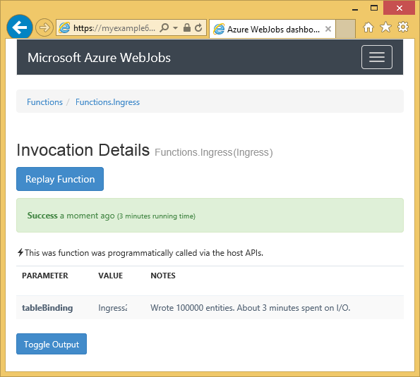

<properties 
    pageTitle="Utilizzo di archiviazione tabelle Azure con SDK WebJobs" 
    description="Informazioni su come usare archiviazione tabelle Azure con SDK WebJobs. Creare tabelle, aggiungere entità a tabelle e leggere le tabelle esistenti." 
    services="app-service\web, storage" 
    documentationCenter=".net" 
    authors="tdykstra" 
    manager="wpickett" 
    editor="jimbe"/>

<tags 
    ms.service="app-service-web" 
    ms.workload="web" 
    ms.tgt_pltfrm="na" 
    ms.devlang="dotnet" 
    ms.topic="article" 
    ms.date="06/01/2016" 
    ms.author="tdykstra"/>

# Utilizzo di archiviazione tabelle Azure con SDK WebJobs

## Panoramica

Questa guida vengono forniti esempi di codice c# che mostrano come leggere e scrivere le tabelle di archiviazione Azure tramite [SDK WebJobs](websites-dotnet-webjobs-sdk.md) versione 1. x.

Presuppone che si sa [come creare un progetto WebJob in Visual Studio con stringhe di connessione che fanno riferimento al proprio account di archiviazione](websites-dotnet-webjobs-sdk-get-started.md) o a [più account di archiviazione](https://github.com/Azure/azure-webjobs-sdk/blob/master/test/Microsoft.Azure.WebJobs.Host.EndToEndTests/MultipleStorageAccountsEndToEndTests.cs).
        
Alcune delle codice frammenti mostrano la `Table` attributo utilizzato nelle funzioni che non [chiamato manualmente](websites-dotnet-webjobs-sdk-storage-queues-how-to.md#manual), vale a dire utilizzando uno degli attributi trigger. 

## Come aggiungere entità a una tabella

Per aggiungere entità a una tabella, utilizzare la `Table` dell'attributo con un `ICollector<T>` o `IAsyncCollector<T>` parametro in `T` specifica lo schema di entità che si desidera aggiungere. Costruttore dell'attributo accetta un parametro stringa che specifica il nome della tabella. 

Nell'esempio seguente viene aggiunto `Person` entità in una tabella denominata *in ingresso*.

        [NoAutomaticTrigger]
        public static void IngressDemo(
            [Table("Ingress")] ICollector<Person> tableBinding)
        {
            for (int i = 0; i < 100000; i++)
            {
                tableBinding.Add(
                    new Person() { 
                        PartitionKey = "Test", 
                        RowKey = i.ToString(), 
                        Name = "Name" }
                    );
            }
        }

In genere il tipo si usa con `ICollector` deriva da `TableEntity` o `ITableEntity`, ma non è necessario. Una delle operazioni seguenti `Person` classi lavoro con il codice riportato nel precedente `Ingress` metodo.

        public class Person : TableEntity
        {
            public string Name { get; set; }
        }

        public class Person
        {
            public string PartitionKey { get; set; }
            public string RowKey { get; set; }
            public string Name { get; set; }
        }

Se si desidera utilizzare direttamente l'API dello spazio di archiviazione di Azure, è possibile aggiungere un `CloudStorageAccount` parametro alla firma del metodo.

## Monitoraggio in tempo reale

Poiché le funzioni di ingresso dei dati spesso elaborano volumi elevati di dati, il dashboard WebJobs SDK fornisce i dati di monitoraggio in tempo reale. La sezione **Chiamata Log** indica se la funzione è ancora in esecuzione.

La pagina dei **Dettagli chiamata** avanzamento della funzione (numero di entità scritto) durante l'esecuzione e consente di interromperlo. 

Al termine, la funzione la pagina dei **Dettagli chiamata** riporta il numero di righe scritte.

## Come leggere più entità da una tabella

Per leggere una tabella, utilizzare la `Table` dell'attributo con un `IQueryable<T>` parametro in cui digitare `T` deriva da `TableEntity` o `ITableEntity`.

Nell'esempio seguente viene letto e registrare tutte le righe di `Ingress` tabella:
 
        public static void ReadTable(
            [Table("Ingress")] IQueryable<Person> tableBinding,
            TextWriter logger)
        {
            var query = from p in tableBinding select p;
            foreach (Person person in query)
            {
                logger.WriteLine("PK:{0}, RK:{1}, Name:{2}", 
                    person.PartitionKey, person.RowKey, person.Name);
            }
        }

### Come leggere una singola entità da una tabella

Esiste un `Table` costruttore attributo con due parametri aggiuntivi che consentono di specificare la chiave di partizione e chiave riga quando si desidera associare un'entità singola tabella.

Nell'esempio seguente legge una riga di tabella per un `Person` entità basata su partizione chiave e riga valori chiave ricevuti in un messaggio di coda:  

        public static void ReadTableEntity(
            [QueueTrigger("inputqueue")] Person personInQueue,
            [Table("persontable","{PartitionKey}", "{RowKey}")] Person personInTable,
            TextWriter logger)
        {
            if (personInTable == null)
            {
                logger.WriteLine("Person not found: PK:{0}, RK:{1}",
                        personInQueue.PartitionKey, personInQueue.RowKey);
            }
            else
            {
                logger.WriteLine("Person found: PK:{0}, RK:{1}, Name:{2}",
                        personInTable.PartitionKey, personInTable.RowKey, personInTable.Name);
            }
        }

Il `Person` classe in questo esempio non è necessario implementare `ITableEntity`.

## Come usare l'API di .NET direttamente con una tabella

È inoltre possibile utilizzare il `Table` dell'attributo con un `CloudTable` oggetto per una maggiore flessibilità nell'utilizzo di una tabella.

Il codice seguente viene utilizzata una `CloudTable` oggetto per aggiungere una singola entità alla tabella *in ingresso* . 
 
        public static void UseStorageAPI(
            [Table("Ingress")] CloudTable tableBinding,
            TextWriter logger)
        {
            var person = new Person()
                {
                    PartitionKey = "Test",
                    RowKey = "100",
                    Name = "Name"
                };
            TableOperation insertOperation = TableOperation.Insert(person);
            tableBinding.Execute(insertOperation);
        }

Per ulteriori informazioni sull'utilizzo di `CloudTable` , vedere [come utilizzare lo spazio di archiviazione tabella da .NET](../storage/storage-dotnet-how-to-use-tables.md). 

## Argomenti correlati rientranti l'articolo sulle procedure relative code.

Per informazioni su come gestire l'elaborazione di tabella attivate da un messaggio di coda o per gli scenari WebJobs SDK non specifici di elaborazione della tabella, vedere [come utilizzare l'archiviazione di Azure coda con SDK WebJobs](websites-dotnet-webjobs-sdk-storage-queues-how-to.md). 

Gli argomenti trattati in questo articolo sono i seguenti:

* Funzioni asincrone
* Più istanze
* Spegnimento
* Utilizzare gli attributi WebJobs SDK nel corpo di una funzione
* Impostare le stringhe di connessione SDK nel codice
* Impostare i valori per WebJobs SDK parametri di costruzione nel codice
* Impostare un trigger manualmente una funzione
* Scrivere i registri

## Passaggi successivi

Questa guida è forniti esempi di codice che illustrano come gestire scenari comuni per l'utilizzo di tabelle Azure. Per ulteriori informazioni sull'utilizzo di Azure WebJobs e WebJobs SDK, vedere [Azure WebJobs consigliati risorse](http://go.microsoft.com/fwlink/?linkid=390226).
 
