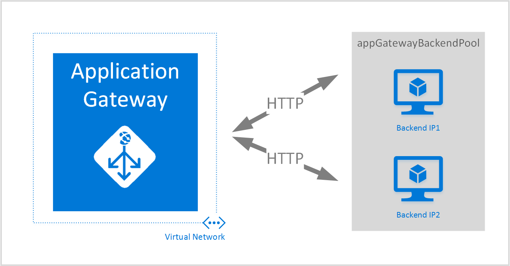

<properties
   pageTitle="Creare un gateway di applicazioni utilizzando modelli di gestione di risorse Azure | Microsoft Azure"
   description="Questa pagina vengono fornite istruzioni per creare un gateway di applicazioni Azure utilizzando il modello di gestione risorse di Azure"
   documentationCenter="na"
   services="application-gateway"
   authors="georgewallace"
   manager="carmonm"
   editor="tysonn"/>
<tags
   ms.service="application-gateway"
   ms.devlang="na"
   ms.topic="article"
   ms.tgt_pltfrm="na"
   ms.workload="infrastructure-services"
   ms.date="10/25/2016"
   ms.author="gwallace"/>

# Creare un gateway di applicazioni utilizzando il modello di gestione risorse di Azure

> [AZURE.SELECTOR]
- [Portale di Azure](application-gateway-create-gateway-portal.md)
- [Azure Manager delle risorse PowerShell](application-gateway-create-gateway-arm.md)
- [Azure PowerShell classica](application-gateway-create-gateway.md)
- [Modelli di Azure Manager delle risorse](application-gateway-create-gateway-arm-template.md)
- [CLI Azure](application-gateway-create-gateway-cli.md)

Gateway di applicazione Azure è un bilanciamento del carico di livello 7. Fornisce failover, routing prestazioni richieste HTTP tra server diversi, se sono nel cloud o locale. Gateway di applicazioni offre molte caratteristiche di applicazione recapito Controller (ADC) inclusi bilanciamento del carico HTTP, affinità sessione basata su cookie, trasferire Secure Sockets Layer (SSL), le ricerche dello stato personalizzato, il supporto per più siti e molti altri. Per trovare un elenco completo delle funzionalità supportate, vedere [Applicazione Gateway Panoramica](application-gateway-introduction.md)

Informazioni su come scaricare e modificare un modello di gestione di risorse Azure esistente da GitHub e distribuire il modello da GitHub, PowerShell e CLI Azure.

Se si è sufficiente distribuisce il modello di gestione di risorse Azure direttamente da GitHub senza alcuna modifica, andare per distribuire un modello da GitHub.

## Scenario:

In questo scenario sarà necessario:

- Creare un gateway di applicazioni con due istanze.
- Creare una rete virtuale denominata VirtualNetwork1 con un blocco CIDR riservato di 10.0.0.0/16.
- Creare una subnet chiamata Appgatewaysubnet che utilizza 10.0.0.0/28 come il blocco CIDR.
- Configurare due configurato in precedenza IP di back-end per il server web che si desidera il bilanciamento del carico il traffico. In questo esempio di modello, gli indirizzi IP back-end sono 10.0.1.10 e 10.0.1.11.

>[AZURE.NOTE] Tali impostazioni sono i parametri per il modello. Per personalizzare il modello, è possibile modificare le regole, comunicare ascoltatore e SSL che apre la azuredeploy.json.

## Scaricare e comprendere il modello di gestione risorse di Azure

È possibile scaricare il modello di gestione di risorse Azure esistente per creare una rete virtuale con due subnet da GitHub, apportare le modifiche potrebbero desiderata e riutilizzare i dati. Per eseguire questa operazione, utilizzare la procedura seguente:

1. Passare a [creare il Gateway di applicazione](https://github.com/Azure/azure-quickstart-templates/tree/master/101-application-gateway-create).
2. Fare clic su **azuredeploy.json**e quindi fare clic su **materie**.
3. Salvare il file in una cartella locale nel computer in uso.
4. Se si ha familiarità con i modelli di Manager delle risorse di Azure, andare al passaggio 7.
5. Aprire il file che è stato salvato e visualizzare il contenuto in **parametri** nella riga 5. Parametri di modello Azure Manager delle risorse forniscono un segnaposto per i valori che possono essere compilati durante la distribuzione.

  	| Parametro | Descrizione |
  	|---|---|
  	| **posizione** | Azure area geografica in cui è stato creato il gateway di applicazione |
  	| **VirtualNetwork1** | Nome per la nuova rete virtuale |
  	| **addressPrefix** | Spazio di indirizzi per la rete virtuale, in formato CIDR |
  	| **ApplicationGatewaysubnet** | Nome per la subnet gateway applicazione |
  	| **subnetPrefix** | Blocco CIDR per la subnet gateway applicazione |
  	| **SKUName** | SKU istanza di dimensioni |
  	| **capacità** | Numero di istanze |
  	| **backendaddress1** | Indirizzo IP del primo server web |
  	| **backendaddress2** | Indirizzo IP del secondo server web |

    >[AZURE.IMPORTANT] Modelli di gestione risorse Azure mantenuti nel GitHub possono cambiare nel tempo. Accertarsi di controllare il modello prima di usarlo.

6. Controllare il contenuto in **risorse** e tenere presente quanto segue:

    - **tipo**. Tipo di risorsa che viene creato dal modello. In questo caso, il tipo è **Microsoft.Network/applicationGateways**, che rappresenta un gateway di applicazioni.
    - **nome**. Nome della risorsa. Si noti l'utilizzo di **[parameters('applicationGatewayName')]**, il che significa che il nome viene specificato come input dall'utente o da un file di parametri durante la distribuzione.
    - **proprietà**. Elenco delle proprietà per la risorsa. Questo modello utilizza la rete virtuale e l'indirizzo IP pubblico durante la creazione di gateway dell'applicazione.

7. Passare a [https://github.com/Azure/azure-quickstart-templates/blob/master/101-application-gateway-create/](https://github.com/Azure/azure-quickstart-templates/blob/master/101-application-gateway-create).
8. Fare clic su **azuredeploy paremeters.json**e quindi fare clic su **materie**.
9. Salvare il file in una cartella locale nel computer in uso.
10. Aprire il file che è stato salvato e modificare i valori per i parametri. Utilizzare i valori seguenti per distribuire il gateway di applicazione descritto in questo scenario.

        {
        "$schema": "http://schema.management.azure.com/schemas/2015-01-01/deploymentParameters.json#",
        {
        "location" : {
        "value" : "West US"
        },
        "addressPrefix": {
        "value": "10.0.0.0/16"
        },
        "subnetPrefix": {
        "value": "10.0.0.0/24"
        },
        "skuName": {
        "value": "Standard_Small"
        },
        "capacity": {
        "value": 2
        },
        "backendIpAddress1": {
        "value": "10.0.1.10"
        },
        "backendIpAddress2": {
        "value": "10.0.1.11"
        }
        }

11. Salvare il file. È possibile testare il modello JSON e parametro utilizzando strumenti di convalida JSON online come [JSlint.com](http://www.jslint.com/).

## Distribuire il modello di gestione di risorse Azure tramite PowerShell

Se non è mai utilizzato Azure PowerShell, informazioni su [come installare e configurare PowerShell Azure](../powershell-install-configure.md) e seguire le istruzioni per accedere a Azure e selezionare l'abbonamento.

### Passaggio 1

    Login-AzureRmAccount

### Passaggio 2

Controllare le sottoscrizioni per l'account.

    Get-AzureRmSubscription

Viene richiesto di eseguire l'autenticazione con le credenziali.

### Passaggio 3

Scegliere quale delle sottoscrizioni Azure da utilizzare.

    Select-AzureRmSubscription -Subscriptionid "GUID of subscription"

### Passaggio 4

Se necessario, creare un gruppo di risorse utilizzando il cmdlet **New-AzureResourceGroup** . Nell'esempio seguente è creare un gruppo di risorse denominato AppgatewayRG nella posizione degli Stati Uniti orientali.

    New-AzureRmResourceGroup -Name AppgatewayRG -Location "East US"

Eseguire il cmdlet **New-AzureRmResourceGroupDeployment** per distribuire la nuova rete virtuale utilizzando il modello precedente e i file di parametro scaricato e modificato.

    New-AzureRmResourceGroupDeployment -Name TestAppgatewayDeployment -ResourceGroupName AppgatewayRG `
        -TemplateFile C:\ARM\azuredeploy.json -TemplateParameterFile C:\ARM\azuredeploy-parameters.json

## Distribuire il modello di gestione di risorse Azure tramite CLI Azure

Per distribuire il modello di gestione di risorse Azure scaricato tramite CLI Azure, seguire la procedura seguente:

### Passaggio 1

Se non è mai utilizzato CLI Azure, vedere [installare e configurare CLI Azure](../xplat-cli-install.md) e seguire le istruzioni fino al punto in cui si seleziona l'account Azure e la sottoscrizione.

### Passaggio 2

Eseguire il comando **configurazione azure modalità** per passare alla modalità di gestione risorse, come illustrato di seguito.

    azure config mode arm

Ecco l'output previsto per il comando precedente:

    info:   New mode is arm

### Passaggio 3

Se necessario, eseguire il comando **Crea gruppo azure** per creare un nuovo gruppo di risorse, come illustrato di seguito. Si noti l'output del comando. Elenco visualizzato dopo l'output illustra i parametri utilizzati. Per ulteriori informazioni sui gruppi di risorse, vedere [Panoramica di gestione di risorse Azure](../azure-resource-manager/resource-group-overview.md).

    azure group create -n appgatewayRG -l eastus

**-n (o - nome)**. Nome per il nuovo gruppo di risorse. Per questo scenario, è *appgatewayRG*.

**-l (o - posizione)**. Azure area geografica in cui viene creato il nuovo gruppo di risorse. Per questo scenario, è *eastus*.

### Passaggio 4

Eseguire il cmdlet **distribuzione del gruppo di azure creare** per distribuire la nuova rete virtuale tramite i file di modello e un parametro scaricato e modificato in precedenza. Elenco visualizzato dopo l'output illustra i parametri utilizzati.

    azure group deployment create -g appgatewayRG -n TestAppgatewayDeployment -f C:\ARM\azuredeploy.json -e C:\ARM\azuredeploy-parameters.json

## Distribuire il modello di gestione di risorse Azure tramite fare clic su per distribuire

Fare clic su per distribuire sono possibile utilizzare i modelli di gestione di risorse Azure. È un modo semplice per utilizzare i modelli con il portale di Azure.

### Passaggio 1

Vedere [creare un gateway di applicazioni con IP pubblico](https://azure.microsoft.com/documentation/templates/101-application-gateway-public-ip/).

### Passaggio 2

Fare clic su **Distribuisci in Azure**.

### Passaggio 3

Compilare i parametri per il modello di distribuzione nel portale e fare clic su **OK**.

### Passaggio 4

Selezionare **note legali** e fare clic su **Acquista**.

### Passaggio 5

Scegliere **Crea**e il distribuzione personalizzata.

## Passaggi successivi

Se si desidera configurare offload SSL, vedere [configurare un gateway di applicazioni per SSL trasferire](application-gateway-ssl.md).

Se si vuole configurare un gateway di applicazioni da utilizzare con un sistema di bilanciamento del carico interno, vedere [creare un gateway di applicazioni con un sistema di bilanciamento del carico interno (ILB)](application-gateway-ilb.md).

Se si desidera ulteriori informazioni sulle opzioni di bilanciamento di carico in generale, visitare:

- [Bilanciamento del carico Azure](https://azure.microsoft.com/documentation/services/load-balancer/)
- [Gestore del traffico Azure](https://azure.microsoft.com/documentation/services/traffic-manager/)
