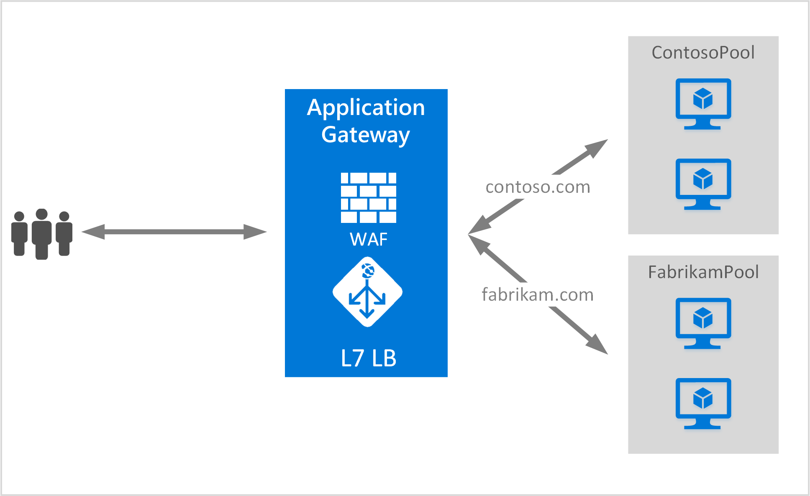

<properties
   pageTitle="Creare un gateway di applicazioni per più siti | Microsoft Azure"
   description="Questa pagina vengono fornite istruzioni per creare, configurare un gateway di applicazione Azure per l'hosting più applicazioni web sullo stesso gateway."
   documentationCenter="na"
   services="application-gateway"
   authors="amsriva"
   manager="rossort"
   editor="amsriva"/>
<tags
   ms.service="application-gateway"
   ms.devlang="na"
   ms.topic="article"
   ms.tgt_pltfrm="na"
   ms.workload="infrastructure-services"
   ms.date="10/25/2016"
   ms.author="amsriva"/>

# Creare un gateway di applicazioni per l'hosting più applicazioni web

> [AZURE.SELECTOR]
- [Portale di Azure](application-gateway-create-multisite-portal.md)
- [Azure Manager delle risorse PowerShell](application-gateway-create-multisite-azureresourcemanager-powershell.md)

Hosting di siti più consente di distribuire più applicazioni web nel gateway applicazione stesso. Si basa sulla presenza di intestazione host nella richiesta HTTP in arrivo, per determinare quali comunicare ascoltatore riceverà il traffico. Comunicare ascoltatore quindi indirizza il traffico al pool di back-end appropriati come configurato nella definizione di regole del gateway. Nelle applicazioni web SSL abilitato, gateway applicazione si basa su estensione indicazione di nome Server (SNI) per scegliere comunicare ascoltatore corretto per il traffico web. Generalmente utilizzata per l'hosting di siti più consiste nel carico per i domini web diverso al pool di diversi server di back-end. Allo stesso modo più sottodomini dello stesso dominio radice possono essere inoltre ospitati nello stesso gateway dell'applicazione.

## Scenario:

Nell'esempio seguente gateway applicazione serve il traffico verso contoso.com e fabrikam.com con due pool di server di back-end: contoso pool di server e il server di fabrikam. Configurazione simili potrebbe essere utilizzate per sottodomini host come app.contoso.com e blog.contoso.com.

## Prima di iniziare

1. Installare l'ultima versione dei cmdlet di PowerShell Azure tramite il programma di installazione di piattaforma Web. È possibile scaricare e installare l'ultima versione dalla sezione **Windows PowerShell** della [pagina Download](https://azure.microsoft.com/downloads/).
2. I server aggiunti al pool di back-end da utilizzare il gateway di applicazione deve essere presente o relativi endpoint creato in virtuali in una subnet separata o con un pubblico IP/VIP assegnato.

## Requisiti

- **Pool di server di back-end:** Elenco di indirizzi IP di server back-end. Indirizzi IP elencati devono appartenere alla subnet virtuali o devono essere un IP/VIP pubblico. Nome di dominio completo può anche essere utilizzato.
- **Le impostazioni del pool di server di back-end:** Ogni pool ha impostazioni come porta, il protocollo e affinità basate su cookie. Queste impostazioni sono collegate a un pool e vengono applicate a tutti i server del pool.
- **Porta front-end:** Questa porta è la porta pubblica che viene aperta nel gateway dell'applicazione. Il traffico raggiunge la porta e quindi venga reindirizzato a uno dei server back-end.
- **Comunicare ascoltatore:** Comunicare ascoltatore dispone di una porta front-end, un protocollo (Http o Https, questi valori sono maiuscole e minuscole) e il nome del certificato SSL (se la configurazione di SSL trasferire). Per i gateway applicazione abilitata più siti, nome host e gli indicatori di SNI aggiunti anche.
- **Regola:** La regola associa comunicare ascoltatore, pool server di back-end e consente di definire quali pool di server di back-end il traffico deve essere indirizzato al quando arriva una particolare comunicare ascoltatore.

## Creare un gateway di applicazioni

Di seguito sono i passaggi necessari per creare un gateway di applicazione:

1. Creare un gruppo di risorse per Gestione risorse.
2. Creare una rete virtuale, subnet e indirizzo IP pubblico per il gateway di applicazione.
3. Creare un oggetto di configurazione del gateway dell'applicazione.
4. Creare una risorsa di gateway dell'applicazione.

## Creare un gruppo di risorse per Gestione risorse

Verificare che si usa la versione più recente di Azure PowerShell. Ulteriori informazioni sono disponibili [all'Uso di Windows PowerShell con Gestione risorse](../powershell-azure-resource-manager.md).

### Passaggio 1

Accedere a Azure

    Login-AzureRmAccount

Viene richiesto di eseguire l'autenticazione con le credenziali.

### Passaggio 2

Controllare le sottoscrizioni per l'account.

    Get-AzureRmSubscription

### Passaggio 3

Scegliere quale delle sottoscrizioni Azure da utilizzare.

    Select-AzureRmSubscription -SubscriptionName "Name of subscription"

### Passaggio 4

Creare un gruppo di risorse (ignorare questo passaggio se si usa un gruppo di risorse esistente).

    New-AzureRmResourceGroup -Name appgw-RG -location "West US"

In alternativa è anche possibile creare tag per un gruppo di risorse per gateway applicazione:

    $resourceGroup = New-AzureRmResourceGroup -Name appgw-RG -Location "West US" -Tags @{Name = "testtag"; Value = "Application Gateway multiple site"}

Gestione risorse di Azure richiede che tutti i gruppi di risorse specificano un percorso. Questo percorso viene utilizzato come posizione predefinita per le risorse in tale gruppo di risorse. Assicurarsi che tutti i comandi per creare un gateway di applicazioni utilizzano lo stesso gruppo di risorse.

Nell'esempio precedente, creato un gruppo di risorse denominato "appgw-RG" con una posizione di"Ovest".

>[AZURE.NOTE] Se è necessario configurare un sondaggio personalizzato per il gateway di applicazione, vedere [creare un gateway di applicazioni con le ricerche personalizzate tramite PowerShell](application-gateway-create-probe-ps.md). Visitare [le ricerche personalizzate e il monitoraggio dell'integrità](application-gateway-probe-overview.md) per altre informazioni.

## Creare una rete virtuale e subnet

Nell'esempio seguente viene illustrato come creare una rete virtuale tramite Gestione risorse. In questo passaggio vengono create due subnet. La prima subnet riguarda il gateway di applicazione. Gateway di applicazione richiede il proprio subnet per contenere le istanze. Altri gateway di applicazione possono essere distribuiti in tale subnet. La seconda subnet viene utilizzata per contenere i server di back-end dell'applicazione.

### Passaggio 1

Assegnare il 10.0.0.0/24 intervallo indirizzo per la variabile di subnet da utilizzare per tenere il gateway di applicazione.

    $subnet = New-AzureRmVirtualNetworkSubnetConfig -Name appgatewaysubnet -AddressPrefix 10.0.0.0/24

### Passaggio 2

Assegnare il 10.0.1.0/24 intervallo indirizzo della variabile subnet2 da utilizzare per i pool di back-end.

    $subnet2 = New-AzureRmVirtualNetworkSubnetConfig -Name backendsubnet -AddressPrefix 10.0.1.0/24

### Passaggio 3

Creare una rete virtuale denominata "appgwvnet" in risorse gruppo "appgw-rg" per l'area geografica US ovest con 10.0.0.0/16 prefisso 10.0.0.0/24 subnet e 10.0.1.0/24.

    $vnet = New-AzureRmVirtualNetwork -Name appgwvnet -ResourceGroupName appgw-RG -Location "West US" -AddressPrefix 10.0.0.0/16 -Subnet $subnet,$subnet2

### Passaggio 4

Assegnare una variabile di subnet per i passaggi successivi, che consente di creare un gateway di applicazioni.

    $appgatewaysubnet = Get-AzureRmVirtualNetworkSubnetConfig -Name appgatewaysubnet -VirtualNetwork $vnet
    $backendsubnet = Get-AzureRmVirtualNetworkSubnetConfig -Name backendsubnet -VirtualNetwork $vnet

## Creare un indirizzo IP pubblico per la configurazione front-end

Creare una risorsa IP pubblica "publicIP01" in risorse gruppo "appgw-rg" per l'area geografica US ovest.

    $publicip = New-AzureRmPublicIpAddress -ResourceGroupName appgw-RG -name publicIP01 -location "West US" -AllocationMethod Dynamic

Un indirizzo IP viene assegnato al gateway applicazione all'avvio del servizio.

## Creare la configurazione di gateway applicazione

È necessario impostare tutti gli elementi di configurazione prima di creare il gateway di applicazione. La procedura seguente crea gli elementi di configurazione necessari per una risorsa di gateway dell'applicazione.

### Passaggio 1

Creare un'applicazione di configurazione di IP gateway denominato "gatewayIP01". All'avvio di gateway di applicazioni, raccoglie dal subnet configurato un indirizzo IP e indirizzare il traffico di rete per gli indirizzi IP nel pool di indirizzi IP di back-end. Tenere presente che ogni istanza accetta un indirizzo IP.

    $gipconfig = New-AzureRmApplicationGatewayIPConfiguration -Name gatewayIP01 -Subnet $appgatewaysubnet

### Passaggio 2

Configurare il pool di indirizzi IP di back-end denominate "pool01" e "pool2" con gli indirizzi IP "10.0.1.100, 10.0.1.101,10.0.1.102" per "pool1" e "10.0.1.103, 10.0.1.104, 10.0.1.105" per "pool2".

    $pool1 = New-AzureRmApplicationGatewayBackendAddressPool -Name pool01 -BackendIPAddresses 10.0.1.100, 10.0.1.101, 10.0.1.102
    $pool2 = New-AzureRmApplicationGatewayBackendAddressPool -Name pool02 -BackendIPAddresses 10.0.1.103, 10.0.1.104, 10.0.1.105

In questo esempio, sono disponibili due pool di back-end per instradare il traffico di rete in base al sito richiesto. Un pool riceve il traffico dal sito "contoso.com" e altri pool riceve il traffico dal sito "fabrikam.com". È necessario sostituire gli indirizzi IP precedenti per aggiungere il proprio endpoint indirizzo IP di applicazione. Al posto di indirizzi IP interni, è possibile utilizzare indirizzi IP pubblici, FQDN o NIC una Virtual Machine per le istanze di back-end. Utilizzare "-BackendFQDNs" parametro PowerShell per specificare FQDN invece di indirizzi IP.

### Passaggio 3

Configurare le applicazioni gateway impostazione "poolsetting01" e "poolsetting02" per il traffico di rete bilanciamento del carico nel pool di back-end. In questo esempio, configurare impostazioni pool di back-end diverso per i pool di back-end. Ogni pool di back-end può avere la propria impostazione del pool di back-end.

    $poolSetting01 = New-AzureRmApplicationGatewayBackendHttpSettings -Name "besetting01" -Port 80 -Protocol Http -CookieBasedAffinity Disabled -RequestTimeout 120
    $poolSetting02 = New-AzureRmApplicationGatewayBackendHttpSettings -Name "besetting02" -Port 80 -Protocol Http -CookieBasedAffinity Enabled -RequestTimeout 240

### Passaggio 4

Configurare IP front-end con endpoint IP pubblico.

    $fipconfig01 = New-AzureRmApplicationGatewayFrontendIPConfig -Name "frontend1" -PublicIPAddress $publicip

### Passaggio 5

Configurare la porta front-end per un gateway di applicazioni.

    $fp01 = New-AzureRmApplicationGatewayFrontendPort -Name "fep01" -Port 443

### Passaggio 6

Configurare due i certificati SSL per i due siti Web che verranno supporto in questo esempio. È un certificato per il traffico contoso.com e l'altra per il traffico fabrikam.com. Questi certificati devono essere un'autorità di certificazione di certificati per i siti Web. Certificati sono supportati ma non è consigliati per il traffico di produzione.

    $cert01 = New-AzureRmApplicationGatewaySslCertificate -Name contosocert -CertificateFile <file path> -Password <password>
    $cert02 = New-AzureRmApplicationGatewaySslCertificate -Name fabrikamcert -CertificateFile <file path> -Password <password>

### Passaggio 7

Configurare due listener per i due siti web in questo esempio. Questo passaggio consente di configurare i listener per l'indirizzo IP pubblico, porta e host utilizzato per ricevere il traffico in ingresso. Parametro di nome host è necessario per supporto per più siti e deve essere impostato per il sito Web appropriato per il quale si riceve il traffico. Parametro RequireServerNameIndication deve essere impostato su true per i siti Web che richiedono il supporto per SSL in uno scenario con più host. Se è necessario un supporto SSL, è anche necessario specificare il certificato SSL utilizzato per proteggere il traffico per tale applicazione web. La combinazione di FrontendIPConfiguration, FrontendPort e HostName deve essere univoca per comunicare un ascoltatore. Ogni comunicare ascoltatore supportino un certificato.

    $listener01 = New-AzureRmApplicationGatewayHttpListener -Name "listener01" -Protocol Https -FrontendIPConfiguration $fipconfig01 -FrontendPort $fp01 -HostName "contoso11.com" -RequireServerNameIndication true  -SslCertificate $cert01
    $listener02 = New-AzureRmApplicationGatewayHttpListener -Name "listener02" -Protocol Https -FrontendIPConfiguration $fipconfig01 -FrontendPort $fp01 -HostName "fabrikam11.com" -RequireServerNameIndication true -SslCertificate $cert02

### Passaggio 8

Creare due impostazione della regola per le applicazioni due web in questo esempio. Una regola collega listener, pool di back-end e le impostazioni http. Questo passaggio consente di configurare il gateway di applicazione per l'utilizzo di base regola di routing, uno per ogni sito Web. Il traffico in ciascun sito Web ricevuto tramite il relativo comunicare ascoltatore configurato e quindi indirizzato al relativo pool back-end configurato, utilizzando le proprietà specificate nella BackendHttpSettings.

    $rule01 = New-AzureRmApplicationGatewayRequestRoutingRule -Name "rule01" -RuleType Basic -HttpListener $listener01 -BackendHttpSettings $poolSetting01 -BackendAddressPool $pool1
    $rule02 = New-AzureRmApplicationGatewayRequestRoutingRule -Name "rule02" -RuleType Basic -HttpListener $listener02 -BackendHttpSettings $poolSetting02 -BackendAddressPool $pool2

### Passaggio 9

Configurare il numero di istanze e le dimensioni del gateway dell'applicazione.

    $sku = New-AzureRmApplicationGatewaySku -Name "Standard_Medium" -Tier Standard -Capacity 2

## Creare applicazioni gateway

Creare un gateway di applicazioni con tutti gli oggetti di configurazione dai passaggi precedenti.

    $appgw = New-AzureRmApplicationGateway -Name appgwtest -ResourceGroupName appgw-RG -Location "West US" -BackendAddressPools $pool1,$pool2 -BackendHttpSettingsCollection $poolSetting01, $poolSetting02 -FrontendIpConfigurations $fipconfig01 -GatewayIpConfigurations $gipconfig -FrontendPorts $fp01 -HttpListeners $listener01, $listener02 -RequestRoutingRules $rule01, $rule02 -Sku $sku -SslCertificates $cert01, $cert02

>[AZURE.IMPORTANT] Il provisioning di Gateway di applicazione è un'operazione di esecuzione prolungata e può richiedere del tempo per completare.

## Ottenere il nome dell'applicazione gateway DNS

Dopo aver creato il gateway, il passaggio successivo consiste nel configurare front-end per la comunicazione. Quando si usa un indirizzo IP pubblico, applicazione gateway richiede un nome DNS assegnato dinamicamente, ovvero non è descrittivo. Per garantire agli utenti finali possibile raggiungere il gateway di applicazione un record CNAME può essere utilizzato in modo che puntino all'endpoint pubblico del gateway dell'applicazione. [Configurazione di un nome di dominio personalizzato per in Azure](../cloud-services/cloud-services-custom-domain-name-portal.md). A tale scopo, recuperare i dettagli del gateway dell'applicazione e il relativo nome IP/DNS associato utilizzando l'elemento PublicIPAddress collegato al gateway dell'applicazione. Nome DNS del gateway dell'applicazione deve essere utilizzato per creare un record CNAME che punta le applicazioni due web per questo nome DNS. L'uso di un record non è consigliabile poiché l'indirizzo VIP può cambiare al riavvio del gateway dell'applicazione.
    
    Get-AzureRmPublicIpAddress -ResourceGroupName appgw-RG -Name publicIP01
        
    Name                     : publicIP01
    ResourceGroupName        : appgw-RG
    Location                 : westus
    Id                       : /subscriptions/<subscription_id>/resourceGroups/appgw-RG/providers/Microsoft.Network/publicIPAddresses/publicIP01
    Etag                     : W/"00000d5b-54ed-4907-bae8-99bd5766d0e5"
    ResourceGuid             : 00000000-0000-0000-0000-000000000000
    ProvisioningState        : Succeeded
    Tags                     : 
    PublicIpAllocationMethod : Dynamic
    IpAddress                : xx.xx.xxx.xx
    PublicIpAddressVersion   : IPv4
    IdleTimeoutInMinutes     : 4
    IpConfiguration          : {
                                 "Id": "/subscriptions/<subscription_id>/resourceGroups/appgw-RG/providers/Microsoft.Network/applicationGateways/appgwtest/frontendIP
                               Configurations/frontend1"
                               }
    DnsSettings              : {
                                 "Fqdn": "00000000-0000-xxxx-xxxx-xxxxxxxxxxxx.cloudapp.net"
                               }

## Passaggi successivi

Informazioni su come proteggere i siti Web con [Gateway applicazione - Firewall applicazione Web](application-gateway-webapplicationfirewall-overview.md)