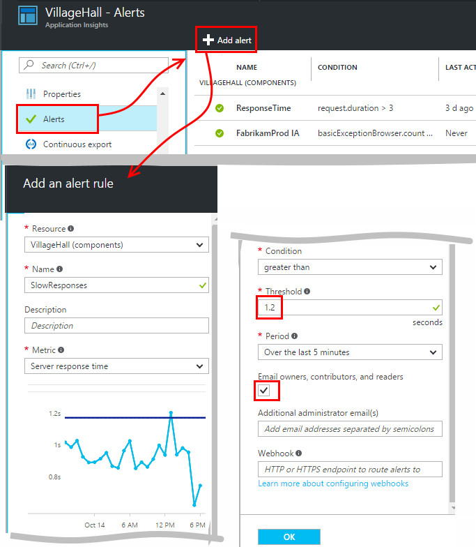
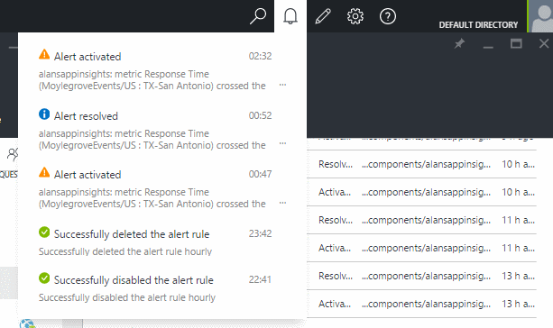

<properties 
    pageTitle="Impostare avvisi in applicazione approfondimenti | Microsoft Azure" 
    description="Ricevere una notifica sulle tempi di risposta lenti eccezioni e altri prestazioni modifiche o l'uso nelle applicazioni web." 
    services="application-insights" 
    documentationCenter=""
    authors="alancameronwills" 
    manager="douge"/>

<tags 
    ms.service="application-insights" 
    ms.workload="tbd" 
    ms.tgt_pltfrm="ibiza" 
    ms.devlang="na" 
    ms.topic="article" 
    ms.date="10/14/2016" 
    ms.author="awills"/>
 
# Impostare avvisi in applicazione approfondimenti

[Visual Studio applicazione approfondimenti] [ start] può segnalare le modifiche in metriche di prestazioni o l'uso nelle applicazioni web. 

Informazioni dettagliate sui applicazione esegue il monitoraggio dell'applicazione live su una [vasta gamma di piattaforme] [ platforms] per diagnosticare i problemi di prestazioni e ottenere informazioni sui modelli di utilizzo.

Esistono tre tipi di avvisi:

* **Avvisi metrici** indicare quando le unità di misura metriche supera un valore di soglia per un determinato periodo, ad esempio i tempi di risposta, conteggi eccezione, l'utilizzo della CPU o visualizzazioni di pagina. 
* [**Test Web** ] [ availability] sapere quando il sito è disponibile su internet o risponde lentamente. [Altre informazioni][availability].
* [**Diagnostica preventiva**](app-insights-proactive-diagnostics.md) vengono configurate automaticamente per comunicare informazioni sui motivi di prestazioni insolito.

Abbiamo focalizzare l'attenzione su metrici avvisi in questo articolo.

## Impostare un avviso metrico

Aprire e il regole di avviso e quindi utilizzare il pulsante Aggiungi. 

* Impostare la risorsa prima di altre proprietà. **Scegliere la risorsa "(componenti)"** se si vuole impostare gli avvisi sui dati statistici relativi alle prestazioni o l'uso.
* Il nome da assegnare all'avviso deve essere univoco all'interno del gruppo di risorse (non solo l'applicazione).
* Assicurarsi di prendere nota delle unità in cui viene richiesto di immettere il valore di soglia.
* Se si seleziona la casella "… proprietari di posta elettronica", verranno inviati avvisi tramite posta elettronica a chiunque abbia accesso al gruppo di risorse. Per espandere il set di persone, aggiungerle al [gruppo di risorse o l'abbonamento](app-insights-resources-roles-access-control.md) (non la risorsa).
* Se si specifica "Altri messaggi di posta elettronica", verranno inviati avvisi ai singoli utenti o gruppi (o meno è selezionata la casella "inviare tramite posta elettronica proprietari..."). 
* Impostare un [indirizzo webhook](../monitoring-and-diagnostics/insights-webhooks-alerts.md) se è stata configurata un'app web di risposta agli avvisi. Verrà chiamato quando l'avviso è attivata (attivato) e quando viene risolto. (Ma si noti che attualmente, parametri query non vengono passati come proprietà webhook.)
* È possibile disabilitare o abilitare l'avviso: visualizzare i pulsanti nella parte superiore e il.

*Non è visualizzato il pulsante Aggiungi avviso.* 

- Si sta utilizzando un account dell'organizzazione? È possibile impostare avvisi se si dispone di proprietario o collaboratore accedere a questa risorsa dell'applicazione. Esaminare e il controllo di accesso. [Informazioni sul controllo dell'accesso][roles].

> [AZURE.NOTE] Nella e avvisi, verrà visualizzata che esiste già un set di avviso: [Diagnostica preventivo](app-insights-proactive-failure-diagnostics.md). Si tratta di un avviso automatico che esegue il monitoraggio una particolare metrica, richiesta frequenza di errori. A meno che non si decide di disattivare gli avvisi per priorità, non è necessario impostare il proprio avviso per il numero di errori richiesta. 

## Vedere gli avvisi

Viene visualizzato un messaggio di posta elettronica quando un avviso imposta lo stato tra inattivo e attivo. 

Lo stato corrente di tutti gli avvisi verrà visualizzato nell'e regole di avviso.

Esiste un riepilogo delle attività più recenti nella avvisi elenco a discesa:

La cronologia delle modifiche di stato è nel Log delle attività:

## Il funzionamento degli avvisi

* Un avviso sono previsti tre stati: "Non è mai attivato", "Attivato" e "Risolto". Quando è stata valutata ultimo è stato impostato su true, attivate indica che la condizione specificata.

* Viene generata una notifica quando un avviso di modifica stato. (Se la condizione dell'avviso era già true al momento della creazione dell'avviso, si potrebbe non riceve una notifica fino a quando la condizione passa falsa.)

* Ogni notifica genera un messaggio di posta elettronica se è selezionata la casella di messaggi di posta elettronica oppure fornita indirizzi di posta elettronica. È anche possibile esaminare l'elenco a discesa notifiche.

* Un avviso viene valutato ogni volta che arriva una metrica, ma non in caso contrario.

* La valutazione aggrega l'unità di misura metriche nel periodo precedente e confrontandolo con la soglia per determinare lo stato di nuovo.

* Il periodo che si è scelto specifica l'intervallo in cui vengono aggregate metriche. E non influisce con quale frequenza viene valutata l'avviso: che dipende dalla frequenza dell'arrivo di metriche.

* Se nessun dato arriva per una particolare metrica per un certo periodo, diversi effetti valutazione degli avvisi e i grafici in Esplora metrica la distanza. In Esplora metrica dati non sono visibile per più di intervallo campioni del grafico, il grafico mostra il valore 0. Ma un avviso in base alla stessa metrica non viene valutata nuovamente e lo stato dell'avviso rimarrà invariato. 

    Quando arrivano alla fine dei dati, il grafico passa di nuovo a un valore diverso da zero. Viene valutato l'avviso in base ai dati disponibili per il periodo specificato. Se il nuovo punto dati è l'unica disponibile nel periodo, l'aggregazione è basata solo via che del punto dati.

* Un avviso possibile sfarfallio spesso alternativamente avviso integro, anche se si imposta un periodo di tempo. Questo problema può verificarsi se il valore di metrica viene posizionato intorno la soglia. Nella soglia non esiste nessuna isteresi: la transizione a avviso si verifica lo stesso valore di transizione a integro.

## Quali sono gli avvisi ottimale per impostare?

Dipende l'applicazione. Per iniziare, è consigliabile non impostare metriche troppi. Dedicare alcuni esamina i grafici metrici durante l'esecuzione di un'applicazione, per avere un'idea di come funziona normalmente. Consente di trovare modi per ottimizzare le prestazioni. Quindi impostare gli avvisi per stabilire quando le metriche passare di fuori area normale. 

Avvisi comuni includono:

* [Metrica browser][client], in particolare Browser **tempi di caricamento delle pagine**, sono ideali per le applicazioni web. Se la pagina presenta molte script, verrà vuole cercare **eccezioni browser**. Per ottenere le metriche e gli avvisi, è necessario configurare la [pagina web monitoraggio][client].
* **Tempo di risposta server** per le applicazioni web sul lato server. Oltre al tipo di impostazione degli avvisi, tenere sotto controllo sulla metrica, per vedere se varia in modo non proporzionale con frequenza richieste alta: che è possibile che l'app sia in esecuzione all'esterno delle risorse. 
* **Eccezioni server** - per una visione, è necessario eseguire alcune [impostazioni aggiuntive](app-insights-asp-net-exceptions.md).

Non dimenticare di tale [diagnostica tasso di errore preventivo](app-insights-proactive-failure-diagnostics.md) automaticamente monitorare la frequenza con cui l'app risponde alle richieste di codici di errore. 

## Automazione

* [Usare PowerShell per automatizzare la configurazione di avvisi](app-insights-powershell-alerts.md)
* [Utilizzare webhooks per automatizzare risposta agli avvisi](../monitoring-and-diagnostics/insights-webhooks-alerts.md)

## Vedere anche

* [Test web disponibilità](app-insights-monitor-web-app-availability.md)
* [Automatizzare la configurazione di avvisi](app-insights-powershell-alerts.md)
* [Diagnostica preventiva](app-insights-proactive-diagnostics.md) 

<!--Link references-->

[availability]: app-insights-monitor-web-app-availability.md
[client]: app-insights-javascript.md
[platforms]: app-insights-platforms.md
[roles]: app-insights-resources-roles-access-control.md
[start]: app-insights-overview.md

 