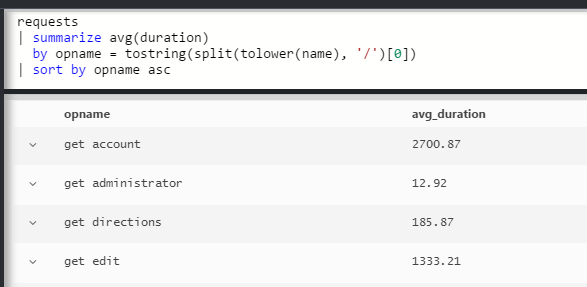
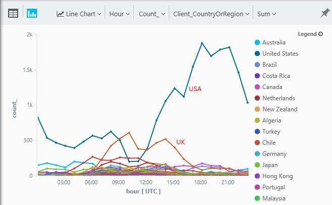
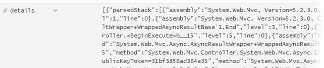
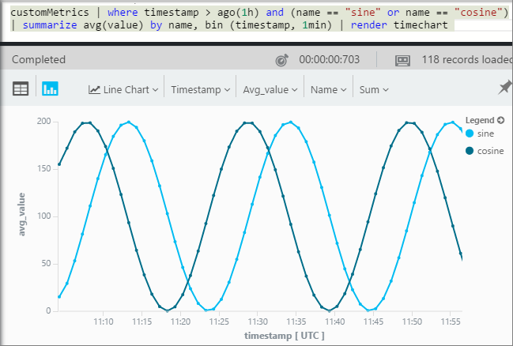

<properties 
    pageTitle="Una panoramica Analitica nell'applicazione approfondimenti | Microsoft Azure" 
    description="Brevi esempi di tutte le query principale Analitica, il potente strumento di ricerca di informazioni approfondite dell'applicazione." 
    services="application-insights" 
    documentationCenter=""
    authors="alancameronwills" 
    manager="douge"/>

<tags 
    ms.service="application-insights" 
    ms.workload="tbd" 
    ms.tgt_pltfrm="ibiza" 
    ms.devlang="na" 
    ms.topic="article" 
    ms.date="10/15/2016" 
    ms.author="awills"/>


 
# <a name="a-tour-of-analytics-in-application-insights"></a>Una panoramica delle Analitica approfondimenti applicazione


[Analitica](app-insights-analytics.md) è la funzionalità di ricerca potenti di [Informazioni approfondite dell'applicazione](app-insights-overview.md). Queste pagine descrivono lanquage di query Analitica.


* **[Guardare il video introduttivo](https://applicationanalytics-media.azureedge.net/home_page_video.mp4)**.
* **[Unità di test Analitica il nostro simulata dati](https://analytics.applicationinsights.io/demo)** se l'app non invia dati a informazioni dettagliate sui applicazione ancora.


Di seguito è illustrato un percorso tramite alcune query di base per iniziare.

## <a name="connect-to-your-application-insights-data"></a>Connettersi ai dati di applicazione approfondimenti

Aprire Analitica da dell'app [blade Panoramica](app-insights-dashboards.md) in informazioni dettagliate sui applicazione:


    
## <a name="takeapp-insights-analytics-referencemdtake-operator-show-me-n-rows"></a>[Scrivere](app-insights-analytics-reference.md#take-operator): Mostra n righe

Punti di dati che effettuano operazioni utente (in genere richieste HTTP ricevute dall'app web) sono archiviati in una tabella denominata `requests`. Ogni riga è un punto dati di telemetria ricevuto dall'applicazione approfondimenti SDK nell'app.

Iniziamo esaminando alcune righe di esempio della tabella:


> [AZURE.NOTE] Inserire in un punto qualsiasi il cursore nell'istruzione prima fare clic su Vai. È possibile dividere un'istruzione su più righe, ma non inserire righe vuote in un'istruzione. Righe vuote consentono di mantenere più query separata nella finestra.


Scegliere le colonne, trascinarli e raggruppare per colonne e il filtro: 


Espandere qualsiasi elemento per visualizzare i dati di dettaglio:
 


> [AZURE.NOTE] Fare clic su intestazione della colonna per riordinare i risultati disponibili nel web browser. Ma tenere presente che per un set di risultati di grandi dimensioni, il numero di righe scaricata nel browser è limitato. Ordinamento in questo modo non sempre Mostra gli elementi più alti o più bassi effettivi. Per ordinare gli elementi in modo affidabile, utilizzare la `top` o `sort` operatore. 

## <a name="topapp-insights-analytics-referencemdtop-operator-and-sortapp-insights-analytics-referencemdsort-operator"></a>[Superiore](app-insights-analytics-reference.md#top-operator) e [ordinamento](app-insights-analytics-reference.md#sort-operator)

`take`può essere utile ottenere un rapido esempio di un risultato, ma che mostra le righe della tabella senza un ordine specifico. Per ottenere una visualizzazione ordinata, utilizzare `top` (ad esempio) o `sort` (sopra l'intera tabella).

Mostra le prime n righe, ordinate per una determinata colonna:

```AIQL

    requests | top 10 by timestamp desc 
```

* *Sintassi:* Maggior parte degli operatori disporre i parametri di parole chiave, ad esempio `by`.
* `desc`= ordine decrescente, `asc` = crescente.


`top...`è un modo efficace più di per segnalare `sort ... | take...`. È possibile scrivere:

```AIQL

    requests | sort by timestamp desc | take 10
```

Il risultato è lo stesso, ma viene eseguito più lentamente. (È anche possibile scrivere `order`, che è un alias di `sort`.)

Le intestazioni di colonna nella visualizzazione tabella possono anche essere utilizzate per ordinare i risultati nella schermata. Ma naturalmente, se sono state usate `take` o `top` per recuperare solo una parte di una tabella, è necessario solo riordinare i record è stato recuperato.


## <a name="projectapp-insights-analytics-referencemdproject-operator-select-rename-and-compute-columns"></a>[Progetto](app-insights-analytics-reference.md#project-operator): selezionare, rinominare e calcolare le colonne

Usare [`project`](app-insights-analytics-reference.md#project-operator) per individuare solo le colonne desiderate:

```AIQL

    requests | top 10 by timestamp desc
             | project timestamp, name, resultCode
```


È anche possibile rinominare le colonne e definirne di nuovi:

```AIQL

    requests 
  	| top 10 by timestamp desc 
  	| project  
            name, 
            response = resultCode,
            timestamp, 
            ['time of day'] = floor(timestamp % 1d, 1s)
```


* [I nomi delle colonne](app-insights-analytics-reference.md#names) possono includere spazi o simboli se si sono racchiusi tra parentesi quadre come il seguente: `['...']` o`["..."]`
* `%`è la consueta operatore modulo. 
* `1d`(è una cifra uno, quindi un era ') è un giorno a indicare un intervallo di tempo letterale. Ecco alcuni altri valori letterali timespan: `12h`, `30m`, `10s`, `0.01s`.
* `floor`(alias `bin`) viene arrotondato per difetto al multiplo più vicino del valore di base è fornire un valore. In modo `floor(aTime, 1s)` viene arrotondato un orario per difetto secondo più vicino.

[Le espressioni](app-insights-analytics-reference.md#scalars) possono includere tutti gli operatori comune (`+`, `-`;...), viene rilevato un intervallo di funzioni utili.

    

## <a name="extendapp-insights-analytics-referencemdextend-operator-compute-columns"></a>[Estendi](app-insights-analytics-reference.md#extend-operator): calcolare le colonne

Se si vuole semplicemente aggiungere colonne a quelli esistenti, utilizzare [`extend`](app-insights-analytics-reference.md#extend-operator):

```AIQL

    requests 
  	| top 10 by timestamp desc
  	| extend timeOfDay = floor(timestamp % 1d, 1s)
```

Utilizzo [`extend`](app-insights-analytics-reference.md#extend-operator) risulta meno dettagliato rispetto [`project`](app-insights-analytics-reference.md#project-operator) se si desidera mantenere tutte le colonne esistenti.


## <a name="summarizeapp-insights-analytics-referencemdsummarize-operator-aggregate-groups-of-rows"></a>[Summarize](app-insights-analytics-reference.md#summarize-operator): gruppi di righe di aggregazione

`Summarize`Applica una *funzione di aggregazione* specificata gruppi di righe. 

Ad esempio il tempo di un'applicazione web per rispondere a una convocazione è indicato nel campo `duration`. Vediamo ora medio di risposta a tutte le richieste:


O è stato possibile separare il risultato in richieste di nomi diversi:


`Summarize`raccoglie le coordinate nel flusso in gruppi per il quale la `by` clausola restituisce identico. Ogni valore di `by` espressione - ogni nome di operazione nell'esempio precedente - dà come risultato in una riga nella tabella dei risultati. 

Oppure è possibile raggruppare i risultati per ora del giorno:


Si noti come si utilizza il `bin` funzione (o `floor`). Se è stato usato solo `by timestamp`, ogni riga di input farebbe nel proprio gruppo piccola. Per qualsiasi valore scalare continua ad esempio ore o numeri, è necessario interrompere l'intervallo continuo in un numero di valori distinti, gestibile e `bin` -che è semplicemente il familiare arrotondamento verso il basso `floor` funzione - è il modo più semplice.

È possibile utilizzare la stessa tecnica per ridurre gli intervalli di stringhe:




Si noti che è possibile utilizzare `name=` per impostare il nome di una colonna di risultati, le espressioni di aggregazione o la clausola by.

## <a name="counting-sampled-data"></a>Il conteggio dei dati campionati

`sum(itemCount)`è l'aggregazione consigliato per contare gli eventi. In molti casi itemCount = = 1, in modo che la funzione semplicemente conta il numero di righe nel gruppo. Ma quando [campioni](app-insights-sampling.md) è in esecuzione, solo una parte di eventi originale verrà mantenuta come punti dati nell'applicazione approfondimenti, in modo che per ogni punto dati viene visualizzato, esistono `itemCount` eventi. 

Ad esempio, se campioni Ignora 75% di eventi originali, quindi itemCount = = 4 nei record mantenuti, vale a dire per ogni record mantenuti, si sono verificati quattro record originale. 

Esempio di adattamento causa itemCount sia più alta durante i periodi quando l'applicazione viene utilizzato.

Riepilogare itemCount pertanto offre una buona stima del numero originale di eventi.


È inoltre disponibile un `count()` aggregazione e un'operazione di conteggio, nei casi in cui si desideri contare il numero di righe in un gruppo.


Esiste un intervallo di [funzioni di aggregazione](app-insights-analytics-reference.md#aggregations).


## <a name="charting-the-results"></a>Grafici i risultati


```AIQL

    exceptions 
       | summarize count()  
         by bin(timestamp, 1d)
```

Per impostazione predefinita, visualizzano i risultati di una tabella:


Effettuare meglio la visualizzazione per tabella. Osservare i risultati in visualizzazione del grafico con verticale barre opzione:


Si noti che, anche se è non ordinare i risultati tempo (come è possibile vedere nella visualizzazione), la visualizzazione del grafico mostra sempre date e ore nell'ordine corretto.


## <a name="whereapp-insights-analytics-referencemdwhere-operator-filtering-on-a-condition"></a>[Dove](app-insights-analytics-reference.md#where-operator): applicazione del filtro a una condizione

Se è stato configurato applicazione approfondimenti monitoraggio per i lati [client](app-insights-javascript.md) e server dell'app, alcune delle telemetria nel database proviene dal browser.

Vediamo soltanto le eccezioni riportate dal browser:

```AIQL

    exceptions 
  	| where client_Type == "Browser" 
  	|  summarize count() 
       by client_Browser, outerMessage 
```


Il `where` operatore utilizza un'espressione booleana. Ecco alcuni punti chiave relativi:

 * `and`, `or`: Operatori booleani
 * `==`, `<>` : uguale e non è uguale a
 * `=~`, `!=` : distinzione tra maiuscole e stringa uguale e non è uguale. Sono disponibili numerosi più operatori di confronto di stringa.

Leggere informazioni sui [espressioni scalari](app-insights-analytics-reference.md#scalars).

### <a name="filtering-events"></a>Filtraggio di eventi

Trovare le richieste di non riuscire:

```AIQL

    requests 
  	| where isnotempty(resultCode) and toint(resultCode) >= 400
```

`responseCode`sono tipo stringa, pertanto è necessario [eseguirne il cast](app-insights-analytics-reference.md#casts) per un confronto numerico.

Riepilogare le risposte diversi:

```AIQL

    requests
  	| where isnotempty(resultCode) and toint(resultCode) >= 400
  	| summarize count() 
      by resultCode
```

## <a name="timecharts"></a>Timecharts

Mostra il numero di eventi è ogni giorno:

```AIQL

    requests
      | summarize event_count=count()
        by bin(timestamp, 1d)
```

Selezionare l'opzione di visualizzazione del grafico:


## <a name="multiple-series"></a>Più serie 

Più espressioni nel `summarize` crea più colonne.

Più espressioni nel `by` clausola crea più righe, uno per ogni combinazione di valori.


```AIQL

    requests
  	| summarize count(), avg(duration) 
      by bin(timestamp, 1d), client_StateOrProvince, client_City 
  	| order by timestamp asc, client_StateOrProvince, client_City
```


### <a name="segment-a-chart-by-dimensions"></a>Segmento di un grafico in base alle dimensioni

Se un grafico di una tabella che contiene una colonna di stringa e una colonna numerica, è possibile utilizzare la stringa di dividere i dati numerici in separata serie di punti. Se esistono più di una colonna di stringa, è possibile scegliere la colonna da utilizzare come discriminatore. 


### <a name="display-multiple-metrics"></a>Visualizzare più metriche

Se si grafico una tabella che più colonne numeriche, oltre il timestamp, è possibile visualizzare qualsiasi combinazione di esse.


Prima di poter selezionare più colonne numeriche non è possibile dividere una colonna di stringa nello stesso momento poiché la visualizzazione di più colonne numeriche, è necessario selezionare non divisa. 


## <a name="daily-average-cycle"></a>Ciclo media giornaliera

Come l'utilizzo possono variare sopra il giorno medio?

Richieste Count quando il modulo un giorno, binned in ore:

```AIQL

    requests
  	| extend hour = floor(timestamp % 1d , 1h) 
          + datetime("2016-01-01")
  	| summarize event_count=count() by hour
```


>[AZURE.NOTE] Si noti sono attualmente disponibili convertire durate in date e ore per visualizzare di un grafico.


## <a name="compare-multiple-daily-series"></a>Confronto tra più serie di giornaliere

Come utilizzo possono variare nel tempo del giorno in paesi diversi?

```AIQL

 requests  | where tostring(operation_SyntheticSource)
     | extend hour= floor( timestamp % 1d , 1h)
           + datetime("2001-01-01")
     | summarize event_count=count() 
       by hour, client_CountryOrRegion 
     | render timechart
```




## <a name="plot-a-distribution"></a>Tracciare una distribuzione

Esistono quante sessioni di lunghezza diversa?

```AIQL

    requests 
  	| where isnotnull(session_Id) and isnotempty(session_Id) 
  	| summarize min(timestamp), max(timestamp) 
      by session_Id 
  	| extend sessionDuration = max_timestamp - min_timestamp 
  	| where sessionDuration > 1s and sessionDuration < 3m 
  	| summarize count() by floor(sessionDuration, 3s) 
  	| project d = sessionDuration + datetime("2016-01-01"), count_
```

L'ultima riga è necessario convertire in datetime. Attualmente l'asse x di un grafico viene visualizzato come un valore scalare solo se si tratta di un valore datetime.

Il `where` clausola esclude sessioni singolo (sessionDuration = = 0) e imposta la lunghezza dell'asse x.


## <a name="percentilesapp-insights-analytics-referencemdpercentiles"></a>[Percentili](app-insights-analytics-reference.md#percentiles)

Quali intervalli di durate coprono percentuali diverse delle sessioni?

Utilizzare la query precedente, ma sostituire l'ultima riga:

```AIQL

    requests 
  	| where isnotnull(session_Id) and isnotempty(session_Id) 
  	| summarize min(timestamp), max(timestamp) 
      by session_Id 
  	| extend sesh = max_timestamp - min_timestamp 
  	| where sesh > 1s
  	| summarize count() by floor(sesh, 3s) 
  	| summarize percentiles(sesh, 5, 20, 50, 80, 95)
```

Sono state rimosse anche il valore massimo in where clausola, in modo da ottenere corrette figure incluse tutte le sessioni con più di una richiesta:


Da cui è possibile vedere che:

* 5% delle sessioni hanno una durata di minore di 3 minuti 34s; 
* 50% delle sessioni ultimo minore 36 minnutes;
* 5% delle sessioni ultimi più di 7 giorni

Per ottenere una suddivisione distinta per ogni paese, è sufficiente visualizzare la colonna client_CountryOrRegion separatamente tramite entrambe riepilogare operatori:

```AIQL

    requests 
  	| where isnotnull(session_Id) and isnotempty(session_Id) 
  	| summarize min(timestamp), max(timestamp) 
      by session_Id, client_CountryOrRegion
  	| extend sesh = max_timestamp - min_timestamp 
  	| where sesh > 1s
  	| summarize count() by floor(sesh, 3s), client_CountryOrRegion
  	| summarize percentiles(sesh, 5, 20, 50, 80, 95)
      by client_CountryOrRegion
```


## <a name="joinapp-insights-analytics-referencemdjoin"></a>[Join](app-insights-analytics-reference.md#join)

È possibile accedere a più tabelle, incluse le richieste ed eccezioni.

Per individuare le eccezioni correlate a una richiesta che ha restituito un errore di risposta, è possibile unire le tabelle in `session_Id`:

```AIQL

    requests 
  	| where toint(responseCode) >= 500 
  	| join (exceptions) on operation_Id 
  	| take 30
```


È buona norma usare `project` di selezionare solo le colonne è necessario prima di eseguire il join.
Nelle stesse clausole è rinominare la colonna timestamp.


## <a name="letapp-insights-analytics-referencemdlet-clause-assign-a-result-to-a-variable"></a>[Consentire](app-insights-analytics-reference.md#let-clause): assegnare un risultato di una variabile

Utilizzare [consentire](./app-insights-analytics-reference.md#let-statements) per separare le parti dell'espressione precedente. I risultati sono invariati:

```AIQL

    let bad_requests = 
      requests
        | where  toint(resultCode) >= 500  ;
    bad_requests
  	| join (exceptions) on session_Id 
  	| take 30
```

> Suggerimento: Nel client Analitica non inserire righe vuote tra le parti dell'oggetto. Assicurarsi di eseguire tutto.


## <a name="accessing-nested-objects"></a>Accesso a oggetti annidati

Oggetti nidificati facilmente accessibile. All'interno del flusso di eccezioni, ad esempio, si verranno quanto oggetti strutturati in questo:



È possibile unire scegliendo le proprietà che si è interessati a:

```AIQL

    exceptions | take 10
  	| extend method1 = tostring(details[0].parsedStack[1].method)
```

Si noti che è necessario utilizzare un [cast](app-insights-analytics-reference.md#casts) al tipo appropriato.

## <a name="custom-properties-and-measurements"></a>Unità di misura e le proprietà personalizzate

Se l'applicazione associa [dimensioni personalizzate (proprietà) e unità di misura personalizzata](app-insights-api-custom-events-metrics.md#properties) eventi, quindi sarà possibile vedere nel `customDimensions` e `customMeasurements` oggetti.


Ad esempio, se l'app include:

```C#

    var dimensions = new Dictionary<string, string> 
                     {{"p1", "v1"},{"p2", "v2"}};
    var measurements = new Dictionary<string, double>
                     {{"m1", 42.0}, {"m2", 43.2}};
    telemetryClient.TrackEvent("myEvent", dimensions, measurements);
```

Per estrarre questi valori in Analitica:

```AIQL

    customEvents
  	| extend p1 = customDimensions.p1, 
      m1 = todouble(customMeasurements.m1) // cast to expected type

``` 

## <a name="tables"></a>Tabelle

Il flusso di telemetria ricevuto dell'App è accessibile tramite più tabelle. Lo schema di proprietà disponibili per ogni tabella è visibile a sinistra della finestra.

### <a name="requests-table"></a>Tabella richieste

Conteggio richieste per il web app e segmento dal nome della pagina:


Trovare le richieste di non riuscire la maggior parte:


### <a name="custom-events-table"></a>Tabella eventi personalizzati

Se si utilizza [TrackEvent()](app-insights-api-custom-events-metrics.md#track-event) per inviare i propri eventi, è possibile leggere da questa tabella. 

Di seguito è illustrato un esempio in cui il codice di app contiene le righe:

```C#

    telemetry.TrackEvent("Query", 
       new Dictionary<string,string> {{"query", sqlCmd}},
       new Dictionary<string,double> {
           {"retry", retryCount},
           {"querytime", totalTime}})
```

Visualizzare la frequenza di questi eventi:
 


Estrarre le misure e le dimensioni dagli eventi:


### <a name="custom-metrics-table"></a>Tabella metriche personalizzato

Se si utilizza [TrackMetric()](app-insights-api-custom-events-metrics.md#track-metric) per inviare i propri valori metriche, sono disponibili i risultati del flusso di **customMetrics** . Per esempio:  




> [AZURE.NOTE] In [Esplora risorse metriche di](app-insights-metrics-explorer.md)tutte le misurazioni personalizzate associate a qualsiasi tipo di telemetria visualizzare insieme in e il metriche insieme metriche inviati tramite `TrackMetric()`. Ma in Analitica, unità di misura personalizzata sono ancora collegati a indipendentemente dal tipo di telemetria erano state caricate in - eventi o le richieste e così via, mentre metriche provenienti dai TrackMetric visualizzati nel proprio flusso.

### <a name="performance-counters-table"></a>Tabella contatori delle prestazioni

[Contatori](app-insights-performance-counters.md) Mostra metriche di sistema di base per l'app, ad esempio CPU, memoria e utilizzo della rete. È possibile configurare SDK per inviare contatori aggiuntivi, inclusi contatori personalizzati.

Lo schema **contatori di prestazioni** espone il `category`, `counter` nome e `instance` nome di ogni contatore delle prestazioni. I nomi di istanza contatore sono applicabili solo a alcuni contatori delle prestazioni e indicano in genere il nome del processo di cui si riferisce il conteggio. In telemetria per ogni applicazione, verrà visualizzato solo i contatori per tale applicazione. Ad esempio, per vedere quali contatori sono disponibili: 


Per inserire un grafico di memoria disponibile nel periodo di recente: 


Ad esempio altri telemetria **contatori di prestazioni** è installato anche una colonna `cloud_RoleInstance` che indica l'identità del computer host in cui viene eseguito l'app. Ad esempio, per confrontare le prestazioni dell'app su computer diversi: 


### <a name="exceptions-table"></a>Tabella eccezioni

[Eccezioni segnalato per l'app](app-insights-asp-net-exceptions.md) sono disponibili in questa tabella. 

Per trovare la richiesta HTTP che l'app è stata gestione quando l'eccezione, partecipare a operation_Id:


### <a name="browser-timings-table"></a>Tabella intervalli browser

`browserTimings`Mostra pagina Carica dati raccolti nei browser degli utenti.

[Configurare le app di telemetria lato client](app-insights-javascript.md) per visualizzare queste metriche. 

Lo schema include [metriche che indica le lunghezze degli diverse fasi del processo di caricamento della pagina](app-insights-javascript.md#page-load-performance). (Non indicano il periodo di tempo che agli utenti di leggere una pagina.)  

Mostra popularities di pagine diverse e caricare ore per ogni pagina:


### <a name="availbility-results-table"></a>Tabella dei risultati Availbility

`availabilityResults`Mostra i risultati dei [test web](app-insights-monitor-web-app-availability.md). Ogni esecuzione di test da ogni posizione di test viene segnalato separatamente. 


### <a name="dependencies-table"></a>Tabella dipendenze

Contiene i risultati delle chiamate che effettua l'app su database e le API REST e le chiamate a TrackDependency().

### <a name="traces-table"></a>Tabella tracce

Contiene telemetria inviato all'applicazione tramite TrackTrace() o [altri framework di registrazione](app-insights-asp-net-trace-logs.md).

## <a name="dashboards"></a>Dashboard

È possibile aggiungere i risultati in un dashboard per riunire tutti i grafici e tabelle più importanti.

* [Dashboard condivisa Azure](app-insights-dashboards.md#share-dashboards): fare clic sull'icona della puntina. Prima di eseguire questa operazione, è necessario disporre di un dashboard condiviso. Nel portale di Azure, aprire o creare un dashboard e fare clic su Condividi.
* [Dashboard di Power BI](app-insights-export-power-bi.md): Power BI Query, fare clic su Esporta. Il vantaggio di questo alternativa è che è possibile visualizzare la query insieme a un altro risultati da un'ampia gamma di origini.


## <a name="next-steps"></a>Passaggi successivi

* [Riferimento al linguaggio Analitica](app-insights-analytics-reference.md)

[AZURE.INCLUDE [app-insights-analytics-footer](../../includes/app-insights-analytics-footer.md)]


