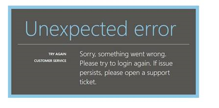
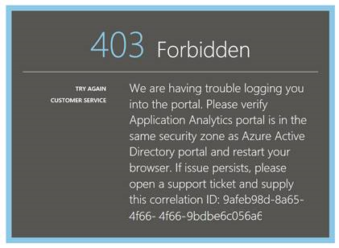
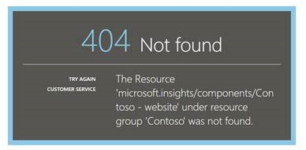
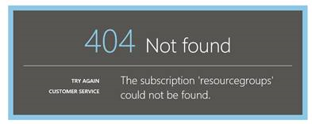

<properties 
    pageTitle="Risoluzione dei problemi Analitica - il potente strumento di ricerca di informazioni dettagliate sui applicazione | Microsoft Azure" 
    description="Problemi con analitica approfondimenti applicazione? Iniziare da qui. " 
    services="application-insights" 
    documentationCenter=""
    authors="alancameronwills" 
    manager="douge"/>

<tags 
    ms.service="application-insights" 
    ms.workload="tbd" 
    ms.tgt_pltfrm="ibiza" 
    ms.devlang="na" 
    ms.topic="article" 
    ms.date="07/11/2016" 
    ms.author="awills"/>

# Risolvere i problemi di Analitica nell'applicazione approfondimenti

Problemi con [l'applicazione approfondimenti Analitica](app-insights-analytics.md)? Iniziare da qui. Analitica è lo strumento di ricerca potenti di Visual Studio applicazione approfondimenti.

## Limiti

* Attualmente, i risultati della query sono limitate alla semplicemente più di una settimana di dati precedente.
* Viene eseguito il test nel browser: edizioni più recente di Chrome, bordo e Internet Explorer.

## Estensioni dei browser compatibile noti

* Ghostery

Disabilitare l'estensione o utilizzare un browser diverso.

##"Errore imprevisto"

Errore interno durante l'esecuzione del portale: eccezione non gestita.

* Cancellare la cache del browser. 

## 403... provare a ricaricare

Un tipo di autenticazione correlate errore (durante l'autenticazione o durante la generazione del token di accesso). Il portale, potrebbe essere più possibile recuperare senza modificare le impostazioni del browser.

* Verificare che [i cookie di terze parti siano attivati](#cookies) nel browser. 

## 403... verificare l'area di protezione

Un tipo di autenticazione correlate errore (durante l'autenticazione o durante la generazione del token di accesso). Il portale, potrebbe essere più possibile recuperare senza modificare le impostazioni del browser.

1. Verificare che [i cookie di terze parti siano attivati](#cookies) nel browser. 

2. È stato si utilizza un preferito, segnalibro o collegamento salvato per aprire il portale Analitica? Firma con le credenziali di diverse da quello utilizzato quando si salva il collegamento

2. Provare a utilizzare una finestra del browser in privato/incognito (dopo la chiusura di tutte le finestre di tali). È necessario specificare le credenziali. 

2. Aprire un'altra finestra del browser (normale) e passare alla [Azure](https://portal.azure.com). Eseguire la disconnessione. Aprire il collegamento e accedere usando le credenziali corrette.

2. Gli utenti di bordo e Internet Explorer inoltre possono ottenere questo errore quando attendibili impostazioni non sono supportate.

    Verificare che siano [portale Analitica](https://analytics.applicationinsights.io) e [Azure Active Directory portale](https://portal.azure.com) nella stessa zona di sicurezza:

 * In Internet Explorer, aprire **Opzioni Internet**, **sicurezza**, **siti attendibili**, **siti**:

    

    Nell'elenco dei siti Web se uno degli URL seguenti sono incluso, assicurarsi che gli altri sono inclusi anche:

    https://Analytics.applicationinsights.IO 
   https://Login.microsoftonline.com 
   https://Login.Windows.NET

## 404... Risorsa non trovata

Risorsa dell'applicazione è stata eliminata dall'applicazione approfondimenti e non è più disponibile. Questo problema può verificarsi se si è salvato l'URL per la pagina Analitica.

## 403... Nessuna autorizzazione

Non si ha l'autorizzazione per aprire l'applicazione in Analitica.

* Viene visualizzato il collegamento da un altro utente Chiedere di verificare che ci si trova l' [utilità per la lettura o i collaboratori di questo gruppo di risorse](app-insights-resources-roles-access-control.md).
* È stato salvato il collegamento utilizzando credenziali diverse? Aprire il [portale di Azure](https://portal.azure.com), eseguire la disconnessione e riprovare a questo collegamento, fornire le credenziali corrette.

## 403... Spazio di archiviazione HTML5

Portale Usa sessionStorage e localStorage HTML5.

* Chrome: Impostazioni di privacy, impostazioni di contenuto.
* Internet Explorer: Opzioni Internet, scheda Avanzate, sicurezza, abilitare l'archiviazione DOM

## 404... Sottoscrizione non trovata

L'URL non è valido. 

* Aprire la risorsa app nel [portale di informazioni approfondite dell'applicazione](https://portal.azure.com). Usare quindi il pulsante Analitica.

## … 404 pagina non esiste

L'URL non è valido.

* Aprire la risorsa app nel [portale di informazioni approfondite dell'applicazione](https://portal.azure.com). Usare quindi il pulsante Analitica.

## Abilitare i cookie di terze parti

  Informazioni su [come disabilitare i cookie di terze parti](http://www.digitalcitizen.life/how-disable-third-party-cookies-all-major-browsers), ma si noti che sono necessarie per **abilitare** .

## Se non si riesce    

[Contatta Microsoft](app-insights-get-dev-support.md).
 
[AZURE.INCLUDE [app-insights-analytics-footer](../../includes/app-insights-analytics-footer.md)]

