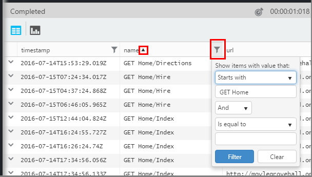
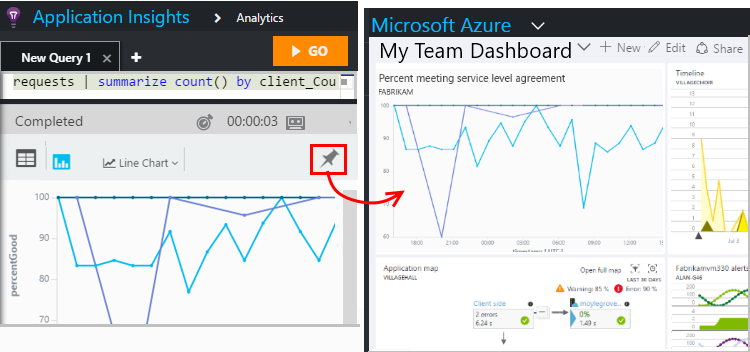

<properties 
    pageTitle="Uso Analitica - il potente strumento di ricerca di informazioni dettagliate sui applicazione | Microsoft Azure" 
    description="Utilizzo di Analitica, lo strumento di ricerca di diagnostica potente strumento di applicazione approfondimenti. " 
    services="application-insights" 
    documentationCenter=""
    authors="danhadari" 
    manager="douge"/>

<tags 
    ms.service="application-insights" 
    ms.workload="tbd" 
    ms.tgt_pltfrm="ibiza" 
    ms.devlang="na" 
    ms.topic="article" 
    ms.date="10/21/2016" 
    ms.author="awills"/>

# Utilizzo di Analitica in applicazione approfondimenti

[Analitica](app-insights-analytics.md) è la funzionalità di ricerca potenti di [Informazioni approfondite dell'applicazione](app-insights-overview.md). Queste pagine descrivono il linguaggio di query Analitica.

* **[Guardare il video introduttivo](https://applicationanalytics-media.azureedge.net/home_page_video.mp4)**.
* **[Unità di test Analitica il nostro simulata dati](https://analytics.applicationinsights.io/demo)** se l'app non invia dati a informazioni dettagliate sui applicazione ancora.

## Apri Analitica

Dalla risorsa iniziale dell'app in applicazione approfondimenti, fare clic su Analitica.

Esercitazione in linea fornisce alcuni suggerimenti sulle operazioni che è possibile eseguire.

Esiste un [tour più ampio di seguito](app-insights-analytics-tour.md).

## Il telemetria della query

### Scrivere una query

Iniziare con i nomi delle tabelle elencate sulla sinistra (o gli operatori di [intervallo](app-insights-analytics-reference.md#range-operator) o [unione](app-insights-analytics-reference.md#union-operator) ). Usare `|` per creare una pipeline di [operatori](app-insights-analytics-reference.md#queries-and-operators). Viene richiesto con gli operatori e alcuni degli elementi dell'espressione che è possibile usare.

Vedere la [Panoramica language Analitica](app-insights-analytics-tour.md) e [riferimento](app-insights-analytics-reference.md).

### Eseguire una query

1. È possibile utilizzare le interruzioni di riga in una query.
2. Posizionare il cursore all'interno o all'estremità della query che si desidera eseguire.
3. Fare clic su Vai per eseguire la query.
4. Non inserire righe vuote nella query. È possibile mantenere più query separati da una scheda query separandole con righe vuote. Viene eseguita solo con il cursore.

### Salvare una query

1. Salvare il file di query corrente.
2. Aprire un file salvato.
3. Creare un nuovo file di query.

## Visualizzare i dettagli

Espandere una riga qualsiasi nei risultati per visualizzare l'elenco completo delle proprietà. È possibile espandere ulteriormente qualsiasi proprietà che è un valore strutturato, ad esempio, dimensioni personalizzate o stack voce un'eccezione.

 

## Consente di ordinare i risultati

È possibile ordinare, filtrare, impaginazione e raggruppare i risultati restituiti dalla query.

> [AZURE.NOTE] Ordinamento, raggruppamento e filtro nel browser non eseguire nuovamente la query. Sono solo ridisporre i risultati restituiti da una query ultima. 
> 
> Per eseguire le operazioni seguenti nel server prima che i risultati vengono restituiti, scrivere la query con gli operatori di [ordinamento](app-insights-analytics-reference.md#sort-operator), [riepilogare](app-insights-analytics-reference.md#summarize-operator) e [posizione](app-insights-analytics-reference.md#where-operator) .

Selezionare le colonne che si desidera visualizzare, trascinare le intestazioni di colonna per riordinarli e ridimensionare le colonne trascinandone i bordi.

### Ordinare e filtrare elementi

Ordinare i risultati, fare clic su inizio di una colonna. Fare clic su Nuovo per ordinare in altro modo e fare clic su una terza per ripristinare l'ordinamento originale restituiti da una query.

Usare l'icona del filtro per restringere la ricerca.

### Raggruppare gli elementi

Per ordinare in base a più colonne, utilizzare il raggruppamento. Prima di tutto attivare e quindi trascinare le intestazioni di colonna nello spazio sopra la tabella.

### Non è presente tra i risultati?

È previsto un limite di circa 10 righe k sui risultati restituiti dal portale. Un messaggio di avviso viene visualizzato se si passa il limite. In tal caso, i risultati nella tabella di ordinamento non sempre Mostra tutto i primo o l'ultimi risultati effettivi. 

È consigliabile evitare di raggiungere il limite. Utilizzare gli operatori ad esempio:

* [dove timestamp > ago(3d)](app-insights-analytics-reference.md#where-operator)
* [primi 100 per timestamp](app-insights-analytics-reference.md#top-operator) 
* [richiedere 100](app-insights-analytics-reference.md#take-operator)
* [riepilogare](app-insights-analytics-reference.md#summarize-operator) 

## Diagrammi

Selezionare il tipo di diagramma desiderato:

Se si dispone di più colonne dei tipi di destra, è possibile scegliere la x e y assi e una colonna di dimensioni per dividere i risultati in base.

Per impostazione predefinita, i risultati vengono visualizzati inizialmente come una tabella e si seleziona il diagramma manualmente. Ma è possibile utilizzare [il rendering delle direttiva](app-insights-analytics-reference.md#render-directive) alla fine di una query per selezionare un diagramma.

## Aggiungere al dashboard

È possibile aggiungere un diagramma o tabella a uno dei [Dashboard condiviso](app-insights-dashboards.md) - solo fare clic sul pin. (Si potrebbe essere necessario [aggiornare che l'app del prezzi pacchetto](app-insights-pricing.md) attivare questa caratteristica.) 

Ciò significa che, quando si crea un dashboard che consentono di eseguire il monitoraggio delle prestazioni o l'uso dei servizi web, è possibile includere molto complessa analisi insieme a altre metriche. 

È possibile aggiungere una tabella al dashboard, se dispone di un massimo di quattro colonne. Vengono visualizzate solo le prime sette righe.

#### Aggiornamento dei dashboard

Il grafico aggiunto al dashboard verrà aggiornato automaticamente eseguendo nuovamente la query circa ogni mezz'ora.

#### Semplificazione automatici

In alcuni casi, determinati semplificazione vengono applicate a un grafico quando si aggiunge un dashboard.

Quando si pin di un grafico che visualizza numerose bin distinti (in genere un grafico a barre), i bin meno popolati automaticamente sono raggruppate in un unico "altri" bin. Ad esempio, questa query:

    requests | summarize count_search = count() by client_CountryOrRegion

in Analitica, è simile alla seguente:

ma quando si aggiunge in un dashboard, avrà l'aspetto seguente:

## Esporta in Excel

Dopo aver eseguito una query, è possibile scaricare un file CSV. Fare clic su **Esporta in Excel**.

## Esportare in Power BI

Posizionare il cursore in una query e scegliere **Esporta in Power BI**.

Si esegue la query in Power BI. È possibile impostarlo per l'aggiornamento di una programmazione.

Con Power BI, è possibile creare dashboard che combinano i dati da una vasta gamma di origini.

[Altre informazioni sull'esportazione di Power BI](app-insights-export-power-bi.md)

[AZURE.INCLUDE [app-insights-analytics-footer](../../includes/app-insights-analytics-footer.md)]

