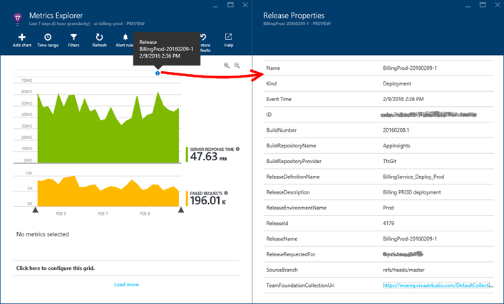

<properties
    pageTitle="Rilasciare le annotazioni per informazioni dettagliate sui applicazione | Microsoft Azure"
    description="Aggiunta di distribuzione o creare indicatori per i grafici di explorer metriche nell'applicazione approfondimenti."
    services="application-insights"
    documentationCenter=".net"
    authors="alancameronwills"
    manager="douge"/>

<tags
    ms.service="application-insights"
    ms.workload="tbd"
    ms.tgt_pltfrm="ibiza"
    ms.devlang="na"
    ms.topic="article"
    ms.date="06/28/2016"
    ms.author="awills"/>

# Rilasciare annotazioni nell'applicazione approfondimenti

Rilasciare annotazioni in [Esplora risorse metriche](app-insights-metrics-explorer.md) grafici vengono visualizzati in cui è stato distribuito una nuova compilazione. Semplificano le operazioni verificare se le modifiche ha alcun effetto sulle prestazioni dell'applicazione. Possono essere creati automaticamente da [Visual Studio Team Services creare sistema](https://www.visualstudio.com/en-us/get-started/build/build-your-app-vs)ed è anche possibile [creare direttamente dal PowerShell](#create-annotations-from-powershell).

Annotazioni di rilascio sono una caratteristica di compilazione basate su cloud e rilasciare servizio di Visual Studio Team Services. 

## Installare l'estensione annotazioni (una volta)

Per creare le annotazioni di rilascio, è necessario installare una delle estensioni del servizio di Team molti disponibile sul mercato Visual Studio.

1. Accedere al progetto di [Visual Studio Team Services](https://www.visualstudio.com/en-us/get-started/setup/sign-up-for-visual-studio-online) .
2. In Visual Studio Marketplace, [ottenere l'estensione di rilascio annotazioni](https://marketplace.visualstudio.com/items/ms-appinsights.appinsightsreleaseannotations)e aggiungerlo al proprio account Team Services.

È sufficiente ripetere l'operazione una sola volta per l'account di Visual Studio Team Services. Annotazioni di rilascio ora possono essere configurate per qualsiasi progetto nel proprio account. 

## È possibile ottenere una chiave dell'API dall'applicazione approfondimenti

È necessario ripetere l'operazione per ogni modello di versione che si desidera creare annotazioni di rilascio.

1. Accedere al [Portale di Microsoft Azure](https://portal.azure.com) e aprire la risorsa approfondimenti applicazione che esegue il monitoraggio dell'applicazione. In alternativa, [crearne uno a questo punto](app-insights-overview.md), se non è fatto ancora.
2. Aprire **API Access**e infine scattare una copia **dell'Applicazione approfondimenti Id**.

    

2. In una finestra separata del browser, aprire o creare il modello di rilascio che gestisce le distribuzioni da Visual Studio Team Services. 

    Aggiungere un'attività e selezionare l'attività di applicazione approfondimenti Release annotazione dal menu di scelta.

    Incollare l' **Id dell'applicazione** copiato da e l'accesso API.

    

3. Impostare il campo **APIKey** a una variabile `$(ApiKey)`.

4. Nuovo in e il API Access, creare una nuova chiave dell'API e richiedere una copia.

    

4. Aprire la scheda Configurazione del modello di rilascio.

    Creare una definizione di variabili per `ApiKey`.

    Incollare la chiave dell'API per la definizione della variabile ApiKey.

    

5. Infine, **salvare** la definizione di rilascio.

## Creare le annotazioni da PowerShell

È anche possibile creare annotazioni da qualsiasi processo che si è soddisfatti (senza utilizzare Visual Studio Team System). 

È possibile ottenere [uno script di Powershell da GitHub](https://github.com/Microsoft/ApplicationInsights-Home/blob/master/API/CreateReleaseAnnotation.ps1).

Da usare come segue:

    .\CreateReleaseAnnotation.ps1 `
      -applicationId "<applicationId>" `
      -apiKey "<apiKey>" `
      -releaseName "<myReleaseName>" `
      -releaseProperties @{
          "ReleaseDescription"="a description";
          "TriggerBy"="My Name" }

Ottenere il `applicationId` e un `apiKey` dalla risorsa applicazione Approfondimenti: Apri impostazioni, l'accesso API e copiare l'ID di applicazione. Quindi fare clic su Crea chiave dell'API e copiare il codice. 

## Rilasciare annotazioni

A questo punto, ogni volta che si usa il modello di rilascio per distribuire una nuova versione, verrà inviata un'annotazione a informazioni dettagliate sui applicazione. Le annotazioni verranno visualizzati nei grafici in Esplora metriche.

Fare clic su un indicatore di annotazione per aprire i dettagli di versione, tra cui richiedente, ramo del controllo origine, rilasciare definizione, ambiente e altro.

