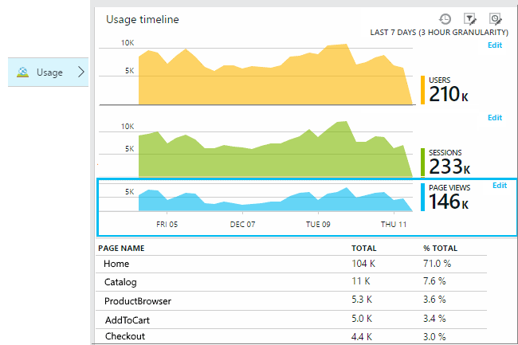
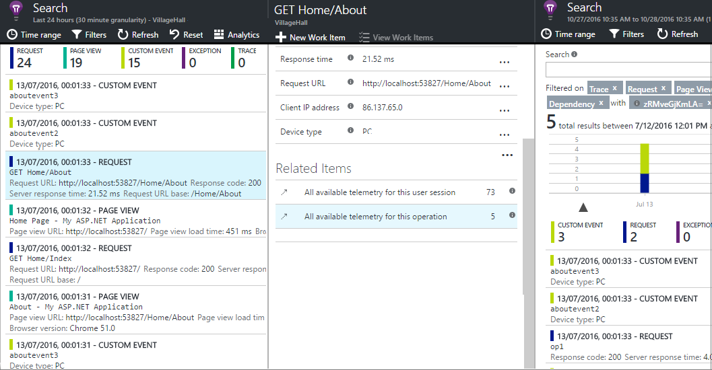
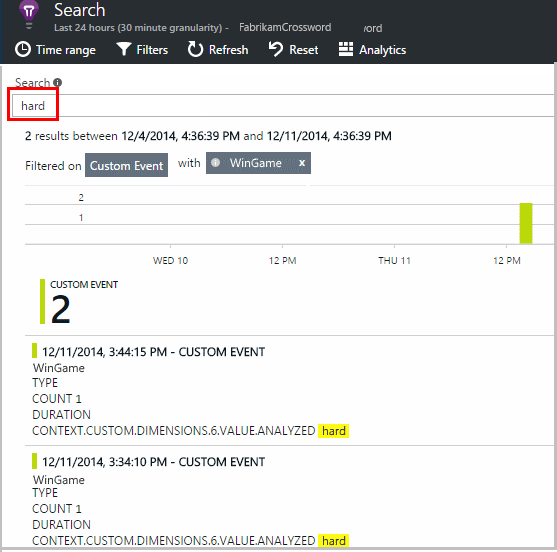

<properties 
    pageTitle="Applicazione approfondimenti API per eventi personalizzati e metriche | Microsoft Azure" 
    description="Inserire alcune righe di codice nel dispositivo o desktop app, pagina web o servizio per tenere traccia dell'utilizzo e diagnosticare i problemi." 
    services="application-insights"
    documentationCenter="" 
    authors="alancameronwills" 
    manager="douge"/>
 
<tags 
    ms.service="application-insights" 
    ms.workload="tbd" 
    ms.tgt_pltfrm="ibiza" 
    ms.devlang="multiple" 
    ms.topic="article" 
    ms.date="10/19/2016" 
    ms.author="awills"/>

# <a name="application-insights-api-for-custom-events-and-metrics"></a>Applicazione approfondimenti API per metriche ed eventi personalizzati 

*Informazioni dettagliate sui applicazione è in anteprima.*

Inserire alcune righe di codice nell'applicazione per sapere quali utenti stanno facendo usarli o di diagnosticare i problemi. È possibile inviare telemetria dal dispositivo e desktop e applicazioni, i client web e server web. Di telemetria di core [Visual Studio applicazione approfondimenti](app-insights-overview.md) API consente di inviare eventi personalizzati e metriche e il proprio versioni di telemetria standard. Questa API è la stessa API utilizzato per il raccolta di dati approfondimenti applicazione standard.

## <a name="api-summary"></a>Riepilogo API

L'API è uniforme in tutte le piattaforme, ad eccezione di alcune variazioni di piccole dimensioni.

Metodo | Usato per
---|---
[`TrackPageView`](#page-views) | Pagine, le schermate, pale o moduli
[`TrackEvent`](#track-event) | Azioni dell'utente e altri eventi. Utilizzato per tenere traccia di comportamento degli utenti o per eseguire il monitoraggio delle prestazioni.
[`TrackMetric`](#track-metric) | Misurazioni delle prestazioni, ad esempio lunghezze di coda non correlate a eventi specifici
[`TrackException`](#track-exception)|Registrare le eccezioni per la diagnosi. Tenere traccia in cui si verificano in relazione ad altri eventi ed esaminare le tracce dello stack.
[`TrackRequest`](#track-request)| Registrare la frequenza e durata delle richieste del server per l'analisi delle prestazioni.
[`TrackTrace`](#track-trace)|Messaggi di log diagnostici. È inoltre possibile acquisire i registri di terze parti 3o.
[`TrackDependency`](#track-dependency)|Registrare la durata e frequenza delle chiamate di componenti esterni da cui dipende l'app.

È possibile [collegare le proprietà e metriche](#properties) alla maggior parte delle chiamate telemetria. 


## <a name="prep"></a>Prima di iniziare

Se si è già fatto ancora seguenti:

* Aggiungere al progetto SDK approfondimenti di applicazione:
 * [Progetto ASP.NET][greenbrown]
 * [Progetto Java][java] 
 * [JavaScript in ogni pagina web][client]   

* Nel codice server web o dispositivo, includono:

    *C#:*`using Microsoft.ApplicationInsights;`

    *VB:*`Imports Microsoft.ApplicationInsights`

    *Linguaggio:*`import com.microsoft.applicationinsights.TelemetryClient;`

## <a name="construct-a-telemetryclient"></a>Creare un TelemetryClient

Creare un'istanza di TelemetryClient (ad eccezione che in JavaScript nelle pagine web):

*C#:* 

    private TelemetryClient telemetry = new TelemetryClient();

*AGGIORNARE L'ALBUM:* 

    Private Dim telemetry As New TelemetryClient

*Java*

    private TelemetryClient telemetry = new TelemetryClient();

TelemetryClient è affidabile.

È consigliabile utilizzare un'istanza di `TelemetryClient` per ogni modulo dell'app. Ad esempio, potrebbe essere uno `TelemetryClient` del servizio web per segnalare posta in arrivo richieste http e un altro in una classe middleware al eventi di logica aziendale di report. È possibile impostare proprietà, ad esempio `TelemetryClient.Context.User.Id` per tenere traccia di utenti e sessioni, o `TelemetryClient.Context.Device.Id` consente di identificare il computer. Queste informazioni sono collegate a tutti gli eventi inviati dall'istanza di.


## <a name="track-event"></a>Traccia eventi

In applicazione approfondimenti, un *evento personalizzato* è un dato che è possibile visualizzare sia in [Esplora metriche] [ metrics] come conteggio aggregato, nonché come singole occorrenze nella [Ricerca diagnostica][diagnostic]. (Non è correlata a MVC o altri framework "eventi.") 

Inserire le chiamate TrackEvent nel codice per contare quante volte si scegliere una particolare caratteristica, con quale frequenza che è possibile ottenere obiettivi specifici, gli utenti o cercando effettuare particolari tipi di errore. 

Ad esempio, in un'app gioco, inviare un evento ogni volta che un utente vince il gioco: 

*JavaScript*

    appInsights.trackEvent("WinGame");

*C#*
    
    telemetry.TrackEvent("WinGame");

*VISUAL BASIC*


    telemetry.TrackEvent("WinGame")

*Java*

    telemetry.trackEvent("WinGame");


### <a name="view-your-events-in-the-azure-portal"></a>Visualizzare gli eventi nel portale di Azure

Per visualizzare un conteggio degli eventi, aprire una pala [Explorer unità di misura metriche](app-insights-metrics-explorer.md) , aggiungere un nuovo grafico e selezionare gli eventi.  


Per confrontare i conteggi dei diversi eventi, impostare il tipo di grafico griglia e il gruppo dal nome evento:


Nella griglia, fare clic su tramite il nome di un evento per visualizzare singole occorrenze dell'evento.


Fare clic su qualsiasi occorrenza per visualizzare ulteriori dettagli.

Per concentrarsi su eventi specifici per ricerche o unità di misura metriche Explorer, impostare filtro del e il per i nomi degli eventi che si è interessati a:


## <a name="track-metric"></a>Tenere traccia delle unità di misura metriche

Utilizzare TrackMetric per inviare la metrica che non è associata a determinati eventi. Ad esempio, è possibile monitorare una lunghezza coda a intervalli regolari. 

Metriche vengono visualizzate come grafici statistici in Esplora metrica, ma a differenza di eventi, non è possibile cercare singole occorrenze nella ricerca diagnostica.

I valori metrici dovrebbero essere > = 0 per visualizzare correttamente.


*JavaScript*

    appInsights.trackMetric("Queue", queue.Length);

*C#*

    telemetry.TrackMetric("Queue", queue.Length);

*VISUAL BASIC*

    telemetry.TrackMetric("Queue", queue.Length)

*Java*

    telemetry.trackMetric("Queue", queue.Length);

Infatti, è possibile farlo in un thread in background:

*C#*

    private void Run() {
     var appInsights = new TelemetryClient();
     while (true) {
      Thread.Sleep(60000);
      appInsights.TrackMetric("Queue", queue.Length);
     }
    }


Per visualizzare i risultati, aprire Esplora metriche e aggiungere un nuovo grafico. Impostare questa opzione per visualizzare l'unità di misura.


Esistono alcuni [limiti al numero di metriche](#limits) è possibile utilizzare.

## <a name="page-views"></a>Visualizzazioni di una pagina

In un dispositivo o pagina web app, telemetria visualizzazione pagina viene inviato per impostazione predefinita quando viene caricata ogni schermo o della pagina. Ma è possibile modificarlo per tenere traccia delle visualizzazioni pagina momenti aggiuntive o diverso. Ad esempio, in un'applicazione che consente di visualizzare le schede o blade, è consigliabile tenere traccia di una pagina di"" ogni volta che si apre una nuova pala. 



Dati utente e sessione vengono inviati come proprietà insieme visualizzazioni delle pagine in modo che i grafici utente e sessione recapitata attivi in caso di telemetria di visualizzazione pagina.

#### <a name="custom-page-views"></a>Visualizzazioni di pagina personalizzati

*JavaScript*

    appInsights.trackPageView("tab1");

*C#*

    telemetry.TrackPageView("GameReviewPage");

*VISUAL BASIC*

    telemetry.TrackPageView("GameReviewPage")


Se si dispone di più schede all'interno delle diverse pagine HTML, è possibile specificare l'URL troppo:

    appInsights.trackPageView("tab1", "http://fabrikam.com/page1.htm");

#### <a name="timing-page-views"></a>Visualizzazioni pagina intervallo

Per impostazione predefinita, i tempi segnalati come "Fase di caricamento pagina visualizzazione" vengono misurate da quando il browser invia la richiesta, finché non viene chiamato evento di caricamento della pagina del browser.

Se, tuttavia, è possibile:

* Impostare una durata esplicita nella chiamata [trackPageView](https://github.com/Microsoft/ApplicationInsights-JS/blob/master/API-reference.md#trackpageview) .
 * `appInsights.trackPageView("tab1", null, null, null, durationInMilliseconds);`
* Utilizzare la visualizzazione della pagina intervalli chiamate `startTrackPage` e `stopTrackPage`.

*JavaScript*

    // To start timing a page:
    appInsights.startTrackPage("Page1");

... 

    // To stop timing and log the page:
    appInsights.stopTrackPage("Page1", url, properties, measurements);

Il nome viene utilizzata come primo parametro associa le chiamate di inizio e fine. Viene utilizzato il nome della pagina corrente. 

La durata di caricamento pagina risultante visualizzata in unità di misura metriche soluzioni è derivata dall'intervallo tra le chiamate di inizio e fine. Dipende da si quali intervallo effettivamente ora.

## <a name="track-request"></a>Richiesta di traccia

Utilizzata dal server SDK registrare le richieste HTTP. 

È inoltre possibile chiamarlo personalmente se si desidera simulare le richieste in un contesto in cui non si dispone del modulo esecuzione il servizio web.

*C#*

    // At start of processing this request:

    // Operation Id and Name are attached to all telemetry and help you identify
    // telemetry associated with one request:
    telemetry.Context.Operation.Id = Guid.NewGuid().ToString();
    telemetry.Context.Operation.Name = requestName;
    
    var stopwatch = System.Diagnostics.Stopwatch.StartNew();

    // ... process the request ...

    stopwatch.Stop();
    telemetry.TrackRequest(requestName, DateTime.Now,
       stopwatch.Elapsed, 
       "200", true);  // Response code, success


## <a name="operation-context"></a>Contesto di operazione

Gli elementi di telemetria possono associati tra loro tramite il collegamento a tali un ID operazione comuni. Richiesta standard verifica modulo responsabile per le eccezioni e altri eventi inviati durante l'elaborazione di una richiesta HTTP. Nella [casella di ricerca](app-insights-diagnostic-search.md) e [Analitica](app-insights-analytics.md), è possibile utilizzare l'ID per trovare facilmente tutti gli eventi associati alla richiesta. 

Il modo più semplice per impostare l'ID è impostato un contesto di operazione utilizzando questo modello:

    // Establish an operation context and associated telemetry item:
    using (var operation = telemetry.StartOperation<RequestTelemetry>("operationName"))
    {
        // Telemetry sent in here will use the same operation ID.
        ...
        telemetry.TrackEvent(...); // or other Track* calls
        ...
        // Set properties of containing telemetry item - for example:
        operation.Telemetry.ResponseCode = "200";
        
        // Optional: explicitly send telemetry item:
        telemetry.StopOperation(operation);

    } // When operation is disposed, telemetry item is sent.

Oltre al tipo di impostazione di un contesto dell'operazione, `StartOperation` crea un elemento di telemetria di tipo specificare e invia quando si elimina l'operazione o se si chiama in modo esplicito `StopOperation`. Se si usa `RequestTelemetry` come tipo di telemetria, quindi la durata è impostata per l'intervallo di tempo tra inizio e fine.

Contesti di operazione non possono essere annidati. Se è già presente un contesto dell'operazione, l'ID è associata a tutti gli elementi contenuti, inclusi gli elementi creati con StartOperation.

Risultati di ricerca, il contesto dell'operazione viene utilizzato per creare l'elenco di elementi correlati:




## <a name="track-exception"></a>Tenere traccia di eccezione

Inviare le eccezioni a informazioni dettagliate sui applicazione: per [conteggiare][metrics], come l'indicazione della frequenza di un problema. ed esaminare [occorrenze singole][diagnostic]. I report includono le analisi dello stack.

*C#*

    try
    {
        ...
    }
    catch (Exception ex)
    {
       telemetry.TrackException(ex);
    }

*JavaScript*

    try
    {
       ...
    }
    catch (ex)
    {
       appInsights.trackException(ex);
    }

Gli SDK eccezioni molti automaticamente, in modo che non è sempre necessario chiamare TrackException in modo esplicito.

* ASP.NET: [scrivere codice le eccezioni](app-insights-asp-net-exceptions.md)
* J2EE: [le eccezioni vengono rilevate automaticamente](app-insights-java-get-started.md#exceptions-and-request-failures)
* JavaScript: Rilevata automaticamente. Se si vuole disabilitare la raccolta automatica, aggiungere una riga nel frammento di codice inserito nelle pagine web:

    ```
    ({
      instrumentationKey: "your key"
      , disableExceptionTracking: true
    })
    ```


## <a name="track-trace"></a>Tenere traccia di analisi 

Consente di diagnosticare i problemi di inviando 'indicazione del' a informazioni dettagliate sui applicazione. È possibile inviare blocchi di dati di diagnostica e li esaminare nella [ricerca diagnostica][diagnostic]. 

 

[Accedere schede] [ trace] utilizzarla per inviare i registri di terze parti al portale.


*C#*

    telemetry.TrackTrace(message, SeverityLevel.Warning, properties);


È possibile eseguire ricerche nel contenuto del messaggio, ma (a differenza dei valori di proprietà) non è possibile filtrare su di esso.

Le dimensioni massime consentite nel `message` è molto superiori a limite su proprietà.
Il vantaggio di TrackTrace è che è possibile inserire dati relativamente lunghi nel messaggio. Ad esempio, si potrebbero codificare sono i dati di POST.  


Inoltre, è possibile aggiungere un livello di gravità al messaggio. E, ad esempio altri telemetria, è possibile aggiungere i valori di proprietà che è possibile utilizzare per filtrare o per la ricerca per diversi set di tracce. Per esempio:


    var telemetry = new Microsoft.ApplicationInsights.TelemetryClient();
    telemetry.TrackTrace("Slow database response",
                   SeverityLevel.Warning,
                   new Dictionary<string,string> { {"database", db.ID} });

In questo modo, in [ricerca][diagnostic], per applicare un filtro con facilità tutti i messaggi di un livello particolare gravità relative a un determinato database.

## <a name="track-dependency"></a>Tenere traccia delle dipendenze

Utilizzare questa chiamata per controllare i tempi di risposta e percentuali di successo di chiamate a una parte di codice esterna. I risultati verranno visualizzati nei grafici dipendenza nel portale. 

```C#

            var success = false;
            var startTime = DateTime.UtcNow;
            var timer = System.Diagnostics.Stopwatch.StartNew();
            try
            {
                success = dependency.Call();
            }
            finally
            {
                timer.Stop();
                telemetry.TrackDependency("myDependency", "myCall", startTime, timer.Elapsed, success);
            }
```

Tenere presente che il server che SDK includere un [modulo di dipendenza](app-insights-dependencies.md) che consente di individuare e registra determinato dipendenza le chiamate automaticamente, ad esempio al database e le API REST. È necessario installare un agente nel server per l'utilizzo del modulo. Utilizzare questa chiamata se si desidera tenere traccia delle chiamate che non rientrano di rilevamento automatico o se non si vuole installare l'agente.

Per disattivare il modulo di verifica dipendenze standard, modificare [ApplicationInsights.config](app-insights-configuration-with-applicationinsights-config.md) ed eliminare il riferimento alla `DependencyCollector.DependencyTrackingTelemetryModule`.


## <a name="flushing-data"></a>Trasferimento dei dati

In genere il SDK invia dati a volte scelti per ridurre l'impatto sull'utente. Tuttavia, in alcuni casi è consigliabile svuotare il buffer - ad esempio, se si utilizza il SDK in un'applicazione che viene chiuso.

*C#*

    telemetry.Flush();

    // Allow some time for flushing before shutdown.
    System.Threading.Thread.Sleep(1000);

Si noti che la funzione asincrono per il [canale di telemetria di server](https://www.nuget.org/packages/Microsoft.ApplicationInsights.WindowsServer.TelemetryChannel/), ma l'icona del se si sceglie di usare il canale in memoria o [canale persistente](app-insights-api-filtering-sampling.md#persistence-channel).


## <a name="authenticated-users"></a>Utenti autenticati

In un'app web, gli utenti sono per impostazione predefinita identificato dal cookie. Un utente può conteggiato più volte se accedere l'app da un altro computer o browser o eliminare i cookie. 

Ma se gli utenti non accedere all'app, è possibile ottenere un conteggio accurato impostando l'id utente autenticato nel codice del browser:

*JavaScript*

```JS
    // Called when my app has identified the user.
    function Authenticated(signInId) {
      var validatedId = signInId.replace(/[,;=| ]+/g, "_");
      appInsights.setAuthenticatedUserContext(validatedId);
      ...
    }
```

In un web ASP.NET applicazione MVC, ad esempio:

*Razor*

        @if (Request.IsAuthenticated)
        {
            <script>
                appInsights.setAuthenticatedUserContext("@User.Identity.Name
                   .Replace("\\", "\\\\")"
                   .replace(/[,;=| ]+/g, "_"));
            </script>
        }

Non è necessario utilizzare il nome dell'utente effettivo accesso. Solo deve essere un id univoco per tale utente. Non deve includere spazi o i caratteri `,;=|`. 

L'id utente è inoltre configurare in un cookie sessione e inviato al server. Se è installato il server SDK, l'id utente autenticato viene inviato come parte delle proprietà del contesto di telemetria di client e server, in modo che è possibile filtrare e cercare su di esso.

Se l'app di gruppi di utenti in account, è anche possibile passare un identificatore per l'account (con restrizioni di carattere stesso).


      appInsights.setAuthenticatedUserContext(validatedId, accountId);

In [Esplora risorse metriche](app-insights-metrics-explorer.md), è possibile creare un grafico che esegue il conteggio **autenticato, gli utenti** e **gli account utente**. 

È inoltre possibile [ricerca] [ diagnostic] delle coordinate client con nomi di utenti specifici e account.

## <a name="properties"></a>Filtrare, eseguire una ricerca e segmento i dati con il comando proprietà

È possibile collegare gli eventi di proprietà e le misure (e anche a metriche, pagina visualizzazioni, le eccezioni e altri dati di telemetria).

**Proprietà** sono valori stringa che è possibile utilizzare per filtrare le telemetria di report di utilizzo. Ad esempio se l'app fornisce diversi giochi, verrà da allegare il nome del gioco a ogni evento, in modo che è possibile visualizzare le Olimpiadi sono più popolari. 

È previsto un limite di circa 1k della lunghezza. (Se si desidera inviare grandi quantità di dati, utilizzare il parametro di messaggio di [TrackTrace](#track-trace).)

**Sono valori numerici che possono essere presentati graficamente.** Ad esempio, è consigliabile controllare se è presente un aumento graduale nel punteggi che ottenere i giocatori. I grafici possono essere segmentati dalle proprietà inviate con l'evento, in modo che è possibile ottenere separato o a barre in pila grafici per Olimpiadi diversi.

I valori metrici dovrebbero essere > = 0 per visualizzare correttamente.


Esistono alcuni [limiti al numero di proprietà, valori di proprietà e metriche](#limits) che è possibile usare.


*JavaScript*

    appInsights.trackEvent
      ("WinGame",
         // String properties:
         {Game: currentGame.name, Difficulty: currentGame.difficulty},
         // Numeric metrics:
         {Score: currentGame.score, Opponents: currentGame.opponentCount}
         );

    appInsights.trackPageView
        ("page name", "http://fabrikam.com/pageurl.html",
          // String properties:
         {Game: currentGame.name, Difficulty: currentGame.difficulty},
         // Numeric metrics:
         {Score: currentGame.score, Opponents: currentGame.opponentCount}
         );
          

*C#*

    // Set up some properties and metrics:
    var properties = new Dictionary <string, string> 
       {{"game", currentGame.Name}, {"difficulty", currentGame.Difficulty}};
    var metrics = new Dictionary <string, double>
       {{"Score", currentGame.Score}, {"Opponents", currentGame.OpponentCount}};

    // Send the event:
    telemetry.TrackEvent("WinGame", properties, metrics);


*VISUAL BASIC*

    ' Set up some properties:
    Dim properties = New Dictionary (Of String, String)
    properties.Add("game", currentGame.Name)
    properties.Add("difficulty", currentGame.Difficulty)

    Dim metrics = New Dictionary (Of String, Double)
    metrics.Add("Score", currentGame.Score)
    metrics.Add("Opponents", currentGame.OpponentCount)

    ' Send the event:
    telemetry.TrackEvent("WinGame", properties, metrics)


*Java*
    
    Map<String, String> properties = new HashMap<String, String>();
    properties.put("game", currentGame.getName());
    properties.put("difficulty", currentGame.getDifficulty());
    
    Map<String, Double> metrics = new HashMap<String, Double>();
    metrics.put("Score", currentGame.getScore());
    metrics.put("Opponents", currentGame.getOpponentCount());
    
    telemetry.trackEvent("WinGame", properties, metrics);


> [AZURE.NOTE] Prestare particolare attenzione a non per registrare le informazioni personali nelle proprietà.

**Se è stata utilizzata la metrica**, aprire Esplora unità di misura metriche e selezionare l'unità di misura metriche dal gruppo personalizzato:


*Se non viene visualizzata l'unità di misura metriche o il titolo personalizzato non è presente, chiudere e il selezione e riprovare. In alcuni casi può richiedere un'ora per le metriche da aggregare attraverso la pipeline.*

**Se è stata utilizzata proprietà e criteri di misurazione**segmento metrica dalla proprietà:


**In ricerca diagnostica**, è possibile visualizzare le proprietà e metriche delle singole occorrenze di un evento.


Utilizzare il campo di ricerca per visualizzare le occorrenze di evento con un valore specifico della proprietà.




[Ulteriori informazioni sulle espressioni di ricerca][diagnostic].

#### <a name="alternative-way-to-set-properties-and-metrics"></a>Alternativa, per impostare le proprietà e criteri di misurazione

Se è più comodo, è possibile raccogliere i parametri di un evento in un oggetto separato:

    var event = new EventTelemetry();

    event.Name = "WinGame";
    event.Metrics["processingTime"] = stopwatch.Elapsed.TotalMilliseconds;
    event.Properties["game"] = currentGame.Name;
    event.Properties["difficulty"] = currentGame.Difficulty;
    event.Metrics["Score"] = currentGame.Score;
    event.Metrics["Opponents"] = currentGame.Opponents.Length;

    telemetry.TrackEvent(event);

> [AZURE.WARNING] Non riutilizzare la stessa istanza dell'elemento di telemetria (`event` in questo esempio) chiamare Track*() più volte. Potrebbero verificarsi telemetria da inviare con una configurazione non corretta.


## <a name="timed"></a>Eventi di tempo

Può succedere che si desidera grafico tempo impiegato per eseguire un'azione. Ad esempio, si desideri sapere quanto tempo utenti prendere in considerazione scelte in un gioco. Si tratta di un esempio di utilizzo del parametro misura utile.


*C#*

    var stopwatch = System.Diagnostics.Stopwatch.StartNew();

    // ... perform the timed action ...

    stopwatch.Stop();

    var metrics = new Dictionary <string, double>
       {{"processingTime", stopwatch.Elapsed.TotalMilliseconds}};

    // Set up some properties:
    var properties = new Dictionary <string, string> 
       {{"signalSource", currentSignalSource.Name}};

    // Send the event:
    telemetry.TrackEvent("SignalProcessed", properties, metrics);


## <a name="defaults"></a>Proprietà predefinite per telemetria personalizzato

Se si desidera impostare i valori di proprietà predefiniti per alcuni degli eventi personalizzati che si scrivono, è possibile impostare loro un TelemetryClient. Sono collegate a ogni elemento di telemetria inviato da tale client. 

*C#*

    using Microsoft.ApplicationInsights.DataContracts;

    var gameTelemetry = new TelemetryClient();
    gameTelemetry.Context.Properties["Game"] = currentGame.Name;
    // Now all telemetry will automatically be sent with the context property:
    gameTelemetry.TrackEvent("WinGame");
    
*VISUAL BASIC*

    Dim gameTelemetry = New TelemetryClient()
    gameTelemetry.Context.Properties("Game") = currentGame.Name
    ' Now all telemetry will automatically be sent with the context property:
    gameTelemetry.TrackEvent("WinGame")

*Java*

    import com.microsoft.applicationinsights.TelemetryClient;
    import com.microsoft.applicationinsights.TelemetryContext;
    ...


    TelemetryClient gameTelemetry = new TelemetryClient();
    TelemetryContext context = gameTelemetry.getContext();
    context.getProperties().put("Game", currentGame.Name);
    
    gameTelemetry.TrackEvent("WinGame");


    
Le chiamate di telemetria singoli possono ignorare i valori predefiniti nei dizionari di proprietà.

**I client web per JavaScript**, [utilizzare inizializzatori di telemetria JavaScript](#js-initializer).

**Per aggiungere le proprietà di telemetria tutti** inclusi i dati da moduli insieme standard, [implementare `ITelemetryInitializer` ](app-insights-api-filtering-sampling.md#add-properties).


## <a name="sampling-filtering-and-processing-telemetry"></a>Campionamento, filtro e l'elaborazione di telemetria 

È possibile scrivere codice per elaborare i telemetria prima che venga inviato da SDK. L'elaborazione include i dati inviati i moduli di telemetria standard, ad esempio insieme richiesta HTTP e dipendenza insieme.

* [Aggiungi proprietà](app-insights-api-filtering-sampling.md#add-properties) agli telemetria mediante l'implementazione `ITelemetryInitializer` - ad esempio, per aggiungere versione numeri o valori calcolati da altre proprietà. 
* Modificare o eliminare telemetria prima che venga inviato da SDK mediante l'implementazione di [filtro](app-insights-api-filtering-sampling.md#filtering) `ITelemetryProcesor`. È possibile controllare quali venga inviato o eliminate, ma è necessario prendere in considerazione l'effetto sui dati statistici relativi. A seconda di come eliminare gli elementi, si potrebbe perdere la possibilità di spostarsi tra gli elementi correlati.
* [Il campionamento](app-insights-api-filtering-sampling.md#sampling) è una soluzione per ridurre il volume dei dati inviati dell'App al portale. Non senza influenzare le metriche visualizzate e senza influenzare la possibilità di diagnosticare i problemi tramite lo spostamento tra gli elementi correlati, ad esempio eccezioni, le richieste e le visualizzazioni di pagina.

[Ulteriori informazioni](app-insights-api-filtering-sampling.md)


## <a name="disabling-telemetry"></a>La disattivazione di telemetria

Per **interrompere in modo dinamico e avviare** la raccolta e trasmissione di telemetria:

*C#*

```C#

    using  Microsoft.ApplicationInsights.Extensibility;

    TelemetryConfiguration.Active.DisableTelemetry = true;
```

Per **disabilitare raccolta standard selezionato** - ad esempio contatori, le richieste HTTP o dipendenze - eliminare o commento le righe pertinenti in [ApplicationInsights.config][config]. Si può eseguire la verifica, ad esempio, se si desidera inviare i propri dati TrackRequest.

## <a name="debug"></a>Modalità di sviluppo

Durante il debug, è utile disporre le telemetria inviato attraverso la pipeline in modo che è possibile vedere immediatamente i risultati. È inoltre get altri messaggi che consentono di tenere traccia degli eventuali problemi di telemetria. Disattivare produzione, come può rallentare l'app.


*C#*
    
    TelemetryConfiguration.Active.TelemetryChannel.DeveloperMode = true;

*VISUAL BASIC*

    TelemetryConfiguration.Active.TelemetryChannel.DeveloperMode = True


## <a name="ikey"></a>Impostare la chiave strumentazione per telemetria personalizzato selezionato

*C#*
    
    var telemetry = new TelemetryClient();
    telemetry.InstrumentationKey = "---my key---";
    // ...


## <a name="dynamic-ikey"></a>Chiave strumentazione dinamico

Per evitare la combinazione di telemetria da ambienti di sviluppo, test e produzione, è possibile [creare risorse applicazione approfondimenti distinte] [ create] e modificare le chiavi a seconda dell'ambiente.

Invece di essere visualizzato il tasto strumentazione dal file di configurazione, è possibile impostare il nel codice. Impostare la chiave in un metodo di inizializzazione, ad esempio global.aspx.cs in un servizio ASP.NET:

*C#*

    protected void Application_Start()
    {
      Microsoft.ApplicationInsights.Extensibility.
        TelemetryConfiguration.Active.InstrumentationKey = 
          // - for example -
          WebConfigurationManager.Settings["ikey"];
      ...

*JavaScript*

    appInsights.config.instrumentationKey = myKey; 


Nelle pagine web, è consigliabile impostare dal server web, anziché codifica in forma letterale nello script. Ad esempio, in una pagina web generato in un'app ASP.NET:

*JavaScript in Razor*

    <script type="text/javascript">
    // Standard Application Insights web page script:
    var appInsights = window.appInsights || function(config){ ...
    // Modify this part:
    }({instrumentationKey:  
      // Generate from server property:
      @Microsoft.ApplicationInsights.Extensibility.
         TelemetryConfiguration.Active.InstrumentationKey"
    }) // ...


## <a name="telemetrycontext"></a>TelemetryContext

TelemetryClient ha una proprietà di contesto, che contiene un numero di valori che vengono inviati insieme a tutti i dati di telemetria. In genere impostati in base ai moduli di telemetria standard, ma è anche possibile impostare loro se stessi. Per esempio:

    telemetry.Context.Operation.Name = "MyOperationName";

Se si imposta uno di questi valori tra se stessi, provare a rimuovere la riga rilevante da [ApplicationInsights.config][config], in modo che i valori e i valori standard non risultare confuso.

* **Componente** Identifica l'app e la versione
* **Dispositivo** Dati relativi al dispositivo in cui viene eseguito l'app (nelle applicazioni web, è il server o client il dispositivo da cui verrà inviato di telemetria)
* **InstrumentationKey** Identifica la risorsa applicazione approfondimenti in Azure in cui verrà visualizzata la telemetria. In genere ritirare ApplicationInsights.config
* **Posizione** Identifica l'area geografica del dispositivo.
* **Operazione** Nelle applicazioni web, la richiesta HTTP corrente. In altri tipi di app, è possibile configurare questa eventi di gruppo insieme.
 * **ID**: un valore generato che mette in correlazione diversi eventi, in modo che quando si controlla un evento nella ricerca diagnostica, è possibile trovare "elementi correlati"
 * **Nome**: un identificatore, in genere l'URL della richiesta HTTP. 
 * **SyntheticSource**: se non null o vuoto, questa stringa indica che è stato individuato l'origine della richiesta come test robot o web. Per impostazione predefinita verrà esclusi dai calcoli in Esplora metriche.
* **Proprietà** Proprietà che vengono inviate con tutti i dati di telemetria. Possono essere ignorate singoli traccia * chiamate.
* **Sessione** Identifica la sessione dell'utente. L'Id viene impostato su un valore generato, viene modificato quando l'utente non è stato attivo per un po' di tempo.
* **Utente** Informazioni utente. 

## <a name="limits"></a>Limiti


[AZURE.INCLUDE [application-insights-limits](../../includes/application-insights-limits.md)]

*Come è possibile evitare raggiungere il limite della velocità dati?*

* Utilizzare [campioni](app-insights-sampling.md).

*Il periodo di tempo dati da mantenere?*

* Vedere [l'informativa sulla privacy e la conservazione dei dati][data].


## <a name="reference-docs"></a>Documenti di riferimento

* [Guida di riferimento ASP.NET](https://msdn.microsoft.com/library/dn817570.aspx)
* [Guida di riferimento Java](http://dl.windowsazure.com/applicationinsights/javadoc/)
* [Guida di riferimento JavaScript](https://github.com/Microsoft/ApplicationInsights-JS/blob/master/API-reference.md)
* [Android SDK](https://github.com/Microsoft/ApplicationInsights-Android)
* [iOS SDK](https://github.com/Microsoft/ApplicationInsights-iOS)


## <a name="sdk-code"></a>Codice SDK

* [SDK di base di ASP.NET](https://github.com/Microsoft/ApplicationInsights-dotnet)
* [ASP.NET 5](https://github.com/Microsoft/ApplicationInsights-aspnet5)
* [Pacchetti di Windows Server](https://github.com/Microsoft/applicationInsights-dotnet-server)
* [Linguaggio SDK](https://github.com/Microsoft/ApplicationInsights-Java)
* [SDK JavaScript](https://github.com/Microsoft/ApplicationInsights-JS)
* [Tutte le piattaforme](https://github.com/Microsoft?utf8=%E2%9C%93&query=applicationInsights)

## <a name="questions"></a>Domande

* *Le eventuali eccezioni possono generare Track_() chiamate?*
    
    Nessuno. Non è necessario disporre loro in clausole catture di prova. Se il SDK si verificano problemi, verrà registrato i messaggi che verrà visualizzato nell'output della console debug e, nel caso i messaggi di ottenere tramite - nella ricerca diagnostica.


* *Esiste un API REST accesso ai dati dal portale di?*

    Sì, disponibile a breve. Nel frattempo, usare [esportazione continua](app-insights-export-telemetry.md).

## <a name="next"></a>Passaggi successivi


[Ricerca eventi e registri][diagnostic]

[Esempi e procedure dettagliate](app-insights-code-samples.md)

[Risoluzione dei problemi][qna]


<!--Link references-->

[client]: app-insights-javascript.md
[config]: app-insights-configuration-with-applicationinsights-config.md
[create]: app-insights-create-new-resource.md
[data]: app-insights-data-retention-privacy.md
[diagnostic]: app-insights-diagnostic-search.md
[exceptions]: app-insights-asp-net-exceptions.md
[greenbrown]: app-insights-asp-net.md
[java]: app-insights-java-get-started.md
[metrics]: app-insights-metrics-explorer.md
[qna]: app-insights-troubleshoot-faq.md
[trace]: app-insights-search-diagnostic-logs.md

 
