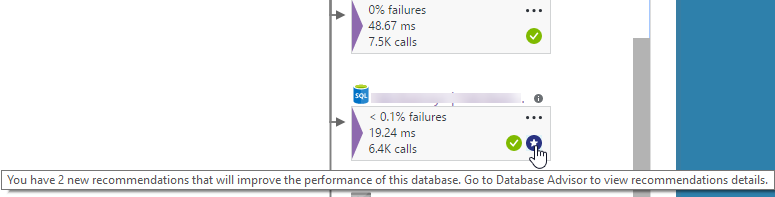

<properties 
    pageTitle="Mapping delle applicazioni in applicazione approfondimenti | Microsoft Azure" 
    description="Una presentazione visiva delle dipendenze tra i componenti di app, contrassegnata con avvisi e indicatori KPI." 
    services="application-insights" 
    documentationCenter=""
    authors="SoubhagyaDash" 
    manager="douge"/>

<tags 
    ms.service="application-insights" 
    ms.workload="tbd" 
    ms.tgt_pltfrm="ibiza" 
    ms.devlang="na" 
    ms.topic="article" 
    ms.date="06/15/2016" 
    ms.author="awills"/>
 
# Mapping delle applicazioni in applicazione approfondimenti

In [Visual Studio applicazione approfondimenti](app-insights-overview.md), mapping di applicazioni è un layout visivo delle relazioni di dipendenza dei componenti dell'applicazione. Ogni componente mostra gli indicatori KPI, ad esempio carico, le prestazioni, errori e avvisi per scoprire qualsiasi componente causare un errore o un problema di prestazioni. È possibile fare clic su tramite da qualsiasi componente di diagnostica più dettagliata, entrambe le operazioni da applicazione approfondimenti, e - se l'app è installato Servizi Azure - diagnostica Windows Azure, ad esempio i suggerimenti di preparazione di Database SQL.

Ad esempio altri grafici, è possibile aggiungere un mapping delle applicazioni al dashboard di Azure, in cui è completamente funziona. 

## Aprire il mapping di applicazioni

Aprire la mappa da e il panoramica dell'applicazione:

Mostra la mappa:

* Verifica disponibilità
* Componente di lato client (controllato con JavaScript SDK)
* Componente lato server
* Dipendenze dei componenti client e server

È possibile espandere e comprimere i gruppi di collegamento dipendenza:

 
Se si dispone di un numero elevato di dipendenze di un tipo (SQL e così via HTTP), compaiono raggruppati. 

 
 
## Individuare i problemi

Ogni nodo dispone indicatori di prestazioni rilevanti, ad esempio il caricamento, le prestazioni ed errore le tariffe per il componente. 

Icone di avviso evidenziare possibili problemi. Un avviso arancione indica che sono disponibili gli errori nelle richieste di pagine o dipendenza chiamate. Rosso indica che un tasso di errore sopra 5%.

 
Attiva avvisa inoltre Mostra la: 

 
Se si utilizza SQL Azure, è presente un'icona che mostra quando sono disponibili suggerimenti su come è possibile migliorare le prestazioni. 

Fare clic su una qualsiasi icona per visualizzare ulteriori dettagli:

 
 
## Fare clic su diagnostica tramite

Ognuno dei nodi sulla mappa offre fare clic su Target tramite per diagnostica. Le opzioni variano a seconda del tipo del nodo.

 
Per i componenti che sono ospitati in Azure, le opzioni includono collegamenti diretti ad essi.

## Filtri e intervallo di tempo

Per impostazione predefinita, la mappa contiene un riepilogo di tutti i dati disponibili per l'intervallo di tempo selezionato. Ma è possibile filtrare in modo da includere solo i nomi di operazione specifico o dipendenze.

* Nome dell'operazione: sono inclusi visualizzazioni di pagina e i tipi di richieste sul lato server. Con questa opzione, il mapping Mostra l'indicatore KPI sul nodo lato client/server per le operazioni selezionate. Mostra le dipendenze chiamate nel contesto di queste operazioni specifiche.
* Nome di base della dipendenza: sono incluse le dipendenze lato browser AJAX e dipendenze lato server. Se si segnala telemetria dipendenza personalizzata con l'API TrackDependency, essi verranno visualizzati anche qui. È possibile selezionare le dipendenze da visualizzare nella mappa. Si noti che in questa fase, questo non filtrerà le richieste di lato server o visualizzazioni pagina sul lato client.

 
 
## Salvare i filtri

Per salvare i filtri applicati, aggiungere la visualizzazione filtrata in un [dashboard](app-insights-dashboards.md).

 

## Commenti e suggerimenti

Informazioni [fornire commenti e suggerimenti tramite l'opzione di commenti e suggerimenti al portale](app-insights-get-dev-support.md).

