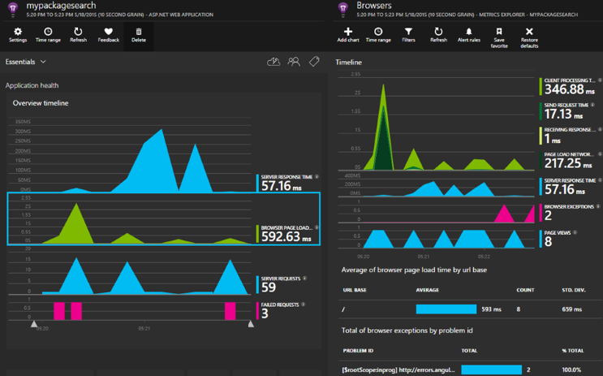

<properties 
    pageTitle="Approfondimenti applicazione per ASP.NET di base" 
    description="Monitorare le applicazioni web per la disponibilità, prestazioni e l'uso." 
    services="application-insights" 
    documentationCenter=".net"
    authors="alancameronwills" 
    manager="douge"/>

<tags 
    ms.service="application-insights" 
    ms.workload="tbd" 
    ms.tgt_pltfrm="ibiza" 
    ms.devlang="na" 
    ms.topic="article" 
    ms.date="08/30/2016" 
    ms.author="awills"/>

# Approfondimenti applicazione per ASP.NET di base

[Visual Studio applicazione che](app-insights-overview.md) consente di monitorare l'applicazione web per la disponibilità, prestazioni e l'uso. Con i commenti che viene visualizzato sulle prestazioni ed efficacia dell'app in azione, è possibile effettuare scelte consapevoli sulla direzione del progetto in ogni ciclo di vita di sviluppo.

È necessario un abbonamento con [Microsoft Azure](http://azure.com). Accedere con un account Microsoft, è possibile avere per Windows, XBox Live o altri servizi cloud Microsoft. Il team potrebbe avere un abbonamento aziendale a Azure: chiedere al proprietario di aggiungere in usando l'account Microsoft.

## Guida introduttiva

Seguire la [Guida introduttiva](https://github.com/Microsoft/ApplicationInsights-aspnetcore/wiki/Getting-Started).

## Tramite applicazione approfondimenti

Accedere al [portale di Microsoft Azure](https://portal.azure.com) e individuare la risorsa è creato per monitorare l'app.

In una finestra separata del browser, usare l'app per un po' di tempo. Verranno visualizzati i dati visualizzati nei grafici approfondimenti applicazione. (Potrebbe essere necessario fare clic su Aggiorna.) Non ci sarà solo una piccola quantità di dati mentre si sviluppano soluzioni, ma questi grafici sono realmente attivi quando si pubblica l'app e si dispone di più utenti. 

Nella pagina Panoramica sono indicati i tipi di grafici di prestazioni si è più facile interessare: tempi di risposta server, fase di caricamento di pagina e i conteggi relativi richieste non riuscite. Fare clic su uno di essi per vedere altri grafici e i dati.

Visualizzazioni nel portale rientrano in due categorie principali:

* [Metrica Explorer](app-insights-metrics-explorer.md) Mostra grafici e tabelle di metriche e i conteggi, ad esempio i tempi di risposta, guasti o metriche è necessario creare manualmente con l' [API](app-insights-api-custom-events-metrics.md). Filtrare e segmento i dati dai valori delle proprietà per ottenere maggiori informazioni sull'app e i relativi utenti.
* [Esplora ricerche](app-insights-diagnostic-search.md) sono elencati i singoli eventi, ad esempio richieste specifiche, eccezioni, tracce log o eventi create con l' [API](app-insights-api-custom-events-metrics.md). Filtrare gli eventi di ricerca e spostarsi tra gli eventi correlati per analizzare i problemi.
* [Analitica](app-insights-analytics.md) consente di eseguire query SQL sopra il telemetria ed è un potente strumento di analisi e diagnostico.

## Avvisi

* Viene visualizzato automaticamente [gli avvisi di diagnostici preventivo](app-insights-proactive-diagnostics.md) fornite informazioni sulle modifiche anomale riuscite e altre metriche.
* Configurare la [disponibilità test](app-insights-monitor-web-app-availability.md) per verificare il sito Web continuamente da parte del mondo e ottenere messaggi di posta elettronica come qualsiasi test ha esito negativo.
* Impostare [avvisi metrici](app-insights-monitor-web-app-availability.md) utili se metriche, ad esempio i tempi di risposta o tariffe eccezione passare limiti accettabili esterno.

## Ottenere ulteriori telemetria

* [Aggiungi telemetria alle pagine web](app-insights-javascript.md) per monitorare l'utilizzo di pagina e le prestazioni.
* [Dipendenze monitor](app-insights-dependencies.md) per verificare se resto, SQL o altre risorse esterne rallentano è.
* [Usare l'API](app-insights-api-custom-events-metrics.md) per inviare gli eventi e metriche per informazioni più dettagliate di prestazioni e l'utilizzo dell'app.
* [Verifica disponibilità](app-insights-monitor-web-app-availability.md) controllare l'app costantemente da tutto il mondo. 

## Apri origine

[Leggere e collaborazione per il codice](https://github.com/Microsoft/ApplicationInsights-aspnetcore#recent-updates)

